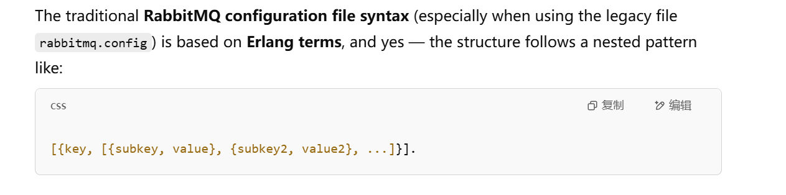
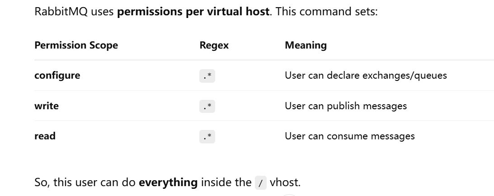
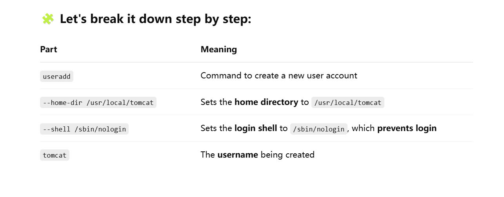
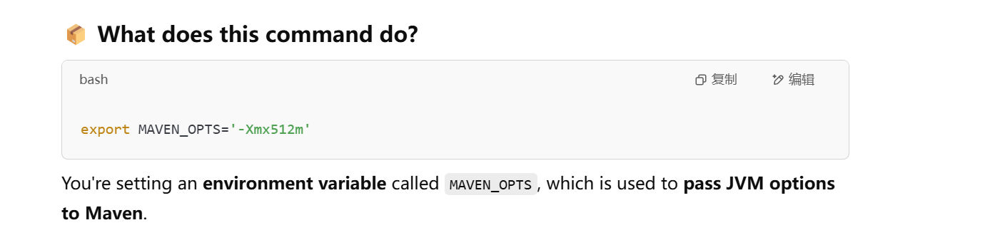

# VM-Setup
> [!important]
> First clone this repo: https://github.com/hkhcoder/vprofile-project
> 
> Then checkout to `local` branch
> 
> More details in other directories in Project-VProfile-Setup folder
> 


# MySQL Setup
## 1. Testing Communication between vm-box
> [!important]
> `ping app01 -c 4` it will send 4 packets from current vm-box(what you have logged in) to target vm-box(`app01`), if the current vm-box receives all 4 packets, then the connection is fine.


## 2. Update Packages of OS
> [!important]
> `dnf update -y` updates all your installed packages to their latest versions **automatically**, without asking for confirmation.
> - **`dnf`**: This is the **Dandified YUM**, the default package manager on many modern RPM-based Linux distributions (like Fedora, CentOS 8+, RHEL 8+). It's used for installing, updating, and managing software packages.
> - **`update`**: This tells `dnf` to upgrade all installed packages on the system to their latest available versions from the enabled repositories.
> - **`-y`**: This automatically **answers "yes"** to any prompts during the update process, so the update proceeds without requiring user interaction.
> 
> `dnf install epel-release -y`
> - **`epel-release`**: This is the package that enables the **EPEL (Extra Packages for Enterprise Linux)** repository. EPEL provides additional packages that are not included in the default RHEL/CentOS repos but are commonly used.


## 3. Initialize database
> [!important]
> `mysql -u root -p<password> <table> < <sql_file>`
```mysql
# example
mysql -u root -padmin123 accounts < src/main/resources/db_backup.sql
```


## 4. Firewall
> [!important]
> `# firewall-cmd --zone=public --add-port=3306/tcp --permanent`
> - **`#`**: This indicates you're running the command as **root** (or with `sudo`).
> - **`firewall-cmd`**: The command-line tool for interacting with **firewalld**, the dynamic firewall daemon.
> - **`--zone=public`**: You're modifying the **public zone**, which is a firewall zone that typically applies to untrusted networks (like the internet). Each zone can have its own rules.
> - **`--add-port=3306/tcp`**: This tells the firewall to **open port 3306** for **TCP traffic**.
> 	- Port `3306` is the default port used by **MySQL** (and MariaDB).
> - **`--permanent`**: This makes the rule **persist after a reboot**.
> 	- Without this flag, the rule is temporary and only lasts until the next restart.
> 
> 


# MemCache Setup
## Concept
> [!important] 
> **Memcached** is a **high-performance, in-memory key-value store** used for **caching data** to speed up web applications.
> 
> 🔑 Key Points:
> - Stores data **in RAM** for fast access.
> - Works like a **temporary data store** — data can expire or be evicted if memory is full.
> - Simple **key-value** structure (like a hash table).
> - Accessed over a **network protocol**, often by web apps or backend services.
> - Can be installed in centos using `sudo dnf install memcached -y`


## Important Commands
### add-port
> [!code]
```bash
firewalld-cmd --add-port=11211/tcp
firewalld-cmd --runtime-permanent # survive across reboot
```


### config memcached
> [!code]
> 
```bash
sed -i 's/127.0.0.1/0.0.0.0/g' /etc/sysconfig/memcached
```


### start memcached service
> [!code]
> 
```bash
memcached -p 11211 -U 11111 -u memcached -d
```


# RabbitMQ Setup
## Install Dependencies-rabbitmq server
> [!code]
> 
```bash
sudo dnf install wget -y 

dnf -y install centos-release-rabbitmq-38 

dnf --enablerepo=centos-rabbitmq-38 -y install rabbitmq-server 

# This command is equal to systemctl start <service-name>, then system enable <service-name>
systemctl enable --now rabbitmq-server
```


## Setup Access
> [!code]
> By default, rabbitmq comes with a default user and for security reasons, rabbitMQ restricts the guest user to only connect from localhost.
> 
> This behavior is controlled by the following line in `rabbitmq.config` file. Basically if you try to connect to rabbitmq with `guest` from another machine, it will fail unless you change this setting.
```erlang
%% Only allow the `guest` user to connect from 127.0.0.1 — block remote connections. %%
[{rabbit, [{loopback_users, [<<"guest">>]}]}].
```
> [!code]
> The following line will change the access pattern by removing `guest` user from the `loopback_users`(blocked users) array. Actually, the following line allows all user to connect remotely to the rabbitmq server.
> 
> 
```bash
sudo sh -c 'echo "[{rabbit, [{loopback_users, []}]}]." > /etc/rabbitmq/rabbitmq.config' 
```
> [!code]
> For security reason, we are creating a test user that has administrator permission.
```bash
sudo rabbitmqctl add_user test test

sudo rabbitmqctl set_user_tags test administrator
```
> [!code] Set Permissions
> 
```bash
rabbitmqctl set_permissions -p / test ".*" ".*" ".*"
```


# Tomcat Setup
## Useful Commands
> [!code] Create new user
> 
> 
> More generally, we can assign different shells to different users we create.
> 
> 
```bash
useradd --home-dir /usr/local/tomcat --shell /sbin/nologin tomcat
```


## Deploy Tomcat Service
### Tomcat Service File
> [!important]
> If you want to config a new service that `systemctl` can recognize as arguments. You should register it with root user in the `/etc/systemd/system` folder. For tomcat, you need to create a file with `vi /etc/systemd/system/tomcat.service`.
> 
> 
> 
```bash
[Unit] 
Description=Tomcat 
After=network.target 

[Service] 
User=tomcat 
Group=tomcat 
WorkingDirectory=/usr/local/tomcat Environment=JAVA_HOME=/usr/lib/jvm/jre Environment=CATALINA_PID=/var/tomcat/%i/run/tomcat.pid Environment=CATALINA_HOME=/usr/local/tomcat Environment=CATALINE_BASE=/usr/local/tomcat ExecStart=/usr/local/tomcat/bin/catalina.sh run ExecStop=/usr/local/tomcat/bin/shutdown.sh RestartSec=10 
Restart=always 

[Install] 
WantedBy=multi-user.target
```
> [!def]
> 
> 
> 
> Whenever you enable a service to start at boot by `systemctl start/ systemctl enable`, the systemd program will link it into `etc/systemd/system/multi-user.target.wants/` so that when the server vm is boot into the multi-user state, start all the services under this folder.

> [!important]
> 
> 


# Code Build & Deploy(app01)
> [!important]
> In order to use tomcat to run our source codes as a service, we have to package the source codes with maven.


## Important Commands
### JVM Config
> [!code] Config JVM 
> 
```bash
export MAVEN_OPTS="-Xmx512m"
```


### Delete default webapp
> [!important]
> After we run mvn install at the project root, we should get a `ROOT` folder in the `/usr/local/tomcat/webapps` folder, this contains the default tomcat application which we need to remove.
```bash
rm -rf /usr/local/tomcat/webapps/ROOT* 

cp target/vprofile-v2.war /usr/local/tomcat/webapps/ROOT.war 

systemctl start tomcat 

chown tomcat.tomcat /usr/local/tomcat/webapps -R 

systemctl restart tomcat
```


# Nginx Setup
## Activate Website
> [!important]
> 


# Automated Setup


