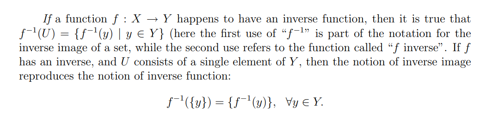

# Discussion
[dis01a-proof.pdf](https://www.yuque.com/attachments/yuque/0/2023/pdf/12393765/1677207052538-a1317cde-859d-4a77-b80c-07dd579bcb48.pdf)
[dis01a-sol.pdf](https://www.yuque.com/attachments/yuque/0/2023/pdf/12393765/1677207052752-9158d5bd-d5b2-4411-a001-bcbb3be08c89.pdf)
## 

## Proof Practice
> 

**(a) Direct Proof**
**(b) Proof by cases**
**(c) Set proof**⭐⭐⭐⭐⭐本题的一个重要结论: $A'\in P(A)\iff A'\subseteq A$

## Inverse Function & Images⭐⭐⭐⭐⭐
> 

### Definition
> **Inverse Image:**
> 
> **Inverse Function:**
> 

### Properties
> [https://math.stackexchange.com/questions/359693/overview-of-basic-results-about-images-and-preimages](https://math.stackexchange.com/questions/359693/overview-of-basic-results-about-images-and-preimages)
> [https://www.cs.odu.edu/~toida/nerzic/content/function/properties_of_inverse.html](https://www.cs.odu.edu/~toida/nerzic/content/function/properties_of_inverse.html)
> **Remarks:**
> 1. If $f:A\to B$is a bijection, then inverse function $f^{-1}$exists. Otherwise, inverse function doesn't exist, but the inverse image $f^{-1}(X)$ of any set $X\subseteq B$always exists. (A bit of messy notations).
> 2. If $f: A\to B$is a bijection and $f^{-1}$is its inverse function, then $f(f^{-1}(x))=x$and $f^{-1}(f(x))=x$always holds (Note that here $x$is en element). Let $X\subseteq A$, also $f(f^{-1}(X))=X$and $f^{-1}(f(X))=X$always holds(where $f^{-1}$is the inverse image, note that $X$is a set).
> 3. Generally for any function $f: A\to B$. Let $X\subseteq A$,$f(f^{-1}(X))=X$always hold but$f^{-1}(f(X))=X$ doesn't. One can prove it through counterexample. For a counter example,  Take `A= {1,2}`, `B={1}`, `X={1}`, `f:A->B` defined by `f(1)=1` and `f(2) =1`. Then `f(X) =f({1}) = {1}` and $f^{-1}(f(X))=f^{-1}(\{1\})= \{1,2\}$ (**here **$f^{-1}$**is the inverse image, defined on a specific set**), which does not equal x.

### Examples
> 

## Preserve Set Operations
> 

**Proof**

## Proof by contradiction
### Fermat's Contradiction
> 

**Proof**

### Counterexample
> 

**Proof**

# Assignment
[hw01-proofs.pdf](https://www.yuque.com/attachments/yuque/0/2023/pdf/12393765/1677207200584-657342d0-2da3-46c4-90df-80a742fa4488.pdf)
[hw01-sol.pdf](https://www.yuque.com/attachments/yuque/0/2023/pdf/12393765/1677207200584-8e665d7f-2250-42cb-9717-c37afcda4777.pdf)

## Calculus Review⭐⭐⭐
> 

**Solution**

## Propositional Practice⭐⭐⭐⭐⭐
> 

**Solution (a)**⭐⭐⭐
**Solution (b)**⭐⭐⭐⭐⭐
**Solution (c) ~ (f)**⭐⭐

## Tautologies&Contradictions
> 

**Solution**

## Prove or disprove
> 

**Solution (a)**
**Or we can prove by contrapositive:**
If $n^2+4n$is even, then $n$is even.
Since $4n$is even, then $n^2$is even, which means $n=2k,k\in \mathbb{Z}$, so $n$is even.
**Solution (b)**
**Solution (c)**
**Solution (d)**

## Twin Primes⭐⭐⭐
> 

**Solution (a) Proof by contrapositive**本题实际上是想证明这个`Implication`: $\forall x>3$, If $x$is prime, then it has to be in the form of $3k+1$or $3k-1$。

**Solution (b) Proof by cases**

## Social Network
> 

**Solution (a)**
**Solution (b)**

## Preserving Set Operations⭐⭐⭐⭐⭐
> 
> **注意：**
> 这里所有的$f^{-1}$都是`Inverse Image`而不是`Inverse Function`, 通常来说，`Inverse Image`对一个集合生效，比如$f^{-1}(A)$或者$f^{-1}(B)$, 哪怕这个集合里面只有一个元素，我们也不能写成元素的形式$f^{-1}(x)$（因为这样的话$f^{-1}$就表示`Inverse Function`， 而且$f^{-1}(x)$可能根本不存在）, 而要写成$f^{-1}(\{x\})$的形式，这样至少结果是一个$\emptyset$。
> **下面是几个常用的思路:**
> 1. 如果$x\in f^{-1}(A)$, 这表明$x$是能够映射到$A$中的某个元素的，也就是说$f(x)\in A$。
> 2. 如果$f(x)\in A$, 表明$x$能够映射到$A$中的某个元素，那么$x\in f^{-1}(A)$
> 3. 证明诸如$f^{-1}(A\cdot B)=f^{-1}(B)$的时候，我们一般会任取$x\in f^{-1}(A)$ (这里我们任取的是$x$, 因为$f^{-1}$代表我们实际上是在`Domain`里面取值)
> 4. **证明诸如**$f(A\cdot B)=f(A)\cdot f(B)$**的时候(**$\cdot$**表示任意集合运算符)，我们一般有两种思路:**
>    1. 任取$x\in A\cdot B$ , 然后利用等价关系$f(x)\in f(A\cdot B)$进行论证, 详见`7(d) LHS`
>    2. 任取$y\in f(A)\cdot f(B)$, 然后从定义出发根据$\exists x\in X$($X$is some sets), $y=f(x)$进行论证, 详见`7(d) RHS`
> 
**进一步说，下面的转换恒成立:**
> 1. $x\in A$和$f(x)\in f(A)$( 严格来说是$f(\{x\})\in f(A)$)是等价的。
> 2. $x\in f^{-1}(A)$和$f(x) \in A$( 严格来说是$f(\{x\}\in A)$)是等价的。($f^{-1}$是`Inverse Image`)
> 
**总的来说**，我们不能直接对某个元素使用$f^{-1}$, 比如$f^{-1}(x)$, 这要求$f$是`Bijection`, 但是我们可以对某个集合使用$f^{-1}$, 比如$f^{-1}(A)$，表示`Inverse Image`。但是我们可以对某个元素使用$f$, 比如$f(x)$，这是没有问题的，只要$x$在$f$的`domain`中就可以。

**Solution (a)**
**Solution (b)**
**Solution (c)**
**Solution (d)**⭐⭐⭐⭐⭐
**Solution (e)**⭐⭐
我们在证明`RHS`的时候需要注意，如果我们采用和`7(d) RHS`中一样的证明方法的话，我们会取$y\in f(A)\cap f(B)$, 此时根据定义我们有: $\exists x\in A, y=f(x)\land \exists x\in B, y=f(x)$, 但是我们不能说$\exists x\in A\cap B,y=f(x)$, 万一$A\cap B=\emptyset$就不成立了，下面我们给出反例。
假设我们定义$A=\{1,2\}, B=\{3,4\}$, 且$f(1)=1,f(2)=1, f(3)=1, f(4)=2$, 此时$f(A)=\{1\}$, $f(B)=\{1,2\}$, 此时$f(A)\cap f(B)=\{1\}$, 但是$A\cap B=\emptyset$, 也就是$f(A\cap B)=\emptyset$, 所以此时$\exists y\in f(A)\cap f(B),~~s.t.~~y\notin f(A\cap B)$, 于是$f(A)\cap f(B) \subseteq f(A\cap B)$不成立, 于是我们找到了一个`Counterexample`。
**Solution (f)**⭐⭐
> **本题中最重要的结论就是:**
> 1. Inverse Image preserves set operations.
> 2. Image doesn't necessarily preserve set operations.

