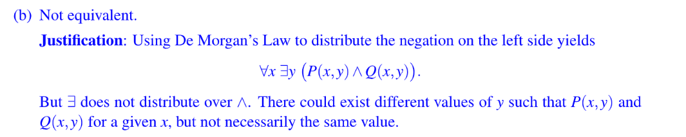
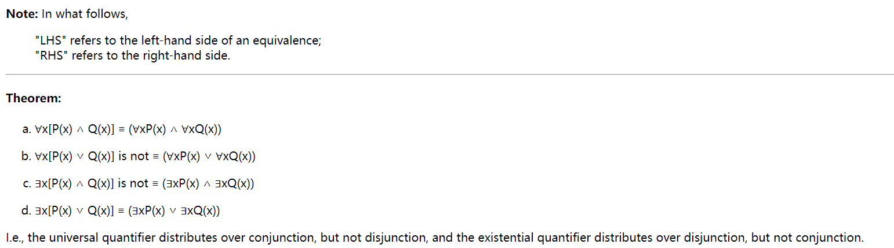
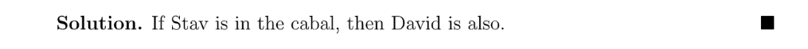
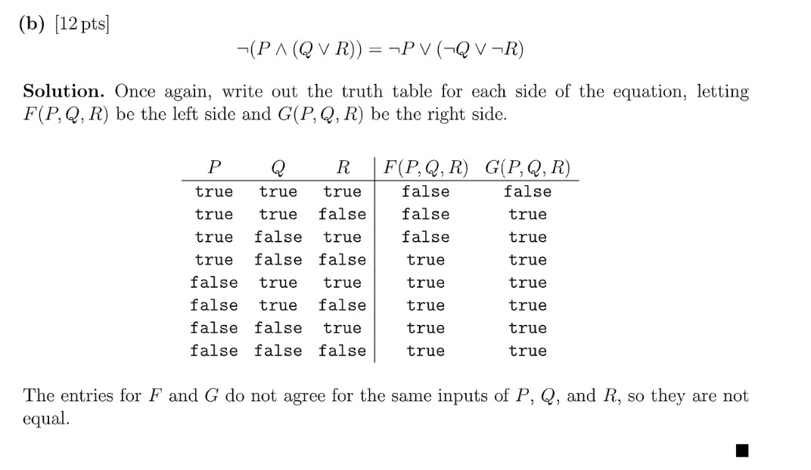
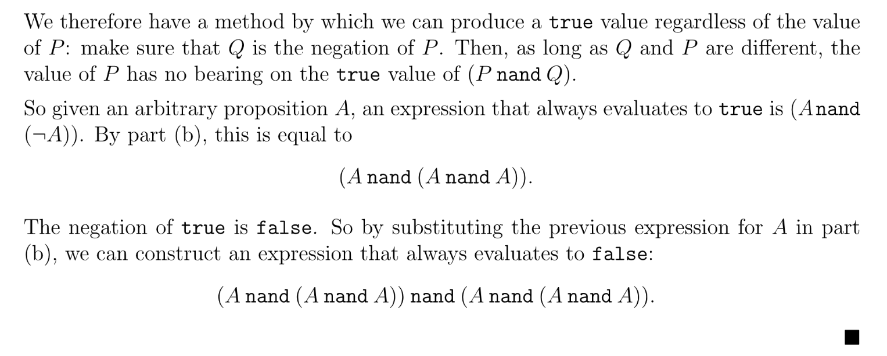

# Discussion
[dis0-intro.pdf](https://www.yuque.com/attachments/yuque/0/2023/pdf/12393765/1677206525629-7df8c6ff-3456-4cdb-b0a3-d3c3a39db36d.pdf)
[dis0-sol.pdf](https://www.yuque.com/attachments/yuque/0/2023/pdf/12393765/1677206525625-1c55a566-5198-4bcb-80d6-924f9bcb925e.pdf)

## Valid Implication
:::info

关于`Antecedent`的定义: [MIT6.042J](https://www.yuque.com/alexman/ac5oth/ituqhhgf15yydsh3#s8rGB)
:::
**Solution**$(a), (c)$永远是对的，即这个`Implication`是`Valid`的。
$(b)$不一定总是对的，即是`Satisfiable`的。
 

## Equivalences with Quantifiers⭐⭐⭐⭐⭐
:::info

**Prereq:**

:::
**(a) Logical Equivalence**Not equivalent. 
Since$P\implies Q$is logically equivalent to $\neg P\lor Q$
左侧`Predicate`是$\forall x ((\exists y Q(x,y))) \implies P(x))$等价于$\forall x (\neg(\exists y Q(x,y))) \lor P(x))$, 这又等价于$\forall x (\forall y(\neg Q(x,y))) \lor P(x))$, 等价于$\forall x \forall y(\neg Q(x,y) \lor P(x))$。
右侧`Predicate`是$\forall x \exists y (Q(x,y) \implies P(x))$等价于$\forall x \exists y (\neg Q(x,y) \lor P(x))$
所以左右不一致。

`Linguistic Explanation`中其实对右侧做了一个逻辑等价，是把右侧看做是$\forall x \exists y (\neg Q(x,y) \lor P(x))$来解释的。
要注意$\forall x ((\exists y Q(x,y))) \implies P(x))$中我们的$\forall x$后面跟着的不是$(\exists y (Q(x,y) \implies P(x))$, 而是$( (\exists yQ(x,y)) \implies P(x))$, 如果是前者，则上述逻辑是一致的，可以直接去掉括号。如果是后者，就不一致了。
**(b) Existential Quantifier doesn't distribute over AND **⭐⭐⭐⭐⭐$\neg\forall x\exists y (P(x,y)\implies Q(x,y))$等价于$\forall x \exists y \neg (P(x,y)\implies \neg Q(x,y))$, 进一步等价于$\forall x \exists y \neg (\neg P(x,y)\lor \neg Q(x,y))$, 这最终等价于$\forall x \exists y ( P(x,y)\land Q(x,y))$(By De Morgan's Law)。但是$\exists y(P(x,y)\land Q(x,y))$是不等价与$\exists yP(x,y)\land \exists yQ(x,y)$的(后面提供证明)，于是逻辑不等价。

**(c) Showing Equivalence by cases **⭐⭐⭐
:::info
**Distributive Law of Quantifiers**

:::
**Proof**
:::info
判断`Logical Equivalence`: 可以`Proof by cases`, 比如$P\land (Q\lor R)$和$(P\land Q)\lor (P\land R)$之间的`Logical Equivalence`, 我们可以对$P$分类讨论:

1. $P$是`T`，则$P\land (Q\lor R) = Q\lor R$,  $(P\land Q)\lor (P\land R)=Q\lor R$, $Q$和$R$的细节不用讨论了，因为反正连表达式都一样了。
2. $P$是`F`，则$P\land (Q\lor R) =  F$, 且$(P\land Q)\lor (P\land R)=F\lor F=F$

换句话说，我们不需要列出完整的$2^3$行的`Truth Table`就可以完成`Logical Equivalence`的论证。
:::

## XOR⭐⭐⭐
:::info

:::
**1 DNF or CNF**
这三种表示法可以参考 [DNF&CNF](https://www.yuque.com/alexman/ac5oth/sionedh8wybff7sl#vcmMf) 中的思路。
**2 Prove the Implication**
我们也可以使用`Prove by cases`:
首先从前一题中我们知道$A\oplus B\iff (A\lor B)\land (\neg A \lor \neg B)$，我们对$A$进行分类讨论：

1. $A=T$, 则$(A\lor B)\land (\neg A \lor \neg B)=T\land \neg B=\neg B$, 而$A\lor B=T$, 我们又知道`Implication`$P\implies Q$中，如果$Q=T$, 则$P\implies Q$就一定是$T$, 不管$P$是对是错。因此$(A \oplus B) \implies (A\lor B) \iff\neg B\implies T$ , 而这一定是对的。
2. $A=F$, 则$(A\lor B)\land (\neg A \lor \neg B)=B\land T=B$, $A\lor B=B$, 而$B\implies B$也一定是对的，毕竟从逻辑等价性上看$B\implies B\iff \neg B\lor B$, 后者一定是$T$, 所以前者也一定是$T$。从实际含义来看，我们知道了$B$, 一定就知道了$B$, 这实际上是一个`Tautology`。
**3 Prove the implication**

## Truth Table
:::info

:::
**(a)**
**(b)**
**(c)**

# Recitation
[MIT6_042JF10_rec01.pdf](https://www.yuque.com/attachments/yuque/0/2023/pdf/12393765/1673961755963-f17be269-b859-4a84-8be5-1b420188ebc0.pdf)
[MIT6_042JF10_rec01_sol.pdf](https://www.yuque.com/attachments/yuque/0/2023/pdf/12393765/1673961756125-a87e894d-1f75-49a8-a15d-552121f5020e.pdf)
## Notes
### Proving Implication with Predicate
:::info

:::
**Proof**

## Translation Practice
:::info

:::
**(1) At least three**There are at least three course staff who are in the cabal.
**(2)**At least one of Stav and David is not in the cabal.
**(3)**If either Martyna or Patrice is in cabal, then all course staff are in cabal.

**(4)**If Stav is in cabal, then David is in cabal.
**(5)**If Darren is in cabal, then Martyna is in cabal.
**(6)**If either Oscar or Nick is in cabal, then Tom is not in cabal.
**(7)**If either Oscar or David is in cabal, then Marten is not in cabal.

## Be a detective
:::info

:::

# Assignment
[MIT6_042JF10_assn01.pdf](https://www.yuque.com/attachments/yuque/0/2023/pdf/12393765/1673961702566-63d26b48-6aa7-4a47-94a1-4b0847ba5ed4.pdf)
[ps1-sol.pdf](https://www.yuque.com/attachments/yuque/0/2023/pdf/12393765/1673961702560-dedc2397-ecce-4486-80d9-65fc10bfd363.pdf)

## P1 Translation to Logic
:::info

:::
**(a)**⭐⭐⭐⭐⭐
**(b)**⭐⭐⭐
因为句子里没有说：满足$\neg (T(x)\land S(x))$的人到底拿没拿$A$, 所以说他们拿$A$也行，没拿$A$也行，即这个`Implication`总是有道理的，总是`evaluates to True`的。所以我们要在这里用`Implication`。
从语法的角度考虑，`who are 6.042 TA's and have taken 6.042` 这个定语从句是加载了`All people`后面，表示在所有人里面，满足这个定语的人都拿了$A$, 这里显然有一个假设的语气存在，所以需要使用`if`对人进行一些过滤。如果使用$\land$就会导致句子的意思变成`All people are 6.042TA's and have taken 6.042 and got A's in 6.042`.
**(c)**⭐⭐⭐
首先我们需要取反，即`There exists someone who are 6.042 TA's and did not get A's in 6.042`, 这里的定语`who did not get A's`加在`TA`后面，所以我们用$\land$表示这是对这个特定存在的人进行多重修饰。意思是，存在一个`...`样的人。没有前面一题的过滤关系。
**(d)**⭐⭐⭐⭐

## P2 Truth Table
:::info

:::
**(a)**
**(b)**

## P3 Logic Operator - Nand⭐⭐⭐⭐⭐
:::info

:::
**(a) Using nand and neg to express other logic**
**(b) Using only nand to express other logic**⭐⭐⭐⭐⭐
不一定要使用$B$的。
**(c) Interesting**⭐⭐⭐
:::info
本题中我们了解到了`nand`的妙用:
对于任意的`Proposition Variable``P`, $P~~nand ~~P=\neg P$
我们可以仅仅使用$nand$和$\neg$来表示常见的一些逻辑门，比如`AND GATE`和`OR GATE`，也可以表示`Implication`逻辑。
:::

## P4 Detect the fake coin
:::info

:::
**Solution - Bi-section**我们可以将$12$枚硬币先均分成两组$A,B$（每组六个硬币），然后测出更轻的那组$A$，然后在把$A$均分成两组$C,D$， 每组$3$枚硬币，然后测出更轻的那组$C$, 最后随机挑两个称重，如果两个一样重则另一个是假的，否则轻的那个是假的。这样我们要测$3$次。
**Solution - Tri-section - Better**

## P5 Prove by contrapositive
:::info

:::
**Proof**

## P6 Prove by Cases
:::info

:::
**Proof**
