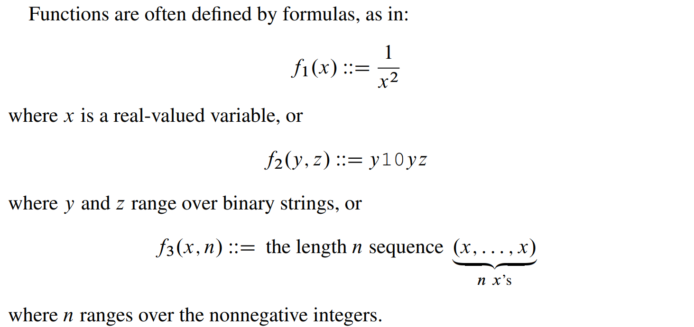

[MIT6_042JS15_Binary Relations.pdf](https://www.yuque.com/attachments/yuque/0/2023/pdf/12393765/1674132762878-ea937b7b-de21-4435-8315-6335cc79249f.pdf)

# 1 Functions
## Domains and Images
:::info

:::
**Examples**
**Partial& Total Function**

**Functions applied on a set**
**Range and Image**

## Function Composition
:::info

:::

# 2 Binary Relations
[MIT6_042JS16_Relations_Slides.pdf](https://www.yuque.com/attachments/yuque/0/2023/pdf/12393765/1674724735604-e5b5023b-802e-4b70-bf4b-31f47c9fbb7e.pdf)
:::info

:::

## Definition
> 
> `Function is a special case of binary relation`。

**Explanations**
**Binary Relation vs Function Definition**
**Staff Example**

## Relational Diagrams
**Relation Diagrams - arrow out property**
:::info

:::
**Example**

## Relational Images
:::info

:::
**Example**

## Inverse Relations and Images
:::info

:::
**Example**

## Inverse Function & Inverse Images
> 

### Definition
> **Inverse Image:**
> 
> **Inverse Function:**
> 

### Properties
> [https://math.stackexchange.com/questions/359693/overview-of-basic-results-about-images-and-preimages](https://math.stackexchange.com/questions/359693/overview-of-basic-results-about-images-and-preimages)
> [https://www.cs.odu.edu/~toida/nerzic/content/function/properties_of_inverse.html](https://www.cs.odu.edu/~toida/nerzic/content/function/properties_of_inverse.html)
> **Remarks:**
> 1. If $f:A\to B$is a bijection, then inverse function $f^{-1}$exists. Otherwise, inverse function doesn't exist, but the inverse image $f^{-1}(X)$ of any set $X\subseteq B$always exists. (A bit of messy notations).
> 2. If $f: A\to B$is a bijection and $f^{-1}$is its inverse function, then $f(f^{-1}(x))=x$and $f^{-1}(f(x))=x$always holds (Note that here $x$is en element). Let $X\subseteq A$, also $f(f^{-1}(X))=X$and $f^{-1}(f(X))=X$always holds(where $f^{-1}$is the inverse image, note that $X$is a set).
> 3. Generally for any function $f: A\to B$. Let $X\subseteq A$,$f(f^{-1}(X))=X$always hold but$f^{-1}(f(X))=X$ doesn't. One can prove it through counterexample. For a counter example,  Take `A= {1,2}`, `B={1}`, `X={1}`, `f:A->B` defined by `f(1)=1` and `f(2) =1`. Then `f(X) =f({1}) = {1}` and $f^{-1}(f(X))=f^{-1}(\{1\})= \{1,2\}$ (**here **$f^{-1}$**is the inverse image, defined on a specific set**), which does not equal x.

### Examples
> 

# 3 Finite Cardinality
:::info

:::

## Definition
:::info

:::

## Surj/inj/bij
:::info

:::
**Arrow Proof of 1,2**

**Arrow Proof of 3**

**Converse of Lemma 4.5.3.1**
:::info

:::

## Subsets of finite Sets
:::info

:::
