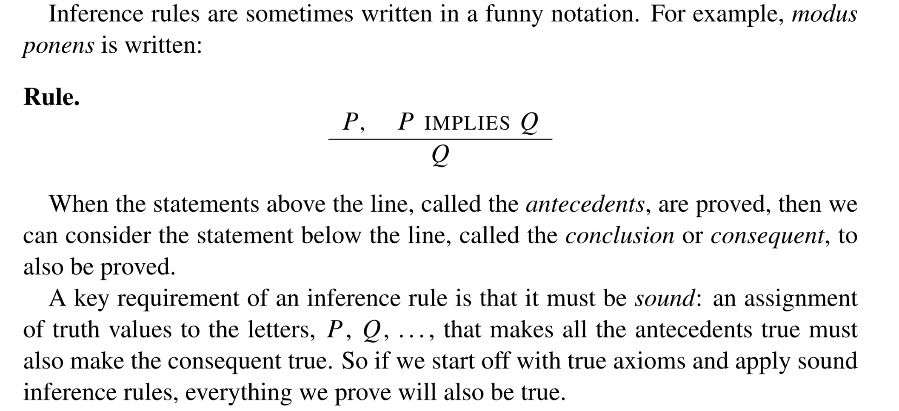
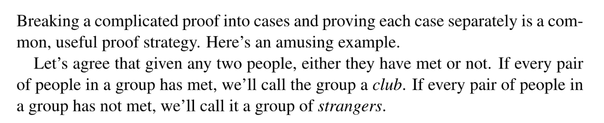
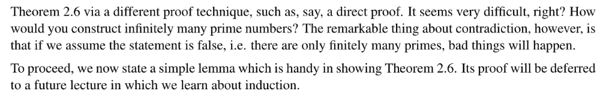
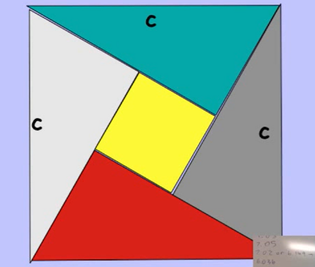
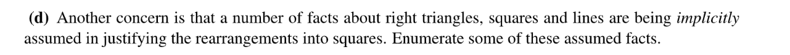
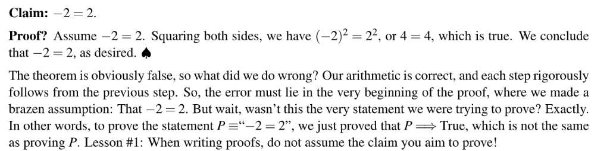

> Mathematics for Computer Science Chapter 2

[lec-2-handout.pdf](https://www.yuque.com/attachments/yuque/0/2023/pdf/12393765/1677206621976-6217c156-5b2d-4470-9962-e1a7ac5a4254.pdf)
[Proofs.pdf](https://www.yuque.com/attachments/yuque/0/2023/pdf/12393765/1677206622008-367ad310-43e9-48b2-b281-4ec4345ebdf2.pdf)

# Notations 
## Set
> 

## Divides
> 
> 对于$a|b$来说，我们有$a\leq b$这个关系恒成立。

## Definition
> 

## Summary
> 

# The Axoimatic Method
## Theorems/Lemma/Corallary
> 

## ZFC Axioms⭐⭐⭐
> Zermelo-Fraenkel with Choice(ZFC) axioms. 
> 
> `Axioms are assumed to be true`:
> **Ex:** If a=b, b=c, then a=c

## Logical Deductions
> **Inference Rules&Modus Ponens:**
> 

**Examples of (not) sound inference rules**

# Patterns of Proof
## Direct Proof
> 

### Definition
> 

### Divide by 9 Example
> 

**Proof**
> 

**Proof**
> 

### Divide by 11 Example
> 

**Proof**
> 

**Proof**

> 

> 

## Proof By Cases
### Social Network Example
> 

### Irrational -> rational Example
> 

**Proof by cases**

### No rational solution
> 

**Proof by cases**

## Proof By Contradiction
> 

### Definition
> 
> **Remarks:**
> 1. 想要证明`If P holds, then Q holds`实际上就是在证明$P\implies Q$是`True`(因为`P`和`Q`都是`True`的, `holds`就是`True`的意思)。
> 2. 通过`Proof by contradiction`我们可以证明$\neg P\implies\neg R\land R=False$是`True`的, 即$True\implies P$是`True`的， 那么$P$只能是`True`了。
> 3. 这是因为`Implication`的`Non-consequences`性质(也叫`Modus Ponens Rule`)：对于一个`Implication`$p\implies q$来讲，如果$p$和$p\implies q$都是`True`的话，那么$q$就一定是`True`。

### Infinite prime numbers⭐⭐⭐⭐⭐
> 

**Proof**
> 

### Irrational number
> 

**Proof 1**
**Proof 2**

## Java Logical Expression
> 
> Prove by cases that this logic is equivalent to the following:
> 

**Proof by cases**

# Proving an Implication
> 

## Method 1-Direct Proof
> 

**Example**
**Logic Flow:**

**Formal Proof:**

## Method 2- Contrapositive
> 

**Example**

### Definition
> 

### Divide by odd Example
> 

**Proof by contrapositive**

### Lemma
> 

**Proof**

### Pigeonhole Principle
> 

**Proof by contrapositive**

## Method 3 - Contradiction
> 对于$P\implies Q$来说，他等价于$\neg P\lor Q$, 其`Contradiction`是$\neg(\neg P\lor Q)= P\land\neg Q$, 所以我们只需要在$P\land\neg Q$的基础上推演，推矛盾即可。
> 一旦$P\land\neg Q=F$, 则$\neg P\lor Q=T$, 则原`Implication`为`T`。

# Proving "If and only if"
## Method 1- Bi-directional
> 

## Method 2- Construct a Chian of Iffs
> 

**Example**

##  In-class Proofs
[In-Class Questions Session 1.pdf](https://www.yuque.com/attachments/yuque/0/2023/pdf/12393765/1673960544818-4dd9a8fc-d5b4-4378-93d8-d3d256fa4f99.pdf)

### Pythagorean Theorem - Proof By Picture
> 

### Ambiguity causes problems
> 
> (a):$\sqrt{-1}\sqrt{-1}=(\sqrt{-1})^2$不一定成立，因为我们知道$-1$有两个虚根$i,-i$, 即$\sqrt{-1}=i~~or~~-i$, 所以这里会造成歧义。
> (b): Consequence of $1=-1$, then $\frac{1}{2}=-\frac{1}{2}$, then $2=1$(亚里士多德的三段论)
> 

# Prove Logic Equivalence
> 假设我们要证明$n$个`Statements`: $P_1,P_2,\cdots, P_n$, 则: 我们只需要证明$P_1\implies P_2, P_2\implies P_2,\cdots, P_{n-1}\implies P_n, P_n\implies P_1$即可。

# Common errors in proof
## Lesson 1: Never assume the claim
> 

## Lesson 2: Divide by zero
> 

## Lesson 3: Negative numbers with inequality
> 

# ADT - Sets
[MIT6_042JS15_Sets.pdf](https://www.yuque.com/attachments/yuque/0/2023/pdf/12393765/1674101624967-76b223a7-1c2a-4965-ad1d-635d1169f4e4.pdf)

## Definition
:::info

:::

## Some popular Sets
:::info

:::

## Set Builder Notation
:::info

:::

## Set Relations
:::info

:::

## Sets Operations
:::info

:::
### Subset
:::info

:::

### Proper/Strict Subset
:::info

:::

### Union
:::info

:::

### Intersection
:::info

:::

### Set Difference
:::info

:::

### Complements
:::info

:::

### Cross Product
:::info

:::

## Power Set
:::info

:::

## Cardinality
:::info

:::

## Sequences
:::info

:::

## Quick Question
:::info

:::

# Proof about Sets
## Prove Set Equalities
:::info

:::
**Remarks**

## *Russell's Paradox and the Logic Sets

## *ZFC Axioms
