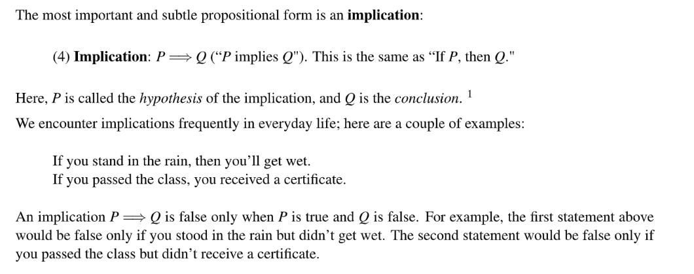
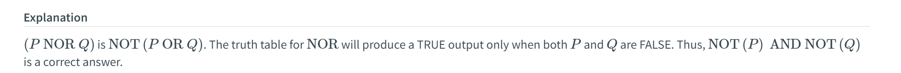
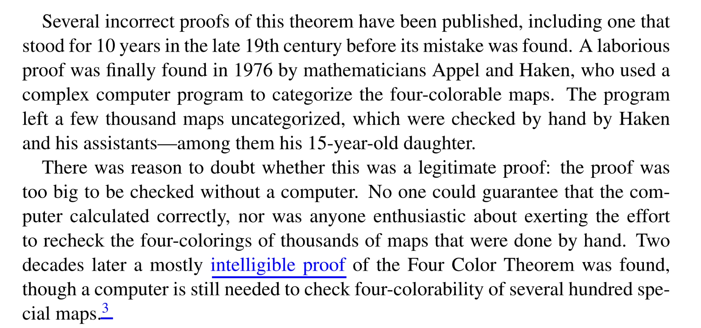
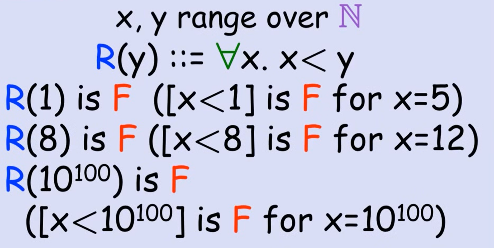
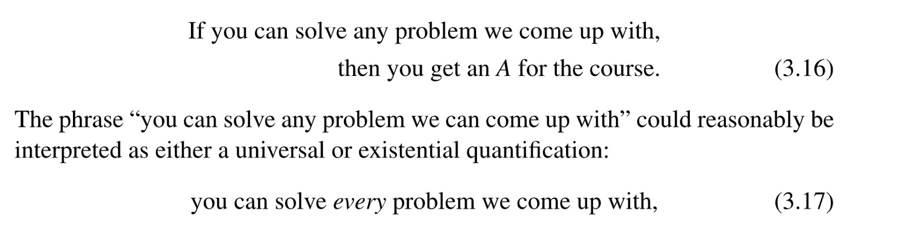
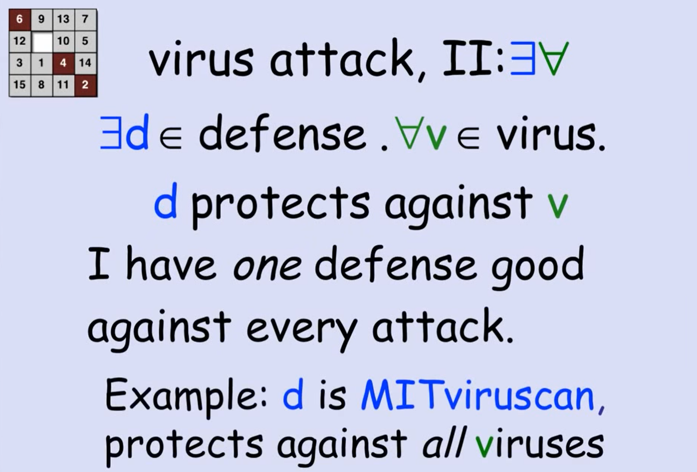
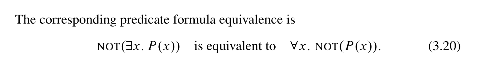
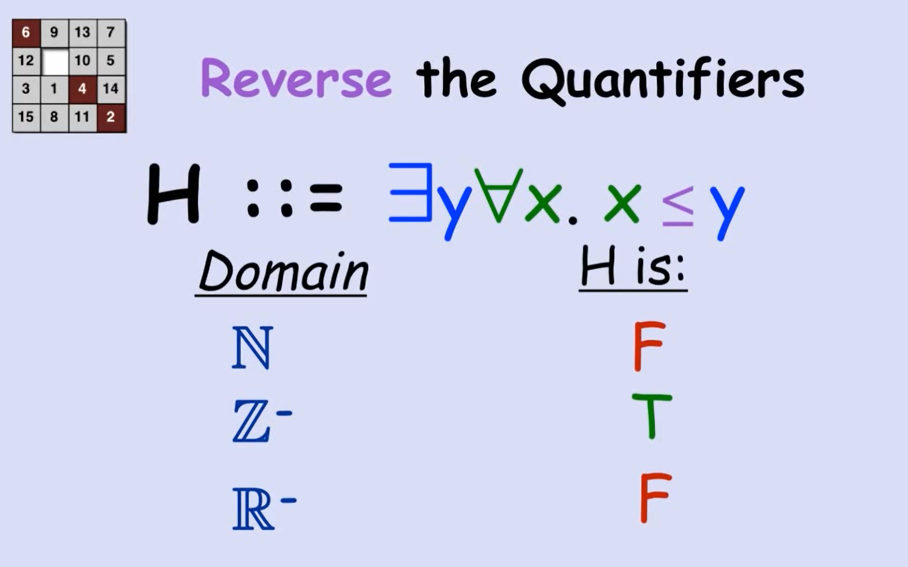
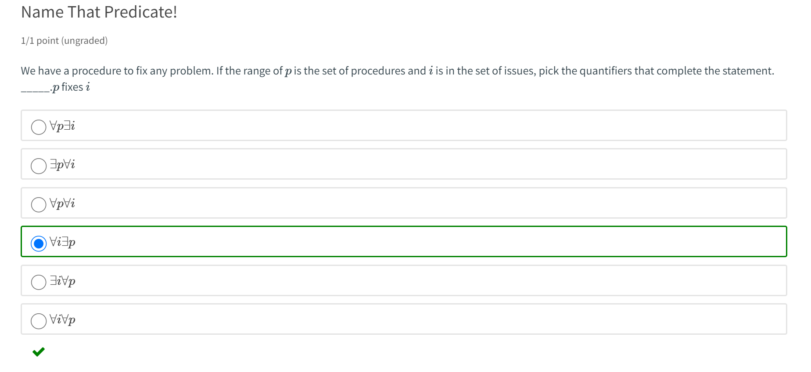
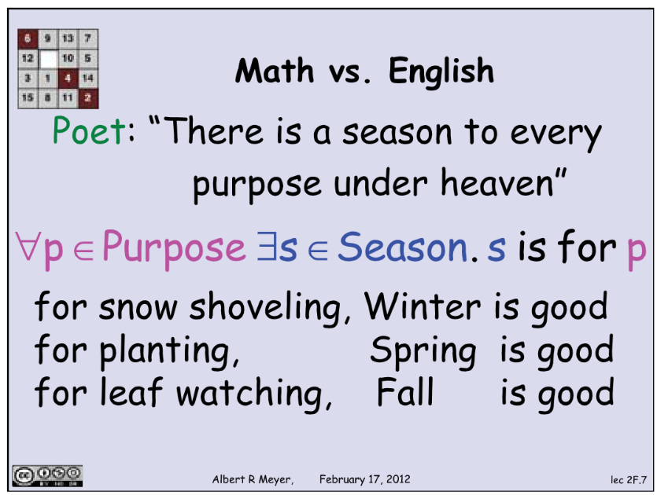

> Mathematics for Computer Science Chapter 1

[UCB_Propositional Logic.pdf](https://www.yuque.com/attachments/yuque/0/2023/pdf/12393765/1677206299049-a8f318ae-9d27-4e1b-87df-bed95a40f6ec.pdf)
[lec-1-handout.pdf](https://www.yuque.com/attachments/yuque/0/2023/pdf/12393765/1677206475592-784ab4e4-feb5-43fd-9090-0c61108a70b1.pdf)
# 1 Propositions
## Definition
> 

## Examples
**Simple Examples**
> 

# 2 Compound Propositions
[Logic&Propositions.pdf](https://www.yuque.com/attachments/yuque/0/2023/pdf/12393765/1673956676952-91fcc65b-347e-4399-b109-2fd18c2a3aaf.pdf)
[MIT6_042JS16_Propositional_Logic_Slides.pdf](https://www.yuque.com/attachments/yuque/0/2023/pdf/12393765/1674008049566-e89011cf-5117-4595-8eb9-1773d1ab8cad.pdf)
## Propositional Variables
> 
> 我们看到下面的这个`Statements`:
> **If** **all humans are mortal** **and all Greeks are human**, **then** **all Greeks are mortal.**
> 我们会经常使用`P`表示 `All humans are mortal`, 用`Q`表示`all Greeks are human`, 用`R`表示`all Greeks are mortal`, 这样组成的`Compound Proposition`就变成了`If P and Q, then R`。
> 上述的`P`, `Q`, `R`称为`propositional variables`, 和`propositions`一样，`P``Q``R`只能取值`T` (true) and `F` (false). `Propositional variables` 也被称为 `Boolean variables` after their inventor, the nineteenth century mathematician George—you guessed it—Boole.

## Logic Operators
:::info
 Mathematicians use the words `NOT`, `AND`, and `OR` for operations that change or combine propositions.  The precise mathematical meaning of these special words can be specified by truth tables  
:::
### NOT
:::info
If `P` is a proposition, then so is `NOT P` and the truth value of the proposition, `NOT P` is determined by the truth value of `P` according to the following truth table:  

:::

### AND
:::info

XOR 表示P和Q中只能有一个是正确的，but not both.
:::

### OR
:::info

:::

### XOR
:::info

:::

### Implies
#### Definition
> 

**True Implication(ft is T)**
**True Implication(ff is T)**
**False Implication(tf is the only F)**

#### False Hypotheses⭐⭐⭐
> 

### IFF
> 

**Example**

### Simplified Notations
:::info

:::
**Example**

## 
## Propositional Forms
> 

## Implication⭐⭐⭐⭐⭐
> 

## Logically Equivalent Implications
### Contrapositive
:::info
我们看下面两句话:
If I am hungry, then I am grumpy. 
If I am not grumpy, then I am not hungry.
如果我们用`Propositional Variables`去表示的话，假设:
`P`: I am hungry
`Q`: I am grumpy
则上面的句子可以翻译成:
If P, then Q. ($P\implies Q$)
If NOT(Q), then NOT(P). $\neg Q\implies \neg P$

这两句句子互为`Contrapositive`
:::

### Converse
:::info

Thus, an implication is logically equivalent to its contrapositive but is not equivalent to its converse.
:::

### Implies + Converse = IFF
:::info

:::

## Applications in Computer Programs
> 

## Digital Logic
### Ripple Carry Organization
:::info

$a_5a_4a_3a_2a_1a_0$表示第一个数, $b_5b_4b_3b_2b_1b_0$表示第二个数，$d_i=a_i+b_i+c_{i-1}$表示求和进位后的结果，$c_i$表示当前位的进位与否。`Full Adder`表示当前运算单元有三个`Inputs`, `Half Adder`表示当前运算单元只有两个`Inputs`。
:::

### Half Adder
:::info

只有当当前数位都是$1$时，$c$才等于$1$。
:::

### Full Adder
:::info

:::

# 3 Algebra of Propositions
## Distributive Law of AND over OR
:::info

:::

## Distributive Law of OR over AND
:::info

:::

## DNF and CNF
:::info

:::

### DNF
:::info

**步骤:**

1. 列出`Truth Table`
2. 找出结果为`True`的行, 括号内用`AND`连接，且将表中`False`的字母上面取反
3. 括号间用`OR`连接。
:::

### CNF
:::info
**步骤:**

1. 列出`Truth Table`
2. 找出结果为`False`的行, 括号内用`OR`连接，且将表中`True`的字母上面取反
3. 括号间用`AND`连接。
:::

## Proving Equivalences - Algebra
### Laws of propositions
:::info
我们可以使用`Truth Table`来证明`Propositions`的`TRUE`或者`FALSE`, 但问题是，假设一个`Propositional Form`中有$n$个变量，则我们的`Truth Table`需要枚举$2^n$行，这无疑很浪费时间，于是我们可以使用一些代数关系来简化判断过程。

:::
**Example**我们以`NOT((A AND B) OR (A AND C))`为例，运用上述技巧将其表示成`DNF`:

1. `Demorgan's Law`: `NOT(A AND B) AND NOT(A AND C)`
2. `Demorgan's Law to inner parts`:$(\overline{A}\lor \overline{B})\land(\overline{A}\lor\overline{C})$
3. `Distributive Law`: $((\overline{A}\lor \overline{B})\land\overline{A})\lor((\overline{A}\lor \overline{B})\land\overline{C})$
4. `Distributive Law`: $((\overline{A}\land \overline{A})\lor(\overline{B}\land \overline{A}))\lor((\overline{A}\land \overline{C})\lor(\overline{B}\land \overline{C}))$
5. `Get rid of duplicate items`: $(\overline{A}\lor(\overline{B}\land \overline{A}))\lor((\overline{A}\land \overline{C})\lor(\overline{B}\land \overline{C}))$
6. `Using Associativity for OR`: $\overline{A}\lor(\overline{B}\land \overline{A})\lor(\overline{A}\land \overline{C})\lor(\overline{B}\land \overline{C})$
7. `Use Validity for OR and Identity for AND`: $\overline{B}\land \overline{A}\iff (\overline{B}\land \overline{A})\land(C\lor\overline{C})$
8. `Distributive Law`: $(\overline{B}\land \overline{A})\land(C\lor\overline{C})\iff((\overline{B}\land \overline{A})\land C)\lor ((\overline{B}\land \overline{A})\land\overline{C})$

### Theorems
:::info

**We claim the formulas are equivalent iff they have the same sorted disjunctive normal form.**

:::

## Proving Equivalences - Lukasiewicz
### Lukasiewicz's Proof System
:::info

:::
**Example**

## Common Logic Equivalence
:::info
$P\implies Q$: $\neg P\lor Q$
$P\iff Q$: $(P\land Q)\land (\neg P \land \neg Q)$

$P~~XOR~~ Q$: $(P\land \neg Q)\lor (\neg P \land Q)$

$P~~NOR~~Q$(和$OR$的`Truth Table`完全相反):  $\neg P \land \neg Q$

:::

## SAT Problem
:::info

:::

# 4 Equivalence and Validity
## Truth Assignment
:::info

:::
**Example**
`Assignment`写在逻辑符号正下方，表示`Evaluation Result`

## Definition of IFF
:::info

:::

## Equivalence
### Implication = Contrapositive
> 

### Implication不一定等价于Converse
> 

### Implication&Convese = Iff
> 

## Validity and Satisfiability
### Valid Formula
> 

### Validity&Logic Equivalence
> 

### Satisfiable Formula
> A **satisfiable formula** is one which can** sometimes be true**—that is, there is some assignment of truth values to its variables that makes it true.
> 

## Soundness
:::info

:::

# 5 Predicates
## Definition
:::info
Most of the examples of propositions that we have considered thus far have been straightforward in the sense that it has been relatively easy to determine if they are true or false. At worse, there were only a few cases to check in a truth table. 
Unfortunately, not all propositions are so easy to check. That is because **some propositions may involve a large or infinite number of possible cases.**

:::
**Prop 1.1.3**
**Prop1.1.4 Euler's Conjecture**
**Prop 1.1.5**
**Prop 1.1.6 Four Color Theorem**
**Prop 1.1.7 Fermat's Last Theorem**
**Prop 1.1.8 Goldbach's Conjecture**
**More Examples**

## Predicate Calculus Validity
### Proof by Validity
> 

### Prove by Counter Model⭐⭐⭐⭐⭐
> 

### Proving Example⭐⭐
> 

**Proving By Validity - Valid **⭐⭐⭐⭐
**Proving By Counter Model - Not Valid**

## Predicate Calculus Satisfiability
> 

**More on Satisfiabilbity**
**Example**

# 6 Quantifiers
[MIT6_042JS16_Predicate_Logic_1.pdf](https://www.yuque.com/attachments/yuque/0/2023/pdf/12393765/1674008049426-6a6be537-94c7-4f67-9173-13c9a619da78.pdf)
[MIT6_042JS16_Predicate_Logic_2.pdf](https://www.yuque.com/attachments/yuque/0/2023/pdf/12393765/1674008049415-88b52b93-9239-498d-8c6b-1fe0795e0e39.pdf)
[MIT6_042JS16_Predicate_Logic_3.pdf](https://www.yuque.com/attachments/yuque/0/2023/pdf/12393765/1674008049192-b20ba694-14ac-40f0-9d31-08c51fb8c299.pdf)

## Basics
### For All = AND
> 

### Exists = OR
> 

## Types of Quantifiers

### Existential Quantifier
> 

### Universial Quantifier
> 

### Always& Sometimes
> 
> **Specifically: **
> - An assertion that a predicate is always true is called a **universal quantification.**
> - An assertion that a predicate is sometimes true is an **existential quantification.**

**Example**

### Mixing Quantifiers
> 

**Virus Attack - For all virus, find one  => Expensive**
**Virus Attack - Exists virus, for all => Efficient**

### Negating Quantifiers (Demorgan's Law)
> The general principle is that moving a NOT across a quantifier changes the kind of quantifier.
> 

## 

### Remark
> 当`Quantifier`的数量小于`Proposition Variables`的数量时，我们称这时候的`Proposition`是`Predicates`(`depends on at least one variables`)。
> 而当`Proposition`中没有需要指定值的`Variables`时，就是`Proposition`。

## Order&Domain of Quantifiers
### 选取Domain
> 

### 交换Quantifiers
> 
> 可以看到，交换`Quantifiers`之后同样的`Predicate`就不一定成立了。
> 

## Power & Limits of Logic
:::info

`Propositional Formula`我们可以使用`Truth Table`和`Inference Rules`来证明正确与否
`Quantified Predicate Formula`则不行。`Predicate Calculus is undecidable`
:::

## Quick Exercises
### Math vs English
:::info

注意这里的`Quantifiers`不能交换。
:::
:::info

注意$\forall x \forall y \neg(Q(x,y))$可以通过将$\neg$逐级向左移出得到和$\neg (\exists x \exists y Q(x,y))$相同的结果。
:::

### Domain of discourse
:::info

:::
**Explanation**

### Predicate Logic Equivalence
:::info

:::
**Explanation**

# 7 Translation Tips⭐⭐⭐⭐⭐
:::info
在我们从英文翻译到`Predicates`的时候，`Alternating Quantifiers`会对`English`的含义产生一定程度的曲解。比如下面的两个例子:

1. "There is a season to every purpose under heaven". 如果我们将`season`和`purpose`作为`Proposition Variables`, 那么我们有两种解读:
   1. $\exists s\in Season, \forall p\in Purpose, s~~is~~for~~p.$
   2. $\forall p\in Purpose, \exists s\in Season, s~~is~~for~~p.$

那么哪一种解读是正确的呢，我们来看$a$, 他说的是存在一个季节，咱们干什么都行。这显然有问题，因为对任意一个季节，我们都有干不了的事情，比如夏天我们无法滑雪。再来看$b$, 说的是，如果我们想干一节事情，总有一个季节适合，这显然是正确的解读。而这两种解读的差别仅仅在于交换了`Quantifiers`的顺序，所以我们需要注意。

2. "All that glitters is not gold" (闪光的并不总是金子, 也就是有些金子不发光)这句话也会产生相同的效果。如果我们将`something glitters`看做`G(x)`, `is gold`看做`Au(x)`，则我们又有两种解读:
   1. $\forall x, G(x) \implies NOT(Au(x))$所有闪光的都不是金子。错误
   2. $NOT(\forall xG(X)\implies Au(x))$不是所有闪光的都是金子。正确

后一种是正确的解读。

:::

## Translate "at least n"
:::info

意思是说，至少存在三个不同的整数满足$P(x)$, 上面的`Predicate Formula`在三个整数不同且均满足$P(x)$的时候才为`True`, 也符合句子本身的意思。
:::

## Translate "at most n"
:::info

**Typo:**
`At most three distinct`应该是: $\exists x\exists y\exists z\forall d:(x\neq y\land y\neq z\land x\neq z\land(P(d)\implies d=x\lor d=y\lor d=z))$, 上面漏了不等式限定条件。
**Remarks:**
这个`Predicate Formula`非常值得思考。很多人会问，为什么这里的两个`Formulas`都要使用`Implication`而不是$\land$呢？
**这个问题我们可以从**`**Truth Table**`**的角度来考虑，我们对两种表达方式进行分析:**

1. 意思是，如果已经存在三个整数满足$P(d)$了，那么第四个整数必须和前三个当中的至少一个相同。同时，如果第四个整数$d$不满足$P(d)$, 那么也符合我们`At most three`的意思，那么此时我们的`hypothesis`都是`False`的，那么我们的`Implication`就是`True`，也就符合原句的意思了。所以如果我们使用$\land$的话，如果$d$不满足$P(d)$整个`Predicate`就会变成`False`了，这和原意背道而驰。
2. 意思是，如果我们有四个互不相同的整数，那么$P(x)$一定不会对这四个整数同时满足。如果这四个整数不是完全不同的，也就是至少有两个整数是相同的，此时也符合`at most three`的意思，所以整个`Predicate Form`应该是`T`(`Antecedant`是`F`, 且`Conclusion`也是`F`), 于是我们用`Implication`才能表达出这层意思来。
:::

## Translate "exactly n"
> 比如下面的例子:
> `There are exactly three distinct real solutions to f(x)=0`, 首先写出我们的`Predicate`, 令$P(x)$表示$x$是$f(x)=0$的解。
> 则:
> 1. `At least three`: $\exists x \exists y\exists z:(x\neq y\land y\neq z\land x\neq z\land P(x)\land P(y)\land P(z))$
> 2. `At most three`: $\exists x\exists y\exists z\forall d:(x\neq y\land y\neq z\land x\neq z\land(P(d)\implies d=x\lor d=y\lor d=z))$
> 3. `Exactly three`: $\exists x\exists y\exists z:((x\neq y\land y\neq z\land x\neq z\land P(x)\land P(y)\land P(z))\land (\forall d ,P(d)\implies d=x\land d=y\land d=z)$

