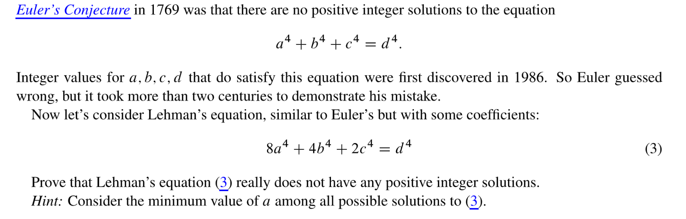
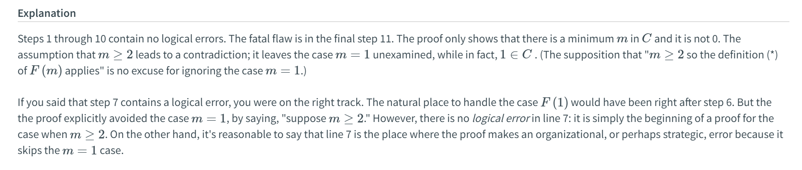
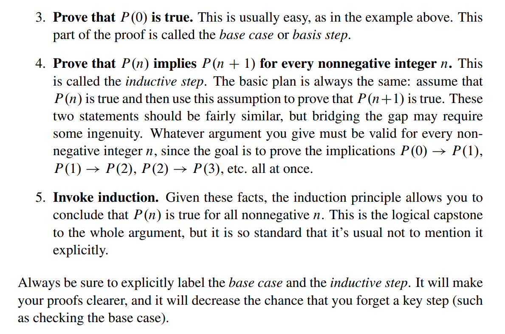
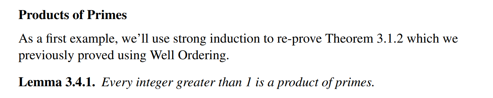
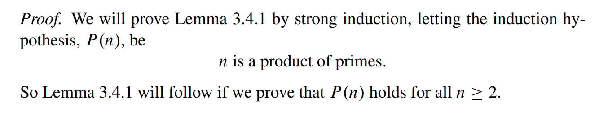
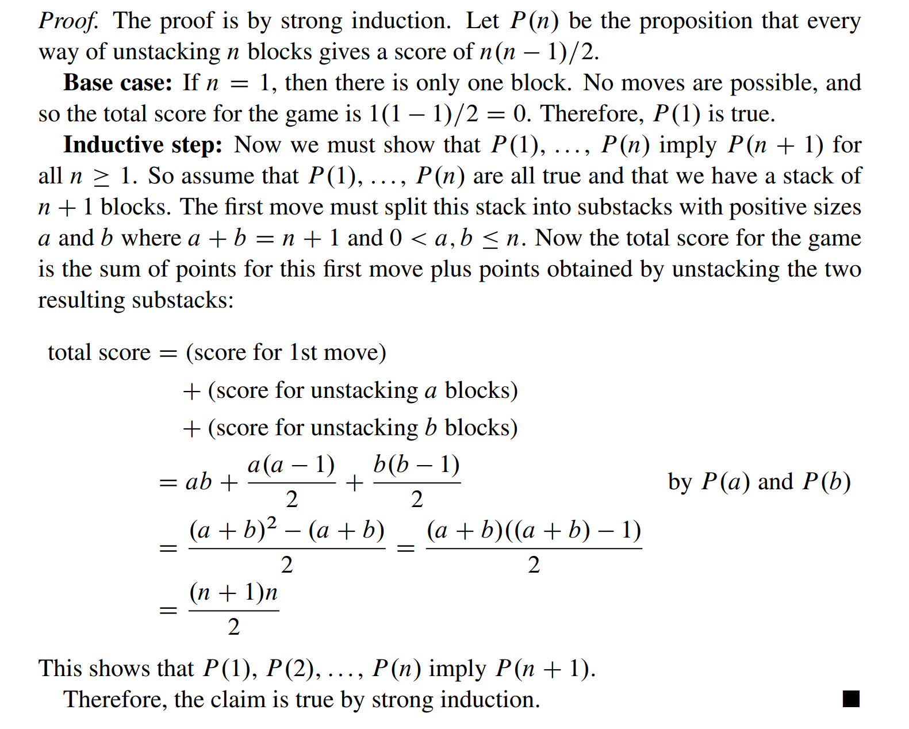

> Mathematics for Computer Science Chapter 3

[lec-3-handout.pdf](https://www.yuque.com/attachments/yuque/0/2023/pdf/12393765/1677206930276-dd93ab5f-7b26-452a-8fda-e67ab12487fc.pdf)
[Mathematical Induction.pdf](https://www.yuque.com/attachments/yuque/0/2023/pdf/12393765/1677206930276-e3912825-a856-47cb-a863-c9430de122d2.pdf)
# 1 Welling Ordering Principle
## Theorem Statement
> 
> In order to show that a set $S$is well-ordered, we can show that every subset of $S$has a minimum element.

## Prove Irrational
> 我们可以使用`Welling Ordering Property`来证明$\sqrt{2}$是无理数。
> 

## Proof Structure
> 

## Application of the proof structure
### Formula for summation
> 

**Proof By Well-ordering principle**

### Factors into primes
> 

**Proof by well ordering principle**

### Well Ordered Postage
> Available Stamps: stamps with value of$5$and $3$
> $n$is postal if can make $n+8$postage from $3$and $5$stamps
> **Thm: Every number **$n$**is postal.**

**Proof**Suppose that "every number is postal" is not true(这一步非常关键，这保证了的非空性，这样才能使用`Well Ordering Principle`). 假设, 则is not empty。根据`Well Ordering Principle`, 我们假设是`Least Element that is not postal`, 所以`is postal`。
因为时，, 时，且时，, 所以，于是, 所以。
所以是`Postal`, 所以是`Postal`, 这个`isn't postal`是矛盾的，于是得证。

### Geometric Sum
> **Thm:**$1+r+r^2+r^3+\cdots r^n=\frac{r^{n+1}-1}{r-1}$holds for $n\in \mathbb{N}$

**Proof**假设是我们的`Counterexample Set`，根据`Well-ordering principle`, 是最小的元素使得`Thm`不成立。
因为时，左侧, 右侧, 即左侧右侧。
所以, 所以, 且满足`Thm`的等式，也就是说:

然后等式两边加上, 所以: , 这表明也满足`Thm`, 这与我们开头的立论是矛盾的。所以得证。

## In-class Problems
[In-class problems session 3.pdf](https://www.yuque.com/attachments/yuque/0/2023/pdf/12393765/1674124932399-d19f7924-18fb-4014-9dd1-aaedb00daf6d.pdf)

### P1 Fill in the Logic
> 

**Sample Solution(By showing that P(n) is a contradiction)**
1. 假设命题不成立，即is not empty.
2. 根据`Well-Ordering Property`, 我们知道是中最小的元素。
3. 因为时，, 所以, 且

 时，, 所以, 且

4. 如果成立，则成立。如果成立，则成立，所以推出矛盾。

### P2 Sum of square
> 

**Proof(By showing P(n) is a contradiction)****Claim:** 

1. 假设`Claim`不成立，则is not empty
2. 根据`Well Ordering Principle`, 
3. 因为时，`Claim`成立，所以, 于是, 于是时`Claim`成立。
4. 代入`Claim`中我们有: , 两边同时加上得到 , 这表明时`Claim`是成立的。而这和矛盾。

### P3 Lehman's Equation
> 

**Proof(Medium, by showing smaller contradiction)**

### P4 Bit Envelopes
> 

**Proof**

### P5 Sum of Integers
> 

**Proof**是最小的不能被表示成的线性组合的整数
因为, 所以, 所以
所以能被表示成的线性组合, 于是也能，即能，这推出矛盾。

## Exercises
### E1 Well Ordering Proof
> 

### E2 Well Ordered Set
> 

**Explanation**

### E3 Fibonacci Sequence
> 

**Explanation**

# 2 Ordinary Induction
## Rule for ordinary Induction
:::info

:::

## Inference Rule for Induction
:::info

:::

## Proof Structure
:::info

:::

## Simple Induction Example
:::info

根据`Inference Rule`, 我们只要证明:

:::
**Analysis**
**Complete Proof**

## Induction vs Welling Ordering Principle
:::info

:::

# 3 Strengthening Induction⭐⭐⭐⭐⭐
## Simple Example 1
> 

**Weak Hypothesis**
**Strong Hypothesis**

## Simple Example 2
> 

**Failed Induction**
$\sum_{i=1}^k\frac{1}{i^2}=1+\sum_{i=2}^k \frac{1}{i^2}<1+\sum_{i=2}^k\frac{1}{i(i-1)}=2-\frac{1}{k}<2$, 所以$\sum_{i=1}^k\frac{1}{i^2}$其实根本不会等于$2$。
此时$\sum_{i=1}^k\frac{1}{i^2}+\frac{1}{(k+1)^2}<2-\frac{1}{k}+\frac{1}{(k+1)^2}<2$
所以我们的`Inductive Hypothesis`其实也是有点问题的。
**Successful Induction**
`Exercise`:两边同乘以$k+1$后，得到 $-1-\frac{1}{k}+\frac{1}{k+1}\leq -1$, 成立。

## Coutyard Tiles
:::info
下面的例子非常重要，他阐释了我们可以通过`Induction analysis`来`Strengthen Induction`, 能够在得到一个更强的结论的同时证明原来的结论。
:::
**Problem Settings**

**Doomed Induction - Too Weak Induction**
**Successful Induction - Stronger Induction**

## When and Why to Use?
> 

# 4 Invariants⭐⭐⭐
## What are invariants?
:::info
One of the most important uses of induction in computer science involves proving that a program or process preserves one or more desirable properties as it proceeds. **A property that is preserved through a series of operations or steps is known as an invariant. **
Examples of desirable invariants include:

- A variable **never exceeding** a certain value
- The altitude of a plane **never dropping below** 1,000 feet without the wingflaps and landing gear being deployed
- The temperature of a nuclear reactor n**ever exceeding the threshold** for a meltdown.

**We typically use induction to prove that a proposition is an invariant.**
In particular, we show that the proposition is true at the beginning (this is the base case) and that if it is true after `t` steps have been taken, it will also be true after step t+1 (this is the inductive step). We can then use the induction principle to conclude that the proposition is indeed an invariant, namely, that it will always hold.  
:::

## Diagonally-Moving Robot Example
:::info

:::
**Induction Analysis - Figuring out the predicate**
**Inductive Proof**

## The Invariant Method
:::info

:::

## Puzzle Problems
### Problem Settings
:::info

:::
**Graphic Interpretations**

### 8-puzzle
:::info

:::

## Proof for puzzle problem
### Goal theorem
:::info

:::

### Lemma 3.3.4 Row Move
:::info

:::

### Lemma 3.3.5 Column Move
:::info

:::

### Definition of inversion pair
:::info

:::
**Examples**

### Lemma 3.3.7 # of inversion pairs
:::info

:::

### Corollary 3.3.8 Unchangeable Parity
:::info

:::

### Lemma 3.3.9 Odd parity of inversion
:::info

:::
**Proof**

### Proof of the goal theorem
:::info

:::

# 5 Strong Induction⭐⭐⭐⭐⭐
## Strong vs Ordinary Induction
:::info

:::

## Rule for Strong Induction
:::info

:::
**Remarks**

## Examples
:::info
本质上我们要在$P(k)(0\leq k\leq n)$的假设上验证$P(n+1)$的正确性，通常我们可以`Proof by Cases`, 在下面的例子中可以看到。
:::
### Product of Primes
:::info

:::
**Proof**
> 
> 如果使用`Simple Induction`的话，我们手上的条件只有$P(41)$: 41 is a product of primes。因为$42$是合数且$42=6\times 7$, 所以$41\times 42 = 41\times 6\times 7$, 但是我们不知道$6$和$7$是不是Product of primes.

### Making Change
:::info

:::
**Proof**

### The Stacking Game
:::info

:::
**Theorem and Proof**

# 6 False Proofs
## A Bogus Proof⭐⭐⭐⭐⭐
:::info

:::
**Bogus Proof**

