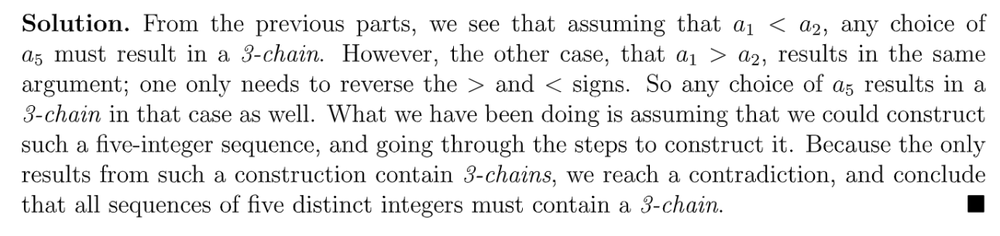
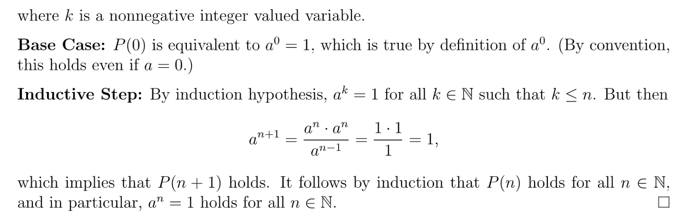

# 0 Dicussion
[dis01b-induction.pdf](https://www.yuque.com/attachments/yuque/0/2023/pdf/12393765/1677207119402-a7db25a6-8d31-4300-8241-ba153ae8b96b.pdf)
[dis01b-sol.pdf](https://www.yuque.com/attachments/yuque/0/2023/pdf/12393765/1677207119410-a7d9b07f-e1e2-453c-812f-2759ccadabaa.pdf)

## Induction
> 

**(a) Proof by ordinary Induction**
**(b) Proof by ordinary Induction**$\leq$表示$<$或者$=$, 所以如果我们在证明中出现$<$, 我们仍然可以把它当做是$\leq$的一种情况。

## Strengthened Induction
> 

**(a)**
**(b)**

## Strong Induction ⭐⭐⭐⭐⭐
> 

**Proof**
> 

# 1 Recitation
[MIT6_042JF10_rec02.pdf](https://www.yuque.com/attachments/yuque/0/2023/pdf/12393765/1674723935683-7f734e70-e0bf-46bd-8d49-7c79497997db.pdf)
[MIT6_042JF10_rec02_sol.pdf](https://www.yuque.com/attachments/yuque/0/2023/pdf/12393765/1674723935815-90b4f09d-574a-4f75-8858-ffd80f0b1c51.pdf)

## Notes
> 

## P1 Geometric Series
> 

**Solution with well-ordering principle**首先我们定义`Predicate`: 令$P(n)$为$1+r+r^2+\cdots r^n = \frac{1-r^{n+1}}{1-r}$, 现在假设我们要证明的命题是$P(n)~~is~~True,~~\forall n\in \mathbb{N}$, 我们考虑其反面, 即$\exists n\in\mathbb{N},~~s.t.~~P(n)~~is ~~False$。
那么我们定义一个集合$C=\{n\in \N| NOT(P(n))~~is~~True\}$, 则根据我们的`反面`，这个集合是非空的，那么根据`Well-Ordering Principle`，这个集合$C$一定有一个最小的元素，不妨设为$c$, 那么我们现在可以通过两种方法得到矛盾:

1. 证明$c\notin C$
2. 证明$\exists t<c,~~s.t. ~~P(t) ~~is ~~False$

我们采用第一种方式, 我们发现当$n=0$的时候，$P(0)$是`True`, 所以$n\notin C$, 于是$c>0$, 更进一步我们有$c\geq 1$, 即$c-1\geq 0$, 而$c-1<c$, 于是根据$c$的定义($c$是最小的使得$P(n)$为`False`的整数值)，于是$P(c-1)$时`True`。
所以我们有:
$1+r +r^2+\cdots r^{c-1} = \frac{1-r^{c-1+1}}{1-r}=\frac{1-r^c}{1-r}$
我们在等式两边都加上$r^c$，得到：
$1+r +r^2+\cdots r^{c-1} +r^c=\frac{1-r^c}{1-r}+r^c=\frac{1-r^{c+1}}{1-r}$
这表明$P(c)$is `True`, 这和我们的假设$P(c)$is `False`是矛盾的，于是我们推得了矛盾，所以原命题成立。

**Solution with induction**

## P2 Induction
> 

**Conclusion**
> 

**Theorem with proofs**

# 2 Assignment
[MIT6_042JF10_assn02.pdf](https://www.yuque.com/attachments/yuque/0/2023/pdf/12393765/1674723997477-91d1c0a1-6303-4a11-bcda-13fdfa37ebec.pdf)
[ps2-sol.pdf](https://www.yuque.com/attachments/yuque/0/2023/pdf/12393765/1674723997466-cc231d29-01b5-496a-85a8-b07614e35730.pdf)

## P1 Proof by contradiction
> 

**Solution (a) Proof by contradiction**We prove by contradiction, 假设$a_3 \geq a_1$:

**Solution (b) Proof by contradiction**
**Solution (c) Proof by cases**
**Solution (d) Proof by contradiction**
更一般的，假设我们要证明的`Proposition`是$P$, 则我们`Proof by contradiction`也就是假设$\neg P$是正确的（我们可以构造出$a_1,a_2,\cdots, a_5$满足不含有`3-chain`）, 然后在这个前提下我们按理说可以构造出一种，记为$R$, 但是在构造的过程中我们得到了$\neg R$(有三个元素形成了`Chain`), 那么我们就有$\neg P\implies R\land \neg R=False$是`True Implication`, 取其`Contrapositive`得到$True\implies P$为`True`)。 于是原命题得证。

## P2 Induction
> 

**Well Ordering Principle**⭐在使用`Well Ordering Principle`的几个注意：

1. 首先要说明我们的`Counterexample Set`是非空的。
2. 然后才能在非空集上使用`Well-Ordering Principle`。

**Ordinary Induction**

## P3 Invariant Proof - Perimeter
> 

**Proof by invariant**`Edge`就是连接任意两个`squares`的想象出来的边。
而`Perimeter Edge`就是下图中的样子, 只有一端是有`infection`的，哪怕`Edge`有一端在$n\times n$格点范围外也是算一个`Perimeter`的。

如果$n\times n$格点全部是`infected`, 现在假设$n=2$, 则：

`Perimeter Edges`总数为$4\times 2=8$。所以我们可以得出对于$n\times n$来说有$4n$个`Perimeter Edges`的结论。

## P4 Bogus Induction⭐⭐⭐⭐⭐
> 

**Solution**

## P5 Strong Induction
> 

**Proof by Strong Induction**这里之所以要用`Strong Induction`是因为我们在证明$P(n+1)$时需要利用$P(n)$和$P(n-1)$。比如在证明$P(2)$的时候需要利用$P(0)$和$P(1)$。

> 一般`Strong Induction`都会从$P(n)$的定义域开始假设，比如我们要证明:
> $P(n)$对所有$n\geq 2$成立
> 那么我们的`Inductive Step`一般就从$P(2)$开始，一直假设到$P(n)$都成立，然后证明$P(n+1)$。

## P6 Puzzle Invariant⭐⭐⭐⭐⭐
> 

**Solution (a)**
**Solution (b)**
**Solution (c)**
**Solution (d)**⭐⭐⭐⭐⭐`Flip the parity`就是说奇偶性对调，详细请看下面的例子：

**Solution (e) Prove by Induction**
**Solution (f)**

## P7 Strengthening Induction⭐⭐⭐⭐⭐
> 

**Proof**
