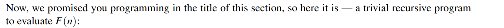
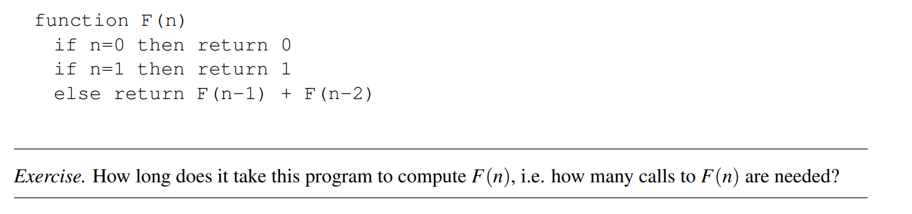
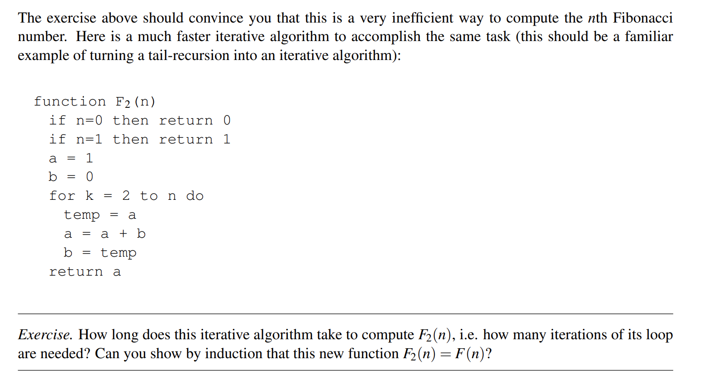
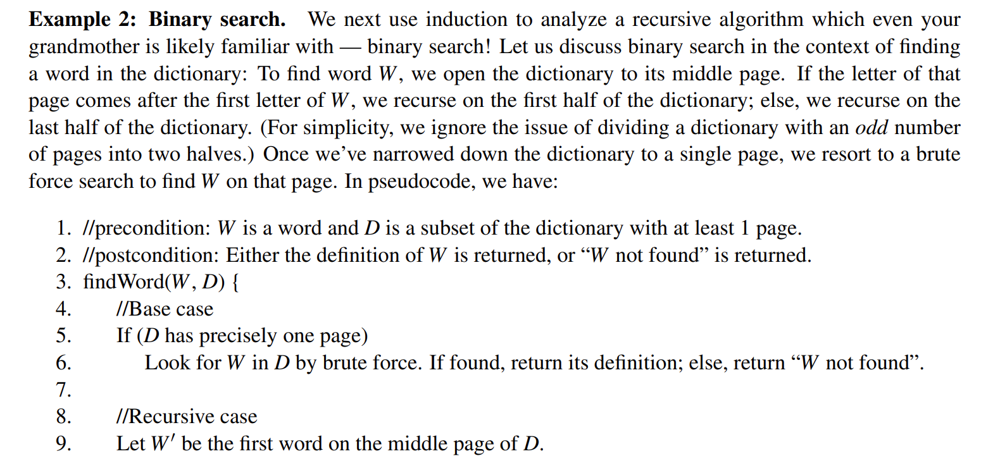
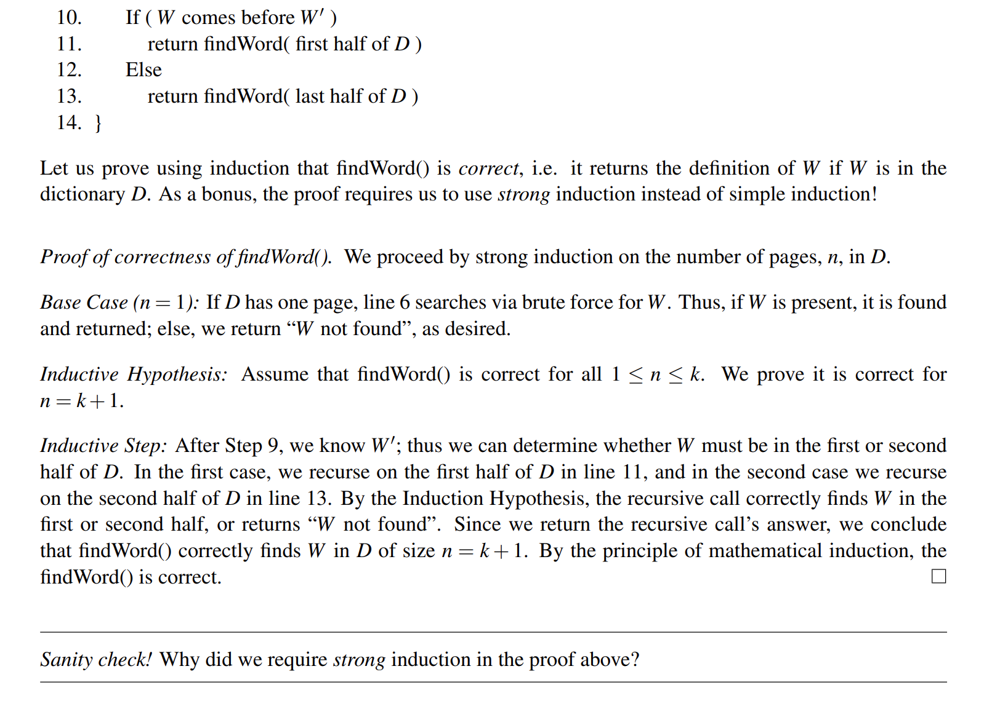

# Fibonacci
## Exponential Time Version
> 
> 我们需要$2^n$次调用。

## Linear Time Version
> 
> Linear Time w.r.t the size of n.

**Proof of Equalness - Strong Induction****Base Case:** $n=0,1$。By the algorithm, $F_2(0)=F(0)=0, F_2(1)=F(1)=1$, 所以成立。
**Inductive Hypothesis:** $1\leq n\leq k$，假设$F_2(n)=F(n)$成立。
**Inductive Step: **$n=k+1$**, **$F(k+1)=F(k-1)+F(k)=F_2(k-1)+F_2(k)=F_2(k+1)$
$F_2$中，$b$是上一个结果，$a$是当前结果。

# Binary Search
> 
> 因为$n=k+1$依赖于$findWord(n//2)$的结果, 所以需要`Strong Induction`。

# Resources
> **Fa20 Note 3**

