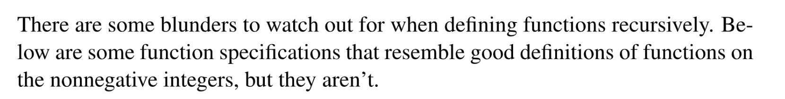

# 1 Structural Induction
> [!overview]
> 

## Recursive Data Types
> [!important]
> 

## Strings of brackets
### Definition
> [!def]
> 

### RecMatch - Set of matched brackets
> [!def]
> 

## Arithmetic Expression
> [!overview]
> 

### Defintion
> [!def]
> 

### Expression Parsing
> [!example]
> 
> 具体的`Parsing`过程可以参考[CS61A Project4](https://www.yuque.com/alexman/ac5oth/uwldsn8kedec0mt5)

## Sturctural Induction on RDT
> [!example]
> 

# 2 Functions on RDT
## Quick Review of Functions
> [!overview]
> 

## Recursively-Defined Functions
### Evaluation Function for Arithmetic Expression
> [!def]
> 

### Depth Function for RecMatch
> [!def]
> 

# 3 Ambiguous RDT Definition
### What is it?
> [!def]
> **When a recursive definition of a data type allows the same element to be constructed in more than one way, the definition is said to be ambiguous.** 
> 
> A function defined recursively from an ambiguous definition of a data type will not be well-defined unless the values specified for the different ways of constructing the element agree.
> 
> We were careful to choose an unambiguous definition of RecMatch to ensure that functions defined recursively on the definition would always be well-defined. 

### Ambiguous Definition of RecMatch
> [!example]
> As an example of the trouble an ambiguous definition can cause, let's consider another definition of the matched strings.
> 

## Recursive Functions on N - 3.5.8
:::info

:::

### The Factorial Function
:::info

:::

### The Fibonacci Numbers
:::info

:::

### Sum-Notation
:::info

:::

## Ill-formed Recursive Functions
:::info

:::

### Definition 3.5.9
:::info

:::

### Definition 3.5.10
:::info

:::

### Definition 3.5.11
:::info

:::

### Hailstone Function
:::info

:::

