[Graph Theory.pdf](https://www.yuque.com/attachments/yuque/0/2023/pdf/12393765/1681030513196-f0bb9ef1-738e-43dc-a3cc-6e48af5e4d1a.pdf)
# Graph Basics
## Simple Graph
### Definition
> 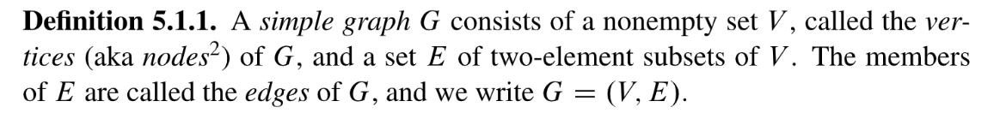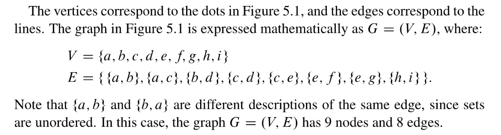
> **Properties of Simple Graphs:**
> 🔔: Simple graphs do not have any self-loops  (that is, an edge of the form($\{a, a\}$) since an edge is deï¬ned to be a set of two vertices. 
> 🔔: Simple graphs do not contain directed edges (that is, edges of the form $(a, b)$ instead of $\{a, b\}$)。也就是所有的`Edges`都没有方å‘性的箭头。
> 🔔: Simple graphs do not contain multiedges or multiple edges. In other words, there is at most one edge between any pair of vertices in a simple graph. 这个从我们的定义就å¯ä»¥æŽ¨æ–­å‡ºæ¥ï¼Œå› ä¸ºåœ¨Simple Graph中，所有的`Edges`都是以$\{a, b\}$çš„å½¢å¼å‡ºçŽ°çš„(这表明$\{a,b\}$å’Œ$\{b,a\}$是相åŒçš„object)，而ä¸æ˜¯ä»¥$(a,b),(b,a)$çš„å½¢å¼ã€‚因为`Multiedges`å°±è¿å了$E$作为`Set`的最基本的性质(元素必须唯一)。
> 下é¢æ˜¯ä¸€ä¸ª`Simple Graph`的例å­ï¼š
> 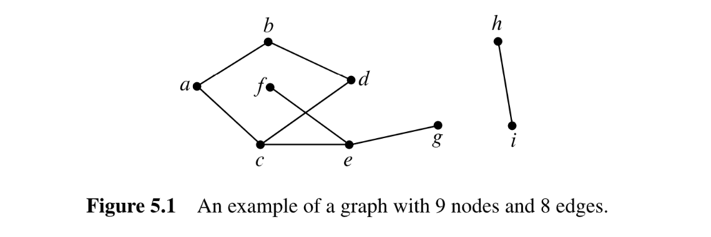


### Degrees&Adjacency&Incidence
> 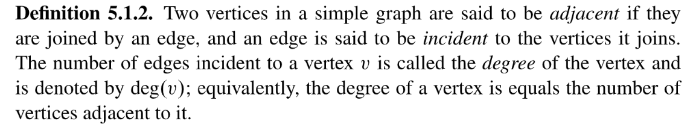
> 🔔: `Degree of a vertex`本质就是数`How many edges are connected to it?`
> 
> 🔔: 一æ¡`Edge`至多和两个`Vertices`æž„æˆ`Incident`关系，因为`Vertices`åªèƒ½å‡ºçŽ°åœ¨`Edge`的两端。
> **For example, in the simple graph shown in Figure 5.1:**
> 1. Vertex $a$ is `adjacent` to $b$ 
> 2. Vertex $b$ is `adjacent` to $d$
> 3. The edge $\{a, c\}$ is incident to vertices $a$ and $c$. 
> 4. Vertex $h$ has degree $1$, $d$ has degree $2$, and $deg(e)=3$ 
> 5. It is possible for a vertex to have degree $0$(就是孤立的顶点), in which case it is not adjacent to any other vertices. 
> 6. 🔔: `A simple graph`å¯ä»¥æ²¡æœ‰`Edges`  此时æ¯ä¸ª`Vertex`çš„`degree`都是零，也就是说$|E|=0$ , 但是至少需è¦æœ‰ä¸€ä¸ª`Vertex`, 也就是$|V|=1$。


### Connectivity
> 


### Connected Component
> 就是图中的一个个孤立的`Connected`çš„å­å›¾ï¼Œä¸”æ¯ä¸ªå­å›¾ä¸­çš„节点数é‡è¦å°½å¯èƒ½å¤šã€‚
> 


### Handshake Lemma
> 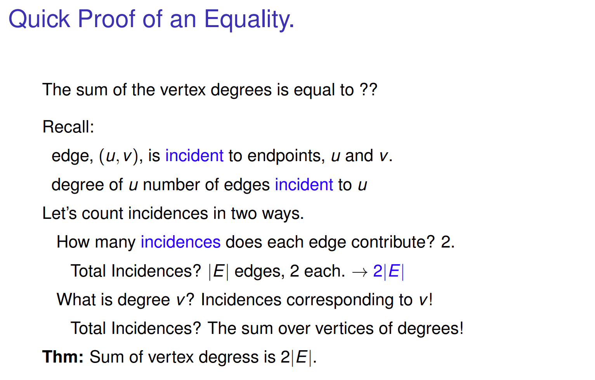


## Some Common Simple Graphs
### Complete Graph(Kn, Km,n)
> 一个`Complete graph` with$n$ vertices,  denoted $K_n$, has an edge between every two vertices, for a total of $\frac{n(n-1)}{2}$ edges(除以$2$的原因是因为åŒä¸€ä¸ª`Edges`会被é历两次) , 下图是$K_5$:
> 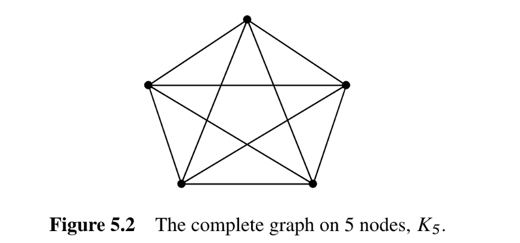
> æ¢å¥è¯è¯´ï¼Œå°±æ˜¯ä»»æ„两个`Vertex`之间都有一æ¡`Edge`连接。
> 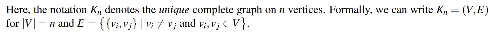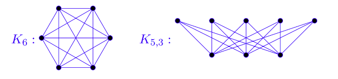


### Empty Graph
> The empty graph 没有`Edges`(但是为了满足Simple Graph的定义，至少需è¦æœ‰ä¸€ä¸ªVertex). 
> 🔔: $|E|=0$且$|V|>0$。
> 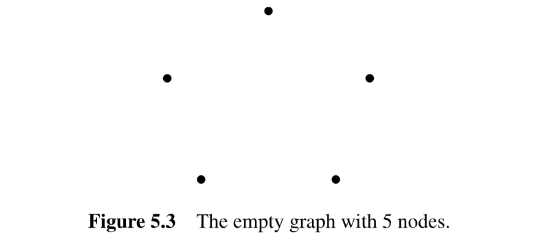


### Line Graph(Tree)
> 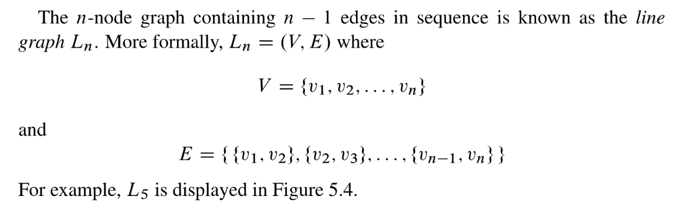
> 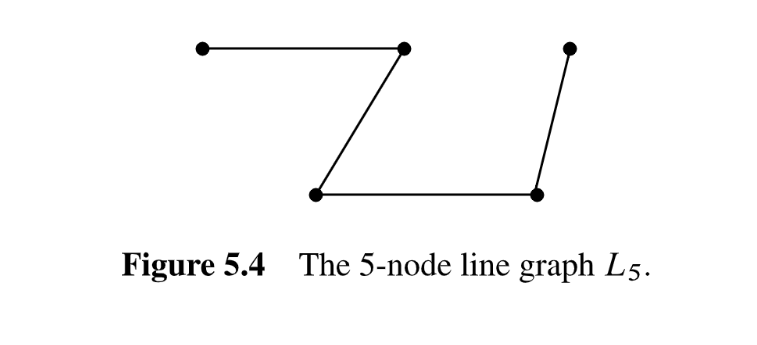


### Simple Cycle(Cn)
> 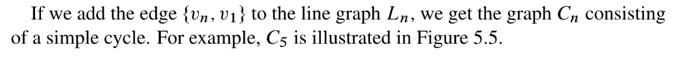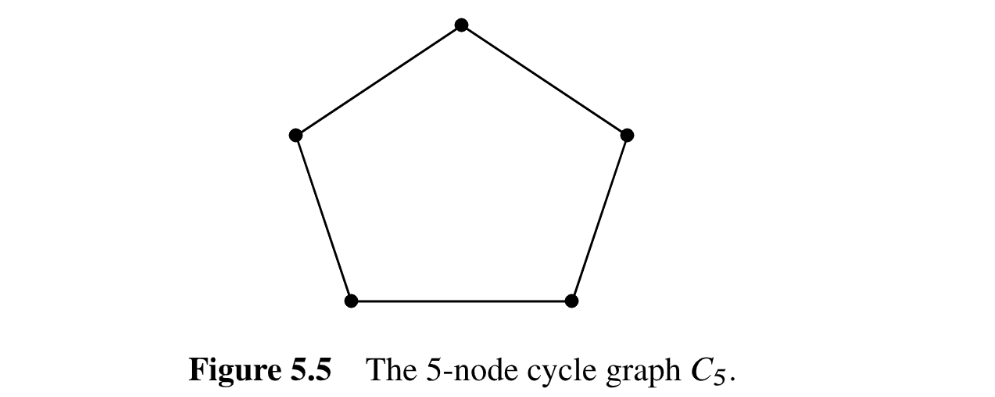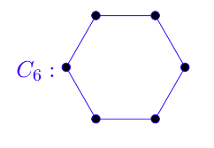


### Wheel Graph(Wn)
> 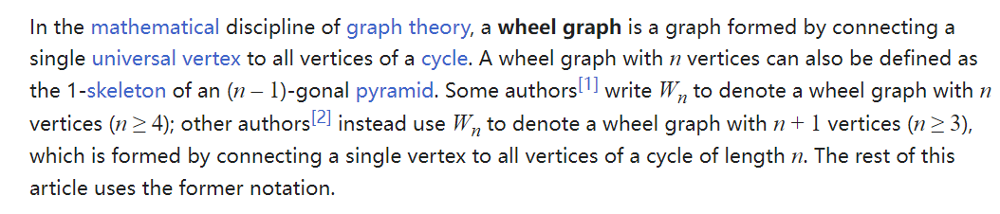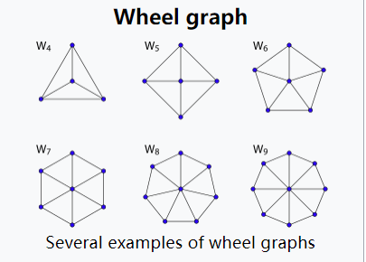


### Bipartite
> 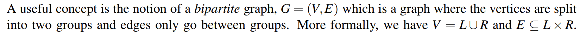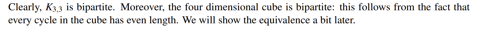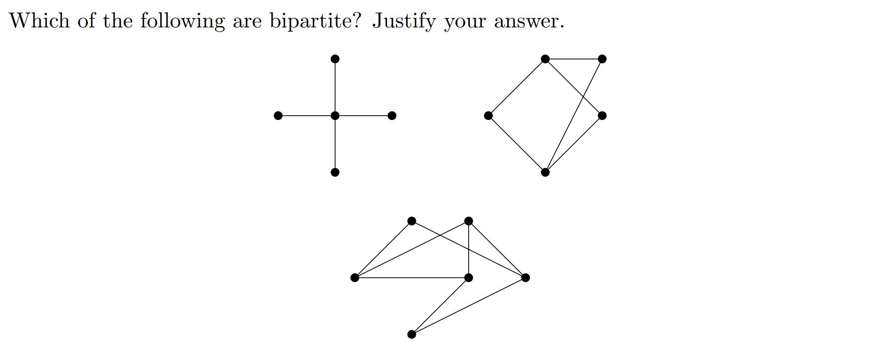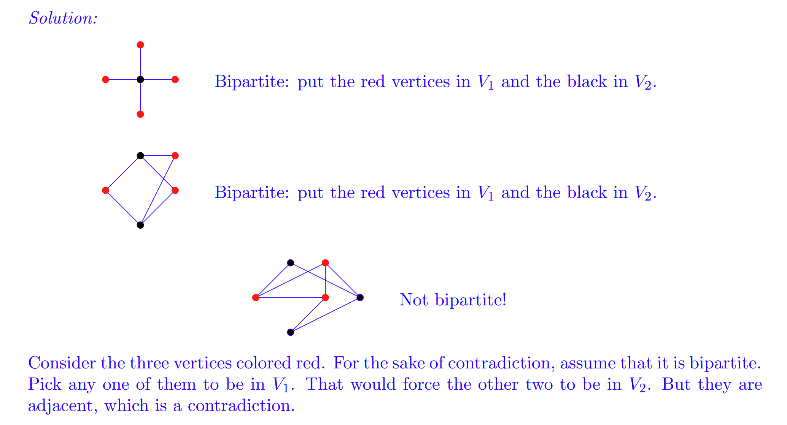


## Isomorphism(åŒæž„)
### Definition
> 两个图å¯èƒ½çœ‹èµ·æ¥éžå¸¸çš„相似，但是åˆæœ‰æœ¬è´¨ä¸Šçš„ä¸åŒï¼Œæ¯”如下é¢ä¸¤ä¸ªå›¾çš„结构是一致的，但是$V$集åˆä¸­çš„元素是ä¸åŒçš„：
> 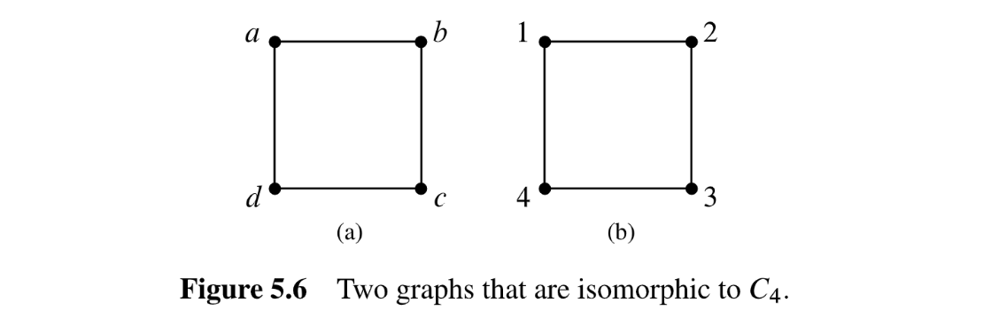
> 🔔: 上图中的的两个`Graph`都是拥有`4`个`Vertices`çš„`Simple Cycle`，结构上类似。但是$V_{(a)}=\{a,b,c,d\}$且$V_{(b)}=\{1, 2, 3, 4\}$. 所以严格上æ¥è¯´ï¼Œè¿™ä¸¤ä¸ª`Graphs`是ä¸åŒçš„`mathematical objects` , 虽然他们看起æ¥é«˜åº¦ç›¸ä¼¼ã€‚
> 🔔: è¿™ç§é«˜åº¦ç›¸ä¼¼æ€§æˆ‘们称为`Isomorphism`:
> 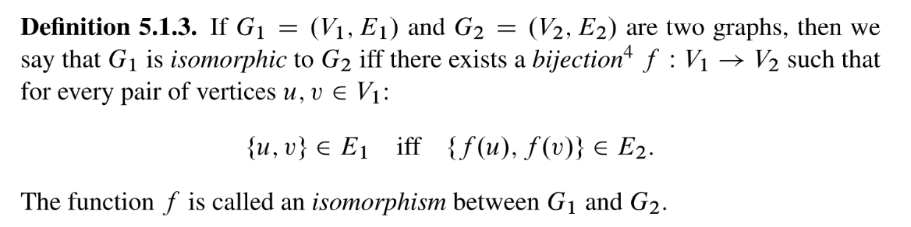
> 🔔: å‡è®¾æˆ‘们有两个`Graphs`$G_1$å’Œ$G_2$, 则`Isomorphism`表示我从$G_1$中任æ„拿出一æ¡è¾¹ï¼Œå°†è¾¹çš„两端能够通过一个`bijection`映射到å¦ä¸€ä¸ª`Graph`$G_2$中的æŸæ¡`Edge`的两端，那么就说$G_1$å’Œ$G_2$是åŒæž„的。
> 🔔: 也就是说两个`Graphs`之间唯一的差别就是`Labeling`çš„ä¸åŒã€‚
> 上图中我们有:
> 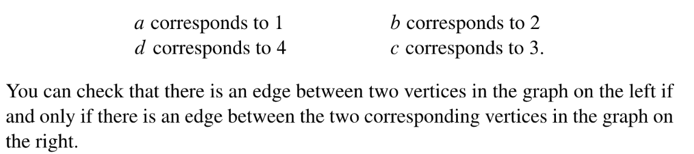
> **🔔: 两个**`**Isomorphic**`**çš„**`**Graphs**`**也å¯ä»¥çœ‹èµ·æ¥éžå¸¸ä¸åŒ, 下é¢æ˜¯ä¸€ä¸ªä¾‹å­:**
> 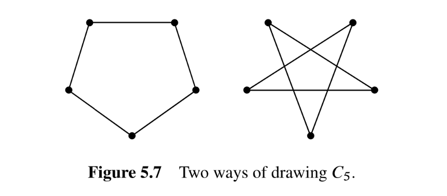


### Degree Sequence
> 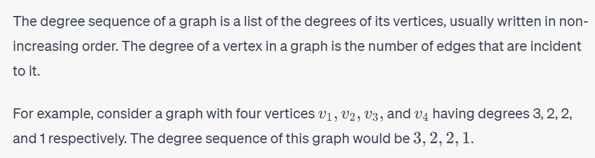
> 我们å¯ä»¥é€šè¿‡`Degree Sequence`æ¥åˆ¤æ–­ä¸¤ä¸ªå›¾æ˜¯å¦åŒæž„。


### Preservation of Graph Properties
> **A property of a graph is said to be preserved under isomorphism if whenever G has that property, every graph isomorphic to G also has that property.  **
> **如果两个图åŒæž„，则:**
> 1. åŒæž„的图节点数é‡ç›¸åŒ
> 2. åŒæž„的图的æ¯ä¸ªèŠ‚点的`degree`相åŒã€‚
> 
**所以我们å¯ä»¥é€šè¿‡å›¾ä¹‹é—´çš„**`**Degree Sequence**`**æ¥åˆ¤æ–­ä¸¤ä¸ªå›¾æ˜¯å¦åŒæž„:**
> 1. 如果两个图åŒæž„，则`Degree Sequence`一定相åŒã€‚å³:
> 2. **考虑逆å¦å‘½é¢˜ï¼Œå¦‚æžœ**`**Degree Sequence**`**ä¸ä¸€è‡´ï¼Œåˆ™ä¸¤ä¸ªå›¾ä¸åŒæž„。**
> 
`Two Graphs are isomorphic => Same Degree Sequence`
> 但是逆命题ä¸æˆç«‹ï¼Œå¦‚果两个图的`Degree Sequence`一致，ä¸ä¸€å®šåŒæž„，比如：
> 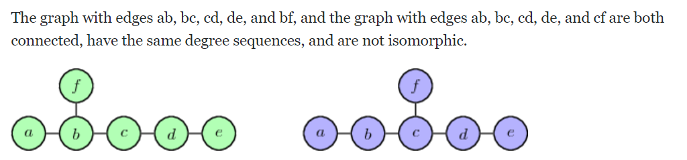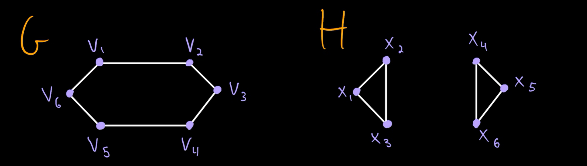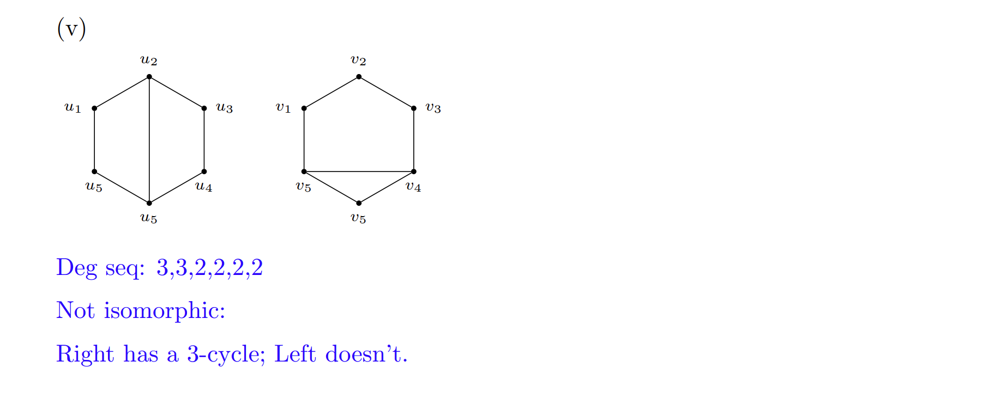


### Examples
> 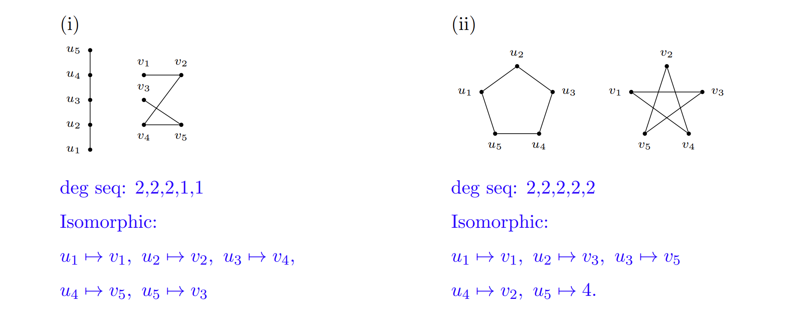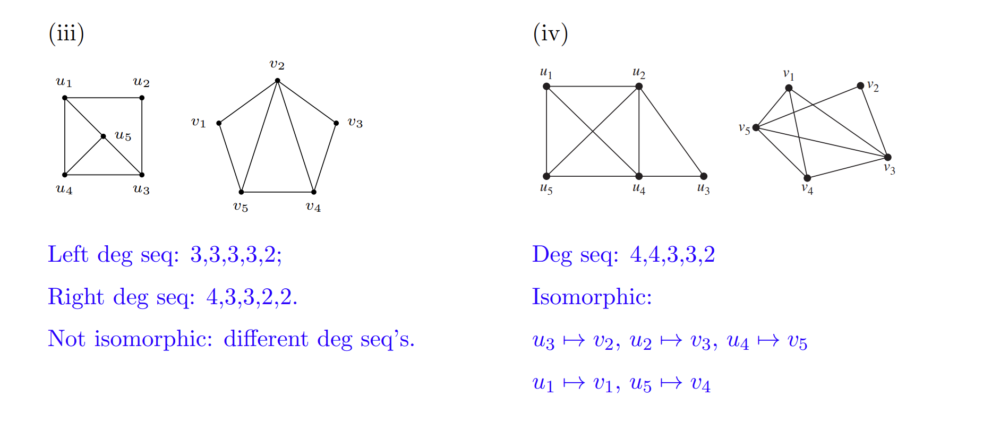


## Other Types of Graphs
### Multigraph
> 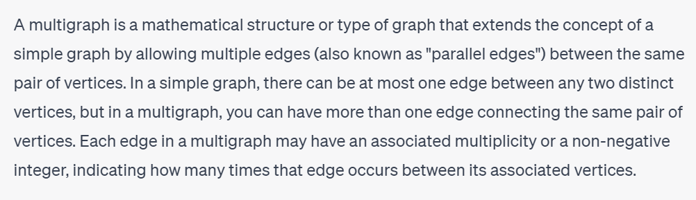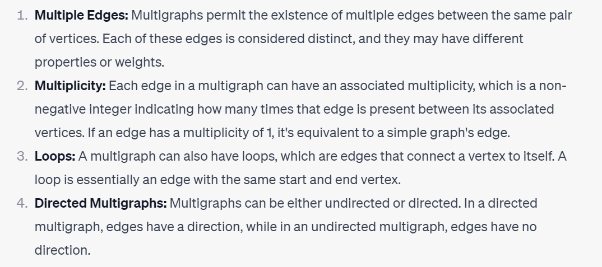
> Edge weight åªèƒ½æ˜¯ 1, 但是å¯ä»¥å…许两个节点间有多个edges。


### Tree&Forest
> 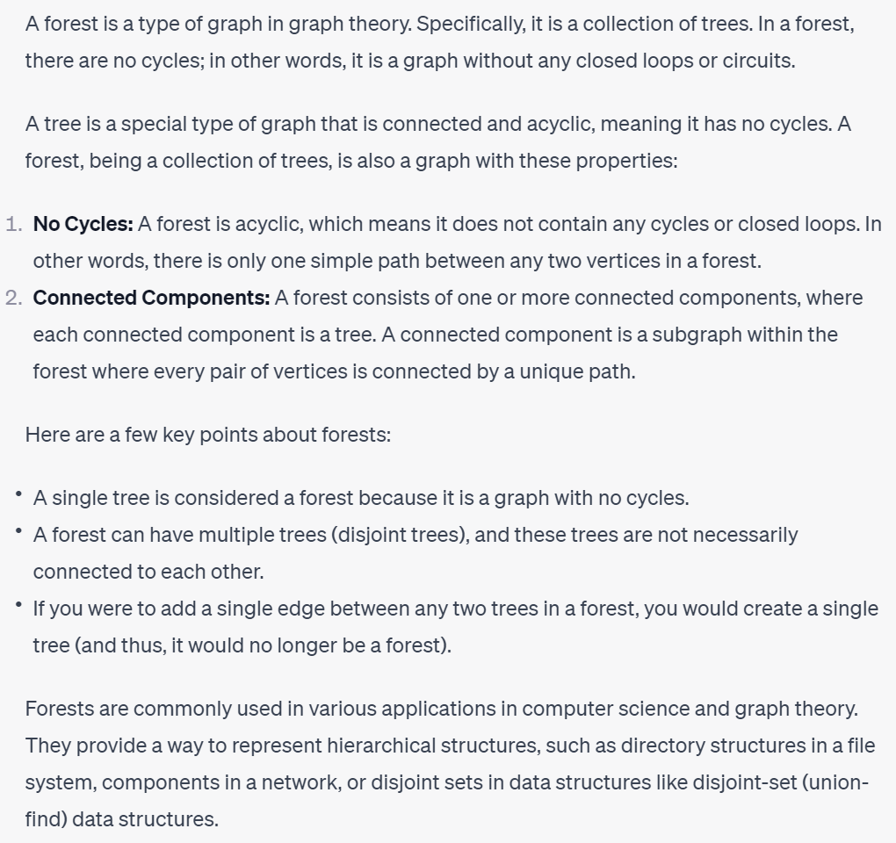


### Subgraphs
> 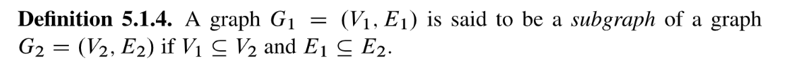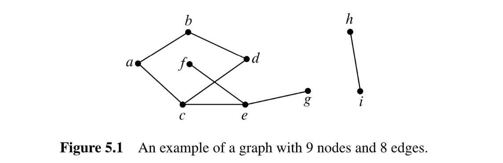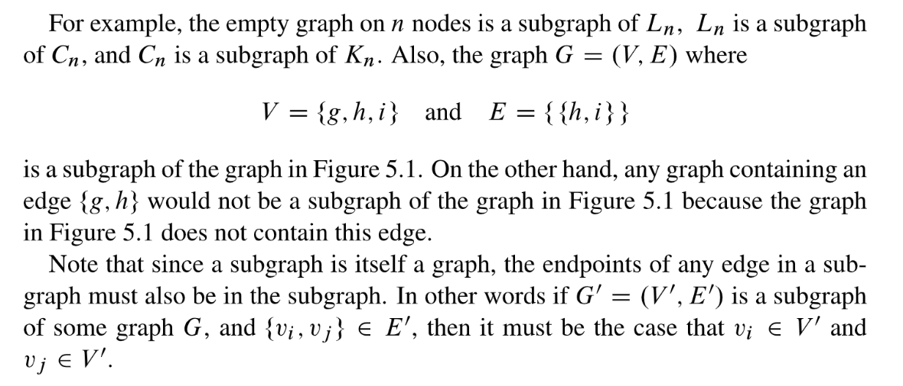


### Weighted Graphs
> 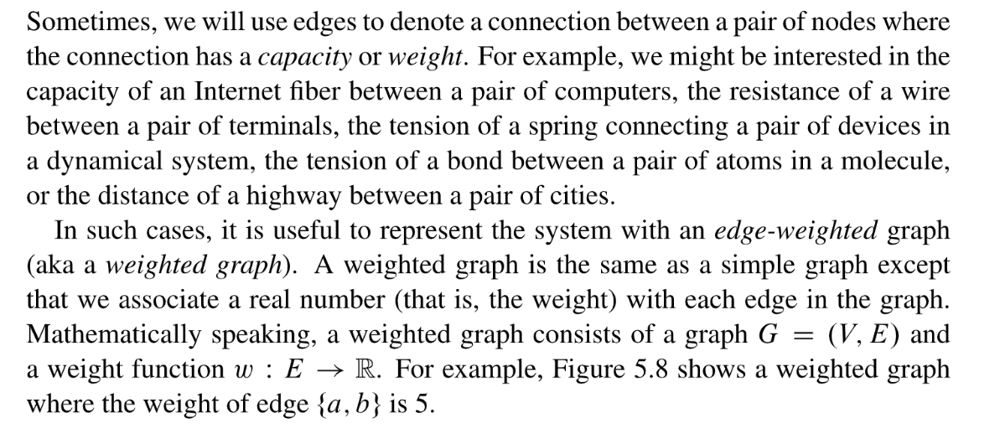
> 就是`Edge`多了一些`Weight`而已。


## Adjacency Matrix
> 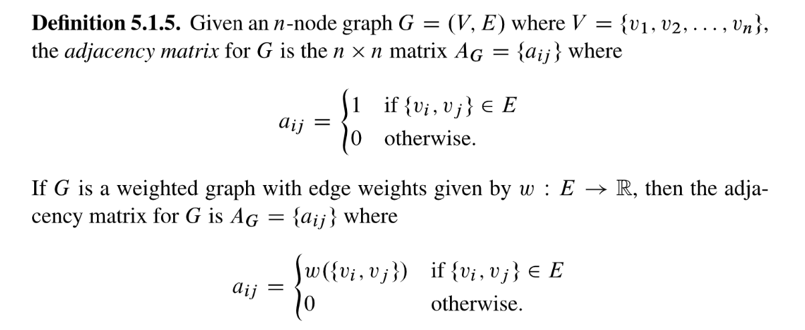


# Graph Traversals - Path&Walk
## Paths and Walks
> **Definition 5.4.1 Walk**
> A **walk** in a graph, $G$, is a sequence of vertices$v_0, v_1, \ldots, v_k$and edges
> $\left\{v_0, v_1\right\},\left\{v_1, v_2\right\}, \ldots,\left\{v_{k-1}, v_k\right\}$such that $\left\{v_i, v_{i+1}\right\}$ is an edge of $G$ for all $i$ where $0 \leq i<k$. 
> The walk is said to start at $v_0$ and to end at $v_k$, and the length of the walk is defined to be $k$. An edge, $\{u, v\}$, is traversed $n$ times by the walk if there are $n$ different values of $i$ such that $\left\{v_i, v_{i+1}\right\}=\{u, v\}$. 
> **Definition 5.4.1 Path and Walk**
> A **path** is a walk where all the $v_i$ 's are different, that is, $i \neq j$ implies $v_i \neq v_j$. For simplicity, we will refer to paths and walks by the sequence of vertices.
> 🔔: 总的æ¥è¯´, `Path`就是一æ¡æ²¡æœ‰é‡å¤èŠ‚点的`Walk`。
> 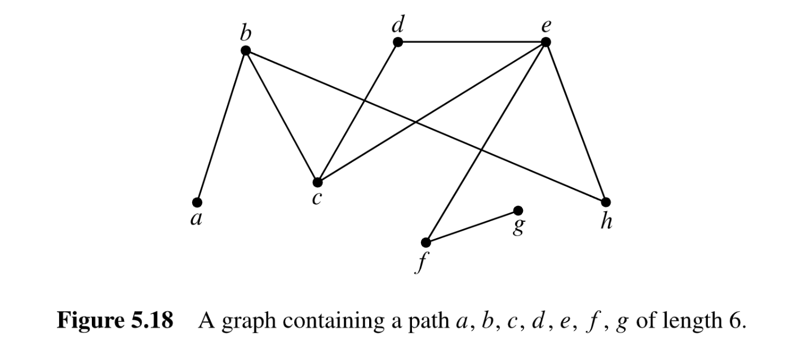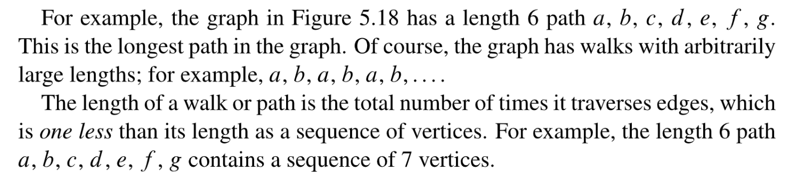


## Disjoint Paths
> 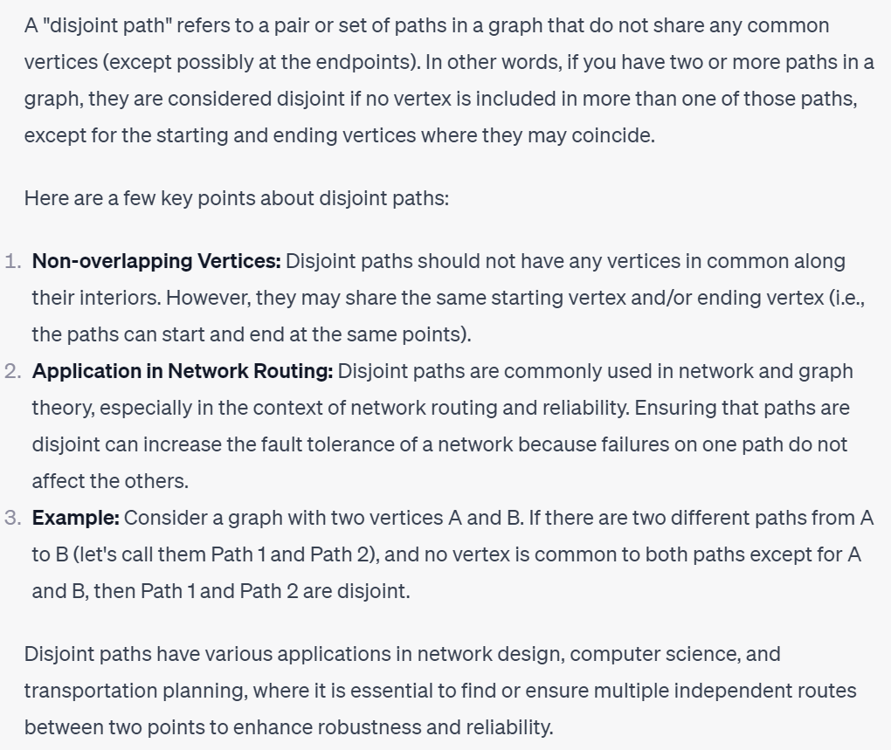


## Finding a Path
> 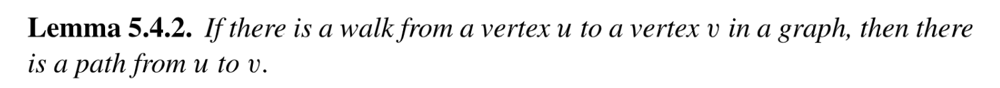
> Where there' s a walk, there' s a path.

**Proof**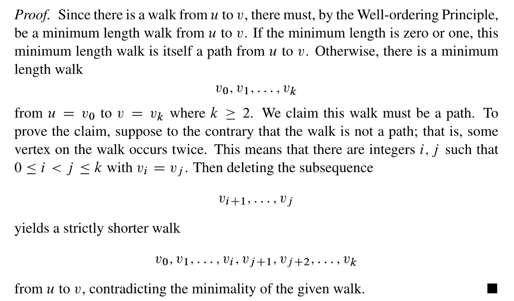
上述è¯æ˜Žè¿‡ç¨‹å®žé™…上就是把`Graph`中的`Cycle`给删除了，得到的就是更短的`Walk`。直到删除所有的`Cycles`，我们就得到了一个`Path`。
> 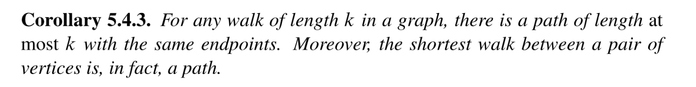
> 🔔: 我们任选图中的两点，如果这两点之间存在很多`Walk`, 那么一定存在一个路径最短的`Walk`称为两点之间的一个`Path`。


## Walks&Adj Matrix
> ä»»å–图中的两点，å‡è®¾è¿™ä¸¤ç‚¹é—´è¢«é•¿åº¦ä¸º$k$çš„`Walk`连接，这样的长度为$k$çš„`Walk`å¯èƒ½æœ‰å¾ˆå¤šä¸ª:
> 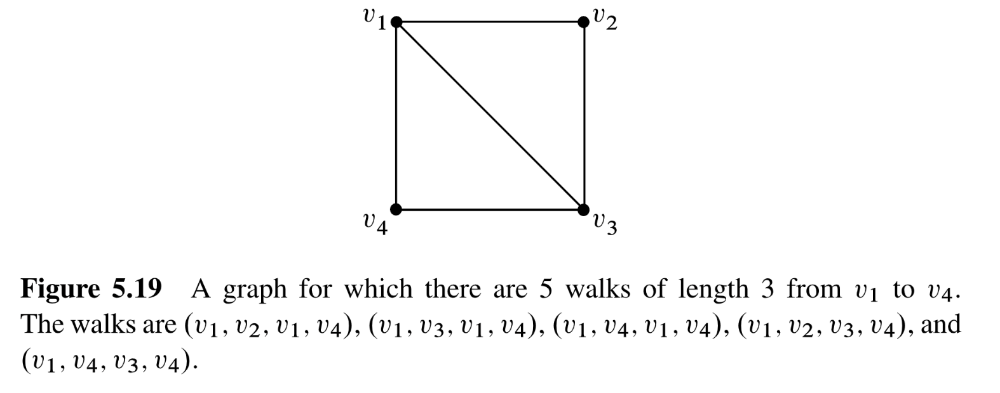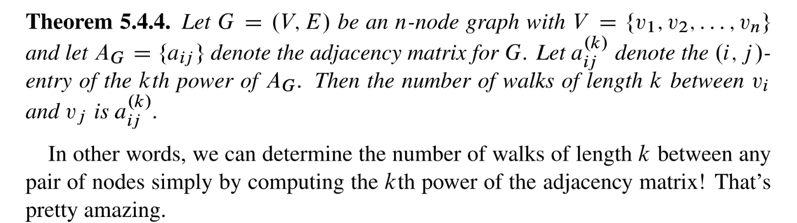

**Proof**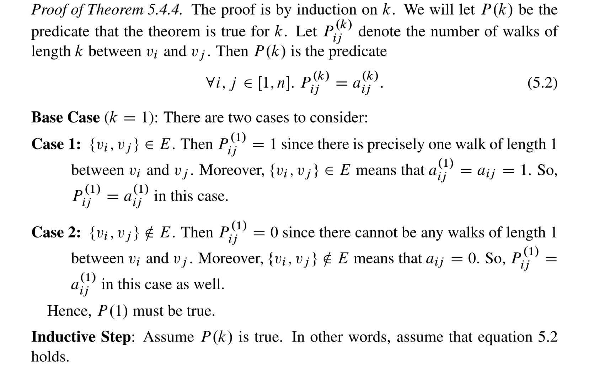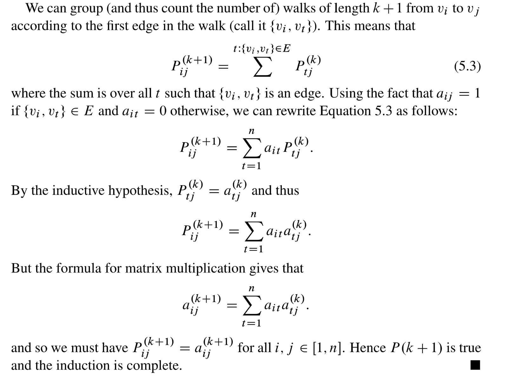
**Example**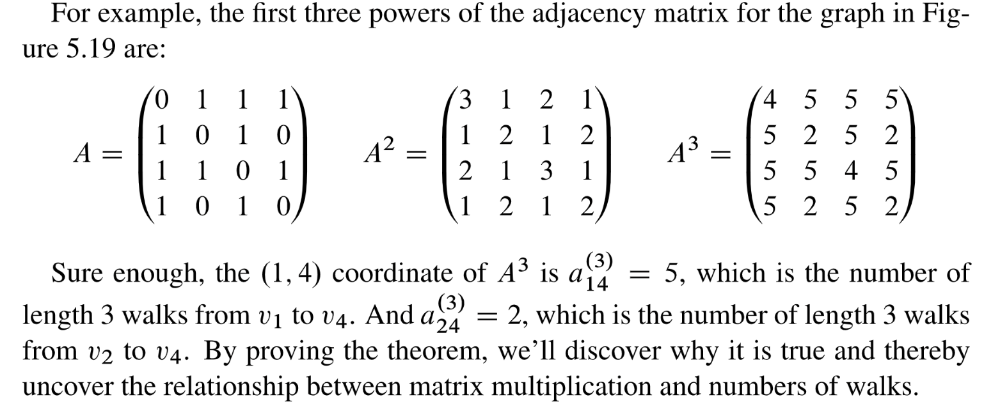


# Graph Tours - Cycle&Tour
## Cycles&Closed Walk
> 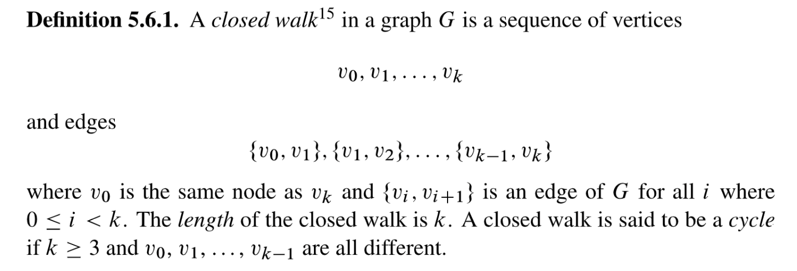

**Example**


## Euler Walks/Tours
### Definition
> 
> **An Euler walk** is deï¬ned to be a **walk** that traverses** every edge in a graph exactly once.**
> **An Euler tour** is an **Euler walk** that **starts and ï¬nishes at the same vertex.**
> 


### Conditions for Euler Walk
> **An undirected graph has an Eulerian walk** if and only if **it is connected (except for isolated vertices) and has at most two odd degree vertices. **

**Proof**
> 

**Solution**


### Conditions for Euler Tourâ­â­â­â­â­
> 
> 这里`Even Degree`说的是对所有的`Vertices`都æˆç«‹ã€‚

**Full Proof - Too Complicated**
**Proof of only if -  By Picture**
**Proof of if - By Picture**
**Proof of if - Recursive Algorithm**

### Practice Eulerian Tours
> 


## Hamiltonian Cycles
### Definition
> 


## Summary-Path&Walk&Cycle&Tour
> 


# Trees
## Definition
> 


## Equivalence of Definitions
> 


  
## Properties
> 

**Proof**


## Tree's Falling Apart
> 


# Hypercubes
## Defintion
### Binary Code Definition
> 
> **Also called n-cube for n-dimensional hypercube.**


### Recursion Definition
> 


## Number of Edges
> 
> **Proof 1**中的$2^n$指的是`Vertex`çš„æ•°é‡ï¼Œ$n$指的是æ¯ä¸ª`vertex`çš„`degree`大å°ï¼Œä½†æ˜¯æ¯ä¸ª`edge`会被算两次，所以$\frac{n\times 2^n}{2}=n2^{n-1}$æ¡è¾¹ã€‚
> **Proof 2**中$2E(n-1)$指的是我首先å¤åˆ¶ä¸¤ä¸ª`subcubes`(分别为`0-subcube`å’Œ`1-subcube`)。$+2^{n-1}$指的是将`subcubes`的所有对应的顶点(比如$1-000$å’Œ$0-000$相è”结起æ¥)，一共新增$2^{n-1}$æ¡è¾¹ã€‚于是递归å¼å°±æ˜¯$E(n)=2E(n-1)+2^{n-1}$。
> 
> **è¯æ˜Ž:**
> 1. **Base Step: **对于$n=1$我们有$E(1)=1\times 2^{1-1}=1$, æˆç«‹ã€‚
> 2. **Inductive Hypothesis:** å‡è®¾$P(k)$æˆç«‹ï¼Œå³$E(k)=k2^{k-1}$æˆç«‹ï¼Œåˆ™
> 3. **Inductive Step: **$E(k+1)=2E(k)+2^{k}=k2^k+2^k=(k+1)2^{(k+1)-1}$**，æˆç«‹ã€‚**
> 
所以$E(n)=n2^{n-1}$æˆç«‹ã€‚
> 
> **è¯æ˜Žï¼š**
> è¯æ˜Žæ¯”较简å•ï¼Œå°±æ˜¯$n$ä½äºŒè¿›åˆ¶çš„结果。


## Two-Colorability of n-cube
> **Some Observations:**
> 1. Hypercubeçš„edge连接的两个verticesåªæœ‰ä¸€ä¸ªbit是ä¸åŒçš„。如果两个verticesçš„bit有两ä½æ˜¯ä¸åŒçš„，则这两个vertices之间没有edge连接。
> 2. Hypercube一定是`Bipartite`，因为我们总是å¯ä»¥é€‰å–å«æœ‰å¥‡æ•°ä¸ª1çš„vertices作为一组，å«æœ‰å¶æ•°ä¸ª1çš„vertices作为一组，æ¯ä¸€æ¡edge都会将一个1flipæˆ0, 所以æ¯ä¸ªodd # 1 vertex总会和一个even # 1 vertex相连接。


## Cuts in Graphs
> 


## Connectivity Properties
> 

**Proof**


## *Hamiltonian Tour - Longest Simple Cycle
> 

**Solution**


## Hypercubes and Boolean Functions
> 


# Graph Coloring
## Problem Setting
> æ¯æ¬¡åˆ°äº†è€ƒè¯•å‘¨ï¼Œå­¦ç”Ÿéœ€è¦åœ¨ä¸åŒçš„时间å‚加考试。现在的问题是，如何ä¿è¯å­¦ç”Ÿ`Enroll in`的课程的考试时间互相ä¸å†²çªã€‚我们å¯ä»¥ç”¨å›¾æ¥å»ºæ¨¡:
> 下图中，æ¯ä¸ªèŠ‚点代表一门课的考试，如果两个节点之间存在`Edge`直接相连，代表学生åŒæ—¶`Enroll in`了这两门课，å³è¿™ä¸¤é—¨è¯¾çš„考试时间ä¸èƒ½æœ‰å†²çªï¼Œä¹Ÿå°±æ˜¯è¯´`Edge`相连的两端的节点代表的考试时间ä¸èƒ½ç›¸åŒã€‚
> 如果我们用ä¸åŒçš„颜色æ¥ä»£è¡¨è€ƒè¯•æ—¶é—´ï¼Œåˆ™`Edge`两端的节点颜色ä¸èƒ½ç›¸åŒã€‚
> å¦å¤–，一ç§å¾ˆç²—æš´çš„æ–¹å¼å°±æ˜¯å°†æ‰€æœ‰è€ƒè¯•å®‰æŽ’在ä¸åŒçš„时间，但是因为考试周的时间有é™ï¼Œè¿™ä¹ˆåšä¸åˆå®žé™…。所以我们还è¦æ±‚考试时间段(比如`13:00~14:00`, `13:25~15:25`)å°½å¯èƒ½å°‘（尽é‡éƒ½å®‰æŽ’在一起）。
> 
> `**Graph-Coloring**`**问题的目标是:**
> 1. `Edge`相连的两端的节点的颜色必须ä¸ä¸€æ ·ã€‚
> 2. 颜色数é‡å°½å¯èƒ½å°‘。
> 
**围绕**`**Graph-Coloring**`**我们有:**
> 1. 我们称一个`Graph`具有一ç§`Coloring`当且仅当`Coloring`解决了:
>    1. `Edge`相连的两端的节点的颜色必须ä¸ä¸€æ ·ã€‚
>    2. 颜色数é‡å°½å¯èƒ½å°‘。
> 
的问题。
> 2. 一个`Graph`是`K-colorable`当且仅当`It has a coloring with at most k colors`。
> 
**总结一下:**
> 


## Chromatic Numberâ­â­â­â­â­
> 
> 我们对$\chi(G)$有上界定义:
> 

**Proof of Theorem 5.3.2**


### Graph-Width and Coloring
> 

**Proof**


# Graph Connectivity
## Connectivity
> 
> 注æ„ä»»æ„两点的`Connectivity`指的ä¸æ˜¯å­˜åœ¨ä¸€æ¡`Edge`直接相连，而是说存在一个`PATH`在两点之间。
> **Connected Example:**
> 
> **Disconnected Example:**
> 


## Connected Components
> 
> **🔔: 注æ„，**`**Connected Components**`**是**`**Maximum Set of Connected Vertices**`**，这里的**`**Maximum**`**是é‡ç‚¹ã€‚**
> 

```c
function DFS(v, visited, graph):
    visited[v] = true
    for each u in graph[v]:   // Iterating over neighbors
        if not visited[u]:
            DFS(u, visited, graph)

function computeConnectedComponents(graph):
    V = number of vertices in graph
    visited = [false, false, ...] (size V)
    count = 0

    for v = 0 to V-1:
        if not visited[v]:
            count += 1
            DFS(v, visited, graph)

    return count
```

## K-Connected Graph
> 
> 1. $b$å’Œ$e$在删除掉了$\{b,c\}$å’Œ$\{b,h\}$之åŽæ•´ä¸ªå°±ä¸å†`Connected`, 所以是`2-edge connected`.
> 2. $c$å’Œ$e$在删除掉了$\{b,c\},\{c,d\},\{c,e\}$之åŽå°±ä¸å†`Connected`, 所以是`3-edge connected`.
> 3. $g$å’Œ$e$在删除掉了$\{f,g\}$之åŽå°±ä¸å†`Connected`, 所以是`1-edge connected`.


## Minimum Edges in connected graph
> 
> è¯æ˜Žçš„关键æ€è·¯å°±æ˜¯æˆ‘们在`Inductive Step`的时候先删除了一个`Edge`回归到`Inductive Hypothesis`的状æ€ã€‚

**Proof**
> 
> 一个`Graph (with v vertices)`è¦æƒ³`Connected`, 则说明åªæœ‰ä¸€ä¸ª`Component`, 于是$e=1$, 所以是`v-1 edges`。


## Build Up Errorâ­â­â­â­â­
:::info

:::
**False Proof**
> 

**Correct Proof - How to Avoid**


# Planar Graphs
## Definition
> 


## Faces&Bridges
> When a planar graph is drawn in the plane, one can distinguish, besides its vertices and edges, its faces (more precisely, these are faces of the drawing, not of the graph itself). 
> **The faces are the regions into which the graph subdivides the plane**. 
> 1. One of them is inï¬nite.
> 2. The others are ï¬nite. 
> 
**Brideges are the edges that does not subdivide the plane. **For example, any edges in a tree is a bridge.


## Properties
### Bounding # Edges
> 


### Degree Properties
> 


## Planarity Proof - Euler's Formula
> 
> - **Number of faces: f **
> - **Number of vertices: v **
> - **Number of edges: e**

**Proof**


## Non Planarity Proof
### Non-planarity for K5
> 
> 其中`Edge-face adjacency`是è¯æ˜Žçš„核心。
> 所以对于`K5`我们åªéœ€è¦æ£€æŸ¥$e\leq 3v-6$是å¦æˆç«‹æ¥åˆ¤æ–­å›¾æ˜¯å¦æ˜¯`Planar`的。如果æˆç«‹ï¼Œåˆ™å›¾æ˜¯`Planar`的。注æ„这个ä¸ç­‰å¼å¯¹ä¸åŒçš„图æ¥è¯´ä¹Ÿæ˜¯ä¸åŒçš„，需è¦ç»“åˆå®žé™…图结构进行分æžã€‚


### Non-planarity for K3,3
> 
> å¯ä»¥çœ‹åˆ°ï¼Œå¦‚果我们**使用**`**K5**`**çš„**`**Edge-Face Adjacency**`æ¥åˆ¤æ–­`K3,3`çš„`Planarity`会出错，原因在于`K5`中的`Cycle length`至少是`3`，而`K3,3`中的`Cycle Length`至少是`4`。所以对于`K3,3`æ¥è¯´ï¼Œæˆ‘们的è¯æ˜Žåº”该修改æˆä¸‹é¢çš„æ ·å­ï¼š
> 1. Each face is adjacent to at least four edges, so face-edge adjacencyeach faces is at least$4f$
> 2. Each edge is adjacent to at most two faces, so face-edge adjacenct is at most $2e$
> 
所以对于`K3,3`æ¥è¯´$4f\leq 2e$，带入`Euler's Formula`中我们有: $v+\frac{1}{2}e\geq e+2$, 所以$e\leq 2v-4$。所以如果`K3,3`是`Planar`的，就一定满足这个ä¸ç­‰å¼ã€‚但是实际情况是$e=9,v=6$, $9>2\times 6-4=8$, 于是`K3,3`ä¸æ˜¯`Planar`的。
> **使用**`**Total Number of Sides**`**æ¥è¯æ˜Ž:**
> Each face is adjacent to at least four edges, so total number of sides of faces in the K5 is $2e=\sum_{i=1}^f s_i\geq \sum_{i=1}^f4=4f$


### Non-planarity for all graphs
> 


## Duality of Planar Graph
> **Construction of Dual Graphs**
> - Given a planar graph G **without bridges or degree-two nodes**, its dual G* can be constructed by placing a node on each face of G.
> - An edge between two faces of G* is drawn such that it crosses an edge in G.
> - If you construct the dual of G*, it will result in the original graph G. This relationship can be represented as (G*)* = G.
> 


## Subgraph of Planar Graph
> 

**Proof 1**
**Proof 2**


## Planar Graph Coloring
### Bipartite&Coloring
> 


### Six-Color Theorem
> 


### Five-Color Theorem
> 
> [https://www.youtube.com/watch?v=5mdH0UeBaR0](https://www.youtube.com/watch?v=5mdH0UeBaR0)

**Formal Proof**


### Four-Color Theorem
> **Proof: **[https://www.youtube.com/watch?v=adZZv4eEPs8](https://www.youtube.com/watch?v=adZZv4eEPs8)
> **Any simple planar graph is four-colorable.**
> The proof is finally done by super computers, considering all the edge cases.


## Applications
### Edge Coloring
> 

**Solution**
注æ„到$(c)$问中，如果我们选择éžå¶å­èŠ‚点删除，则å¯èƒ½ä¼šå¯¼è‡´`Build up Error`, 因为`Resulting Graph`å¯èƒ½ä¸æ˜¯æ ‘。但是选择å¶å­èŠ‚点删除就一定是树。


# Graph Modeling
## Banquet Arrangement
> 

**Proof**


# Related Resources
[MIT6_042JF10_rec06.pdf](https://www.yuque.com/attachments/yuque/0/2023/pdf/12393765/1694382246995-5f282bc3-9b6e-4d47-9f93-335d70a6797f.pdf)
[MIT6_042JF10_rec06_sol.pdf](https://www.yuque.com/attachments/yuque/0/2023/pdf/12393765/1694382246989-4dae6d87-1199-47e0-9a1e-bd5948729f23.pdf)
[dis02b-Graphs1.pdf](https://www.yuque.com/attachments/yuque/0/2023/pdf/12393765/1694382253945-e6ee6787-d38e-4334-9f33-9417956f81db.pdf)
[dis02b-sol.pdf](https://www.yuque.com/attachments/yuque/0/2023/pdf/12393765/1694382253945-e3146beb-dfda-453e-9ce6-af377890dd85.pdf)
[dis03a-Graphs2.pdf](https://www.yuque.com/attachments/yuque/0/2023/pdf/12393765/1694382253949-6c220d0e-29b1-4608-adf7-81b50948d881.pdf)
[dis03a-sol.pdf](https://www.yuque.com/attachments/yuque/0/2023/pdf/12393765/1694382253948-0f7957b9-cb1a-43d6-9122-927478d39f27.pdf)
[hw03-Graphs.pdf](https://www.yuque.com/attachments/yuque/0/2023/pdf/12393765/1694382394652-b66e341c-a282-4073-97a5-1bf02795b1f3.pdf)
[hw03-sol.pdf](https://www.yuque.com/attachments/yuque/0/2023/pdf/12393765/1694382394950-5f861352-b792-4fc3-bc7c-1e4ca2d1d03d.pdf)

