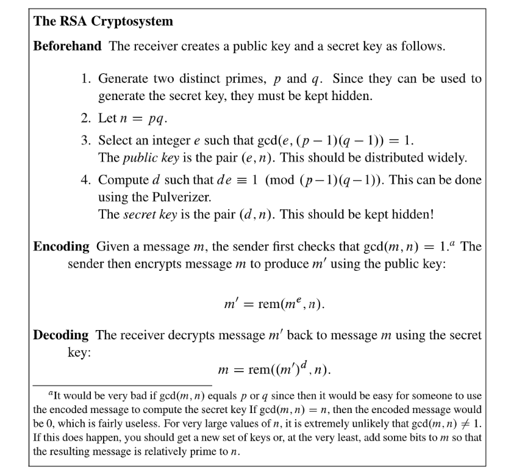
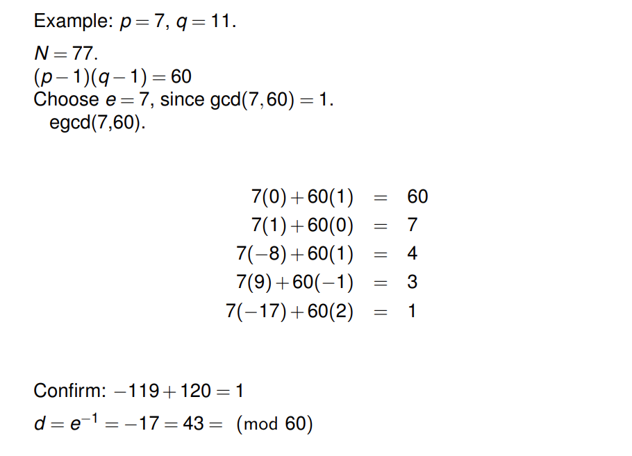
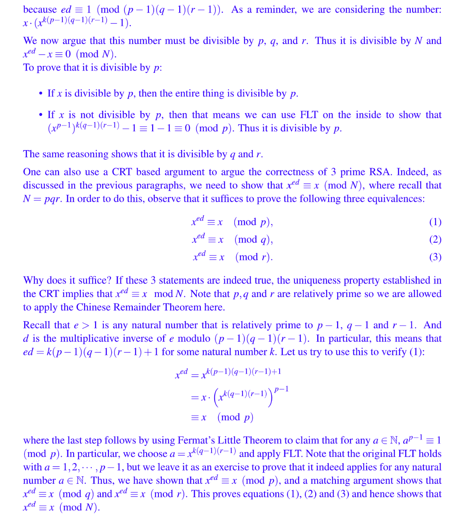

# Public Key Crypography
## Scenario
> 

## Algorithm
> 
> **另一种算法描述:**
> 

## Important Examples
### Repeated Squaring
> 

### Example 1
> 

### Example 2
> 

# Algorithm Analysis
## Proof of Correctness⭐⭐⭐⭐⭐
**Proof of Correctness - Version 1**下面我们证明这个`Encryption-Decryption`是成立的(可以互相转化的):
$m'=rem(m^e, n)\equiv m^e \ (mod~n\ )\implies (m')^d\equiv m^{ed}\ (mod~~n\ )$
Using the definition of $d$, where $ed\equiv 1 \ ( mod~~(p-1)(q-1)\ )$. Thus, $\exists r, s.t.~~ed=1+r\cdot(p-1)(q-1)$
So, $(m')^d\equiv m^{ed}\ (mod~~n\ )\equiv m\cdot m^{r(p-1)(q-1)}\ (mod~~n\ )$
Since $n=pq$, so if $(m')^d\equiv  m\cdot m^{r(p-1)(q-1)}\ (mod~~n\ )$, then 
$(m')^d\equiv  m\cdot m^{r(p-1)(q-1)}\ (mod~~p\ )$
$(m')^d\equiv  m\cdot m^{r(p-1)(q-1)}\ (mod~~q\ )$
, since by definition if $n$divides the difference between $(m')^d$and $m\cdot m^{r(p-1)(q-1)}$, then $p$and $q$also divides that difference. (For example, if $6|18$, then $2|18$and $3|18$)。
If $m \not \equiv 0 (mod~p)$, then by Fermat's little theorem, we have $m^{p-1} \equiv 1(mod~p)$，then $(m')^d\equiv  m\cdot m^{r(p-1)(q-1)}\ (mod~~p\ )$simplifies to $(m')^d\equiv  m\ (mod~~p\ )$. (If $m  \equiv 0 (mod~p)$, then $(m')^d\equiv  0\ (mod~~p\ )$) 
If $m \not \equiv 0 (mod~q)$, then by Fermat's little theorem, we have $m^{p-1} \equiv 1(mod~q)$, then $(m')^d\equiv  m\cdot m^{r(p-1)(q-1)}\ (mod~~q\ )$simplifies to $(m')^d\equiv  m\ (mod~~q\ )$. ( (If $m \equiv 0 (mod~q)$, then $(m')^d\equiv  0\ (mod~~q\ )$)
Thus, we know that $p|(m')^d-m$and $q|(m')^d-m$, so $pq|(m')^d-m$and by definition we know $n|(m')^d-m$and that $(m')^d\equiv m\ (mod~~ n\ )$, which means $m=rem((m')^d,n)$
**Another perspective:**

> 

**Proof Method 1 - by Modular Arithmetic**
**Proof Method 2 -  Step by Step with Fermat Little Theorem**
**Proof Method 3 - by CRT**

## Important Property
> 

## Efficiency Analysis
> 

### 
# Security Analysis
> 

## Construction of Keys
> 

## Why Safe?
> 
> **思路是这样：**
> 1. 假设`Bob`想和`Alice`进行通信，那么`Bob`这边首先需要走一遍算法的前两步，得到`Public Key Pair`($N,e$)和`Secret Key`$d$。
> 2. `Bob`将`Public Key`公布与众，如果`Alice`想要发送$x$信息，则她需要使用$y = x^e~~ mod ~~N$对原始信息进行加密，任何拿到`Public Key`的人都需要这样对信息进行加密以确保`Bob`可以收到同时保证只有`Bob`能通过$y^e~~mod ~~N$对信息进行解码获得原信息。

## When not Safe?
> 🔔**: 解释一下注释中的**`**Bad Cases**`**:**
> 1. $gcd(m,n)\neq 1$时，因为$n=pq$, 所以$gcd(m,n)=p$或者$gcd(m,n)=q$, 此时我们实际上拿到了$p$和$q$的值。同时我们又知道$e$(公钥)，通过$de\equiv 1~(\bmod~(p-1)(q-1))$就可以求出$e$的`Multiplicative Inverse Modulo (p-1)(q-1)`，也就是私钥，这很不安全。
> 2. $gcd(m,n)=n$时，$n|m$, 则$m'=rem(m^e,n)=m^e~(\bmod~n)=0~(\bmod~n)$

# Practices
## RSA Basics
> 

**(a) Calculating Secret Key**
**(b) Decode the Message**
**(c) Encode the Message**
> 

**Solution**

## 

## RSA with One Prime
### RSA Misuse - Little Example
> 

**Solution - Fermat's Little Theorem**
> 我们看到只用一个`Prime`$P$仍然可以正常解密和加密，流程都不受影响，前提是我们要能够找到使得$de\equiv1(~~mod~~P-1)$的`Secret Key`$d$。

### Reverse Engineering⭐⭐⭐⭐⭐
> **HW05 Fa20 P1**
> 

**Solutions**

### 总结
> 上面两个例子展示了，如果我们的$N$仅仅由一个`Prime Number`构成，则会造成

## RSA with Three Primes
> 

**Solution**

## Squared RSA⭐⭐⭐⭐⭐
> **HW05 Fa20 P2**
> 
> 本题非常重要，可以帮助我们更好的理解`RSA`工作的本质和`FLT`的原理。

**Proof for (a)**
注意上述的第一种证明中，我们$S$集合的构造，我们需要使得$S$中的所有元素都小于$p^2-1$且和$p$是`Co-Prime`的，原因是我们需要$S$中的元素在$mod~~p^2-1$下都有唯一的`Modular Inverse`才能完成推导，于是我们需要排除$p,2p,3p,\cdots, (p-1)p$这$p-1$个和$p^2$不是`Coprime`的元素，于是我们最终的集合中有$|S|=p^2-1-(p-1)=p^2-p$。
**Proof for (b)**

