# The Fundamental Theorem of Arithmetic
## Lemmas
> 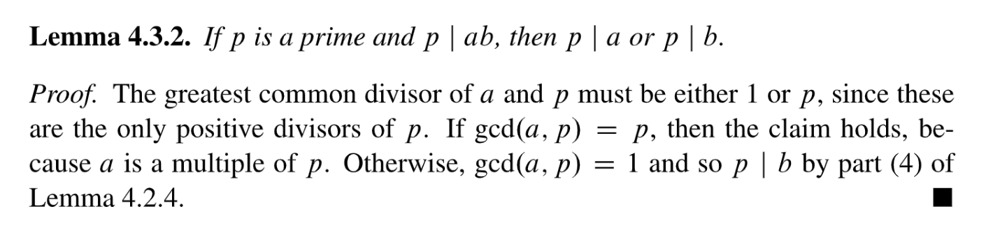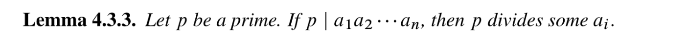

## Fundamental Theorem
> 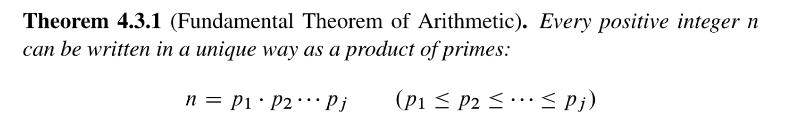
> Notice that the theorem would be false if 1 were considered a prime; for example, 15 could be written as $3\times 5$ or $1 \times 3 \times 5$ or $1^2 \times 3 \times 5$. 
> 🔔: Also, we’re relying on a standard convention: the product of an empty set of numbers is defined to be $1$, much as the sum of an empty set of numbers is defined to be $0$. Without this convention, the theorem would be false for $n=1$.

**Proof of Existence  - Theorem 3.1.2**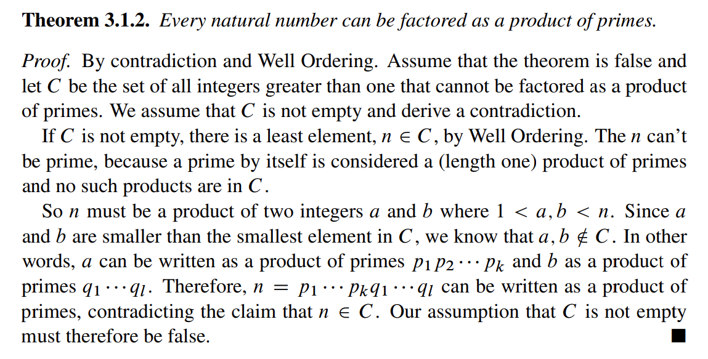
**Proof of Uniqueness - Theorem 4.3.1**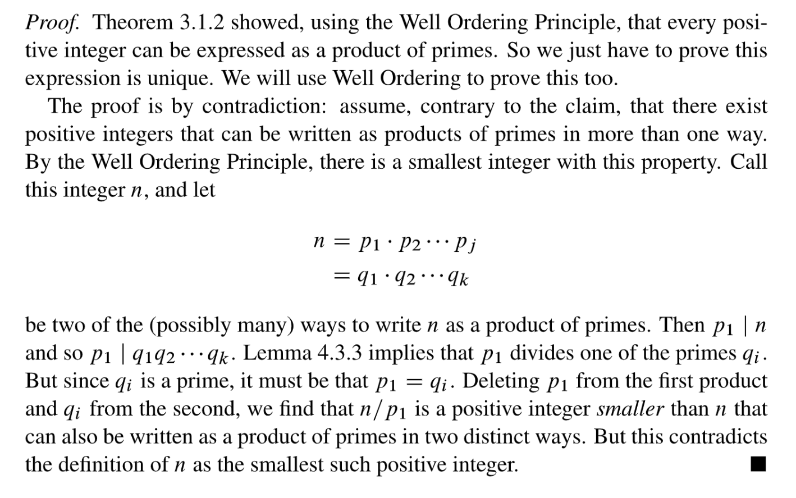
> 🔔: 如果两个`Prime Number``p`和`q`满足`p|q`, 则`p=q`。

## Turing Code Version 1.0
> `Turing Code`主要用于信息的加密算法，`Version 1`版本的加密要求我们先将`Message in text`转换成一个`Prime Number`, 记作`m`, 通过加密算法获得`m*`。

### Problem Settings
> 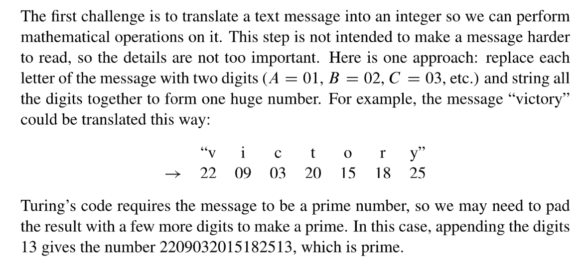

### Algorithm Steps
> 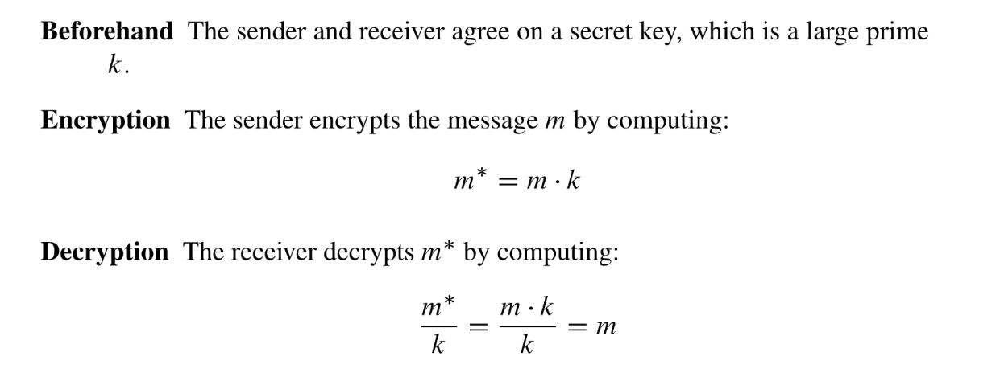

**Example**

### FAQs
> ❔**: How can the sender and receiver ensure that m and k are prime numbers, as required?**
> In 2002, Manindra Agrawal, Neeraj Kayal, and Nitin Saxena announced a primality test that is guaranteed to work on a number n in about .log n/12 steps, that is, a number of steps bounded by a twelfth degree polynomial in the length (in bits) of the input, n. This definitively places primality testing way below the problems of exponential difficulty. Amazingly, the description of their breakthrough algorithm was only thirteen lines long!
> ❔**: Is Turing’s code secure?**
> The Nazis see only the encrypted message m D m k, so recovering the original message m requires factoring m . Despite immense efforts, no really efficient factoring algorithm has ever been found. It appears to be a fundamentally difficult problem, though a breakthrough someday is not impossible. In effect, Turing’s code puts to practical use his discovery that there are limits to the power of computation. Thus, provided m and k are sufficiently large, the Nazis seem to be out of luck!

### Major Flaws⭐⭐⭐⭐⭐
> `Turing Code Version 1`有一个很大的问题，就是第三方可以通过拦截任意两条加密信息$m_1^*$和$m_2^*$, 并求出他们的最大公约数$gcd(m_1^*,m_2^*)$来获得`Secret Key`$k$。有了`Secret Key`, 就可以很容易的偷取原信息。
> 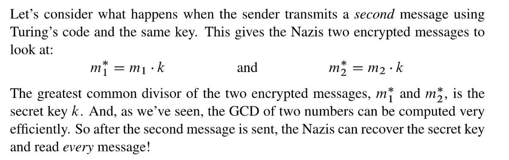

# Prime Modulus
## Relative Primality(互素)
> 🔔: Integers $a$ and $b$ are relatively prime iff $gcd(a, b)=1$.
> For example, $8$ and $15$ are relatively prime, since $gcd(8, 15)=1$. Note that, except for multiples of $p$, every integer is relatively prime to a prime number $p$.

> 本小节我们探究`Modulus`是质数的情况，并介绍更新版本的`Turing Code`。

## Turing Code Version 2.0
> 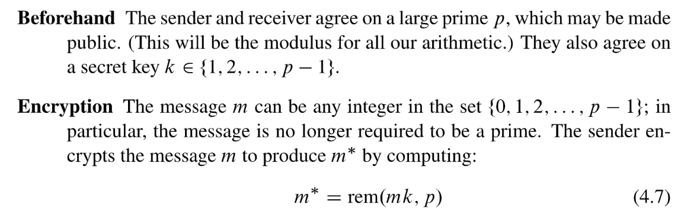
> 这里$k$is not a multiple of $p$, 后续有很多定理都是基于这个条件的。
> 🔔：注意，不同于`Version 1.0`中`m`是利用类似于`ASCII`对应求出的，`Version 2.0`中的`m`的取值范围是$\{0,1,2,\cdots, p-1\}$, 可见$m$不是$p$的倍数。
> 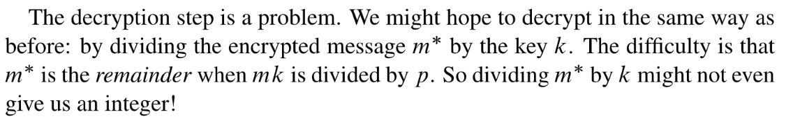
> 🔔: **本质上，我们要计算的是**$k$**的**`**Multiplicative Inverse w.r.t to Modulo p**`**.**

### Decrypt the Message
> 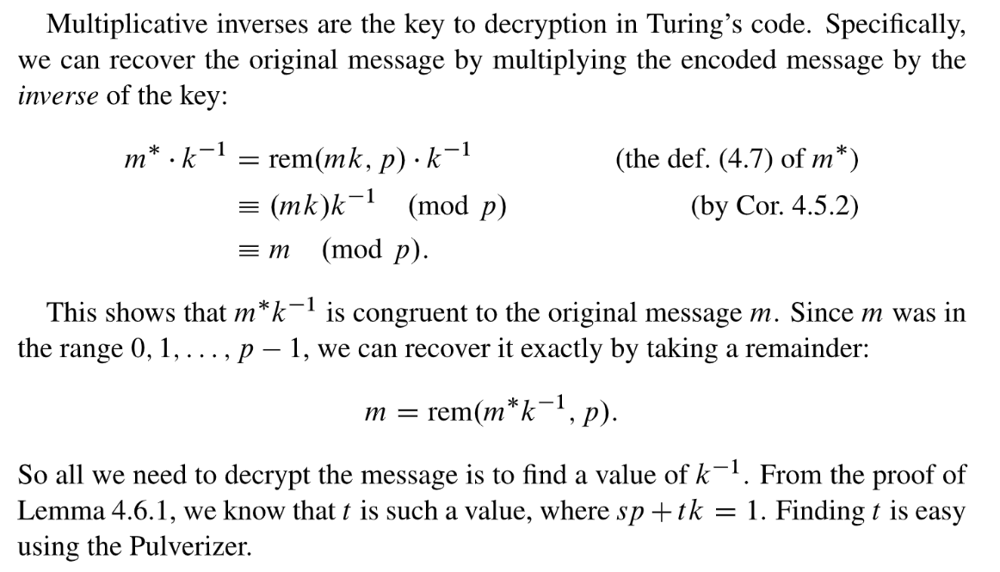
> 🔔: 本质上，这种方法是对`Secret Key`$k$在$p$下的`Multiplicative Inverse`$k^{-1}$，和$m^*$相乘之后求出在$p$下的余数得到$m$。

## Cancelling Multiplicative
### Difference
> 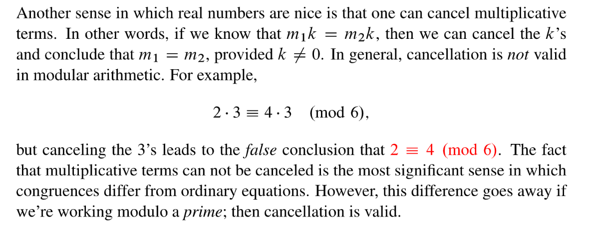

### Lemmas 4.6.2
> 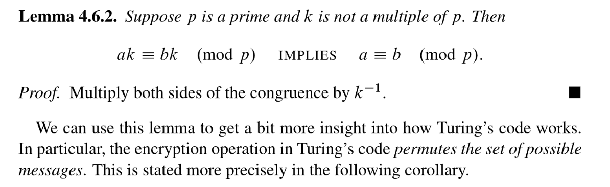

### Corollary 4.6.3
> 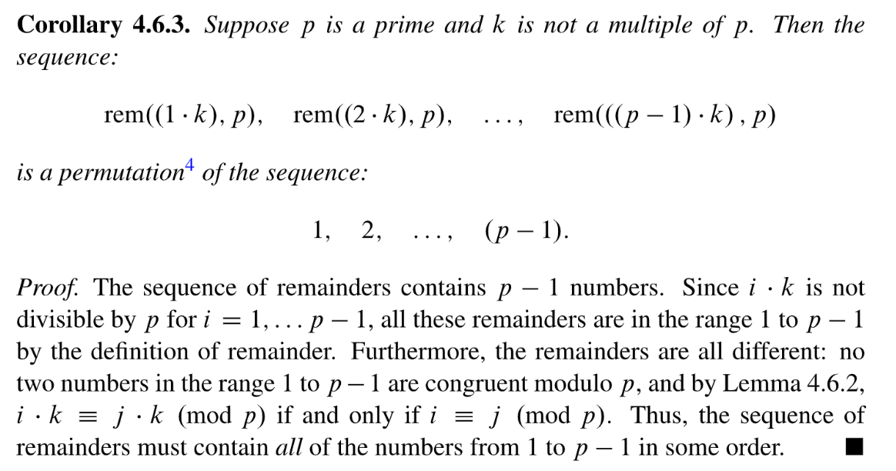
> 这个定理证明的思路是: 任意 $i\cdot k$和$j\cdot k$模$p$的余数都不同(根据`Lemma 4.6.2`), 且余数的取值只有$\{0,1,2,\cdots, p-1\}$, 于是我们可以确定结论是正确的。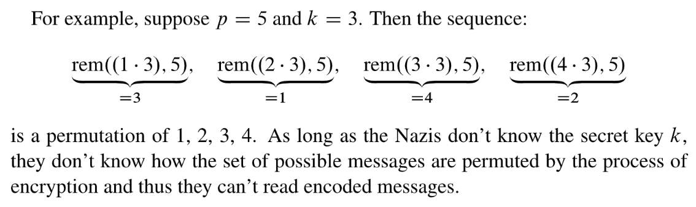

## Fermat's Little Theorem
### Theorem
> 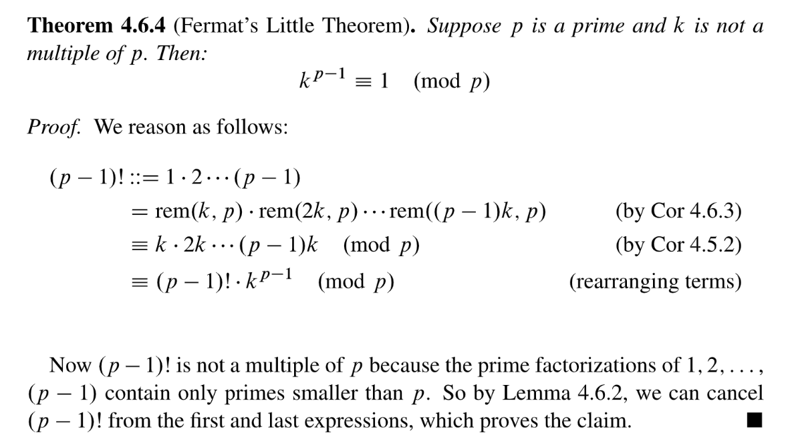

### Decrypt the Message
> 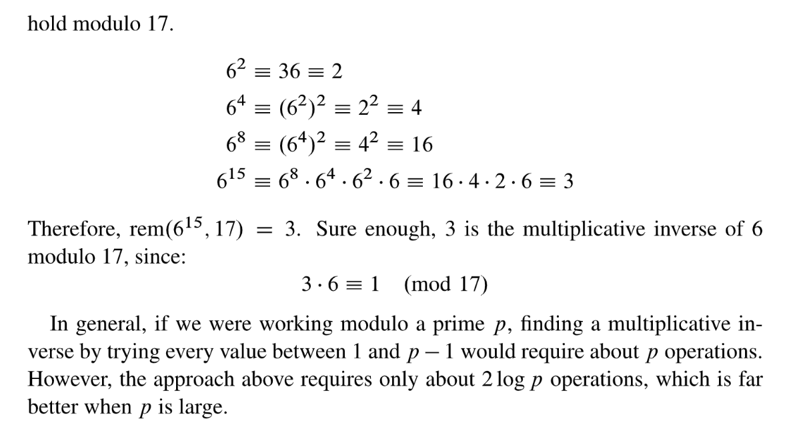

## Major Flaws of Version 2.0
> **Known-Plaintext-Attack: 说的就是如果黑客同时知道明文和秘文就可以求出秘钥**`**k**`**。**
> 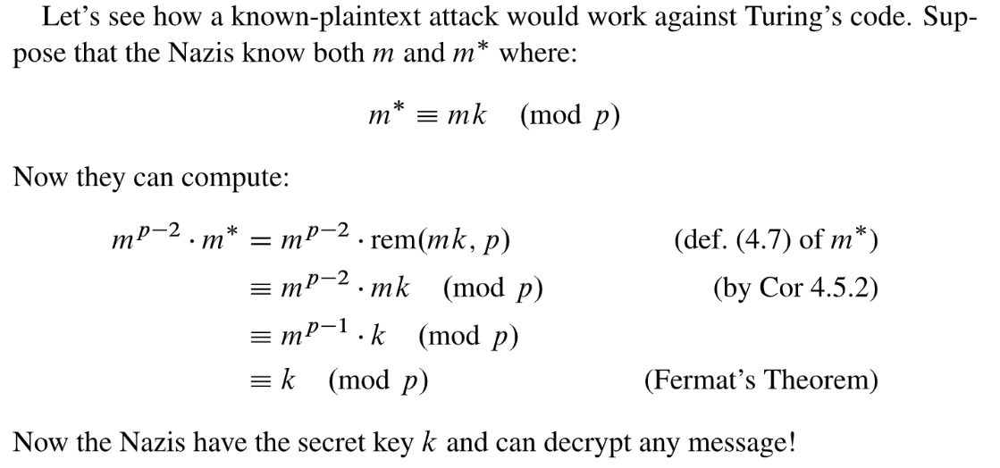
> 最后一个$\equiv$成立是因为$m$的取值范围是$\{0,1,2,\cdots, p-1\}$, 所以根据费马定理$m^{p-1}\equiv 1 \ (mod~~p \ )$。

# Arbitrary Modulus
## Lemma 4.7.1
> 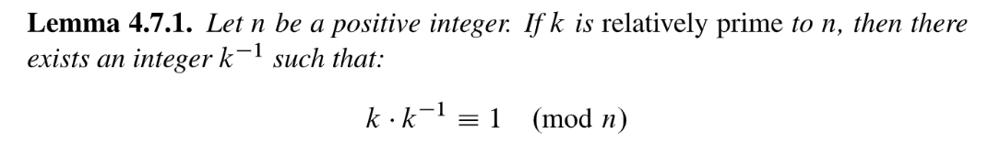

## Generalizations
### Corollary 4.7.2
> 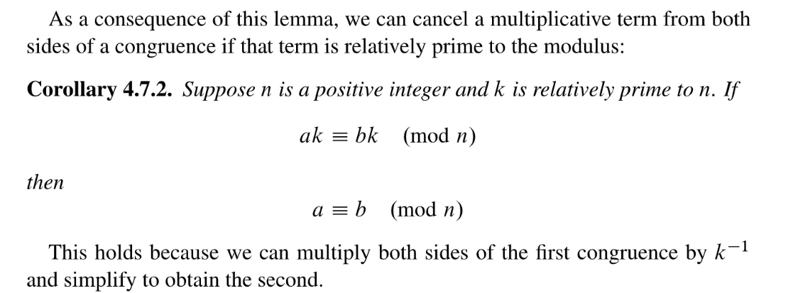

### Lemma 4.7.3
> 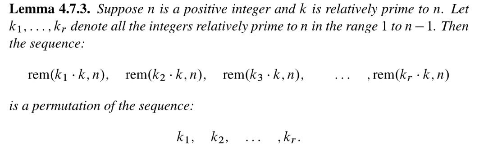
> This is the natural generalization of `Corollary 4.6.3`。
> 本质上这个推论就是把`Corollar 4.6.3`中的$1,2,\cdots, p-1$替换为了$k_1, k_2,\cdots, k_r$，得到更加普遍化的结论。

**Proof**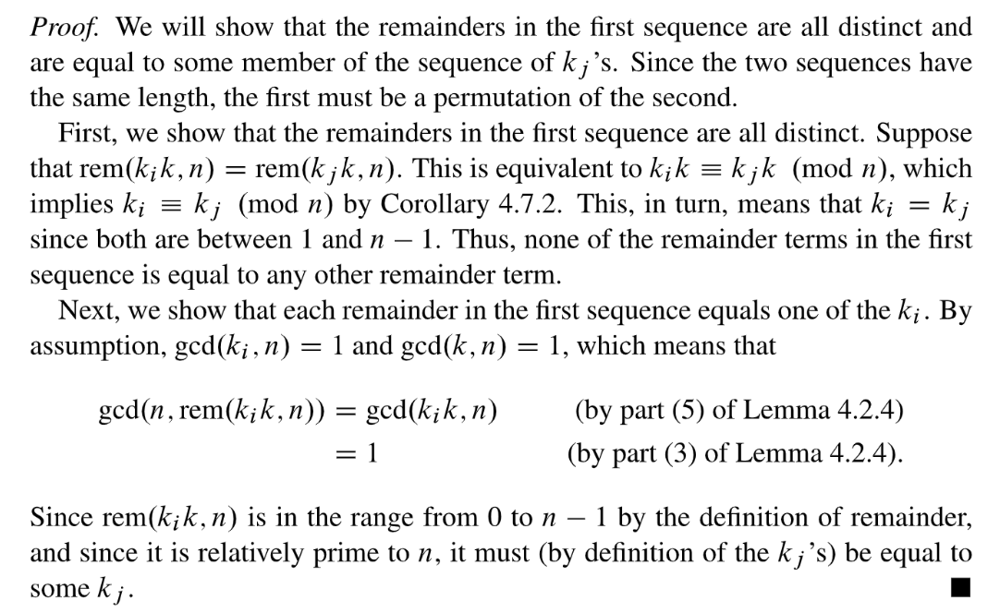

## Euler's Theorem
> 🔔: 欧拉定理是`Fermat's Little Theorem`的一般形式

### Euler's Totient Function
> $\Phi(n)$denotes the number of integers in $\{1,2,3,\cdots, n\}$that are relatively primal to $n$.
> For example, $\Phi(7)=6$ since $1$, $2$, $3$, $4$, $5$, and $6$ are all relatively prime to $7$. 
> Similarly, $\Phi(12)=4$ since $1$, $5$, $7$, and $11$ are the only numbers in $[1, 12]$ that are relatively prime to $12$.

### Theorem 4.7.4
> 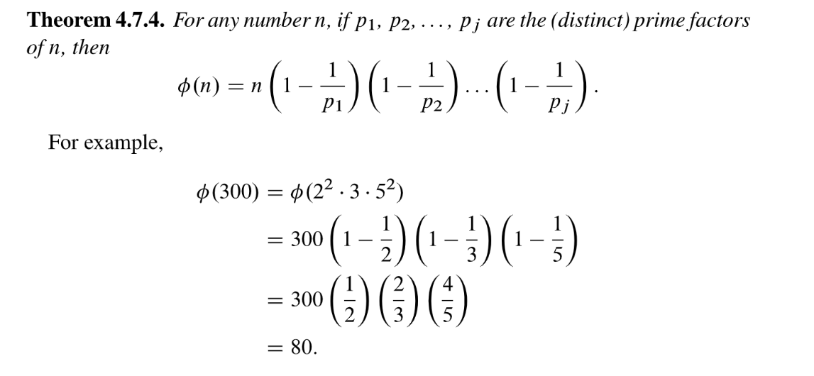

### Corollary 4.7.5
> 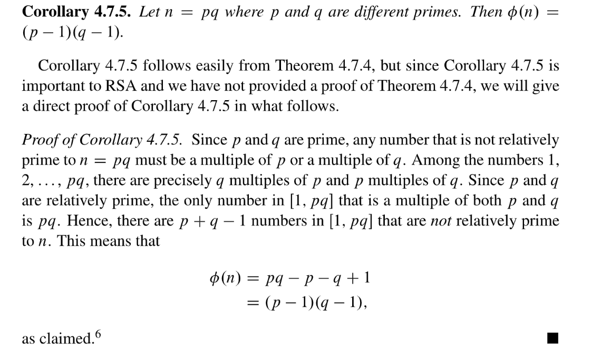

## Proof of Euler's Theorem
> 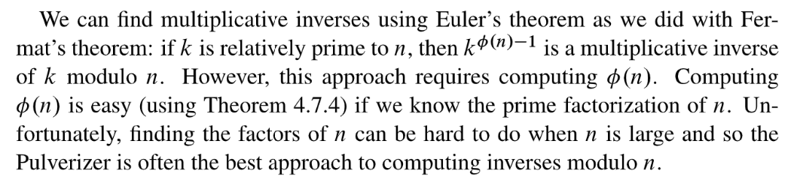

