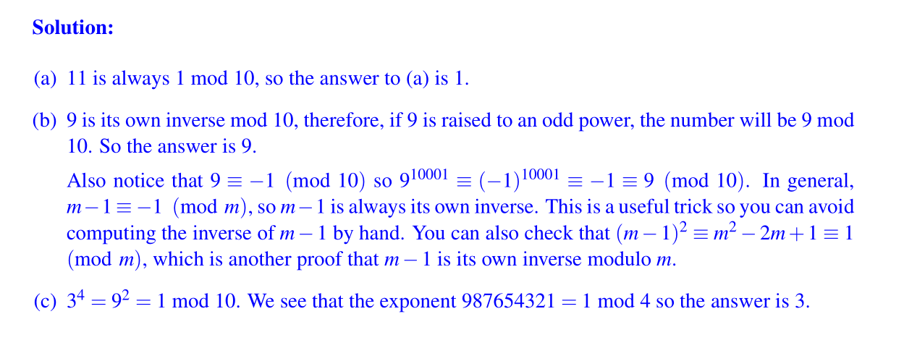
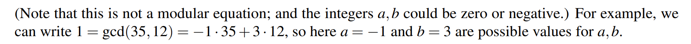
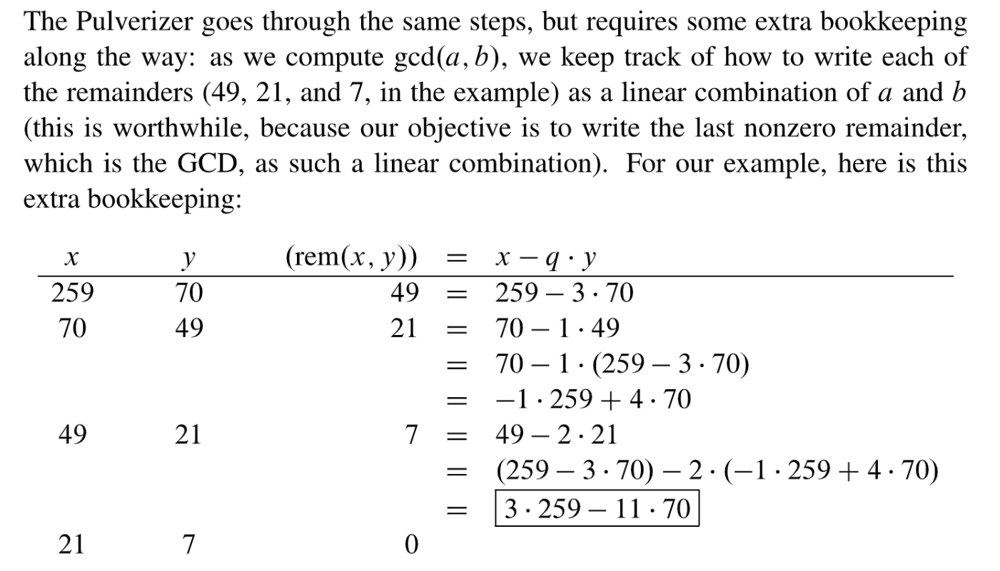
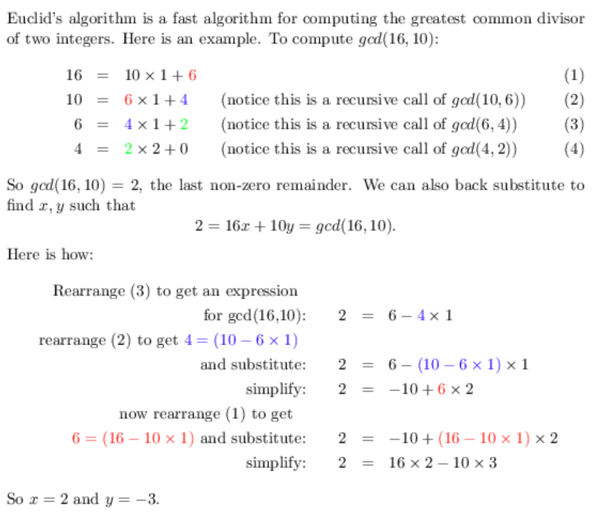
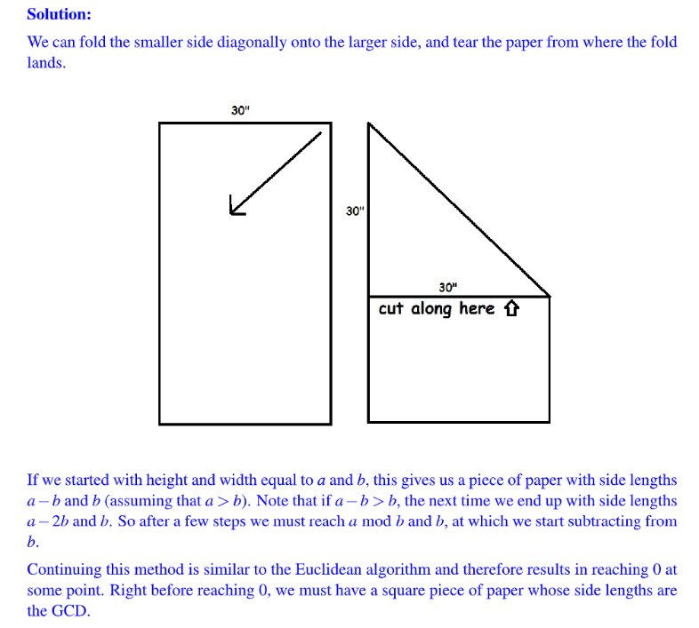
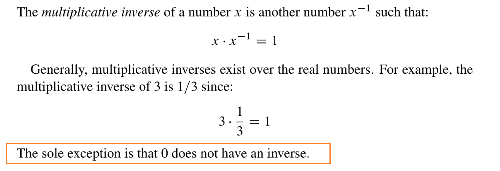
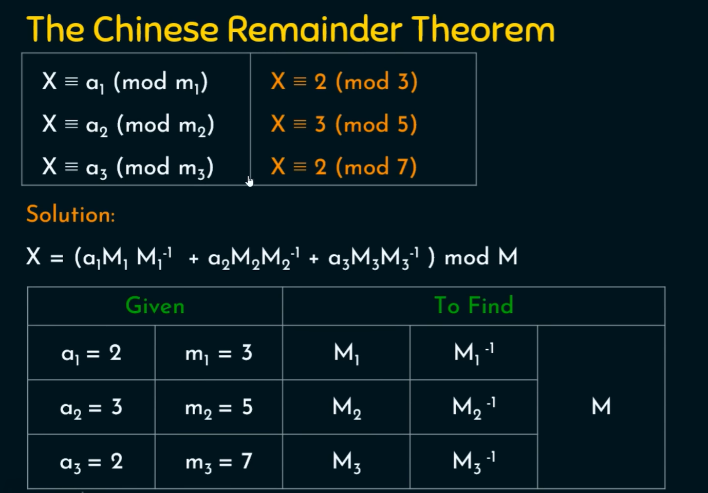

> Mathematics for Computer Science Chapter 4

[MIT6_042JF10_chap04.pdf](https://www.yuque.com/attachments/yuque/0/2023/pdf/12393765/1678195120528-9704e698-4020-45a2-99a3-e53984142816.pdf)
[Modular Arithmetic.pdf](https://www.yuque.com/attachments/yuque/0/2023/pdf/12393765/1679755632021-ef49f0a3-6476-4f03-810f-1cdefc96ec72.pdf)

# Divisibility
## Definition
> 


## Properties
> 

**Solution**
> **下面是一些常用结论:**
> - $ac|b\implies a|b~~and~~c|b$, 反之不一定成立。证明很简单，因为$ac|b$则$b=k\times (a\times c)=(k\times a)\times c=(k\times c) \times a$，这说明$a|b$以及$c|b$。
> - 如果$a_1,a_2,\cdots, a_n$都是素数且$a_1|n, a_2|b, \cdots, a_n|b$, 则$a_1a_2\cdots a_n|b$, 这在`CRT`中经常会用到。


## Division Theorem
> 

**Solution**

## Examples
> 


# Modular Arithmetic Basics
## Congruence
> 
> 🔔: 这个定义非常重要，后续我们会经常用到。


## Remainder Representation
> 
> `Congruence`就是同余的意思，所以上述结论显然成立。

**Proof**⭐⭐⭐⭐⭐
**Example**
:::success

🔔: 这个推论非常重要，后续我们会经常用到。
**Proof: **我们知道$a - (a-qn)=qn$, which is divisible by $n$, which means $n|a-rem(a,n)$, thus by definition $a\equiv rem(a,n) \ (mod \ n)$。
🔔: 同于符号代表符号两侧的整数在同时除以一个整数时的余数相同，所以`Modulus`本质上是把整数分成了几个集合。对于`Modulus n`来说(mod n), 它会把整数分成$n$个集合，每个集合中的整数$i$分别对应满足$rem(i, n)=0,1,2,\cdots, n-1$。

:::


## Properties of Mod Congruence
> 

**Proofs**
**Proof for 7:**
$\because a\equiv b(mod~n)\therefore ac\equiv bc(mod~n)$By property 5
$\because c\equiv d(mod~n)\therefore cb\equiv db(mod~n)$By property 5
$\therefore ac\equiv bc \equiv cb \equiv db \equiv bd (mod~n)$By symmetry and property 3


## Set Representation
> 
> **注意点:**
> 1. 对于`Modulus m`来说，余数有$\{0,1,2,\cdots, m-1\}$这$m$中情况，每一个余数$i$对应一个集合$S_{m,i}=\{m\cdot x+i|x\in \mathbb{Z}\}$, 表示所有除以$m$余$i$的数字组成的集合, 且**这些集合互斥**($S_{m,i}\cap S_{m,j}=\emptyset,\forall i\neq j$)
> 2. $x~~(mod~~m)$表示为$S=\{0,1,2,\cdots,m-1\}$中的一个数，即$x\in S$。


## Notation Summary
> 
> **注意点:**
> 1. 表示同余，$a\equiv b~~(mod~~ n)$和$a= b~~(mod~~ n)$都可以。
> 2. $x~~(mod~m)$可以表示为$x$除以$m$的余数, 也可以表示为$S=\{0,1,2,\cdots,m-1\}$中的一个数


## Calculation Examples
:::success

:::

# Exponentiation
## Introduction
> 🔔:  How do we compute $x^y$ mod m, where x, y, m are natural numbers and $m > 0$? 
> A naïve approach would be to compute the sequence x mod m, $x^2$ mod m, $x^3$ mod m ,... up to $y$ terms, but this requires time exponential in the number of bits in $y$.(如果$y$是$3$位的，比如$000$, 则我们需要尝试所有能够通过$y$的位数能够组合出来的整数，三位能表示8个整数，也就是$2^3$, 这就是Exponential in the bits的意思)。


## Repeated Squaring Algorithm
> We can do much better using the trick of repeated squaring:
> 

**Proof for correctness - By Strong Induction**
1. **Base Step:** $y=0$, 此时算法返回$1$, 因为$x^0~mod~m=1~mod~m=1$, 所以算法返回的值是正确的。
2. **Inductive Hypothesis:** $0\leq y\leq n$均成立，即算法$mod-exp(x,k,m)=x^k~mod~m$。
3. **Inductive Step:** $y=n+1$时:
   1. 如果$n+1$是偶数，则算法返回$\begin{aligned}(mod-exp(x, \lfloor \frac{n+1}{2}\rfloor,m))^2~~mod~~m&=(x^{\lfloor \frac{n+1}{2}\rfloor}~~mod~~m)^2~~mod~~m\\&=(x^{\lfloor\frac{n+1}{2}\rfloor})^2~~mod~m\\&=x^{n+1}~mod~m\end{aligned}$
   2. 如果$n+1$是奇数，则算法返回

$\begin{aligned}(mod-exp(x, \lfloor \frac{n+1}{2}\rfloor,m))^2\times x~~mod~~m&=(x^{\lfloor \frac{n}{2}\rfloor}~~mod~~m)^2\times x~~mod~~m\\&=(x^{\lfloor\frac{n}{2}\rfloor})^2\times x~mod~m\\&=x^{n}\times x~mod~m\\&=x^{n+1}~mod~m\end{aligned}$
所以证毕。
> 这里我们要证明一个非常重要的结论，就是$(y~mod~n)^2~mod~n=y^2~mod~n$。
> 令$y=n\cdot q+r, 0\leq r<n$, 则$(y~~mod~~n)^2~~mod~~n=r^2~mod~n$
> $y^2=n^2q^2+2nqr+r^2=nq'+r^2$, $y^2~mod~n=r^2~mod ~n$
> **下列关于**$mod$**的符号表示是等价的:**
> 1. $a~~mod~~b=a-\lfloor \frac{a}{b}\rfloor b~~mod ~~b$
> 2. $a~~mod~~b=a-\lfloor \frac{a}{b}\rfloor b$

```java
public class ModExponential {
    public int modExponential(int x, int y, int m) {
        if (y == 0) {
            return 1;
        }
        int z = modExponential(x, Math.floorDiv(y, 2), m);
        if (y % 2 == 0) {
            return Math.floorMod(z * z, m);
        } else {
            return (Math.floorMod(x * z * z, m));
        }
    }

    public static void main(String[] args) {
        ModExponential me = new ModExponential();
        System.out.println(me.modExponential(9, 10001, 10));
    }
}

```

## Runtime Analysis
> 
> 🔔: 本质上, `recursive call`的数量和$y$的二进制表示的位数呈线性增长关系。比如我们要计算$3^{16}(mod~5)$, 则此时我们的`recursive call`的数量就是$log_2{16}=4$。


## Practices
> 

**Solution 1 - Periodicity**
**Solution 2 - Proof⭐⭐⭐**
> 一个重要的小技巧: $m-1\equiv -1(mod~m)$, 所以$(m-1)(m-1)\equiv -(m-1)~(mod~m)$
> 因为$-(m-1)\equiv 1~(mod~m)$, 所以$m-1$是自身的`Multiplicative Inverse modulo m`。


# The Greatest Common Divisor(GCD)
## Definition
> The_ greatest common divisor _of $a$ and $b$ is exactly what you' d guess: **the largest number that is a divisor of both **$a$** and **$b$**. It is denoted by **$gcd(a, b)$**.**
> 写成数学符号就是假设$m=gcd(a,b)$, 则$m|a, m|b$。
> For example, $gcd(18, 24) = 6$. The greatest common divisor turns out to be a very valuable piece of information about the relationship between a and b and for reasoning about integers in general. 
> **注意: **$gcd(x,0)=x$。


## Bezout Identity⭐⭐⭐⭐⭐
> 
> 🔔: 但是这个定理仅仅说明了存在性，却没有给出如何构造这样的线性组合。
> 🔔: 构造的过程由之后将要介绍的`Extended Euclidean GCD Algorithm`给出。
> 🔔: This theorem is sometimes called "Bezout Identity".
> 

**Example**
**Proof**⭐⭐⭐⭐⭐
> 

**Proof**⭐⭐⭐

## Properties of GCD
> 
> 注意定理第五条中我们也可以写成$gcd(a,b)=gcd(rem(b,a),a)$, 本质上是等价的，下面我们会证明这个等价命题。
> **🔔下面是一些证明:**
> **Proof of 1: 根据**`**Bezout Identity**`**我们知道**`**gcd(a,b) = sa + tb for some s and t**`**. 而我们又知道所有的**`**Common Divisor m**`**都满足**$m|a$**和**$m|b$**, 所以根据**`**Divisor**`**的线性性质，我们有**$m|ua+vb$**for some u and v. 所以**$m|gcd(a,b)$**。**
> **Proof of 2: **$gcd(ka,kb)=\min_{s,t}\{s\times ka+t\times kb|s,t\in \mathbb{R}\}=k\times \min_{s,t}\{s\times a+t\times b|s,t\in \mathbb{R}\}=k\times gcd(a,b)$
> 
> **Proof of 5(利用线性组合关系即可): **
> 


## Euclid Algorithm
> 欧几里得算法旨在为一对整数$(x,y)$, $x\geq y>0$找到$gcd(x,y)$。因为$gcd(x,y)=ax+by$

### Algorithm
> 
> ⭐: 所以整个算法会在较小的数变成$0$时停止，并返回较大的数作为`GCD`。
> 

**Proof of Correctness**
```java
public class Euclid {
    public int euclid(int x, int y) {
        if (y == 0) {
            return x;
        }
        return euclid(y, Math.floorMod(x, y));
    }

    public static void main(String[] args) {
        Euclid e = new Euclid();
        System.out.println(e.euclid(3,6));
    }
}

```

### Runtime Analysis
> 
> 我们更精确地描述一下这个算法的时间，由于每次`gcd(x,y)`的`Recursive Call`都会使得第一个参数缩小两倍或者在下一次`Recursive Call`的时候使第一个参数缩小两倍。假设$x$是一个`n-bit integer`，则我们需要**介于**$n$**和**$2n$次`Iterations`完成算法的调用。


## Extended Euclid Algorithm
### Definition
> 我们可以使用`Extended Euclid Algorithm`找到$s,t$使得$gcd(a,b)=s\cdot a+t\cdot b$。
> 


### Comparison
**Euclid Algorithm**

**Extended Euclid Algorithm**



### Algorithm - Recursive Version
> 
> **我们发现:**
> 1. 算法的每一次`Recursive Call`$egcd(x,y)$返回的三元组$(d,a,b)$都满足$d=ax+by$，即$gcd(x,y)=ax+by$。
> 2. 当$gcd(x,y)=(1,a,b)$时(即$gcd(x,y)=1$, $x,y$互质)，$y\cdot b\equiv 1~~(mod~~x)$，即$b$是$y$的`Multiplicative Inverse Modulus x`(后面会介绍)。
> 

> **算法的递归调用栈和运行结果序列是:**
> $gcd(35,12)\to gcd(12, 11)\to gcd(11, 1)\to gcd(1, 0)$
>            $(1,-1,3)\leftarrow(1,1,-1)\leftarrow(1,0,1)\leftarrow(1,1,0)$
> 最终的结果是$d=1,a=-1,b=3$, 所以$12\cdot 3\equiv 1(mod~~ 35)$。

**Proof of Correctness**对于`extended-gcd(x,y)`算法来说，我们在$y$上使用归纳法:
令`Inductive Hypothesis`为$P(y)$: $d=ax+by$where $gcd(x,y)=(d,a,b)$$\forall x\geq y$
因为我们上文已经证明过，$gcd(x,y)$返回的$d$一定是正确的，所以我们只需要验证每一步的线性组合系数是正确的即可。

1. **Base Step:** $y=0$时，$gcd(x,0)=(x, 1,0)$, $x=1\cdot x+0\cdot y$, 满足假设。
2. **Inductive Hypothesis: **假设对于$\forall 0\leq z<y\leq x$来说，$P(y)$成立。
3. **Inductive Step:** 对于$gcd(x,y)$算法首先执行$gcd(y, x~mod~y)=(d, a,b)$, 并且返回$(d, b, a-\lfloor \frac{x}{y}\rfloor b)$, 我们要证明$d=bx+(a-\lfloor \frac{x}{y}\rfloor b)y$。

因为$x~mod~y<r$, 所以根据`Inductive Hypothesis`$gcd(y, x~mod~y)$返回的结果满足$d=a\cdot (x~mod~y)+b\cdot y$, 因为$x~mod~y=x-\lfloor \frac{x}{y}\rfloor y$, 所以$d=a\cdot (x-\lfloor \frac{x}{y}\rfloor y)+b\cdot y=ax+(b-a\cdot \lfloor \frac{x}{y}\rfloor)y$, 证毕。
```java
import java.util.ArrayList;
import java.util.List;

public class ExtendedEuclid {

    public int[] extendedEuclid(int x, int y) {
        if (y == 0) {
            int[] res = new int[3];
            res[0] = x;
            res[1] = 1;
            res[2] = 0;
            return res;
        }
        int[] last = extendedEuclid(y, Math.floorMod(x, y));
        int[] res = new int[3];
        res[0] = last[0];
        res[1] = last[2];
        res[2] = last[1] - Math.floorDiv(x, y) * last[2];
        return res;
    }

    public static void main(String[] args) {
        ExtendedEuclid ee = new ExtendedEuclid();
        int[] res = ee.extendedEuclid(16, 10);
        System.out.println(List.of(res[0],res[1],res[2]));
    }
}

```

### Algorithm - Hand Calculation
> 

**More Examples**


### Runtime Analysis
> 


## Jug Problem⭐⭐⭐⭐⭐
### Problem Settings
> 
> 本质上`Jug Problem`中有两个`Jugs`, 容量分别为`a`和`b`, 假设$b\geq a$, 可以进行的操作有:
> 1. 充满容器`a`或者`b`。
> 2. 将其中一个容器中的水倒到另一个容器中，且我们不能使得被倒水的容器溢出。
> 3. 清空容器`a`或者`b`。


### Problem Invariant
> 

**Proof of Lemma**
🔔** Very Important: **The total amount of water is preserved, which is always $j_1+j_2$。


### Important Theorem
> 
> 结论很显然，首先对于$a,b$的任意公约数$m$，都有$m|a,m|b$, 所以$m|ax+by$， 因为$gcd(a,b)\in m$， 所以$gcd(a,b)|ax+by$, 所以$(ax+by)=k\cdot gcd(a,b)$，证毕。


### Algorithm Steps
> 通过上面的证明，我们知道在`Water Jug Problem`中，假设我们有容量为`a`和`b`的两个`Jugs`, 则:
> 1. 任何一个`Jug`里的水量都是`a`和`b`的线性组合。
> 2. 任何一个`Jug`里的水量都是`gcd(a,b)`的倍数。
> 
假设`a = 21`且`b = 26`, 则:
> 
> 本质上我们需要求出$s'$和$t'$, 其中$s'>0$且$t'<0$，算法步骤如下, 我们要重复下列步骤$s'$次(这也是为什么我们要$s'>0$。)
> 

**Concrete Steps**⭐⭐⭐⭐⭐
**Proof of algorithm**⭐⭐⭐Suppose that we have filled the `a-jug` $s'$times and that `b-jug`has been emptied $u$times.
Let's say that at this moment `r`is the remainder in the `b-jug`, so$r=s'\cdot a-u\cdot b$always holds and that we have the constraint $0\leq r\leq b$。
🔔: We want to prove that $L=s'\cdot a+t'\cdot b=r$ where $0<L<b$. 
Since $r=s'\cdot a+t'\cdot b-t'\cdot b-u\cdot b=L-(t'+u)\cdot b$and $0\leq r\leq b$, if $t'+u>0$or $t'+u<0$, then $r$falls out of its domain. Thus $t'+u=0$。
Thus $r=L$as desired.

### 总结
> 假设我们有两个罐子，容量分别为$a,b$, 最后要求得到一杯装有容量$c$的罐子，则我们有以下步骤:
> 1. 计算$gcd(a,b)$, 看看$gcd(a,b)|c$是否成立，也就是$gcd(a,b)$是否整除$c$。
> 2. 如果整除，则表明存在这样的解，只要按照以下操作进行即可:
> 

> 3. 如果不能整除，则说明使用$a,b$这两个罐子不能达成最终的目标。


## Practice Exercises
### Euclid Algorithm - Graphically
> 

**Solution**⭐⭐⭐⭐⭐

### Euclid Algorithm - Recursion Practice
> 

**Solution**


### Extended Euclid Algorithm
> 

**Solution**

### Fibonacci GCD
> **HW04 P1 Fa20**
> 

**Proof**


# Modular Inverse
## Definition
> 
> 🔔: 注意上述定义中，连接等式两边的是$=$, 关于$=$的乘法逆元往往不是整数，比如我们找不到整数使得$7$和其相乘的结果是$1$。
> 下面我们要介绍的是关于$\equiv$的`Multiplicative Inverse`，关于$\equiv$的乘法逆元**一定是**整数，详细请看下面的例子:
> 
> 所有和$3$在`Modulus 5`下同余的整数和$7$都构成`Multiplicative Inverse`的关系，换句话说，任何模$3$余$5$的整数都是$7$的乘法逆元。
> 🔔: 注意，$0$不但在$=$下没有乘法逆元，在$\equiv$(任何`Positive Modulus`)下都没有乘法逆元，毕竟零除以任何数的余数都是$0$。


## 充分条件和必要条件
> **对于**$A$**和**$B$**两个**`**Statements**`**, 我们有:**
> 1. $A$是$B$的充分条件，说明$A\implies B$
> 2. $A$是$B$的必要条件，说明没有$A$, $B$也就不成立，换句话说就是$\neg A \implies \neg B$, 其等价逆否命题就是$B\implies A$。
> 3. $A$是$B$的充要条件，则$A\iff B$。


## Existence of Inverses⭐⭐⭐⭐⭐
> 
> 🔔: 注意这里存在和唯一均满足

**Proof of the Theorem**
**Examples**
> 

**Proof of the Necessary Condition**令$gcd(m,x)>1$为$P$, "x has no multiplicative inverse modulo m" 为$Q$。
我们要证明$P\implies Q$, 通过`Proof by Contradiction`的方法, 也就是要证明$P\land \neg Q$是`F`即可。
**完整证明:**
因为$gcd(m,x)>1$(Assumed to be true), 则$m=q\cdot c,x=p\cdot c$其中$c=gcd(m,x)>1,~~p,q\in \mathbb{Z}$。
因为存在$a$使得$ax\equiv 1~(mod~m)$成立，则$m|(ax-1)$成立，即$ax-1=k\cdot m$for some $k\in \mathbb{Z}$
将$\begin{cases} m=q\cdot c\\x=p\cdot c\end{cases}$带入$ax-1=k\cdot m$我们有$a\cdot p\cdot c-1=k\cdot q\cdot c$, 所以$(ap-kq)c=1$, 因为$c>1$, 所以$0<ap-kq<1$, 而$ap-kq\in \mathbb{Z}$, 所以矛盾。即原命题成立。
**Counter Examples**


## Computing Inverses - EGCD
> 
> 原因在于，$gcd(x,y)=ax+by=1$时，我们取$mod~m$得到$by\equiv ax+by\equiv 1(mod~x)$, 所以$y=x^{-1}(mod~m)$。
> 记忆方法: 假设我们要求$x$在$mod~m$下的`Inverse`, 我们可以调用`gcd(m,x)`, 返回的结果`(d,a,b)`中我们取$b$作为`Inverse`即可。
> 所以我们只需要简单的调用`egcd`算法即可在$O(n)$的时间复杂度下找到`Modular Inverse`。


## Bijection on Modulo
> 


## Practice Exercises
### Mechanic Practices
> 

**(a) **No, since $3\cdot 5 \equiv 5(mod~10)$, 不符合定义。
**(b) **
**(c) Using Congruence Properties**
**(d) **$4x \equiv 1(mod ~8)$相当于$8|4x-1$, 这是定义。

**(e) Uniqueness of multiplicative inverse**⭐⭐⭐⭐⭐

### Last Digit
> **HW04 P2 Fa20**
> 

**Solution (a) Modular Inverse**
**Solution (b) Finding the Patterns**


### Product of Two⭐⭐⭐
> 
> 本质就是构造一个`Bijection`来完成证明。

**Proof**
这里$f(y)=xy^{-1}(mod~m)$是一个`Bijection`: $\{1,2,\cdots, p-1\}\to \{1,2,\cdots, p-1\}$


# Congruence Equation
## Lemma
> 


## Theorem
> 
> **Proof:**
> 1. **Existence:**
> 
If the equation $a x \equiv c \bmod m$ has a solution $x_0$, then by definition, $a x_0-c$ is divisible by $m$. This implies that $m$ divides $a x_0-c$, or in other words, $a x_0-c=m k$ for some integer $k$. Rearranging gives $a x_0=m k+c$. Since $d$ divides both $a$ and $m$, it must also divide the right side of the equation, and therefore $d$ divides $c$.
> Conversely, if $d$ divides $c$, then we can write $c=d h$ for some integer $h$. Since $d=$ $\operatorname{gcd}(a, m)$, there exist integers $u$ and $v$ such that $a u+m v=d$ (**Bézout's identity**). Multiplying both sides by $h$ gives $a u h+m v h=d h$. Since $d$ divides $c$, we can write $c=d h$ and the equation becomes $a u h \equiv c \bmod m$. Thus, $x_0=u h$ is a solution to the congruence $a x \equiv c \bmod m$.
> 2. **Form of all solutions:**
> 
If $x_1$ is another solution, then $a x_1 \equiv c \bmod m$ and $a x_0 \equiv c \bmod m$. Subtracting these two congruences, we get $a\left(x_1-x_0\right) \equiv 0 \bmod m$. This means $m$ divides $a\left(x_1-x_0\right)$. Given that $d$ is the greatest common divisor of $a$ and $m$, it follows that $\frac{m}{d}$ divides $x_1-x_0$. Thus, any two solutions differ by a multiple of $\frac{m}{d}$. This means all solutions have the form $x=x_0+k \frac{m}{d}$, where $k$ is an integer.
> 3. **Exactly d solutions:**
> 
From the previous part, we know the general form of the solutions. Now, for each $k$ in the set $\{0,1, \ldots, d-1\}$, we get a distinct solution modulo $m$. If we take $k=d$, the term $k \frac{m}{d}$ is equivalent to 0 modulo $m$, so we get back the solution $x_0$. Thus, there are exactly $d$ distinct solutions modulo $m$.


## Function Perspective
> 
> 首先因为$gcd(n,a)=d$, 所以$gcd(\frac{n}{d},\frac{a}{d})=1$, 即$g(x)=\frac{a}{d}x(mod~\frac{n}{d})$is a bijection over $\{0,1,\cdots,\frac{n}{d}-1\}$, 所以$ax(mod~m)$相当于放大了$d$倍，但是`Output`个数仍然是$\frac{n}{d}$, 想象一下有间隙，`Output for`$f(x)$is sparse.


## Examples
> 


# Chinese Remainder Theorem
## Motivation
:::success

:::


## Two-Modulus Theorem
> 
> 就是只能找到唯一一个$x\in \{0,1,\cdots, mn-1\}$使得$x\equiv a~(mod~n)$和$x\equiv b~(mod~m)$成立。

**Proof**
**Simpler Proof**


## Multi-Modulus Theorem
> 

**Explanations**


## Isomorphism
> 我们可以将满足`Multi-Modulus Theorem`的$x$想象成坐标形式:
> 因为$x=\sum_{i=1}^k a_ib_i (mod~N)$, 可以将$a_i$看成坐标系数，$b_i$看成是基,于是:
> $x\leftrightarrow(a_1,a_2,\cdots, a_k)$
> 如果此时另外一个$y$满足上述定理，我们有$y\leftrightarrow (b_1,b_2,\cdots, b_k)$，则`Isomorphism`说的是$x+y \leftrightarrow (a_1+b_1,a_2+b_2,\cdots, a_k+b_k)$。
> 


## Numerical Examples
### Solving Simultaneous Congruence
> 


### Finding All Solutions
> 


## Practices
### Mechanic Exercises
> 

**(a) Observations**
**(b) Finding a**
**(c) Finding b**首先找到$3\times 7$的`Modular Inverse mod 5`, 取$b^*=1$就满足。
此时$3\times 7\times 1\equiv 1~(~mod~5)$, 两边同乘以$3$得到$3\times 7\times 1\times 3\equiv 3~(~mod~5~)$
所以$b=63$。
**(d) Finding c**首先找到$3\times 5$的`Modular Inverse mod 7`, 取$c^*=1$就满足。
此时$3\times 5\times 1\equiv 1(~mod~7)$, 两边同乘以$4$即可，得到$c=3\times 5\times 1\times 4=60$。
**(e) Finding x**$x=a+b+c=140+63+40=243$


### CRT Decomposition
> 

**(a)**$385=11\times 7\times 5$
**(b)**$3^{302}=3^{(11-1)\times 30+2}\equiv 9(~mod~11)$
$3^{302}=3^{(7-1)\times 50+2}\equiv 9\equiv 2(~mod~7)$
$3^{302}=3^{(5-1)\times 72+2}\equiv 9\equiv 4(~mod~5)$
**(c) Be Careful!!!**我们有$x \equiv 4(\bmod 5), x \equiv 2(\bmod 7), x \equiv 9(\bmod 11)$成立:
令$a_1=4,a_2=2,a_3=9$, $n_1=5,n_2=7,n_3=11$, $N=5\times 7\times 11$:
$b_1=(\frac{N}{n_1})(\frac{N}{n_1})^{-1}_{n_1}(\bmod~ N)=77\times 3~(\bmod~385)=231$
$b_2=(\frac{N}{n_2})(\frac{N}{n_2})^{-1}_{n_2}(\bmod~N)=55\times6(\bmod~385)=330$
$b_3=(\frac{N}{n_3})(\frac{N}{n_3})^{-1}_{n_3}(\bmod~N)=35\times 6(\bmod ~385)=210$
所以$x=4\times 231+2\times 330+9\times 210(\bmod 385)=9(\bmod 385)$


## Real-World Applications
### Sparsity of Primes
> **HW04 P4**
> 
> `Prime Power`说的是一个数只能表示成一个质数的乘方，不能有其他的`Prime Factor`。

**Proof**


### Stitching the Needles
> 

**Solution**


# Fermat Little Theorem
## Main Theorems
> 

**Formal Proof**
**Example**


## Variant of Main Theorem
> 
> 注意到上面的$a^{p-1}\equiv 1~(~~mod~~p)$当且仅当$a\neq 0(~mod~p)$的时候成立，但是$a^{p}\equiv a(mod~p)$对所有的$a$都是成立的，我们可以利用这个性质解决很多问题。


## Practices
### Fermat Basics
> 

**(a)**
**(b)**
**(c)**


### Fermat&CRT
> 

**Solution**
