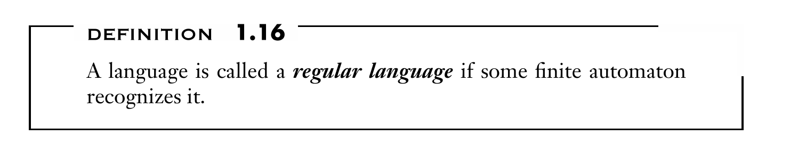

# Finite Automaton
## Definition
> [!def]
> 

## Examples
> [!example] Siper Ch1.1 pp61 ~ pp64
> 

# Regular Language
## Definition
> [!def]
> 

## Design Finite State Machines
> [!example] Siper Ch1.2 pp67
> 

# Regular Operations
> [!def]
> 

