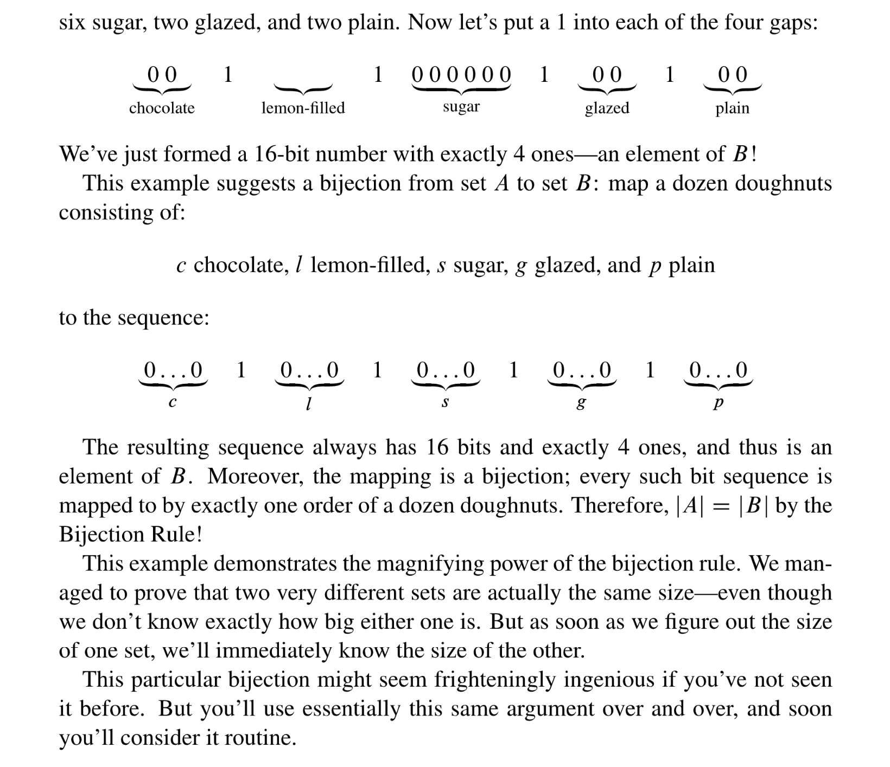
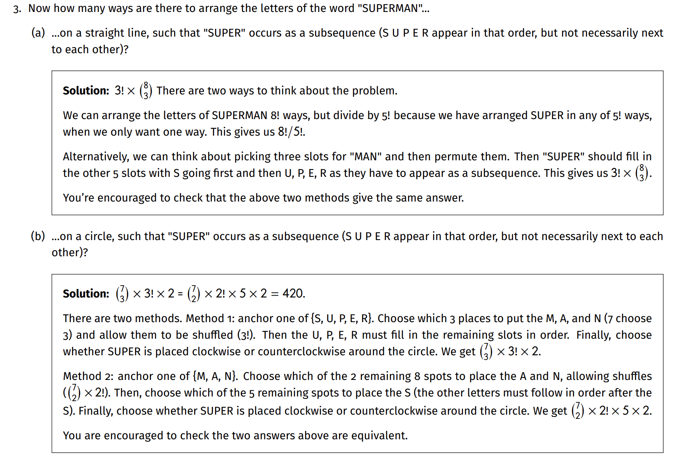
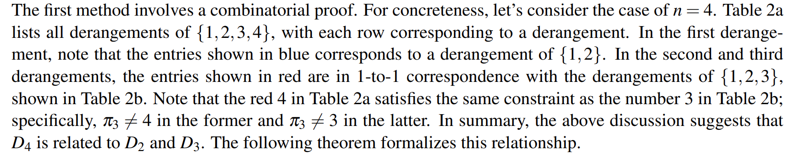

[10 Counting.pdf](https://www.yuque.com/attachments/yuque/0/2023/pdf/12393765/1693226199102-a277a97d-ff1e-4c47-b5b5-b83977928ee0.pdf)
[MIT6_042JF10_chap11.pdf](https://www.yuque.com/attachments/yuque/0/2023/pdf/12393765/1693226194998-1117923e-1800-47d3-b949-5f93ec316b4d.pdf)

# Bijection Rule - Zero Rule of Counting
> 

**Example - 插板法**

# Counting Sequences
## Product Rule
> 
> **一般形式:**
> 
> **Permutation:**
> 

**Example - Counting Subsets Using Bijection**

## Sum Rule
> 

**Example - Counting Passwords Using Sum Rule and Product Rule**

## Division Rule - Second Rule of Counting
> 

**Example - Chess Problem**
**Example - Knights of the Round Table**

# Counting Subsets
## Subset Rule
> 

**Proof**
比如说$\{3,1,2,5,4,6\}$和$\{1,2,3,4,6,5\}$都会被映射到$\{1,2,3\}$这个集合。

## Bit Sequence
> 

# Sequences with Repetitions
## Subset Split Rule
> 

**Proof**

## Bookkeeper Rule
> 

**Example 1- Bookkeeper**
**Example 2- Ordering Strings**
**Example 3- String - CS70 Fa20 Disc06a**
**Example 4 - Assigning Tasks - MIT Reci15**
**Example 5 - Mixing Pokers**

## Exercises
### Socks - Medium
> For the following problem, we will use 1,2,3,4,5 to denote 5 friends.
> 
> There is a bijection from {(1, sock pair 1), (2,  sock pair 2), (3,  sock pair 3), (4,  sock pair 4), (5,  sock pair 5)} to the number of roommate-sock combinations.
> Thus the problem is equal to count the permutation of sock pair, which is $10\times 9\times 8\times 7\times 6=30240$
> 
> There is a bijection from the bit sequence 0010101011(where 1 denote the color that is choosed) to the number of combinations, which is $(^{10}_5)=252$.
> 
> The probability is just equal to $\frac{1}{252}\approx 0.00397$, where the sequence is 0000011111(For example).
> 
> We could break into two cases. If the jealous roommate choose any one of pink, red, or teal socks, then there are 7 choices left to the rest of the roommates, thus there are $3\times 7\times 6\times 5\times 4$ways. If the jealous roommate choose any one of the socks other than pink, red, or teal(7 ways to choose), then there are 6 choices left to the rest of the roommates, thus there are $7\times (6\times 5\times 4\times 3)$, and we add them up to get $5040$。
> 
> This is a situation where the jealous roommate and the rest are choosing socks from two disjoint sets, one has size 3 and the other has size 7. Thus we have $3\times 7\times 6\times 5\times 4=2520$
> 
> There is a bijection from {(jealous, color he choose), (0010101)} to the number of combinations, thus we have $3\times (^7_3)=105$

### SUPERMAN - Medium
> 
> 标答是210。

### Digit Sequence
> 

**Solution (a)**$(^{10}_5)=252$
**Solution (b)**

# Combinatorial Proofs
## Binomial Theorem
### Main Theorem
> 

**Rigorous Proof**
**Proof by Bookkeeper Rule**

### Properties of Coefficient
> 

**Solution**

### Corollaries
> 

> 

**Proof**

## Multinomial Theorem
> 

**Proof by Bookkeeper Rule**

## Useful Combinatorial Identities
### Proof Techniques⭐⭐⭐⭐⭐
> 

### Split Pairs
> 

### Pascal Identity
> 

**Proof by Geometry**
**Proof by Reasoning**

### Recurrence
> 

## Hocky-Stick Identity
> 

**Proof**

## Exercises
### Identities Proof
> 

**Proof**
> 

# Sampling Procedure
## Without Replacement
> 

## With Replacement
### Order Matters
> 

### Order Doesn't Matter⭐⭐⭐⭐⭐
> 

### Stars and Bars⭐⭐⭐
> 

**Sum of Integers - CS70 Fa20 Disc06B**
**Fruit Distribution - MIT18.042J Recitation 15**

## Balls and Bins Problems
### Balls and Bins
> 

### Processors and Servers
> 

## Summary
> 

# Inclusion-Exclusion
## Main Theorem
> 

**Proof - Hard**

## Computing Examples
### Example 1: Phone Numbers
> 

### Example 2: Word Permutations
> 

**Solution - 1**
**Solution - 2**
**Solution - 3**
**Solution - 4**
**Solution - 5**
**Solution - 6**

### Example 3: Strings
> 
> 长度为`5`的。
> 题目的意思是，我的`string`中至少含有`A,B,C`各一次及以上，那我们可以考虑问题的反面，即`string`中不含有`A`或者`B`或者`C`。类似于$(A\cap B\cap C)^c=(A\cap B)^c\cup C^c=A^c\cup B^c\cup C^c$

**Solution**

### Example 4: Palindromes
> 

**Solution**

# Famous Counting Problems
## Poker Hands
### Five Card Draw
> 

### Four-of-a-Kind
> 

### Full House
> 

### Two Pairs⭐⭐⭐⭐⭐
> 

**Another Approach**

### Hands with Every Suit
> 

## Derangement⭐⭐⭐⭐⭐
### Motivation
> 

### Definition
> 

**Proof**

> 

**Proof of Boundary Conditions**$D_1$本质上就是一个元素的重排，但是一个元素不能`Derange`，所以$D_1=0$。
$D_2$本质上是两个元素的重排，有一种情况, 就是交换顺序，所以$D_2=1$。

# Applications
## Graph 
### Graph Path⭐⭐⭐⭐⭐
> 
> 本题涉及到`Hypercube`的代数性质，就是我在`Hypercube`上的`Edge`移动相当于`Flip One Bit`。

**(a)**
最短路径可以理解为我每次都`Flip one bit from 0 to 1`, 且从来不`Flip the bit from 1 to 0`。因为假设我们已经`Flip`了`i`次，则我们的序列中已经有了`i`个`1`的存在，那么下一次我们只能`Flip``n-i`个剩余的`0`。这也就意味着在`Step i`时我们只有`n-i`个选择，所以我们有$n\cdot (n-1)\cdot (n-2)\cdots1=n!$种路径。
**(b)⭐⭐⭐**我们考虑一个较为简单的问题，比如说我们有一个`3-bit Hypercube`, 则根据第一问的描述，我们从`0`到$2^3-1$的最短路径长度是$3$，比如`000->001->101->111`, 每次`Flip`一个`bit`。
但是现在我们要求长度为$5$的路径个数，其实就是在最短路径的基础上我们在某一个`step`的时候将`1 flips back to 0`了，表现在图上就是我们走了一条回头路。
所以问题可以拆解成三部分:

1. 我先走到`Step i`(保证路径最短，有$n\times (n-1)\times \cdots\times (n-i+1)=\frac{n!}{(n-i)!}$种)，
2. 然后因为在`Step i`的时我们走了回头路，但是我们不知道走了哪一条回头路，但是回头路有`i`种选择(因为走了`Step i`的时候我们的序列中已经有`i`个`1`了，所以我们有`i`种将`1 flip backs to 0`的方法)。有$i$中回头路。
3. 在走完回头路之后我们的序列中有`n-i+1`个`0`, 此时我们开始`Flip 0 to 1`并且取最短路径，有$(n-i+1)!$种路径

三个部分乘起来得到$\frac{n!}{(n-i)!}\times i\times (n-i+1)!$, 但这只针对$i$的情况，我们需要考虑$i=1,2,\cdots, n$的所有情况，于是结果为: $\begin{aligned}\sum_{i=1}^n \frac{n!}{(n-i)!}\times i\times (n-i+1)!&=\sum_{i=1}^n \frac{n!}{(n-i)!\times i!}\times i!\times i\times (n-i+1)!\\&=\sum_{i=1}^n (^n_i)\times i!\times i\times (n-i+1)!\end{aligned}$

**(c)**我们写成二进制会好理解一些:
$3_{2}=00000011$, $19_2=00010011$, $63_2=00111111$
从$0\to 3$我们需要`Flip 2 bits`, 有$2!$种。
从$3\to 19$我们需要`Flip 1 bit`, 有$1$种。
从$19\to 63$我们需要`Flip 3 bits`, 有$3!$种。
总共$2\times 3!$种。

### Random Graph
> 

