# Linear Recurrences
## Homogeneous Linear Recurrence
> [!def]
> 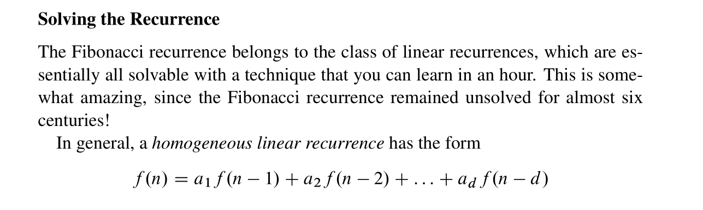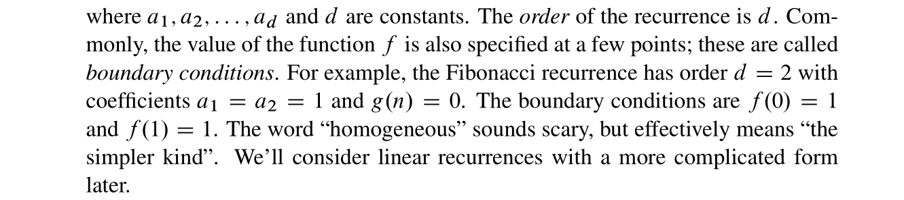

## Solving Fibonacci Recurrence
### Superposition Theorem
> [!thm]
> 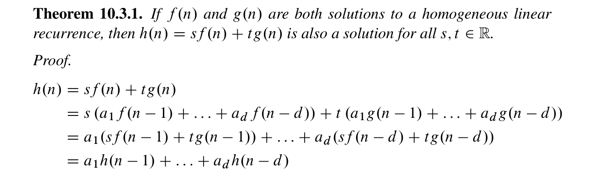

### Complete Solving Process
> [!important]
> 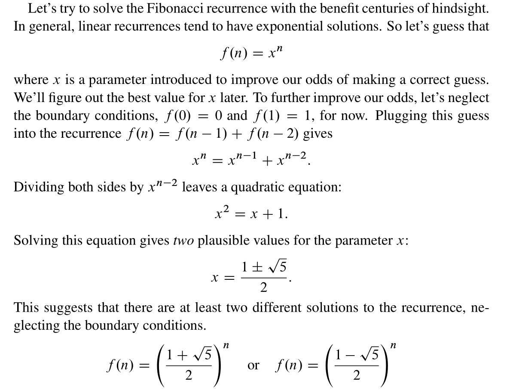
> Then By Theorem 10.3.1 we have the following derivations:
> 
> 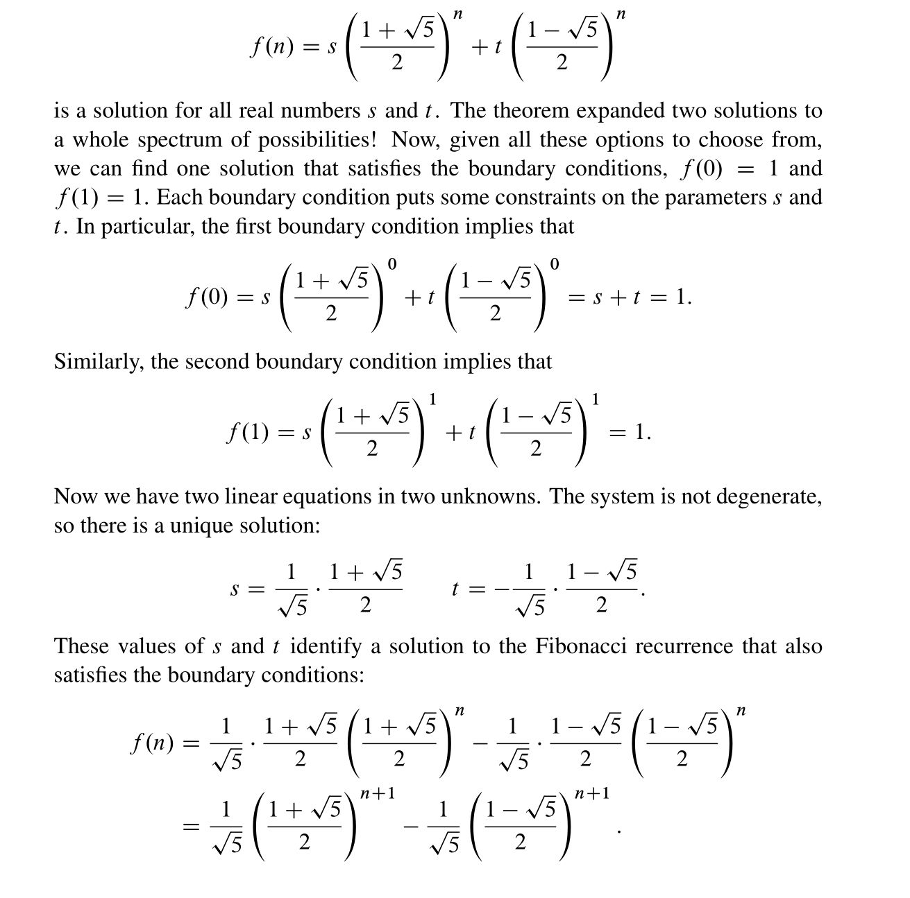

### Golden Ratio
> [!def]
> 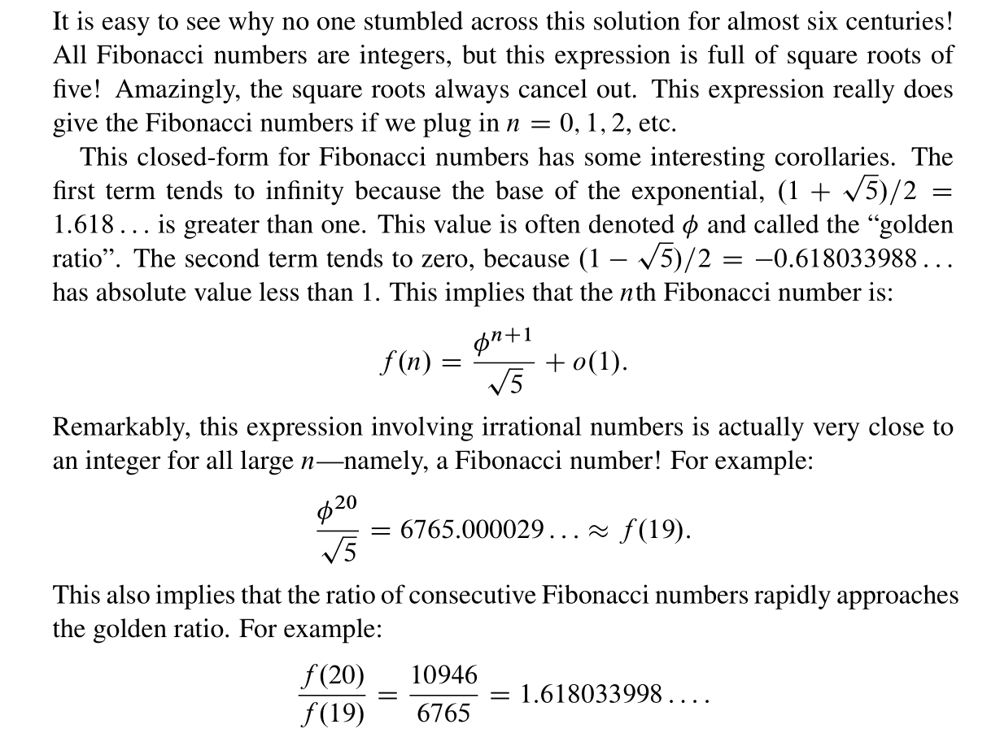

## Solving Homogeneous Linear Recurrence
> [!important]
> 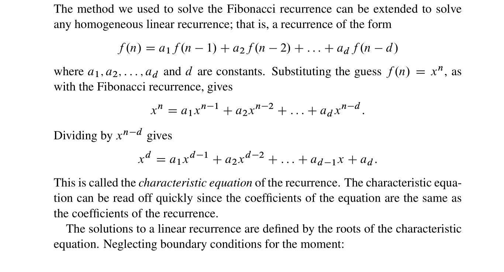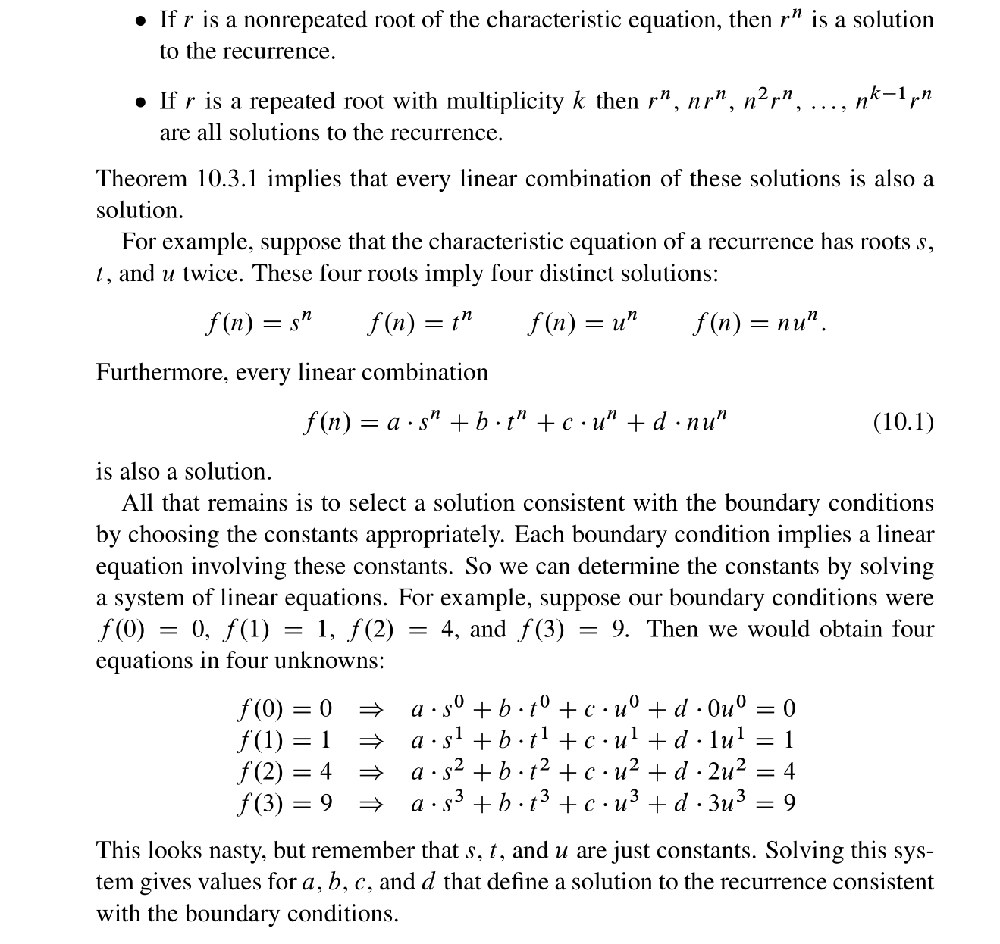

## Solving General Linear Recurrence
### How to find Particular Solution
> [!important]
> 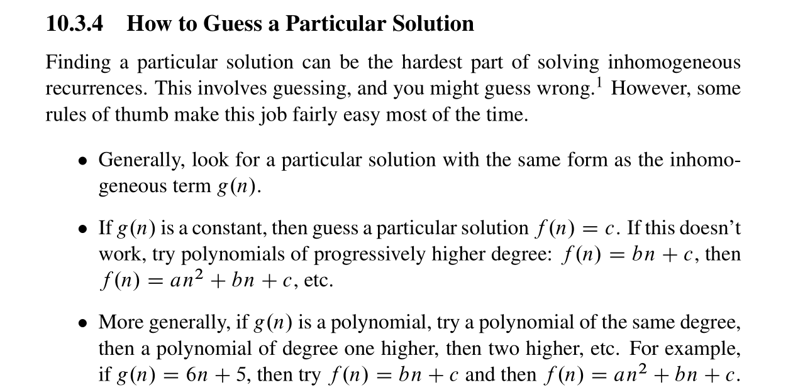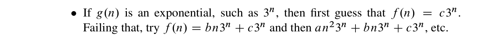

### Full Steps
> [!summary]
> 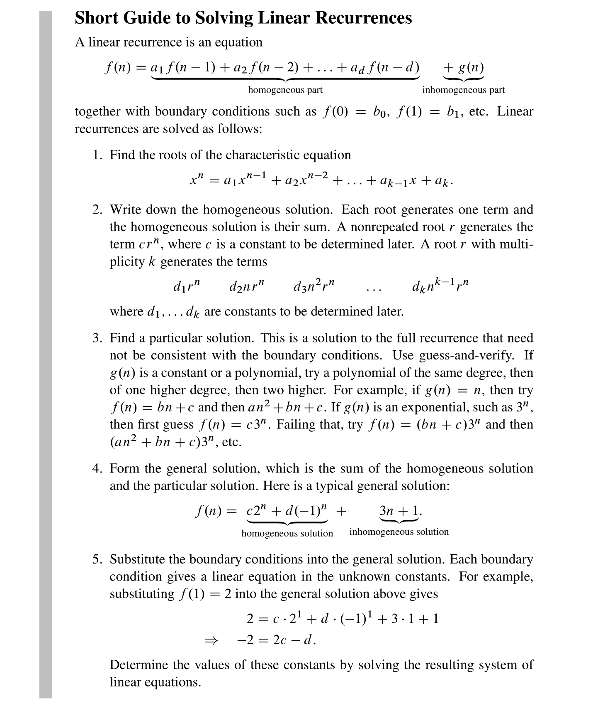

# Divide and Conquer Recurrences
## The Akra-Bazzi Formula
