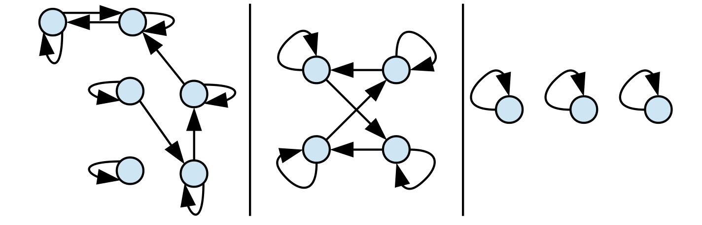

# Tuples
> [!def]
> 

# Cartesian Products
## Two Sets
> [!def]
> 
> Side Notes about empty sets:
> 
> 

## Formal Definition of N-Tuples
> [!def]
> 

## Cartesian Powers
> [!def] Cartesian Square
> 

# Some Types of Relations
## Reflex Relations
> [!def]
> 

## Irreflexive Relations
> [!def]
> 
> A critical detail here is that reflexive and irreflexive are not opposites of one another. 
> 
> There may still exist some relations that are neither reflexive nor irreflexive, where some objects are related to itself while others are not.

## Transitive Relations
> [!def]
> 

## Symmetric Relations
> [!def]
> 

## Asymmetric Relations
> [!def]
> 

# Binary Relations and Graphs
## Reflexive Relations <=> Self Loop
> [!example]
> 
> The graph represents a reflexive relation over the nodes.

## Not Reflexive Relations <=> At least one no self-loop
> [!example]
> 

## Irreflexive Relations <=> All nodes no self-loop
> [!example]
> 

## Transitivity <=> Short-Cut
> [!example]
> 

## Symmetry <=> Strongly Connected
> [!def]
> 

# Equivalence Relations
## Definition
> [!def]
> 

## Partitions of Sets
> [!def]
> 
> **Notes about empty set:**
> 
> 

> [!proof] Each Element can only belong to exactly one set
> 

## Sets that contain the element
> [!def]
> 

## Equivalence Relation over Sets
> [!def]
> 

> [!proof] Proof for equivalence relations - Proof Sketch
> 

> [!proof] Formal Proof
> 

## Equivalence Class of an Element
> [!def]
> 
> What this means is that when we want to construct the equivalence class of an arbitrary element $x$, we just have to look for all the elements that has the equivalence relation with $x$ and collect all these elements in a set.

# Turn Equivalent Relations into Partitions
> [!motiv] Motivation
> 

## Prove that equivalent class forms a partition
> [!def] Rigorous Definition of Union
> 

> [!lemma] Union of Equivalant Classes is the Original Set
> 
> 

> [!lemma] Equivalent Classes of Equivalent Relations are non-empty
> 

> [!lemma] Equivalent Classes are Disjoint
> 

> [!thm] Main Theorem
> 

## Equivalence Classes and Graph Connectivity
> [!important]
> 

# Order Relations
## Strict Order Relations
> [!def]
> 
> A quick example of strict order relation $R$ is $<$, which is clearly irreflexive, asymetric and transitive. First, for any 2-tuple over $\mathbb{R}$, we don't have $(x,x)$ that satisfies $x<x$. Morevoer, for any $(x,y)$ that satisfies $x<y$, $y\not<x$. Finally, for any $xRy$ and $yRz$, we have $x<y<z$ and $xRz$.
> 
> A quick counter-example of strict order is $\subseteq$ since it is clearly not irreflexive.

## Proper Subset
> [!thm]
> 

## Trichotomous Relations
> [!important]
> 

> [!example] Graph Examples
> 

## Strict Total Order
> [!def]
> 

# Partial Orders
