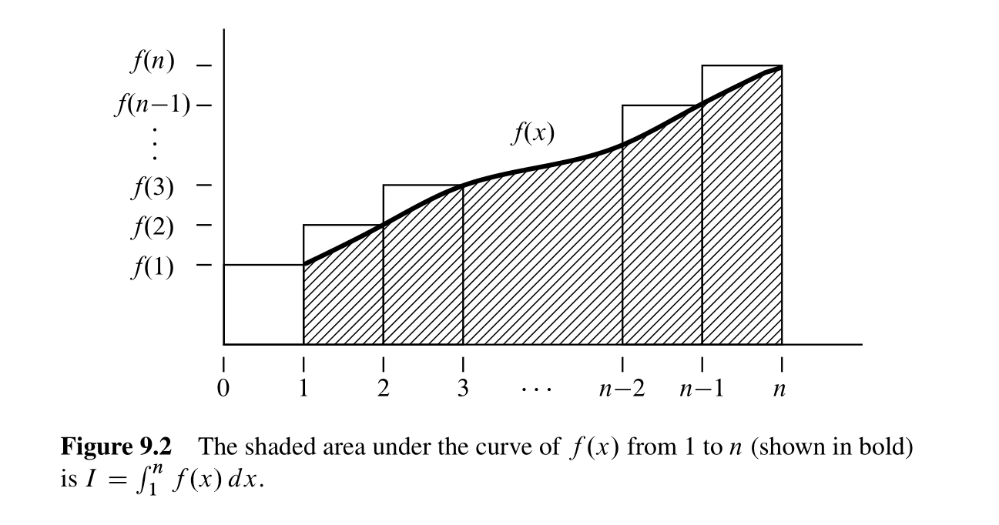
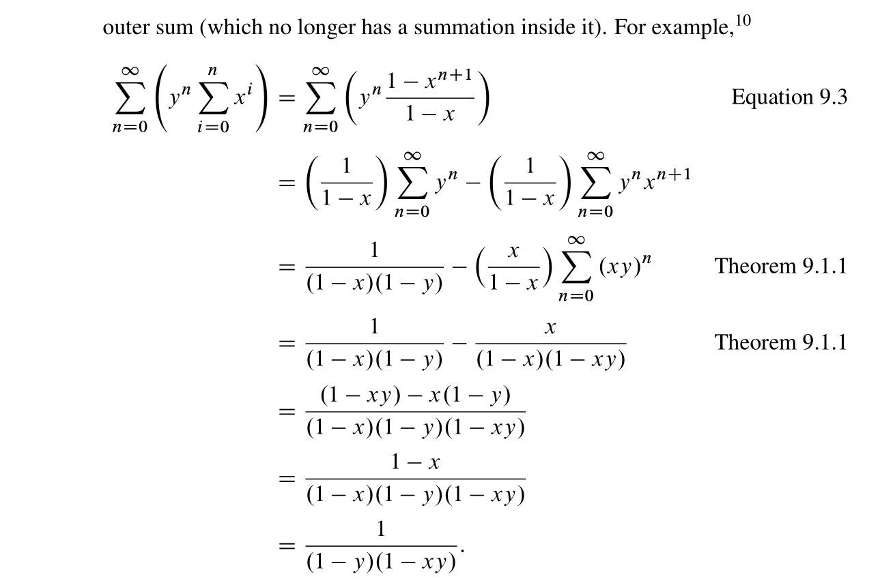
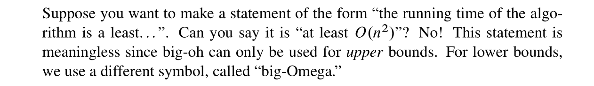

# Approximating Sums
## Main Theorem
> [!thm]
> 

> [!proof]
> For the first part of the theorem $I+f(1)\leq S\leq I+f(n)$, we have the following graph approximation:
> 
> For the second part of the theorem  $I+f(1)\geq S\geq I+f(n)$, we have the following graph approximation:
> 

## Harmonic Numbers
> [!def]
> 
> If we use Theorem above to approximate its sum we would get:
> 
> 
> **Remarks:** The bound above is not the global bound for the harmonic function, it is only the pointwise bound for the function. In fact, in real analysis we could show that the harmonic series diverges and thus the partial sum defined here is unbounded.

## Asymptotic Equality
> [!def]
> 

# Double Summations
> [!thm] Geometric Series
> 

## Definition
> [!def] Double Summation
> 

### Sum of Harmonic Numbers
> [!def]
> 

# Approximating Products
## Factorial
> [!def]
> 

## Sterling Approximation
> [!important]
> 

# Asymptotic Notations
## Little Oh
> [!def]
> 

> [!lemma]
> 

## Big Oh
> [!def]
> 

## Big Omega
> [!def]
> 

## Little Omega
> [!def]
> 

## Theta
> [!def]
> 

## Summary
> [!summary]
> 

# Pitfalls with Asymptotic Notation
## The Exponential Fiasco
> [!bug]
> 

## Constant Confusion
> [!bug]
> 

## Falsely Treating Function as Constant
> [!bug]
> 

## Lower Bound Blunder
> [!bug]
> 

## Equality Blunder
> [!bug]
> 

