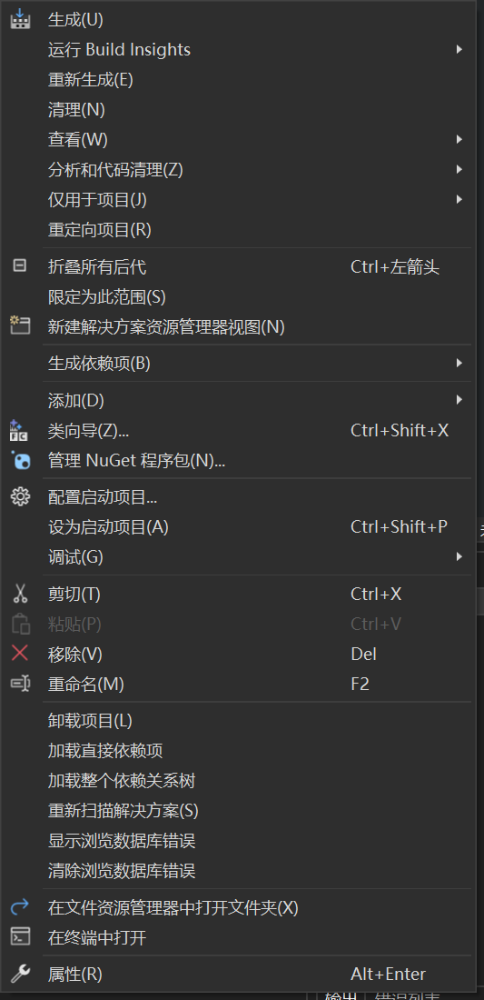

# GLFW
> [!note]
> GLFW is a library that is designed for easy window creation, input handling and context management.
> 
> https://www.glfw.org/ and click download
> 
> - Download the win32 precompiled 32bit source code.


# GLEW
> [!important]
> GLEW is a library that helpe determine which OpenGL extensions are supported on which platform.
> 
> The initialization function `glewInit()` checks for available extensions and loads the necessary function pointers.
> 
> Developers use macros provided by GLEW to check if certain extensions are supported. For example, `GLEW_ARB_vertex_buffer_object` would indicate whether the vertex buffer object extension is available.
> 
> - Download the win32 pre-compiled binaries
> 
> 


# Setup Visual Studio
> [!important]
> - Create a new empty project
> - Create a new folder called `src` that saves all your `.cpp` file.
> - At least create a new `.cpp` file so that the project comfiguration could have an option called `C/C++`
> - Right click the solution folder and click for properties(the bottom one)
> 
> - Inside the C/C++ general, 附加包含目录中添加`GLFW`中的`include`文件夹`F:\Study_Notes_Backup\Game_Development\glfw-3.4.bin.WIN32\glfw-3.4.bin.WIN32\include`以及`GLEW`中的`include`文件夹`F:\Study_Notes_Backup\Game_Development\glew-2.1.0-win32\glew-2.1.0\include`
> - Inside the Linker general, 添加以下目录
> 	- `F:\Study_Notes_Backup\Game_Development\glfw-3.4.bin.WIN32\glfw-3.4.bin.WIN32\lib-vc2022`
> 	- `F:\Study_Notes_Backup\Game_Development\glew-2.1.0-win32\glew-2.1.0\lib\Release\Win32`
> - Inside the Linker Input, 添加以下依赖:
> 	-`glfw3.lib;opengl32.lib;glew32s.lib;User32.lib;Gdi32.lib;Shell32.lib`
> - 确保下列代码执行时不报`Linker`相关的`error`表明所有函数都已经顺利导入。
```c++
#include <GL/glew.h>
#include <GLFW/glfw3.h>


int main(void) {
    GLFWwindow* window;

    /* Initialize the library */
    if (!glfwInit())
        return -1;

    /* Create a windowed mode window and its OpenGL context */
    window = glfwCreateWindow(640, 480, "Hello World", NULL, NULL);
    if (!window)
    {
        glfwTerminate();
        return -1;
    }

    /* Make the window's context current */
    glfwMakeContextCurrent(window);

    /* Loop until the user closes the window */
    while (!glfwWindowShouldClose(window))
    {
        /* Render here */
        glClear(GL_COLOR_BUFFER_BIT);

        /* Swap front and back buffers */
        glfwSwapBuffers(window);

        /* Poll for and process events */
        glfwPollEvents();
    }

    glfwTerminate();
    return 0;
}

```


