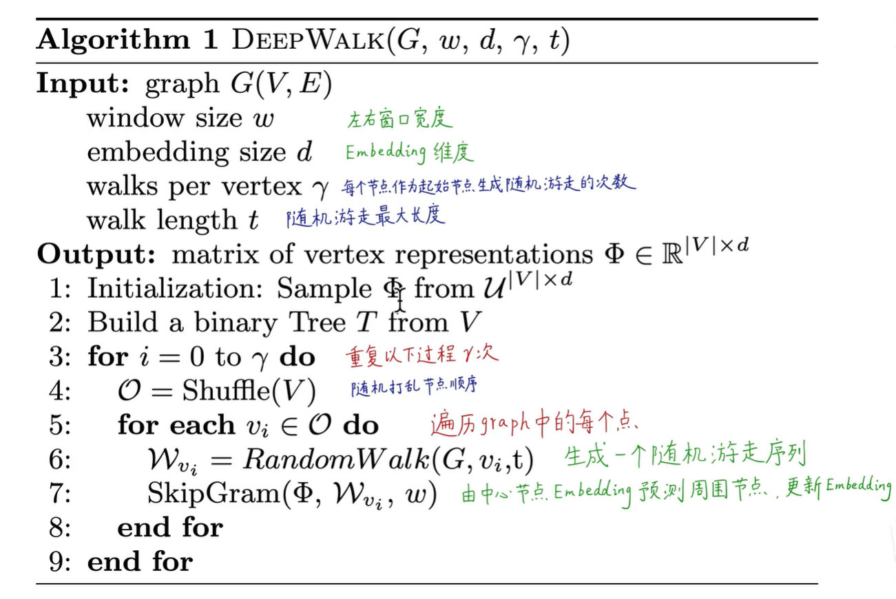
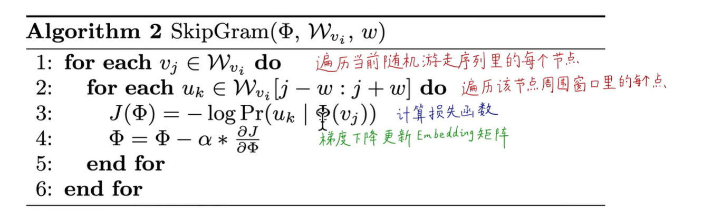
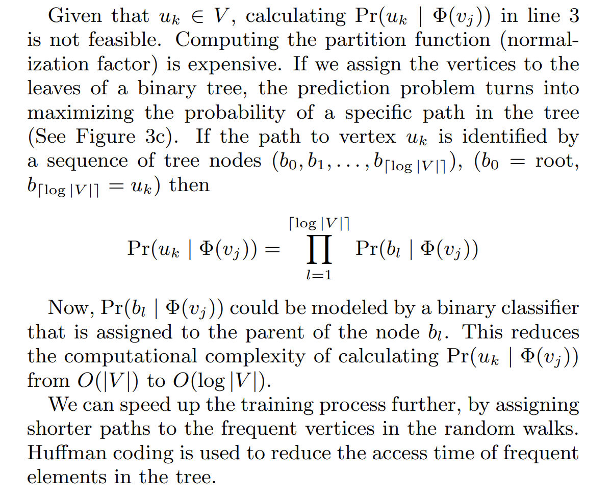

Paper: https://arxiv.org/abs/1403.6652

# Algorithm Procedures
> [!algo]
> 
> More on [Skipgram Derivatives](../../../Natural_Language_Processing/Word_Embedding/Word_Vectors.md#Skipgram%20Derivatives)
> 
> **Hierarchical Optimization(工程上可行性，加速运算):**
> 
> More on [Hierarchical Softmax](../../../Natural_Language_Processing/Word_Embedding/Word_Vectors.md#Hierarchical%20Softmax)

# Code Implementations
**Dataset Download:** https://densitydesign.github.io/strumentalia-seealsology/
**Code Base:** https://colab.research.google.com/drive/1J0CUEgaZWhtoa3BOrdRKkzUBoGugghJ2#scrollTo=pW4sgskBmdAi

