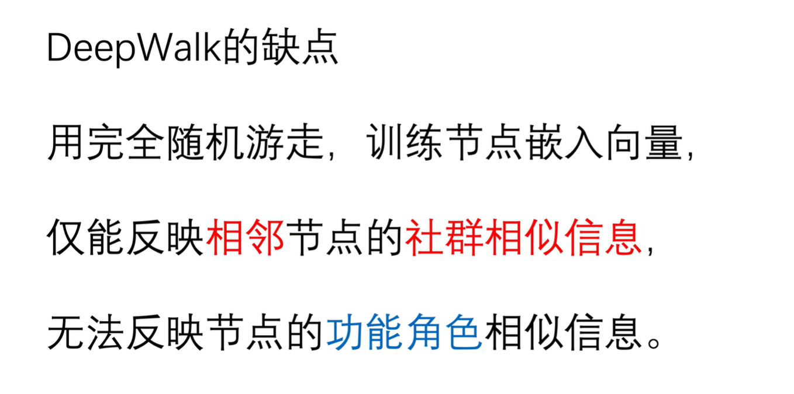
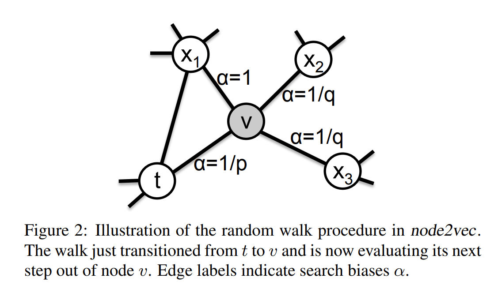
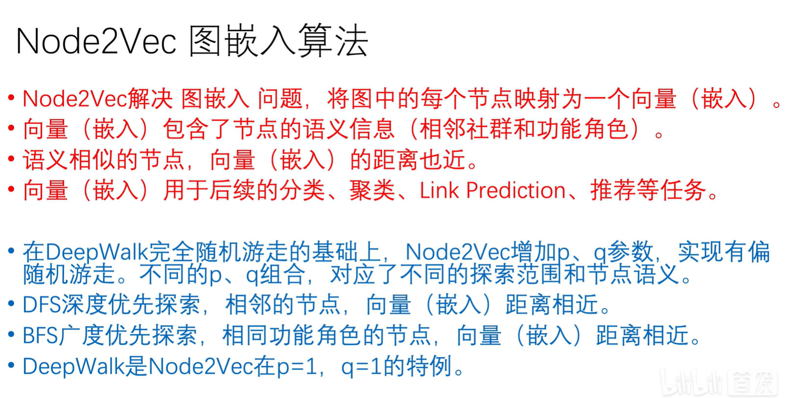
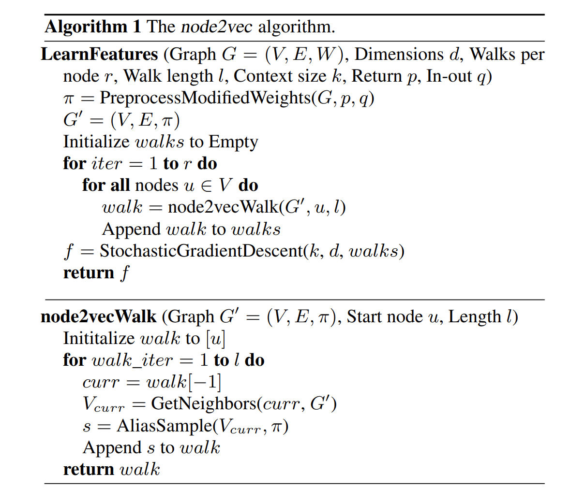
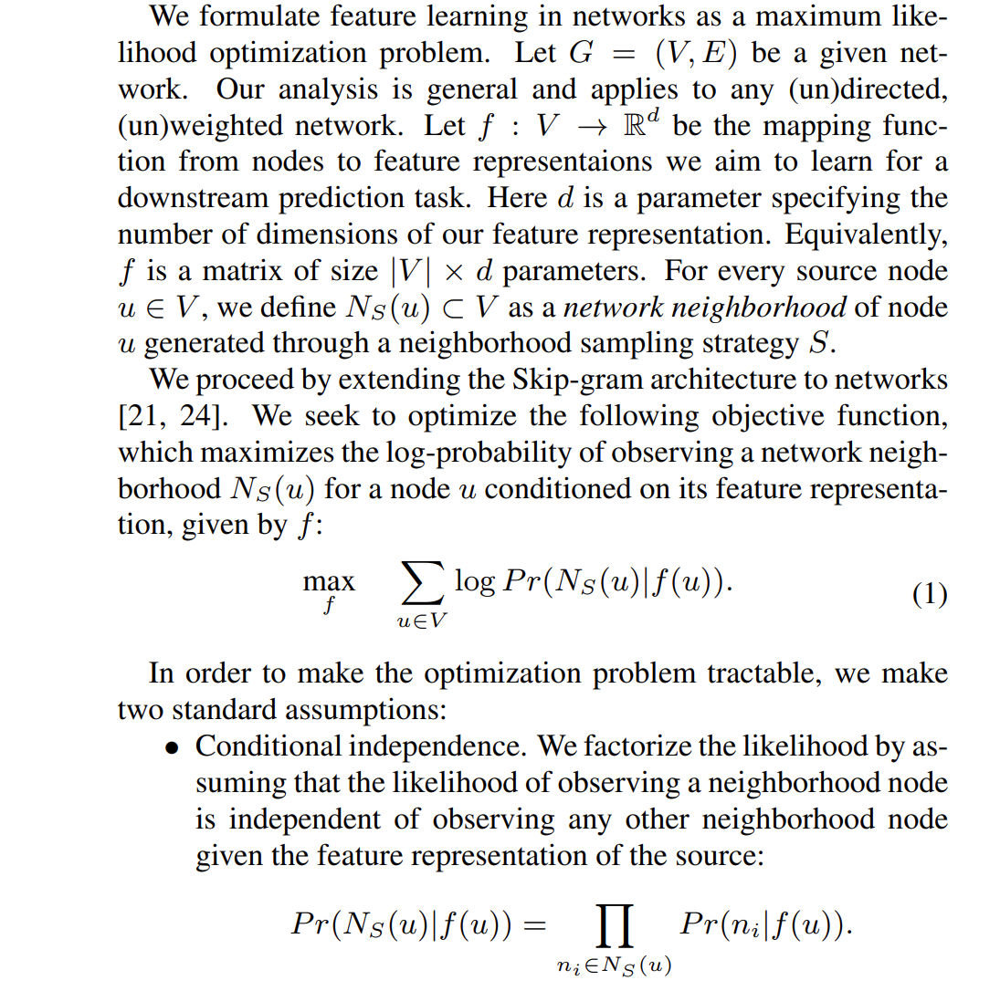
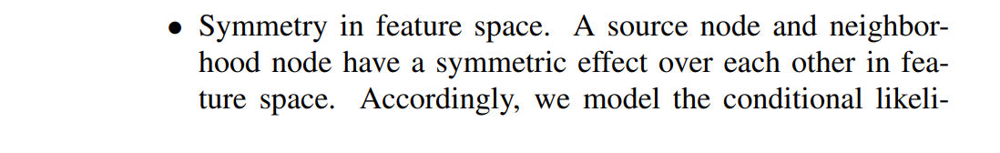
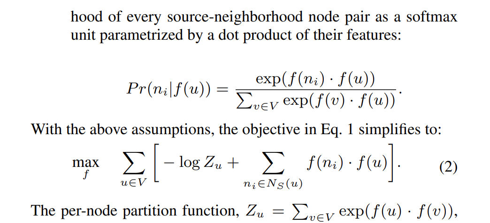
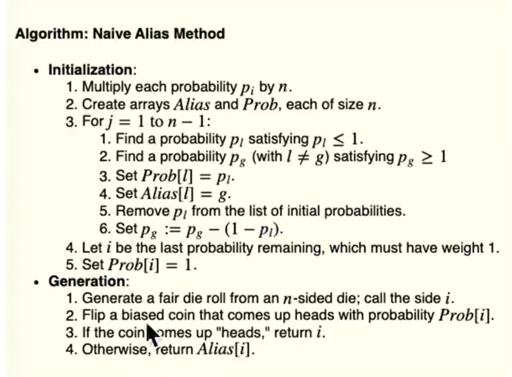

**Paper:** https://arxiv.org/abs/1607.00653

# Motivations
> [!important]
> 

# Overview
> [!overview]
> 

# Node2Vec Algorithm 
## Procedures
> [!algo]
> 

## Objective Function
> [!algo]
> 

# Alias Sampling Algorithm - O(1)
https://keithschwarz.com/darts-dice-coins/
https://www.cnblogs.com/Lee-yl/p/12749070.html

## Descriptions
> [!def]
> 通过生成连续随机数对离散的事件进行采样。

## Algorithm Procedure
> [!algo]
> 

# Code Implementations
https://colab.research.google.com/drive/1J0CUEgaZWhtoa3BOrdRKkzUBoGugghJ2#scrollTo=pW4sgskBmdAi

