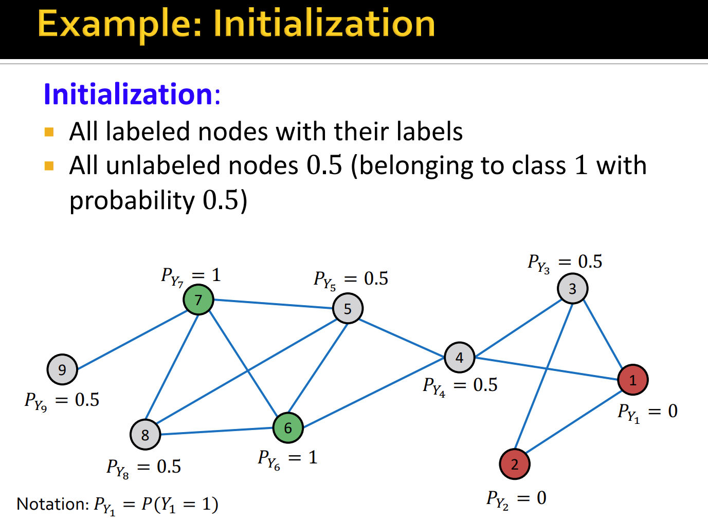

> [!important] 半监督节点分类问题
> 

# Terminology
> [!overview]
> 

## Social Homophily
> [!def]
> 
> 

> [!example]
> 

## Social Influence
> [!def]
> 

# Problem Settings
> [!def]
> 

# Collective Classification
> [!def]
> 

## Relational Classification
### Idea
> [!def]
> 

### Example
> [!example]
> 

## Iterative Classification(ICA)
### Motivations
> [!motiv]
> 

### Idea
> [!algo]
> 

### Architecture of ICA
> [!important]
> 

## Summary
> [!summary]
> 

# Correct&Smooth
## Idea
> [!algo] 
> 

## Correct Step
> [!important]
> 

## Smooth Step
> [!important]
> 

## Diffusion Matrix
> [!def]
> 

## Summary
> [!summary]
> 

# Code Implementations
Colab: https://colab.research.google.com/drive/1QMhP_tb5E4rhW29EonPFQeYHduULhQel#scrollTo=2VSMrSFbYXBa