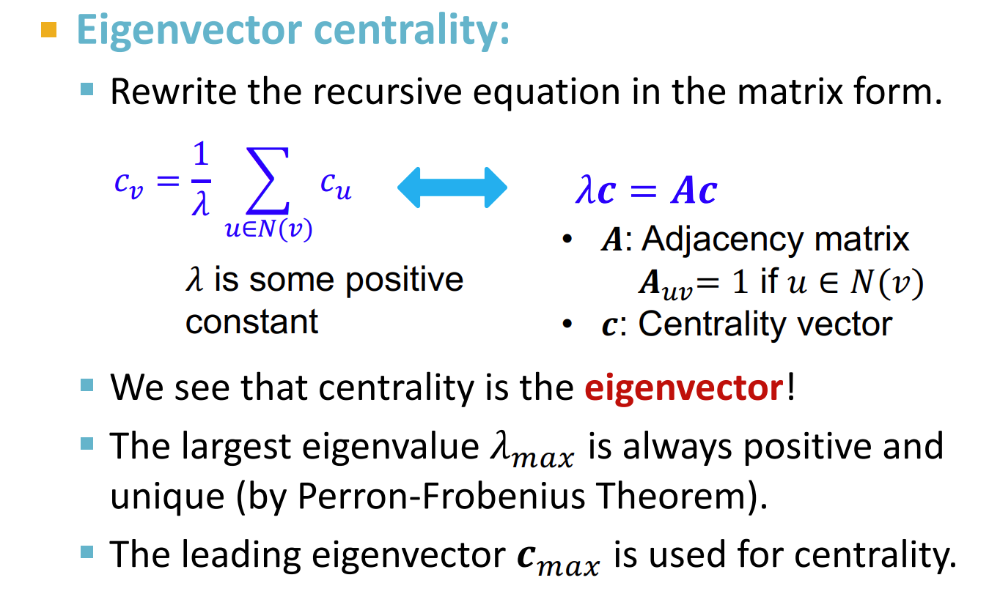
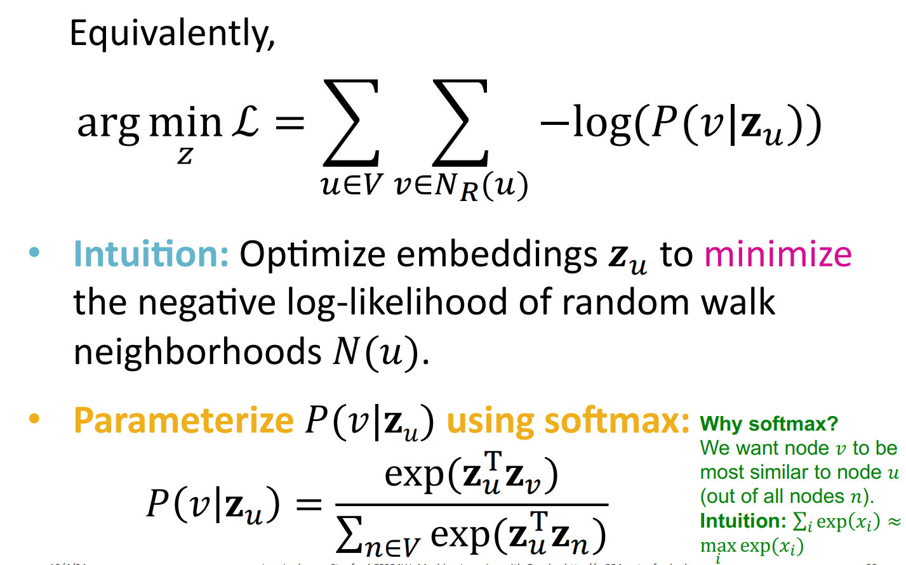
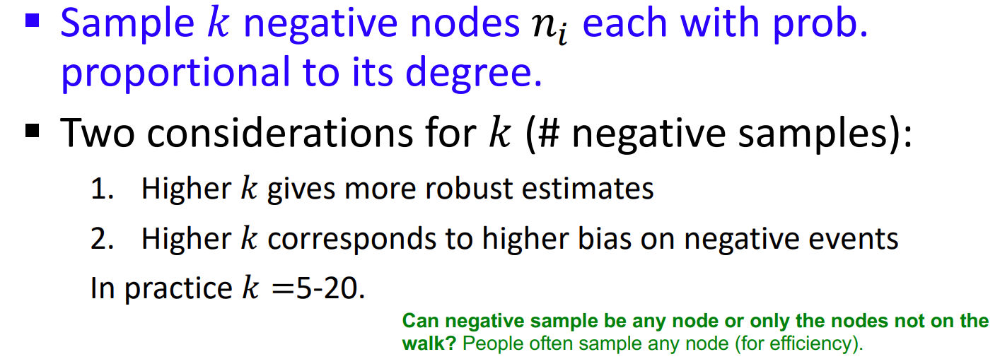

# Node-Level Features
## Node Degrees
> [!def]
> 


## Node Centrality
### Eigenvector Centrality
> [!def]
> 


### Betweeness Centrality
> [!def]
> 
> - Could be used to identify the bottleneck node in a graph.


### Closeness Centrality
> [!def]
> 
```python
def closeness_centrality(G, node=5):
  # TODO: Implement the function that calculates closeness centrality
  # for a node in karate club network. G is the input karate club
  # network and node is the node id in the graph. Please round the
  # closeness centrality result to 2 decimal places.

  closeness = 0

  ## Note:
  ## 1: You can use networkx closeness centrality function.
  ## 2: Notice that networkx closeness centrality returns the normalized
  ## closeness directly, which is different from the raw (unnormalized)
  ## one that we learned in the lecture.
  import numpy as np
  return np.round(nx.closeness_centrality(G, node) * (G.number_of_nodes() - 1), 2)
  #########################################

  return closeness

node = 5
closeness = closeness_centrality(G, node=node)
print("The node 5 has closeness centrality {}".format(closeness))
```


## Clustering Coefficients
> [!def]
> 
> 
```python
import numpy as np
def average_clustering_coefficient(G):
 
  return np.round(nx.average_clustering(G), 2)

avg_cluster_coef = average_clustering_coefficient(G)
print("Average clustering coefficient of karate club network is {}".format(avg_cluster_coef))
```


## Graphlets
> [!def]
> 


## Pagerank Importance
### Definition of Flow Model
> [!def]
> 

> [!example]
> 


### How to Solve
> [!important]
> 

> [!example]
> 


### Pagerank Problems
> [!important]
> 


#### Spider-Trap Problem
> [!def]
> 


#### Dead-ends Problem
> [!def]
> 


### Google Algorithm
> [!important]
> 


### Code Implementations
> [!code]
> 
```python
def one_iter_pagerank(G, beta, r0, node_id):
  # TODO: Implement this function that takes a nx.Graph, beta, r0 and node id.
  # The return value r1 is one interation PageRank value for the input node.
  # Please round r1 to 2 decimal places.

  r1 = 0

  ############# Your code here ############
  ## Note:
  ## 1: You should not use nx.pagerank
  for neighbor_id in nx.neighbors(G, node_id):
    r1 += beta * r0 / G.degree(neighbor_id)
  r1 += (1 - beta) / G.number_of_nodes()
  r1 = round(r1, 2)
  #########################################

  return r1

beta = 0.8
r0 = 1 / G.number_of_nodes()
node = 0
r1 = one_iter_pagerank(G, beta, r0, node)
print("The PageRank value for node 0 after one iteration is {}".format(r1))
```


# Node Embeddings
## Objective
> [!def]
> 


### Node Similarities
> [!motiv]
> 


## Encoder-Decoder Structure
### Definition
> [!important]
> 


### Shallow Encoding
> [!def]
> 


## DeepWalk
### How to Learn - Random Walk
> [!important]
> 


### Algorithm
> [!algo]
> 


### Optimization
#### Negative Sampling
> [!important]
> 

> [!algo]
> 


#### SGD
> [!algo]
> 


### Random Walk Strategy
> [!def]
> 


## Node2Vec
### Motivations
> [!motiv]
> 


### Biased Walk
> [!def]
> 


### One-step of Biased Walk
> [!important]
> 

> [!algo]
> 
> Details in [Node2Vec](Node2Vec.md)


## Matrix Factorization
### Definition
> [!def]
> 


### Objectives
> [!important]
> 


# Limitations
> [!important]
> 


