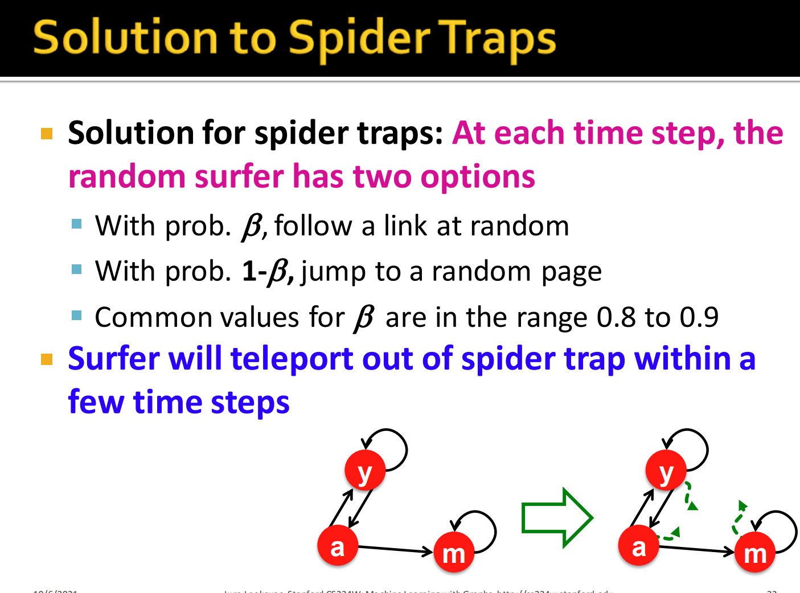

# Overview
> [!overview]
> 

# PageRank
## Overview - Flow Model
> [!overview] 
> 

## Flow Equation
> [!def]
> 

## Matrix Formulation
> [!important]
> 

## How to solve?
> [!algo] Power Iteration Method
> 

> [!example]
> 

## Problems
### Dead Ends
> [!def]
> 

### Spider Traps
> [!def]
> 

### Comparisons
> [!def]
> 

## Google Algorithm
> [!algo]
> 
> Page Rank measures importance of nodes in a graph using the link structure of the web. A "vote" from an important page is worth more. Specifically, if a page $i$ with importance $r_i$ has $d_i$ out-links, then each link gets $\frac{r_i}{d_i}$ votes. Thus, the importance of a Page $j$, represented as $r_j$ is the sum of the votes on its in links.
> 
> $$r_j=\sum_{i \rightarrow j} \frac{r_i}{d_i}$$, 
> where $d_i$ is the out degree of node $i$.
> 
> The PageRank algorithm (used by Google) outputs a probability distribution which represent the likelihood of a random surfer clicking on links will arrive at any particular page. At each time step, the random surfer has two options
> 
> - With prob. $\beta$, follow a link at random
> - With prob. $1-\beta$, jump to a random page
> 
> Thus, the importance of a particular page is calculated with the following PageRank equation:
> $$r_j=\sum_{i \rightarrow j} \beta \frac{r_i}{d_i}+(1-\beta) \frac{1}{N}$$

> [!example]
> 

# Personalized PageRank
## Algorithm Procedure
> [!algo]
> 

## Benefits
> [!important]
> 

# Random Walk with Restarts
> [!def]
> 

## Code Practices
**Dataset Link:** http://data.openkg.cn/dataset/ch4masterpieces
**Colab Link:** https://colab.research.google.com/drive/1ilsfffYuQHosgIEQugTS5FRDXUMNmRdc#scrollTo=WdWI2ksN__cM

