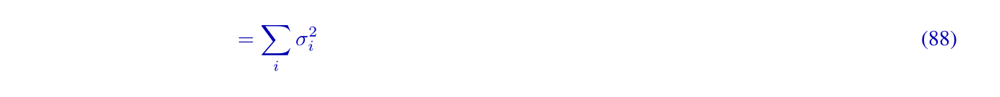

# Matrix Review
## Determinant Properties
### Algebraic Property
> 

**Proof**

### Geometric Property
> 

### Block Matrix Property
> 
> Here we have some implicit assumptions: The block matrices on the diagonal entry should be square matrix since the determinant is only defined on those square matrices.

**Proof**我们可以考虑使用`Induction`证明:

## Rank Properties
### Transpose of Rank
> 对于$A\in \mathbb{R}^{m\times n}$来说:
> $Rank(A)=Rank(A^{\top})$
> **证明: **$Rank(A)=Rank(A^{\top})=$**number of pivots**

### Rank of Sum
> **对于**$A,B\in \mathbb{R}^{m\times n}$**来说:**
> $Rank(A+B)\leq Rank(A)+Rank(B)$
> **证明:**
> 1. 对于$S_1,S_2$两个$V$的子空间，有$dim(S_1+S_2)\leq dim(S_1)+dim(S_2)$
> 
实际上，$S_1,S_2$满足$dim(S_1+S_2)=dim(S_1)+dim(S_2)-dim(S_1\cap S_2)$, 在线性代数线性算子中证明。运用`Extend Basis`的思想。
> 思路就是，对于两个子空间$U,V$来说，如果$U\subseteq V$, 则$dim(U)\subseteq dim(V)$且假设$\vec{u}_1,\cdots, \vec{u}_m$是$U$的基，则我们可以`Extend Basis`使得$\vec{u}_1,\cdots, \vec{u}_m,\vec{w}_1,\cdots, \vec{w}_k$是$V$的基。
> 2. $Col(A+B)\subseteq Col(A)+Col(B)$
> 
$\forall \vec{x}\in Col(A+B)$, 我们有$\vec{x}=(A+B)\vec{w}$, for some $\vec{w}$。而$(A+B)\vec{w}=A\vec{w}+B\vec{w}$，其中$A\vec{w}\in Col(A),B\vec{w}\in Col(B)$, 所以$\vec{x}\in Col(A)+Col(B)$，即$Col(A+B)\subseteq Col(A)+Col(B)$。
> 所以$dim(Col(A+B))\leq dim(Col(A)+Col(B))$
> 因为$dim(Col(A)+Col(B))\leq dim(Col(A))+dim(Col(B))$, 所以$dim(Col(A+B))\leq dim(Col(A))+dim(Col(B))$，即$Rank(A+B)\leq Rank(A)+Rank(B)$。

### Rank of Product
> **对于任意矩阵**$A\in\mathbb{R}^{m\times n},B\in \mathbb{R}^{n\times p}$**that matches, 我们有:**
> 1. $Rank(AB)\leq min\{Rank(A),Rank(B)\}$
> 
**证明: **$Rank(AB)=dim(Col(AB))$, $\forall \vec{x}\in Col(AB), \vec{x}=AB\vec{w}=A(B\vec{w})=A\widetilde{\vec{w}}\in Col(A)$
> 于是$Col(AB)\subseteq Col(A)$, 于是$dim(Col(AB))\leq dim(Col(A))$, 即$Rank(AB)\leq Rank(A)$对$AB$取转置,$Rank(AB)=Rank((AB)^{\top})=Rank(B^{\top}A^{\top})\leq Rank(B^{\top})=Rank(B)$。
> 所以$Rank(AB)\leq Rank(A)$且$Rank(AB)\leq Rank(B)$, 即$Rank(AB)\leq min\{Rank(A),Rank(B)\}$。
> 2. **If **$A$**is invertible, then **$Rank(AB)=Rank(B)$
> 
**证明: **$\forall x\in Null(B)$**,**$B\vec{x}=\vec{0}\implies AB\vec{x}=\vec{0}\implies\vec{x}\in Null(AB)$, 于是$Null(B)\subseteq Null(AB)$**。**$\forall x\in Null(AB)$**, **$AB\vec{x}=A(B\vec{x})=\vec{0}$**,** 因为$A$可逆，则$B\vec{x}=\vec{0}$, 即$\vec{x}\in Null(B)$。所以$Null(AB)\subseteq Null(B)$，即$Null(AB)=Null(B)$。使用`Fundamental Theorem of Linear Map`我们有: $Rank(AB)+dim(Null(AB))=p$, $Rank(B)+dim(Null(B))=p$, 于是$Rank(AB)=Rank(B)$。
> 3. **If **$B$**is invertible, then**$Rank(AB)=Rank(A)$
> 
**证明: **$Rank(AB)=Rank((AB)^{\top})=Rank(B^{\top}A^{\top})=Rank(A^{\top})=Rank(A)$
> 4. **If **$A=UDU^{-1}$**, then **$Rank(A)=Rank(D)$
> 
$Rank(A)=Rank(UDU^{-1})=Rank(DU^{-1})=Rank(D)$(By 2 and 3)

# Matrix Norm
## Definition
> 

## Frobenius Norm
### Definition
> **EECS127 HW03**
> 

**Show that it satisfies the Matrix Form Definitions**

### Equality Properties
> **对于**$A\in \mathbb{R}^{m\times n}$**来说:**
> $\|A\|_F=\sum_{i=1}^m\sum_{i=1}^n |A_{ij}|^2=\sum_{i=1}^n\|A_i\|_2^2=\sum_{i=1}^m\|A_i^{\top}\|_2^2$(**Frobenius Norm and L-2 Norm**)
> $\|A\|_F=\sqrt{tr(A^{\top}A)}=\sqrt{tr(AA^{\top})}$
> $\|A\|_F=\sqrt{\sum_{i=1}^n \lambda_i(AA^{\top})}=\sqrt{\sum_{i=1}^n \lambda_i(A^{\top}A)}=\sqrt{\sum_{i=1}^n\lambda_i^2}$, 其中$\lambda_i$是$A$的特征值。
> `**Side Notes**`**:** 因为$\vec{x}^{\top}A^{\top}A\vec{x}=\|A\vec{x}\|_2^2\geq 0$, 于是$A^{\top}A$是半正定矩阵， 于是其特征值都是大于等于零的，此时特征值和奇异值一致，即$\lambda_i=\sigma_i$, 所以:
> $\|A\|_F=\sqrt{\sum_{i=1}^n \lambda_i(AA^{\top})}=\sqrt{\sum_{i=1}^n \lambda_i(A^{\top}A)}=\sqrt{\sum_{i=1}^n\lambda_i^2}=\sqrt{\sum_{i=1}^n\sigma_i^2}$, 其中$\sigma_i$是$A$的奇异值。
> 

### Inequality Properties
> **对于**$A\in \mathbb{R}^{m\times n}$**和**$\vec{x}\in \mathbb{R}^{n}$**, 我们有:**
> $\|A\vec{x}\|_2^2=\sum_{i=1}^m|\vec{a}_i^{\top}\vec{x}|^2\leq \sum_{i=1}^m\|\vec{a}_i^{\top}\|_2^2\|\vec{x}\|_2^2=\|A\|_F^2\|\vec{x}\|_2^2$（柯西不等式）
> **对于**$A\in \mathbb{R}^{m\times n}$**和**$B\in \mathbb{R}^{n\times p}$**, 令**$B=\begin{bmatrix} \vec{b}_1&\vec{b}_2&\cdots&\vec{b}_p\end{bmatrix}$**:**
> $\|AB\|_F^2=\sum_{i=1}^p\|A\vec{b}_i\|_2^2\leq \sum_{i=1}^p \|A\|_F^2\|\vec{b}_i\|_2^2=\|A\|_F^2\|B\|_F^2$

### Random Input
> 

**Solution (1)**$\mathbb{E}[\vec{y}]=\mathbb{E}[A\vec{u}]=A\mathbb{E}[\vec{u}]=\vec{0}$
$\mathbb{E}[\vec{y}\vec{y}^{\top}]=\mathbb{E}[A\vec{u}(A\vec{u})^{\top}]=\mathbb{E}[A\vec{u}\vec{u}^{\top}A^{\top}]=A\mathbb{E}[\vec{u}\vec{u}^{\top}]A^{\top}=AA^{\top}$
**Solution (2)**$\begin{aligned}\mathbb{E}[\|\vec{y}-\hat{\vec{y}}\|_2^2]=\mathbb{E}[(\vec{y}-\vec{\hat{y}})^{\top}(\vec{y}-\vec{\hat{y}})]&=\mathbb{E}[\|\vec{y}\|_2^2-2\vec{y}^{\top}\vec{\hat{y}}+\|\vec{\hat{y}}\|_2^2]\\&=\mathbb{E}[\|\vec{y}\|_2^2]-2\mathbb{E}[\vec{y}^{\top}]\mathbb{E}[\vec{y}]+\mathbb{E}[\|\vec{\hat{y}}\|_2^2]\\&=\mathbb{E}[\|\vec{y}\|_2^2]=\sum_{i=1}^n\mathbb{E}[y_i^2]\\&=tr(AA^{\top})\\&=\|A\|_F\end{aligned}$
> 所以我们看到，对于`Random Input`$\vec{u}$来说，$\|A\|_F$是$A\vec{u}$向量各个维度的方差之和。

## Operator Norm
### Definition
> 
> **我们推导一些性质:**
> 1. $\|A\vec{u}\|_p\leq \|A\|_p\|\vec{u}\|_p$
> 
因为根据定义$\|A\|_p=\max_{\vec{u}\neq \vec{0}}\frac{\|A\vec{u}\|_p}{\|\vec{u}\|_p}$, 所以$\frac{\|A\vec{u}\|_p}{\|\vec{u}\|_p}\leq \|A\|_p$, 即$\|A\vec{u}\|_p\leq \|A\|_p\|\vec{u}\|_p$
> 2. $\|AB\|_p\leq \|A\|_p\|B\|_p$
> 
因为根据性质一我们有: $\|B \vec{u}\|_p \leq\|B\|_p\|\vec{u}\|_p,\|A B u\|_p \leq\|A\|_p\|B \vec{u}\|_p \leq\|A\|_p\|B\|_p\|\vec{u}\|_p$, 所以$\frac{\|AB\vec{u}\|_p}{\|\vec{u}\|_p}\leq \|A\|_p\|B\|_p,\forall \vec{u}\neq \vec{0}$, 于是$\max_{\vec{u}\neq \vec{0}}\frac{\|AB\vec{u}\|_p}{\|\vec{u}\|_p}\leq \|A\|_p\|B\|_p$。
> 根据定义$\|AB\|_p=\max_{\vec{u}\neq \vec{0}}\frac{\|AB\vec{u}\|_p}{\|\vec{u}\|_p}$, 所以$\|AB\|_p\leq \|A\|_p\|B\|_p$。
> 3. $\|A\|_1=\max_{\|\vec{u}\|_1=1}\|A\vec{u}\|_1$, 其中$A\in \mathbb{R}^{m\times n}$, $\vec{u}\in \mathbb{R}^n$且$\sum_{i=1}^n |u_i|=1$, 令$\vec{a}_i\in \mathbb{R}^m$为$A$的第$i$列向量。换句话说，$\|A\|_1$的值就是矩阵中各个`Entries`的绝对值的和最大的列。
> 
$\|A\vec{u}\|_1=\|\sum_{i=1}^n u_i\cdot \vec{a}_i\|_1\leq \sum_{i=1}^n|u_i|\cdot\|\vec{a}_i\|_1\leq (\sum_{i=1}^n |u_i|)\cdot\max_{j=1,2,\cdots, n}\sum_{i=1}^m|a_{ij}|=\max_{j=1,2,\cdots, n}\sum_{i=1}^m|a_{ij}|$
> 4. $\|A\|_2=\max_{\|\vec{u}\|=1}\|A\vec{u}\|_2=\sigma_{max}(A)$。
> 
$\max_{\|\vec{u}\|=1}(\|A\vec{u}\|_2)^2=\max_{\|\vec{u}\|=1}\vec{u}^{\top}A^{\top}A\vec{u}=\lambda_{max}(A^{\top }A)=\sigma_{max}^2(A)$, 于是$\|A\|_2=\sigma_{max}(A)$。
> 5. $\|A\|_{\infty}=\max _{\|\vec{u}\|_{\infty}=1}\|A \vec{u}\|_{\infty}$其中$A\in \mathbb{R}^{m\times n}$, $\vec{u}\in \mathbb{R}^n$且$\max_{i}|u_i|=1$，令$\vec{a}_i\in \mathbb{R}^n$为$A$的第$i$行向量。换句话说，$\|A\|_{\infty}$的值就是矩阵中各个`Entries`的绝对值的和最大的行。
> 
因为$\|A\vec{u}\|_{\infty}=\max_{i}|\vec{a}_i^{\top}\vec{u}|\leq \max_{i}\|\vec{a}_i\|_{1}\|\vec{u}\|_{\infty}=\max_i\|\vec{a}_i\|_{1}=\max_{i=1,2,\cdots,m}\sum_{j=1}^n|a_{ij}|$

### Intuition
> 对于`Operator Norm`$\|A\|_p=\max_{\|\vec{x}\|_2=1}\|A\vec{x}\|_p$来说，等式左侧是`Matrix Norm`, 右侧是`Vector Norm`。所以本质上`Operator Norm`度量的是`Max Scaling of the Matrix as an operator to the vector`

# Fundamental Theorem of LA
> 

**Proof**

# Matrix Functions
## Matrix Polynomials
> 

## Eigenvalues of Matrix Polynomials
> 

**Proof**

## Eigenshift Rule
> 

## Diagonalization of Matrix Polynomials
> 

**Proof**

## Convergence of Matrix Power(Optional)
> 

