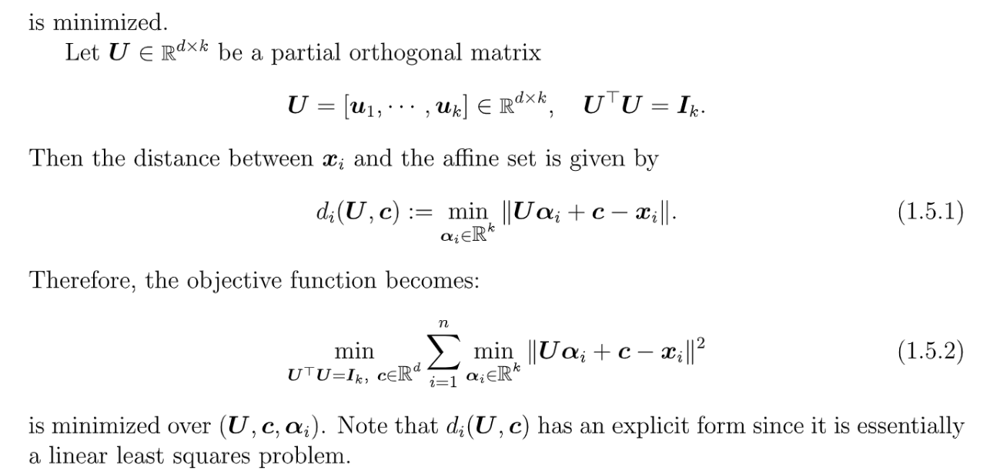
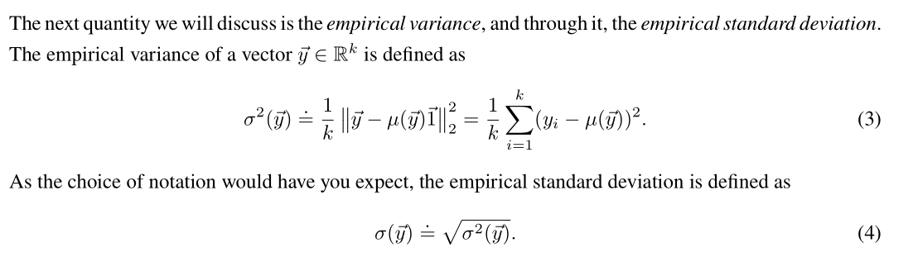
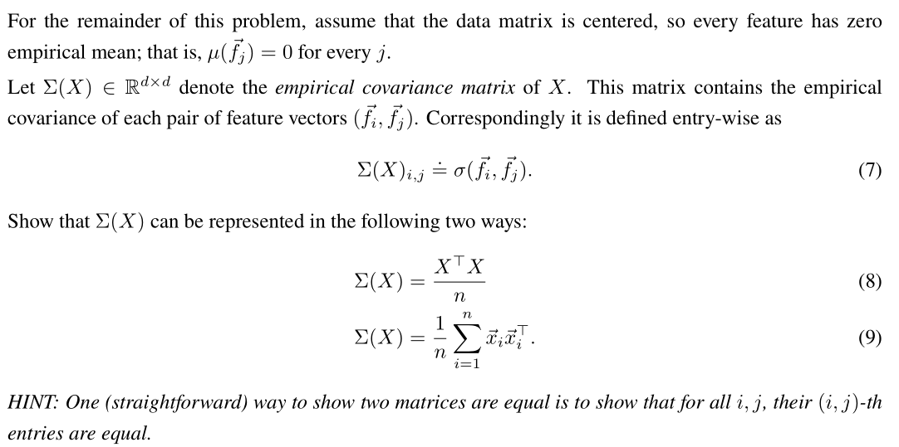

# Overview
> 


# PCA - Subspace Projection Perspective
## Motivations
> 


## Theorem
> 

**Proof of Theorem 4**
> 


## Principal Component
> 

**Geometric Interpretation**
> 


# PCA - Affine Projection Perspective
## Introduction
> `PCA`的本质是找一个`Low-dimensional subspace`(`affine set`)使得其能够`Approximate the original dataset`, 下面是`affine set`的定义: $S=\{x: Ax=b\}$, for given $A,b$。
> 我们从一个简单的例子入手: 
> 
> **Few Remarks:**
> 1. $\mathbf{u}$是我们要优化的方向向量，长度为$1$, 用$(-b, a)$表示。
> 2. 本质上`PCA`就是在求`dataset`的点距离$\mathbf{u}$所在的直线上的最小距离平方和，有点类似于最佳拟合曲线。


## Problem Framework
> 
> **Few Remarks:**
> 1. $\mathbf{U}\in \mathbb{R}^{d\times k}$就是我们超平面的`Basis`向量，用$\mathbf{u_1,u_2,\cdots, u_k}$表示, 互相正交，即$\mathbf{U^TU=I_k}$
> 2. $\mathbf{\alpha_i}\in \mathbb{R^k}$, 表示的是$\mathbf{U}$各列如何进行线性组合。
> 3. $\mathbf{U\alpha_i+c-x_i}\in\mathbb{R}^{d\times 1}$，$d_i(\mathbf{U,c})=\|\mathbf{U\alpha_i+c-x_i}\|_2$表示的是某个数据点$\mathbf{x_i}$到这个超平面的`Vector L2-Norm`，为什么可以这样表示呢? 这里就需要利用到投影矩阵的概念，对于$\mathbf{U}$来说，他的投影矩阵是$\mathbf{U(U^{\top}U)^{-1}U^{\top}}$, 即$\mathbf{UU^{\top}}\in \mathbb{R}^{d\times d}$。$\forall \mathbf{v\in Col(U)}, \mathbf{UU^{\top}v=v}$。我们知道$\forall \mathbf{x_i} \in \mathbb{R}^{d\times 1}$, 他在$span(\mathbf{U})$上的投影是$\mathbf{u_i}$的线性组合，线性组合的系数就是$\mathbf{\alpha_i}$，于是投影就表示为$\mathbf{U\alpha_i+c}$, 于是$d_i$($\mathbf{x_i}$到超平面的距离)就是$\|\mathbf{U\alpha_i+c-x_i}\|_2$(是一个正交于超平面的向量)。
> 4. $\mathbf{U}$的列向量$\mathbf{u_i}$和$\mathbf{c}$是否需要正交呢? 即是否需要$\mathbf{u_i\perp c, \forall 1\leq i\leq k}$成立呢？答案是不需要


## Figure out alpha
> 
> **方法就是使用最小二乘法:**
> 最小二乘法的一般形式是$\min_{\mathbf{x}}\|\mathbf{Ax-b}\|_2$, 我们求解时一般转而求解$\mathbf{A^{\top}Ax=A^{\top}b}$(如果$\mathbf{A^{\top}A}$可逆)。
> 本题中的$\|\mathbf{U\alpha_i+c-x_i}\|_2$也可以看成最小二乘的形式，把$\mathbf{U}$看成$\mathbf{A}$, $\mathbf{\alpha_i}$看成$\mathbf{x}$, $\mathbf{x_i-c}$看成$\mathbf{b}$, 则$\mathbf{\alpha_i = (U^{\top}U)^{-1}U^{\top}(x_i-c)=U^{\top}(x_i-c)}$, 所以问题化为$\|\mathbf{UU^{\top}(x_i-c)+c-x_i}\|=\|\mathbf{(I-UU^{\top})(x_i-c)}\|$


## Figure Out c
> 
> 下一步就是给定$\mathbf{U}$求出$\mathbf{c}$的值, 方法是**矩阵求导术**, 对$\mathbf{c}$求偏导即可:
> 对于$\|(\mathbf{I-UU^{\top})(x_i-c)}\|_2^2=\mathbf{(x_i-c)^{\top}(I-UU^{\top})^{\top}(I-UU^{\top})(x_i-c)}$。我们知道$\mathbf{UU^{\top}}$实际上是一个投影矩阵，而投影矩阵有一个性质，就是$\mathbf{I-UU^{\top}}$仍然是_投影矩阵_，只是投影的空间不同。而且读者可以自行验证$\mathbf{I-UU^{\top}}$是_对称矩阵_，所以$\mathbf{(I-UU^{\top})^{\top}(I-UU^{\top})=(I-UU^{\top})(I-UU^{\top})=(I-UU^{\top})^{2}=I-UU^{\top}}$
> 于是$\mathbf{(x_i-c)^{\top}(I-UU^{\top})^{\top}(I-UU^{\top})(x_i-c)}=\mathbf{(x_i-c)^{\top}(I-UU^{\top})(x_i-c)}$, 然后利用矩阵求导公式$\mathbf{\frac{\partial x^T\mathbf{A}x}{\partial x}}=\mathbf{2Ax}$, 得到：
> 


## Figure Out U
> 


## Remarks
> 


# PCA - Statistical Perspective
> **Hw03 EECS127 Fa22**

## Data Matrix
> 


## Empirical Mean
> 
> `Empirical Mean`说的是我们在所有的`Sample`上取平均，所以求和方向一定是`Sample`方向，也就是`axis=0`设置的方向。
> 同时对于$\vec{f}_j\in \mathbb{R}^n,j=1,2,\cdots, d$来说，我们定义其`Empirical Mean`为:
> $\mu(\vec{f}_j)=\frac{1}{n}\sum_{i=1}^n(\vec{f}_{j})_i$, 写成内积的形式就是$\mu(\vec{f}_j)=\frac{1}{n}\vec{1}^{\top}\vec{f}_j$
> 用`Python`代码写出是`feature_means = numpy.mean(X, axis=0)`。


## Empirical Variance
> 
> `Empirical Variance`说的是我们在所有的`Sample`上取方差，所以求和方向一定是`Sample`方向，也就是`axis=0`设置的方向。
> 同时对于$\vec{f}_j\in \mathbb{R}^n,j=1,2,\cdots, d$来说，我们定义其`Empirical Mean`为:
> $\sigma^2(\vec{f}_j)=\frac{1}{n}\sum_{i=1}^n((\vec{f}_{j})_i-\mu(\vec{f}_j))^2$, 写成`Norm`就是$\mu(\vec{f}_j)=\frac{1}{n}\|\vec{f}_j-\mu(\vec{f}_j)\vec{1}\|^2_2$
> 用`Python`代码写出是`feature_means = numpy.std(X, axis=0)`。


## Centered Data
> 对于数据矩阵$X\in \mathbb{R}^{n\times d}$来说，我们首先想要求出$\overline{X}=\frac{1}{n}\sum_{i=1}^b\vec{x}_i$, `Python`代码是`numpy.mean(X, axis=0)`。
> 然后`Centered Data`就是$X-\overline{X}$, `Python`代码就是`X-numpy.mean(X, axis=0)`

 

## Standardized Data
> 


## Empirical Covariance
### Vector Representation
> 


### Matrix Representation
> **现在假设我们的**$X$**已经被中心化了，则我们有以下重要的结论:**
> 

**Solution**
> **这里有两个特别重要的小结论:**
> 1. 对于一个矩阵$X\in \mathbb{R}^{m\times n}$来说，如果我们要选出其第$j$列，则我们可以通过构造一个单位向量$\vec{e}_j\in \mathbb{R}^n$, 其中$(\vec{e}_j)_i=\begin{cases} 0&i\neq j\\ 1 & i=j\end{cases}$, 使得$X_{:,j}=X\vec{e}_j$。
> 2. 对于单位向量$\vec{e}_j\in \mathbb{R}^n$, 其中$(\vec{e}_j)_i=\begin{cases} 0&i\neq j\\ 1 & i=j\end{cases}$, $\vec{e}_j\vec{e}_j^{\top}=I_n$。


### Projection⭐⭐⭐⭐⭐
> 
> 对于$\vec{z}=X\vec{u}$这个表达式来说，他代表了`Data Points`$\vec{x}_i$在$\vec{u}$方向上的`Scalar Projection`，我们求$\sigma^2(\vec{z})$就可以得到`Empirical Variance`。
> **这里有一个关于**$\vec{z}$**的重要性质:  如果**$X$**是中心化的数据矩阵，即**$\mu(\vec{x}_i^{\top})=\vec{0}^{\top}$，则：
> 1. $\mu(\vec{z})=\frac{1}{n}\sum_{i=1}^n (X\vec{u})_i=\frac{1}{n}\sum_{i=1}^n \vec{x}_i^{\top}\vec{u}=(\frac{1}{n}\sum_{i=1}^n\vec{x}_i^{\top})\vec{u}=\mu(\vec{x}_i^{\top})\vec{u}=\vec{0}$
> 2. $\sigma^2(\vec{z})=\frac{1}{n}(\vec{z}-\mu(\vec{z}))(\vec{z}-\mu(\vec{z}))^{\top}=\frac{1}{n}\vec{z}\vec{z}^{\top}$


## Max Variance Direction
> **这里仍然假设**$X$**是一个中心化的矩阵:**
> 
> **我们也可以考虑如下的优化问题:**
> 我们有:
> $\begin{aligned}\frac{1}{n}\sum_{i=1}^n e_i^2&=\frac{1}{n}\sum_{i=1}^n\|\vec{x}_i-\langle \vec{x}_i,\vec{w}\rangle \vec{w}\|^2\\&=\frac{1}{n}\sum_{i=1}^n \|\vec{x}_i\|_2^2-\frac{1}{n}\sum_{i=1}^n\langle\vec{x}_i ,\vec{w}\rangle^2\end{aligned}$
> 则优化问题: 
> $\begin{aligned}\min_{\|\vec{w}\|=1}\frac{1}{n}\sum_{i=1}^n e_i^2&=\max_{\|\vec{w}\|=1} \frac{1}{n}\sum_{i=1}^n \langle \vec{x}_i,\vec{w}\rangle^2\\&=\max_{\|\vec{w}\|=1}\frac{1}{n}\|X\vec{w}\|_2^2\\&=\max_{\|\vec{w}\|=1}\frac{1}{n}\vec{w}^{\top}X^{\top}X\vec{w}\end{aligned}$
> 的最大值在$\vec{w}$为$X^{\top}X$的最大特征值对应的特征向量处取到。


# Picking the best number of PC
> 


# PCA Applications
## PCA Denoising
> 
> 本质上就是我们先有一个数据集$\{\vec{a}_1,\vec{a}_2,\cdots,\vec{a}_n\}$, 然后使用`PCA`算法学习出一个子空间$S$, 使得$\sum_{i=1}^n\|\vec{a}_i-WW^{\top}\vec{a}_i\|^2$最小($W$是$S$的一组正交基)。
> 然后对于一个新的数据点$\vec{a}_{n+1}$, 我们计算$WW^{\top}\vec{a}_{n+1}$即, 得到的投影就是`Denoised Data`。


## PCA Dimensional Reduction
> 

**Examples**


## *Practical Example: Voting
> **EECS127 HW03 Fa22**

### Mathematical Background 
> 
> 下面的所有问题中，我们都假设我们的数据矩阵$X$已经被中心化了，即$\vec{u}(X)=\vec{0}$。

```python
# import the necessary packages for data manipulation, computation and PCA 
import pandas as pd
import numpy as np
import scipy as sp
from numpy import linalg as LA
import matplotlib.pyplot as plt
from sklearn.decomposition import PCA
%matplotlib inline

np.random.seed(7)


# import the data matrix
senator_df =  pd.read_csv('senator_pca_data_matrix.csv')
affiliation_file = open('senator_pca_politician_labels.txt', 'r')
affiliations = [line.split('\n')[0].split(' ')[1] for line in affiliation_file.readlines()]
X = np.array(senator_df.values[:, 3:].T, dtype='float64') # transpose to get senators as rows
print('X.shape: ', X.shape)
n = X.shape[0] # number of senators
d = X.shape[1] # number of bills

# center the data matrix
X_original = X.copy() # save a copy for part (d) and (e)
X = X - np.mean(X, axis = 0)
```

### Obs 1: Max-Variance Direction
> 假设$b=0$：
> 

```python
# define score function
def f(X, a):
    return X @ a


# generate a random direction and normalize the vector
a_rand = np.random.rand(d)
a_rand = a_rand/np.linalg.norm(a_rand)

# compute associated scores along a_rand
scores_rand = f(X, a_rand)

# visualize the scores along a_rand, coloring them by party affiliation
plt.scatter(scores_rand, np.zeros_like(scores_rand), c=affiliations)
plt.title('projections along random direction a_rand')
plt.xlabel('$\\langle x_i, a\\rangle$')
cur_axes = plt.gca()
cur_axes.axes.get_yaxis().set_visible(False)
plt.show()

print('variance along random direction a_rand: ', scores_rand.var())
```
**Variance of output along a random direction**
```python
################################################################################
### TODO: Calculate a_1, the first principal component of X.
# Hint: The PCA package imported from sklearn.decomposition will be useful here, 
# in particular the function pca.fit(). What should the dimensions of a_1 be?

pca = PCA()
pca.fit(X)
a_1 = pca.components_[0] # this is the first principal component

print(a_1.shape)

# a_1 is large, but you can print it if you like
# print("first principal component a_1: ", a_1.T)

### end TODO
################################################################################

a_1 = a_1/np.linalg.norm(a_1)
# compute and visualize the scores along a_1
scores_a_1 = f(X, a_1)

plt.scatter(scores_a_1, np.zeros_like(scores_a_1), c=affiliations)
plt.title('projections along first principal component a_1')
plt.xlabel('$\\langle x_i, a \\rangle$')
cur_axes = plt.gca()
cur_axes.axes.get_yaxis().set_visible(False)
plt.show()

print('variance along first principal component: ', scores_a_1.var())
```
**Maximum Variance Direction - First Component**
> 我们发现，`First-Principal Component`的方向是使得属于不同`affiliations`的`data points`的投影最分散的方向。
> 于是我们知道，如果我们选定的方向具有鲜明的`affiliations`特征，则`data-points`的投影沿着这个方向的方差就会很大。


### Obs 2: Choosing Directions
> 根据上文的描述，我们知道，投影方向的选取会影响`Output`的`Variance`，于是我们可以选取所谓的`Party Lines`作为我们的投影方向。
> 

```python
################################################################################
### TODO: Calculate mu_red, the array of dimension (542, ) whose values 
### are the mean across rows of X corresponding to 'Red' senators only.
# Hint: Print out the 'affiliations' variable and observe its contents.
# print(len(affiliations))
# print(affiliations)

X_red = X[np.array(affiliations) == 'Red', :]
mu_red = X_red.mean(axis=0)

### end TODO
################################################################################

# normalize the vector to generate unit a_mean_red
a_mean_red = mu_red/np.linalg.norm(mu_red)

# compute and visualize the scores along a_mean_red
scores_mean_red = f(X, a_mean_red)

plt.scatter(scores_mean_red, np.zeros_like(scores_mean_red), c=affiliations)
plt.title('projections along mean voting vector of red senators')
plt.xlabel('$\\langle x_i, a \\rangle$')
cur_axes = plt.gca()
cur_axes.axes.get_yaxis().set_visible(False)
plt.show()

print('variance along mean voting vector of red senators: ', scores_mean_red.var())
```
**Party Red Projection Results**
```python
################################################################################
### TODO: Calculate mu_blue, the array of dimension (542, ) whose values 
### are the mean across rows of X corresponding to 'RBlue' senators only.
# Hint: Print out the 'affiliations' variable and observe its contents.
# print(len(affiliations))
# print(affiliations)

X_blue = X[np.array(affiliations) == 'Blue', :]
mu_blue = X_blue.mean(axis=0)

### end TODO
################################################################################

# normalize the vector to generate unit a_mean_blue
a_mean_blue = mu_blue/np.linalg.norm(mu_blue)

# compute and visualize the scores along a_mean_blue
scores_mean_blue = f(X, a_mean_blue)

plt.scatter(scores_mean_blue, np.zeros_like(scores_mean_blue), c=affiliations)
plt.title('projections along mean voting vector of blue senators')
plt.xlabel('$\\langle x_i, a \\rangle$')
cur_axes = plt.gca()
cur_axes.axes.get_yaxis().set_visible(False)
plt.show()

print('variance along mean voting vector of blue senators: ', scores_mean_blue.var())
```
**Party Blue Projection Results**


### Obs 3: Interpretations
#### Relationship between Party Lines
```python
# compute dot product of and angle between a_mean_red and a_mean_blue:
dot_product_blue_red = a_mean_blue.T @ a_mean_red
angle_blue_red = np.arccos(dot_product_blue_red) * 180/np.pi

print('dot product of a_mean_blue and a_mean_red: ', dot_product_blue_red)
print('angle between a_mean_blue and a_mean_red (degrees): ', angle_blue_red)
```
**Interpretations**


#### Relationship between Party Lines and Max-variance Direction
```python
# check angle between mean voting vector of red senators and the first principal component as well as that of blue senators and the first principal component
dot_product_red_a1 = a_mean_red.T @ a_1
angle_red_a1 = np.arccos(dot_product_red_a1) * 180/np.pi

print('dot product of a_mean_red and a_1: ', dot_product_red_a1)
print('angle between a_mean_red and a_1 (degrees): ', angle_red_a1)

dot_product_blue_a1 = a_mean_blue.T @ a_1
angle_blue_a1 = np.arccos(dot_product_blue_a1) * 180/np.pi

print('dot product of a_mean_blue and a_1: ', dot_product_blue_a1)
print('angle between a_mean_blue and a_1 (degrees): ', angle_blue_a1)

```
**Results**
**Interpretations**


### Obs 4: Total Variance
> 下面我们想要计算$X$在多个主成分方向的方差总和。
> 在求解之前，我们先推导主成分方向$\vec{u}$和$X$之间的联系。
> 我们知道$X$在$\vec{u}$方向上的投影的`Empirical Variance`是$\vec{u}^{\top}\Sigma(X)\vec{u}=\frac{1}{n}\vec{u}^{\top}X^{\top}X\vec{u}$，其中$\|\vec{u}\|=1$。而$\vec{u}$若想称为主成分方向，则我们需要$\frac{1}{n}\vec{u}^{\top}X^{\top}X\vec{u}$取最大值。
> 根据矩阵的`Rayleigh Quotient`相关性质我们知道: $\vec{u}^{\top}X^{\top}X\vec{u}\leq \lambda_{max}(X^{\top}X)$, 当前仅当$\vec{u}$为$\lambda_{max}(X^{\top}X)$对应的特征向量时等号成立。
> 所以我们通过这个方法找到了第一主成分和其方向，如果我们要计算所有的主成分呢?
> [https://zhuanlan.zhihu.com/p/343182129](https://zhuanlan.zhihu.com/p/343182129)
> **我们可以采用如下的方法:**
> 首先注意到$X^{\top}X$是对称矩阵，所以根据谱分解定理可得$X^{\top}X=V\Lambda V^{\top}=\sum_{i=1}^d \lambda_i\vec{v}_i\vec{v}_i^{\top}$，所以$\frac{1}{n}\vec{u}^{\top}X^{\top}X\vec{u}=\frac{1}{n}\vec{u}^{\top}\sum_{i=1}^d \lambda_i\vec{v}_i\vec{v}_i^{\top}\vec{u}=f(\vec{u})$。
> 对于第一主成分来说，我们只要最大化$f(\vec{u})$即可，根据上文的结果可知：
> 1. 第一主成分是$\lambda_1$, 主成分方向是$\vec{v}_1$。
> 2. 第二主成分，我们的方向选择就必须满足$\vec{u}_2^{\top}\vec{v}_1=0$, 即和第一主成分方向正交。于是我们只能选取$\vec{v}_2$
> 3. 以此类推。
> 
所以如果我们要计算: `Data Points`在前$k$个主成分方向上的投影方差之和，则只需要计算$X^{\top}X$的前$k$个特征值之和即可。
> 下面提供了计算前两个主成分方向的方差之和的代码:

```python
################################################################################
### TODO: Calculate the Sigma matrix (defined in LaTeX problem) and the total variance across a_1 and a_2.
# Hint: The latter value is equal to the sum of the two largest eigenvalues of Sigma. You can use either the PCA library or the numpy.linalg library that were already imported at the start of this notebook.

Sigma = X.T @ X / n
eigs = LA.eig(Sigma)[0]
eigs.sort()

total_variance = eigs[-1] + eigs[-2]

### end TODO
################################################################################
print(Sigma)
print('total variance explained by first two principal components: ', total_variance)
```
```python
# calculate projected data matrix and observe its shape
pca = PCA(n_components=2)
projected = pca.fit_transform(X)
print(projected.shape)

# plot projected data matrix
plt.scatter(projected[:, 0], projected[:, 1], c=affiliations)
plt.xlabel('a_1')
plt.ylabel('a_2')
plt.title('projection on plane spanned by first two principal components')
plt.show()
```
**Projection Results**

### Obs 5: Contentious Bills
> 

```python
# calculate the variance of each column
list_variances = X.var(axis=0)
bills = senator_df['bill_type bill_name bill_ID'].values

################################################################################
### TODO: Compute sorted_idx_variances, an np.array of shape (542,) containing
### integer entries that are the indices of variance scores in list_variances in
### decreasing order of variance. For example, if list_variances = [1, 3, 2, 4], 
### then sorted_idx_variances = np.array([3,1,2,0]).
# Hint: Use np.argsort().

sorted_idx_variances = np.flip(np.argsort(list_variances, axis=0), axis=0)

### end TODO
################################################################################

print(sorted_idx_variances.shape)

# retrieve the bills with the 5 highest and lowest variances
top_5 = [bills[sorted_idx_variances[i]] for i in range(5)]
bot_5 = [bills[sorted_idx_variances[-1-i]] for i in range(5)]

# set up figure with all desired subplots
fig, axes = plt.subplots(5,2, figsize=(15,15))

# plot highest variance bills
for i in range(5): 
    idx = sorted_idx_variances[i]
    
    # retrieve vote counts from original uncentered data matrix
    X_red_c = X_original[np.array(affiliations) == 'Red',idx]
    X_blue_c = X_original[np.array(affiliations) == 'Blue',idx]
    X_yellow_c = X_original[np.array(affiliations) == 'Yellow',idx]
    
    axes[i,0].hist([X_red_c, X_blue_c, X_yellow_c], color = ['red', 'blue', 'yellow'])
    axes[i,0].set_title(bills[idx])

# plot lowest variance bills
for i in range(1,6): 
    idx2 = sorted_idx_variances[-i]
    
    # retrieve vote counts from original uncentered data matrix
    X_red_c2 = X_original[np.array(affiliations) == 'Red',idx2]
    X_blue_c2 = X_original[np.array(affiliations) == 'Blue',idx2]
    X_yellow_c2 = X_original[np.array(affiliations) == 'Yellow',idx2]
    
    axes[i-1,1].hist([X_red_c2, X_blue_c2, X_yellow_c2], color = ['red', 'blue', 'yellow'])
    axes[i-1,1].set_title(bills[idx2])

plt.subplots_adjust(hspace=0.5, wspace = 1)    
fig.suptitle('Most Variance -- Least Variance', fontsize=16)
plt.show()

```
**Results**


### Classification using top two PCA directions
> 

```python
X_train=np.delete(X,[0,1],0)
affiliations_train=affiliations[:]
affiliations_train[0]='Green'
affiliations_train[1]='Gray'

# calculate projected data matrix and observe its shape
pca = PCA(n_components=2)
pca.fit(X_train)
projected = pca.transform(X)
print(projected.shape)

# plot projected data matrix
plt.scatter(projected[:, 0], projected[:, 1], c=affiliations_train)
plt.xlabel('a_1')
plt.ylabel('a_2')
plt.title('projection on plane spanned by first two principal components')
plt.show()
```
**Prediction based on the projection**


### Finding Extreme Senators
> 


# Low-Rank Approximation
## Motivation
> 


## Eckart-Young-Mirsky Theorem
### Version 1
> **这里我们介绍两个定理并证明:**
> 假设$A\in \mathbb{R}^{m\times n}(m\geq n)$且$A=U\Sigma V^{\top}$, $A_k=\sum_{i=1}^k\sigma_i\vec{u}_i\vec{v}_i^{\top}$并且$\sigma_1\geq \sigma_2\geq \cdots \geq \sigma_n$, $k\leq rk(A)=r$
> 1. $A_k=\argmin_{\text{B}\in \mathbb{R}^{m\times n}\\~~\text{rk(B)}=k}\|A-B\|_2$
> 2. $A_k=\argmin_{\text{B}\in \mathbb{R}^{m\times n}\\~~\text{rk(B)}=k}\|A-B\|_F$
> 
我们想要通过$1$来证明$2$。

**Proof of 1**我们要证明的是$\forall rk(B)=k$, $\|A-B\|_2\geq \|A-A_k\|_2$
根据`Matrix - 2 Norm`(Can be generalized to Lp Norm)的定义我们有: $\|A\|_2=\max_{\vec{x}}\frac{\|A\vec{x}\|_2}{\|\vec{x}\|_2}=\max_{\|\vec{u}\|=1}\|A\vec{u}\|_2$, 所以$\|A\vec{u}\|\leq \|A\|_2~~s.t.\|\vec{u}\|=1$。
所以$\|A-B\|_2\geq \|(A-B)\vec{w}\|_2~~s.t.\|\vec{w}\|=1$, 和我们要证明的式子进行比较，我们需要选择一个单位向量$\vec{w}$使得$\|(A-B)\vec{w}\|_2$和$\|A-A_k\|_2$比较相近。
我们可以取$\vec{w}\in null(B)$, 使得$(A-B)\vec{w}=A\vec{w}-B\vec{w}=A\vec{w}$, 则$\|(A-B)\vec{w}\|_2=\|A\vec{w}\|_2$
对于$A\in \mathbb{R}^{m\times n}$来说，我们对其进行奇异值分解，得到$A=U\Sigma V^{\top}$, 令$V_{k+1}=\begin{bmatrix} V_{k+1}&V_{rest}\end{bmatrix}$其中$\mathcal{R}(V_{k+1})\perp \mathcal{R}(V_{rest})$且$dim(\mathcal{R}(V_{k+1}))=k+1$, 因为$rk(B)=k$, 所以$dim(\mathcal{N}(B))=n-k$。
所以根据`Fundamental Theorem of Linear Algebra`我们有$\mathcal{R}(V_{k+1})\cap B\neq \{0\}$, 令$\vec{w}\in \mathcal{R}(V_{k+1})\cap B$, 即$\vec{w}\in \mathcal{R}(V_{k+1})$, 令$\vec{w}=V\vec{\alpha}=\begin{bmatrix}V_{k+1}&V_{rest} \end{bmatrix}\begin{bmatrix} \alpha_1^{\top}\\\alpha_2^{\top}\end{bmatrix}$且$\|\vec{w}\|=1$，这样的$\vec{w}$一定存在。
因为$\|\vec{w}\|=1$, 所以$\sum_{i=1}^{k+1}\alpha_i^2=1$
于是$\|A\vec{w}\|_2=\|U\Sigma V^{\top}\vec{w}\|_2=\|U\Sigma V^{\top}V\vec{\alpha}\|_2=\|U\Sigma \vec{\alpha}\|_2=\|\Sigma \vec{\alpha}\|_2=\sqrt{\alpha_1^2\sigma_1^2+\cdots+\alpha_{k+1}^2\sigma_{k+1}^2}\geq \sqrt{\sigma_{k+1}^2(\sum_{i=1}^{k+1}\alpha_i^2)}=\sigma_{k+1}$
所以我们证明了$\|(A-B)\vec{w}\|_2\geq \sigma_{k+1}=\|A-A_k\|_2~~s.t.\|\vec{w}\|=1,\forall\vec{w}\in \mathcal{N}(B)\cap \mathcal{R}(V_{k+1})$
即$\|A-B\|_2\geq \|A-A_k\|_2$成立。
**Proof of 2 Using 1**我们想要$\|A-B\|_F\geq \|A-A_k\|_F$, $\forall B~~s.t.~~rk(B)=k$成立。
我们知道$\|A-A_k\|_F=\|\sum_{i=k+1}^n \sigma_i\vec{u}_i\vec{v}_i^{\top}\|_F=\sqrt{\sum_{i=k+1}^n\sigma_i^2(A)}$ 
所以我们想证明$\|A-B\|_F=\sum_{i=1}^{n}\sigma_i^2(A-B)\geq  \sum_{i=k+1}^n\sigma_i^2(A)=\sum_{i=1}^{n-k} \sigma_{k+i}^2(A)$成立。
想要证明$\sum_{i=1}^{n}\sigma_i^2(A-B)\geq\sum_{i=1}^{n-k} \sigma_{k+i}^2(A)$, 我们可以转而先证明:$\sum_{i=1}^{n-k}\sigma_i^2(A-B)\geq\sum_{i=1}^{n-k} \sigma_{k+i}^2(A)$
也就可以转而先证明$\sigma_i^2(A-B)\geq\sigma_{k+i}^2(A) ~~\forall i=1,2,\cdots n-k$
因为$\sigma_{k+i}(A)$是$k+i$- th largest singular value of A, 所以根据`Matrix-2 Norm`的定义我们知道: $\sigma_{k+i}(A)=\|A-A_{k+i-1}\|_2$。
令$A-B=C$, 则$\sigma_{i}(A-B)=\sigma_i(C)=\|C-C_{i-1}\|_2$, 其中$rk(C_{i-1})=i-1$
因为$rk(B)=k$, 所以$\|B-B_{k}\|_2=\sigma_{k+1}(B)=0$, 于是: 
$\begin{aligned}\sigma_{i}(A-B)=\sigma_i(C)=\|C-C_{i-1}\|_2+0&=\|C-C_{i-1}\|_2+\|B-B_k\|_2\\&\geq\|C-C_{i-1}+B-B_k\|_2\\&=\|A-C_{i-1}-B_k\|_2 \end{aligned}$
令$D=B_k+C_{i-1}$, 则$rk(D)\leq rk(B_k)+rk(C_{i-1})=k+i-1$
所以$\sigma_i(A-B)\geq\|A-D\|_2\geq\sigma_{k+i}(A)$(第二个等号在$D=A_{k+i-1}$处取到)


### Version 2
> 

**Proof of Theorem 3**

## Examples
> 


# Equivalent Arguments of PCA
> 


## P2 <=> P1
### Projection Lemma
> 

**Proof**

### Equivalence
**Equivalence to P1**

## P3 <=> P2
### Lemma
> 


### Equivalence
> 

**Proof**


## Notes on Separable Minimization
> 


# Resources
> **EECS16B**
> - **Note 17 Sp22**
> - **Disc11 Sup Sp22**
> 
**EECS127:**
> - **Disc 03 Fa22**
> - **Hw03 Fa22**

# 
