# Symmetric Matrices
## Basic Properties
### Eigendecomposition
> [!thm]
> 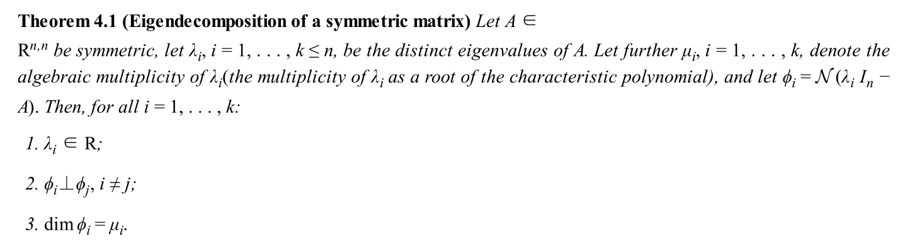

> [!proof]
> **Proof - Part 1**
> $\overline{\vec{v}}^{\top}S\vec{v}=(\overline{\vec{v}}^{\top}S)\vec{v}=(S\overline{\vec{v}})^{\top}\vec{v}=(\overline{S\vec{v}})^{\top}\vec{v}=(\overline{\lambda \vec{v}})^{\top}\vec{v}=\overline{\lambda}^{\top}\overline{\vec{v}}^{\top}\vec{v}=\overline{\lambda}\|\vec{v}\|_2^2$,$\overline{\vec{v}}^{\top}S\vec{v}=\overline{\vec{v}}^{\top}(S\vec{v})=\overline{\vec{v}}^{\top}\lambda \vec{v}=\lambda \overline{\vec{v}}^{\top}\vec{v}=\lambda \|\vec{v}\|_2^2$。所以$\overline{\lambda}=\lambda$, 所以$\lambda\in \mathbb{R}$。
**Proof - Part 2**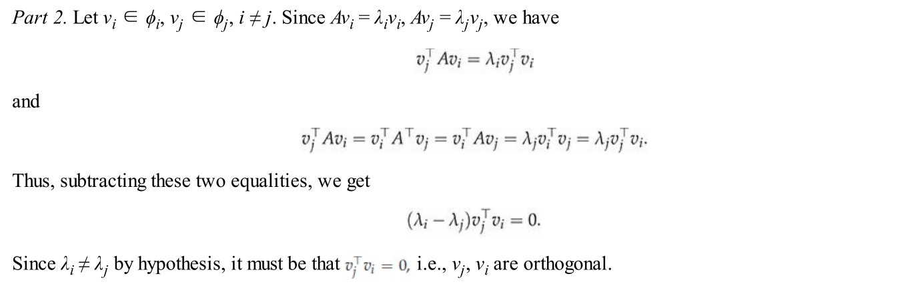
**Proof - Part 3**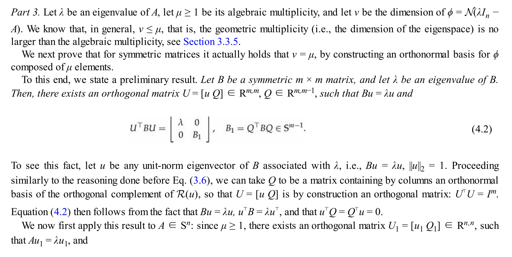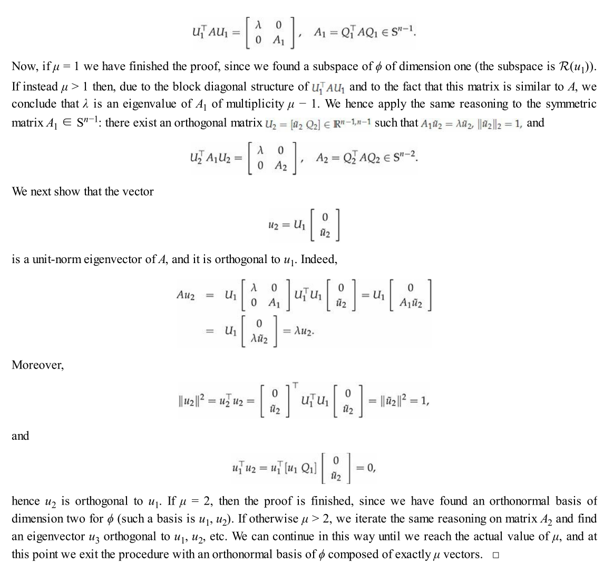

### Calculating Eigenvalues
> 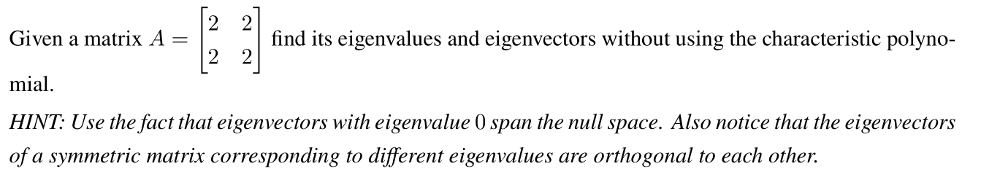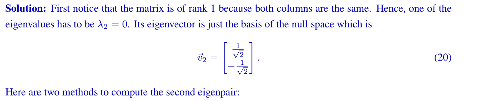

#### Method 1: Using Eigenvector orthogonality
> 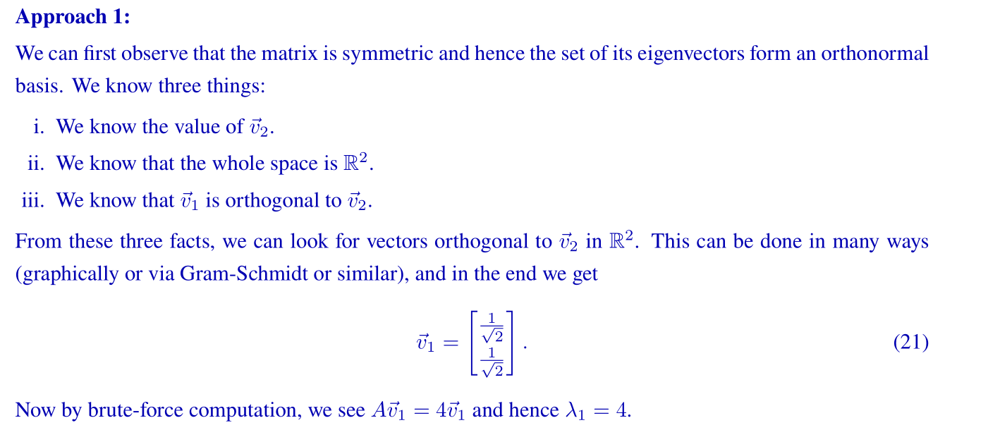

#### Method 2: Using Frobenius Norm
> 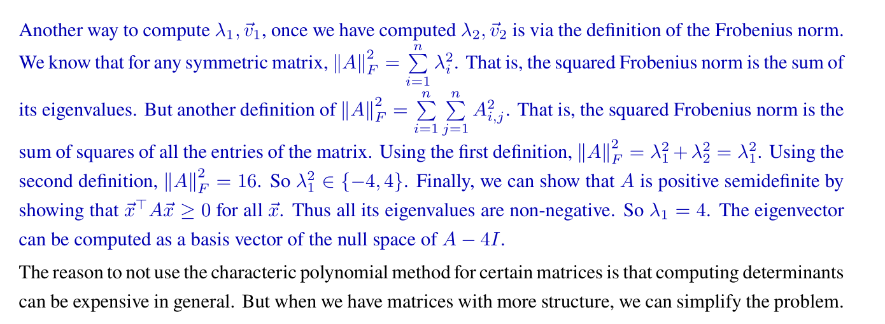

#### Method 3: Characteristic Equations
> $(\lambda-2)^2-4=\lambda^2-4\lambda=0$, $\lambda_1=4,\lambda_2=0$

#### Method 4: Observation
> 观察到矩阵的列之和为定值$4$, 此时我们知道必有一个特征值为$4$。同时矩阵的迹为$4$, 所以剩下的一个特征值是$0$。

### Diagonalization
> 对于任意$A\in \mathbb{S}^n$, 都可以进行正交对角化得到$A=U^T\Lambda U$, 此时$\vec{x}^{\top}A\vec{x}=\vec{x}^{\top}U^{\top}\Lambda U\vec{x}=(U\vec{x})^{\top}\Lambda (U\vec{x})$, 通常我们会令$\widetilde{\vec{x}}=U\vec{x}$进行分析。

### Vector Spaces
> 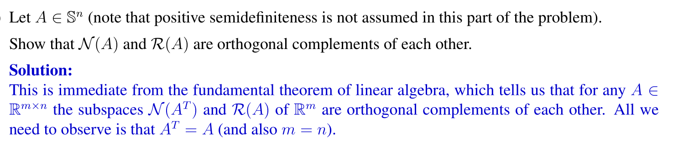

## Advanced Properties
### Commutivity
> 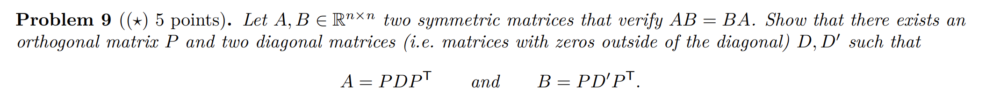
> Since $A$and $B$are both symmetric, then by spectrum decomposition theorem we have $A=UD_1U^{\top}$, $B=VD_2V^{\top}$. Since $AB=BA$ we have:
>  $UD_1U^{\top}VD_2V^{\top}=VD_2V^{\top}UD_1U^{\top}$
> Multiplying $U^{\top}$on the left and $U$on the right we could get 
> $D_1U^{\top}VD_2V^{\top}U=U^{\top}VD_2V^{\top}UD_1$
> Since $D_1,D_2$are diagonal matrices and we know for all diagonal matrices and an arbitrary matrix $T$, we have communtivity $D_1T=TD_1$and $D_2T=TD_2$
> Thus the LHS:
> $D_1U^{\top}VD_2V^{\top}U=D_1U^{\top}VV^{\top}UD_2=D_1D_2=D''$
> the RHS:
> $U^{\top}VD_2V^{\top}UD_1=U^{\top}VD_2V^{\top}D_1U$
> Equating them:
> $U^{\top}VD_2V^{\top}D_1U=D''$
> Letting $P=$

## Orthogonal Eigenspaces
> 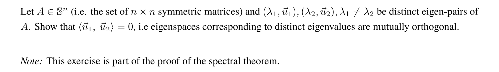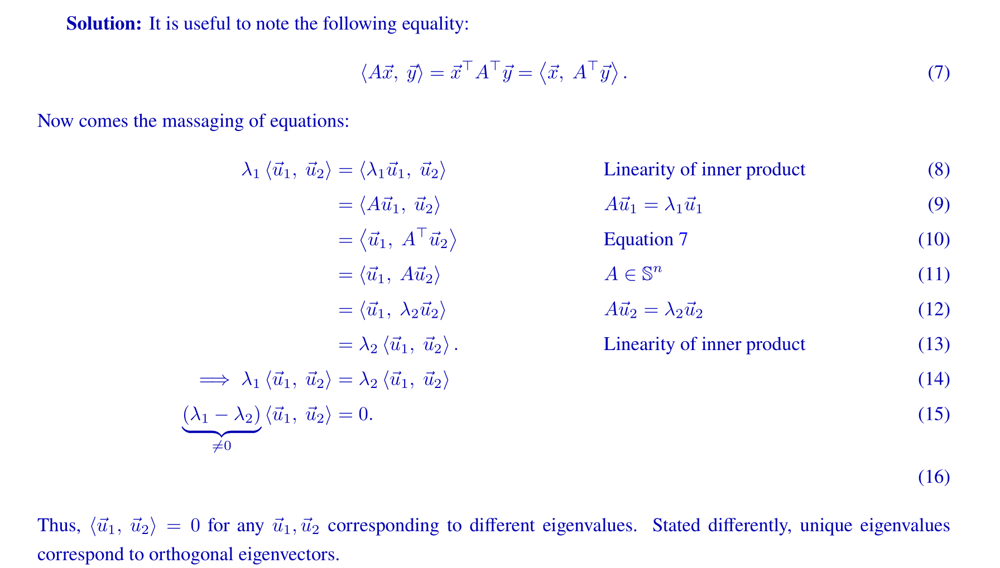
> 这个事实使得我们可以对任意对称矩阵构造谱分解，即$A=U\Lambda U^T$, 其中$U$是`Orthogonal Matrices of eigenvectors`。
> **构造过程如下:**
> 1. 计算$A$的特征值。
> 2. 对于每一个特征值$\lambda_i$的特征空间$\mathcal{N}(\lambda_i I-A)$, 我们求其基向量，然后使用`Gram Schmidt`对其正交化。
> 3. 将所有特征空间的正交基合并成一个矩阵$U$即可。

## Rayleigh Quotient
### Maximum Eigenvalues
> [!important]
> 对于$A\in S^n$, 我们有如下定义:
> 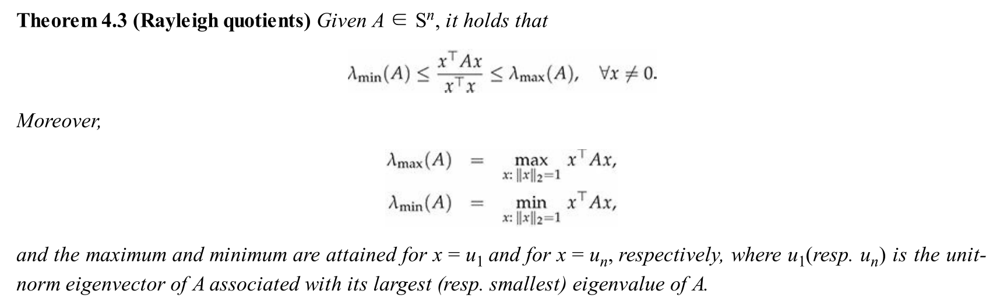

> [!proof]
> **Proof of Theorem 4.3**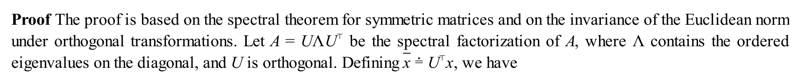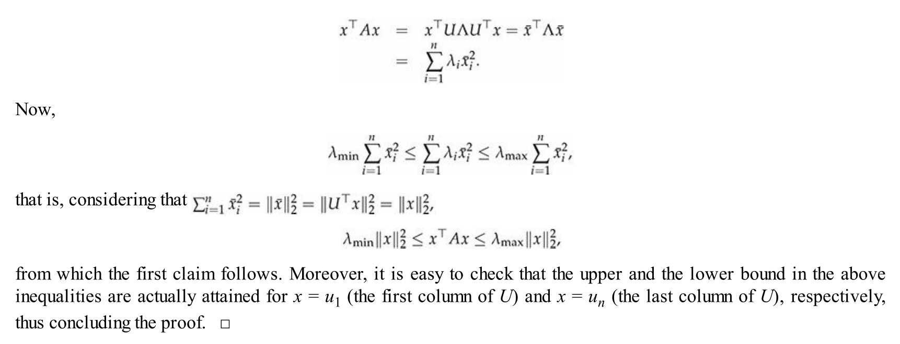假设$\lambda_1>\lambda_2>\cdots>\lambda_n$, 则最大值在$\vec{u}_1$($\lambda_1$对应的特征值)处取到，此时$\vec{u}_1^{\top}A\vec{u}_1=\vec{u}_1^{\top}\lambda_1\vec{u}_1=\lambda_1\|\vec{u}\|_2^2=\lambda_1$，最小值在$\vec{u}_n$取到。

### Subsequent Eigenvalues
> [!important]
> 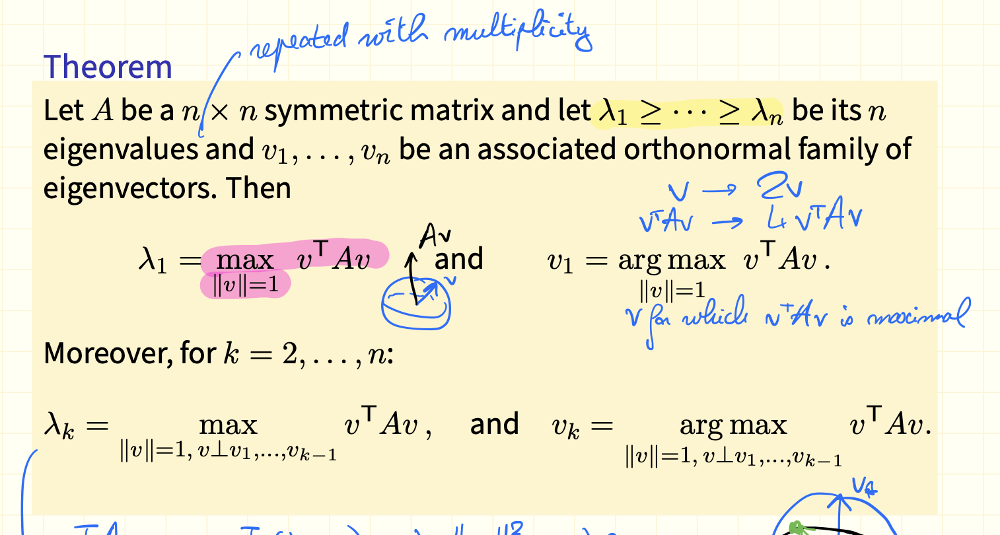
> 因为我们有一个很重要的假设，$A$是对称矩阵，所以我们在进行$argmax_{\|\vec{v}\|_2=1,\vec{v}\perp\vec{v}_i,i=1,2,\cdots, k}\vec{v}^{\top}A\vec{v}$时，可以利用谱分解定理:
> $$\begin{align}argmax\vec{v}^{\top}A\vec{v}&=\vec{v}^{\top}U\Lambda U^{\top}\vec{v}\\&=\sum_{i=1}^{n}(\vec{v}_i^{\top}\vec{u}_i)\lambda_i(\vec{u}_i^{\top}\vec{v}_i)\\&=\sum_{i=k+1}^n(\vec{v}_i^{\top}\vec{u}_i)\lambda_i(\vec{u}_i^{\top}\vec{v}_i)\\&\leq\lambda_{k+1}\|U_{k+1,n}\vec{v}\|_2^2\\&=\lambda_{k+1}\end{align}$$, where $\vec{v}^*=\vec{u}_{k+1},U_{k+1,n}$是$U$的第$k+1$列到第$n$列。

## Matrix Gain
> 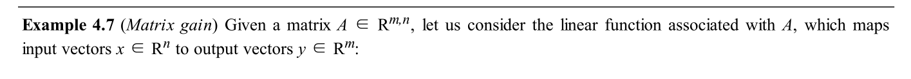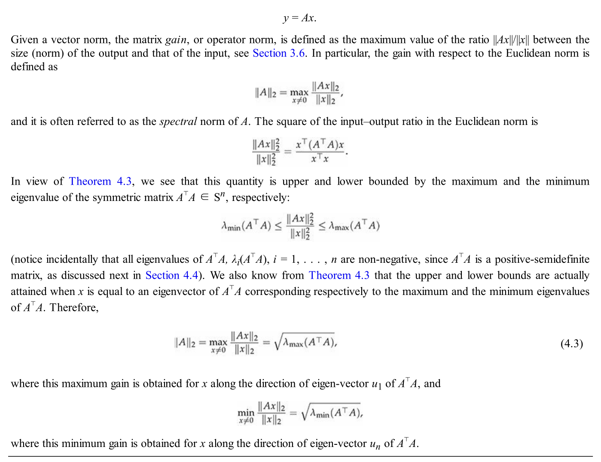

## Min-max Principles⭐⭐⭐⭐⭐
### Poincare Inequality - 4.4
> [!thm]
> 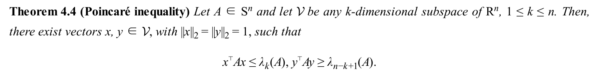

> [!proof]
> **第一部分的证明如下:**
因为$A$是对称矩阵$S^n$，所以$A=U\Lambda U^{\top}$(By Spectrum Decomposition), 令$U_k=[\vec{u}_k,\cdots, \vec{u}_n]$, 即$dim(Col(U_k))=n-k+1$, 令$Col(U_k)=\mathcal{Q}$, $dim(\mathcal{Q})=n-k+1$。
因为$dim(\mathcal{V})=k$, 所以:
$\begin{aligned}dim(\mathcal{Q}+\mathcal{V})&=dim(\mathcal{Q})+dim(\mathcal{V})-dim(\mathcal{Q}\cap \mathcal{V})\\&=n-k+1+k-dim(\mathcal{Q}\cap \mathcal{V})\\&\leq dim(\mathbb{R}^n)\\&=n\end{aligned}$
于是$n+1-dim(\mathcal{Q}\cap \mathcal{V})\leq n$, 所以$dim(\mathcal{Q}\cap \mathcal{V})\ge 1$，即$\mathcal{Q}\cap \mathcal{V}\neq \{\vec{0}\}$
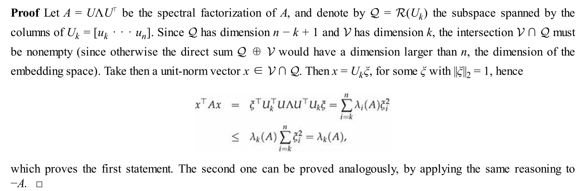
假设$\lambda_k\geq \lambda_{k+1}\geq \cdots\geq \lambda_n$，其中$U_k^{\top}U=\begin{bmatrix}0&0&\cdots&0&1&0&\cdots&0\\0&0&\cdots&0&0&1&\cdots&0\\\vdots&\vdots&\ddots&\vdots&\vdots&\vdots&\ddots&\vdots\\0&0&\cdots&0&0&0&\cdots&1\end{bmatrix}$，$U^{\top}U_k=\begin{bmatrix}0&0&\cdots&0\\0&0&\cdots&0\\\vdots&\vdots&\ddots&\vdots\\0&0&\cdots&0\\1&0&\cdots&0\\0&1&\cdots&0\\\vdots&\vdots&\ddots&\vdots\\0&0&\cdots&1\end{bmatrix}$,所以$\zeta^{\top}U_k^{\top}U=\begin{bmatrix}0&\cdots& \zeta_k&\zeta_{k+1}&\cdots&\zeta_n\end{bmatrix}$,$U^{\top}U_k\zeta=\begin{bmatrix} 0&\cdots&\zeta_k&\zeta_{k+1}&\cdots&\zeta_n\end{bmatrix}^{\top}$。
**第二部分的证明如下:**
步骤基本一样，就是说我们要认识到，对于矩阵$A$的特征值$\vec{v}$，满足$A\vec{v}=\lambda \vec{v}$, 则矩阵$-A$的特征值满足$-A\vec{v}=(-\lambda)\vec{v}$, 即$A$和$-A$的特征值的转化通过去负即可实现。
$\begin{aligned} \vec{y}^{\top}(-A)\vec{y}&=\sum_{i=k}^n\lambda_i(-A)\zeta_i^2\\&\leq \lambda_k(-A)\sum_{i=k}^n\zeta_i^2\\&=(-\lambda_{n-k+1}(A))\sum_{i=k}^n\zeta_i^2\\&=-\lambda_{n-k+1}(A)\end{aligned}$
于是$\vec{y}^{\top}A\vec{y}\geq \lambda_{n-k+1}$

### Min-max Principles
> [!thm]
> 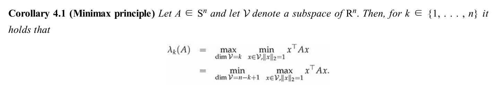

> [!proof]
> 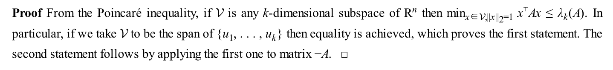

### Applications - Eigenvalue Increments
> [!important]
> 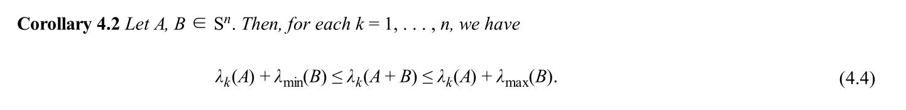

> [!proof]
> 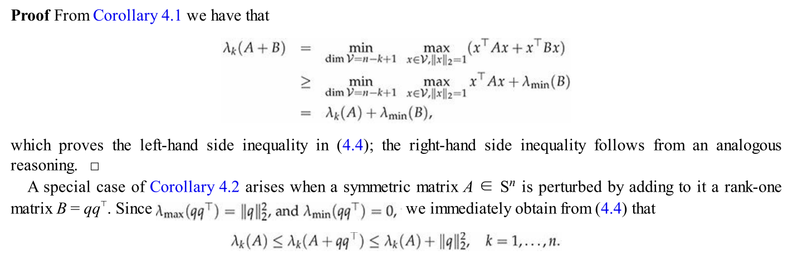

## Important Symmetric Matrices
### Sample Covariance Matrix
> 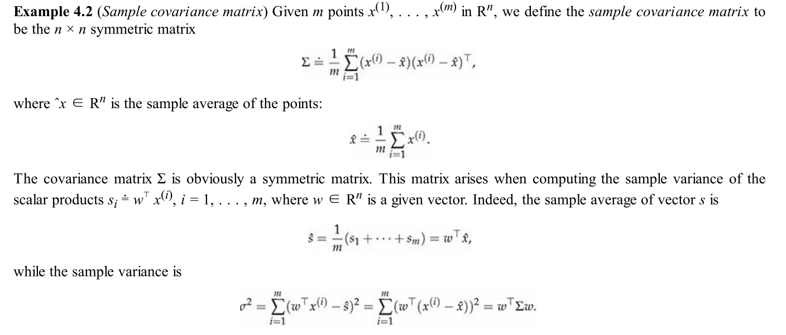

### Gram Matrix
> 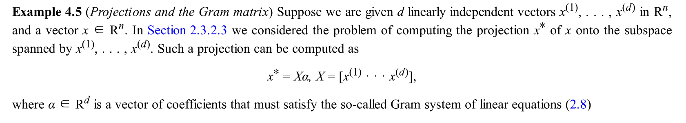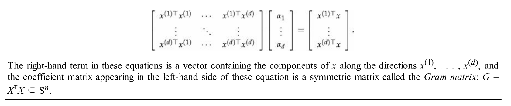

## Exercises
> **HW02 Sp23**
> 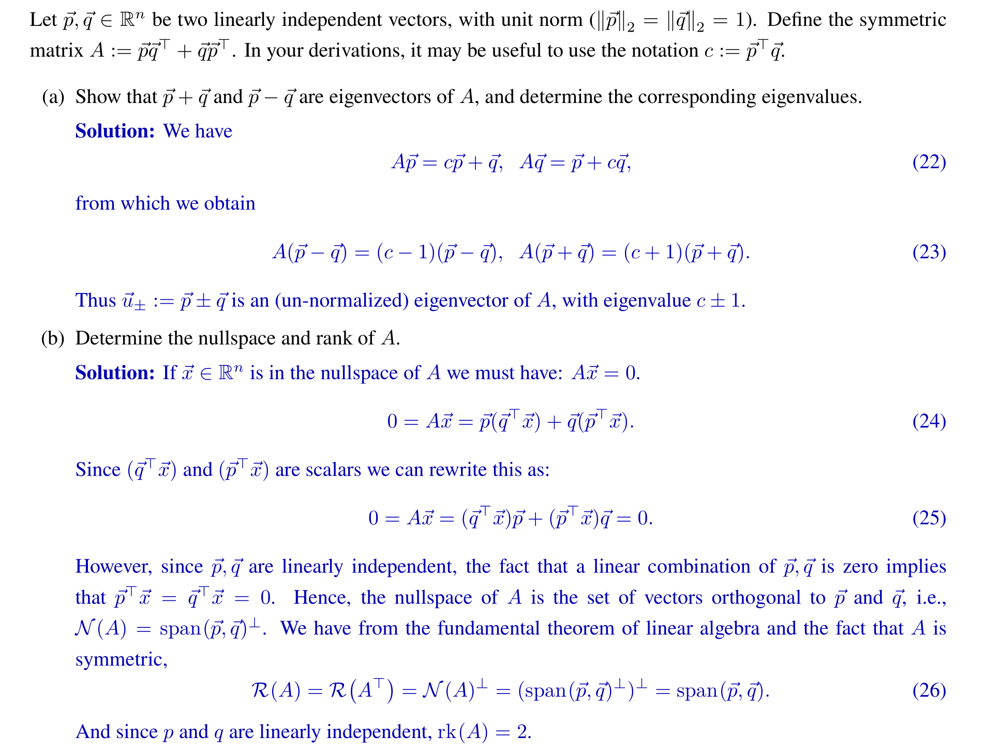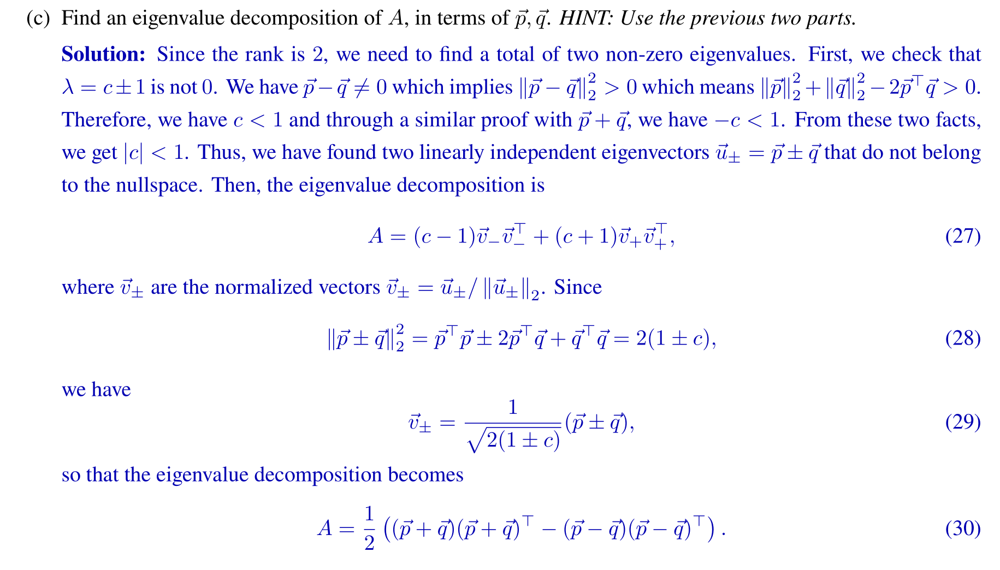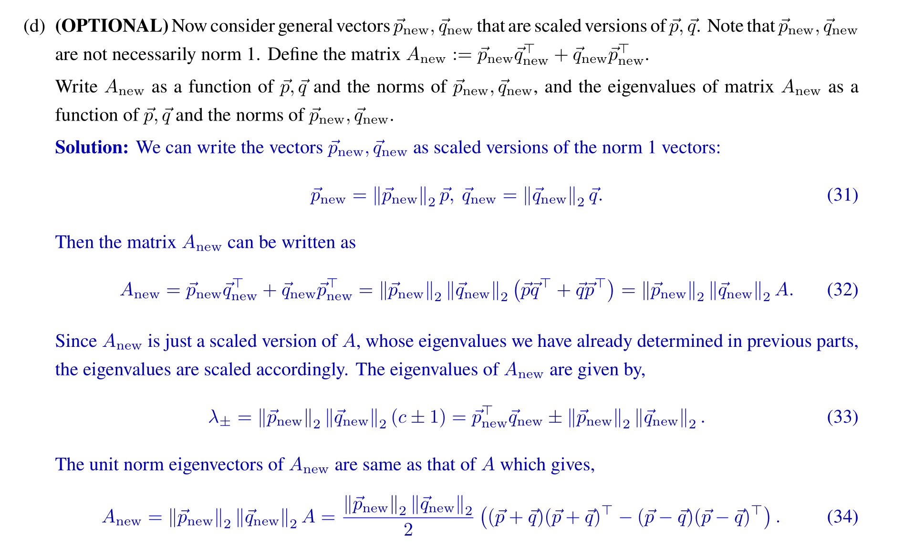

# Dyads（二分体矩阵）
## Definition
> 一个矩阵$A\in \mathbb{R}^{m\times n}$被称为`dyad` 当且仅当它可以被写成$A=uv^{\top}$的形式，其中$u\in \mathbb{R}^m,v\in \mathbb{R}^{n}$。
> 对于一个向量$\vec{x}$, $A\vec{x}=(\vec{u}\vec{v}^{\top})\vec{x}=\vec{u}(\vec{v}^{\top}\vec{x})=(\vec{v}^{\top}\vec{x})\vec{u}$(因为$\vec{v}^{\top}\vec{x}$是一个标量)。

## Properties
> 当$\vec{u}\in \mathbb{R}^m,\vec{v}\in \mathbb{R}^m$时，$A$为方阵，此时:
> 1. 如果$\vec{u}\neq \vec{0}$, $\vec{v}\neq \vec{0}$，则$Rk(A)=1$, 矩阵$A$的列空间为$Span(\{\vec{u}\})$, $dim(Col(A))=1$, 否则$Rk(A)=0$。
> 
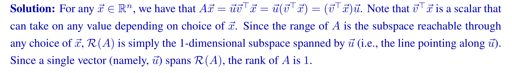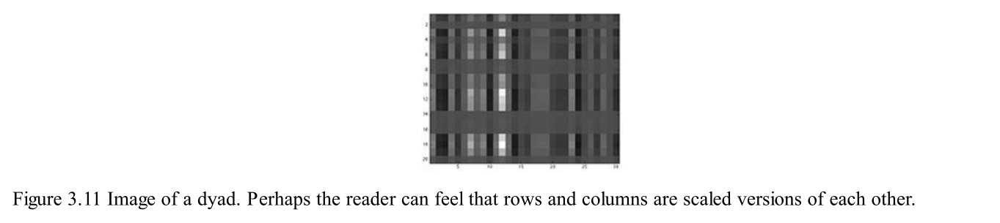
> 2. $dim(Null(A))+Rank(A)=m$, 所以$dim(Null(A))=m-1$。
> 3. 矩阵$A$特征值仅为$0$和$\vec{v}^{\top}\vec{u}$：
>    1. 因为$dim(Null(A-0\cdot I))=dim(Null(A))=m-1$, 所以特征值为零的特征空间的维数为$m-1$。
>    2. 令输入向量为$\vec{u}$, 则$A\vec{u}=(\vec{v}^{\top}\vec{u})\vec{u}=\lambda \vec{u}$, 所以`Dyad`矩阵的非零特征值有且仅有一个，为$\lambda=\vec{v}^{\top}\vec{u}$, 特征向量为$\vec{u}$。
> 4. 当$\vec{u}=\vec{v}$时，$A=\vec{v}\vec{v}^{\top}\in \mathbb{S}_+^n$：
>    1. 如果$\vec{v}=\vec{0}$, 则$\vec{v}\vec{v}^{\top}=0_{n\times n}$, 且$Rank(\vec{v}\vec{v}^{\top})=0$, 此时$\vec{x}^{\top}\vec{v}\vec{v}^{\top}\vec{x}=(\vec{v}^{\top}\vec{x})^2=0\geq 0,~~\forall \vec{x}\in \mathbb{R}^n$, 即$\vec{v}\vec{v}^{\top}\in \mathbb{S}^n_+$
>    2. 如果$\vec{v}\neq \vec{0}$, 则$Rank(\vec{v}\vec{v}^{\top})=1$且因为$\vec{x}^{\top}\vec{v}\vec{v}^{\top}\vec{x}=(\vec{v}^{\top}\vec{x})^2\geq 0,~~\forall \vec{x}\in \mathbb{R}^n$,我们有$\vec{v}\vec{v}^{\top}\in \mathbb{S}^n_+$

## Normalized Form
> $A=u v^{\top}=\left(\|u\|_2 \cdot\|v\|_2\right) \frac{u}{\|u\|_2} \frac{v^{\top}}{\|v\|_2}=\sigma \tilde{u} \tilde{v}^{\top}$, 其中$\sigma>0,\|\tilde{u}\|_2=\|\tilde{v}\|_2=1$

## Dyad Expansion
> 对于任意矩阵$A\in \mathbb{R}^{m\times n}$, 我们可以将其分解成$A=UV^{\top}$, 其中$U\in \mathbb{R}^{m\times k}, V\in \mathbb{R}^{n\times k}$，$Rank(A)\leq k$。
> **证明:**
> 因为 $UV^{\top}=\sum_{i=1}^n \vec{u}_i\vec{v}_i^{\top}$, 且$Rank(\vec{u}_i\vec{v}_i^{\top})=1$, 所以根据`Rank Properties`我们有:
> $Rank(A)=Rank(UV^{\top})=Rank(\sum_{i=1}^n \vec{u}_i\vec{v}_i^{\top})\leq \sum_{i=1}^nRank(\vec{u}_i\vec{v}_i^{\top})=k$

## Example
> 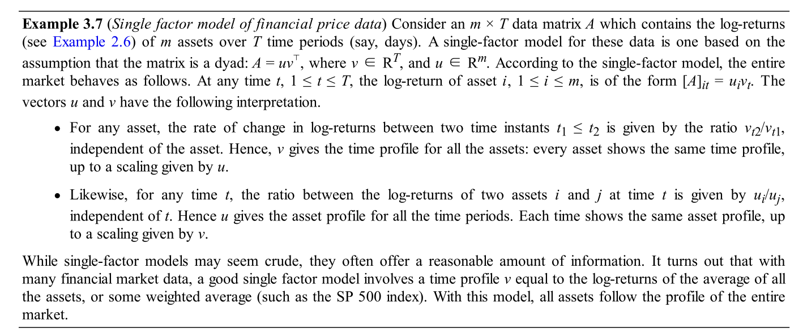

# PSD/PD Matrices
## Definition&Notations
> 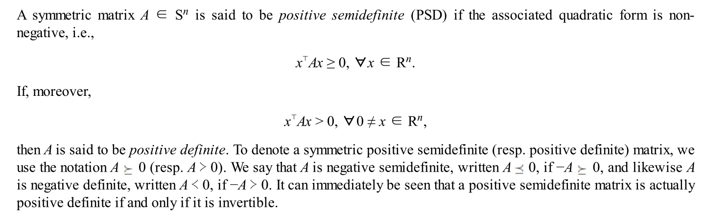
> 将$\vec{x}^{\top}A\vec{x}$展开可以得到: $\vec{x}^{\top}A\vec{x}=\sum_{i=1}^n\sum_{j=1}^nA_{ij}x_ix_j$
> 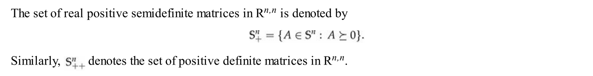
> $A\succeq B$means $A-B\succeq 0$by definition(也就是`Matrix`之间比较大小的一种数学符号)。

## Basic Properties
> [!property]
> **对于任意**$A\in \mathbb{S}^n_+$**,**$A\succcurlyeq0$**, 且都可以进行正交对角化得到**$A=U^T\Lambda U$**:**
> 1. $\vec{x}^{\top}A\vec{x}\geq 0\iff$**All eigenvalues are non-negative.**
> 
**证明:** $\vec{x}^{\top}A\vec{x}=\vec{x}^{\top}U^{\top}\Lambda U\vec{x}=(U\vec{x})^{\top}\Lambda (U\vec{x})=\vec{y}^{\top}\Lambda\vec{y}=\sum_{i=1}^n\lambda_iy_i^2\geq 0$, 则$\lambda_i\geq 0$
> 2. **Colesky decomposition: **$A\succcurlyeq0\iff$**There exists a symmetric matrix **$P$**such that **$A=P^{\top}P$
> - **If: **因为$A\succcurlyeq0$, 所以我们定义$A^{\frac{1}{2}}=U\Lambda^{\frac{1}{2}}U^{\top}=P$。因为$\Lambda$的对角线元素为$A$的特征值，全部非负，所以$\Lambda^{\frac{1}{2}}$对角线元素也全部非负，所以$A^{\frac{1}{2}}\in \mathbb{S}^n_{+}$，即$P\in \mathbb{S}^n_{+}$, 所以我们有:$P^{\top} P=\left(A^{\frac{1}{2}}\right)^{\top} A^{\frac{1}{2}}=\left(U \Sigma^{\frac{1}{2}} U^{\top}\right)^{\top} U \Sigma^{\frac{1}{2}} U^{\top}=U \Sigma^{\frac{1}{2}} U^{\top} U \Sigma^{\frac{1}{2}} U^{\top}=U \Sigma^{\frac{1}{2}} \Sigma^{\frac{1}{2}} U^{\top}=U \Sigma U^{\top}=A \text {. }$
> - **Only if: **因为$\vec{x}^{\top}A\vec{x}=\vec{x}^{\top}P^{\top}P\vec{x}=\langle P\vec{x},P\vec{x}\rangle=\|P\vec{x}\|^2_2\geq 0$, 于是$A\succcurlyeq0$。
> 3. **如果**$A\succeq 0$**, 则**$A_{ii}\geq0$**。**
> 
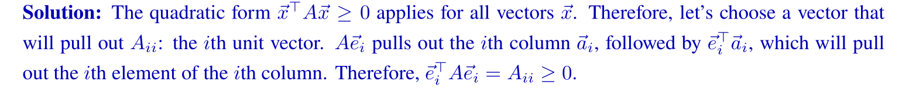

## Advanced Properties
> [!property] 
> 1.**半正定矩阵的和: **如果$A,B\in \mathbb{S}_+^n$, 则$A+B\in \mathbb{S}_+^n$。更一般的，如果$A_i\in \mathbb{S}_+^n$, 我们有$\sum_{i=1}^n A_i\in \mathbb{S}_+^n$。（Closed under addition）
> 2. **半正定矩阵序列: 假设**$A_1,A_2,\cdots A_k\in \mathbb{S}^{n}_+$**(用**$(A_k\in \mathbb{S}^n_+)_{k\geq 1}$**表示矩阵序列)。如果**$\lim_{k\to \infty}A_k=A$**(表示**$\lim_{k\to \infty} (A_k)_{ij}=A_{ij},\forall 1\leq i,j \leq n$**)，则**$A\in \mathbb{S}^n_+$**:**
> 3. **半正定矩阵的零空间:** $A\in \mathbb{S}_+^n,\vec{x}\in \mathbb{R}^n$, $\vec{x}\in \mathcal{N}(A)\iff\vec{x}^{\top}A\vec{x}=0$
> 4. **半正定矩阵会增加特征值:** 对于$A\in \mathbb{S}^n$, $B\in \mathbb{S}^n_+$, 则: $\lambda_k(A+B)\geq \lambda_k(A), k=1,2,\cdots, n$
> 
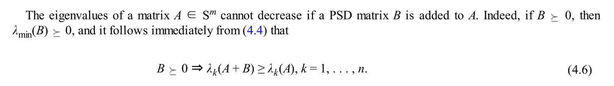

> [!proof]
> **Proof of 1**
> $\vec{x}^{\top}(A+B)\vec{x}=\vec{x}^{\top}A\vec{x}+\vec{x}^{\top}B\vec{x}\geq 0$, 所以$A+B\in \mathbb{S}_+^n$。$\vec{x}^{\top}(\sum_{i=1}^nA_i)\vec{x}=\sum_{i=1}^n\vec{x}^{\top}A_i\vec{x}\geq 0$, 所以$\sum_{i=1}^nA_i\in \mathbb{S}_+^n$。
> **Proof of 2**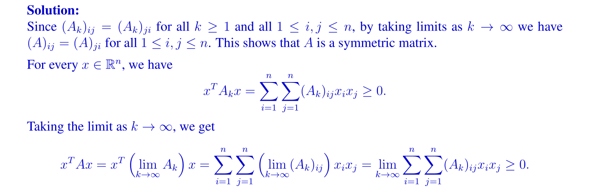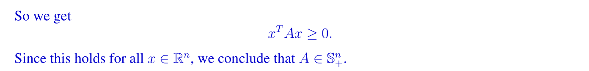**Proof of 3**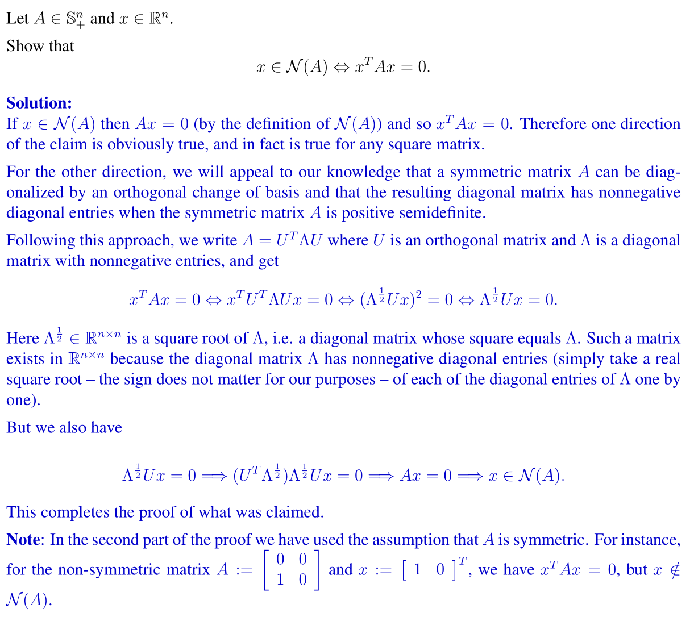
上面的非对称矩阵实际上是无法进行`Diagonalization`的，因为$0$特征值对应的特征向量不足以张成$\mathbb{R}^2$空间。

## Congruence Transformation
> 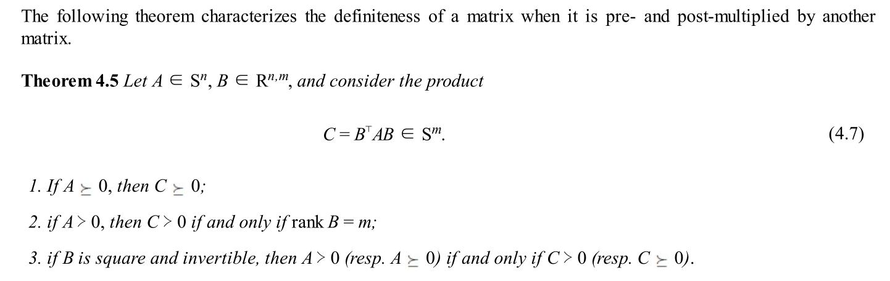

> [!proof]
> 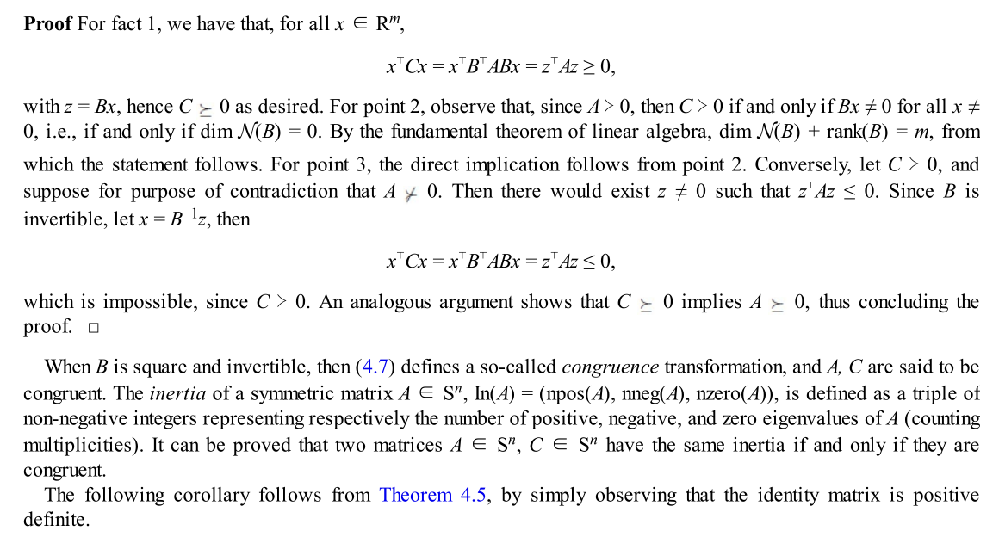
> 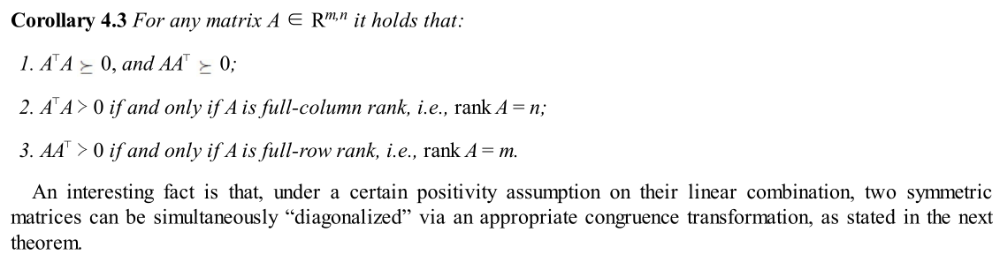

## Ellipsoid Shape
### Examples
> 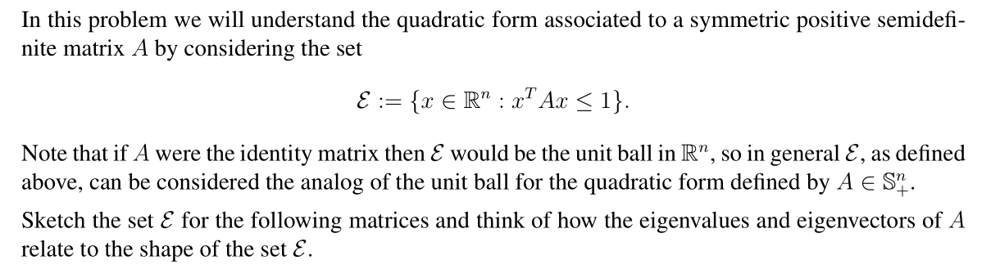
> 回忆一下椭圆方程是$\frac{x^2}{a^2}+\frac{y^2}{b^2}=1$, 其中椭圆和$x$轴的交点是$(\pm a,0)$，和$y$轴的交点是$(0,\pm b)$。

**Positive Definite - Unit Circle**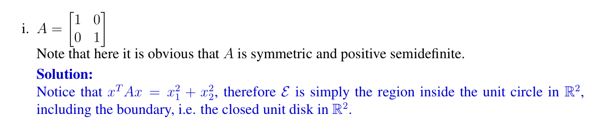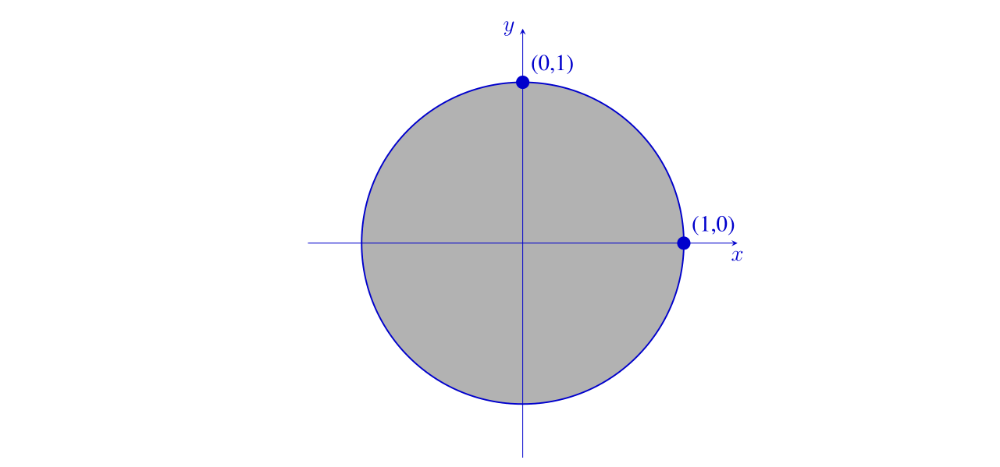
**Positive Definite - Ellipse**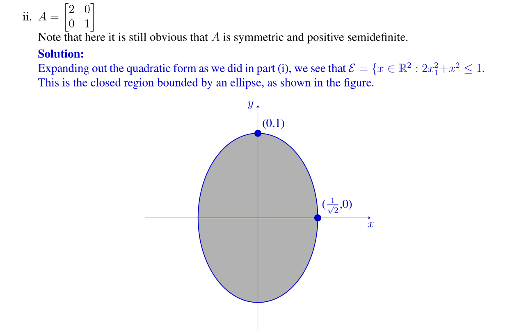
**Positive Definite - Rotated Ellipse**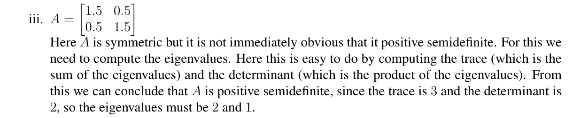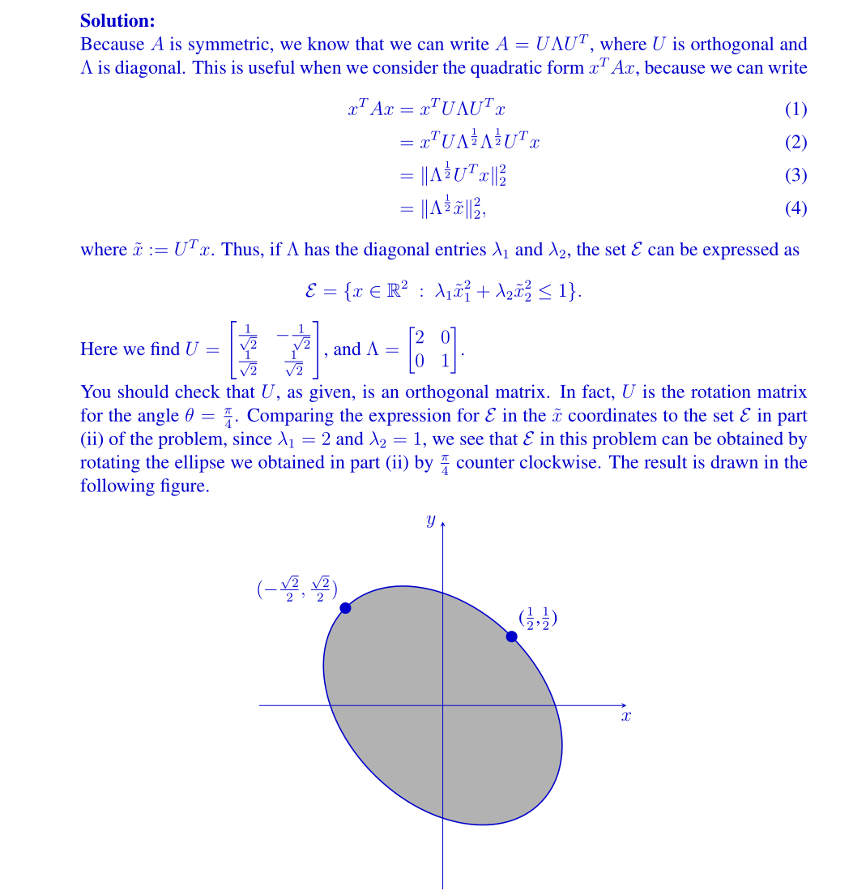注意这里的旋转矩阵$U^{\top}=\begin{bmatrix} \frac{1}{\sqrt{2}}&\frac{1}{\sqrt{2}}\\-\frac{1}{\sqrt{2}}&\frac{1}{\sqrt{2}}\end{bmatrix}$, 我们知道旋转矩阵的参数表达式是$\begin{bmatrix} cos\theta&-sin\theta\\sin\theta&cos\theta\end{bmatrix}$, 其中$\theta=-\frac{\pi}{4}$, 所以实际上是椭圆顺时针旋转了$45$度。
**Positive Semidefinite - Unbounded**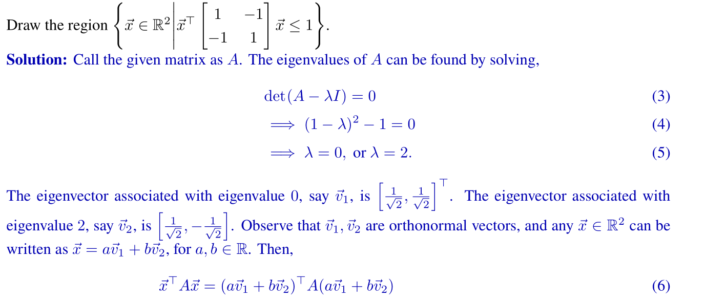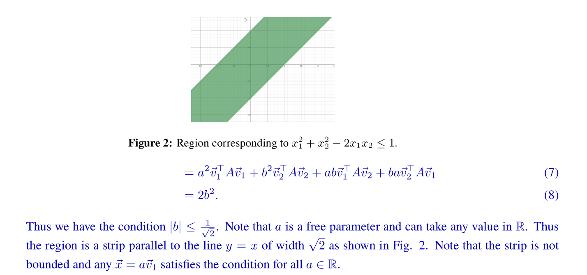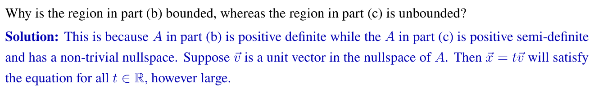
本质上我们知道如果$A$有`Non-Trivial Null Space`, 则$\forall \vec{x} \in Null(A), \vec{x}^{\top}A\vec{x}=0\leq 1$满足条件。因为`Null Space is non-trivial`意味着$dim(Null(A))>0$。
如果$dim(Null(A))=1$, 则$Null(A)$的图像是一条线，是`Unbounded`的。
如果$dim(Null(A))=2$, 则$Null(A)$的图像是一个平面，也是`Unbounded`的。
以此类推。
> **总结:**
> 对于$A\in S^2$来说，令$\mathcal{E}:=\left\{x \in \mathbb{R}^2: x^T A x \leq 1\right\}$, 则：
> 1. $A\in S^2_{++}$(`Positive Definite`), 则$\mathcal{E}$的形状为`Ellipse`。
> 2. $A\in S^2_{+}$(`Positive Semidefinite`), 则$\mathcal{E}$的形状取决于特征值的大小和特征向量的方向。
>    1. 如果$A$`has non-trivial null space`($A$有一个特征值为零)，则$x^T A x \leq 1$对零特征值对应的特征向量的方向不做限制。一般而言$\mathcal{E}$是`Unbounded`的。
>    2. 如果$A$的零空间为$\{0\}$, 即对应$1$中正定矩阵的情况。

## Applications
### *Adding PSD Dyads
> 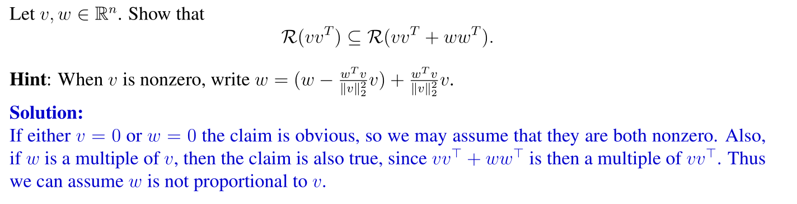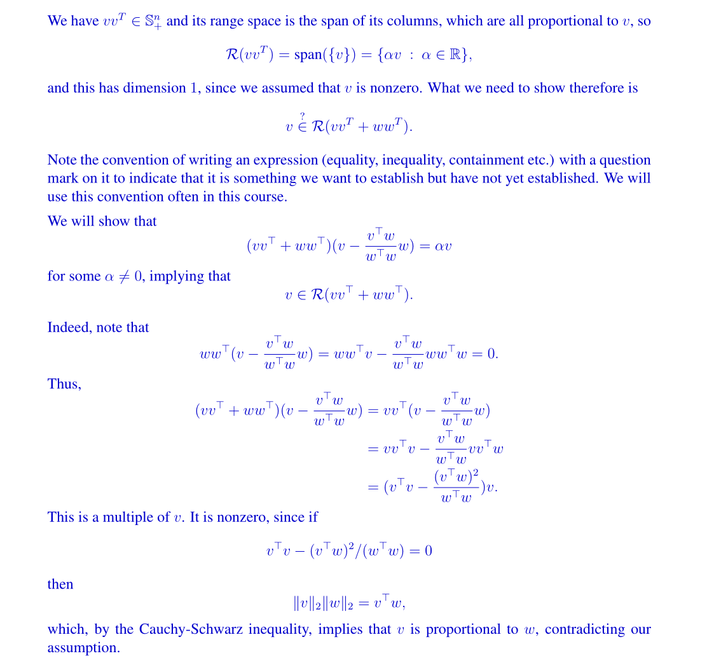

### Rank Increment by adding Dyad
> [!important] 
> 下面我们探究一个问题，对于$A\in \mathbb{S}^n_+$和$\vec{v}\in \mathbb{R}^n$, 探究$Rank(A+\vec{v}\vec{v}^{\top})-Rank(A)$的取值。
> 1. 对于$\vec{v}\vec{v}^{\top}$来说，我们知道，$\vec{v}\vec{v}^{\top}\in \mathbb{S}^n_+,\forall \vec{v}$。
> 2. 首先我们有两个等式关系成立:
>    1. 列空间:
> 
$Rank(A+\vec{v}\vec{v}^{\top})-Rank(A)=dim(\mathcal{R}(A+\vec{v}\vec{v}^{\top}))-dim(\mathcal{R}(A))$
>    2. 零空间:
> 
$\begin{aligned}Rank(A+\vec{v}\vec{v}^{\top})-Rank(A)&=dim(\mathcal{R}(A+\vec{v}\vec{v}^{\top}))-dim(\mathcal{R}(A))\\&=n-dim(\mathcal{N}(A+\vec{v}\vec{v}^{\top}))-(n-dim(\mathcal{N}(A)))\\&=dim(\mathcal{N}(A))-dim(\mathcal{N}(A+\vec{v}\vec{v}^{\top}))\end{aligned}$
> 我们将利用这两个等式关系切入。
> 3. 从零空间出发:
> 
因为$A\in \mathbb{S}_+^n,\vec{x}\in \mathbb{R}^n$, 所以$\forall \vec{x}\in \mathbb{R}^n,~\vec{x}^{\top}(A+\vec{v}\vec{v}^{\top})\vec{x}=\vec{x}^{\top}A\vec{x}+\vec{x}^{\top}\vec{v}\vec{v}^{\top}\vec{x}\geq 0$, 
> 即$A+\vec{v}\vec{v}^{\top}\in \mathbb{S}^n_+$。
> 所以我们有:
>    1. $A\in \mathbb{S}_+^n,\vec{x}\in \mathbb{R}^n$, $\vec{x}\in \mathcal{N}(A)\iff\vec{x}^{\top}A\vec{x}=0$
>    2. $A+\vec{v}\vec{v}^{\top}\in \mathbb{S}_+^n,\vec{x}\in \mathbb{R}^n$, $\vec{x}\in \mathcal{N}(A+\vec{v}\vec{v}^{\top})\iff\vec{x}^{\top}(A+\vec{v}\vec{v}^{\top})\vec{x}=0$
> 
所以$\forall \vec{x}\in \mathcal{N}(A+\vec{v}\vec{v}^{\top}),~\vec{x}^{\top}(A+\vec{v}\vec{v}^{\top})\vec{x}=0\implies \vec{x}^{\top}A\vec{x}=0~and~\vec{x}^{\top}\vec{v}\vec{v}^{\top}\vec{x}=0\implies \vec{x}\in \mathcal{N}(A)$
> 即我们有$\vec{x}\in \mathcal{N}(A+\vec{v}\vec{v}^{\top})\implies \vec{x}\in \mathcal{N}(A)$。
> 因为对于$A\in\mathbb{S}^n_+$来说，$\mathcal{N}(A)=\mathcal{N}(A^{\top})=\mathcal{R}(A)^{\perp}$, 
> $\vec{x}\in \mathcal{R}(A)\implies \vec{x}\in \mathcal{R}(A+\vec{v}\vec{v}^{\top})$
> 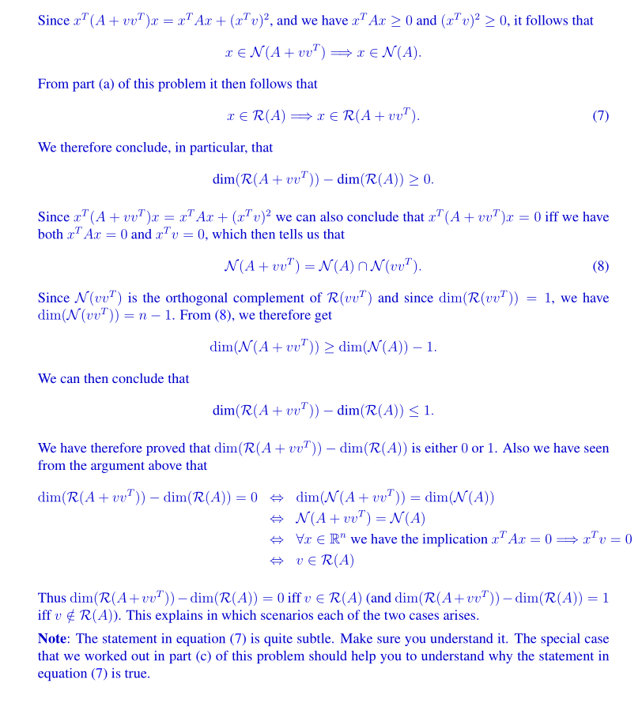

### Cauchy Matrix
> [!example]
> 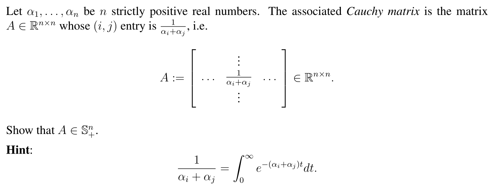

> [!proof]
> 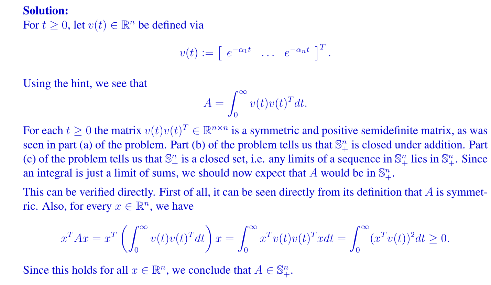

# Projection Matrices
## Definition
> 

## Some Important Properties
> 

# Stochastic Matrices
## Definition
> 

## Perron-Frobenius Theorem
> 

# Graphs and Graph Laplacian
## Laplacian Matrix
### Definition
> [!def]
> 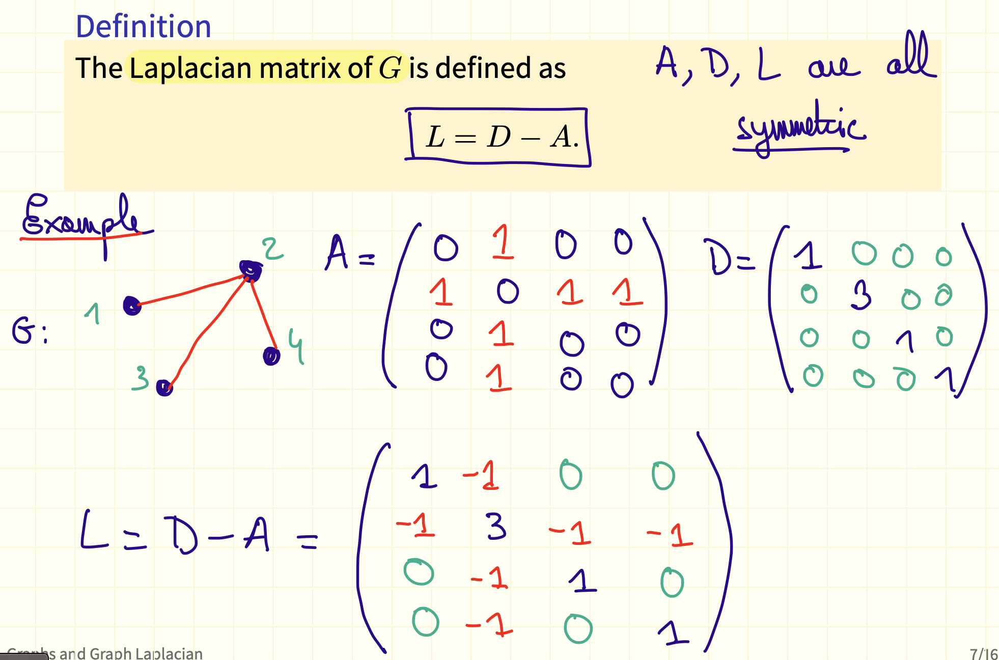

> [!proof] Proof Sketch
> 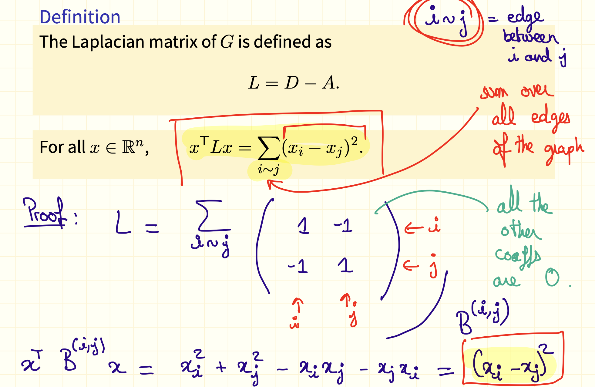
> 可以把$\vec{x}$想像成是在给`nodes`分配权重。

### Properties
> [!property] 1 Positive-Definiteness&Non-negative Eigenvalues
> $L\in \mathbb{S}_+^n$, 首先根据定义可知:
> $\vec{x}^{\top}L\vec{x}=\sum\limits_{i=1}^n(x_i-x_{j})^2\geq0\forall\vec{x}\in\mathbb{R}^n$
> 另外，因为$D$和$-A$都是对称矩阵，所以相加之后仍然是对称矩阵。
> 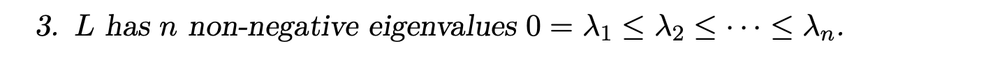
> 这个很显然，因为$L$是半正定矩阵。

> [!property] 2 Smallest Eigenvalue is zero，its geometric multiplicity reflects number of connected components
> 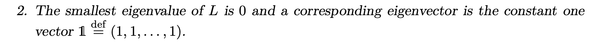
> 我们有$$\begin{align}\vec{x}\in Ker(A)&\iff \vec{x}^{\top}L\vec{x}=0\\&\iff x_i=x_j\forall i\neq j\\&\iff x_i=x_j~in~all~connected~components\end{align}$$
> 所以如果`G`是`connected`的话，即`G`只有一个`connected component`, 则一定有一个`eigenvector`, 它的每一个元素都相等。
> 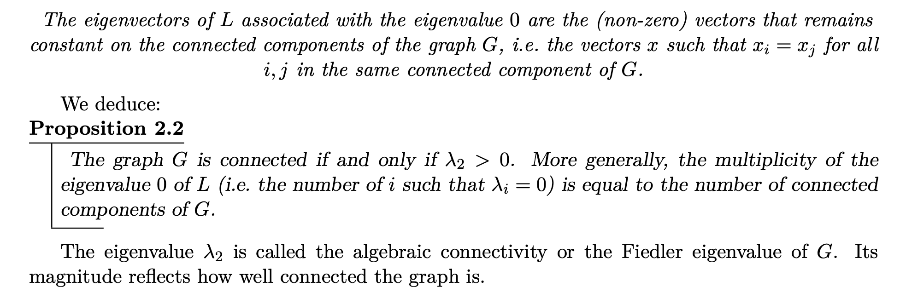

> [!property] 3 When we add edges, $\lambda_2$ increases.
> 因为add edges的最终结果一定会使得graph变成connected，即只有一个connected component, 此时$\lambda$从等于零变成大于零。
> 下面是严格的证明:
> 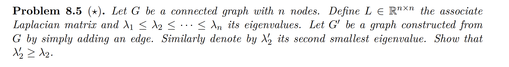

> [!property] 4 Eigenvalues can scale with the number of vertices
> 对于$A$这个对称矩阵来说，如果

### Aside: Connectivity
#### Basic Definitions
> [!def]
> 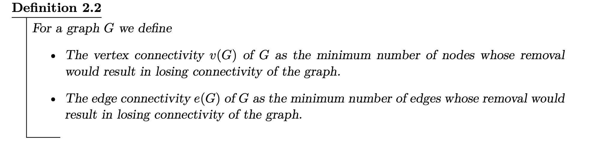

#### Theorem
> [!thm]
> 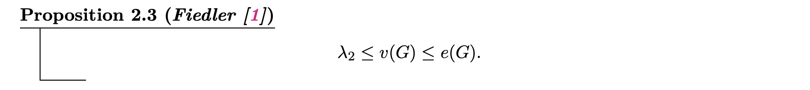
> 

> [!lemma]
> 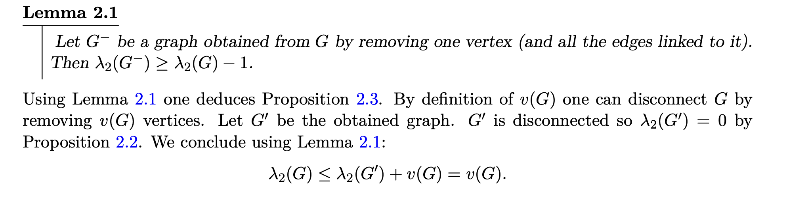
> 这里其实是recursively apply lemma 2.1 直到 graph is disconnected.

> [!proof] Proof for lemma 2.1
> 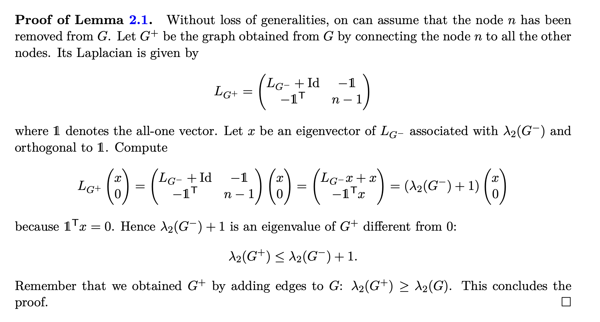

## Normalized Laplacian Matrix
### Definition
> [!def]
> 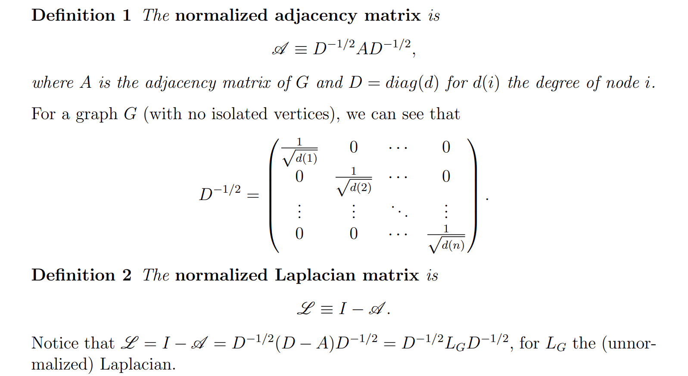

### Properties
> [!property]
> 

## Applications: Spectral Clustering Algorithm
