# Least Square Basics
## Solution of LS System
> 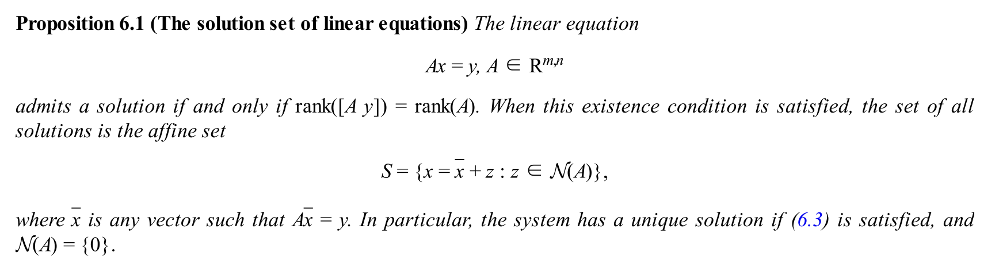
> 注意这里的$S$当且仅当$Rank([A~~y])=Rank(A)$时才成立。


## Model Transformation
> 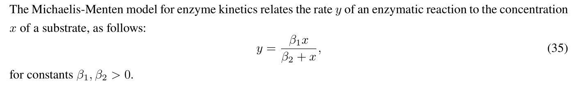
> 我们的目标是估计$\beta_1$和$\beta_2$的值，但是这里$\beta_1$和$\beta_2$并不呈现出线性关系，但是我们可以将其化成线性关系，比如取倒数。得到$y^{-1}=\frac{\beta_2}{\beta_1}x^{-1}+\frac{1}{\beta_1}$, 令$w_1=\frac{1}{\beta_1}, w_2=\frac{\beta_2}{\beta_1}$, 即$y^{-1}=w_1+w_2x^{-1}$, 然后我们可以使用最小二乘法，将手头可以获取的数据放入一个`Data Matrix`$\mathbf{X}=\begin{bmatrix} 1&x_1^{-1}\\1&x_2^{-1}\\\vdots&\vdots\\1&x_n^{-1}\end{bmatrix}$, $\vec{y}=\begin{bmatrix}y_1^{-1}\\y_2^{-1}\\\vdots\\y_n^{-1}\end{bmatrix}$, 则我们有$\mathbf{X}\vec{w}=\vec{y}$, 其中$\vec{w}=\begin{bmatrix} w_1\\w_2\end{bmatrix}$。
> 所以$\vec{w}^{*}=(\mathbf{X^{\top}X})^{-1}\mathbf{X}^{\top}\vec{y}$，则$\beta_1^*=\frac{1}{w_1^*},\beta_2^*=\frac{w_2^*}{w_1^*}$。


## Solving the Least Square System

### Full QR Decomposition
#### Definition
> 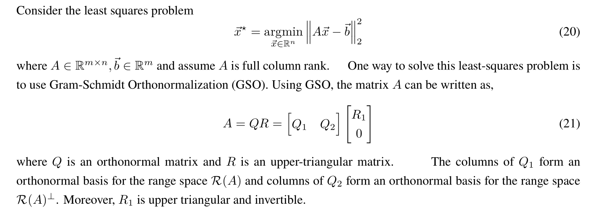
> 上图中的过程我们称之为`Full QR Decomposition`, 其中$Q_1$就是我们通过下面的算法得到的矩阵，因为$A$列满秩，所以$Q_1\in \mathbb{R}^{m\times n}$,$R_1\in \mathbb{R}^{n\times n}$且$A=Q_1R_1$。
> 不同于`QR Decomposition`, `Full QR Decomposition`得到的$Q$是一个方阵，而$Q_1$的形状和$A$一致。
> 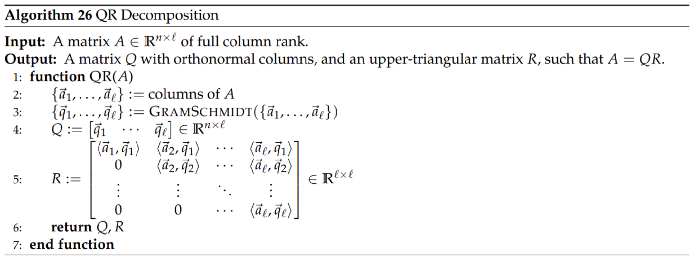
> 但是$Q_1\in \mathbb{R}^{m\times n}$, 不是方阵，于是我们可以对$Q_1$运行`Extend Basis`算法得到$Q$($\mathcal{R}(Q)=\mathbb{R}^m$), 此时$Q\in \mathbb{R}^{m\times m}$。我们想要$A=QR$, 其中$Q=\begin{bmatrix}Q_1&Q_2 \end{bmatrix}$, $R=\begin{bmatrix} R_1\\0\end{bmatrix}$, 其中$Q_2\in \mathbb{R}^{m\times (m-n)}$, $R_1\in \mathbb{R}^{n\times n}$, 所以$R=\begin{bmatrix} R_1\\0\end{bmatrix}\in \mathbb{R}^{m\times n}$。
> 于是我们可以将$A$分解为$QR$，即$A=QR$, 其中$Q\in \mathbb{R}^{m\times m}, R\in \mathbb{R}^{m\times n}$。


#### Properties
> **下面我们介绍**$\textbf{Full~QR~Decomposition}$**的一些性质:**
> 1. 因为`Extend Basis`算法返回的是一个正交矩阵，于是$\mathcal{R}(Q_1)\perp \mathcal{R}(Q_2)$且$\mathcal{R}(Q_1)\oplus\mathcal{R}(Q_2)=\mathbb{R}^m$。
> 2. $R_1\in \mathbb{R}^{n\times n}$是可逆的。证明: 回忆一下我们在`Gram-Schmidt`中令$\begin{cases}\vec{p}_i=\vec{a}_i-\sum_{k=1}^{i-1}\langle\vec{a}_i,\vec{q}_k\rangle\vec{q}_k\\\vec{q}_i=\frac{\vec{p}_i}{\|\vec{p_i}\|}\end{cases}$, 因为$A$列满秩，所以$\vec{a}_i$is linearly independent of $\vec{a}_1,\vec{a}_2,\cdots, \vec{a}_{i-1}$, 所以$\vec{a}_i\notin Span(\{\vec{a}_1,\vec{a}_2,\cdots, \vec{a}_{i-1}\})$。
> 
  因为$Span(\{\vec{a}_1,\vec{a}_2,\cdots, \vec{a}_{i-1}\}=Span(\{\vec{q}_1,\vec{q}_2,\cdots, \vec{q}_{i-1}\})=Span(\{\vec{p}_1,\vec{p}_2,\cdots, \vec{p}_{i-1}\})$, 就		是说$\langle \vec{a}_i,\vec{p}_i\rangle=\langle\vec{a}_i,\vec{a}_i-\sum_{k=1}^{i-1}\langle\vec{a}_i,\vec{q}_k\rangle\vec{q}_k\rangle\neq0$。因为$R_1$的对角线元素为$\langle \vec{a}_i,\vec{q}_i\rangle\neq 0$, 所以$R_1$	可逆。


### Solving Least Square Problem
> 一旦$A\in \mathbb{R}^{m\times n}$是列满秩的，我们就可以使用上述`GSO`算法来求解最小二乘问题，流程如下:
> 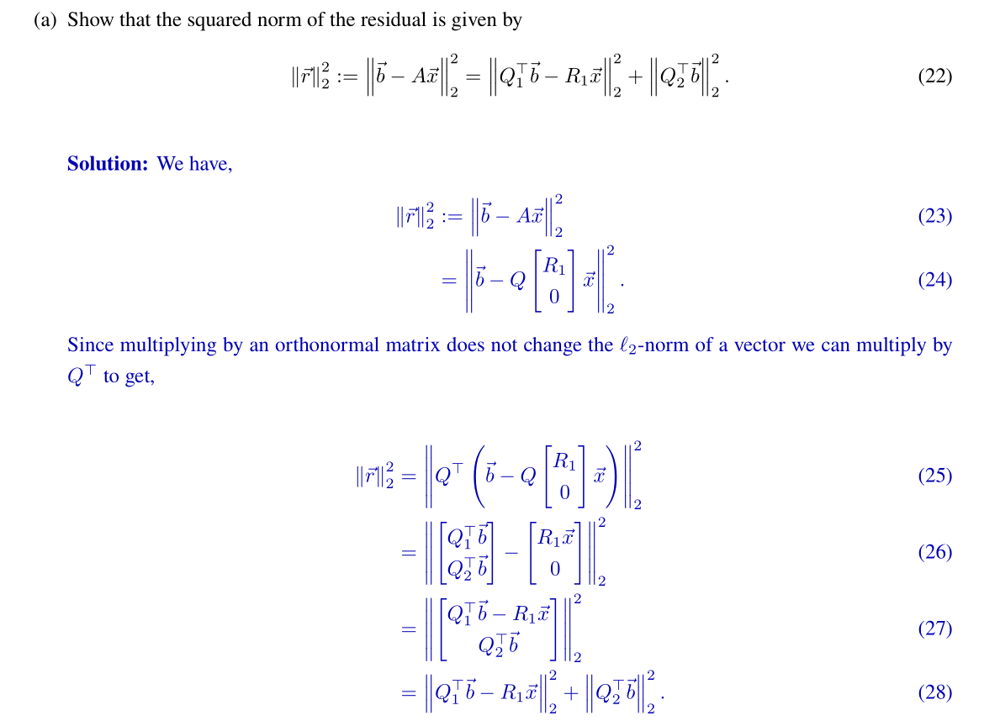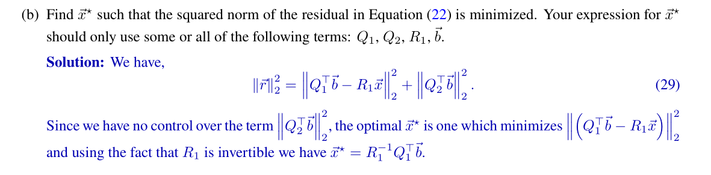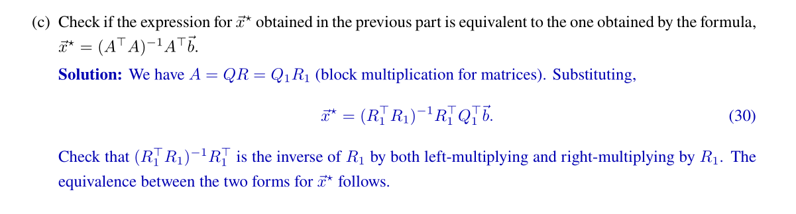


### Solving Example
> 对于$A\vec{x}=\vec{b}$的问题来说，如果$A_{m\times n}$是列满秩的(即$m\geq n$)，则我们可以使用最小二乘法公式$\vec{x}=(A^{\top}A)^{-1}A^{\top}\vec{b}$。但是求$A^{\top}A$的逆需要花费很多时间，所以我们考虑先对$A$使用$QR$分解，得到$A_{m\times n}=Q_{m\times n}R_{n\times n}$, 其中$Q$是`Matrix with orthonormal columns`满足$Q^{\top}Q=I$, $R$是一个可逆的上三角矩阵。
> 于是$A\vec{x}=\vec{b}$可以化为$QR\vec{x}=\vec{b}$, 两边同时乘以$Q^{\top}$得到$R\vec{x}=Q^{\top}\vec{b}$, 而对一个上三角矩阵求逆会容易很多，于是$\vec{x}=R^{-1}Q^{\top}\vec{b}$。
> 假设$A=\left[\begin{array}{ccc}0.6 & 0 & 0.8 \\0.8 & 0 & -0.6 \\0 & 1 & 0\end{array}\right]$, $\vec{b}=\begin{bmatrix} 8\\-6\\3\end{bmatrix}$, 我们要求解$A\vec{x}=\vec{b}$, 则:
> 1. 对$A$进行$QR$分解得到: $A=\left[\begin{array}{ccc}0.6 & 0 & 0.8 \\0.8 & 0 & -0.6 \\0 & 1 & 0\end{array}\right]\left[\begin{array}{ccc}5 & -5 & -5 \\0 & 3 & 3 \\0 & 0 & 5\end{array}\right]$
> 2. 求出$Q^{\top}\vec{b}=\begin{bmatrix} 0\\3\\10\end{bmatrix}$
> 3. 求解$R\vec{x}=Q^{\top}\vec{b}$: 
> 
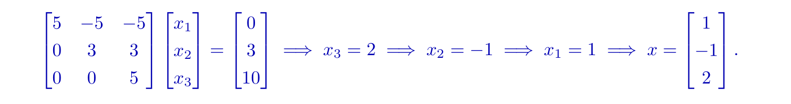


### Time Complexity Analysis
> **假设**`Adding, multiplying, dividing scalars`**花费单位时间**$O(1)$**，则:**
> 1. $\vec{a}^{\top}\vec{b}=\sum_{i=1}^n a_ib_i$花费$O(n)$的时间，因为其包含了$n$次`Scalar Multiplication/Addition`。
> 2. $A\vec{x}$花费$O(n^2)$的时间，因为$A\vec{x}$可以看成是$n$次`Inner product`的时间之和。
> 3. $A^{-1}$（求$A$的逆）花费$O(n^3)$的时间。
> 
所以如果我们在求解$A\vec{x}=\vec{b}$的时候直接通过求$A$的逆来计算的话，则需要花费$O(n^3)+O(n^2)+O(n)=O(n^3)$的时间
> **而如果我们使用**$QR$**分解的方法，则:**
> 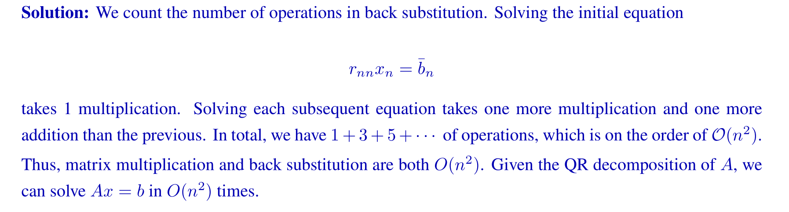


## Matrix Least Square
> 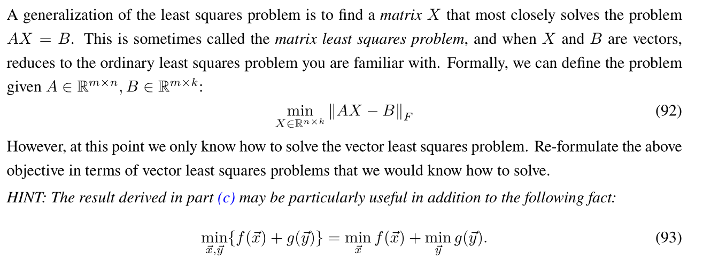

**Solution**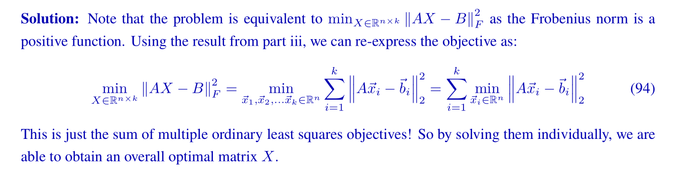


# Interpretation of LS Problem
## Approximate Solution of Linear Equations
> 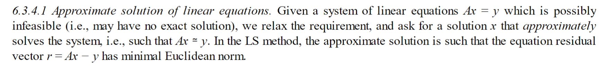


## Projection onto R(A)
> 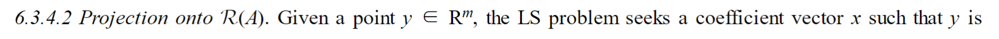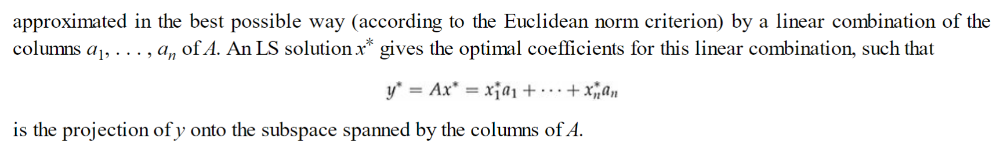


## Linear Regression 
> 


## Minimal Perturbation to Feasibility
> 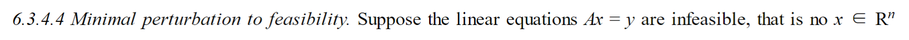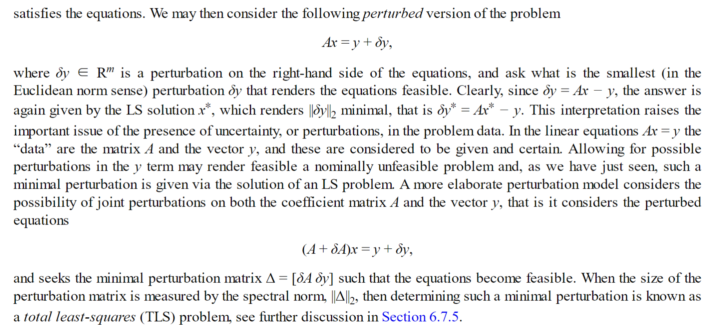


## Best Linear Unbiased Estimator
> 


# Sensitivity Analysis
## Basic Concepts
### Pertubation
> [!def]
> 对于`Square and Nonsingular Matrix`$A\in \mathbb{R}^{n\times n}$来说，我们想要探究$A\vec{x}=\vec{y}$在`Input`$\vec{y}$发生微小变化时，`Output`$\vec{x}$的变化情况如何，即当$\vec{y}\to \vec{y}+\vec{\delta_y}$时，导致的$\vec{x}\to \vec{x}+\vec{\delta_x}$中$\|\delta \vec{x}\|_2$相比于$\|\vec{x}\|_2$有多大, 即我们想要探究$\frac{\|\vec{\delta_x}\|_2}{\|\vec{x}\|_2}$的值有多大，同时我们希望这个值尽可能的小，这表明我们的解会比较稳定。
> 因为$A(\vec{x}+\vec{\delta_x} )=\vec{y}+\vec{\delta_y}$, 且$A\vec{x}=\vec{y}$, 所以$A\vec{\delta_x}=\vec{\delta_y}$, 所以$\vec{\delta_x}=A^{-1}\vec{\delta_y}$，即$\|\vec{\delta_x}\|_2=\|A^{-1}\vec{\delta_y}\|_2\leq \|A^{-1}\|_2\|\vec{\delta}_y\|_2$(**By defintion of Spectral Norm**)
> 因为$A\vec{x}=\vec{y}$, 所以$\|\vec{y}\|_2=\|A\vec{x}\|_2\leq \|A\|_2\|\vec{x}\|_2$, 所以$\|\vec{x}\|_2\geq \frac{\|y\|_2}{\|A\|_2}$, 所以$\frac{\|\vec{\delta_x}\|_2}{\|\vec{x}\|_2}\leq \frac{ \|A^{-1}\|_2\|A\|_2\|\vec{\delta}_y\|_2}{\|\vec{y}\|_2}=  (\|A^{-1}\|_2\|A\|_2)(\frac{\|\vec{\delta}_y\|_2}{\|\vec{y}\|_2})$


### Condition Number
> [!def]
> 对于这个`Upper Bound`$\frac{\|\vec{\delta_x}\|_2}{\|\vec{x}\|_2}\leq \frac{ \|A^{-1}\|_2\|A\|_2\|\vec{\delta}_y\|_2}{\|\vec{y}\|_2}=  (\|A^{-1}\|_2\|A\|_2)(\frac{\|\vec{\delta}_y\|_2}{\|\vec{y}\|_2})$来说，$\|A^{-1}\|_2\|A\|_2$被称为`Condition Number`。
> $\kappa(A)=\left\|A^{-1}\right\|_2\|A\|_2, 1 \leq \kappa(A) \leq \infty$
> 我们知道$\|A\|_2=\sigma_{max}(A)$, $\|A^{-1}\|=\frac{1}{\sigma_{min}}$, 于是$\kappa(A)=\frac{\sigma_{max}(A)}{\sigma_{min}(A)}$
> 如果$A$是不可逆的，则$\kappa(A) = \infty$，此时$A$`is close to being numerically singular/ ill conditioned`，总结一下:


## Sensitivity to Input y
> [!def]
> 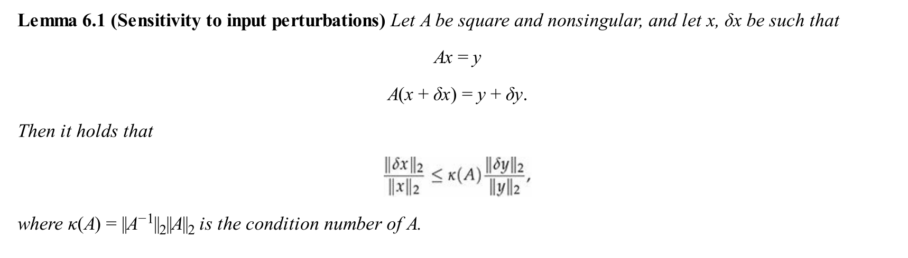
> 换句话说就是改变$\vec{y}$ 的情况下看看$\vec{x}$ 的变化情况。


## Sensativity to Coefficient Matrix 
### Definition
> [!def]
> 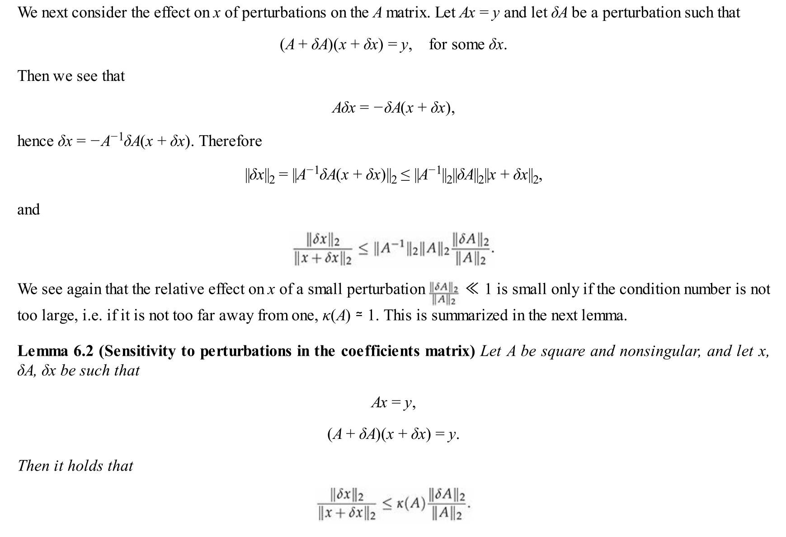
> 换句话说就是在改变$A$之后看看$\vec{x}$的变化请跨。
> 注意到这里我们给了$\frac{\|\delta x\|_2}{\|x+\delta x\|_2}$一个上界，这和之前的$\frac{\|\delta x\|_2}{\|x\|_2}$不太一样。但是这两个值都是用于描述$\delta x$相对于原来$x$的变化量的大小。那么哪一个更好呢?
> 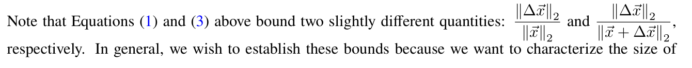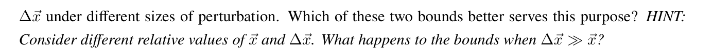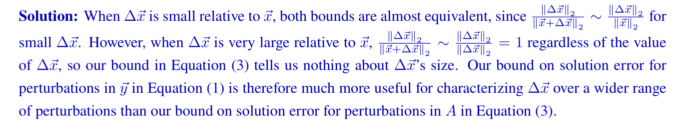

### Proof
> [!proof]
> 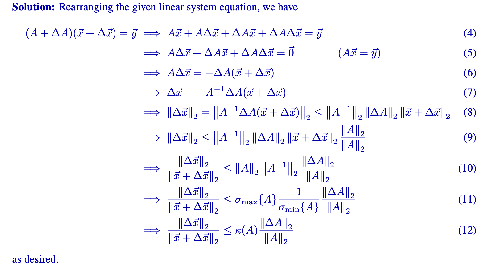


## Sensitivity to Joint A,y
> [!def]
> 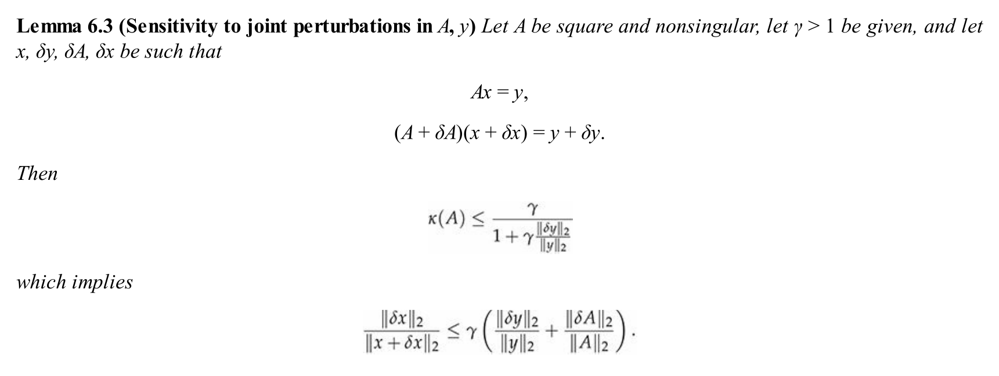
> 本质上就是在同时改变$A$和$\vec{y}$的情况下看看$\vec{x}$的变化量。

> [!proof]
> **Proof**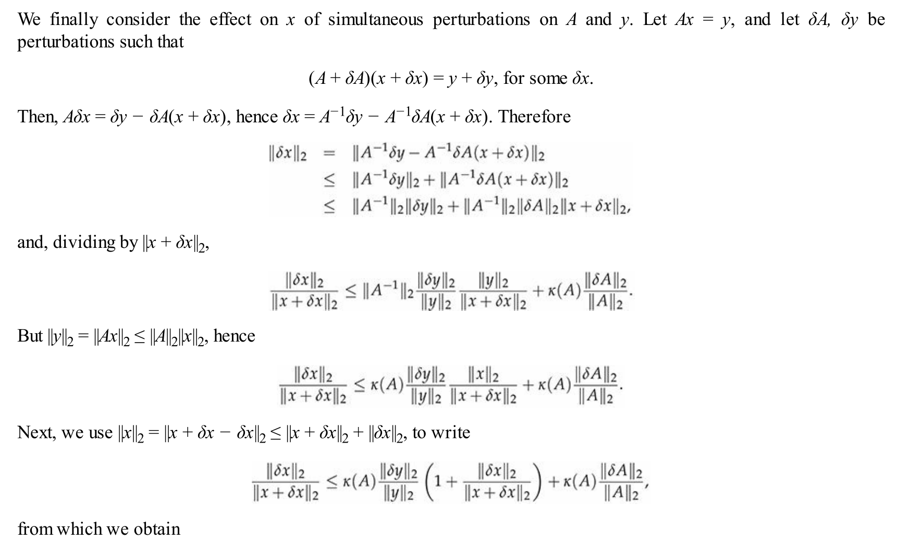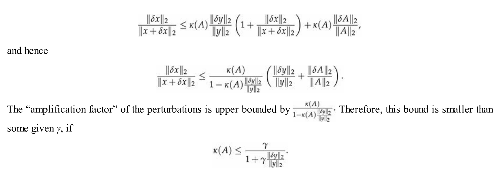


## Sensitivity to LS Solution
> [!thm]
> 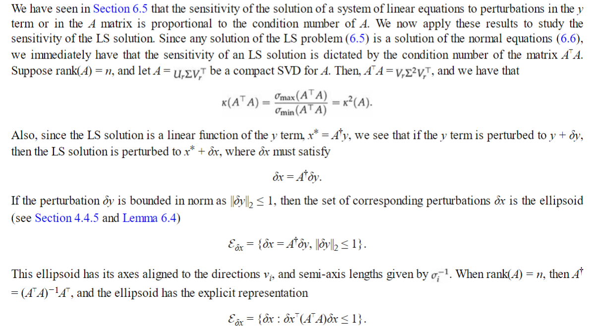


## Sensitivity of the L2-regularized Solution
> [!important]
> 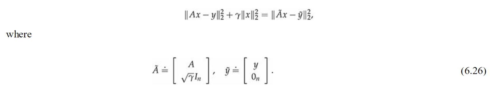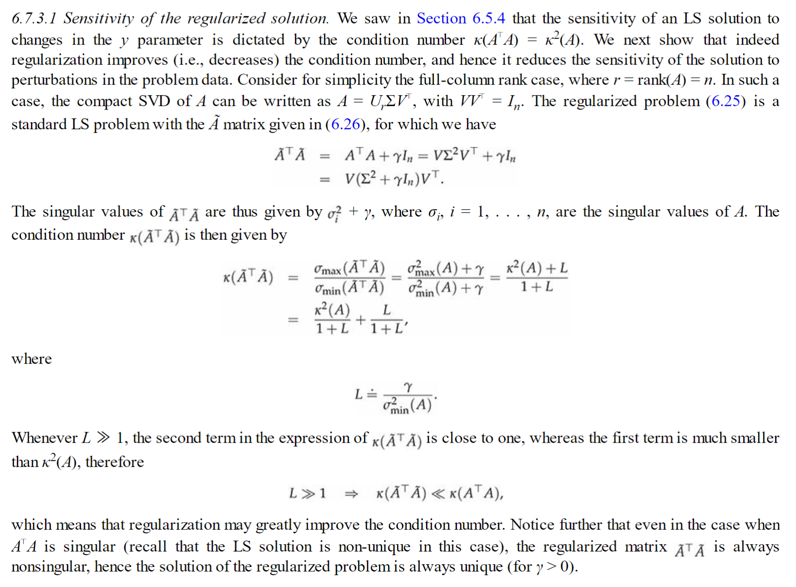


# Variant of Least Square
## Weighted Least Square
> [!important]
> 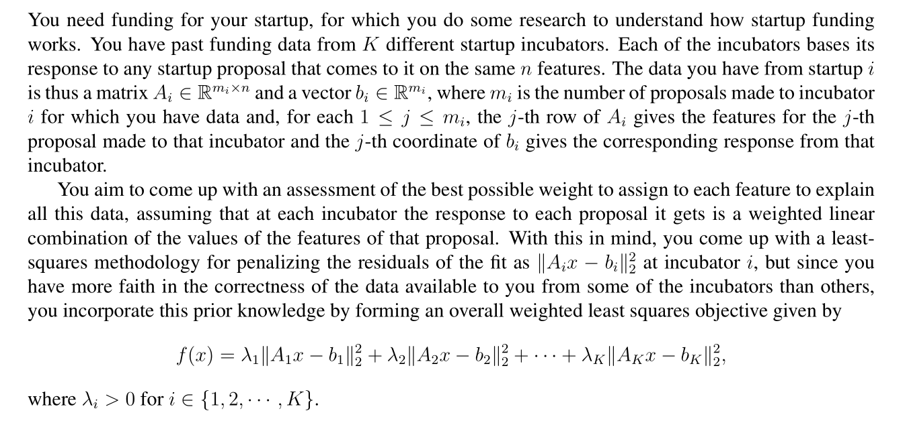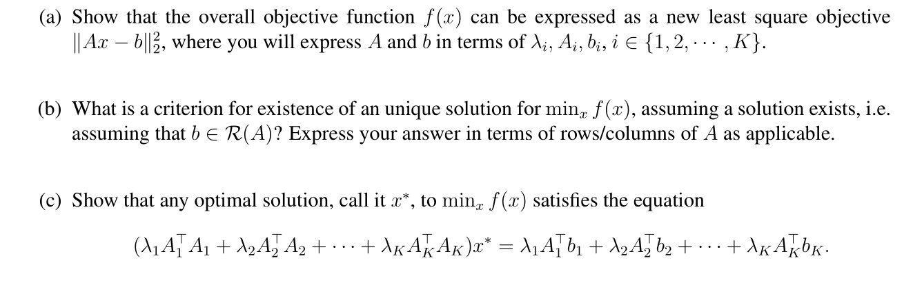

> [!solution]
> **(a)** 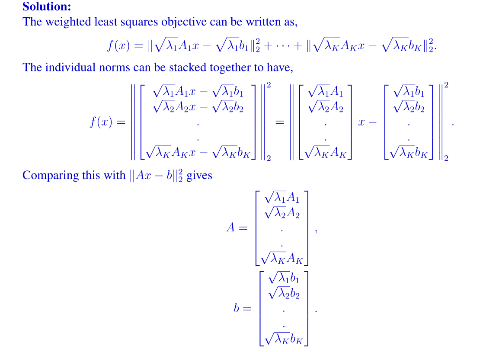
**(b)**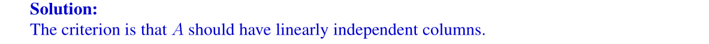
**(c)**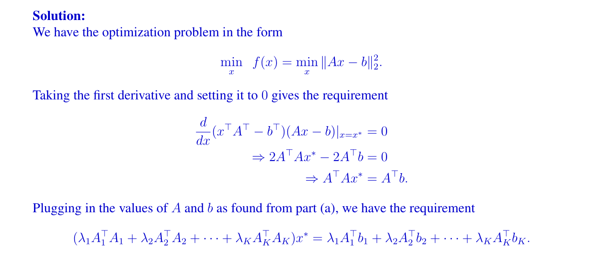


## MLE -> Weight Least Square
> [!important]
> Suppose we have data points $\{(\vec{x}_1,y_1),(\vec{x}_2,y_2),\cdots, (\vec{x}_n,y_n)\}$and assume our linear model is parametrized by $\vec{w}$ where $y_i=\vec{x}_i^{\top}\vec{w}+Z_i$and $Z_i\sim N(0,\sigma_i^2)$, and $Z_i$'s are i.i.d.
> Then we use MLE to estimate the parameter $\vec{w}$。
> We first compute the likelihood function as follows:
> $\begin{aligned}\mathcal{L}(\vec{w_0})&=\prod_{i=1}^nP(Y_i=y_i|\vec{w}=\vec{w}_0) \\&=\prod_{i=1}^nP(Z_i=Y_i-\vec{X}_i\vec{w}_0|\vec{w}=\vec{w_0})\\&=\prod_{i=1}^n \frac{1}{\sqrt{2\pi}\sigma_i}e^{-\frac{(y_i-\vec{x}_i^{\top}\vec{w_0})^2}{2\sigma_i^2}}\end{aligned}$
> The log-likelihood function is:
> $\begin{aligned}log\mathcal{L}(\vec{w_0})&=log\prod_{i=1}^n \frac{1}{\sqrt{2\pi}\sigma_i}e^{-\frac{(y_i-\vec{x}_i^{\top}\vec{w_0})^2}{2\sigma_i^2}}\\&=-C\sum_{i=1}^n\frac{(y_i-\vec{x}_i^{\top}\vec{w}_0)^2}{2\sigma_i^2}\end{aligned}$
> So the MLE is:
> $\begin{align}argmax_{\vec{w}_0}log\mathcal{L}(\vec{w}_0)&=argmin_{\vec{w_0}}\sum_{i=1}^n(\frac{y_i-\vec{x}_i^{\top}\vec{w}_0}{2\sigma_i})^2\\&=argmin_{\vec{w}_0}\|S(X\vec{w_0}-\vec{y})\|_2^2\end{align}$, 其中$$S=\begin{bmatrix} \frac{1}{\sqrt{2}\sigma_1}&0&\cdots&0\\0&\frac{1}{\sqrt{2}\sigma_2}&\cdots&0\\\vdots&0&\ddots&\vdots\\0&0&\cdots&\frac{1}{\sqrt{2}\sigma_n}\end{bmatrix}$$这就是一个`Least Square Problem`。
> 总结一下: 在我们的假设下:
> - `Error` 是 indepednent的，且服从高斯分布。
> - 模型是线性的。
> `MLE` 问题可以化简成一个`Least Square Problem`。对于一些其他的分布，不能保证化简成一个`Least Square Problem`。


## L2-Regularization
### Three Arithmetic Perspectives
> [!important]
> 1.**Polynomial Fitting**
> - 假设我们的模型是$y_i=a_dx_i^d+a_{d-1}x_i^{d-1}+\cdots+a_1x_i+a_0$, 系数是$\vec{a}$。假设数据集是$\{(x_1,y_1),(x_2,y_2),\cdots, (x_n,y_n)\}$, 则我们可以构造系数矩阵:$\begin{bmatrix} 1&x_0&x_0^2&\cdots&x_0^d\\1&x_1&x_1^2&\cdots&x_1^d\\\vdots&\vdots&\vdots&\vdots&\vdots\\1&x_n&x_n^2&\cdots&x_n^d\end{bmatrix}\begin{bmatrix}a_0\\a_1\\\vdots\\a_d\end{bmatrix}=\begin{bmatrix}y_1\\y_2\\\vdots\\y_n\end{bmatrix}$即$A\vec{a}=\vec{y}$。我们求解$A^{\top}A\vec{a}=A^{\top}\vec{y}$。假设我们的数据点的范围为$x_i\in[0,2]$, 我们进行一次`Polynomial Fit`和如果我们的数据点范围为$x_i\in [200,202]$我们进行一次`Polynomial Fit`的系数结果的变化取决于$A^{\top}A$的`Conditional Number`。如果$A^{\top}A$的`Conditional Number`过大的话，$\Delta A^{\top}A$会导致$\Delta \vec{a}$的巨大变化，解决的方法是`Ridge L2 Regularization`。将$A^{\top}A$替换成$A^{\top}A+\lambda I$, 使得$\sigma_{min}(A^{\top}A)+1$不会太小, 从而使得$\kappa(A^{\top}A)$的值变小很多，比如从$\frac{10}{0.2}=200$变成$\frac{11}{1.2}<10$。于是我们可以通过调参$\lambda$来取得一个最优的模型。
> 2. **Optimization Perspective:**
> 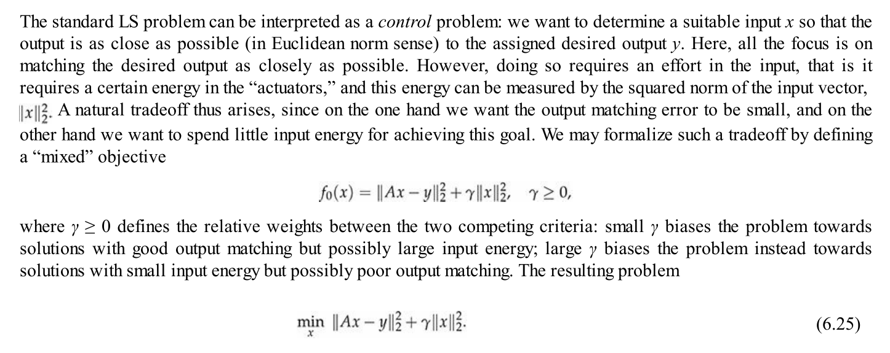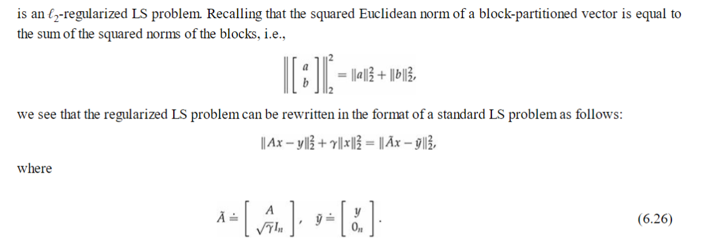
> Taking the gradient we get $\vec{x}^*=(A^{\top}A+\gamma I)^{-1}A^{\top}\vec{y}$。
> 3. **Ghost Data Perspective:**
> 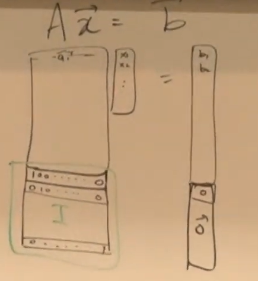
> 下面多余的行旨在帮助我们约束$\vec{x}$的系数不让其过大。
> 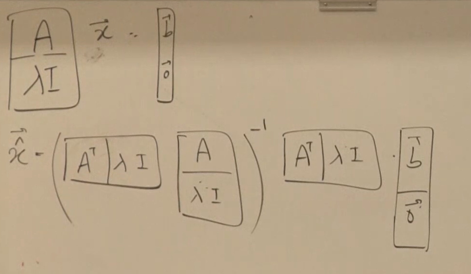


### Block Ridge Regression
> [!important]
> 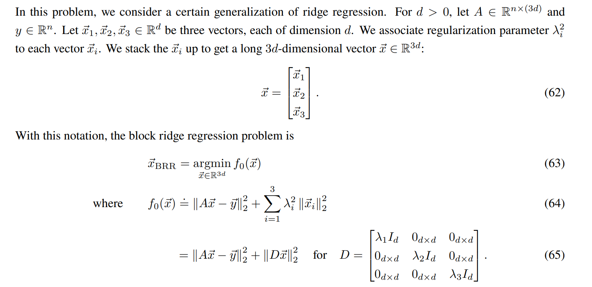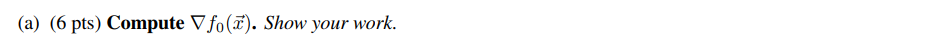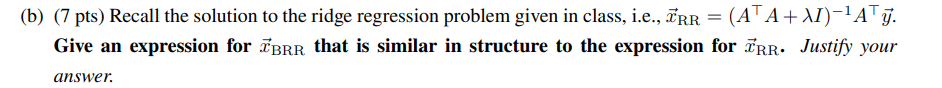

> [!proof]
> 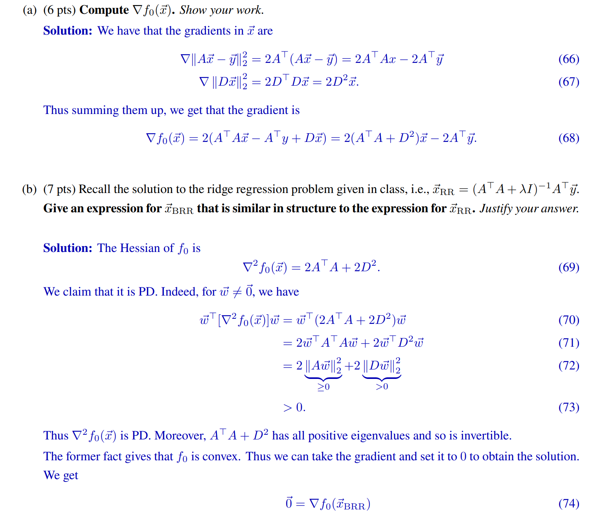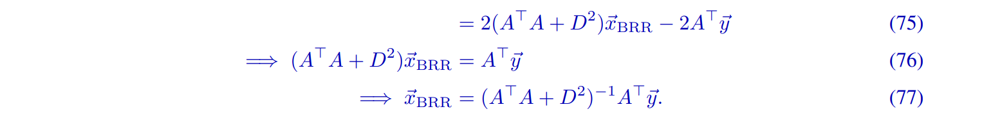


### MAP -> Ridge Regression
> [!important]
> Suppose we have data points $\{(\vec{x}_1,y_1),(\vec{x}_2,y_2),\cdots, (\vec{x}_n,y_n)\}$and assume our linear model is parametrized by $\vec{w}$ where $y_i=\vec{x}_i^{\top}\vec{w}+Z_i$and $Z_i\sim N(0,\sigma_i^2)$, and $Z_i$'s are i.i.d.
> 假设现在我们对我们的模型参数$\vec{w}$有一个先验的猜想，即$w_{i}\sim\mathcal{N}(\mu_i,\rho_i^2)$, 或者$\vec{w}\sim \mathcal{N}(\vec{u},\Sigma_\vec{w})$, 其中$$\Sigma_{\vec{w}}=\begin{bmatrix} \rho_1^2&0&\cdots&0\\0&\rho_2^2&\cdots&0\\\vdots&0&\ddots&\vdots\\0&0&\cdots&\rho_n^2\end{bmatrix}$$
> 则我们可以使用后验概率最大化来估计我们的模型参数, 即`The most likely`$\vec{w}$, given data $y_1,y_{2.\cdots,}y_n$。
> $\begin{align}argmax_{\vec{w}}f(\vec{w}|\vec{Y}=\vec{y})&=argmax_{\vec{w}}\frac{f(\vec{Y}=\vec{y}|\vec{w})\cdot f(\vec{w})}{f(\vec{y})}\\&=argmax_{\vec{w}}f(\vec{Y}=\vec{y}|\vec{w})\cdot f(\vec{w})\\&=argmax_{\vec{w}}\prod_{i=1}^n\frac{exp\{-\frac{(y_i-\vec{x}_i^{\top}\vec{w})^2}{2\sigma_i^2}\}}{\sqrt{2\pi}\cdot \sigma_{i}}\times\frac{exp\{-(\vec{w}-\vec{\mu})^{\top}\Sigma_{\vec{w}}^{-1}(\vec{w}-\vec{\mu})\}}{(\sqrt{2\pi})^{n}|\Sigma_{\vec{w}}|}\\&=argmax_{\vec{w}}C\cdot exp\{\sum_{i=1}^n-\frac{(y_i-\vec{x}_i^{\top}\vec{w})}{2\sigma_i^2}-(\vec{w}-\vec{\mu})^{\top}\Sigma_{\vec{w}}^{-1}(\vec{w}-\vec{\mu})\}\\&=argmin_{\vec{w}}\sum_{i=1}^n\frac{(y_i-\vec{x}_i^{\top}\vec{w})}{2\sigma_i^2}+(\vec{w}-\vec{\mu})^{\top}\Sigma_{\vec{w}}^{-1}(\vec{w}-\vec{\mu})\\&=argmin_{\vec{w}}\|S(X\vec{w}-\vec{y})\|_2^2+\|\sqrt{\Sigma_{\vec{w}}^{-1}}(\vec{w}-\vec{\mu})\|_2^2\end{align}$。
>
> 其中：$S=\begin{bmatrix} \frac{1}{\sqrt{2}\sigma_1}&0&\cdots&0\\0&\frac{1}{\sqrt{2}\sigma_2}&\cdots&0\\\vdots&0&\ddots&\vdots\\0&0&\cdots&\frac{1}{\sqrt{2}\sigma_n}\end{bmatrix}$， $\Sigma_{\vec{w}}=\begin{bmatrix} \rho_1^2&0&\cdots&0\\0&\rho_2^2&\cdots&0\\\vdots&0&\ddots&\vdots\\0&0&\cdots&\rho_n^2\end{bmatrix}$


### Ridge Regression on Bounded Input
> EECS127 Sp23 Homework 5 P2

> [!example] Example
> 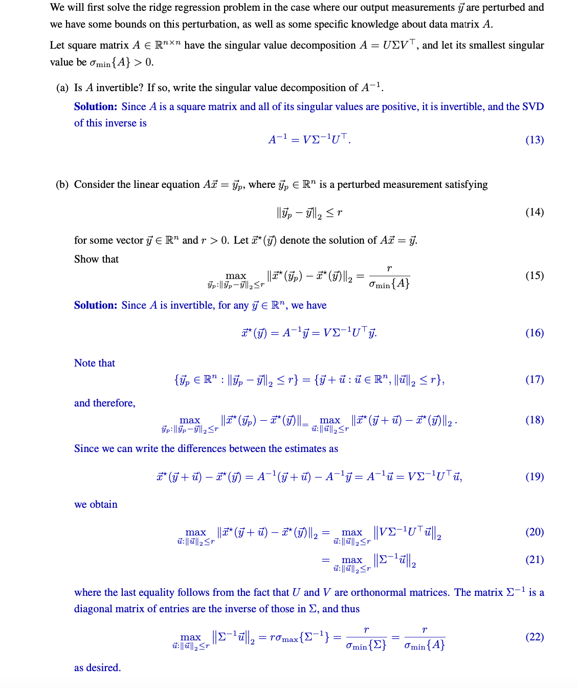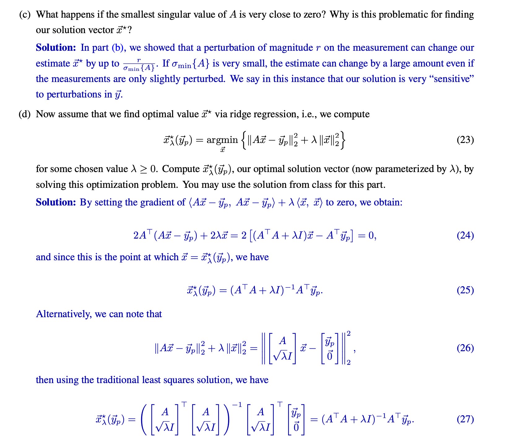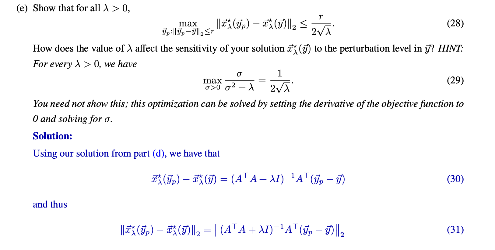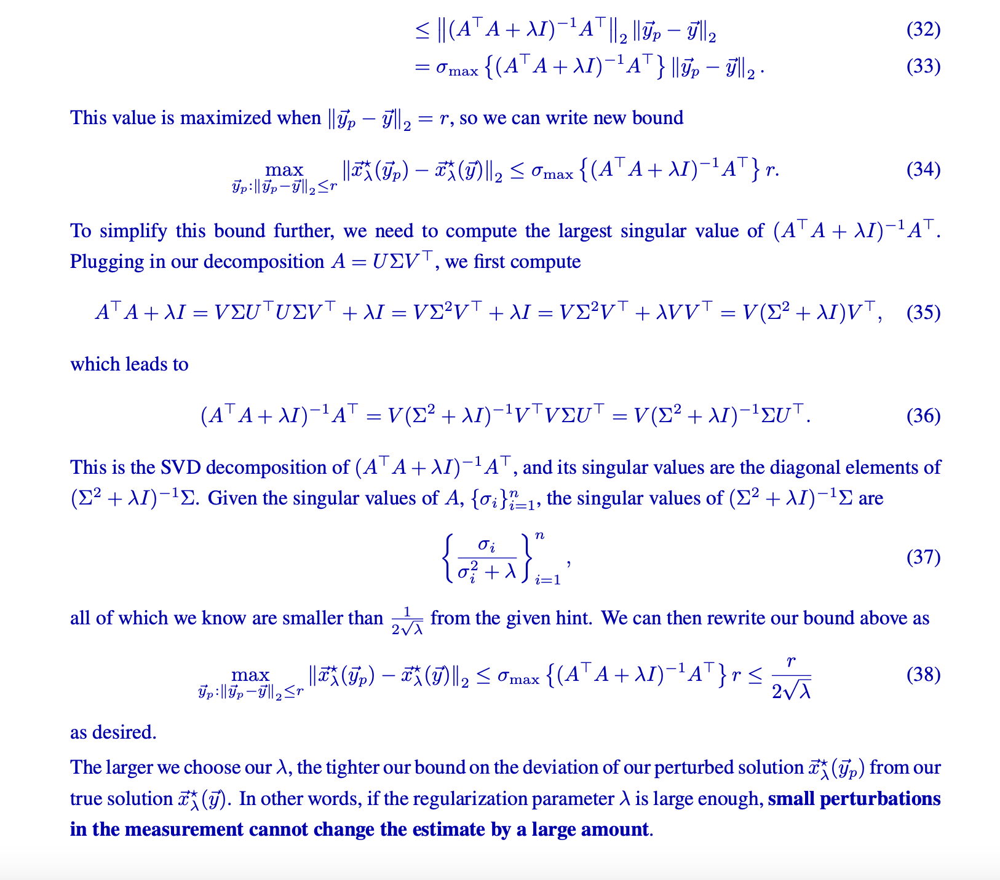


### Ridge Regression for Data Matrix Noise
> [!example]
> 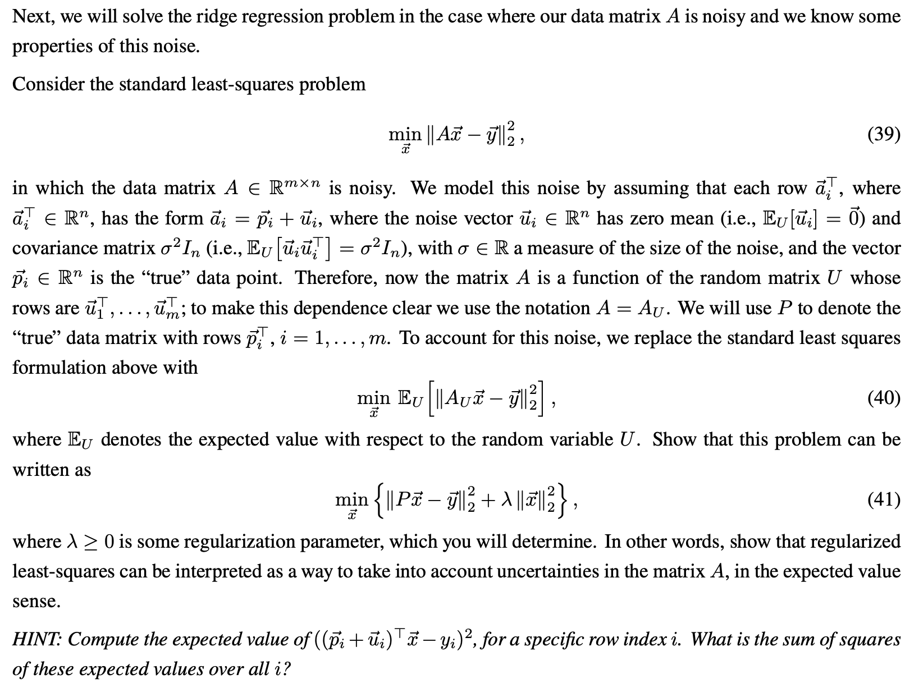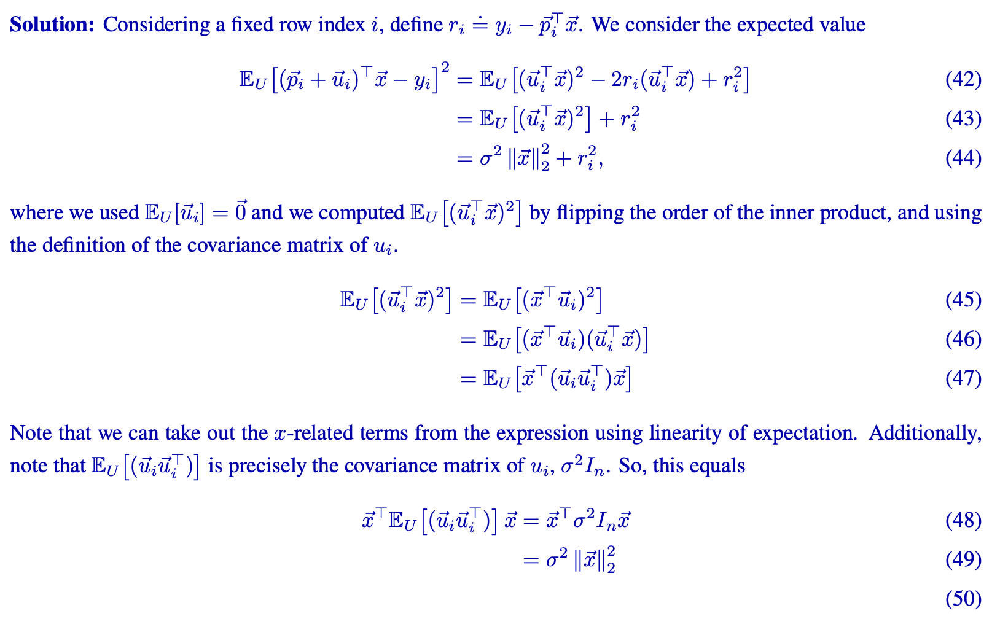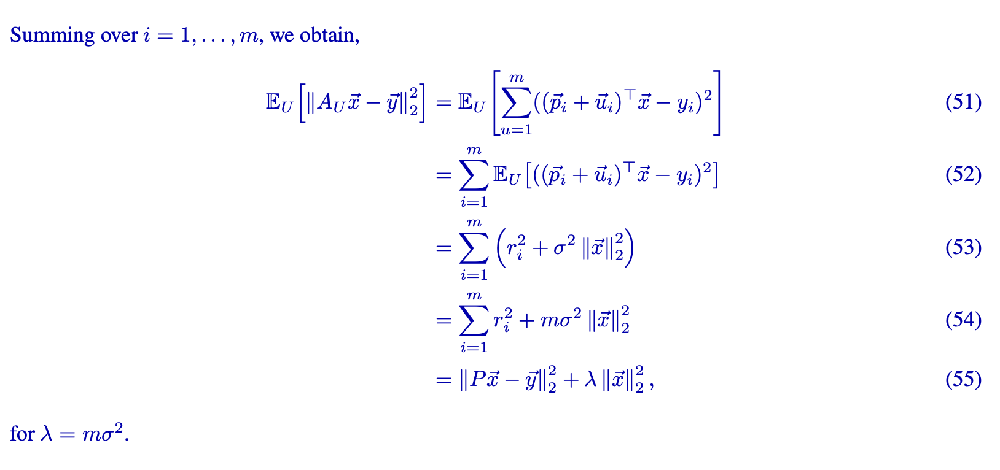


## Tikhonov Regularization
> [!def]
> 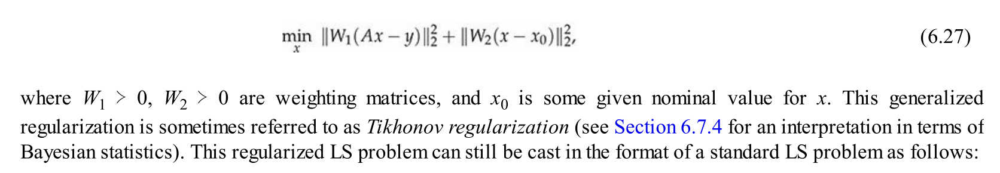
> Remarks:
> - 上面推导的`Ridge Regression`$\min _x\|A x-y\|_2^2+\gamma\|x\|_2^2$ 属于`Tikhonov Regularization`, 其中$W_1=I_m, W_2=\sqrt{\gamma} I_n, x_0=0_n$


## Total Least Square
> https://people.duke.edu/~hpgavin/SystemID/CourseNotes/TotalLeastSquares.pdf
### Problem Statement
> [!important]
> 


### Theorem
> [!thm]
> 

#### Proof from textbook
> [!proof]
> 

#### Proof from Duke
> https://people.duke.edu/~hpgavin/SystemID/CourseNotes/TotalLeastSquares.pdf

> [!proof]
> 


# Regression Techniques Comparison
> [!motiv]
> EECS127 Fa23 disc05
> 
> 重要假设：假设我们的数据矩阵$[A,y]$已经做过中心化处理，即如果我们将$A， y$的各行求和取平均会得到，我们的模型一定过原点的条件，也就是说我们的模型不带有偏置项，即用 $A\vec{w}$ 就可以表示。


## Linear Regression
### Model
> [!example]
> 现在假设$A=\begin{bmatrix} -1\\-1\\2\end{bmatrix},y=\begin{bmatrix} -1\\0\\1\end{bmatrix}$, 我们可以很轻松地得到$\vec{w}=w_0=(A^{\top}A)^{-1}A^{\top}\vec{b}=1.5$。现在如果我们把$x,y$轴的元素调转位置，即$A=\begin{bmatrix} -1\\0\\1\end{bmatrix},y=\begin{bmatrix} -1\\-1\\2\end{bmatrix}$, 我们会得到$\vec{w}=w_0=0.5$, 画图得到：
> 
```python
import numpy as np
import matplotlib.pyplot as plt

def LR(A, b):  # (n, d), (n, 1)
    return np.linalg.lstsq(A, b)[0]  # (d, 1)
```


## Orthogonal Distance Regression
### Motivation
> [!motiv] Motivation
> 上面的例子中，我们发现，如果我们将输入输出进行调换，得到的回归模型就会不一致，但是如果我们希望模型在数据调转前后不受影响，则我们可以使用`ODR`:
> 


### Maxiumum Eigenvalue  Formulation
> [!proof]
> 


### Switching the Coordinates
> [!important]
> 

```python
def ODR(A, b):  # (n, d), (n, 1)
    Z = np.block([A, b])  # (n, d + 1)
    U, S, Vh = np.linalg.svd(Z)  # (n, n), (min(n, d + 1), ), (d + 1, d + 1)
    return Vh[0].reshape(-1, 1)  # (d + 1, 1)
```
> [!solution]
> 


### Implication
> [!important]
> 


## Total Least Square
### Motivation
> [!motiv] Motivation
> 


### Solving This System
> [!important]
> 
```python
def TLS(A, b): # (n, d), (n, 1)
    Z = np.block([A, b])  # (n, d + 1)
    U, S, Vh = np.linalg.svd(Z)  # (n, n), (min(n, d + 1), ), (d + 1, d + 1)
    Ay_tilde = U.T[0].reshape(-1,1) @ np.array(S[0]).reshape(1,1) @ Vh[0].reshape(1,-1) # (n, d+1)
    print("A tilde: {}".format(Ay_tilde[:,0]))
    print("y tilde: {}".format(Ay_tilde[:,1]))
    print("x: {}".format(Vh[1][0] / (Vh[1][1] / -1)))
    return np.array(Vh[1][0] / (Vh[1][1] / -1)).reshape(1,1) 
```
> [!solution]
> 


