# Convexity of Functions
## Miscellaneous Definitions
### Definition 1: Inequality
> [!def] Definition1 : Jensen's Inequality
> 

### Definition 2: Restricted to a line
> [!def]
   
> 
> 这个情况说的是，如果一个函数$g(t)$定义为$f$沿着$\forall \vec{v}$的方向的取值，且$g$为凸函数，则$f$为凸函数。几何上来说，如果$f$以$\vec{x}$为起点，如果其向着任意方向定义的函数$g(t)$都是凸函数的话，则$f$为凸函数。
> 

### Defintion 3: First Order Condition
> [!def] First Order Condition
> 
> 在$\mathbb{R}^3$定义域中，这个条件可以想象成函数的图像总是在其定义域中的任意一点的切平面之上。
> **Implications: If **$\nabla f(\vec{x}_*)=0$** and  **$f$**  is convex and differentiable, then **$\vec{x}_*$**  is a global minimum.**
> **Proof:** Since $f$ is convex, then $\forall \vec{y}\in dom(f)$, we have $f(\vec{y})\geq f(\vec{x}_*)+0$, which directly implies that $\vec{x}_*$is the global minimum.

> [!proof]
> 

### Defintion 4: Second Order Condition
> [!def] Second Order Condition
> 

> [!example] Examples
> 

## Extended Value Extensions
### Definition
> [!def]
> 
> 
> 这样的定义方法保证了，如果$f$ 是凸函数，则$\tilde{f}$ 也是凸函数，而且是扩展了定义域之后的凸函数。
> 读者可能会想，为什么我们要在$x\notin dom(f)$的时候取正无穷，本质上是因为如果不取正无穷，$\tilde{f}$ 就不一定能保持凸性了。
> 对于$f$ 是concave的情况，我们一般定义$-\infty$。

> [!important]
> 
> 设想一下，如果我们定义$\tilde{f}(x)=\begin{cases} f(x)& x\in dom(f)\\300&x\notin dom(f)\end{cases}$,  我们很容易找到一个反例使得$f(\theta x+(1-\theta)y)> \theta f(x)+(1-\theta)f(y)$。所以当$x\in dom(f)$时，我们要尽可能取大一点的数，或者说是很大的数，那么正无穷就是首选，因为正无穷加上任何数都还是正无穷。

### Indicator Function 
> [!def]
> 

## Sub/Super-Level Set
> [!def] Definition
> 
> **总结一下:**
> 1. A convex function's sublevel set is convex, and the converse is not true.
> 2. A concave function's superlevel set is convex, and the converse is not true.
> 
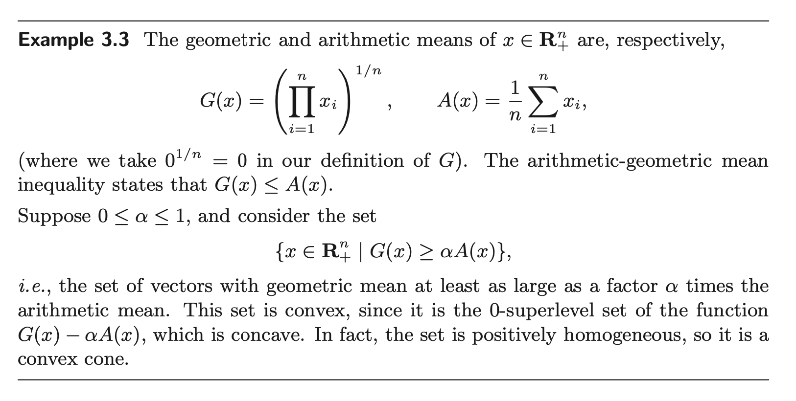

> [!proof]
> 

## Epi/Hypo-graph of Functions
> [!def]
> 
> 证明一个函数是否是凸函数的一个重要的方法是证明其`Epigraph`is convex set. 这个性质使得我们能可以在`Convex Function`和`Convex Set`之间互相转化。
> **总的来说:**
> 1. `Convex Function <=> Epigraph is Convex Set`.
> 2. `Concave Function <=>  Hypograph is Convex Set`.

> [!example] Matrix Fractional Function
> 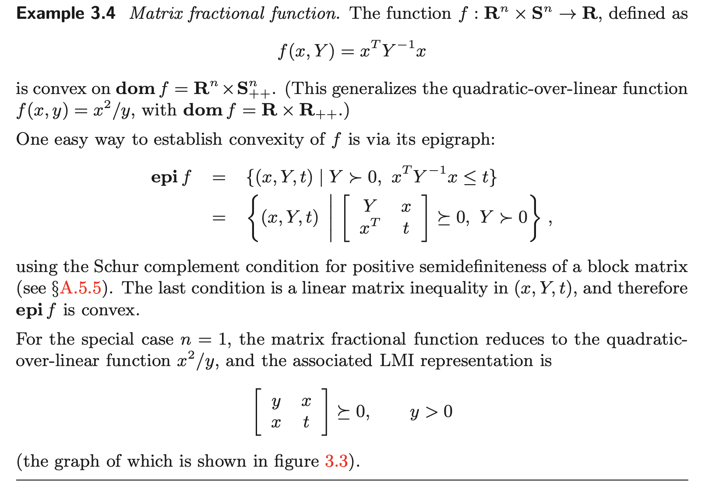

## Some common convex functions
### Quadratic Functions
> [!important] 
> 
> 二次函数是为数不多的，$\nabla^{2}f(\vec{x})\succ0\iff f~is~stritly~convex$ 的例子。

### Functions on R
> [!example] Examples
> 
> 1. **Exponential: **$(e^{ax})''=a^2e^{ax}\geq 0,\forall x\in dom(f)$
> 2. **Powers:** $(x^a)''=a(a-1)x^{a-2}$, 于是当$a(a-1)\leq 0$时，$(x^a)''\leq 0$-> Concave，否则$(x^a)''\geq 0$-> Convex
> 3. **Powers of absolute value:** 
>    1. 首先注意到，如果$p<0$, 则 $dom(f)$ 不是凸集，当$p=1$时，函数不可微，但是可以使用`Definition 1/2`判断其凸性。当$p=0$时，函数是常值函数，此时函数既是凸函数又是凹函数。当$0<p<1$时，函数既不是凸函数又不是凹函数。
>    2. 当$p\geq 2$时，函数处处二阶可微，所以我们可以用二阶条件判断凸性。
> 	   1. $\forall x>0, (|x|^p)''=p(p-1)x^{p-2}$, when $p> 1$, we have $p(p-1)x^{p-2}\geq 0$
> 	   2. $\forall x<0$, $(|x|^p)''=((-x)^p)^{''}=p(p-1)(-x)^{p-2}$, which is the same as above.
> 	   3. The $x=0$ case is just trivial, since the second derivative is 0.
> 	3. 当$1< p< 2$时，函数在`0`处不是二阶可微的，所以我们只能用一阶条件判断凸性: 我们有$f'(x)=sign(x)|x|^{p-1}$, 这是严格单调递增的，所以$f$是凸函数。
> 
> 4. **Logarithm:** $(logx)''=-\frac{1}{x^2}<0,\forall x\in dom(f)$
> 5. **Negative Entropy:** $(xlogx)''=\frac{1}{x}>0,\forall x\in \mathbb{R}_{+}$or $\forall x\in \mathbb{R}_{++}$

### Functions on R^n
> [!example] Examples
> 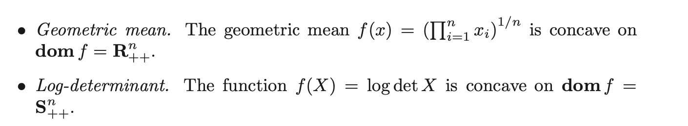
> 1. **Norm:** $\|\theta x+(1-\theta)y\|_p\leq \theta \|x\|_p+(1-\theta) \|y\|_p$ by triangle inequality and homogenity. 这里$p>0$，因为当$p=0$时$\|x\|_0$表示零范数，而零范数不是范数，因为不满足`homogenity`。
> 2. **Max Function: **
>    1. **Prove by Definition:** $\theta \vec{x_i} + (1-\theta)\vec{y_i}\leq \theta \max(\vec{x})+(1-\theta)\max(\vec{y}),\forall i=1,2,\cdots, n$, 所以$\max(\theta \vec{x}+(1-\theta)\vec{y})\leq \theta \max(\vec{x})+(1-\theta)\max(\vec{y})$
>    2. **Prove by Epigragh:  Define **$f(\vec{x})=\max\{f_1(\vec{x}),f_2(\vec{x},\cdots, f_n(\vec{x}))\}$where **$f_i(\vec{x})=x_i$**, then:
> $\begin{aligned}epi(f)&=\{(\vec{x},t)~~|~~\vec{x}\in dom(f),f(\vec{x})\leq t\}\\&=\{(\vec{x},t)~~|~~\vec{x}\in \bigcap_{i=1}^n dom(f_i),f_1(\vec{x}),\cdots, f_n(\vec{x})\leq t\}\\&=\bigcap_{i=1}^n\{(\vec{x},t)~~|~~\vec{x}\in dom(f_i),f_i(\vec{x})\leq t\}\\&=\bigcap_{i=1}^n epi(f_i)\end{aligned}$, since $f_i(\vec{x})$'s are all affine functions, which are guaranteed to be convex, thus we have $epi(f_i)$'s are convex set, and that $epi(f)$is convex.
> 3. **Quadratic Over Linear Function:** 
> 
> The last inequality comes from a very important property of dyad matrix $\vec{u}\vec{v}^{\top}$where if $\vec{u}=\vec{v}$, we have $\vec{v}\vec{v}^{\top}$is convex.
> 4. **Log-Sum-Exp: **
> 	这个函数是一个解析函数，性质较好，同时解析函数就是无穷可导的函数。
> - 当$i\neq j$时，$\frac{\partial ^2f}{\partial x_ix_j}=\frac{-e^{x_i}e^{x_j}}{(e^{x_1}+e^{x_2}+\cdots+e^{x_n})^2}$
> - 当$i= j$时，$\frac{\partial ^2f}{\partial x_i^2}=\frac{-e^{x_i}e^{x_i}+e^{x_i}(e^{x_1}+\cdots+e^{x_n})}{(e^{x_1}+e^{x_2}+\cdots+e^{x_n})^2}$
> 
> 5. **Geometric Mean:**
> 
> 其中，$\begin{aligned}\frac{\partial^2 f(x)}{\partial x_k\partial x_l}&=\frac{1}{n}(\frac{1}{n}-1)(\prod_{i=1}^n x_i)^{\frac{1}{n}-2}(\prod_{j\neq k}x_j)(\prod_{i\neq k,l}x_i)+\frac{1}{n}(\prod_{i=1}^n x_i)^{\frac{1}{n}-1}(\prod_{i\neq k,l}x_i)\\&=\frac{(\prod_{i=1}^nx_i)^{\frac{1}{n}}}{n^2x_kx_l}\end{aligned}$
> 6. **Log-Determinant:**
> 
> **推导中使用到了几个重要的性质：**
> 	1. $det(ABC)=det(A)det(B)det(C)$
> 	2. If $Z\in \mathbf{S}_{++}$, then $Z^{-\frac{1}{2}}$exists.
> 	3. **Eigenshift Rules**: If the eigenvalues for $\mathbf{A}$ are $\sigma_i(\mathbf{A})$ then the eigenvalues for $\mathbf{A}+\lambda I$are $\sigma_i(\mathbf{A})+1$。

# Operations Preserving Convexity
## Affine Mapping
### Affine Function
> [!def]
> 对于$f:\mathbb{R}^n\to \mathbb{R}$来说，我们有$f(\vec{x})=A\vec{x}+\vec{b}$ is convex.
> Proof by ZOC:
> 首先$dom(f)=\mathbb{R}^n$, 这肯定是一个`Convex Set`，其次$\forall\vec{x},\vec{y}\in dom(f),\theta\in [0,1]$, 我们有$f(\theta\vec{x}+(1-\theta)\vec{y})=A(\theta\vec{x}+(1-\theta)\vec{y})=\theta (A\vec{x}+\vec{b})+(1-\theta)(A\vec{y}+\vec{b})=\theta f(\vec{x})+(1-\theta)f(\vec{y})$
> 所以$f$is convex.

### Affine Composition
> [!def]
> 
> **Proof:**
> If f is convex, then $\forall A\vec{x}+\vec{b},A\vec{y}+\vec{b}\in dom(f),\theta \in [0,1]$, we have:
> $\begin{aligned}f(\theta(A\vec{x}+\vec{b})+(1-\theta)f(A\vec{x}+\vec{b}))&\leq \theta f(A\vec{x}+\vec{b})+(1-\theta)f(A\vec{x}+\vec{b})\\f(A(\theta\vec{x}+(1-\theta )\vec{y})+\vec{b})&\leq \theta g(\vec{x})+(1-\theta)g(\vec{y})\\g(\theta\vec{x}+(1-\theta)\vec{y})&\leq \theta g(\vec{x})+(1-\theta)g(\vec{y})\end{aligned}$
> Moreover, since $f$is convex, then $dom(f)$is convex by definition, so $dom(g)$is convex by easy calculation，which together shows that $g$is convex.
> If g is convex, then $\forall \vec{x},\vec{y}\in dom(g),\theta\in [0,1]$, we have:
> $\begin{aligned}g(\theta\vec{x}+(1-\theta)\vec{y})&\leq \theta g(\vec{x})+(1-\theta)g(\vec{y})\\f(A(\theta \vec{x}+(1-\theta)\vec{y})+\vec{b})&\leq \theta f(A\vec{x}+\vec{b})+(1-\theta)f(A\vec{y}+\vec{b})\\f(\theta(A\vec{x}+\vec{b})+(1-\theta)(A\vec{y}+\vec{b}))&\leq\theta f(A\vec{x}+\vec{b})+(1-\theta)f(A\vec{y}+\vec{b})\end{aligned}$
> which shows that $f$is convex.
> Moreover, since $g$is convex, then $dom(g)$is convex by definition, so $dom(f)$is convex by easy calculation，which together shows that $g$is convex.

## Non-negative Weighted Sum
### Finite Sum
> [!important]
> 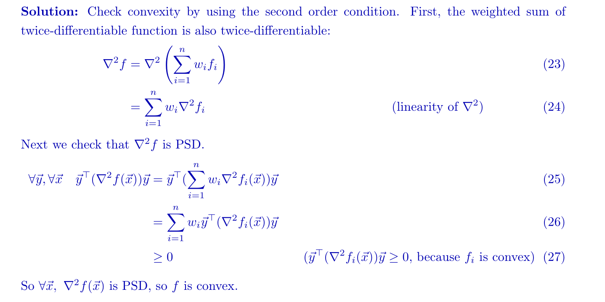

> [!example] 
> 假设$f_i:\mathbb{R}^{n\to}\mathbb{R}, i=1,2,\cdots, m$为凸，$\vec{a}\in \mathbb{R}^{n}, \vec{b}\in\mathbb{R}$, 且$g(\vec{x})=\vec{a}^{\top}\begin{bmatrix}f_1(\vec{x})&\cdots&f_n(\vec{x}) \end{bmatrix}+\vec{b}$, 问: $g(\vec{x})$是否是凸函数。
> 由上述定义可知，由于我们不知道$\vec{a}$中元素的非负性，所以答案是否定的。

### Infinite Sum - Integral
> [!important]
> 

## Pointwise Maximum
### Fundations
> 
> Alternative Proof: Proof by Epigraph
> 

### Piecewise Linear Function
> As an extension to point-wise maximum
> 

### NN Weighted Sum of r largest components
> [!important]
> 
> **对于**$(a)$**来说:**
> 
> 
> **对于**$(b)$**来说:**
> 
> 

## Pointwise Supremum
### Definition
> [!def]
> 

### Maximum Eigenvalue
> [!example]
> 
> 注意到这里 $\vec{y}^{\top}X\vec{y}$ 是一个关于 $X$ 的线性函数，因为$\vec{y}^{\top}X\vec{y}=\sum_{i=1}^{n}X_{ii}y_i^2+\sum_{i,j,i\neq j}y_iy_jX_{ij}$，而线性函数一定是凸函数。

## Composition of functions

> 

### Fundations - Composition
> [!important] 
> 

### Scalar Composition (k=1)
> [!proof] k=1,n=1 
> 假设$k=n=1$
>  $dom(g)=dom(h)=dom(f)=\mathbb{R}$
>  $h,g$ 均为凸函数，且均二阶可导
>  则我们可以求 $f$ 的二阶导判断其凸性:
>  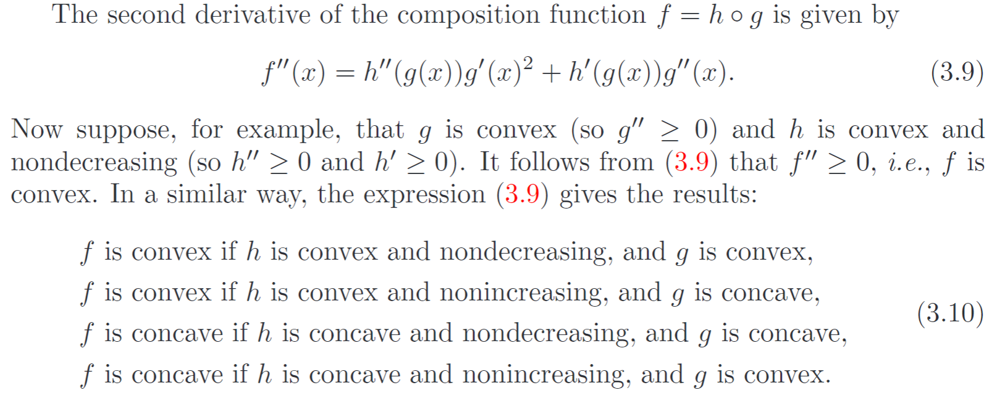

> [!proof] k=1, n>1
> 假设$k=1, n\geq 1$
> $dom(g),dom(h), dom(f)\neq \mathbb{R}^n,\mathbb{R}^k,\mathbb{R}^n$，即定义域均不一定是全空间
> $h,g$均为凸函数，但均不一定是二阶可微。
> 则，我们有以下条件判断$f$ 的凸性:
> 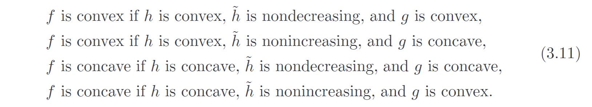
> **Proof:**
> 首先因为$g$ 是凸函数，所以
> - $\forall \vec{x},\vec{y}\in dom(g),\theta\in [0,1]$, $g(\theta\vec{x}+(1-\theta)\vec{y})\leq \theta g(\vec{x})+(1-\theta)g(\vec{y})$。
> - $dom(g)$是凸集, 即$\forall \vec{x},\vec{y}\in dom(g),\theta\in [0，1]，\theta g(\vec{x})+(1-\theta)g(\vec{y})\in dom(g)$
> 
> 因为$h$是凸函数，所以$h(\theta g(\vec{x})+(1-\theta)g(\vec{y}))\leq \theta h(g(\vec{x}))+(1-\theta)h(g(\vec{y}))=\theta f(\vec{x})+(1-\theta)f(\vec{y})$
> 为了证明$f$ 是凸函数，我们需要$f(\theta \vec{x}+(1-\theta)\vec{y})\leq \theta f(\vec{x})+(1-\theta)f(\vec{y})$, 所以说我们只需要证明$f(\theta \vec{x}+(1-\theta)\vec{y})\leq h(\theta g(\vec{x})+(1-\theta)g(\vec{y}))$, 即$h(g(\theta \vec{x}+(1-\theta)\vec{y}))\leq h(\theta g(\vec{x})+(1-\theta)g(\vec{y}))$即可。
> 但是现在有个问题就是$g(\theta \vec{x}+(1-\theta)\vec{y})$不一定属于$dom(h)$, 我们需要证明$g(\theta \vec{x}+(1-\theta)\vec{y})\in dom(h)$。
> 我们使用反证法，假设$g(\theta \vec{x}+(1-\theta)\vec{y})\notin dom(h)$, 因为$\tilde{h}$是不减的，所以$\tilde{h}(g(\theta \vec{x}+(1-\theta)\vec{y}))\leq \tilde{h}(\theta g(\vec{x})+(1-\theta)g(\vec{y}))$, 但我们知道，对于任意不属于$dom(h)$但属于$dom(\tilde{h})$的输入来说，其经过函数$h$的输出都是$+\infty$, 所以等式左边是$+\infty$, 而等式右边是`finite value`, 因为$\theta g(\vec{x})+(1-\theta)g(\vec{y})\in dom(h)$，所以推出了矛盾，所以原命题成立。
> 

> [!example] Examples
> 
> 其中第四点我们需要额外关注一下，此时$h(z)=z^p(z\geq 0)$，即$dom(h)=\mathbb{R}_+$, 于是我们需要扩展$h$, 但是如果扩展成$h(z)=\begin{cases} h(z)&z\in dom(h)\\\infty&z\notin dom(h)\end{cases}$, 则$\tilde{h}$并不是一个单调的函数，也就不能使用上面的四条规则来判断$f=h(g(x))$的凸性了。于是我们对于这个特殊的函数必须采用其他的扩展构造方法，其中一种是$h(z)=\begin{cases} h(z)&z\in dom(h)\\0&z\notin dom(h)\end{cases}$。

### Vector Composition (k > 1)
> [!important] 
> 

### Summary
> [!important]
> 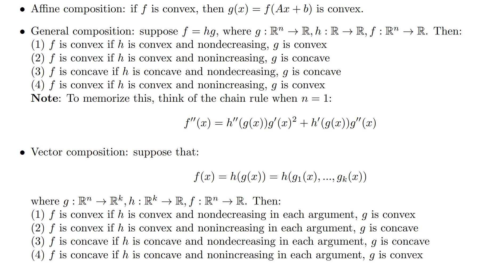

## Perspective of a Function
### Definition
> [!important] 
> 函数的透视和透视函数是不一样的。
> 透视函数: $P:\mathbb{R}^{n+1}\to \mathbb{R}^{n},dom(P)=\mathbb{R}^{n}\times \mathbb{R}_{++}$
> $P(\vec{z},t)=\frac{\vec{z}}{t}$
> 而函数的透视定义如下:
> 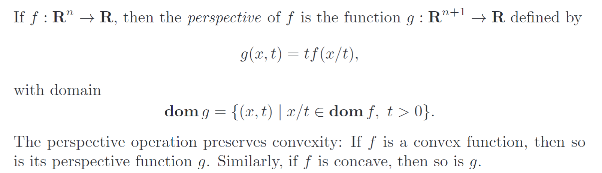
> 同时，这里有一个小的补充概念，就是边缘凸和联合凸的概念，对于$g(x,t)$这个函数来说:
>  - 如果我们要证明$g(x,t)$关于$x$是凸函数，则我们需要验证，对于任意的固定的$\forall t_0$, $g(x,t_0)=q(x)$是一个凸函数, 我们只需要证明$\forall t_0\in T, \forall \vec{x},\vec{y}\in dom(g), \theta\in [0,1],g(\theta x+(1-\theta)y,t_{0})\leq \theta g(x,t_0)+(1-\theta)g(y,t_0)$
> - 如果我们要证明$(x,t)$关于$(x,t)$是凸函数，则我们需要验证$\forall (\vec{x},t)\in dom(g),\theta\in [0,1]$, 有$g(\theta (\vec{x},t_1)+(1-\theta)(\vec{y},t_{2}))\leq \theta g(\vec{x},t_1)+(1-\theta) g(\vec{y},t_2)$

> [!proof]
> 假设$f$是凸函数：
> - 首先证明$dom(g)$是凸集，$\forall (x,t_1),(y,t_{2})\in dom(g),\theta\in [0,1]$, $\theta(x,t_1)+(1-\theta)(y,t_2)=(\theta x+(1-\theta)y,\theta t_1+(1-\theta)t_2)$。
> 	因为$\frac{\theta x+(1-\theta)y}{\theta t_1+(1-\theta)t_2}=\frac{\theta t_1\frac{x}{t_1}+(1-\theta)t_2\frac{y}{t_2}}{\theta t_1+(1-\theta)t_2}$。 因为$\frac{x}{t_{1}}\in dom(f),\frac{y}{t_{2}}\in dom(f)$且$dom(f)$是凸集，所以$\frac{\theta t_1\frac{x}{t_1}+(1-\theta)t_2\frac{y}{t_2}}{\theta t_1+(1-\theta)t_{2}}\in dom(f)$，即$(\theta x+(1-\theta)y,\theta t_1+(1-\theta)t_{2})\in dom(g)$。证毕。
> - 然后证明$g$是凸函数, $\forall \begin{bmatrix}\vec{x}\\t_1 \end{bmatrix},\begin{bmatrix}\vec{y}\\t_2 \end{bmatrix}\in dom(g),\theta\in [0,1]$, 我们有:
> 	$\begin{align}g(\theta \begin{bmatrix}\vec{x}\\t_1 \end{bmatrix}+(1-\theta)\begin{bmatrix}\vec{y}\\t_2 \end{bmatrix})&=g(\theta\vec{x}+(1-\theta)\vec{y},\theta t_1+(1-\theta)t_2)\\&=(\theta t_1+(1-\theta)t_2)f(\frac{\theta\vec{x}+(1-\theta)\vec{y}}{\theta t_1+(1-\theta)t_2})\\&=(\theta t_1+(1-\theta)t_2)f(\frac{\theta t_1\frac{\vec{x}}{t_1}+(1-\theta)t_2\frac{\vec{y}}{t_2}}{\theta t_1+(1-\theta)t_2})\\&\leq (\theta t_1+(1-\theta)t_2)\{\frac{\theta t_1f(\frac{\vec{x}}{t_1})+(1-\theta)t_2f(\frac{\vec{y}}{t_2})}{\theta t_1+(1-\theta)t_2}\}\\&=\theta t_1f(\frac{\vec{x}}{t_1})+(1-\theta)t_2f(\frac{\vec{y}}{t_2})\\&=\theta g(\vec{x},t_1)+(1-\theta)g(\vec{y},t_2)\end{align}$
> 	证毕。

### Important Examples
> [!example] Euclidean Norm Squared
> 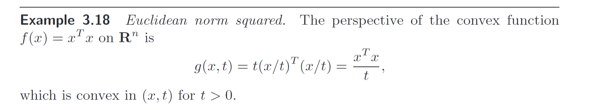

> [!example] Negative Logarithm
> 
> **Direct Proof of Convexity:**
> $\forall (x,t_1),(y,t_{2})\in dom(g),\theta\in [0,1],(\theta x+(1-\theta)y,\theta t_1+(1-\theta)t_{2})\in dom(g)$ since $\frac{\theta x+(1-\theta)y}{\theta t_1+(1-\theta)t_{2}}\in dom(f)$。
> $\nabla^{2}g(x,t)=\begin{bmatrix}\frac{t}{x^2}&-\frac{1}{x}\\-\frac{1}{x}&\frac{1}{t} \end{bmatrix}$，since $det(\nabla^{2}g(x,t))\succeq 0,\forall x,t$, then $g$ is convex.
> 
> 
> 原因是我们有$\sum_{i=1}^nu_ilog(\frac{u_i}{v_i})=\sum_{i=1}^ng(u_i,v_i)$, 其中$g(u_i,v_i)=g(A\begin{bmatrix} \vec{u}\\\vec{v}\end{bmatrix})$, 所以$g$是一个凸函数和仿射变换的组合，对于$(\vec{u},\vec{v})$来说是凸的。

> [!example] KL Divergence
> 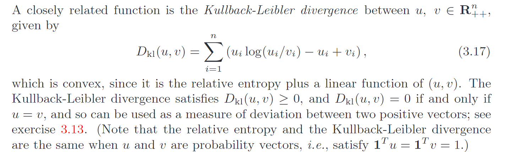
> 其中$\sum\limits_{i=1}^{n}v_i-u_i=\mathbb{1}^{\top}(\vec{v}-\vec{u})$

# Conjugate Functions
## Definition
> [!def]
> 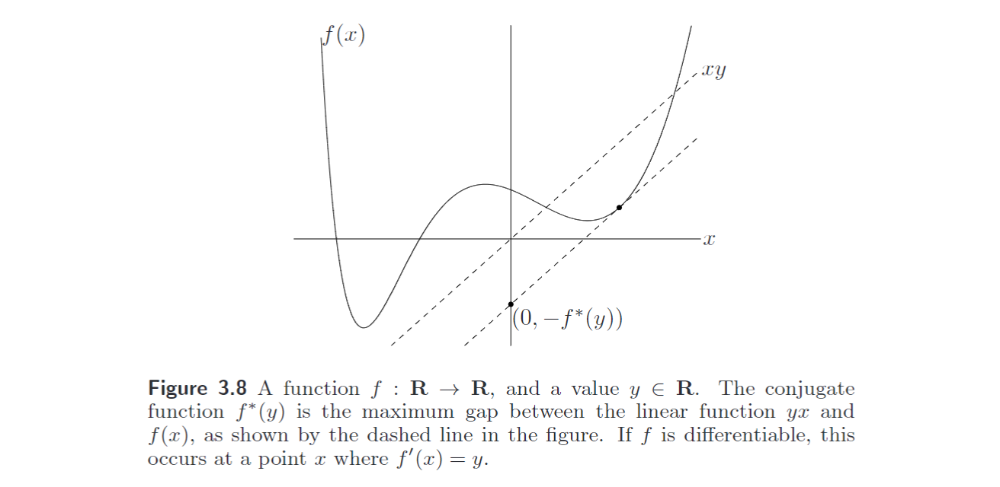

## Properties
> [!property] Property 1: Maximum length point is the tagent line
> 对于上述一维的情况，我们知道，$f^*(y)$要想取到最大值，必须满足$\nabla(\vec{y}^{\top}\vec{x}-f(\vec{x}))=\vec{y}-\nabla f(\vec{x})=\vec{0}$, 放到一维的情况就是$f'(x)=y$。

> [!property] Property 2: Convexity
> 
> 在对偶性原理中，这个性质非常重要。

> [!property] Property 3: Fenchel's Inequality

## Examples
### Basic Examples
> [!example] 
> 

# Quasiconvex Function(拟凸函数)
## Definition
> [!def]
> 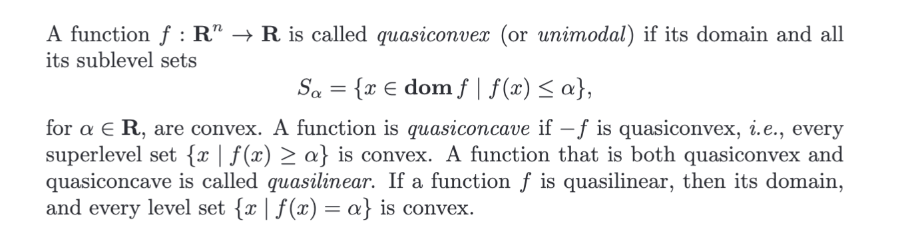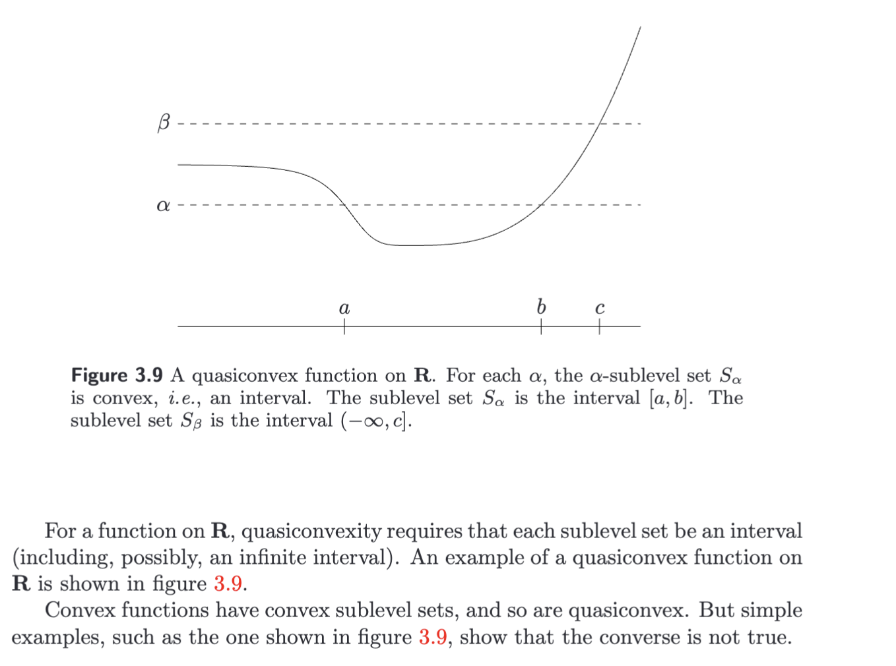

