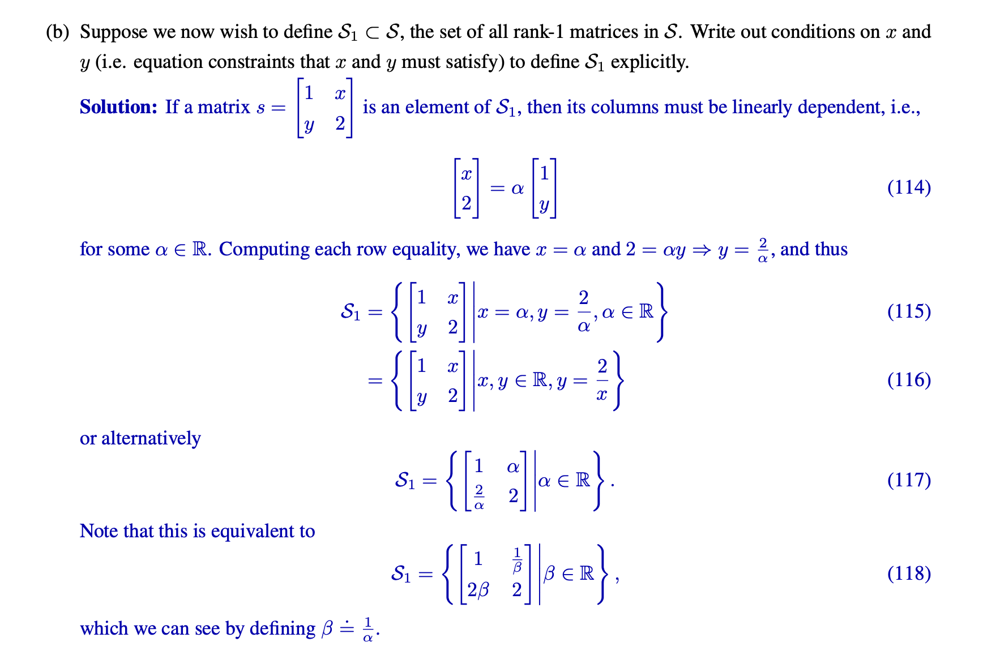
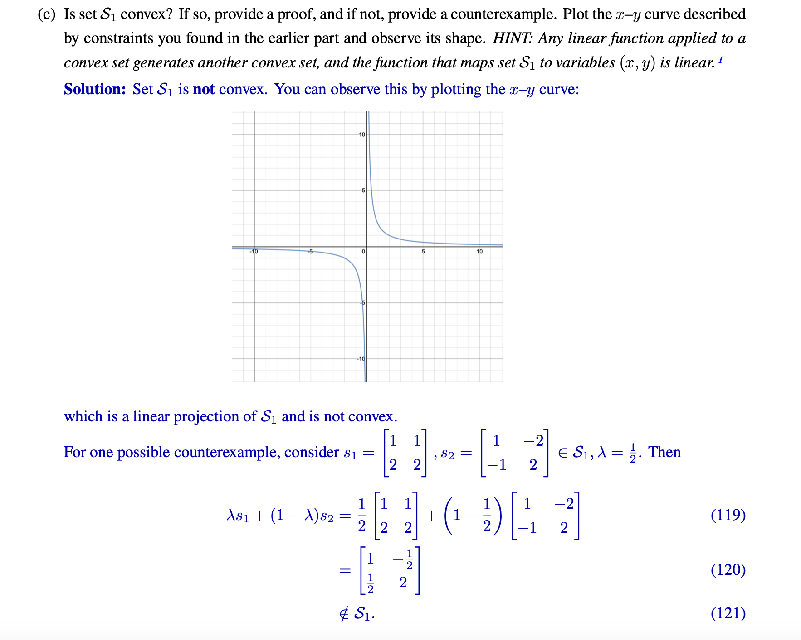

# Optimization_Problems
## Optimization Terminology
> [!def]
> 

> [!summary]
> 对于一个优化问题来说, 我们有如下几个定义:
> - **可行解集(Feasible Set)**：$X_f=\{\vec{x}\big|\vec{x}\in D,f_i(\vec{x})\leq 0,\forall i=1,2,\cdots,m,\\h_i(\vec{x})=0\forall i=1,2,\cdots, p\}$，本质上就是在定义域中且满足约束的所有的点。
> - **问题的最优值(Optimal Value)**: $p^*=\inf\{f(\vec{x})|\vec{x}\in X_f\}$。如果$X_f=\emptyset$, 则$p^*=\infty$。
> - **问题的最优解(Optimal Point/Solution)**: $\vec{x}^*\in X_f,f(\vec{x}^*)=p^*$ 
> - **问题的最优解集(Optimal Set)**: 因为很多问题不止一个最优解，所以我们如果把这些最优解放在一起就会形成一个集合，$X_{opt}=\{\vec{x}\in X_f\big|f(\vec{x})=p^*\}$
> - **问题的$\epsilon$-次优解集($\epsilon$-Optimal Set):** 对于很多的优化问题，我们的最优解并不要求函数达到最小值，或者最优解，实际问题真正的解并不要求是函数达到最小值处的解。换句话说，我们需要的是`Satisfying Solutions`，也就是次优解。即$X_{\epsilon}=\{\vec{x}|\vec{x}\in X_f,f_0(\vec{x})\leq p^*+\epsilon\}$, $\epsilon=0$时等价于最优解集，此时不等号会自动转化为等号，因为函数$f_0$的最优值一定不会小于$p^*$。
> - **问题的局部最优解(Locally Optimal):** 
> 
> - 上述的几个解集之间的包含关系:
> 

## Inequality Constraints Myth
> [!motiv]
> 为什么不等式约束都要写成$<$而不是$\leq$的形式呢?

> [!important]
> 如果$\vec{x}\in X_f$, $f_i(\vec{x})=0$, 则$f_i(\vec{x})\leq 0$为活动约束(active)。
> 反之如果$f_i(\vec{x})<0$为不活动约束(inactive)。

## Feasiblity Problems
> [!def]
> 
> 如果我们要转化成标准形式，就只需要将`find x`替换成$min~0$即可。

## Expressing Problems in Standard Form
### Box Constraints
> [!example]
> 

## Equivalent Problems
Original Optimization Problem
> [!def]
> 假设我们有如下的优化问题:
> 
> 我们尝试将其转化为等价的优化问题。

### Scaling
> [!example]
> 

### Change of Variables
> [!important]
> 

### Transformation of Objective and Constraints
> [!important]
> 

>[!example] L2 Norm
>

### Slack Variables
> 

### Elimiating Linear Equality Constraint
> [!important]
> 
> 本质上这种等价方法是在给我们的优化问题降维。

### Eliminating Equality Constraints
> [!important]
> 
> 这种方法本质上是将$h_i(\vec{x})=0,i=1,2\cdots, m$看成是方程组，然后$\vec{x}=\phi(\vec{z})$表示我们可以用一个函数$\phi$来描述上述方程组的解集，这样我们就可以丢掉$h_i$这些等式约束。区别是现在的优化问题变成了和 $\vec{z}$ 相关的优化问题。这样一来如果我们在这个等价的优化问题上求出了$\vec{z}^*$, 则通过简单的函数变换得到$\vec{x}^*=\phi(\vec{z}^*)$。
> - 有人可能会问，为什么我们能够找到这样的函数$\phi$, 设想一下我们在求解线性方程组时经常将其写成$A\vec{x}=\vec{b}$的形式，而$\vec{x}=A^{\dagger}\vec{b}+\mathcal{N}(A)$, 所以我们是可以找到一个线性函数满足$\vec{x}=\phi(\vec{z})$的。
> - 当然上述的方法只适用于消除线性约束。

# Convexity of Matrix Set
> EECS127 Sp23 Homework 5 P5

> [!example]
> 

