# Affine Objects
## Affine Set
### Canonical Definition
> 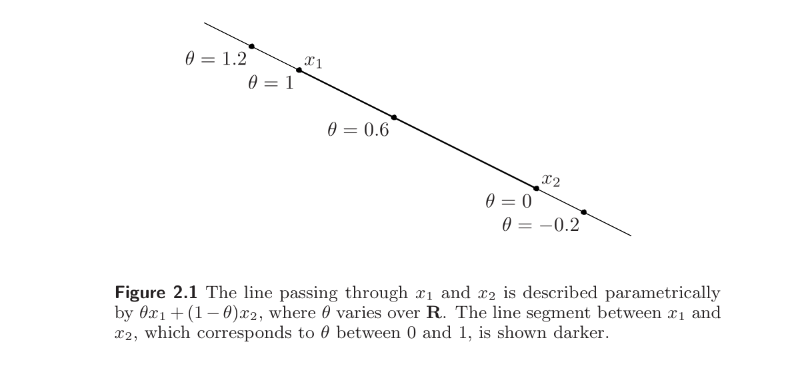
> 注意这里我们没有对$\theta$的取值做任何限制。

### Subspace Definition
> 

## Affine Combination/Affine Hull
> **Affine Combination:**
> 
> **Affine Hull:**
> 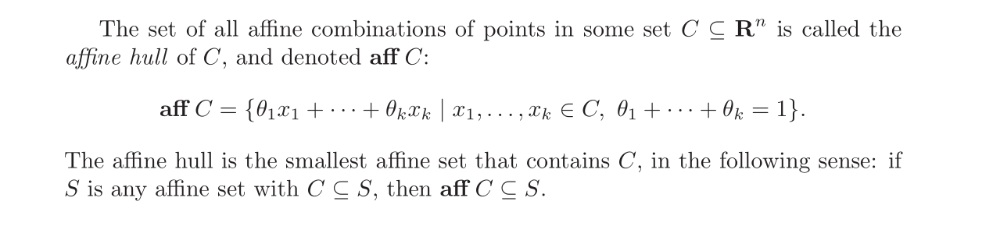

## Affine Dimension
> 

# Convex Objects
## Convex Set/Convex Hull
> 

## Convex Cone/Conic Hull
> 
> `Being a Conex Cone`implies`Being a Convex Set`, 也就是说`Being a Convex Cone`is a stronger condition than `Being a Convex Set`。

## Operations Preserving Convexity of Set
### Intersection of Convex Set
> 

### Vector Space&Hyperplanes
> 

### Affine Image
> 
> $f(S)=\alpha S$可以看成$f(\vec{x})=\alpha I\vec{x}$, $f(S)=S+\alpha$可以看成$f(\vec{x})=\vec{x}+\vec{a}$本质都是`Affine Mapping`。
> 
> $f(S)$可以看成$f(\vec{x}_1,\vec{x}_2)=\begin{bmatrix} I&0\end{bmatrix}\begin{bmatrix} \vec{x}_1\\\vec{x}_2\end{bmatrix}=\vec{x}_1$, 其中$A=\begin{bmatrix} I&0\end{bmatrix}$, 且$dom(f)=S\subseteq\mathbb{R}^m\times \mathbb{R}^n$
> 
> $f(S_1\times S_2)$可以看成$f(\vec{x}_1,\vec{x}_2)=\begin{bmatrix} I&I\end{bmatrix}\begin{bmatrix} \vec{x}_1\\\vec{x}_2\end{bmatrix}=\vec{x}_1+\vec{x}_2$ 其中$A=\begin{bmatrix} I&I\end{bmatrix}$, 且$dom(f)\subseteq\mathbb{R}^m\times \mathbb{R}^n$
> 

### Inverse Affine Image
> 
> **Proof:**
> $\forall \vec{x},\vec{y}\in f^{-1}(C)$, we have by definition $f(\vec{x}),f(\vec{y})\in C$。Since $C$is convex, thus $\forall \theta\in[ 0,1]$, we know $\theta f(\vec{x})+(1-\theta) f(\vec{y})\in C$。Since $f$is affine, then by its property we have $\theta f(\vec{x})+(1-\theta)f(\vec{y})=f(\theta\vec{x}+(1-\theta)\vec{y})\in C$, which implies $\theta\vec{x}+(1-\theta)\vec{y}\in f^{-1}(C)$。Thus tying all these together, we have proven that $\forall \vec{x},\vec{y}\in f^{-1}(C),\theta\in [0,1]$, we have $\theta\vec{x}+(1-\theta)\vec{y}\in f^{-1}(C)$, which implies that $f^{-1}(C)$is convex.

## Functions Preserving convexity
### Perspective Function
#### Definition
> 

#### Convexity of (Inverse) Image
> 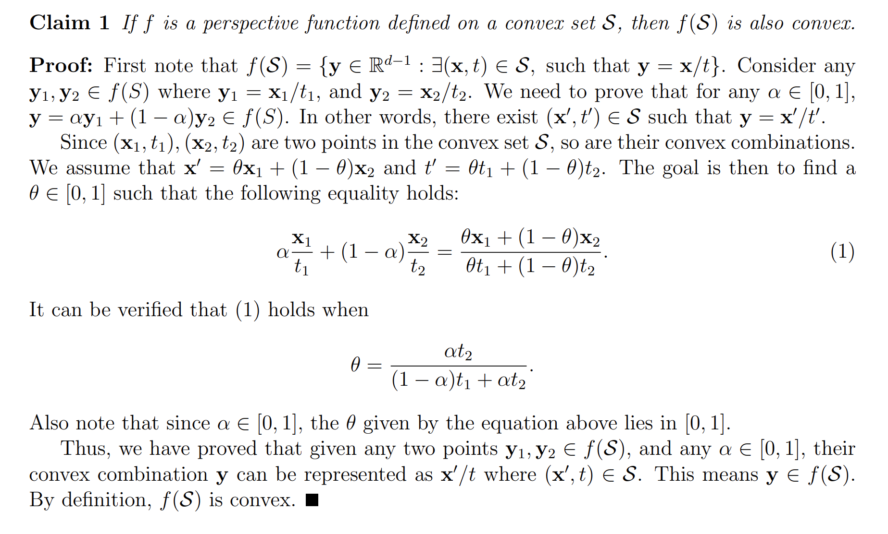

### Linear-fractional Function
#### Definition
> 

#### Convexity
> 

## Exercises
> 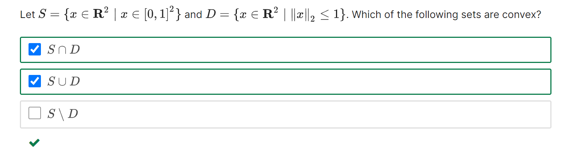
> 画图即可。
> 

# Important Convex Sets
## Hyperplane
### Definition
> 
> **Convexity:**
> $\forall \vec{x},\vec{y}\in \mathcal{H},\theta\in [0,1]$, we have $\vec{a}^{\top}(\theta \vec{x}+(1-\theta)\vec{y})=\vec{b}$, which implies that $\theta \vec{x}+(1-\theta)\vec{y}\in \mathcal{H}$.

### Properties
#### Distance between Parallel Hyperplane
> 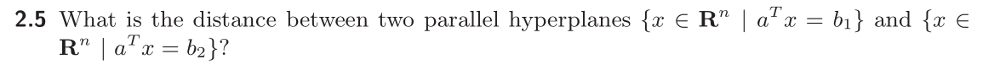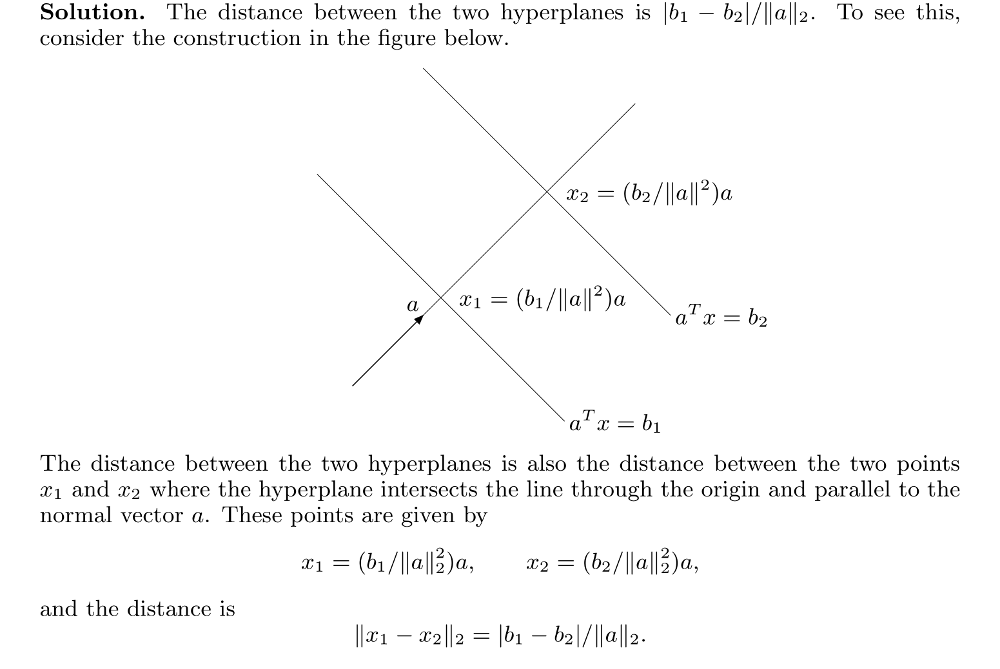
> 换句话说，我们可以在$\vec{a}^{\top}\vec{x}=\vec{b}_1$和$\vec{a}^{\top}\vec{x}=\vec{b}_2$上各自任取一点，假设为$\vec{x}_1$和$\vec{x}_2$, 并假设$(\vec{x}_2-\vec{x}_1)\parallel\vec{a}$, 即$\vec{x}_2-\vec{x}_1=\lambda \vec{a}$。同时因为$\vec{a}^{\top}\vec{x}_1=\vec{b}_1$, $\vec{a}^{\top}\vec{x}_2=\vec{b}_2$, 所以$\vec{a}^{\top}(\vec{x}_1-\vec{x}_2)=\vec{b}_1-\vec{b}_2$, 所以$\vec{a}^{\top}\lambda \vec{a}=\vec{b}_1-\vec{b}_2$, 所以$\lambda=\frac{\vec{b}_1-\vec{b}_2}{\|\vec{a}\|_2^2}$, 所以我们要求的距离就是$\|\vec{x}_2-\vec{x}_1\|=\lambda \|\vec{a}\|$, 即$\frac{\vec{b}_1-\vec{b}_2}{\|\vec{a}\|_2}$。

 

## Halfspace
### Definition
> 
> **Convexity:**
> $\forall \vec{x},\vec{y}\in \mathcal{H},\theta\in [0,1]$, we have $\vec{a}^{\top}(\theta \vec{x}+(1-\theta)\vec{y})\leq \geq\vec{b}$, which implies that $\theta \vec{x}+(1-\theta)\vec{y}\in \mathcal{H}$。要注意这里$\theta\geq 0$且$1-\theta\geq 0$，是因为这个性质我们才能流畅地在等式左右两边乘以$\theta$或者$1-\theta$而不改变不等号的方向。

### Voronoi Description
> #### 

### Properties
#### Subset Relationship
> 
> **First Condition:**
> $(\implies)$: Proof by Contradiction，有几种情况:
> 1. 假设  $\tilde{a}$和$a$不平行，则存在一个向量$v$使得$a^{\top}v=0$且$\tilde{a}^{\top}v\neq 0$(我们总是可以取沿着半平面分界线的方向的向量)。然后就是证明中非常精彩的部分了，现在我们想要找到一个点，使它$\in \mathcal{H}$但是$\notin \mathcal{\tilde{H}}$。构造的方法就是先取一个点$\hat{x}\in \mathcal{H}\cap \tilde{\mathcal{H}}$, 此时$a^{\top}\hat{x}\leq b$且$\tilde{a}^{\top}\hat{x}\leq \tilde{b}$，然后注意到$a^{\top}(\hat{x}+tv)=a^{\top}\hat{x}\leq b,\forall t$, 所以$\hat{x}+tv\in \mathcal{H},\forall t$。但是同时对于$\tilde{a}^{\top}(\hat{x}+tv)=\tilde{a}^{\top}\hat{x}+t\tilde{a}^{\top}v$, 所以总是存在一个$t$使得$\tilde{a}^{\top}\hat{x}+t\tilde{a}^{\top}v>b$, 即$\hat{x}+tv\notin \mathcal{\tilde{H}}$。所以存在一个点，因为$\tilde{a}$和$a$不平行, 所以这个点它$\in \mathcal{H}$但$\notin \mathcal{\tilde{H}}$, 这与我们的假设矛盾，所以原命题成立。附上一张图加深这个证明方法的理解。
> 

> 2. 假设$\tilde{a}$和$a$平行但是$\lambda<0$(即两个半平面的朝向相反)，则:
> 
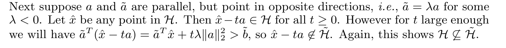
> 3. 假设$\tilde{a}$和$a$平行且$\lambda >0$但是$\tilde{b}< \lambda b$, 则:
> 

> $(~\Longleftarrow~)$: 这个方向比较好证
> 
> **Second Condition:**
> 和上面`First Condition`类似。

## Euclidean Balls
> 
> **Convexity:**
> 

## Ellipsoids
### Definition
> 
> 对于$(2.4)$中的定义，我们知道, 如果$A=P^{\frac{1}{2}}$，则: 
> $\begin{aligned}(x_c+P^{\frac{1}{2}}u-x_c)^{\top}(P^{\frac{1}{2}})^{-2}(x_c+P^{\frac{1}{2}}u-x_c)&=(P^{\frac{1}{2}}u)^{\top}(P^{\frac{1}{2}})^{-2}(Au)\\&=u^{\top}(P^{\frac{1}{2}})^{\top}(P^{\frac{1}{2}})^{-2}P^{\frac{1}{2}}u\\&=u^{\top}u\leq 1\end{aligned}$
> 这符合$(2.3)$的定义。
> 同时如果令$P=r^2I$则，$\mathcal{E}$是一个`Norm Ball`with radius $r$。

### Mahalanobis Norm
> 

### Convexity
> 

## Norm Balls
> **Definition: Norm Ball** with center $\vec{x}_c$and radius $r$: $\{\vec{x}:\|\vec{x}-\vec{x}_c\|\leq r\}$
> **Convexity:**
> 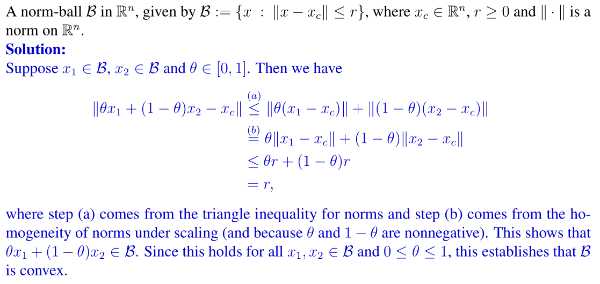

## Polyhedra
### Definition
> 
> **Convexity:**
> $\forall \vec{x},\vec{y}\in\mathcal{P},\theta\in [0,1]$, we have $A\vec{x}\leq \vec{b}$and $C\vec{x}=\vec{d}$and $A\vec{y}\leq \vec{b}$and $C\vec{y}=\vec{d}$, thus we can obtain  $A(\theta \vec{x}+(1-\theta)\vec{y})\leq \theta\vec{b}+(1-\theta)\vec{b}=\vec{b}$ and $C(\theta \vec{x}+(1-\theta)\vec{y})= \theta\vec{d}+(1-\theta)\vec{d}=\vec{d}$, which implies that $\mathcal{P}$is a convex set.

### *Concept Check
> 
> 

### Properties
#### Polyhedra Decomposition
> 

## *Simplex
> 
> **Convexity:**
> 

## Exercises
> 
> 1. 首先$S$一定是`Convex`的，因为:
> 
$\forall \vec{x},\vec{y}\in S, \theta\in [0,1]$, $\begin{aligned}\theta x_1 + (1-\theta) y_1&+\theta x_2 e^{-t}+ (1-\theta) y_2e^{-t}+\theta x_3 e^{-2t}+ (1-\theta) y_3e^{-2t}\\&=\theta(x_1+x_2e^{-t}+x_3e^{-2t})+(1-\theta)(y_1+y_2e^{-t}+y_3e^{-2t})\\&\leq \theta\times 1.1+(1-\theta)\times 1.1\\&=1.1\end{aligned}$
> 所以$\theta\vec{x}+(1-\theta)\vec{y}\in S$。要注意上面的推导中的一个重要前提是$\theta\in [0,1]$, 这也蕴含了$\theta$和$1-\theta$都大于等于零这一条件，这就导致我们在已知$x_1+x_2e^{-t}+x_3e^{-2t}\leq 1.1$和$y_1+y_2e^{-t}+y_3e^{-2t}\leq 1.1$的情况下可以在等式两边同时乘以$\theta$或者$1-\theta$而不改变不等式的符号然后直接相加。
> 2. 而`Being Convex doesn't imply being affine`，对于`Affine Combination`我们并没有对$\theta$的取值范围做任何限制，所以如果我们取$\theta=-1$, $x_1=1.1,x_2=0,x_3=0$和$y_1=0,y_2=1.1,y_3=0$则$\theta \vec{x}+(1-\theta)\vec{y}=(-1.1,2.2,0)$此时$-1.1+2.2e^{-t}>1.1$for some $t\geq 1$。所以$S$并不是`Affine`的。
> 3. 因为`Polyhedra`是

# Important Convex Cones
## Norm Cones
### Definition
> 
> **Convexity:**
> $\forall (\vec{x},t_1),(\vec{y},t_2)\in \mathcal{C},\theta_1,\theta_2\geq 0$ , for $(\theta_1\vec{x}+\theta_2\vec{y},\theta_1 t_1+\theta_2t_2)$we have $\|\theta_1 \vec{x} + \theta_2\vec{y}\|\leq \theta_1\|\vec{x}\|+\theta_2\|\vec{y}\|=\theta_1 t_1+\theta_2t_2$, thus $(\theta_1\vec{x}+\theta_2\vec{y},\theta_1 t_1+\theta_2t_2)\in \mathcal{C}$, which proves that it is a convex cone.

### Second Order Cones
> 

## Normal Cones
> 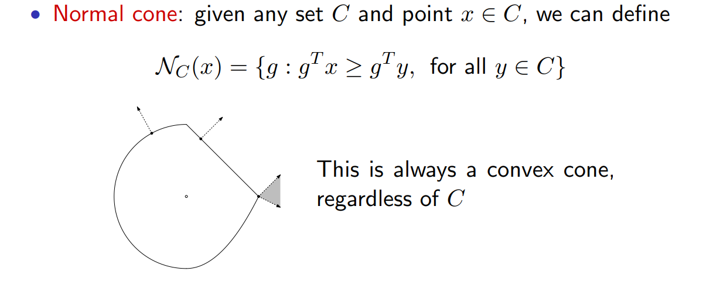
> 
> **Convexity:**
> 

## Positive Semidefinite Cones
> 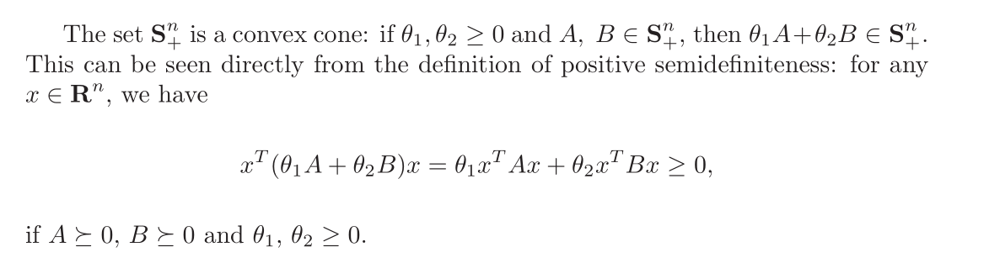

# Generalized Inequalities
## Proper Cone
> [!def]
> 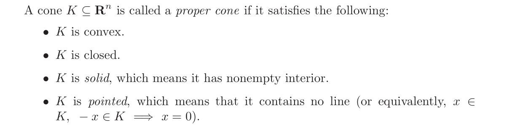
> `Pointed`指的是有方向，一个`Cone`只能按照特定方向辐射。
> 

## Inequalities
> 

## Minimum and Minimal
> 

## Dual Cone
### Definition
> [!def]
> 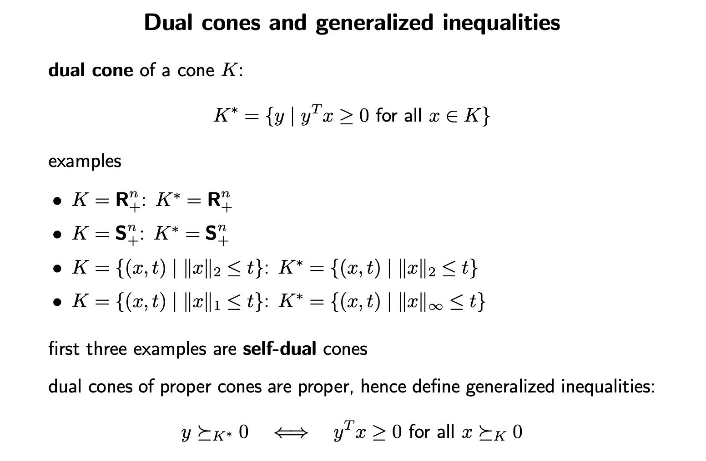

### Properties
> [!thm] 
> 

> [!proof]
> 

### Self-Dual Examples
> [!example] Subspaces
> 

> [!example] Positive Semidefinite Matrices
> 

### Dual Cone Inequalities
> [!def]
> 

# Supporting and Separating Hyperplanes
## Separating Hyperplane  Theorem
### Theorem
> 
> **Rephrase This:**
> Let $C,D$be convex set and $C\land D=\emptyset$, then $\exists$hyperplane $\vec{a}^{\top}\vec{x}=b$such that $\forall \vec{x}\in C$ $\vec{a}^{\top}\vec{x}\geq b$and that $\forall \vec{y}\in D$, $\vec{a}^{\top}\vec{y}\leq b$。
> 如果`C,D`不全是`Convex Sets`的话，上述定理不一定成立。
> 

### Proof by Contradiction
> 假设存在$\vec{c}\in C$, $\vec{d}\in D$, $dist(C,D)=\inf\{\|\vec{c}-\vec{d}\|_2~|~\vec{c}\in C,\vec{d}\in D\}$, 即$\vec{c}$和$\vec{d}$是$C$和$D$中距离最近的两个点。
> 我们证明存在性: 
> Consider $\vec{d}-\vec{c}$as normal that passes through $\frac{\vec{d}+\vec{c}}{2}$, 我们想要套用`Hyperplane`的定义$\vec{a}^{\top}(\vec{x}-\vec{x}_0)$($\vec{x}_0$是`Hyperplane`上的一点)。于是我们考虑对$\vec{x}\in C\lor \vec{y}\in D$套用定义$(\vec{d}-\vec{c})^{\top}(\vec{x}-\frac{\vec{d}+\vec{c}}{2})$。
> 于是我们定义$f(\vec{x})=(\vec{d}-\vec{c})^{\top}(\vec{x}-\frac{\vec{d}+\vec{c}}{2})$其中$f(\vec{x})=0$是我们的`Hyperplane`的表达式。
> 于是我们有$f(\vec{c})=-\frac{1}{2}\|\vec{d}-\vec{c}\|_2^2$$f(\vec{d})=\frac{1}{2}\|\vec{d}-\vec{c}\|_2^2$，而我们想要$\forall \vec{x}\in D, f(\vec{x})\geq 0$and that $\forall \vec{x}\in C, f(\vec{x})\leq 0$。
> 我们先使用`Proof By Contradiction`证明$\forall \vec{x}\in D, f(\vec{x})\geq 0$，我们假设$\exists \vec{u}\in D,~~s.t.~~f(\vec{u})<0$, 并尝试推矛盾。
> 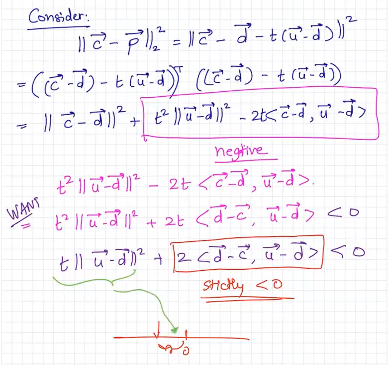

### Concept Check
> 
> 只要条件得当，两个非凸集也可以被一个超平面分割。

## Supporting Hyperplane Theorem
### Theorem
> 

### Proof By Applying Separating Theorem
> 我们只需要对$\{x_0\}\subseteq\mathbf{bd}C$和$\mathbf{int}C$这两个`Convex Set`使用`Separating Hyperplane Theorem`就可以完成证明。

### Concept Check
> 
> 试想一个有尖点的凸集。

# Schur Complement
## Definition
> 

## Applications
### Determinant
> $det(X)=det(A)det(S)$
> 

### Solving Linear Systems
> 

