# Convexity of Functions
## Definition&Properties
### Definitions&Criteria
> 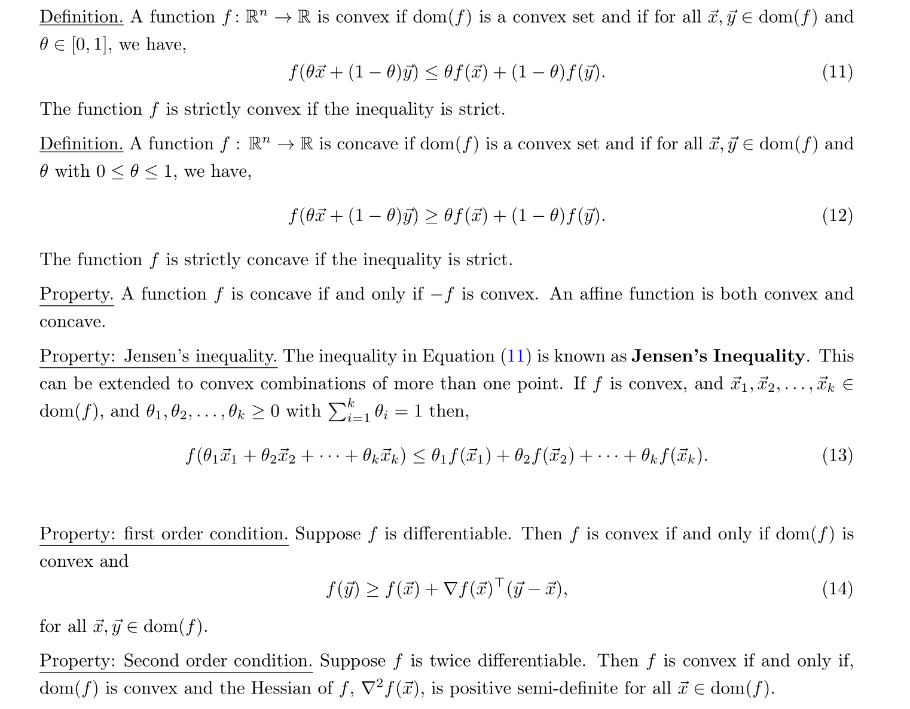
> **Implications: If **$\nabla f(\vec{x}_*)=0$**and **$f$**is convex and differentiable, then **$\vec{x}_*$**is a global minimum.**
> **Proof:** Since $f$is convex, then $\forall \vec{y}\in dom(f)$, we have $f(\vec{y})\geq f(\vec{\vec{x}_*})+0$, which directly implies that $\vec{x}_*$is the global minimum.

### Proof for FOC(BV)
> 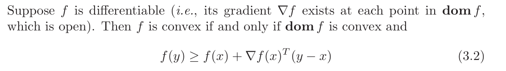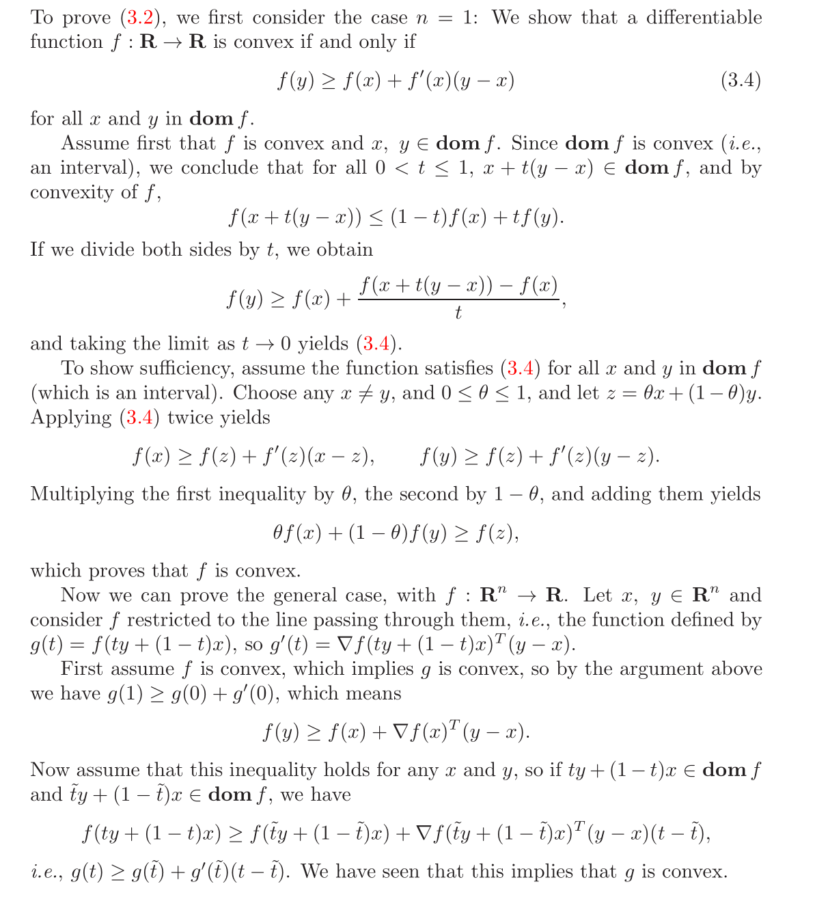

## Sub/Super-Level Set
> 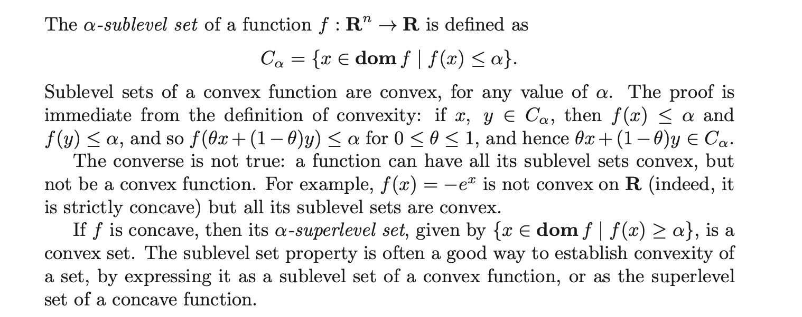
> **总结一下:**
> 1. A convex function's sublevel set is convex, and the converse is not true.
> 2. A concave function's superlevel set is convex, and the converse is not true.
> 
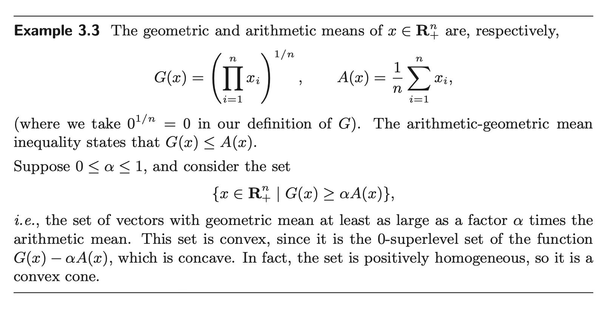

## Epi/Hypo-graph of Functions
> 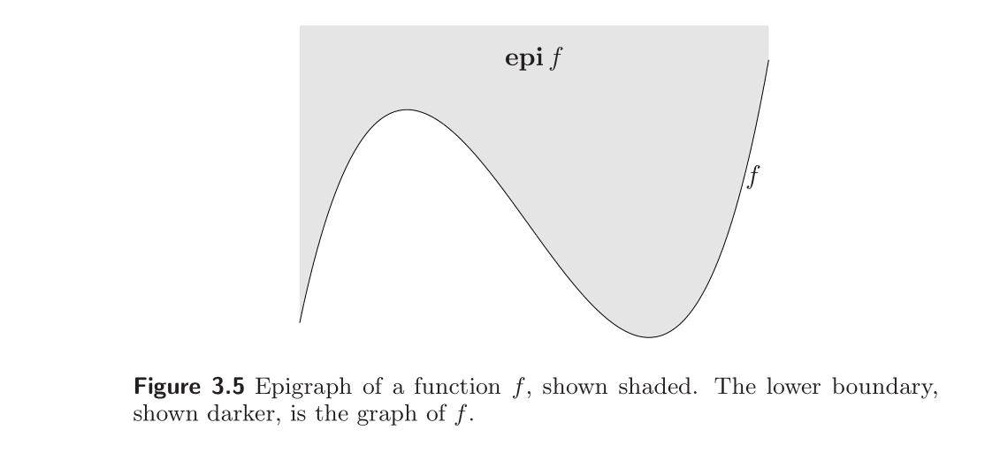
> 证明一个函数是否是凸函数的一个重要的方法是证明其`Epigraph`is convex set. 这个性质使得我们能可以在`Convex Function`和`Convex Set`之间互相转化。
> **总的来说:**
> 1. `Convex Function <=> Epigraph is Convex Set`.
> 2. `Concave Function <=>  Hypograph is Convex Set`.

**Matrix Fractional Function**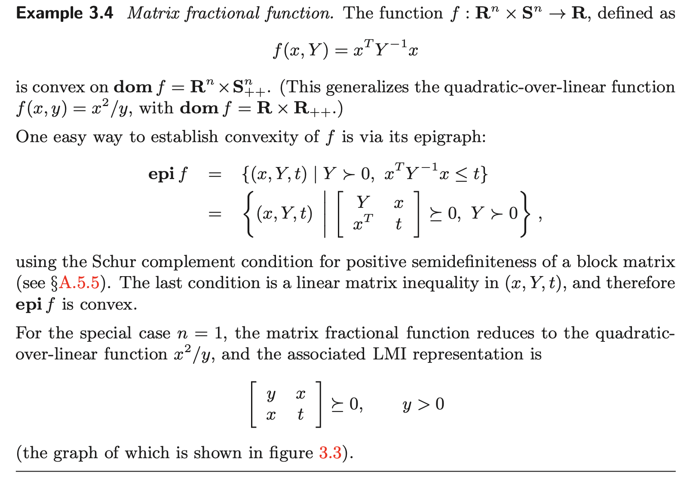

## Some common convex functions
### Functions on R
> 
> 1. **Exponential: **$(e^{ax})''=a^2e^{ax}\geq 0,\forall x\in dom(f)$
> 2. **Powers:** $(x^a)''=a(a-1)x^{a-2}$, 于是当$a(a-1)\leq 0$时，$(x^a)''\leq 0$-> Concave，否则$(x^a)''\geq 0$-> Convex
> 3. **Powers of absolute value:** 
>    1. $\forall x>0, (|x|^p)''=p(p-1)x^{p-2}$, when $p\geq 1$, we have $p(p-1)x^{p-2}\geq 0$
>    2. $\forall x<0$, $(|x|^p)''=((-x)^p)^{''}=p(p-1)x^{p-2}$, which is the same as above.
>    3. The$x=0$case is just trivial, since the second derivative is 0.
> 4. **Logarithm:** $(logx)''=-\frac{1}{x^2}<0,\forall x\in dom(f)$
> 5. **Negative Entropy:** $(xlogx)''=\frac{1}{x}>0,\forall x\in \mathbb{R}_{+}$or $\forall x\in \mathbb{R}_{++}$

### Functions on R^n
> 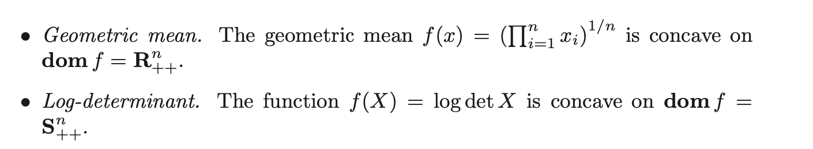
> 1. **Norm:** $\|\theta x+(1-\theta)y\|_p\leq \theta \|x\|_p+(1-\theta) \|y\|_p$by triangle inequality and homogenity.
> 2. **Max Function: **
>    1. **Prove by Definition:** $\theta \vec{x_i} + (1-\theta)\vec{y_i}\leq \theta \max(\vec{x})+(1-\theta)\max(\vec{y}),\forall i=1,2,\cdots, n$, 所以$\max(\theta \vec{x}+(1-\theta)\vec{y})\leq \theta \max(\vec{x})+(1-\theta)\max(\vec{y})$
>    2. **Prove by Epigragh:  Define **$f(\vec{x})=\max\{f_1(\vec{x}),f_2(\vec{x},\cdots, f_n(\vec{x}))\}$**where **$f_i(\vec{x})=x_i$**, then:**
> 
** **$\begin{aligned}epi(f)&=\{(\vec{x},t)~~|~~\vec{x}\in dom(f),f(\vec{x})\leq t\}\\&=\{(\vec{x},t)~~|~~\vec{x}\in \bigcap_{i=1}^n dom(f_i),f_1(\vec{x}),\cdots, f_n(\vec{x})\leq t\}\\&=\bigcap_{i=1}^n\{(\vec{x},t)~~|~~\vec{x}\in dom(f_i),f_i(\vec{x})\leq t\}\\&=\bigcap_{i=1}^n epi(f_i)\end{aligned}$, since $f_i(\vec{x})$'s are all affine functions, which are guaranteed to be convex, thus we have $epi(f_i)$'s are convex set, and that $epi(f)$is convex.
> 3. **Quadratic Over Linear Function: **
> 

> The last inequality comes from a very important property of dyad matrix $\vec{u}\vec{v}^{\top}$where if $\vec{u}=\vec{v}$, we have $\vec{v}\vec{v}^{\top}$is convex.
> 4. **Log-Sum-Exp: **
> 

> 5. **Geometric Mean:**
> 
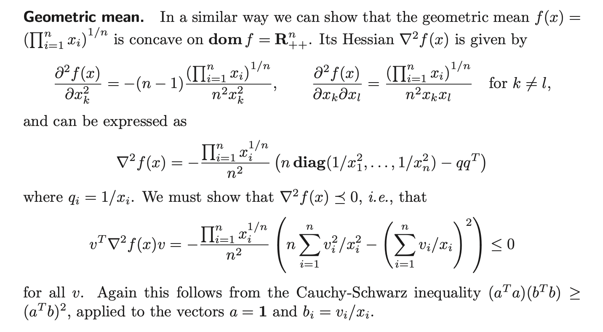
> 其中，$\frac{\partial^2 f(x)}{\partial x_k\partial x_l}=\frac{1}{n}(\frac{1}{n}-1)(\prod_{i=1}^n x_i)^{\frac{1}{n}-2}(\prod_{j\neq k}x_j)(\prod_{i\neq k,l}x_i)+\frac{1}{n}(\prod_{i=1}^n x_i)^{\frac{1}{n}-1}(\prod_{i\neq k,l}x_i)=\frac{(\prod_{i=1}^nx_i)^{\frac{1}{n}}}{n^2x_kx_l}$
> 6. **Log-Determinant:**
> 

> **推导中使用到了几个重要的性质：**
> 1. $det(ABC)=det(A)det(B)det(C)$
> 2. If $Z\in \mathbf{S}_{++}$, then $Z^{-\frac{1}{2}}$exists.
> 3. If the eigenvalues for $\mathbf{A}$are $\sigma_i(\mathbf{A})$ and $\sigma_{i}(\mathbf{B})$for $\mathbf{B}$,then the eigenvalues for $\mathbf{A}+\mathbf{B}$are $\sigma_i(\mathbf{A})+\sigma_i(\mathbf{B})$。

# Operations Preserving Convexity
## Restricted to a Line
> 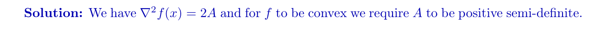
> 这个情况说的是，如果一个函数$g(t)$定义为$f$沿着$\forall \vec{v}$的方向的取值，且$g$为凸函数，则$f$为凸函数。几何上来说，如果$f$以$\vec{x}$为起点，如果其向着任意方向定义的函数$g(t)$都是凸函数的话，则$f$为凸函数。
> 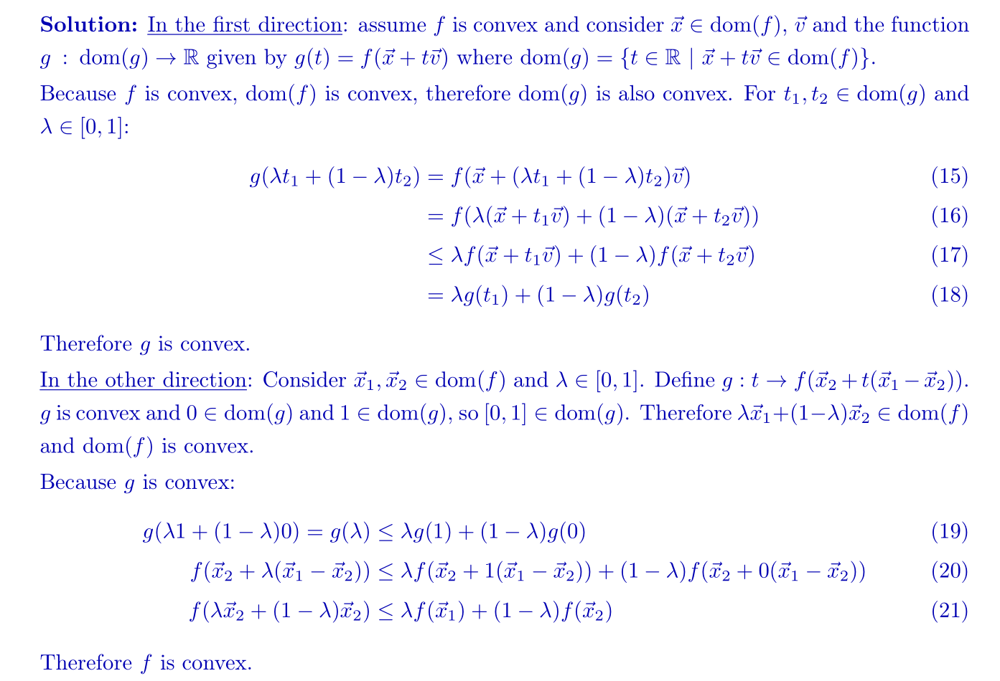

## Affine Mapping
### Affine Function
> 对于$f:\mathbb{R}^n\to \mathbb{R}$来说，我们有$f(\vec{x})=A\vec{x}+\vec{b}$is convex.
> Proof by ZOC:
> 首先$dom(f)=\mathbb{R}^n$, 这肯定是一个`Convex Set`，其次$\forall\vec{x},\vec{y}\in dom(f),\theta\in [0,1]$, 我们有$f(\theta\vec{x}+(1-\theta)\vec{y})=A(\theta\vec{x}+(1-\theta)\vec{y})=\theta (A\vec{x}+\vec{b})+(1-\theta)(A\vec{y}+\vec{b})=\theta f(\vec{x})+(1-\theta)f(\vec{y})$
> 所以$f$is convex.

### Affine Composition
> 
> **Proof:**
> If f is convex, then $\forall A\vec{x}+\vec{b},A\vec{y}+\vec{b}\in dom(f),\theta \in [0,1]$, we have:
> $\begin{aligned}f(\theta(A\vec{x}+\vec{b})+(1-\theta)f(A\vec{x}+\vec{b}))&\leq \theta f(A\vec{x}+\vec{b})+(1-\theta)f(A\vec{x}+\vec{b})\\f(A(\theta\vec{x}+(1-\theta )\vec{y})+\vec{b})&\leq \theta g(\vec{x})+(1-\theta)g(\vec{y})\\g(\theta\vec{x}+(1-\theta)\vec{y})&\leq \theta g(\vec{x})+(1-\theta)g(\vec{y})\end{aligned}$
> Moreover, since $f$is convex, then $dom(f)$is convex by definition, so $dom(g)$is convex by easy calculation，which together shows that $g$is convex.
> If g is convex, then $\forall \vec{x},\vec{y}\in dom(g),\theta\in [0,1]$, we have:
> $\begin{aligned}g(\theta\vec{x}+(1-\theta)\vec{y})&\leq \theta g(\vec{x})+(1-\theta)g(\vec{y})\\f(A(\theta \vec{x}+(1-\theta)\vec{y})+\vec{b})&\leq \theta f(A\vec{x}+\vec{b})+(1-\theta)f(A\vec{y}+\vec{b})\\f(\theta(A\vec{x}+\vec{b})+(1-\theta)(A\vec{y}+\vec{b}))&\leq\theta f(A\vec{x}+\vec{b})+(1-\theta)f(A\vec{y}+\vec{b})\end{aligned}$
> which shows that $f$is convex.
> Moreover, since $g$is convex, then $dom(g)$is convex by definition, so $dom(f)$is convex by easy calculation，which together shows that $g$is convex.

## Non-negative Weighted Sum
> 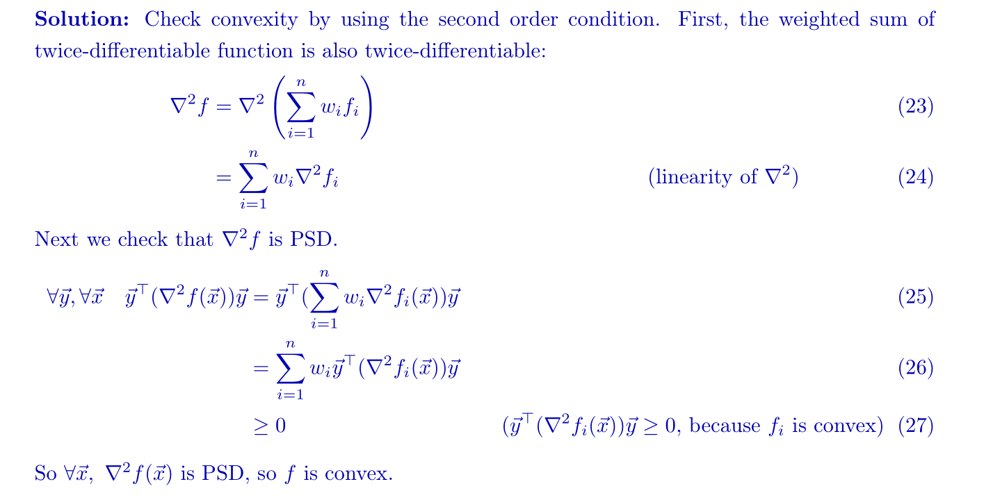

## Pointwise Maximum
### Fundations
> 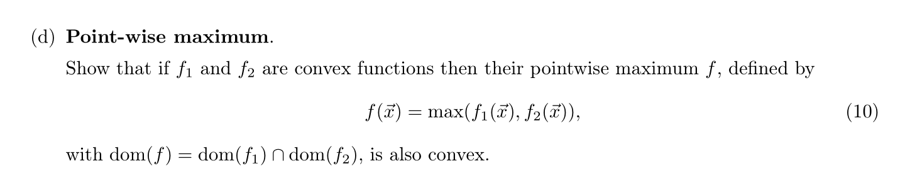
> **证明一: Proof by Property of Maximum**
> 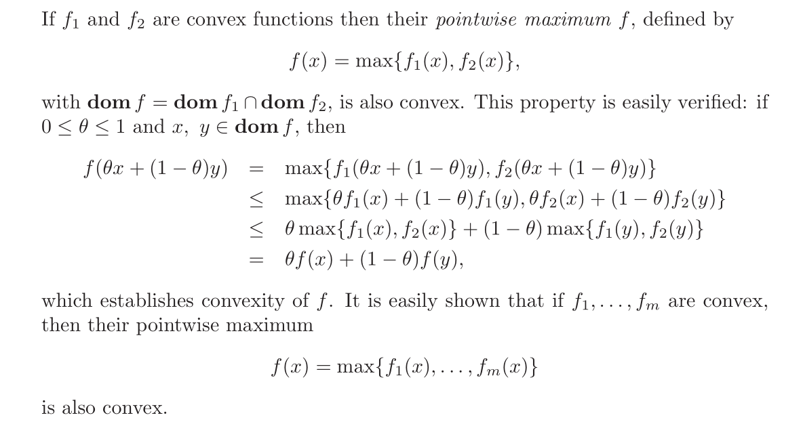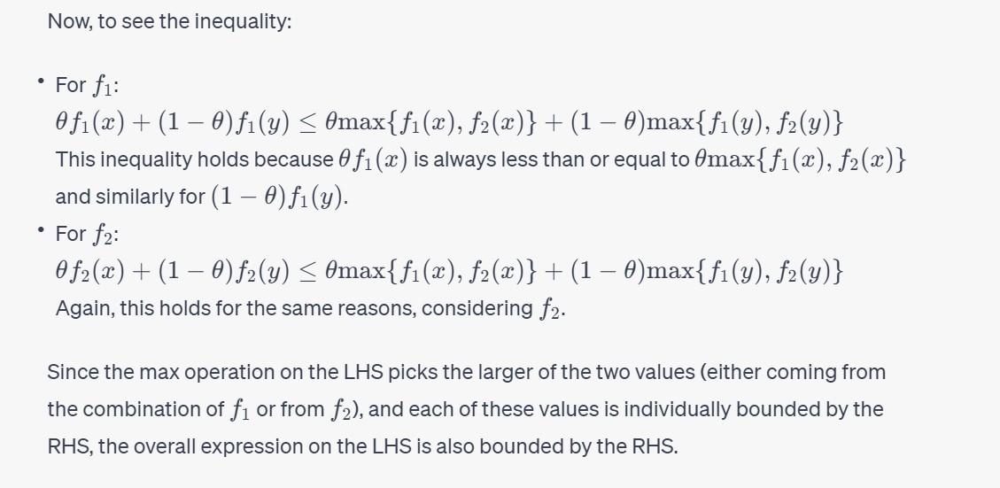
> **证明二: Proof by Epigraph**
> 

### Piecewise Linear Function
> As an extension to point-wise maximum
> 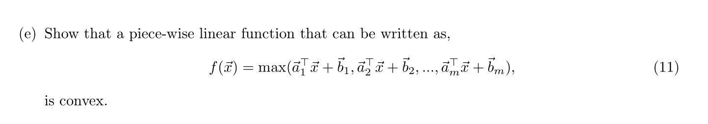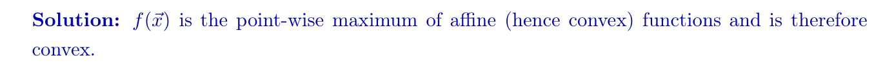

### NN Weighted Sum of r largest components
> 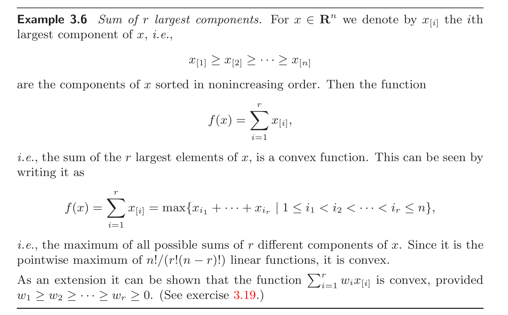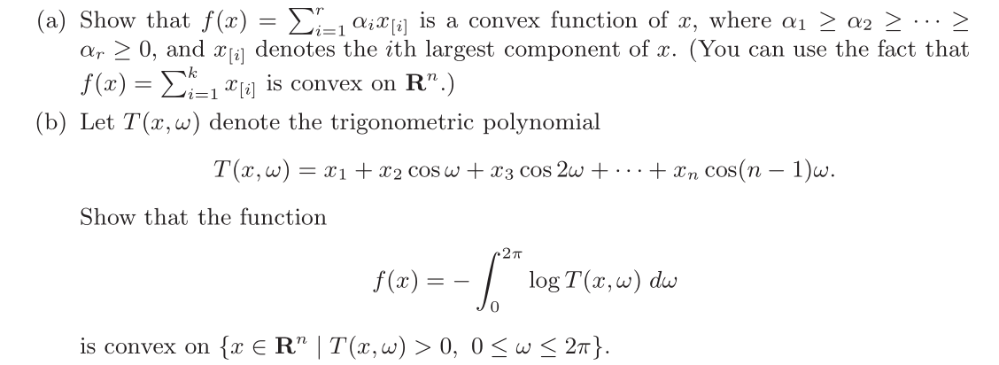
> **对于**$(a)$**来说:**
> 我们可以将$f(x)$表示为$\max\{\vec{c}_1^{\top}\vec{x},\vec{c}_2^{\top}\vec{x},\cdots, \vec{c}_{\frac{n!}{(n-r)!r!}}^{\top}\vec{x}\}$，其中$\vec{c}_i$可以理解为从$\vec{\alpha}\in \mathbb{R}^n$中取$r$个子元素，一共有$\frac{n!}{(n-r)!r!}$种取法。因为$\vec{c}_i^{\top}\vec{x}$是`Affine Functions(Convex)`, 所以$\max\{\vec{c}_1^{\top}\vec{x},\vec{c}_2^{\top}\vec{x},\cdots, \vec{c}_{\frac{n!}{(n-r)!r!}}^{\top}\vec{x}\}$是`Convex Function`
> **对于**$(b)$**来说:**
> s

## Composition of functions
> 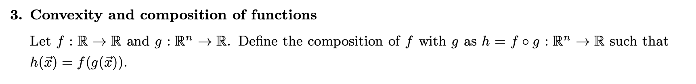

**Proofs**

