# Versions of Gradient Descent
> [!motiv] Motivation
> 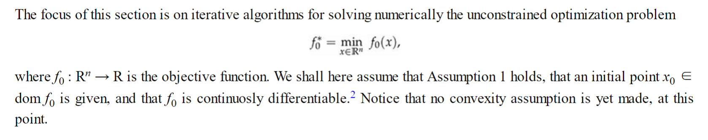

## First Order Descent Methods
### Algorithm Scheme
> [!algo] Algorithm
> 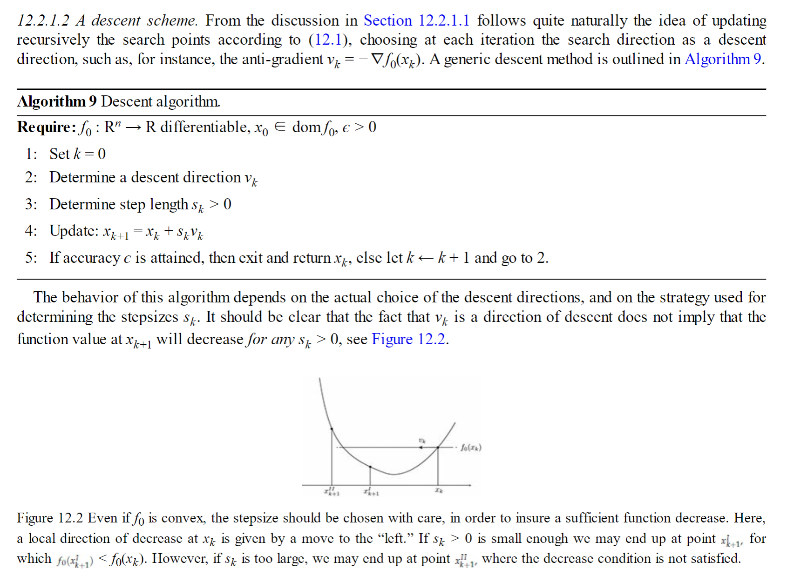

### Descent Directions
> [!important]
> 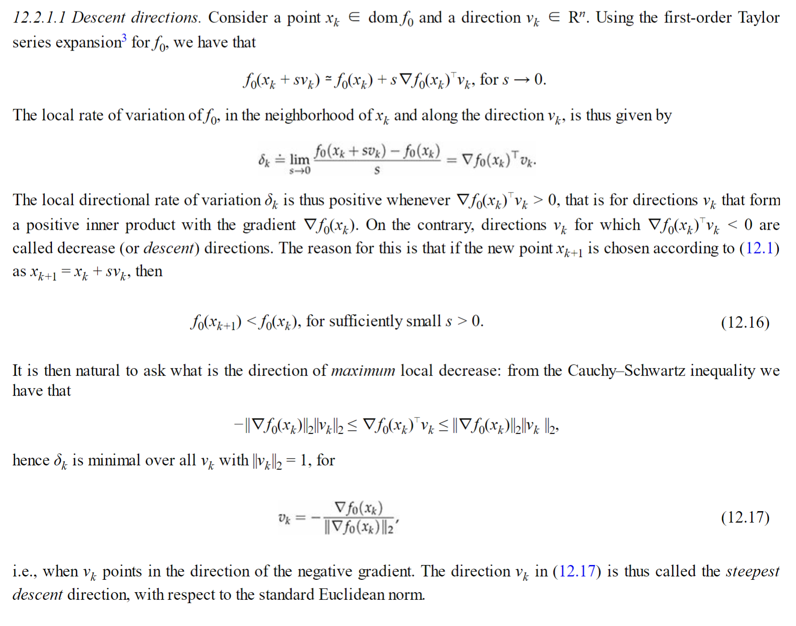

### Stepsize Selection
> [!important]
> 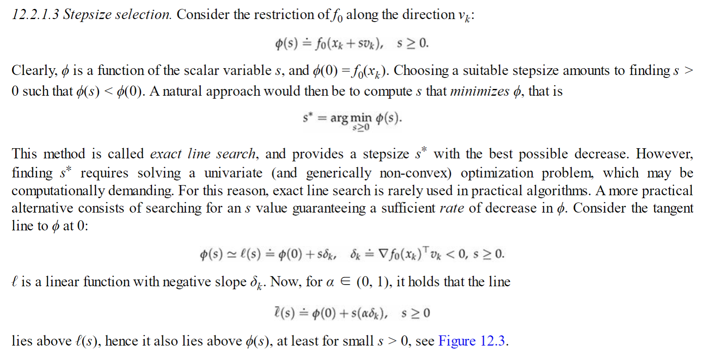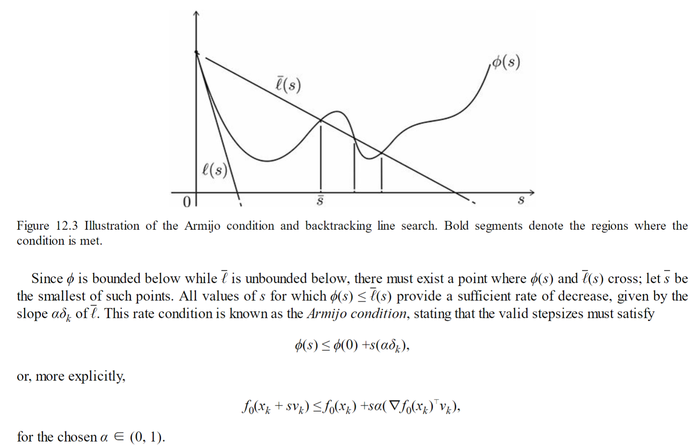

### BackTracking Line Search
> [!Algo] Algorithm
> 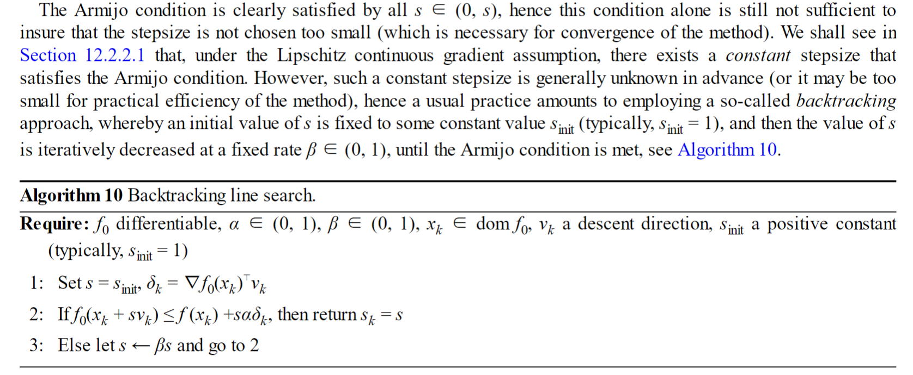

## Steepest Gradient Descent
### Motivation
> [!motiv] Motivation
> 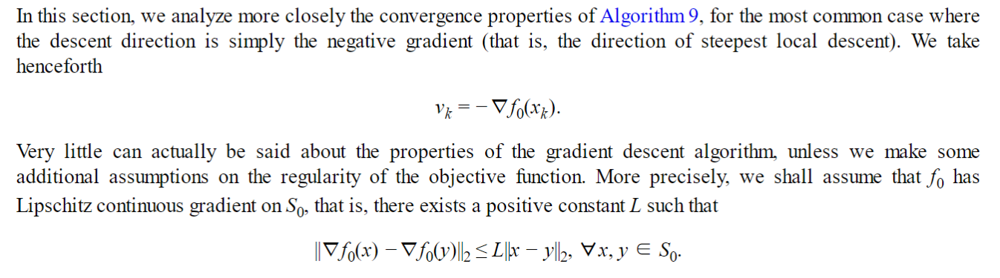

### Direction Steepest Ascent
> [!thm]
> 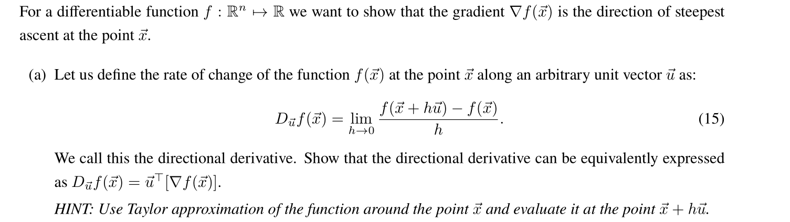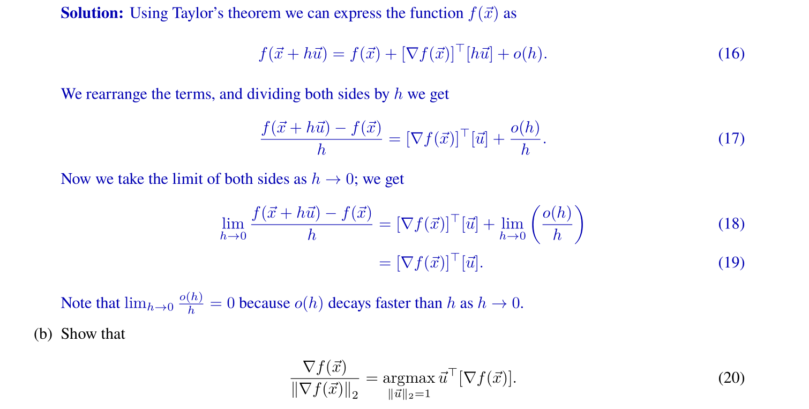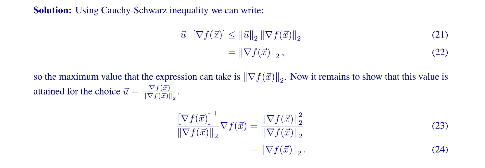

## Stochastic Gradient Descent
> [!def]

# Convergence Analysis of Steepest G.D.
## Matrix Limit Perspective
### Version 1 - Control Problem
> [!important]
> Consider this function $f(\vec{x})=\|\vec{A} \vec{x}-\vec{b}\|$ and the umonstrained optimization problem$$\min _{\vec{x} \in R^n}\|A \vec{x}-\vec{b}\| \text {. }$$We want to show the condition that step size $\eta$ must fulfill in order for gradient descent to converge.
> The single step strepest gradient descent goes like this:$$\vec{x}_{k+1}=\vec{x}_k-\eta \cdot \nabla f\left(\vec{x}_k\right), \eta>0$$So we want to compute the gradient of $f(\vec{x})$ :$$\begin{aligned}\|A \vec{x}-\vec{b}\|_2^2 & =\vec{x}^{\top} A^{\top} A \vec{x}-2 \vec{b}^{\top} A \vec{x}+\|\vec{b}\|_2^2 \\\nabla f(\vec{x}) & =2 A^{\top} A \vec{x}-2 A^{\top} \vec{b} . \\& =2 A^{\top}(A \vec{x}-\vec{b})\end{aligned}$$Thus $\vec{x}_{k+1}=\vec{x}_k-\eta \cdot 2 A^{\top}(A \vec{x}-\vec{b})$
> In order for $\vec{x}_k$ to converge to our least-square solution we want to show that $\vec{x}_{k+1}-\vec{x}_* \rightarrow 0$ as $k \rightarrow \infty$, it's equivalent to show something like:
> $\vec{x}_{k+1}-\vec{x}_*=C^{k+1}\left(\vec{x}_0-\vec{x}_*\right)$ where $C$ controls our convergence.$$\begin{aligned}\because \vec{x}_{k+1}-\vec{x}_* & =\vec{x}_{k+1}-\left(A^{\top} A\right)^{-1} A^{\top} \vec{b} \\& =\vec{x}_k-2 \eta A^{\top}\left(A \vec{x}_k-\vec{b}\right)-\left(A^{\top} A\right)^{-1} A^{\top} \vec{b} \\& =\vec{x}_k-2 \eta A^{\top} A \vec{x}_k+2 \eta A^{\top} \vec{b}-\left(A^{\top} A\right)^{-1} A^{\top} \vec{b} \\& =\vec{x}_k-2 \eta A^{\top} A \vec{x}_k+2 \eta\left(A^{\top} A\right)\left(A^{\top} A\right)^{-1} A^{\top} \vec{b}-\left(A^{\top} A\right)^{-1} A^{\top} \vec{b} \\& =\left(I_n-2 \eta A^{\top} A\right) \vec{x}_k+\left(2 \eta A^{\top} A-I_n\right)\left(A^{\top} A\right)^{-1} A^{\top} \vec{b} \\& =\left(I_n-2 \eta A^{\top} A\right) \vec{x}_k-\left(I_n-2 \eta A^{\top} A\right)\left(A^{\top} A\right)^{-1} A^{\top} \vec{b} \\& =\left(I_n-2 \eta A^{\top} A\right)\left(\vec{x}_k-\vec{x}_*\right)\end{aligned}$$Let $\vec{z}_{k+1}=\vec{x}_{k+1}-\vec{x}_*$Then we have the following recurrence equation:$$\vec{z}_{k+1}=\left(I_n-2 \eta A^{\top} A\right) \vec{z}_k$$Solve for it and we get:$$\vec{z}_{k+1}=\left(I_n-2 \eta A^{\top} A\right)^{k+1} \vec{z}_0$$By the knowledge from [Stability_Feedback_Control](../../EECS16B/Module2_Robotic_Control/Stability_Feedback_Control.md) for differential system we know that, in order for $\left\|\vec{z}_{k+1}\right\|$ to be bounded, the. eigenvalues of $I_n-2 \eta A^{\top} A$ should be between 0 and 1 . Thus the convergence condition requires.$$\begin{aligned}-1 & \leq 1-2 \eta \lambda_k\left(A^{\top} A\right) \leqslant 1 & \forall k=1,2, \cdots, n \\\Leftrightarrow & 0 \leq \eta \lambda_k\left(A^{\top} A\right) \leqslant 1 & \forall k=1,2, \cdots, n . \\\Leftrightarrow & 0 \leqslant \lambda_k\left(A^{\top} A\right) \leqslant \frac{1}{\eta} & \forall k=1,2, \cdots, n\end{aligned}$$
> Which means that $0<\eta<\frac{1}{\sigma_1^2}$, where $\sigma_1$ denotes the maximum singular value of $A$.

### Version 2 - Matrix Limit
> [!important]
> 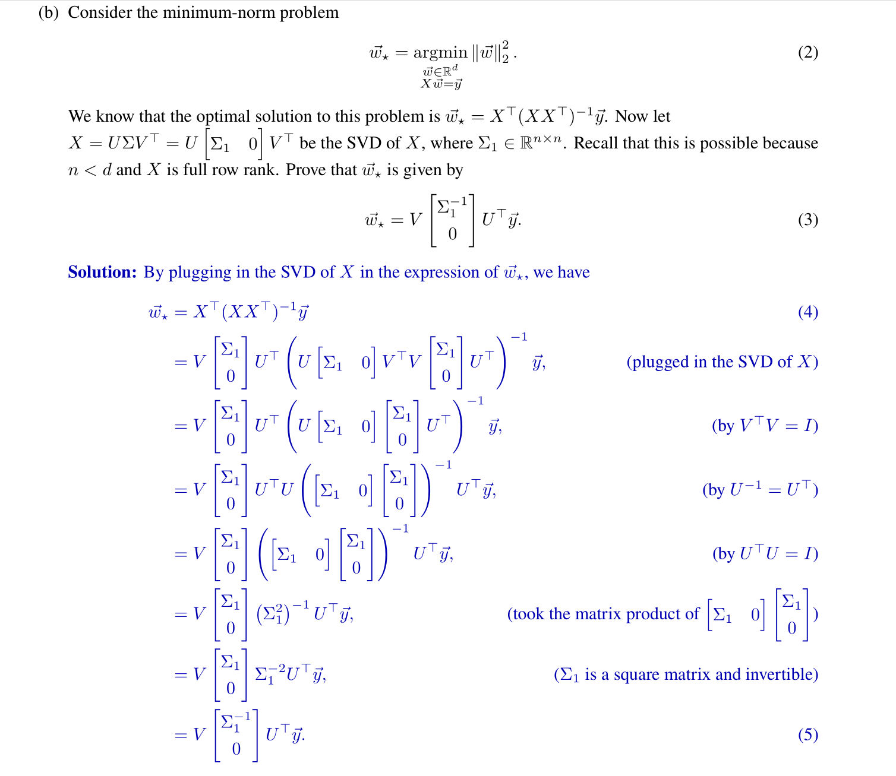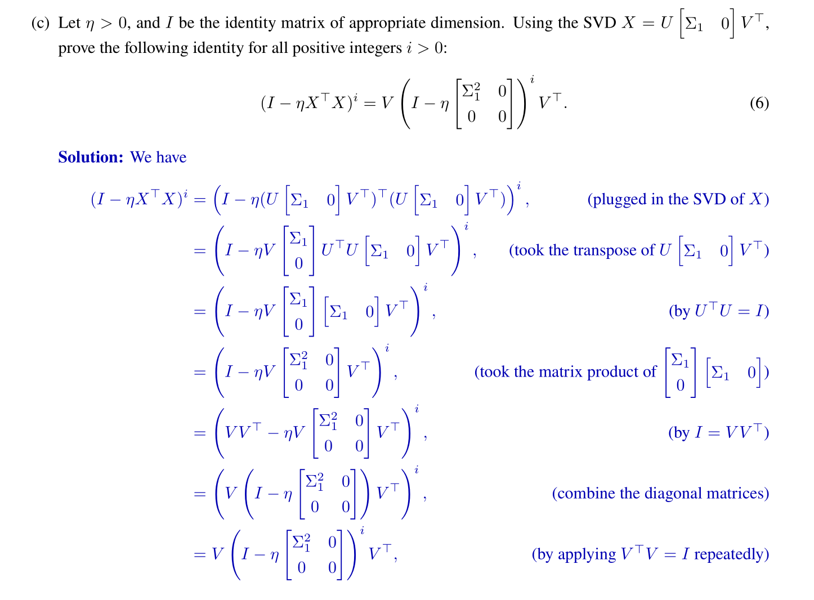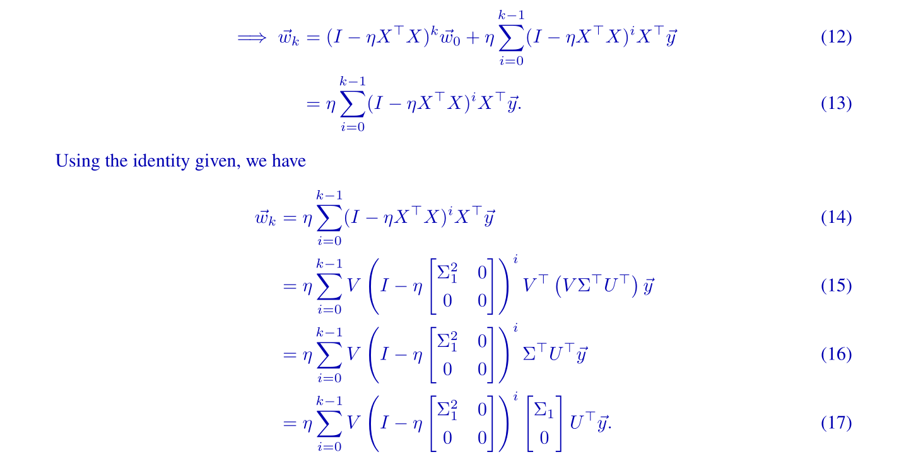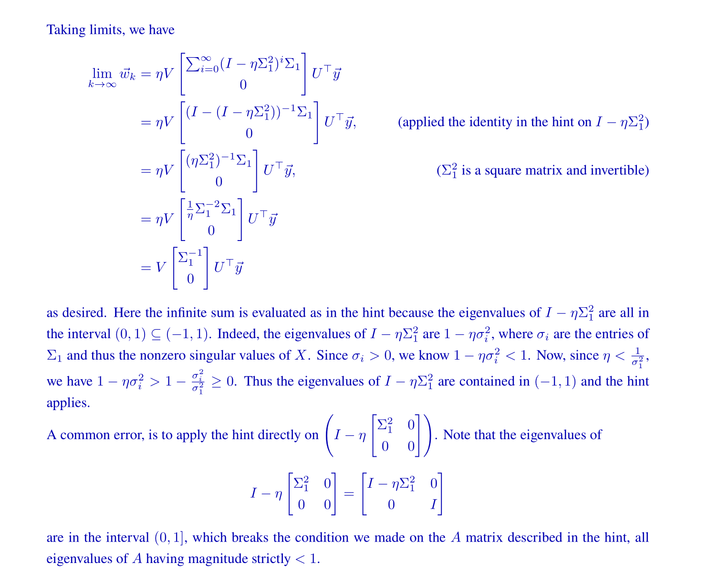

## Eigenvalue Perspective
> [!example]
> NYU-DS-GA-1014 Fa20 HW12
> 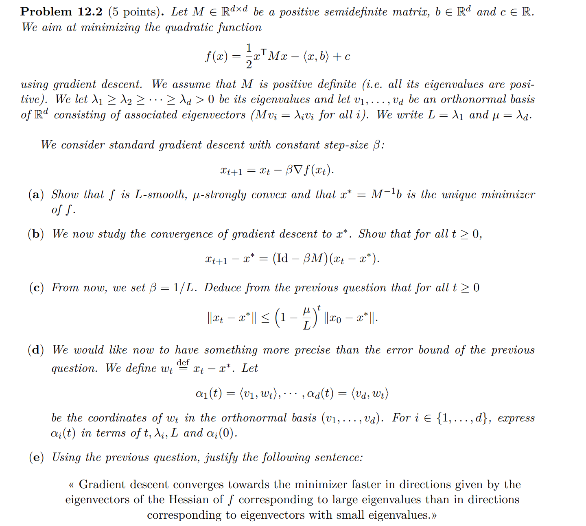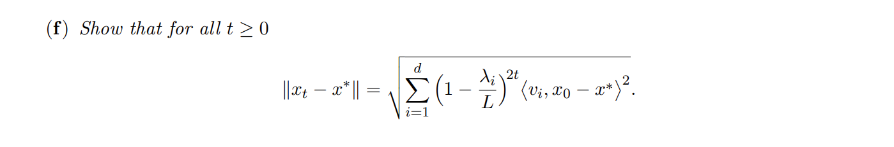

> [!proof] Proof (a)
> Since $\mu$-strongly convex implies strong convexity, we know that $f(\vec{x})$ is strongly convex. 
> By the first order condition we have $\forall \vec{x}\neq \vec{x}_*,f(\vec{x})>f(\vec{x}_{*})+\nabla f(\vec{x}_*)^{\top}(\vec{x}-\vec{x}_*)$. And for all the $\vec{x}_*$ that satisfies $\nabla f(\vec{x}_*)=0$, we know by the strong convexity that $f(\vec{x})>f(\vec{x}_*)$, which means that $\vec{x}_*$ is the global minimizer(which is also unique) if $\vec{x}_*$ satisfies the first order condition.
> Now since $\nabla f(\vec{x})=M\vec{x}-\vec{b}$, if we set it to zero we get $M\vec{x}_*=\vec{b}$. Now since $\nabla^2f(\vec{x})=M$ and by the property of $\mu$-strongly convex and $L$-smooth function, we know that $L\leq \lambda_k(M)\leq\mu,\forall k=1,2,\cdots, n$。Also since $\mu>0$(definition), we know that $\lambda_d>0$, which means $M$ is P.D. Thus, we are safely to conclude that $\vec{x}_*=M^{-1}\vec{b}$, which is unique global minimizer.

> [!proof] Proof (b)
> 

> [!proof] Proof (c)
> 

> [!proof] Proof (d)
> 

> [!proof] Proof (e)
> 

> [!proof] Proof (f)
> 

## Theorem - Any U-strongly&L-Smooth Functions
### Important Lemma
> [!important]
> 从 [Quadratic Bounds](../3_Convex_Optimization/Convex_Functions.md#Quadratic%20Bounds)  我们知道，对于一个$\mu$-strongly convex且$L$-Smooth的函数，我们有:
> $\forall\vec{x},\vec{y}\in dom(f)$:
> $$\begin{aligned}f(\vec{y})&\leq f(\vec{x})+\nabla f(\vec{x})^{\top}(\vec{y}-\vec{x})+\frac{L}{2}\|\vec{y}-\vec{x}\|_2^2\\&\geq f(\vec{x})+\nabla f(\vec{x})^{\top}(\vec{y}-\vec{x})+\frac{\mu}{2}\|\vec{y}-\vec{x}\|_2^2\end{aligned}$$  
> 这个`Lemma`暗含了这类函数的一个重要性质：如果我们在这类函数上进行梯度下降算法，则总是存在一个`Step Size` $\eta=\frac{1}{L}$使得梯度下降的过程收敛。

### Main Theorem - Version 1
> [!thm]
> (Main thm)Given the gradient step:$$\overrightarrow{x_{t+1}}=\overrightarrow{x_t}-\eta \cdot \nabla f\left(\overrightarrow{x_t}\right)$$, we want to prove: $$\left\|\overrightarrow{x_{t+1}}-\overrightarrow{x_*}\right\|_2^2 \leq\left(1-\frac{\mu}{L}\right)^{t+1}\left\|\overrightarrow{x_0}-\overrightarrow{x_*}\right\|_2^2 \text {. }$$ for all $\mu$-strongly convex and $L$-smooth function for some $\mu$ and $L$.
> 

> [!proof]
> Gradient step.$$\begin{aligned}\left\|\vec{x}_{t+1}-\vec{x}_*\right\|_2^2 & =\left\|\vec{x}_t-\eta \cdot \nabla f\left(\vec{x}_t\right)-\vec{x}_*\right\|_2^2 \quad \text { Gradient step. } \\& \left.=\| \vec{x}_t-\vec{x}_*\right||_2^2-\eta \cdot \nabla f\left(\vec{x}_t\right) \|_2^2 \\& =\left\|\vec{x}_t-\vec{x}_*\right\|_2^2+\eta^2\left\|\nabla f\left(x_t\right)\right\|_2^2-2 \eta \cdot \nabla f(x)^{\top}\left(\vec{x}_t-\vec{x}_*\right)\\& \leq\left\|\vec{x}_t-\vec{x}_*\right\|_2^2+\eta^2 \cdot 2 L \cdot \underbrace{\left(f\left(\vec{x}_t\right)\right.}-f\left(\vec{x}_*\right))-2 \eta(\underbrace{f\left(\vec{x}_t\right)-f\left(\vec{x}_*\right)}+\frac{\mu}{2}\left\|\vec{x}_t-\vec{x}_*\right\|_2) \\& =(1-\eta \cdot \mu)\left\|\vec{x}_t-\vec{x}_*\right\|_2^2+\left(2 \eta^2 l-2 \eta\right)\left[f\left(\overrightarrow{x_t}\right)-f\left(\overrightarrow{x_*}\right)\right] \text {. } \\& \leqslant\left(1-\frac{\mu}{L}\right)\left\|\vec{x}_t-\vec{x}_*\right\|_2^2  \end{aligned}$$
> $$\begin{aligned}\\& \text {，where we choose } \eta=\frac{1}{L} \Rightarrow 2 \eta(\eta L-1)=0 \end{aligned}$$
> Recursively Apply the above we get:
> $$\begin{aligned}& \left\|\overrightarrow{x_{t+1}}-\overrightarrow{x_*}\right\|_2^2 \leq\left(1-\frac{\mu}{L}\right)^{t+1}\left\|\overrightarrow{x_0}-\overrightarrow{x_*}\right\|_2^2 \text {. }\end{aligned}$$

### Main Theorem - Version 2
> 

# Convergence for Stochastic G.D.

