# Unconstrained Optimization Problem
> [!important]
> We first address the unconstrained optimization problem:
> $$\min_{\vec{x}\in \mathbb{R}^n}f_0(\vec{x})$$
> For such problem, we first need to set its gradient to zero, and compute the Hessian at this point.
> - If the hessian turns out not to be PSD/NSD, then the point is not a local minimum, it is called the saddle point.
> - Otherwise, it is a local minimum/maximum.
> 
> Then we compute the objective at these local optima and see which one delivers the minimum objective and that will be our global minimum and thus a solution to our optimization problem.

# Constrained Optimization Problem
## General Framework
> [!important] 
> For a problem like this:
> $$\begin{align}min_{\vec{x}\in\mathbb{R}^n}&f_0(\vec{x})\\&g_i(\vec{x})\leq 0,\forall i=1,2,\cdots, m\\& h_i(\vec{x})=0,\forall i=1,2,\cdots, p\end{align}$$
> where we don't have any assumptions on the convexity of our constraints. In other words, $g_{i}(\vec{x})\forall i$ don't have to be all convex and $h_i(\vec{x})$ don't have to be all affine.
> 
> We will denote our feasible region to be $$\Omega=\{\vec{x}\in \mathbb{R}^n|\begin{aligned}&g_i(\vec{x})\leq 0,\forall i=1,2,\cdots, m\\& h_i(\vec{x})=0,\forall i=1,2,\cdots, p\end{aligned}\}$$
> 
> In this case:
> 
> The first step is to check the feasibility of ==critical points== that satisfy $\nabla f_0(\vec{x})=0$ or $\nabla f_0(\vec{x})$ is undefined(think of $\|\vec{x}\|_1$case where gradient DNE at $0$ but is a critical point). If it is not in the feasible region, then we drop it from the candidates for optimal solutions.
> 
> The second step is to check the objective value on the boundary points, which are: $$\mathcal{B}=\{\vec{x}\in \mathbb{R}^n|\begin{aligned}&g_i(\vec{x})= 0,\forall i=1,2,\cdots, m\\& h_i(\vec{x})=0,\forall i=1,2,\cdots, p\end{aligned}\}$$ 
> 
> Finally, we will compare the candidates that we find from the zero gradient point and the boundary points and see which ones deliver the minimum objective value.

## LICQ Framework
> [!def]
> Sometimes our feasible regions are complicated and it will be difficult to use the general framework, then we will opt to the following optimality condition:
> 
> The above theorem can be rewritten into formal KKT representation:
> 
> 
> 
> $LICQ$ eliminates the possibility that some gradient vectors can be expressed in terms of other gradient vectors. It turns out that $LICQ$ is non-trivial since it guarantees necessity of KKT for optimality. Note that we only requires those active constraints to be linearly independent for reasons seen later on.
> 
> This theorem says that if $\vec{x}$ is one of the optimal solutions and satisfy $LICQ$(regularity condition) to the constrained optimization problem, then it has to satisfy this optimality condition but not the other way around. In other words, if $\vec{x}$ is a solution and satisfies $LICQ$(regular condition), then KKT condition is necessary condition for optimality.
> 
> Note that for any optimization problem, First Order Optimality Condition(KKT Conditions actually) is ==neither a necessary condition nor a sufficient condition for optimality==, which means if we solve for it we still cannot have any idea of whether they are optimal.
> 
> Also note that we can construct KKT conditions for all optimization problems(convex or not, strong duality or not). It is just that the solution to KKT conditions will have different interpretations depending on the formulation of our optimization problem.
> 
> So under this framework, the best thing we can do is to check if $LICQ$ holds for $\vec{x}$ that we solve from the KKT conditions, if it holds, then necessity is met, then we still have to check whether these points are local minima/maxima and compare their objective values to get the global solutions since KKT is only necessary for optimality, which means the solutions that we get may contain other points that are not optimal points.

> [!proof] Proof for optimality condition $m=1,p=0$ case
> Suppose we have an optimal solution for the optimization problem, denote it by $\vec{x}^*$, we want to show that it satisfy $\nabla  f(\vec{x}^*)+\lambda\nabla g(\vec{x}^*)=0$
> Suppose for the sake of contradiction this doesn't hold, then geometrically we know that $\nabla f(\vec{x}^*)$ is not on the same line as $\nabla  g(\vec{x}^*)$, as shown in the graph below:
> 
> Then we can always find a direction $\vec{\delta_x}$, that has an obtuse angle with both $\nabla f(\vec{x}^*)$ and $\nabla g(\vec{x}^*)$ such that if we move towards this direction we will have $\nabla g(\vec{x}^*)^{\top}\vec{\delta_x}<0$ and $\nabla f(\vec{x}^*)^{\top}\vec{\delta_x}<0$. 
> 
> This delivers $g(\vec{x}^*+\vec{\delta_{x}})\approx g(\vec{x}^*)+\nabla g(\vec{x}^*)\vec{\delta_x}<g(\vec{x}^*)\leq0$ and $f(\vec{x}^*+\vec{\delta_x})\approx f(\vec{x}^*)+\nabla f(\vec{x}^*)\vec{\delta_x}<f(\vec{x}^*)$.
> 
> This means that we can always find $\vec{x}^*+\vec{\delta_x}\neq\vec{x}^*$ such that $\vec{x}^*+\vec{\delta_x}$ is feasible and $\vec{x}^*+\vec{\delta_x}$ is optimal, which is a contradiction.
> 
> The intuition behind the proof is that we want to find some points in the interior of our feasible region(not on the boundary) such that the objective value is smaller.

> [!proof] Proof for Optimality Condition - General Case
> First, notice that an equality constraint can always be rewritten into two inequality constraints, thus without generality we can just prove the case when $p=0$, which is deferred to next section.
> 

## Formal Proof of KKT Conditions
> [!overview]
> 
### Feasible Descent Directions
> [!important]
> 
> From the definition above one can quickly derive that if $\vec{d}$ is a feasible direction at $\vec{x}\in C$ then $\exists\epsilon>0,f(\vec{x}+td)<f(\vec{x}),\forall t\in [0,\epsilon]$

### The Basic Necessary Condition - No Feasible Descent Directions
> [!important]
> 
> Point-wise continuity here is enough, since we just want the non-oscillation at this particular point.

### The Fritz-John Necessary Condition
> [!thm]
> 
> We will not spend too much time on this theorem and we will utilize the result and build KKT on top of it with some regularity conditions.

### KKT for Inequality Constrained Problems
> [!thm]
> 
> The regularity condition here is just what have been mentioned above, the $LICQ$ condition. This ensures that $\lambda_0$ in the previous theorem cannot be zero.
> 
> 
> Here is one line where the reader may find confusing:
> $$\sum_{i \in I\left(\mathbf{x}^*\right)} \tilde{\lambda}_i \nabla g_i\left(\mathbf{x}^*\right)=\mathbf{0}$$.
> This holds because, initially we have $$\begin{align}\sum_{i=1}^m \tilde{\lambda}_i \nabla g_i\left(\mathbf{x}^*\right)&=\sum_{i \in I\left(\mathbf{x}^*\right)} \tilde{\lambda}_i \nabla g_i\left(\mathbf{x}^*\right)\\&+\sum_{i \notin I\left(\mathbf{x}^*\right)} \tilde{\lambda}_i \nabla g_i\left(\mathbf{x}^*\right)=\mathbf{0}\end{align}$$
> and for all non-active constraints $g_i(\vec{x})<0$ in order for the above equality to hold(equal to 0), the lagrangian multipliers have to be zero. That is, $\lambda_i=0\forall i\notin I(\vec{x})$ and we get the desired results.

### KKT for Inequality/Equality Constrained Problems
> [!thm]
> 

### KKT Points
> [!def]
> 
> Simply put, KKT points are just those points that are the solutions from KKT conditions.

## Convex Framework
> [!important]
> For a convex problem as follows:
> $$\begin{align}min_{\vec{x}\in\mathbb{R}^n}&f_0(\vec{x})\\&g_i(\vec{x})\leq 0,\forall i=1,2,\cdots, m\\& h_i(\vec{x})=0,\forall i=1,2,\cdots, p\end{align}$$
> where $g_{i}(\vec{x})\forall i$  have to be all convex function of $\vec{x}$ and $h_i(\vec{x})$ have to be all affine function of $\vec{x}$.
> 
> We will denote our feasible region to be $$\Omega=\{\vec{x}\in \mathbb{R}^n|\begin{aligned}&g_i(\vec{x})\leq 0,\forall i=1,2,\cdots, m\\& h_i(\vec{x})=0,\forall i=1,2,\cdots, p\end{aligned}\}$$
> 
> In this case: we will proceed as follows:
> 
> The first step is to check if the ==slater's condition== is met. This means whether there exists some $\vec{x}$ that 
> - Fulfill all the convex inequality constraints with strict order.
> - Fulfill affine inequality constraints with partial order.
> - Fulfill all the affine equality constraints.
> 
> The second step is to ==solve the KKT conditions== and all the solutions that we get from it should be optimal points since under convexity, KKT conditions is sufficient condition for Optimality.
> 

## Duality Framework
> [!important]
> If the problem is not convex, but has strong duality. (Notice that one can easily check strong duality under convex framework, but for general framework, strong duality cannot be easily checked. Unless someone told you so.)
> 
> Then we proceed as follows:
> The first step is to check the 

## Sufficiency and Necessity
> [!important]
> 

# Different KKT Scenarios
## When there is no KKT Points
> [!example]
> 
> Since the LICQ is satisfied, The KKT Condition is as follows:
> 1. Primal Feasibility: $x_1^2+x_2^2=1$
> 2. Dual Feasibility: $\lambda\geq 0$
> 3. Complementary Slackness: $\lambda(x_1^2+x_2^2-1)=0$
> 4. Stationary Conditions: $\begin{bmatrix}1\\1\end{bmatrix}+\lambda\begin{bmatrix}2x_1(x_1^2+x_2^2-1)\\2x_2(x_1^2+x_2^2-1)\end{bmatrix}=\begin{bmatrix}0\\0\end{bmatrix}$
> 
> Combining 1 and 4 we know that there is no KKT points. Thus can transform the problem into its equivalent formulation below, which has two KKT points, one of them is the optimal solution.
> 

## When KKT is Necessary for Optimality
> [!important]
> When KKT condition is necessary, for example strong duality holds or regularity condition holds, not all the solutions from KKT condition is really optimal points.

### LICQ Holds
> [!example]
> Consider the following example:
> $$\begin{align}\min&x_1^2+x_2^2\\s.t.&x_1^2+x_2^2=1\end{align}$$
> 
> Note that the objective function is affine and thus convex, but the equality constraint is not affine(convex actually), so it is not convex. Since there is only when equality constraint, and LICQ is satisfied for all $\vec{x}$ and thus $\vec{x}^*$, so we move to the LICQ framework to solve KKT conditions.
> 1. Primal Feasibility: $x_1^2+x_2^2=1$
> 2. Dual Feasibility: $\lambda\geq 0$
> 3. Complementary Slackness: $\lambda(x_1^2+x_2^2-1)=0$
> 4. Stationary Conditions: $\begin{bmatrix}1\\1\end{bmatrix}+\lambda\begin{bmatrix}2x_1\\2x_2\end{bmatrix}=\begin{bmatrix}0\\0\end{bmatrix}$
> 
> Solve for it we could get $\lambda=\pm\frac{1}{\sqrt{2}}$.
> Note that LICQ only ensures necessity, we have to check the optimality of each solution.
> 1. $x_1=x_2=-\frac{\sqrt{2}}{2},\lambda=\frac{1}{\sqrt{2}}$
> 2. $x_1=x_2=\frac{\sqrt{2}}{2},\lambda=-\frac{1}{\sqrt{2}}$
> 
> The hessian at both points are PSD so they are both candidates for global minima, then we evaluate the value and verify that the second one is the optimal solution. Indeed, not all KKT points are optimal solution.

## When KKT is Both N and S
> [!example] Toy Example 1
> 
> Note that this is a convex optimization problem in $(x_1,x_2)$ since the objective function $\vec{x}^{\top}\begin{bmatrix} 1&0\\0&0\end{bmatrix}\vec{x}+\begin{bmatrix} 0&-1\end{bmatrix}\begin{bmatrix} x_1\\x_2\end{bmatrix}$ is convex and the equality constraint is $\begin{bmatrix} 0&1\end{bmatrix}\begin{bmatrix} x_1\\x_2\end{bmatrix}=0$ affine.
> 
> Since the Slater's Condition holds, strong duality holds, thus we solve for KKT conditions to get:
> 1. Primal Feasibility: $x_2=0$
> 2. Dual Feasibility: None
> 3. Complementary Slackness: None
> 4. Stationary Conditions: $\begin{bmatrix}2x_1\\-1\end{bmatrix}+\lambda\begin{bmatrix}0\\1\end{bmatrix}=\begin{bmatrix}0\\0\end{bmatrix}$
> 
> We could get $(\vec{x}^*,\lambda^*)=(\begin{bmatrix}0\\0 \end{bmatrix},1)$ and it is the optimal solution.
> 

> [!example ] Toy Example 2
> 

> [!example] EECS127 HW10 P4 - KKT with Circles
> 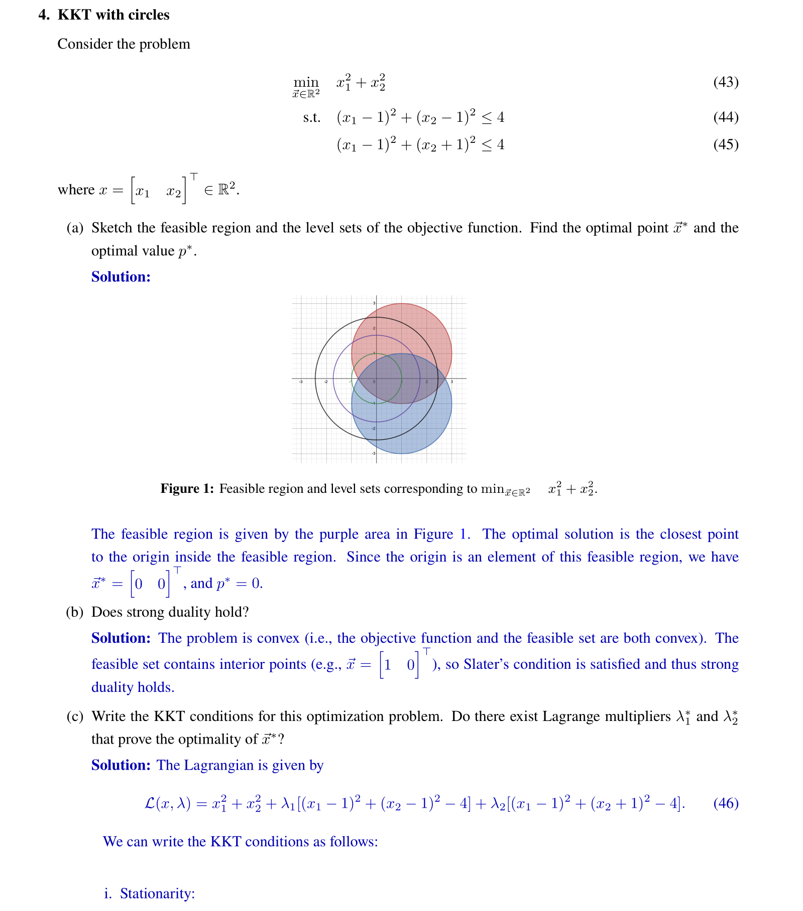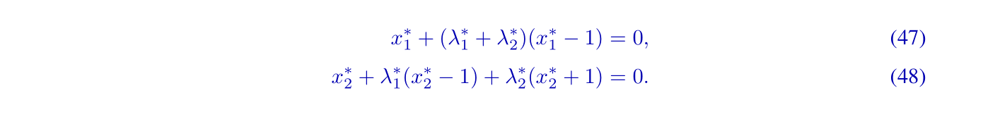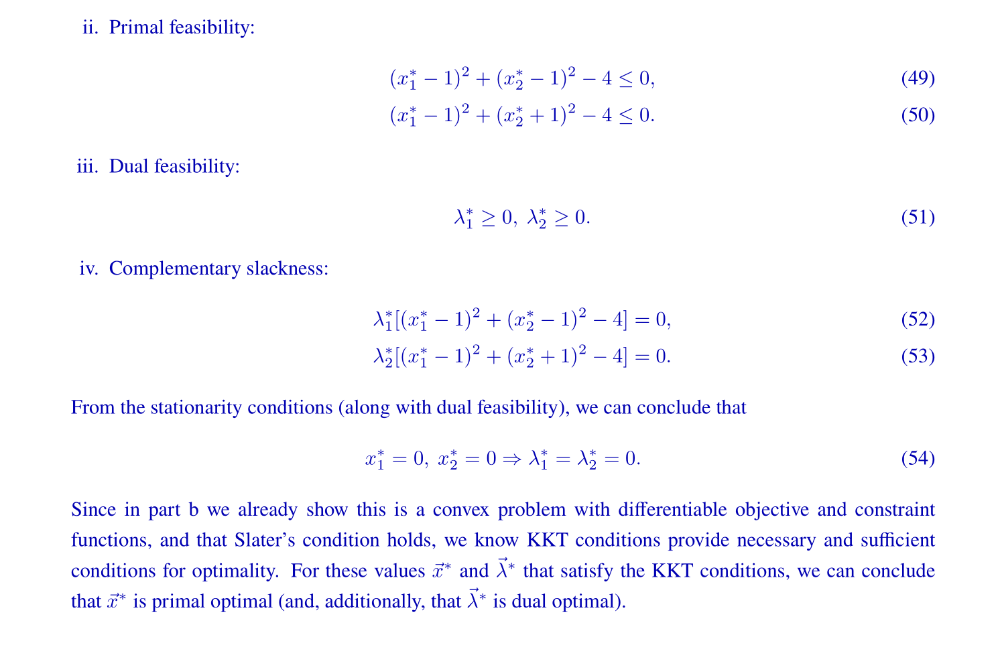
> The answer is a bit too simplified, normally we will break up into four cases where 
> - $\lambda_1=\lambda_2=0$
> - $\lambda_1>0,\lambda_2=0$
> - $\lambda_1=0,\lambda_2>0$
> - $\lambda_1=0,\lambda_2=0$ 
> 
> and see if there is any solution under each of these cases.

## When KKT is only Sufficient
> [!important]
> When we only have sufficiency, for example convex program. Solutions to KKT conditions cannot capture all the optimal solutions.

> [!example] Toy Example 1
> 
> 
> This is a convex program, but the slater's condition is not met since the only feasible points for $x_2$ is $x_2=0$, which is on the boundary. But the sufficiency is always met. Thus we solve for KKT conditions to get:
> 1. Primal Feasibility: $x_2^2\leq0$
> 2. Dual Feasibility: $\lambda\geq 0$
> 3. Complementary Slackness: $\lambda(x_2^2)=0$
> 4. Stationary Conditions: $\begin{bmatrix}2x_1\\-1\end{bmatrix}+\lambda\begin{bmatrix}0\\2x_2\end{bmatrix}=\begin{bmatrix}0\\0\end{bmatrix}$
> 
> From 4 we know $\lambda\neq 0$, then from 3 we know $x_2=0$ which contradicts with 1, so we don't have KKT points. Since here we only have sufficiency, we can only get those optimal points that satisfy the KKT, but those optimal points that don't satisfy the KKT will be missing here, which is $(0,0)$.
> 
> Also we see $(0,0)$ doesn't satisfy regularity condition, since $x_2=0$ is not linear independent(any set containing zero vector is not linearly independent), so necessity doesn't hold.

> [!example] Ridge Regression
> 

# Efficiently Solving KKT Conditions
## Information Theory - Eliminating Constraints
> [!example] EECS127 HW10 P5 Information Theory - Simplifying KKT Conditions
> 
> This is actually part of a problem from Fa20 HW6 P2

# Duality Problem Solving Strategies
## Optimizing Over Multiple Variables
> [!important]
> The first part shows that if we are minimizing over multiple variables, we can minimize them one at a time and reach the joint minimum.
> 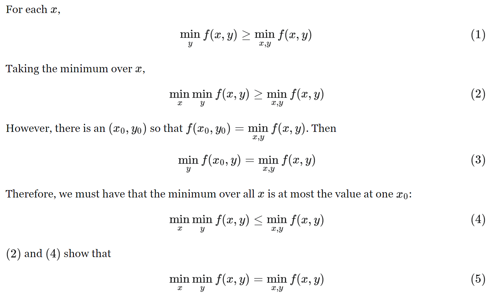
> The second part shows that the order of partial minimization doesn't matter.
> 
> 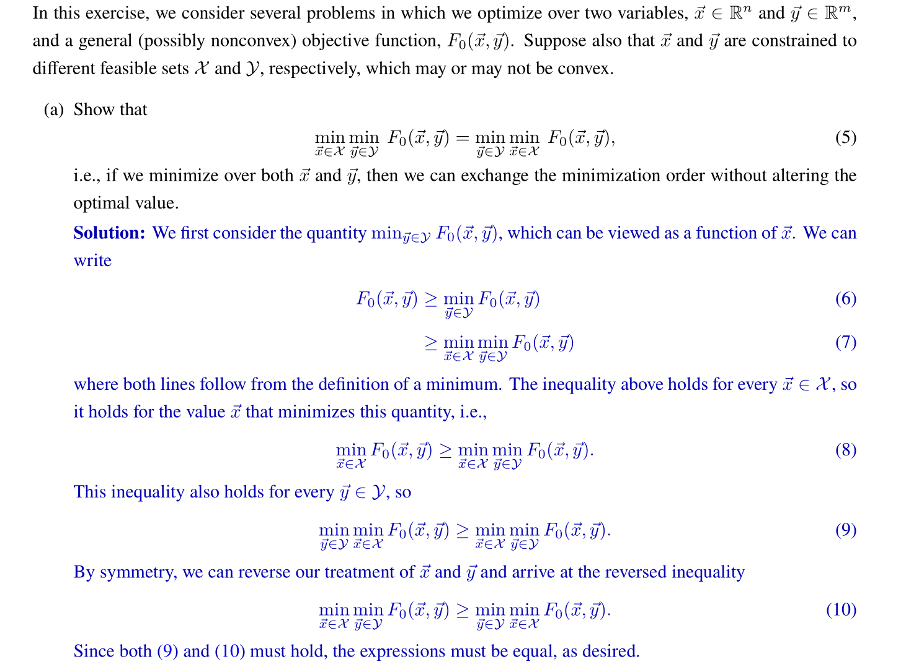
> Actually in the BV textbook, it says that we can always minimize a function by first minimizing over some of the variables, and then minimizing over the remaining ones. This simple and general principle can be used to transform problems into equivalent forms.
> 
> 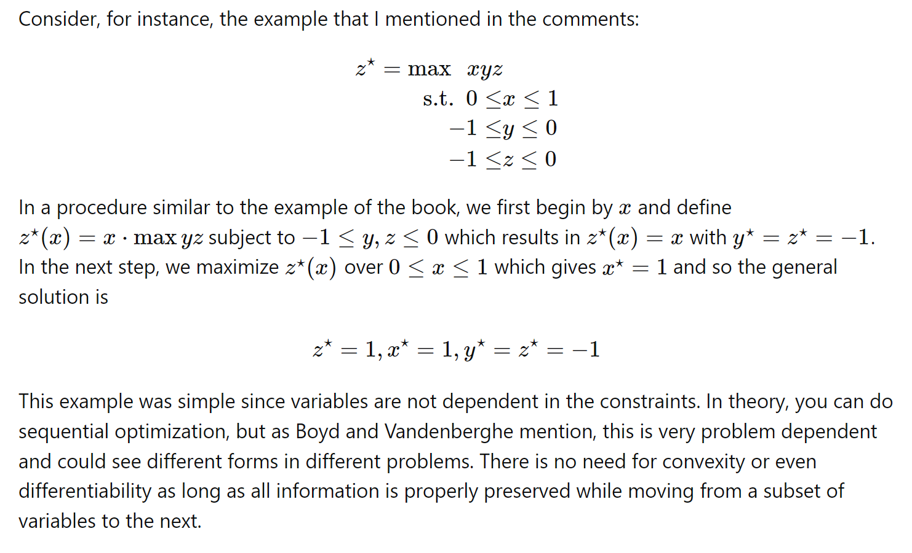

## Partial Dualizing
> [!important]
> If strong duality doesn't hold, then different dual problem won't always be equivalent. But the optimal value of the dual problem is always the same.

### Example 1: Strong Duality -> Same Dual Problem
> [!example] HW09 Fa22 P3 
> 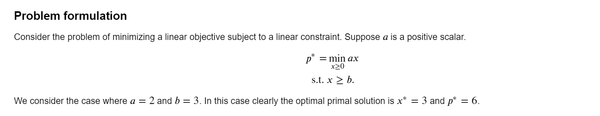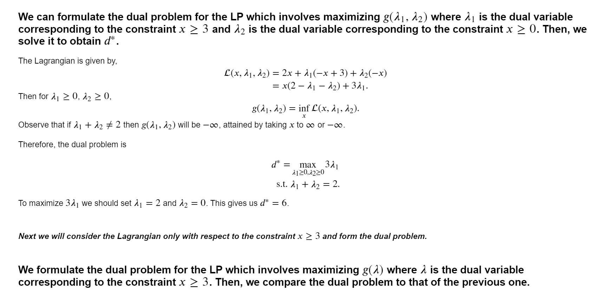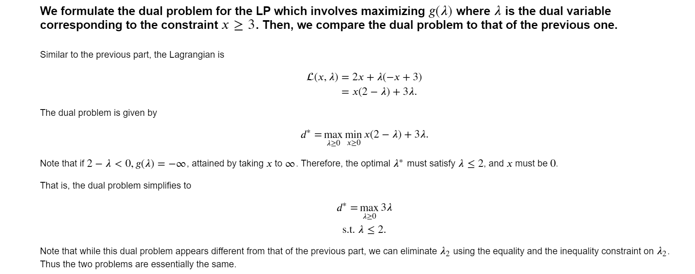

### Example 2: No Strong Duality -> Different Dual Problem
> [!example] HW09 Fa22 P3 Different Dualization, Same Optimal Value
> 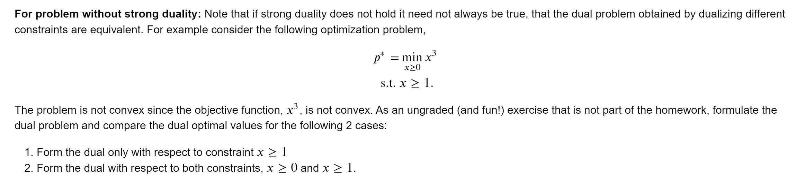
> (1): Dualizing $x \geqslant 1$ :
> $$
> d^*=\max _{\lambda \geqslant 0} \min _{x \geqslant 0} x^3+\lambda(1-x)$$
> For $\min _{x \geqslant 0} L(x, \lambda)=\min _{x \geqslant 0} x^3+\lambda(1-x)$,
> Set: $\nabla_x L(x, \lambda)=0 \Rightarrow x^*=\sqrt{\frac{\lambda}{3}} \Rightarrow L\left(x^*, \lambda\right)=\left(\frac{\lambda}{3}\right)^{\frac{3}{2}}+\lambda\left(1-\sqrt{\frac{\lambda}{3}}\right)$
> Since $L(x, \lambda)$ isn't convex, for the boundary point $x=0$, we have: $L(0, \lambda)=\lambda$
> $$\begin{aligned}& \because\left(\frac{\lambda}{3}\right)^{\frac{3}{2}}+\lambda\left(1-\sqrt{\frac{\lambda}{3}}\right)-\lambda<0 \\
> & \therefore x^*=\sqrt{\frac{\lambda}{3}} \\& \therefore d^*=\max _{\lambda \geqslant 0}\left(\frac{\lambda}{3}\right)^{\frac{3}{2}}+\lambda\left(1-\sqrt{\frac{\lambda}{3}}\right)\end{aligned}$$
> Since dual function is always concave, we set: $\nabla_\lambda g(\lambda)=0$
> $$
> \begin{aligned}& \therefore \quad \frac{3}{2} \cdot \frac{1}{3} \cdot \sqrt{\frac{\lambda}{3}}+1-\sqrt{\frac{\lambda}{3}}-\lambda \cdot \frac{1}{2} \cdot \frac{1}{3} \cdot \sqrt{\frac{3}{\lambda}}=0 \\& \therefore \lambda=3 \\& \therefore d^*=1\end{aligned}$$
> (2): Dualizing $x \geqslant 0$ and $x \geqslant 1$
> $$d^*=\max _{\lambda_1, \lambda_2 \geq 0} \min _x x^3+\lambda_1(-x)+\lambda_2(1-x)$$
> For $\min _x x^3+\lambda_1(-x)+\lambda_2(1-x)$
> Set $\nabla_x L(x, \vec{\lambda})=0 \Rightarrow 3 x^2-\lambda_1-\lambda_2=0 \Rightarrow x= \pm \sqrt{\frac{\lambda_1+\lambda_2}{3}}$
> $$\nabla_x^2 L(x, \vec{\lambda})=6 x$$
> This imply $x^*=\sqrt{\frac{\lambda_1+\lambda_2}{3}}$
> $$\therefore g(\vec{\lambda})=\left(\frac{\lambda_1+\lambda_2}{3}\right)^{\frac{3}{2}}-\lambda_1 \sqrt{\frac{\lambda_1+\lambda_2}{3}}+\lambda_2\left(1-\sqrt{\frac{\lambda_1+\lambda_2}{3}}\right)$$
> $\because g$ is concave
> $$\begin{aligned}& \therefore \nabla \rightarrow g\left(x_2\right)=\left[\begin{array}{l}\frac{3}{2} \cdot \frac{1}{3} \cdot \sqrt{\frac{\lambda_1+\lambda_2}{3}}-\sqrt{\frac{\lambda_{1+2}+\lambda_2}{3}}-\frac{1}{6} \lambda_1 \sqrt{\frac{3}{\lambda_1+\lambda_2}}-\frac{1}{6} \lambda_2 \sqrt{\frac{3}{\lambda_1+\lambda_2}} \\\frac{3}{2} \cdot \frac{1}{3} \sqrt{\frac{\lambda_1+\lambda_2}{3}}-\frac{1}{6} \lambda_1 \sqrt{\frac{3}{\lambda_1+\lambda_2}}+1-\sqrt{\frac{\lambda_1+\lambda_2}{3}}-\frac{\lambda_2}{6} \lambda_2 \sqrt{\frac{3}{\lambda_1+\lambda_2}}\end{array}\right]=\left[\begin{array}{l}0 \\0\end{array}\right] \\& =\left[\begin{array}{l}-\frac{1}{2} \sqrt{\frac{\lambda_1+\lambda_2}{3}}-\frac{1}{6} \sqrt{3\left(\lambda_1+\lambda_2\right)} \\-\frac{1}{2} \sqrt{\frac{\lambda_1+\lambda_2}{3}}+1-\frac{1}{6} \sqrt{3\left(\lambda_1+\lambda_2\right)}\end{array}\right]=\left[\begin{array}{l}0 \\0\end{array}\right] \\& =\left[\begin{array}{c}-\frac{\sqrt{3}}{3} \sqrt{x_1+\lambda_2} \\1-\frac{\sqrt{3}}{3} \sqrt{\lambda_1+\lambda_2}\end{array}\right]=\left[\begin{array}{l}0 \\0\end{array}\right] \\&\end{aligned}$$
> $\therefore$ No solution
> Now checking the boundary
> (1):$$
> \begin{aligned} g(\vec{\lambda})=\left(\frac{\lambda_2}{3}\right)^{\frac{3}{2}}+\lambda_2-\lambda_2 \sqrt{\frac{\lambda_2}{3}} \\& \nabla g(\vec{\lambda})=-\sqrt{\frac{\lambda_2}{3}+1}=0 \\& \Rightarrow \lambda_2=3, d=1\end{aligned}$$
> (2):$$\text { (2): } \begin{aligned}& \lambda_2=0, g(\vec{\lambda})=\left(\frac{\lambda_1}{3}\right)^{\frac{3}{2}}-\lambda_1 \sqrt{\frac{\lambda_1}{3}} \\& \Rightarrow g(\vec{\lambda})=-\sqrt{\frac{\lambda_1}{3}}=0 \\& \Rightarrow \lambda_1=0, d=0 \\& \therefore d^*=1\end{aligned}$$

### Example 3: Quadratic Programming
> [!example] Disc10 P1 Fa22
> 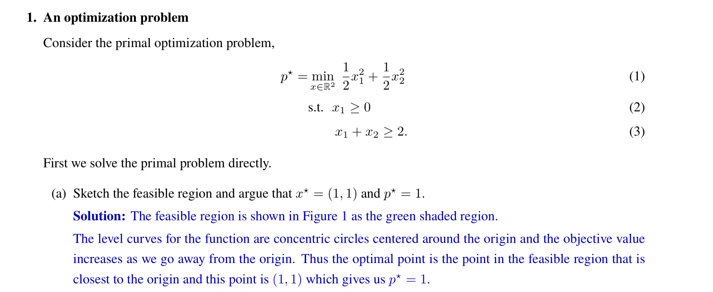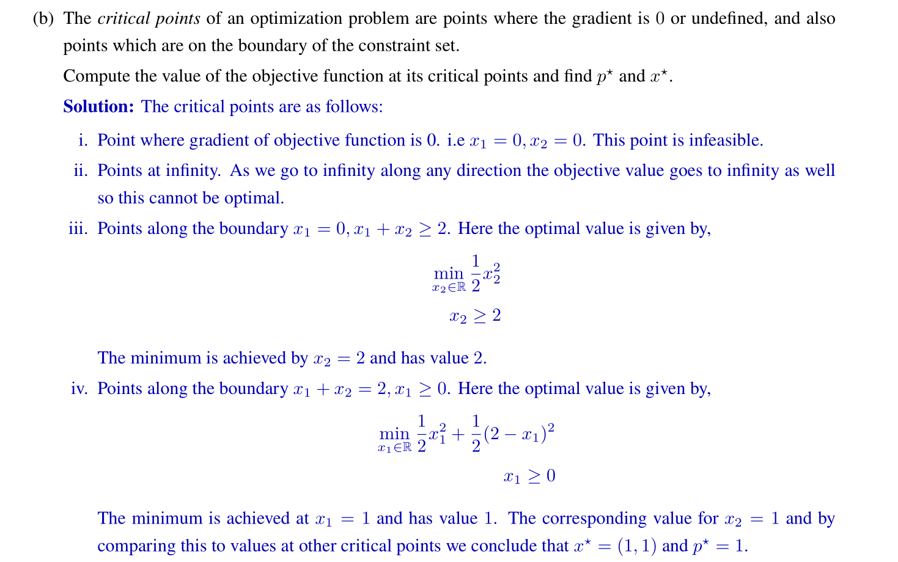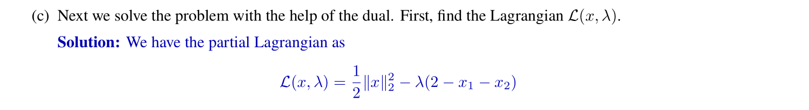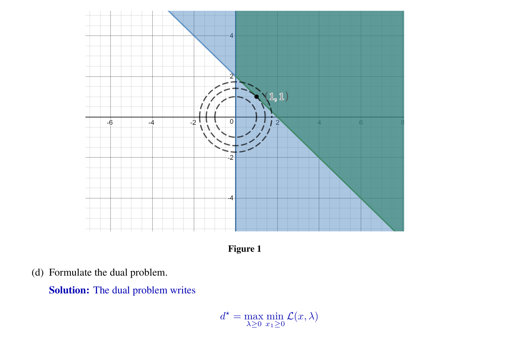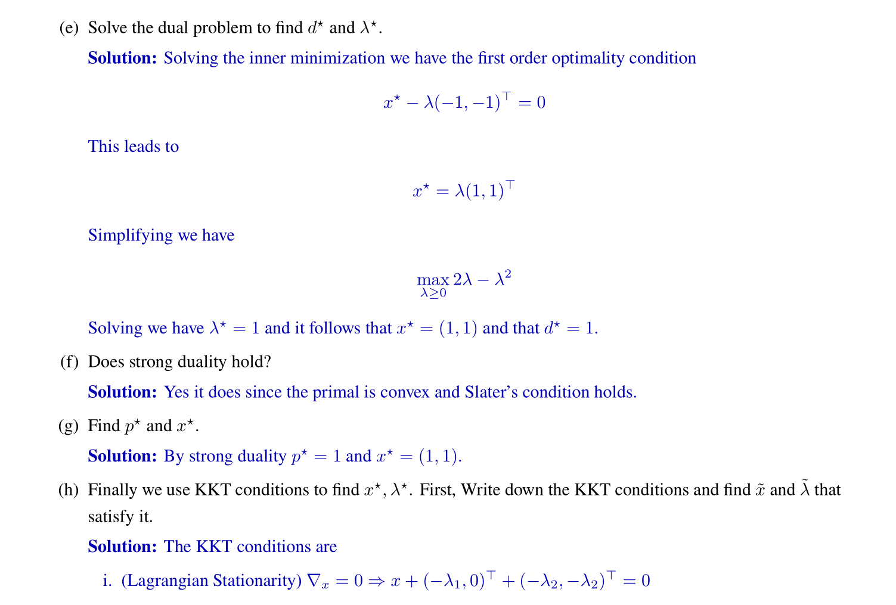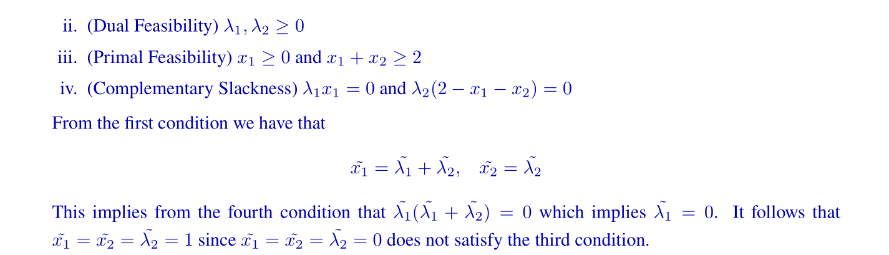
> **Notes:**
> We should see that when we are dualizing, we can choose to partial dualize the constraint, but when using KKT, we have to use all the constraints.

## Summary
> [!summary]
> 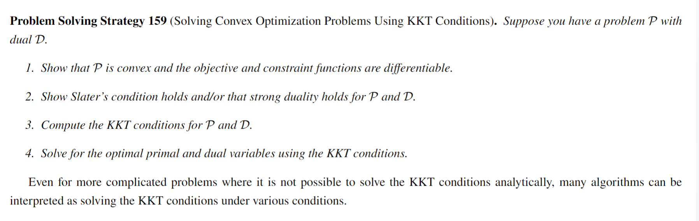

# Problem Transformation Solving Strategies
## How to prove equivalence
> [!important] Side Note
> To prove that two formulation of the same optimization problem $p$ is equivalent to $q$, we will have to prove:
> 1.  For every feasible points in original problem, it is feasible for new problem and vice versa.
> 2. If a point is optimial in original problem, then it is optimal in new problem and vice versa.
> 3. If the transformation involves changing the objective function through some invertible mapping $\phi$, then we have to prove $p^* = \phi(q^*)$. Otherwise, prove $p^*=q^*$

## Method 1: Monotone Objective Transformation
> [!important] C.E.G. 8.3.4.1
> Suppose we have the original problem as follows:
>$$p^*=\min _{x \in \mathbb{R}^n} f_0(x)$$subject to: $$\begin{align}f_i(x) \leq 0, i=1, \ldots, m\\h_i(x)=0, i=1, \ldots, q\end{align}$$ where it is not necessarily a convex optimization problem.
>
> We could apply a monotone objective transformation $\phi:\mathbb{R}\to\mathbb{R}$ ($\phi$ is continuous and strictly increasing function)as follows:
> $$\begin{array}{ll}g^*=\min _{x \in \mathbb{R}^n} & \varphi\left(f_0(x)\right) \\\text { subject to: } & f_i(x) \leq 0, \quad i=1,\ldots, m, \\& h_i(x)=0, \quad i=1, \ldots, q .\end{array}$$
> 

> [!proof] Proof for Equivalence
> 1. Since the feasible set doesn't change, the two problem has the same feasible sets. Rule 1 is satisfied.
> 2. Suppose $\vec{x}^*$ is optimal for $p$, then $f_0(\vec{x}^*)=p^*$. For contradiction if $\vec{x}^*$ is not optimal for $q$, then $\exists \vec{y}^*$ s.t. $\phi(f_0(\vec{y}^*))= g^*\leq \phi(f_0(\vec{x}^*))$. Since $\phi$ is monotonically increasing, this implies $f_0(\vec{y}^*)\leq f_0(\vec{x}^*)$, which contradicts the fact that $\vec{x}^*$ is optimal for $p$.
> 3. Conversely, suppose $\vec{x}^*$ is optimal for $g$, for the sake of contradiction $\vec{x}^*$ is not optimal for $p$, then $\exists \vec{y}^*$ such that $f_0(\vec{y}^*)\leq f_0(\vec{x}^*)$. Since $\phi$ is monotonically increasing, we know that $\phi(f_0(\vec{y}^*))\leq \phi(f_0(\vec{x}^*))$ and that $\vec{x}^*$ is not optimal for $g$, which is a contradiction.
> 4. Since we have changed the objective, we just have to show that $\phi(p^*)=g*$. By point 2 we know, since $\vec{x}^*$ is optimal for $p$, we have $f_0(\vec{x}^*)=p^*$, then since $\vec{x}^*$ is also optimal for $q$, we have $\phi(f_0(\vec{x}^*))=g^*$, which implies that $\phi(p^*)=g^*$, which concludes our proof.

> [!important] This transformation preserves convexity
> If $p$ is convex, then $g$ is also convex, provided that $\phi$ is both convex and strictly increasing.
> 
> **Proof:** Since $f_0$ is convex and $\phi$ is non-decreasing and convex, then by composition rule we have $\phi(f_0(\vec{x}))$ is convex. Since the domain if $\phi$ and $f_0$ are both full subspace, we don't have to consider the extended value function when we are using the criterion here.

## Method 2: Monotone Constraint Transformation
> [!important]
> 

## Method 3: Change of Variables
> [!important]
> 
> **Notes:**
> 1. The transformation between $\vec{x}$ and $\vec{y}$ should be invertible.
> 2. The convexity is preserved under this transformation if the transformation is affine.

> [!example] Great Example
> 
> This example uses method 1, method 2 and and method 3 together to transform a non-convex problem into a convex one.

## Method 4: Addition of Slack Variables
> [!important] C.E.G 8.3.4.4
> Suppose we have the following optimization problem:
> $$\begin{aligned}p^*=\min _{\vec{x}} & \sum_{i=1}^r \varphi_i(\vec{x}) \\\text { s.t.: } & \vec{x} \in \mathcal{X} .\end{aligned}\text{      (1)}$$
> By Introducing slack variables $t_i,i=1,2,\cdots, r$, we could reformulate the problem into:
> $$\begin{aligned}g^*=\min _{\vec{x}, t} & \sum_{i=1}^r t_i \\\text { s.t.: } & \vec{x} \in \mathcal{X} \\& \varphi_i(\vec{x}) \leq t_i \quad i=1, \ldots, r,\end{aligned}\text{     (2)}$$, where we see that in the new problem we are optimizing not only $\vec{x}$, but also the vector $\vec{t}=\begin{bmatrix} t_1&t_2,\cdots,t_r\end{bmatrix}$.
> 
> Now we argue that these two problem formulations are equivalent.
>
> To argue the equivalence, we need to prove the following things:
> 1. If $\vec{x}$ if feasible for $(1)$, then $\vec{x}$ such that $\phi_i(\vec{x})=t_{i},\forall i=1,2,\cdots, r$ is feasible for $(2)$.
> 2. If $\vec{x},\vec{t}$ if feasible for $(2)$, then $\vec{x}$  is feasible for $(1)$.
> 3. If $\vec{x}^*$ is optimal for $(1)$, then $\vec{x}^*$ such that $\phi_i(\vec{x}^*)=t_i^*,\forall i=1,2,\cdots, r$ is optimal for $(2)$.
> 4. If $\vec{x}^*,\vec{t}^*$ is optimal for $(2)$, then $\vec{x}^*$ is optimal for $(1)$.
> 5. The optimal value of the two problems are the same. Namely $g^*=p^*$

> [!proof] Proof of Equivalence
> 1. This is immediately clear. Since if $\vec{x}$ is feasible for $(1)$ and thus $\phi_i(\vec{x})=t_i,\forall i=1,2,\cdots, r$, then $\vec{x}\in \mathcal{X}$ and $\phi_i(\vec{x})\leq t_i,\forall i=1,2,\cdots, r$ since equlaity satisfy the inequality in $(2)$.
> 2. Conversely, if $\vec{x}$ is feasible for $(2)$, then $\vec{x}\in \mathcal{X}$ and $\phi_i(\vec{x})\leq t_i,\forall i=1,2,\cdots, r$, then we know that $\vec{x}$ is feasible for $(1)$ since $\vec{x}\in \mathcal{X}$.
> 3. Suppose $\vec{x}^*$ such that $\phi_i(\vec{x}^*)=t_i^*$ is optimal for $(1)$, then we have $\sum\limits_{i=1}^r\phi_i(\vec{x}^*)=p^*$. Now suppose for the sake of contradiction such $\vec{x}^*$ is not optimal for $(2)$, then there exists $\vec{y}^*$ and $\vec{\tau}^*$  such that $\sum\limits_{i=1}^r\tau_i^*<\sum\limits_{i=1}^rt_i^*$. Since $\vec{y}^*,\vec{\tau}^*$ is feasible for $(2)$, we have $\phi_i(\vec{y}^*)\leq \tau_i^*$ and thus $\sum\limits_{i=1}^r\phi_i(\vec{y}^*)\leq \sum\limits_{i=1}^r\tau_i^*<\sum\limits_{i=1}^rt_i^*=\sum\limits_{i=1}^r\phi_i(\vec{x}^*)$, which implies that $\vec{y}^*$ is the optimal point for $(1)$. This is a contradiction.
> 4. Now conversely, suppose $\vec{x}^*,\vec{t}^*$ is optimal for $(2)$, then we have $\phi_i(\vec{x}^*)\leq t_i^*$ and thus $\sum\limits_{i=1}^rt_i^*=g^*$. Now for the sake of contradiction $\vec{x}^*$ is not optimal solution for $(1)$, then we have $\vec{y}^{*}\in\mathcal{X}$ such that $p^*=\sum\limits_{i=1}^r\phi_i(\vec{y}^*)$. Since $\vec{y}^*$ is the optimal solution for $(1)$, then by point 3, $\vec{y}^*$ such that $\phi_i(\vec{y}^*)=\tau_i^*$ is optimal for $(2)$ and thus $\sum\limits_{i=1}^r\phi_i(\vec{y}^*)=\sum\limits_{i=1}^r\tau_i^*=g^*$, which is a contradiction to the assumption that $\vec{x}^*$ is optimal to $(2)$.
> 5. Combine point 1 to point 4 we could get that $g^*=p^*$.

> [!example] EECS127 Fa20 Disc05 P1
> This example illustrate how we could utilize slack variable to transform the optimization problem:
> 
> Consider the optimization problem below:
> $$\begin{array}{rl}\min _{x_1, x_2 \in \mathbb{R}^2} & max\{x_1,x_2\} \\\text { subject to } & 2 x_1+x_2 \geq 1, \\& x_1+3 x_2 \geq 1, \\& x_1 \geq 0, x_2 \geq 0 .\end{array}$$
> 

## Method 5: Relaxing Affine Constraints
### Method Theory
> [!important]
>  In certain cases, we can substitute an equalityconstraint of the form $b(\vec{x}) = u$ with an inequality constraint $b(\vec{x}) ≤ u$. 
>  
>  This can be useful, in some cases, for gaining convexity. 
>  
>  Indeed, if $b(\vec{x})$ is a convex function, then the set described by the equality constraint $\{x : b(\vec{x}) = u\}$ is non-convex in general (unless b is affine); on the contrary, the set described by the inequality constraint $\{x : b(\vec{x}) = u\}$ is the sublevel set of a convex function, hence it is convex. 
>  
>  Notice that by substituting the equality with inequality constraints, we enlarge the feasible region and thus $g^{*}\leq p^*$, which means we have much more freedom to choose the optimizers. Also by doing so we actually transform a non-convex set to a convex one.
>  
>  

> [!proof] Proof for Equivalence
> Recall that if during the transformation the objective function is not changed, we would want to prove the following:
> 1. If $\vec{x}$ is feasible for $p$ then $\vec{x}$ is feasible for $q$。
> 2. If $\vec{x}$ is feasible for $q$ then $\vec{x}$ is feasible for $p$。
> 3. If $\vec{x}$ is optimal for $p$ then $\vec{x}$ is optimal for $q$。
> 4. If $\vec{x}$ is optimal for $q$ then $\vec{x}$ is optimal for $p$。
> 5. $g^*=p^*$
> 
> **Point 1 and 3 are directly implied** by the fact that if we satisfy the equality constraint, we must satisfy the inequality constraint.
> 
> **For point 5** if we want to prove that $g^*=p^*$, then the following assumption has to be met:
>  1. **$f_0(\vec{x})$ is non-increasing over $\mathcal{X}$**
>  2. **$b(\vec{x})$ is non-decreasing over $\mathcal{X}$.** Here the monotonicity of a multivariable function is defined as 
>  
> 	 
> 	 
> 	 Here recall the definition of [Generalized Inequalities](Convex_Sets.md#Generalized%20Inequalities), we have to ensure that whenever $\vec{x}\preceq_K \vec{y}$, we have $f(\vec{x})\leq f(\vec{y})$ where $K$ is a proper cone. For vectors, unless otherwise specified the proper cone is assumed to be $\mathbb{R}^d_+$.
>  3. The optimal value $p^∗$ is attained at some optimal point $\vec{x}^*$ , and the optimal value $g^∗$ is attained at some optimal point $\vec{y}^*$
> 
> To formally show $g^*=p^*$, we want to prove two inequalities, which are :
> - $g^*\leq p^*$
> - $g^*\geq p^*$
> 
> The first condition is immediately implied since the feasible set is larger than the original one.
> 
> To prove the second statement, we assume that $g^*<p^*$. This would imply that $b(\vec{y}^*)<u$ since otherwise if $b(\vec{y}^*)=u$, we would have that $\vec{y}^*$ is feasible for original problem and thus $g^*=f_0(\vec{y}^*)\geq p^*$, which is a contradiction. Now we have $b(\vec{y}^*)<u=b(\vec{x}^*)$ since $\vec{x}^*$ is feasible for the original problem. Now due to the non-decreasing property of $b(\vec{x})$, we have $\vec{y}^*\preceq_K\vec{x}^*$, which then by the non-increasing property of $f_0(\vec{x})$ we will have $f_0(\vec{y}^*)\geq f(\vec{x}^*)$, which implies $g^*\geq p^*$, which is a contradiction to our assumption.
> 
> Combining 1 and 2 we get the desired conclusion.
> 
> **But for point 2 and 4, it is not always the case.**  It is only true if the objective is strictly monotone, as we will see in the example below.

### Example 1: Affine Equality Constraints
> [!example] Minimizing a Sum of Logarithms - EECS127 Fa22 HW09 P5
> 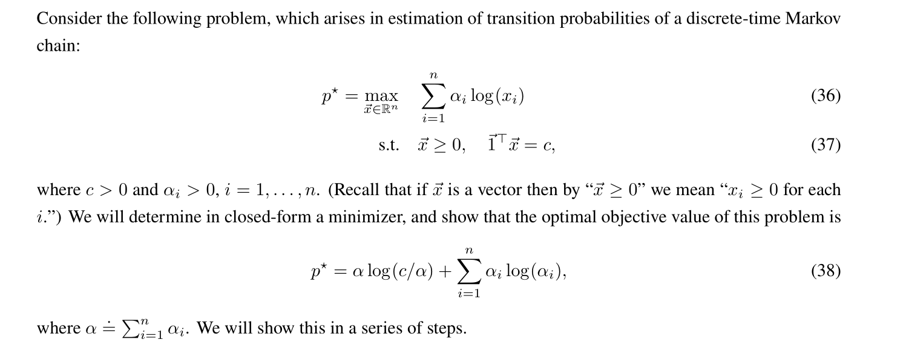

#### Equivalent Problem
> [!tech] Equivalent Problem
> 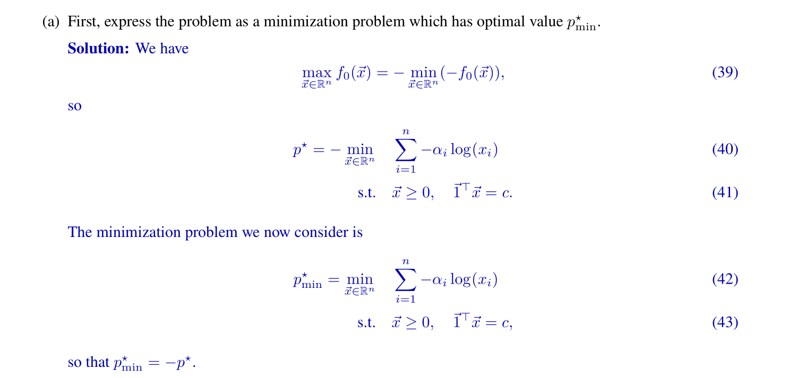
> **Here we see that the sufficient condition for objective equivalence holds:**
> 1. The objective function $\sum\limits_{i=1}^n-\alpha_ilog(x_i)$($\alpha_i>0$) is non-increasing over $\vec{x}\in\mathbb{R}^n$. Since each coordinate direction is a strictly decreasing function over $\mathbb{R}$
> 2. The constraint $b(\vec{x})$ is non-decreasing over $\mathbb{R}^n$ since $\vec{x}\geq 0$ and we can define the proper cone as $K=\mathbb{R}^n_+$. And since $b(\vec{x})=1^{\top}\vec{x}$, the gradient vector is $\mathbb{1}$ and for any $\vec{x}\preceq_K\vec{y}$, we will have $x_i\leq y_i,\forall i$ and that $\mathbb{1}^{\top}\vec{x} \leq\mathbb{1}^{\top}\vec{y}$, thus $b(\vec{x})$ is non-decreasing.
> 3. The optimal value $p^*$ is attained at some optimal points $\vec{x}^*$ and $g^*$ is attained at some optimal points $\tilde{x}^*$. Since the constraints are bounded and the problem is convex, so we are guarantee to find an optimal at least on the boundary. 
> 
> So we can prove that $p^{*}=g^*$
> 
> **To see that the sufficient condition for constraint equivalence(Point 2,4 in [Method Theory](Methodology%20on%20Optimization.md#Method%20Theory)) holds, we have to ensure that** the objective function is strictly monotone, which is the case here. So we can prove this.

#### Relaxing Constraints
> [!tech] Relaxing Constraints
> 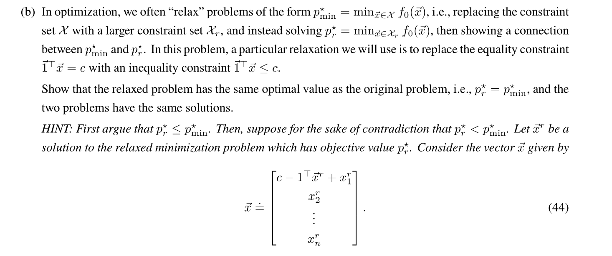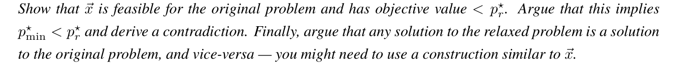
> We want to show that:$$
> \begin{aligned}p^* r= & \min _{\vec{x} \in R^n} \sum_{i=1}^n-\alpha_i \log \left(x_i\right) \\& \text { s.t } \vec{x} \geqslant 0, \quad 1^{\top} \vec{x} \leqslant C\end{aligned}$$has the same solutions as the original minimization problem:$$\begin{aligned}P_{\text {min }}^*= & \min _{\vec{x} \in \mathbb{R}^{-}} \sum_{i=1}^n-\alpha_i \log \left(x_i\right) \\& \text { s.t. } \quad \vec{x} \geq 0,1^{\top} \vec{x}=c\end{aligned}$$
> We first prove that $p_{\text {min }}^*=p^*_{r}$ :
> 
> Since the relaxed optimization problem has a larger feasible set than the original one, we are safe to conclude that $p^*_r \leqslant p^*_\min$.
> 
> Now we just need to show $p^*_r \geqslant p^*_{min}$ .
> 
> Suppose for the sale of contradiction, $\vec{x}^r$ is an optimal solution to the relaxed minimization problem such that $p^*{ }_r<p^*_{min}$.
> 
> Then $I^{\top} \vec{x}^r \leqslant C$ and $\sum_{i=1}^n-\alpha_i \log \left(x_i^r\right)=p^*_r$.
> 
> - If $\vec{x}^r$ is feasible for the original problem, then $1^{\top} \vec{x}^r=c$ and $\sum_{i=1}^n-\alpha_i \log \left(x_i^r\right)=p^* r<p_{\text {min }}$, which is a contradiction to the definition of $P_{\text {min }}^*$.
> - If $\vec{x}^r$ is not feasible for the original problem, since $1^{\top} \vec{x}^r \leq C$, we know that $1^{\top} \vec{x}^r<C$. 
> 
> Under this case, we can construct the vector:
> $$\vec{x}^*=\left[\begin{array}{c} \\c-1^{\top} \vec{x}^r+x_1^r \\x_2^r \\\vdots \\x_n^r\end{array}\right]$$
> which is feasible for the original problem, since$$\begin{aligned}
> 1^{\top} \vec{x}^*=c-1^{\top} \vec{x}^r+1^{\top} \vec{x}^r=c & \\
> \text { But } \sum_{i=1}^n-\alpha_i \log \left(x_i^*\right) & =-\alpha_1 \log \left(c-1^{\top} \vec{x}^r+x_1^r\right)+\sum_{i=2}^n-\alpha_i \log \left(x_i^r\right) \\
> & <-\alpha_1 \log \left(x_1^r\right)+\sum_{i=2}^n-\alpha_i \log \left(x_i^r\right) \\
> & =\sum_{i=1}^n-\alpha_i \log \left(x_i^r\right) \\
> & =p^*_r
> \end{aligned}$$
> 
> This implies that $p^*_{\min} \leq \sum_{i=1}^n-\alpha_i \log \left(x_i^*\right)<p^*_r$, which is a contradiction.
> $\therefore$ We conduce that $p_r^* \geqslant p^* \min$ and thus $p^*_r=p_{\text {min }}^*$.
> 
> Now we aim to show that the original problem and relaxed problem have the same set of solution.
> 
> Suppose $\vec{x}^r$ is an optimal solution for relaxed problem, then $\sum_{i=1}^n-\alpha_i \log \left(x_i^r\right)=p_r^*$ and $1^{\top} \vec{x}^r \leq c, x_i^r \geq 0 \forall i$.
>  
> - If $\vec{x}$ is infeasible for the original problem, then $\mathcal{1}^{\top} \vec{x}^r<c$(since it has to satisfy $\mathcal{1}^{\top} \vec{x}^r\neq c$ and $\mathcal{1}^{\top} \vec{x}^r\leq c$), we construct the same solution vector as above and could find that $p^*_{min}<p^*_r$, a contradiction to $p^*_r=p^*_{min}$that we hove proved. $\therefore \vec{x}$ is feasible for the original problem. **Here we use the property that the objective function is strictly monotone(actually in each coordinate direction).  If not, we cannot reach the contradiction here.**
> 
> - Now suppose $\vec{x}^*$ is an optimal solution for original problem, we have $\sum_{i=1}^n-\alpha_i \log \left(x_i^*\right)=p^*_{min}$  and $1^{\top} \vec{x}^*=c$. $\because 1^{\top} \vec{x}^*=c \Rightarrow 1^{\top} \vec{x}^* \leq c, \therefore \vec{x}^*$ is feasible for the relaxed problem and we know that $\vec{x}^*$ is also optimal since $p^*_r=p^*_{min}$.
> 
> 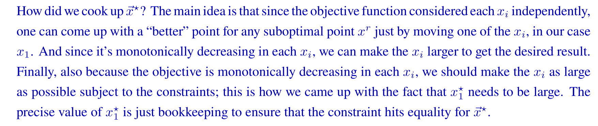

#### Lagrangian Function
> [!example]
> 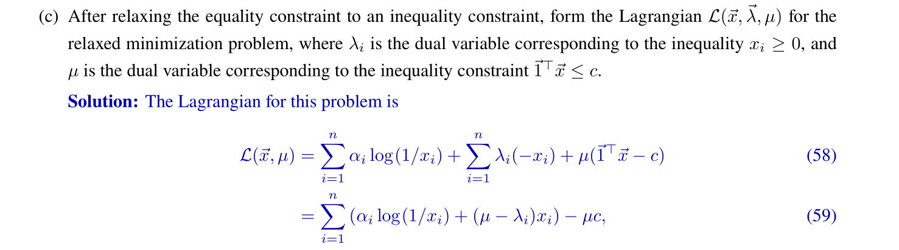

#### Finding Dual Function
> [!important]
> 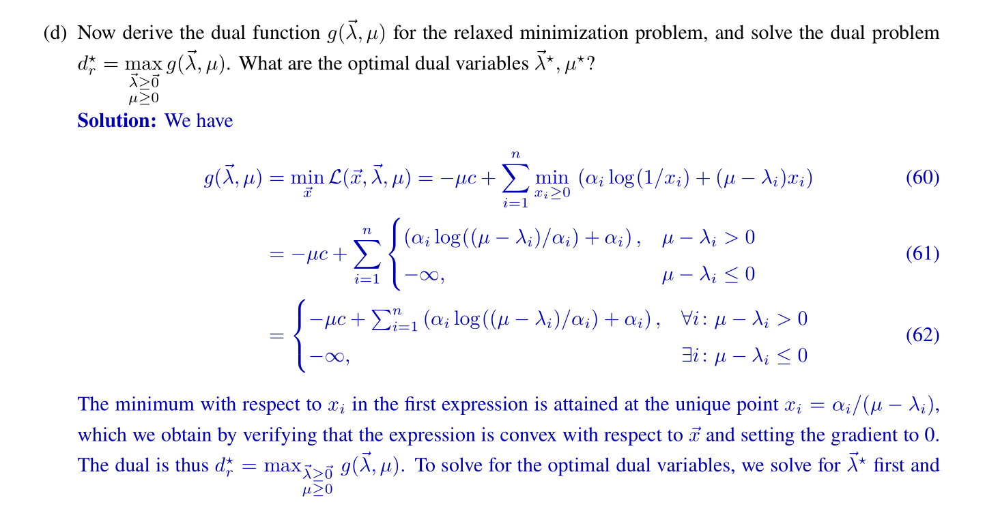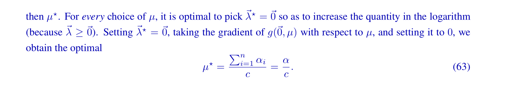

#### Establishing Strong Duality
> [!example]
> 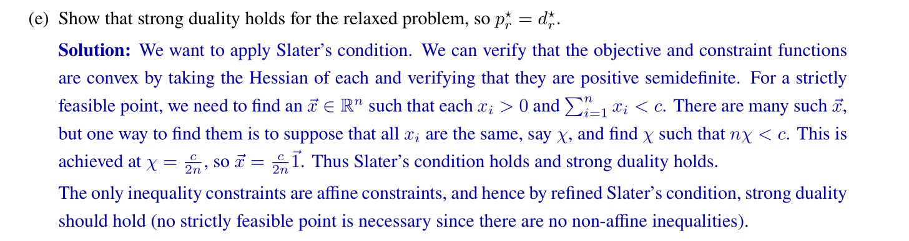

#### Using Strong Duality to Recover Primal Solutions
> [!example]
> 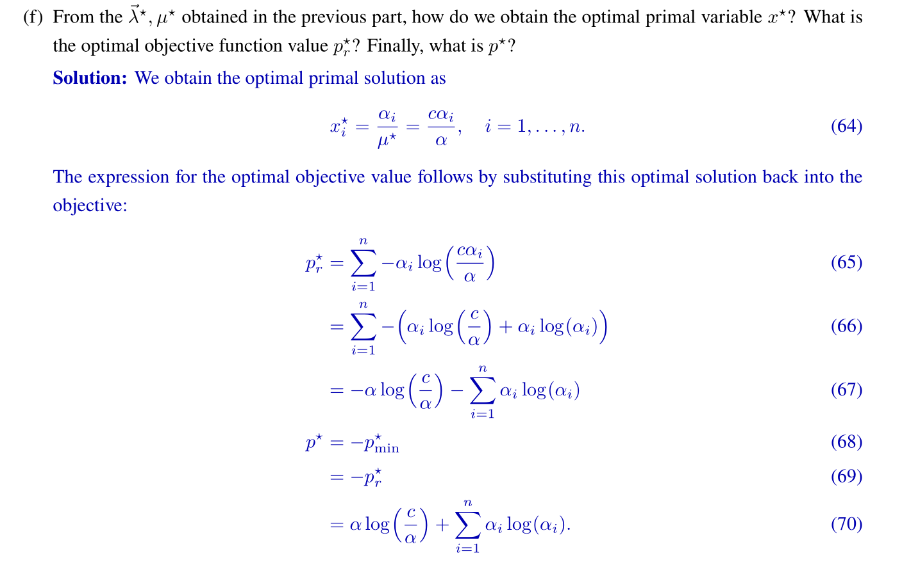

### Example 2: Budget Constraint in Portfolio Optimization
> [!example] C.E.G 8.19 pp212
> 
> **Notes:**
> 1. The objective function is strictly increasing since $\hat{r}>0$.
> 2. The first constraint is non-decreasing. We show it by defining our partial ordering of vectors at the canonical proper cone $K=\mathbb{R}_+^n$, so that $\forall\vec{x}\preceq_K\vec{y}$, we have $\vec{y}-\vec{x}\in K$ and thus $y_i\geq x_i\forall i=1,2,\cdots, n$, then since $\Sigma\in \mathbb{S}_+^n$, we know that $(\vec{y}-\vec{x})^{\top}\Sigma(\vec{y}-\vec{x})\geq0$, thus $\vec{y}^{\top}\Sigma\vec{y}\geq\vec{x}^{\top}\Sigma\vec{x}$,forall $\vec{y}\geq_K\vec{x}$。
> 3. If the second constraint is non-decreasing, then we can prove that $g^*=p^*$ and that the equivalence holds(objective and constraints) between original and transformed.

### Example 3: Linear Function
> [!example] Problems with a single constraint
> 
> Note that in this problem:
> 1.  If $\vec{c}\neq_{K}\vec{0}$, then the objective function is strictly monotone. This means that the point 2 and 4 hold.
> 2. But here if $\vec{c}\succ0$, we are not guaranteed to have $p^*=g^*$

## Method 6: Elimination of Inactive Constraints
> [!important]
> 

> [!proof]
> 

## Others

### Original Optimization Problem
> [!def]
> 假设我们有如下的优化问题:
> 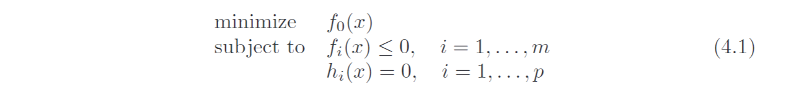
> 我们尝试将其转化为等价的优化问题。

### Scaling
> [!example]
> 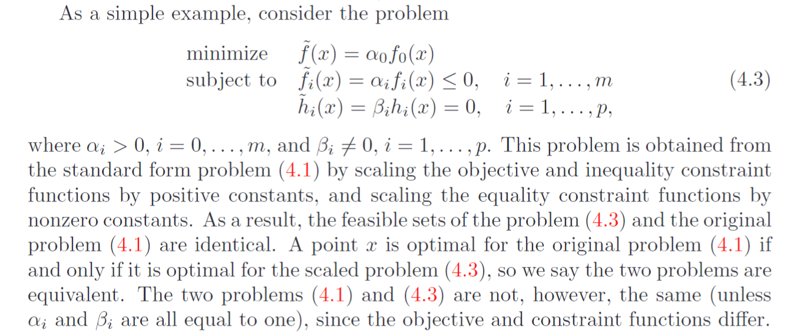

### Change of Variables
> [!important]
> 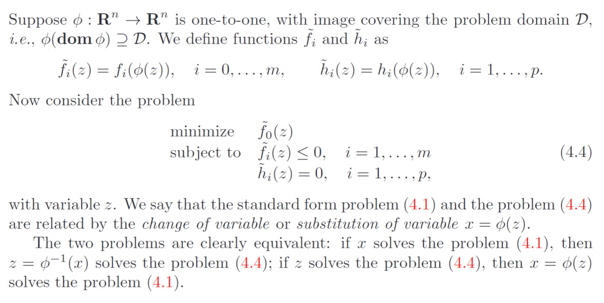

### Transformation of Objective and Constraints
> [!important]
> 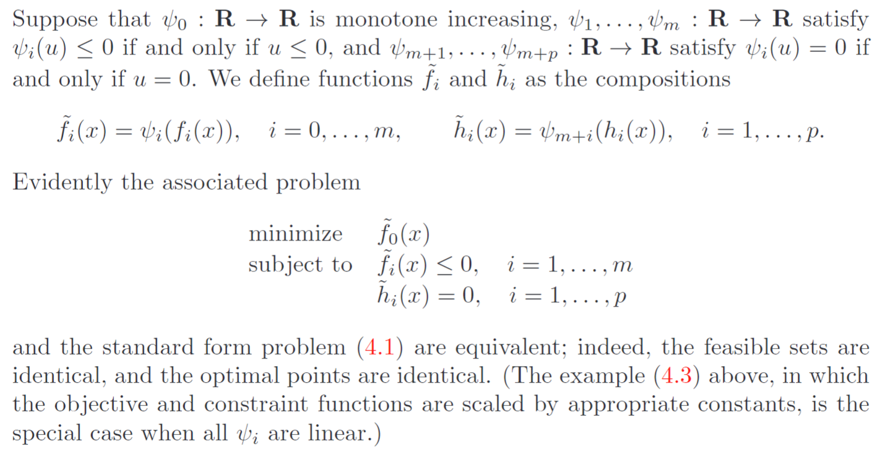
>

>[!example] L2 Norm
>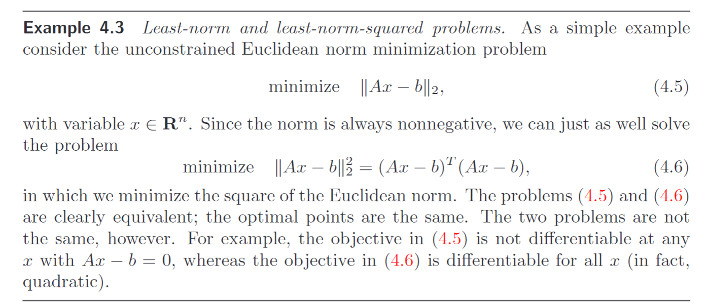

### Slack Variables - 降维
> [!important]
> 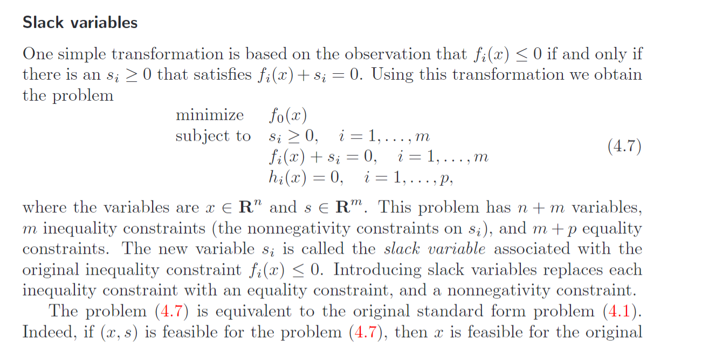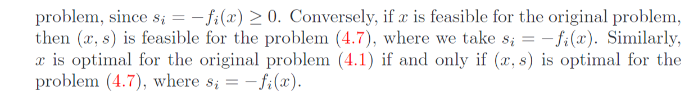

### Elimiating Linear Equality Constraint
> [!important]
> 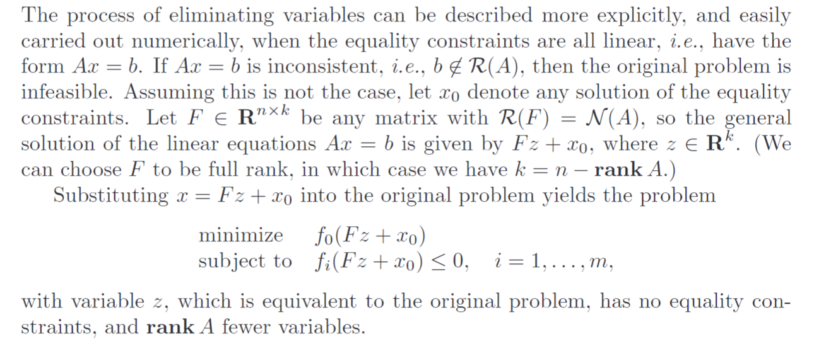
> 本质上这种等价方法是在给我们的优化问题降维。

### Eliminating Equality Constraints
> [!important]
> 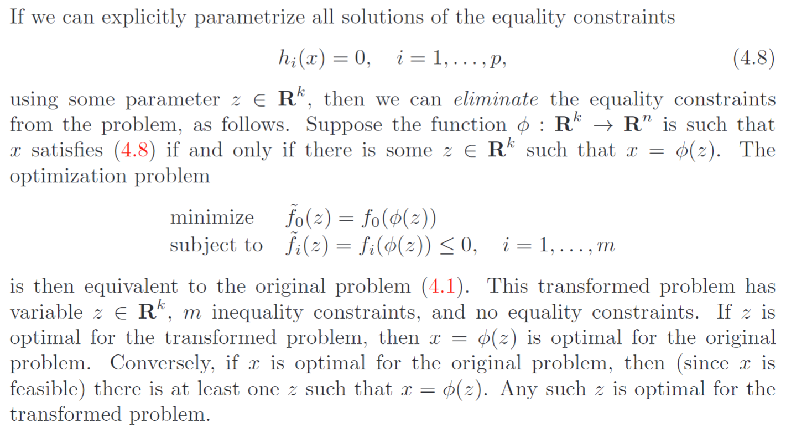
> 这种方法本质上是将$h_i(\vec{x})=0,i=1,2\cdots, m$看成是方程组，然后$\vec{x}=\phi(\vec{z})$表示我们可以用一个函数$\phi$来描述上述方程组的解集，这样我们就可以丢掉$h_i$这些等式约束。区别是现在的优化问题变成了和 $\vec{z}$ 相关的优化问题。这样一来如果我们在这个等价的优化问题上求出了$\vec{z}^*$, 则通过简单的函数变换得到$\vec{x}^*=\phi(\vec{z}^*)$。
> - 有人可能会问，为什么我们能够找到这样的函数$\phi$, 设想一下我们在求解线性方程组时经常将其写成$A\vec{x}=\vec{z}$的形式，而$\vec{x}=A^{\dagger}\vec{z}+\mathcal{N}(A)$, 所以我们是可以找到一个线性函数满足$\vec{x}=\phi(\vec{z})$的。
> - 当然上述的方法只适用于消除线性约束。

# Using Lagrangian to Solve Eigenvalue Problem
## Maximum Eigenvalue Problems
> 

# Chapter Exercises
## BV Ch4.1
> [!example] Using General Framework
> 
> Note that here we use [First Order Conditions](Convex_Problems.md#First%20Order%20Conditions) to check for the optimality of the solution.
> 
> 
> 
> What this means is that we want to check whether all the points in the feasible set have bigger objective value than the current optimal candidate $(\frac{2}{5},\frac{1}{5})$。

