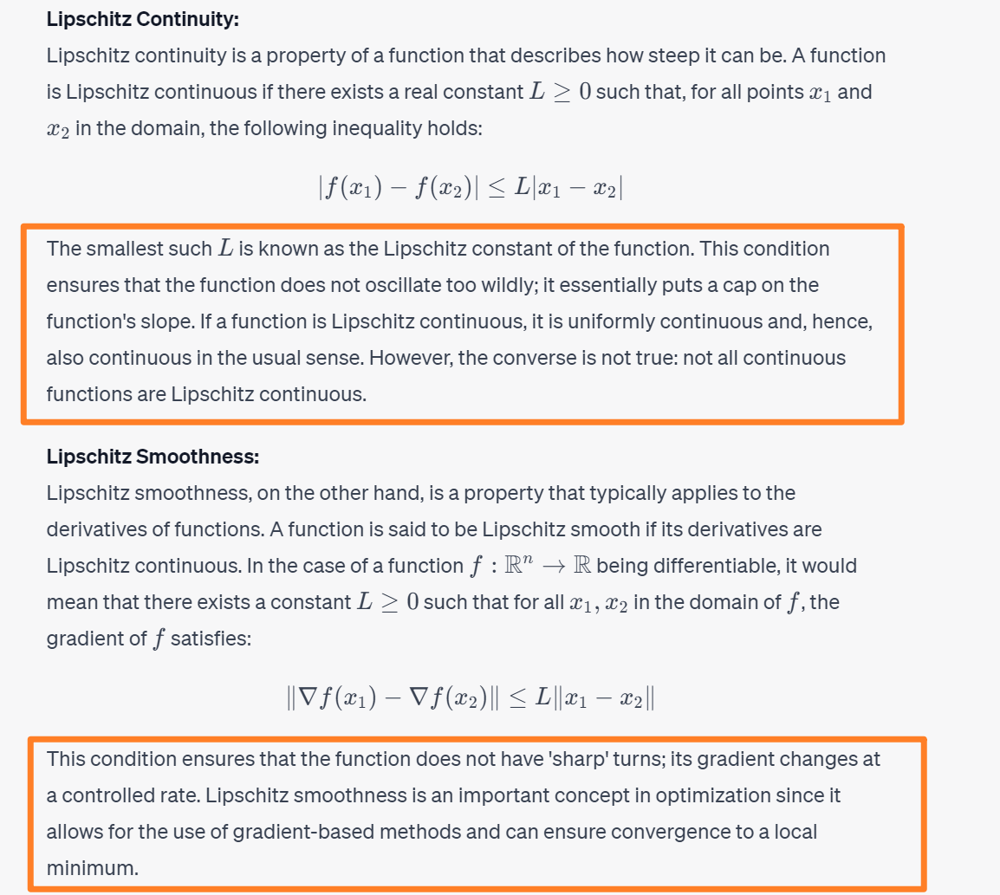
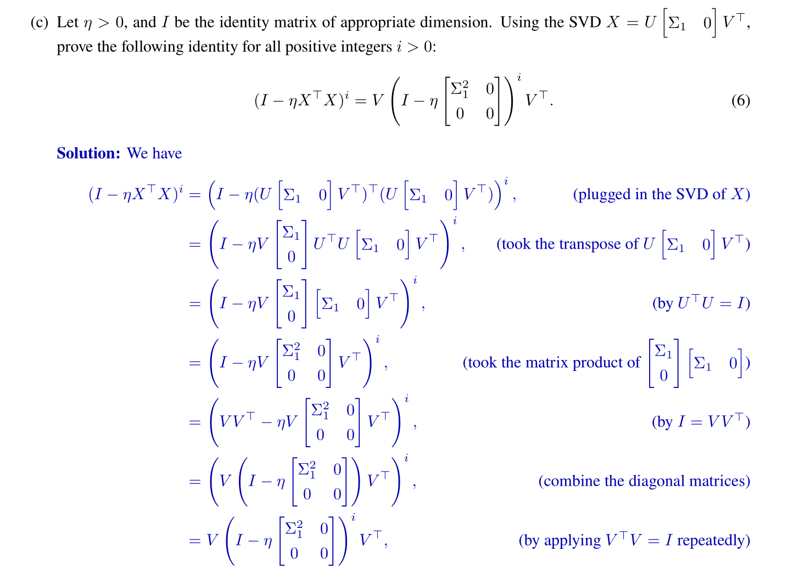

# Strong Convexity&Lipschitz-Smooth
## Taylor Theorem
### Precise Statement
> [!important]
> 

### Remainder Formula
> [!important] Mean-Value Formulation
> 

> [!important] Integral Formulation
> 

### Vectorized Theorem
> [!thm]
> 
> 其中积分可以理解为`Residuals`

> [!proof]
> 
> **Notes:**
> 1. 上面$(8.1.4)$的推导
> 2. $g''(t)=(\vec{y}-\vec{x})^{\top}\nabla f(\vec{x}+t(\vec{y}-\vec{x}))(\vec{y}-\vec{x})$ is by applying the multivariate chain rule to the function composition $m(\vec{g}(\vec{h}(t)))$ where $m(\vec{r}) = (\vec{y}-\vec{x})^{\top}\vec{r}$, $\vec{g}(\vec{q})=\nabla f(\vec{q})$ and $\vec{h}(t)=\vec{x}+t(\vec{y}-\vec{x})$

 

## Lipschitz Smoothness
> [!important] 
> 注意这个概念和`Lipschitz Continuity`不一样:
> 

#### Definition
> [!def]
> 

#### Important Lemmas  
> [!lemma]
> 

> [!proof] Proof 12.1.1
> 

> [!proof] Proof 12.1.2
> 

> [!proof] Proof 12.1.3
> The first part follows from the first order condition of a convex function and lemma 12.1.2 
> The second part follows from 

> [!proof] Proof 8.1.7
> By lemma 12.1.2 we have:
> 

## mu-Strongly Convexity
### Definition 1: Jensen's Inequality
> [!def]
> 

> [!property] Strongly Convex -> Unique Minimizer
> 

> [!property] Convexity -> Local Minimum = Globally Minimum
> 

### Definition 2: First-Order Condition
> [!def]
> 
> **Remarks:**
> - 其中$\frac{\mu}{2}\|\vec{y}-\vec{x}\|^2=\frac{1}{2}(\vec{y}-\vec{x})^{\top}\begin{bmatrix} \mu&0&\cdots&0\\0&\mu&\cdots&0\\\vdots&0&\ddots&\vdots\\0&0&\cdots&\mu\end{bmatrix}(\vec{y}-\vec{x})$, 而我们知道$f(\vec{x})+\langle\nabla f(\vec{x}), \vec{y}-\vec{x}\rangle+\frac{\mu\|\vec{y}-\vec{x}\|^2}{2}$是一个`Quadratic Function`, 所以本质上如果对于可微函数$f$来说，我们能够找到一个`Quadratic Lower Bound Like this`, 那么这个函数是$\mu$-strongly convex的。 
> - 和`Taylor Theorem`做一个对比: `Taylor Theorem`的目的是找到一个最接近原函数的下界$\begin{aligned} f(\vec{y}) \approx f(\vec{x})+\nabla^{\top}(\vec{x}) \cdot(\vec{y}-\vec{x})+\frac{1}{2}(\vec{y}-\vec{x})^{\top} \nabla^2 f(\vec{x})(\vec{y}-\vec{x})\end{aligned}$, 而$\mu$-strongly convex 只需要存在这样一个下界即可。
> - 另外，`Taylor Theorem`中的$\nabla f(\vec{x})$在不同的$\vec{x}$下的值是不一样的，所以在不同的$\vec{x}$下这个`Quadratic Term`是会随$\vec{x}$的位置变化的，而`mu-strongly convex`的这个下界实际上是给海森矩阵规定了一个下界，使得`Hessian Matrix`在所有$\vec{x}$处都是这个下界。
> 

> [!proof]
> 

## Important Properties
###  mu-strongly => strongly
> [!property] Property: $\mu$-strongly convex=>strongly(strictly) convex
> $\forall\vec{x},\vec{y}\in dom(f),\theta\in [0,1]$, we have by definition of $\mu$-strongly convex that:
> $$\begin{align}f(\theta\vec{x}+(1-\theta)\vec{y})-\frac{\mu}{2}\|\theta\vec{x}+(1-\theta)\vec{y}\|^2\\\leq\theta(f(\vec{x})-\frac{\mu}{2}\|\vec{x}\|^2)+(1-\theta)(f(\vec{y})-\frac{\mu}{2}\|\vec{y}\|^2)\end{align}$$
> Then we rearrange the terms and could get the following:
> $$\begin{align}f(\theta\vec{x}+(1-\theta)\vec{y})&\leq \theta f(\vec{x})+(1-\theta)f(\vec{y})-\frac{\mu}{2}(\theta\|\vec{x}\|^2+(1-\theta)\|\vec{y}\|^2)\\&+\frac{\mu}{2}\|\theta\vec{x}+(1-\theta)\vec{y}\|^2\\&<\theta f(\vec{x})+(1-\theta)f(\vec{y})-\frac{\mu}{2}(\theta\|\vec{x}\|^2+(1-\theta)\|\vec{y}\|^2)\\&+\frac{\mu}{2}(\theta^2\|\vec{x}\|^2+\theta(1-\theta)(\|\vec{x}\|^2+\|\vec{y}\|^2)+(1-\theta)^2\|\vec{y}\|^2)\\&=\theta f(\vec{x})+(1-\theta)f(\vec{y})\end{align}$$ 
> where:
>$$\|\vec{x}\|^2+\|\vec{y}\|^2>2\langle\vec{x}, \vec{y}\rangle \text { for } \vec{x} \neq \vec{y} .$$

> [!corollary] Corollary: $g(\vec{x})$ is convex implies $g(\vec{x})+\mu\frac{\|\vec{x}\|^2}{2}$ is strongly convex
> $$\begin{aligned}g(\theta \vec{x}+(1-\theta) \vec{y})+\frac{\mu \| \theta \vec{x}+(1-\theta)\|^2}{2} & \leq \theta g(\vec{x})+(1-\theta) g(\vec{y})+\frac{\mu}{2}\left(\theta^2\|\vec{x}\|^2+2 \theta(1-\theta)\langle\vec{x}, \vec{y}\rangle+(1-\theta)^2\|\vec{y}\|^2\right) \\& \left.<\theta g(\vec{x})+(1-\theta) g(\vec{y})+\frac{\mu}{2}\left[\theta^2\|\vec{x}\|^2+\theta(1-\theta)\left(\| \vec{x}\left\|^2+\right\| \vec{y} \|^2\right)+(1-\theta)^2\right] \| \vec{y} \|^2\right] \\& =\theta g(\vec{x})+(1-\theta) g(\vec{y})+\frac{\mu}{2}\left[\theta \| \vec{x}\left\|^2+(1-\theta)\right\| \vec{y} \|^2\right] \\& =\theta\left(g(\vec{x})+\frac{\mu}{2}\|\vec{x}\|^2\right)+(1-\theta)\left[g(\vec{y})+\frac{\mu}{2}\|\vec{y}\|^2\right] .\end{aligned}$$

### Quadratic Bounds - For Strong Convexity&Lipschitz Smooth
#### Quadratic Lower Bound
> [!important]
> 本章节主要介绍$\mu$-strongly convex 的一个重要性质。我们知道对于一个凸函数来说，他的下界是其一阶泰勒估计。而$\mu$-strongly convex function的一个重要性质是: 他的下界是一个二次函数, 二次函数的系数由$\mu$决定。
> 

#### Quadratic Upper Bound
> [!important]
> 对于一个$\mu$-strongly且$M$-Lipschitz Smooth的函数来说，其有二阶上界。
> 

#### Bounds on Hessian
> [!corollary] Corollary -  L2 Norm Case
> 
> This implies that $\mu<L$ generally.

> [!proof] Proof of the first inequality
> Since $f$ is $\mu$-strongly convex, we have:$$\langle\nabla f(\vec{x})-\nabla f(\vec{y}), \vec{x}-\vec{y}\rangle \geqslant \mu\|\vec{x}-\vec{y}\|_2^2$$Letting $\vec{y}=\vec{x}+\alpha \vec{h}$ where $\alpha$ is small, then:$$\begin{aligned}\left\langle\nabla f(\vec{x})-\nabla f(\vec{x}+\alpha \cdot \vec{h}), \vec{x}-(\vec{x}+\alpha \cdot \vec{h}) \big\rangle \geqslant \mu\|\vec{x}-(\vec{x}+\alpha \cdot \vec{h})\|_2^2\right. \\\left\langle\nabla f(\vec{x})-\nabla f(\vec{x}+\alpha \vec{h}),-\alpha \cdot \vec{h}\rangle\geqslant \mu\|-\alpha \cdot \vec{h}\|_2^2\right. \\-\alpha\langle\nabla f(\vec{x})-\nabla f(\vec{x}+\alpha \vec{h}), \vec{h}\rangle \geqslant \mu \alpha^2\|\vec{h}\|_2^2 \\\left\langle\frac{\nabla f(\vec{x}+\alpha \cdot \vec{h})-\nabla f(\vec{x})}{\alpha}, \vec{h}\right\rangle \geqslant \mu\|\vec{h}\|_2^2\end{aligned}$$letting $\alpha \rightarrow 0$, we have$$\begin{aligned}\left\langle\nabla^2 f(\vec{x}) \vec{h}, \vec{h}\right\rangle & \geqslant \mu\|\vec{h}\|_2^2 \\\vec{h}^{\top} \nabla^2 f(\vec{x}) \vec{h} & \geqslant \vec{h}^{\top} \mu I_n \vec{h} \\\vec{h}^{\top}\left(\nabla^2 f(\vec{x})-\mu I_n\right) \vec{h} & \geqslant 0 \quad \forall \vec{h}\in\mathbb{R}^n \\\therefore \nabla^2 f(\vec{x})-\mu I_n & \succeq 0 \\\therefore \nabla^2 f(\vec{x}) & \succeq \mu I_n\end{aligned}$$

> [!proof] Proof of the second inequality
> Since $f$ is L-Lipschitz Smooth, we have:$$\begin{aligned}\| \nabla f(\vec{x}) & -\nabla f(\vec{y})\left\|_2 \leq L\right\| \vec{x}-\vec{y} \|_2 \\\nabla^2 f(\vec{x}) \cdot \vec{h} & =\lim _{\alpha \rightarrow 0} \frac{\nabla f(\vec{x}+\alpha \cdot \vec{h})-\nabla f(\vec{x})}{\alpha} \\\therefore\left\|\nabla^2 f(\vec{x}) \cdot \vec{h}\right\|_2 & =\lim _{\alpha \rightarrow 0} \frac{\|\nabla f(\vec{x}+\alpha \cdot \vec{h})-\nabla f(\vec{x})\|_2}{|\alpha|} \\& \leq \lim _{\alpha \rightarrow 0} \frac{L\|\vec{x}+\alpha \cdot \vec{h}-\vec{x}\|_2}{|\alpha|} \\& =\lim _{\alpha \rightarrow 0} \frac{L|\alpha|\|\vec{h}\|_2}{|\alpha|} \\& =L\|\vec{h}\|_2 \\\therefore \vec{h}^{\top} \nabla^2 f(\vec{x}) \vec{h} & \leqslant \vec{h}^{\top} L I_n \vec{h} \\\vec{h}^{\top}\left(\nabla^2 f(\vec{x})-L \cdot I_n\right) \vec{h} & \leqslant 0 \quad \forall \vec{h} \in R^n \\\therefore \nabla^2 f(\vec{x})-L \cdot I_n & \leq 0 . \\\nabla^2 f(\vec{x}) & \leq L \cdot I_n .\end{aligned}$$

> [!corollary] Corollary - General Norm
> 

#### Summary
> [!summary]
>  总的来说，对于一个$\mu$-strongly convex且$L$-Smooth的函数，我们有:
> $\forall\vec{x},\vec{y}\in dom(f)$:
> $$\begin{aligned}f(\vec{y})&\leq f(\vec{x})+\nabla f(\vec{x})^{\top}(\vec{y}-\vec{x})+\frac{L}{2}\|\vec{y}-\vec{x}\|_2^2\\&\geq f(\vec{x})+\nabla f(\vec{x})^{\top}(\vec{y}-\vec{x})+\frac{\mu}{2}\|\vec{y}-\vec{x}\|_2^2\end{aligned}$$  

# Versions of Gradient Descents
> [!motiv] Motivation
> 

## First Order Descent Methods
### Algorithm Scheme
> [!algo] Algorithm
> 

### Descent Directions
> [!important]
> 

### Stepsize Selection
> [!important]
> 

### BackTracking Line Search
> [!Algo] Algorithm
> 

## Steepest Gradient Descent
### Motivation
> [!motiv] Motivation
> 

### Search Direction
> [!thm]
> 

## Stochastic Gradient Descent
> [!def]

# Convergence Analysis of Steepest G.D.
## Matrix Limit Perspective
### Version 1 - Control Problem
> [!important]
> Consider this function $f(\vec{x})=\|\vec{A} \vec{x}-\vec{b}\|$ and the umonstrained optimization problem$$\min _{\vec{x} \in R^n}\|A \vec{x}-\vec{b}\| \text {. }$$We want to show the condition that step size $\eta$ must fulfill in order for gradient descent to converge.
> The single step strepest gradient descent goes like this:$$\vec{x}_{k+1}=\vec{x}_k-\eta \cdot \nabla f\left(\vec{x}_k\right), \eta>0$$So we want to compute the gradient of $f(\vec{x})$ :$$\begin{aligned}\|A \vec{x}-\vec{b}\|_2^2 & =\vec{x}^{\top} A^{\top} A \vec{x}-2 \vec{b}^{\top} A \vec{x}+\|\vec{b}\|_2^2 \\\nabla f(\vec{x}) & =2 A^{\top} A \vec{x}-2 A^{\top} \vec{b} . \\& =2 A^{\top}(A \vec{x}-\vec{b})\end{aligned}$$Thus $\vec{x}_{k+1}=\vec{x}_k-\eta \cdot 2 A^{\top}(A \vec{x}-\vec{b})$
> In order for $\vec{x}_k$ to converge to our least-square solution we want to show that $\vec{x}_{k+1}-\vec{x}_* \rightarrow 0$ as $k \rightarrow \infty$, it's equivalent to show something like:
> $\vec{x}_{k+1}-\vec{x}_*=C^{k+1}\left(\vec{x}_0-\vec{x}_*\right)$ where $C$ controls our convergence.$$\begin{aligned}\because \vec{x}_{k+1}-\vec{x}_* & =\vec{x}_{k+1}-\left(A^{\top} A\right)^{-1} A^{\top} \vec{b} \\& =\vec{x}_k-2 \eta A^{\top}\left(A \vec{x}_k-\vec{b}\right)-\left(A^{\top} A\right)^{-1} A^{\top} \vec{b} \\& =\vec{x}_k-2 \eta A^{\top} A \vec{x}_k+2 \eta A^{\top} \vec{b}-\left(A^{\top} A\right)^{-1} A^{\top} \vec{b} \\& =\vec{x}_k-2 \eta A^{\top} A \vec{x}_k+2 \eta\left(A^{\top} A\right)\left(A^{\top} A\right)^{-1} A^{\top} \vec{b}-\left(A^{\top} A\right)^{-1} A^{\top} \vec{b} \\& =\left(I_n-2 \eta A^{\top} A\right) \vec{x}_k+\left(2 \eta A^{\top} A-I_n\right)\left(A^{\top} A\right)^{-1} A^{\top} \vec{b} \\& =\left(I_n-2 \eta A^{\top} A\right) \vec{x}_k-\left(I_n-2 \eta A^{\top} A\right)\left(A^{\top} A\right)^{-1} A^{\top} \vec{b} \\& =\left(I_n-2 \eta A^{\top} A\right)\left(\vec{x}_k-\vec{x}_*\right)\end{aligned}$$Let $\vec{z}_{k+1}=\vec{x}_{k+1}-\vec{x}_*$Then we have the following recurrence equation:$$\vec{z}_{k+1}=\left(I_n-2 \eta A^{\top} A\right) \vec{z}_k$$Solve for it and we get:$$\vec{z}_{k+1}=\left(I_n-2 \eta A^{\top} A\right)^{k+1} \vec{z}_0$$By the knowledge from [Stability_Feedback_Control](../../EECS16B/Module2_Robotic_Control/Stability_Feedback_Control.md) for differential system we know that, in order for $\left\|\vec{z}_{k+1}\right\|$ to be bounded, the. eigenvalues of $I_n-2 \eta A^{\top} A$ should be between 0 and 1 . Thus the convergence condition requires.$$\begin{aligned}-1 & \leq 1-2 \eta \lambda_k\left(A^{\top} A\right) \leqslant 1 & \forall k=1,2, \cdots, n \\\Leftrightarrow & 0 \leq \eta \lambda_k\left(A^{\top} A\right) \leqslant 1 & \forall k=1,2, \cdots, n . \\\Leftrightarrow & 0 \leqslant \lambda_k\left(A^{\top} A\right) \leqslant \frac{1}{\eta} & \forall k=1,2, \cdots, n\end{aligned}$$
> Which means that $0<\eta<\frac{1}{\sigma_1^2}$, where $\sigma_1$ denotes the maximum singular value of $A$.

### Version 2 - Matrix Limit
> [!important]
> 

## Eigenvalue Perspective
> [!example]
> NYU-DS-GA-1014 Fa20 HW12
> 

> [!proof] Proof (a)
> Since $\mu$-strongly convex implies strong convexity, we know that $f(\vec{x})$ is strongly convex. 
> By the first order condition we have $\forall \vec{x}\neq \vec{x}_*,f(\vec{x})>f(\vec{x}_{*})+\nabla f(\vec{x}_*)^{\top}(\vec{x}-\vec{x}_*)$. And for all the $\vec{x}_*$ that satisfies $\nabla f(\vec{x}_*)=0$, we know by the strong convexity that $f(\vec{x})>f(\vec{x}_*)$, which means that $\vec{x}_*$ is the global minimizer(which is also unique) if $\vec{x}_*$ satisfies the first order condition.
> Now since $\nabla f(\vec{x})=M\vec{x}-\vec{b}$, if we set it to zero we get $M\vec{x}_*=\vec{b}$. Now since $\nabla^2f(\vec{x})=M$ and by the property of $\mu$-strongly convex and $L$-smooth function, we know that $L\leq \lambda_k(M)\leq\mu,\forall k=1,2,\cdots, n$。Also since $\mu>0$(definition), we know that $\lambda_d>0$, which means $M$ is P.D. Thus, we are safely to conclude that $\vec{x}_*=M^{-1}\vec{b}$, which is unique global minimizer.

> [!proof] Proof (b)
> 

> [!proof] Proof (c)
> 

> [!proof] Proof (d)
> 

> [!proof] Proof (e)
> 

> [!proof] Proof (f)
> 

## Gradient Bound for L-Smooth Functions
> [!thm]
> 

> [!proof]
> 

## Theorem - Any U-strongly&L-Smooth Functions
### Important Lemma
> [!important]
> 从 [Quadratic Bounds](../3_Convex_Optimization/Convex_Functions.md#Quadratic%20Bounds)  我们知道，对于一个$\mu$-strongly convex且$L$-Smooth的函数，我们有:
> $\forall\vec{x},\vec{y}\in dom(f)$:
> $$\begin{aligned}f(\vec{y})&\leq f(\vec{x})+\nabla f(\vec{x})^{\top}(\vec{y}-\vec{x})+\frac{L}{2}\|\vec{y}-\vec{x}\|_2^2\\&\geq f(\vec{x})+\nabla f(\vec{x})^{\top}(\vec{y}-\vec{x})+\frac{\mu}{2}\|\vec{y}-\vec{x}\|_2^2\end{aligned}$$  
> 这个`Lemma`暗含了这类函数的一个重要性质：如果我们在这类函数上进行梯度下降算法，则总是存在一个`Step Size` $\eta=\frac{1}{L}$使得梯度下降的过程收敛。

### Main Theorem -Convergence Rate
> [!thm]
> (Main thm)Given the gradient step:$$\overrightarrow{x_{t+1}}=\overrightarrow{x_t}-\eta \cdot \nabla f\left(\overrightarrow{x_t}\right)$$, we want to prove: $$\left\|\overrightarrow{x_{t+1}}-\overrightarrow{x_*}\right\|_2^2 \leq\left(1-\frac{\mu}{L}\right)^{t+1}\left\|\overrightarrow{x_0}-\overrightarrow{x_*}\right\|_2^2 \text {. }$$ for all $\mu$-strongly convex and $L$-smooth function for some $\mu$ and $L$.
> 

> [!proof]
> 

### Main Theorem - Guarantee to Descent
> [!thm]
> 

> [!proof]
> 

## Convergence of G.D. of Ridge Regression
> [!example] EECS127 Fa22 HW08 P1
> 

# Convergence for Stochastic G.D.

