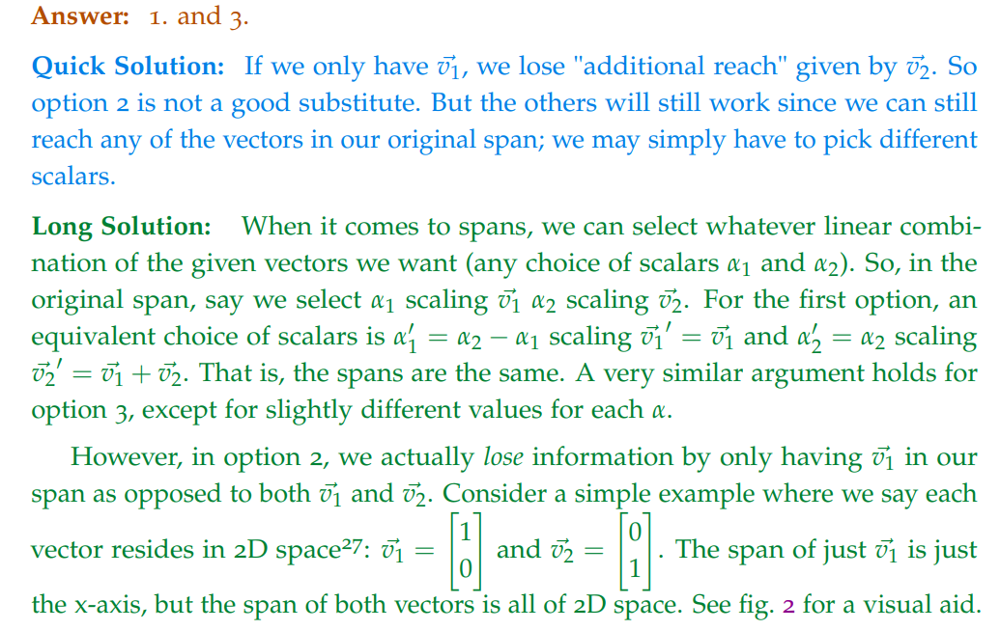

# 1 Systems of Equations&GE

## Linear Equations
> 

**Detailed Explanations (1)**
**Detailed Explanations (2)**
**Detailed Explanations (3)**

## Linear Equations in Matrix Form
> 

**Detailed Explanation (4)**

**Detailed Explanation (5)**
也就是说我们的`RREF`可以有如下几种情况:
$\begin{bmatrix} 1&0&0&*&*&a\\0&1&0&*&*&b\\0&0&1&*&*&c\end{bmatrix}$，$\begin{bmatrix} 1&0&*&*&a\\0&1&*&*&b\\0&0&0&0&0\end{bmatrix}$, $\begin{bmatrix} 1&*&*&a\\0&0&0&0\\0&0&0&0\end{bmatrix}$, 最多有$5$和变量

## Gaussian Elimination
> 

**Detailed Explanation (6)**
**Detailed Explanation (7)**
**Detailed Explanation (8)**⭐⭐⭐
**Detailed Explanation (9)**

## Solving SLEs
> 

**Detailed Explanations (10)**
**Detailed Explanations (11)**

# 2 Matrix Operations and Linear Dependence
## P1 Matrix Multiplication
> 

**Solution**

## P2 Distributivity? 
> 

**Solution**

## P3 NilPotency⭐⭐⭐⭐⭐
> 
> [Nilpotent Matrix](https://en.wikipedia.org/wiki/Nilpotent_matrix)

**Solution**

## P4 Column Extraction
> 

**Solution**

## P5 State Transformation⭐⭐⭐
> 

**Solution**

## P6 Linear Independence - 2 dimension
> 

**Solution**

## P7 Linear Independence - 3 dimension
> 

**Solution**

## P8 Proof for linear dependence
> 

**Solution**

## P9 Span
> 

**Solution**

## P10 Equivalent Span
> 

**Solution**

