# 1 Section 0B
[dis0B.pdf](https://www.yuque.com/attachments/yuque/0/2023/pdf/12393765/1675673733894-a636f229-d055-41c6-bc52-87d9c7675d18.pdf)
[ans0B.pdf](https://www.yuque.com/attachments/yuque/0/2023/pdf/12393765/1675673733800-e21b49d6-6264-4d8f-bfe8-1cc84ee78dac.pdf)


## P1 Energy Disaggregation
> 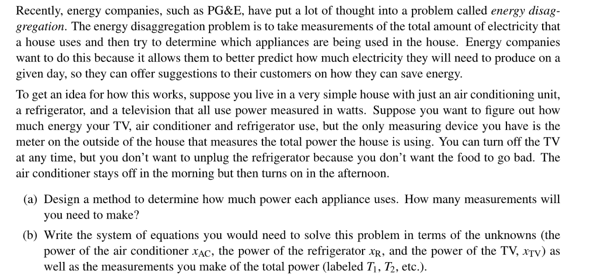

**(a) How many measurements**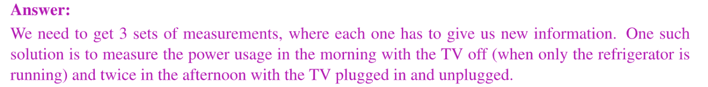
**(b) System of Equation**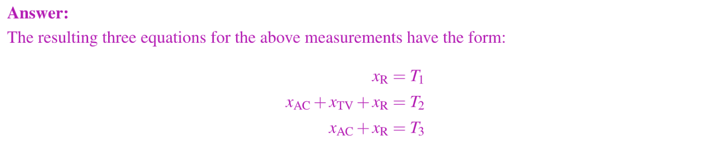


## P2 Systems of Equations
> 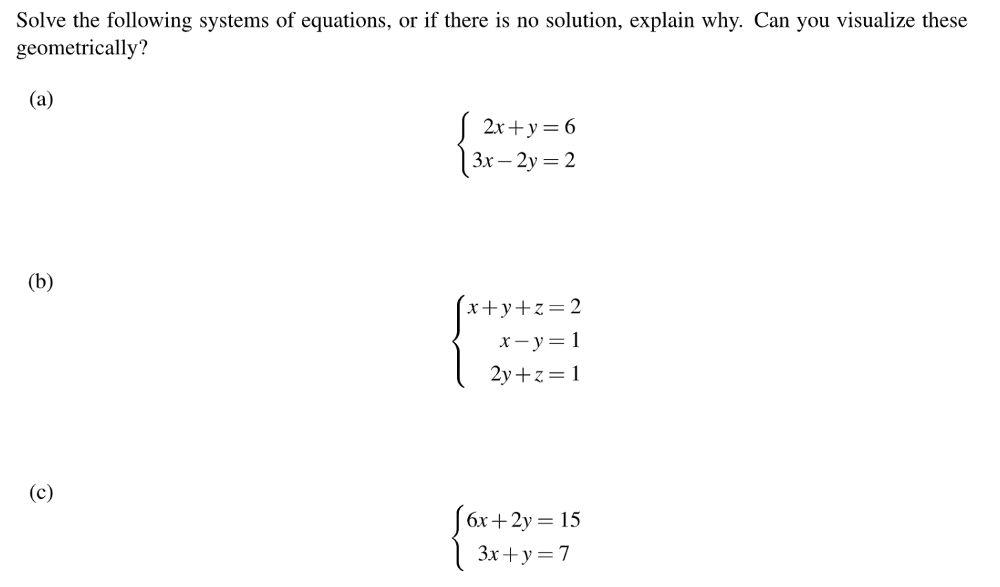

**(a)**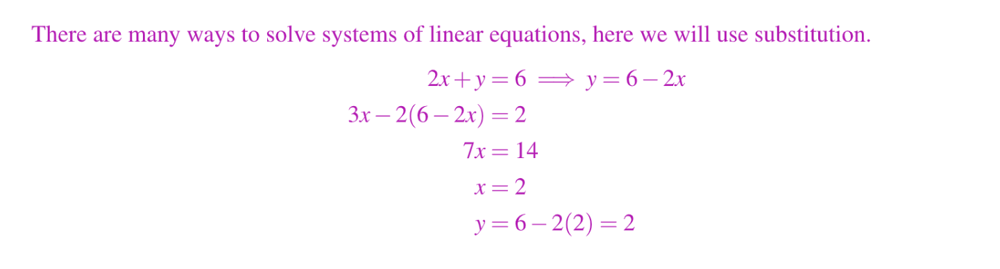
**(b)**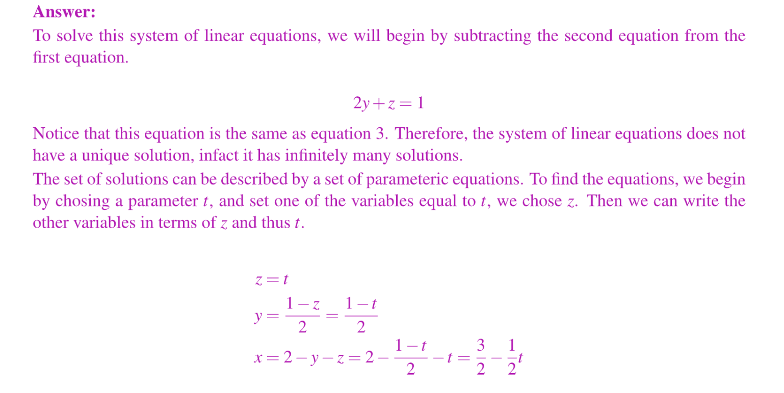
**(c)**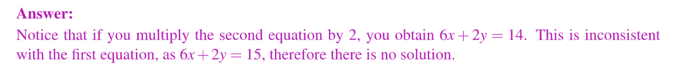

# 2 Section 0C
[moses_dis0C_12PM.pdf](https://www.yuque.com/attachments/yuque/0/2023/pdf/12393765/1675674654721-4e321a0d-1d81-4606-a7e6-cb00e104db8c.pdf)
[dis0C.pdf](https://www.yuque.com/attachments/yuque/0/2023/pdf/12393765/1675673733910-c1d1fd0a-a0ec-4389-8e5a-dbade457da4f.pdf)
[ans0C.pdf](https://www.yuque.com/attachments/yuque/0/2023/pdf/12393765/1675673733887-c93c9ab2-8b2c-4044-967d-80fbf998e384.pdf)


## P1 Linear or Nonlinear
> 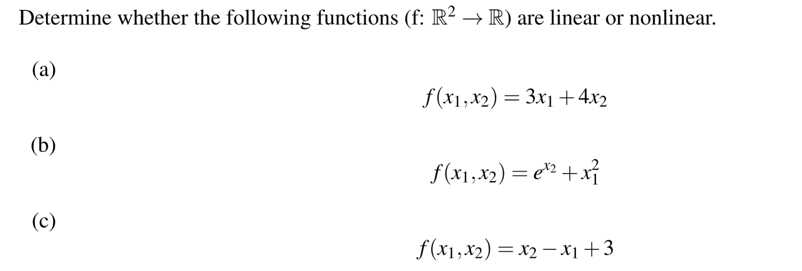

**(a) Linear Function**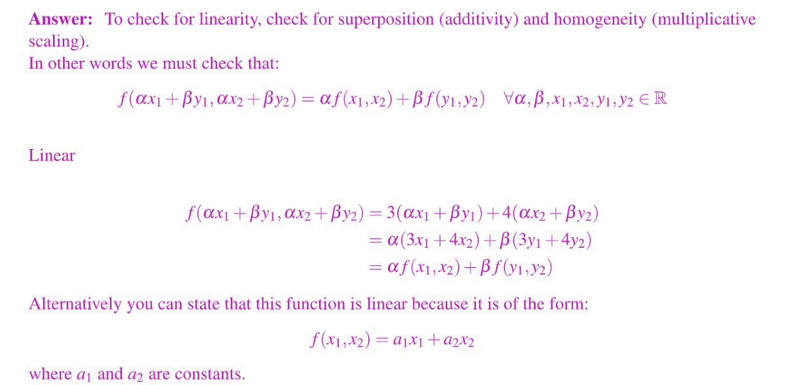
**(b) Non-linear Function**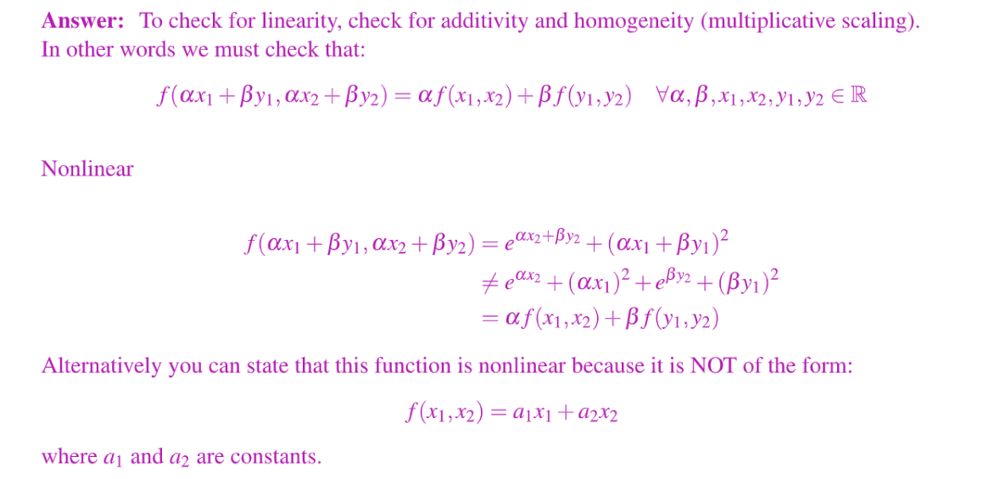
**(c) Affine Function**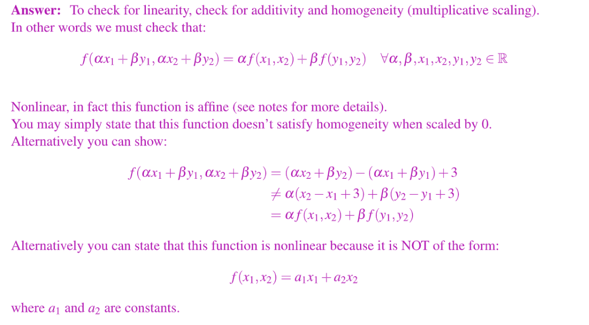


## P2 Gaussian Elimination
> 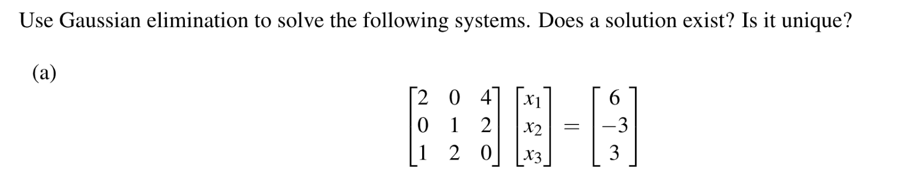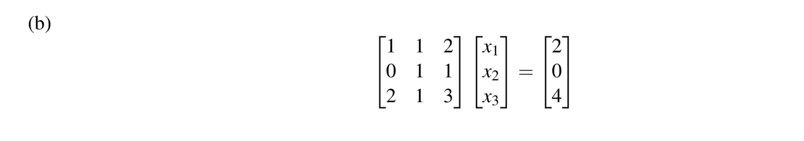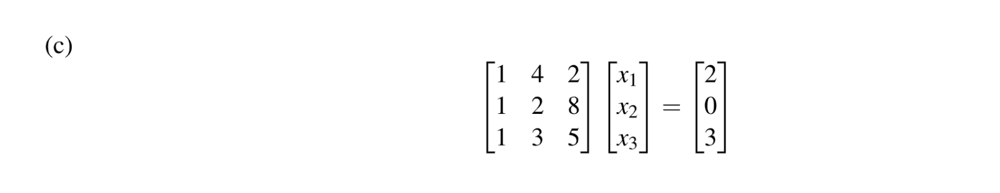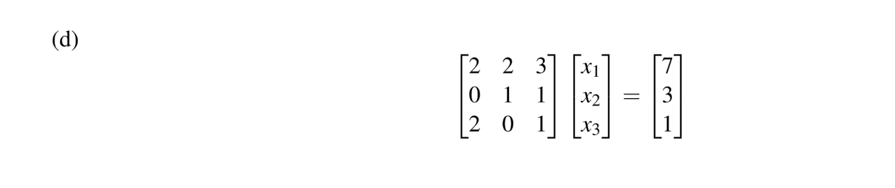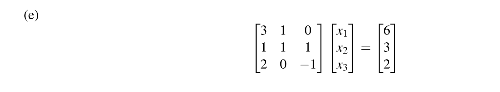

**(a) Unique Solution****REF:**
$\begin{bmatrix} 1&0&2&5\\0&1&2&-1\\0&0&1&-1\end{bmatrix}$
**RREF:**
$\begin{bmatrix} 1&0&0&5\\0&1&0&-1\\0&0&1&-1\end{bmatrix}$

**(b) Infinite Solution****REF:**
$\begin{bmatrix} 1&1&2&2\\0&1&1&0\\0&0&0&0\end{bmatrix}$
**RREF:**
$\begin{bmatrix} 1&0&1&2\\0&1&1&0\\0&0&0&0\end{bmatrix}$
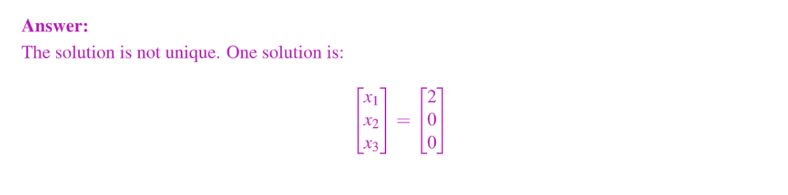
**(c) No Solution****REF:**
$\begin{bmatrix} 1&4&2&2\\0&1&-3&1\\0&0&0&-2\end{bmatrix}$
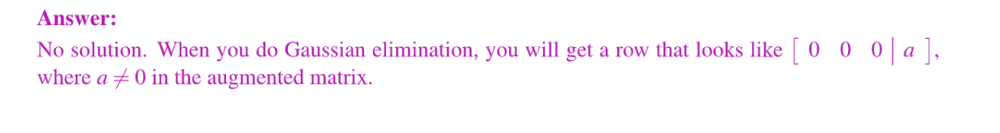
**(d) Infinite Solution****REF:**
$\begin{bmatrix} 1&1&\frac{3}{2}&\frac{7}{2}\\0&1&1&3\\0&0&0&0\end{bmatrix}$
**RREF:**
$\begin{bmatrix} 1&0&\frac{1}{2}&\frac{1}{2}\\0&1&1&3\\0&0&0&0\end{bmatrix}$
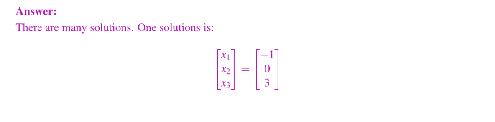
**(e) No Solution****REF:**
$\begin{bmatrix} 1&\frac{1}{3}&0&2\\0&1&\frac{3}{2}&\frac{3}{2}\\0&0&0&-1\end{bmatrix}$


## P3 Finding The Bright Cave⭐⭐⭐⭐⭐
> 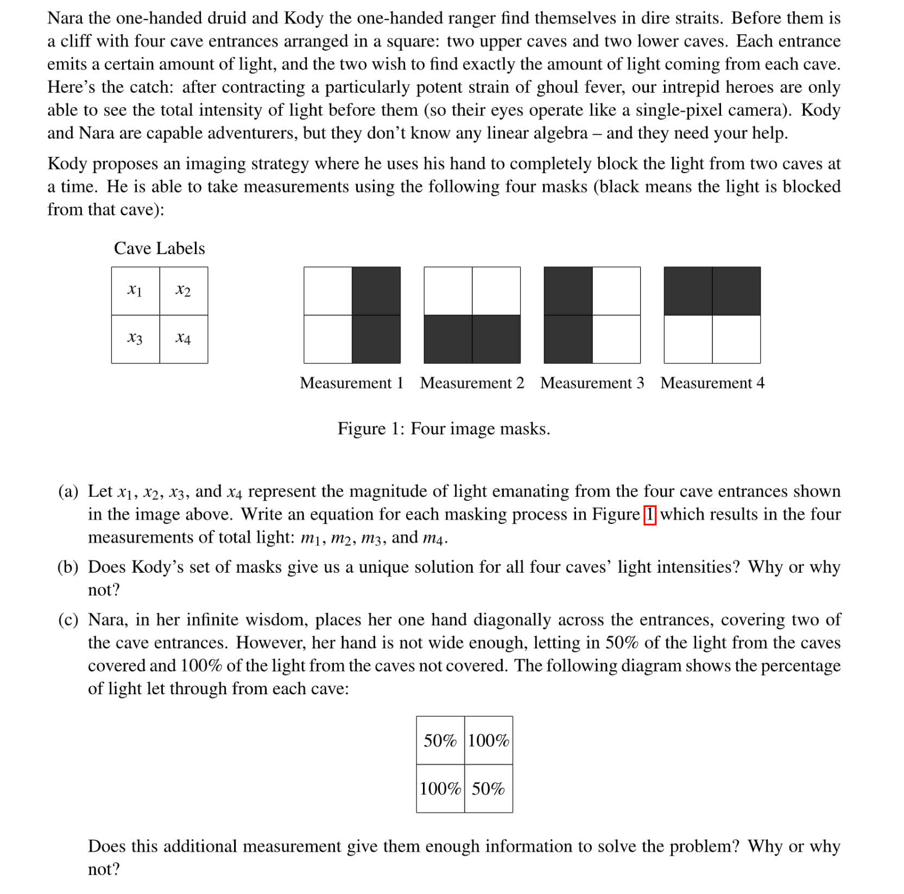

**(a) System of Linear Equations**
**(b) Solving SLE - Not Unique**⭐⭐⭐**RREF:**
$\begin{bmatrix} 1&0&1&0&m_1\\0&1&-1&0&m_2-m_1\\0&0&1&1&m_1+m_3-m_2\\0&0&0&0&m_2+m_4-m_1-m_3\end{bmatrix}$
且从$(a)$问中可知:
$\begin{align} x_1+x_2+x_3+x_4 = m_1+m_3\\ x_1+x_2+x_3+x_4=m_2+m_4\end{align}$, 即$m_1+m_3 = m_2+m_4$, 所以最后一行实际上是全零的，这意味着`Not Unique`(也就是要么无解要么无数个解)
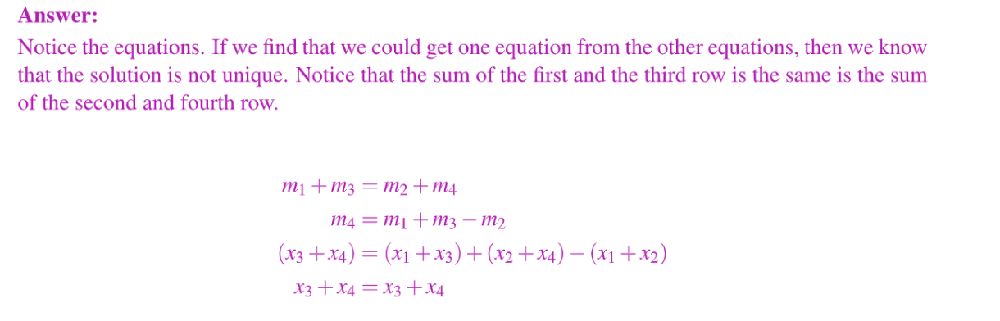
**(c) Row Perspective**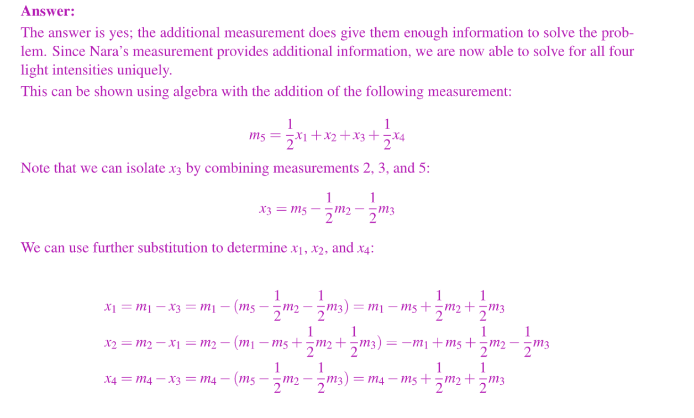


# 3 Section 0D
[dis0D.ipynb](https://www.yuque.com/attachments/yuque/0/2023/ipynb/12393765/1675673734183-c93107fb-e97d-40e3-bff1-cfc4569f3825.ipynb)
[moses_dis0D_12PM.pdf](https://www.yuque.com/attachments/yuque/0/2023/pdf/12393765/1675678353343-82d8f7ac-4a04-4fbf-abf6-7add34125122.pdf)
[dis0D.pdf](https://www.yuque.com/attachments/yuque/0/2023/pdf/12393765/1675673734462-59992953-e7e3-4e4c-99cd-b8aea4f6ac25.pdf)
[ans0D.pdf](https://www.yuque.com/attachments/yuque/0/2023/pdf/12393765/1675673733904-bcf88610-0b9f-4ea5-ac94-fe2f908a3007.pdf)


## P1 SLE - Geometry⭐⭐⭐⭐⭐
> 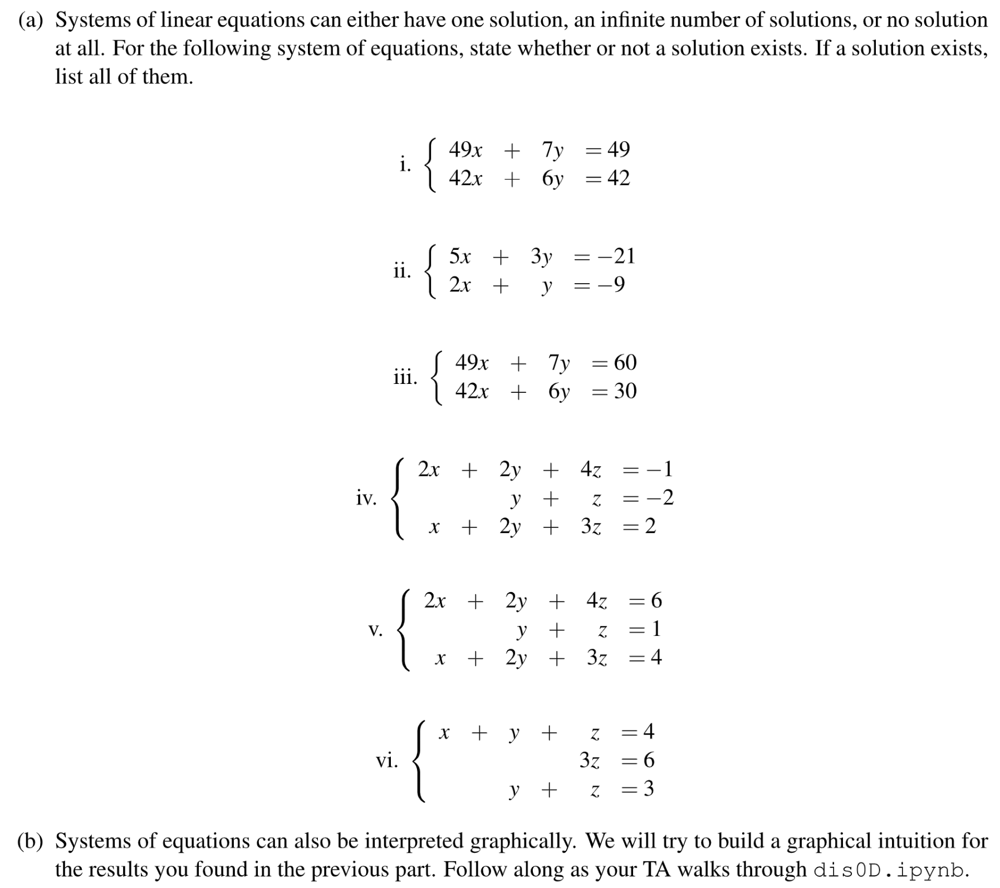

**(a) - i**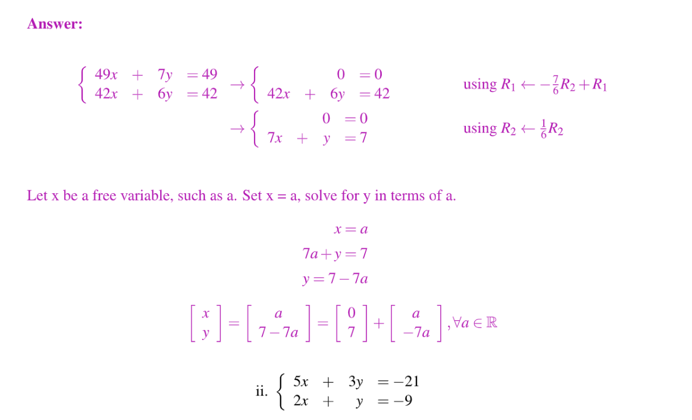
**(a) - ii**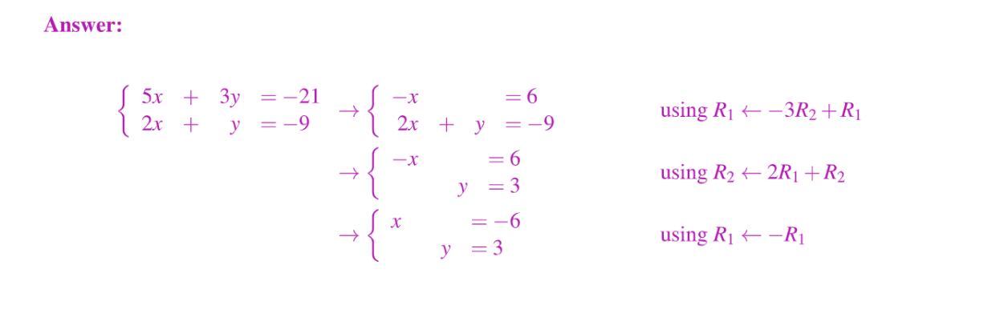
**(a) - iii**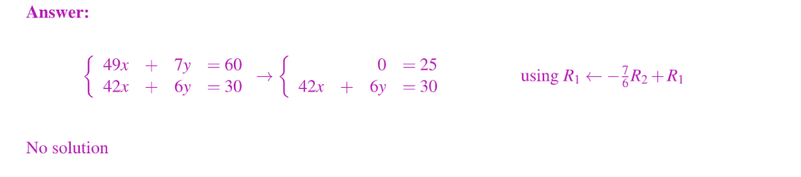
**(a) - iv**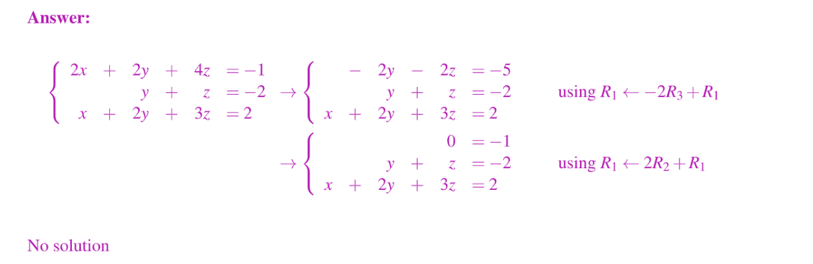
**(a) - v**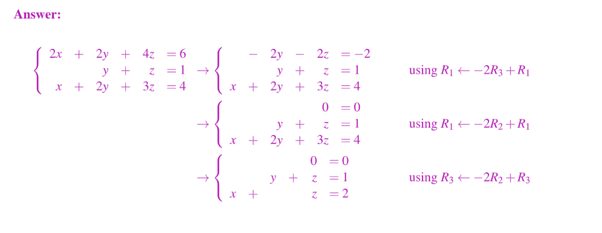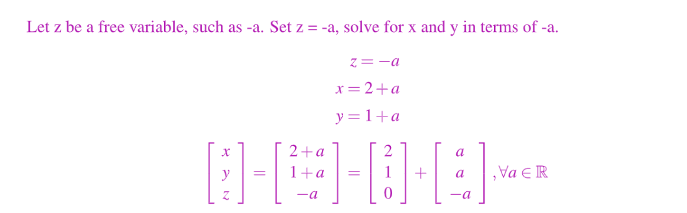
**(a) - vi**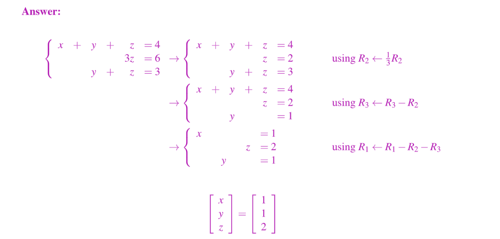
```python
# imports
import numpy as np
from matplotlib import pyplot as plt
# if you're in your own Jupyter notebook, you can use this for interactive plotting
# %matplotlib notebook

def line_xy(a,b,c):
    '''For the parameters a,b,c this function returns (x, y) pairs
    that are on the line ax+by = c'''
    b = b+.00001  # just avoiding divide-by-zero in line below
    x_range = [-100, 100]
    x = np.linspace(x_range[0],x_range[1],100)
    y = (c - a*x) / b    
    return x, y

# use for parts i-iii, can change the parameters across i - iii
# TODO: Parameters for the first line
a1 = 49
b1 = 7
c1 = 49

# TODO: Parameters for the second line
a2 = 42
b2 = 6
c2 = 42

x1, y1 = line_xy(a1,b1,c1)
x2, y2 = line_xy(a2,b2,c2)

fig = plt.figure()

# # let matplotlib set the axis limits
ax = fig.add_subplot(111)

# or you can change these manually to make the plot look better
# plot_xlimits = [-100, 100] 
# plot_ylimits = [-1000, 1000] 
# ax = fig.add_subplot(111, xlim=plot_xlimits, ylim=plot_ylimits)

ax.plot(x1,y1,'-.b')
ax.plot(x2,y2,'r', alpha=0.5)
ax.grid(True)
ax.legend(['Line 1','Line 2'])
```
```python
# while there are several ways to generate cool interactive plots in IPython notebooks, 
# for this we are going to use a package called Plotly which seems to mostly work in Colab. 
# You can read more about it here: https://plotly.com/python/
from plotly import graph_objects
from plotly import offline

def plane_xyz(a,b,c,d):
    '''For the parameters a,b,c,d this function returns matrices x_mat, y_mat, and z_mat
    that we can use to visualize a plane with the form ax+by+cz = d'''
    
    c = c+.00001  # again, avoid divide by zero
    x_range = [-10, 10]
    x = np.linspace(x_range[0],x_range[1],100)
    y = np.linspace(x_range[0],x_range[1],100)
    yt = y[:,np.newaxis]
    
    x_mat, y_mat = np.meshgrid(x, y, indexing='xy')
    z_mat = (d - a*x_mat - b*y_mat) / c
    return x_mat, y_mat, z_mat


# just defining to objects we'll use to format how the plot looks
axis_obj = dict(
    gridcolor="rgb(255, 255, 255)",       # set grid line color
    zerolinecolor="rgb(255, 255, 255)",   # set zero grid line color
    range=[-10, 10]
)
layout_obj = graph_objects.Layout(
    title='Planes in 3D',                 # set plot title
    scene=graph_objects.layout.Scene(            # (!) axes are part of a 'scene' in 3d plotly plots
        xaxis=graph_objects.layout.scene.XAxis(axis_obj),  # set x-axis style
        yaxis=graph_objects.layout.scene.YAxis(axis_obj),  # set y-axis style
        zaxis=graph_objects.layout.scene.ZAxis(axis_obj)), # set z-axis style
    showlegend=True
)


# Use for parts iv-vi, can change the parameters across iv - vi

# Parameters for the first plane
a1 = 2
b1 = 2
c1 = 4
d1 = -1

# Parameters for the second plane
a2 = 0
b2 = 1
c2 = 1
d2 = -2

# Parameters for the third plane
a3 = 1
b3 = 2
c3 = 3
d3 = 2

# Plotting 
x1, y1, z1 = plane_xyz(a1,b1,c1,d1)
x2, y2, z2 = plane_xyz(a2,b2,c2,d2)
x3, y3, z3 = plane_xyz(a3,b3,c3,d3)

blue=[[0, 'rgb(0,0,255)'], [1, 'rgb(0,0,255)']]
green=[[0, 'rgb(0,255,0)'], [1, 'rgb(0,255,0)']]
red=[[0, 'rgb(255,0,0)'], [1, 'rgb(255,0,0)']]


trace1 = graph_objects.Surface(x=x1, y=y1, z=z1, colorscale=blue, name='First Plane')
trace2 = graph_objects.Surface(x=x2, y=y2, z=z2, colorscale=green, name='Second Plane')
trace3 = graph_objects.Surface(x=x3, y=y3, z=z3, colorscale=red, name='Third Plane')
fig = graph_objects.Figure(data=[trace1, trace2, trace3], layout=layout_obj)
offline.iplot(fig)
```
**Program Output i ~ iii**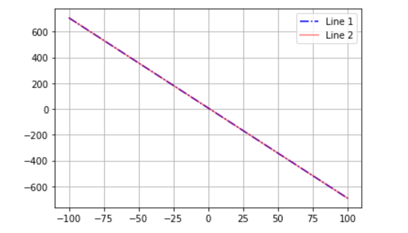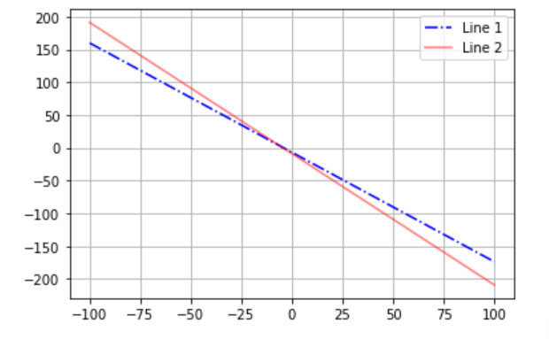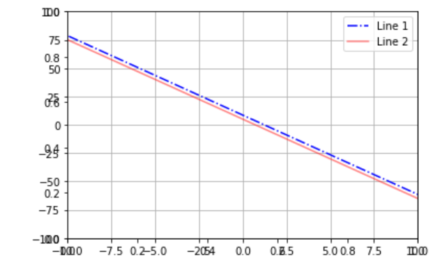
**Program Output iv ~ vi**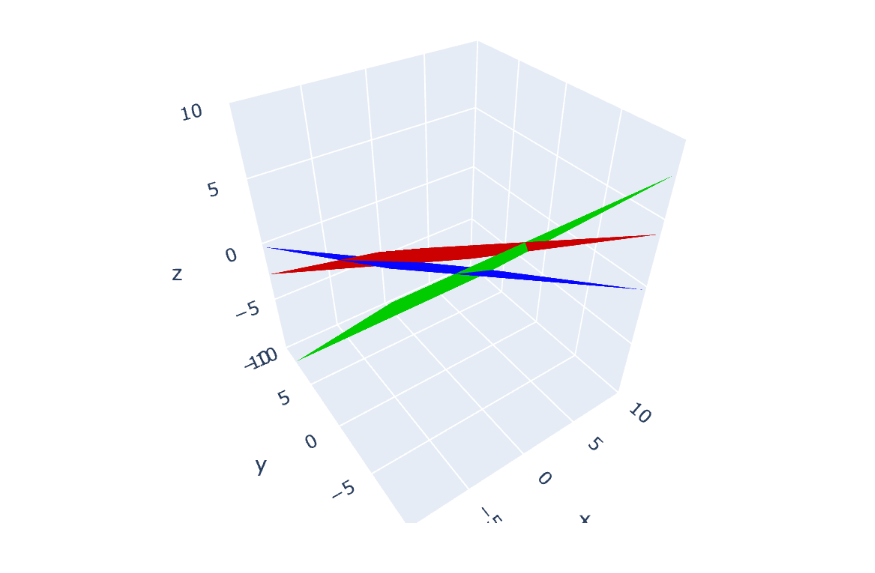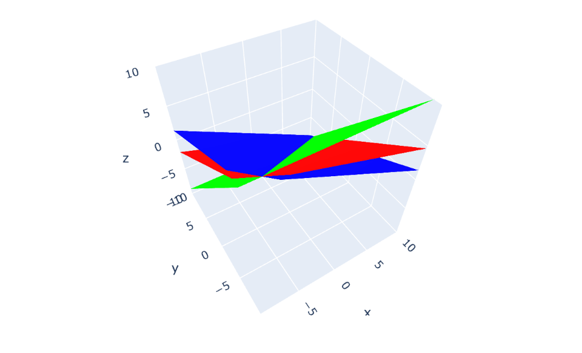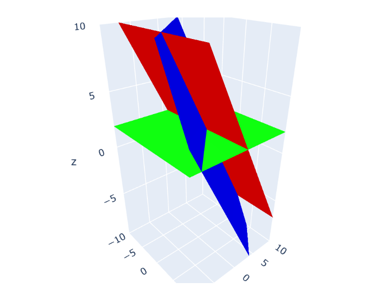
**(b) - Graphical Interpretation**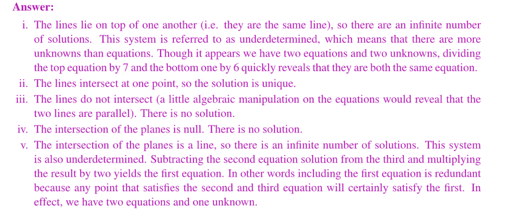


## P2 Vectors - Geometry
> 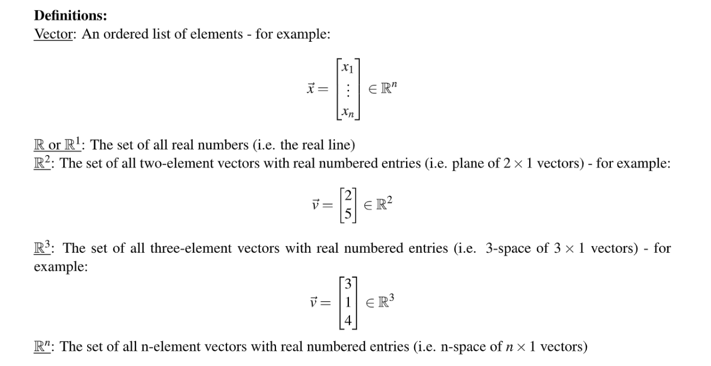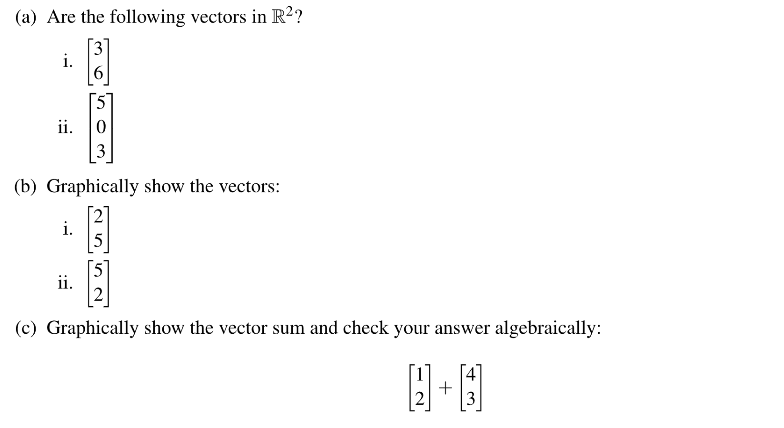

**(a)**
**(b)**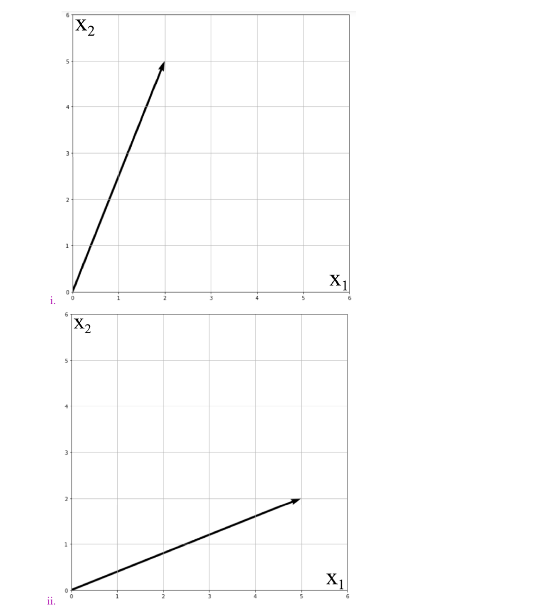
**(c)**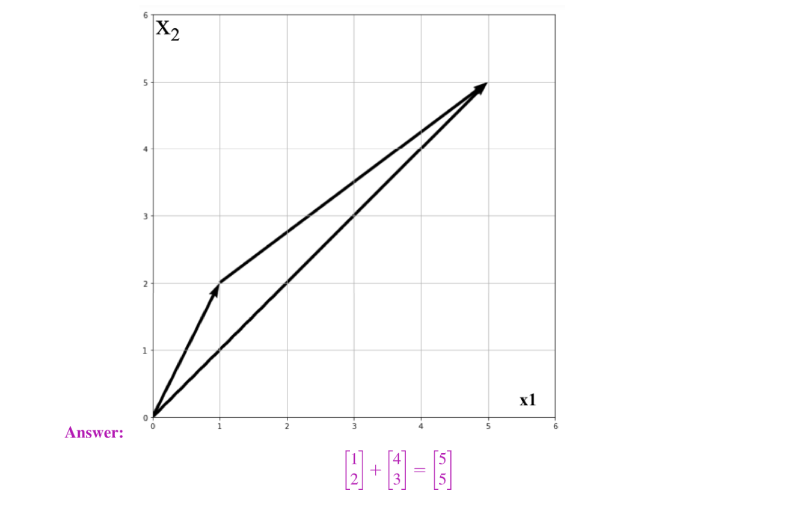

## P3 Matrix Multiplication
> 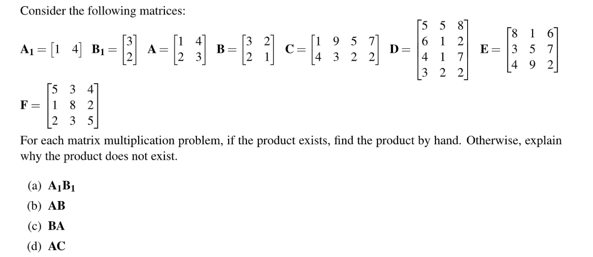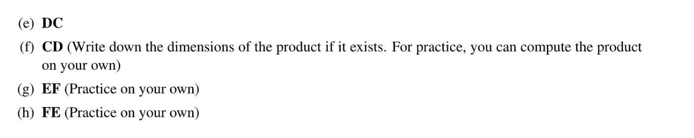

**Solutions**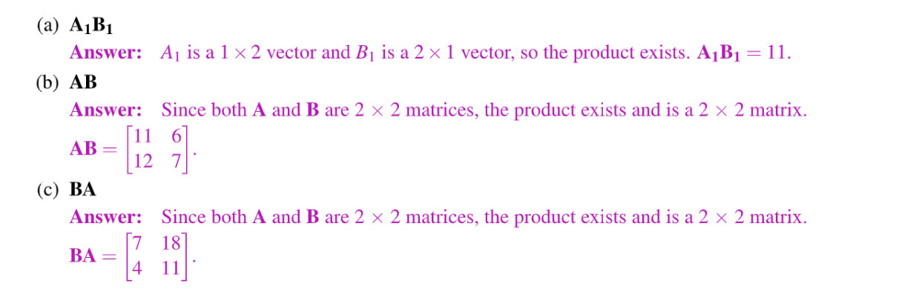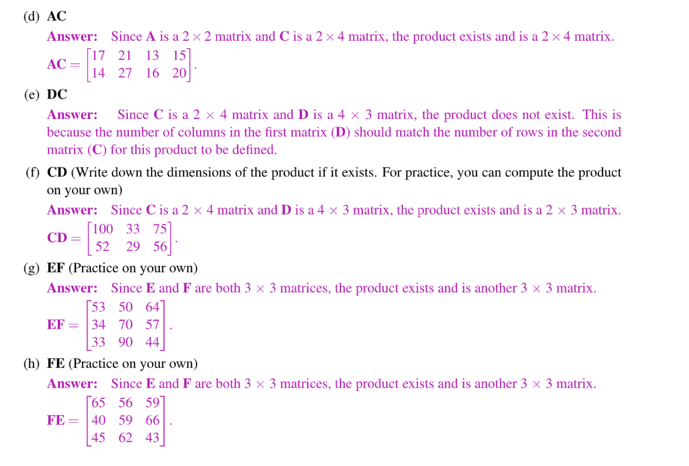
