#! https://zhuanlan.zhihu.com/p/612604068
[Note6.pdf](https://www.yuque.com/attachments/yuque/0/2023/pdf/12393765/1676125926646-d8b7f82c-1a37-43b8-8239-ba0a475fe54f.pdf)
[Written_Notes6.pdf](https://www.yuque.com/attachments/yuque/0/2023/pdf/12393765/1676125926654-db451988-8ec0-48b5-ba0d-3227fb2962ac.pdf)

# Definition

> 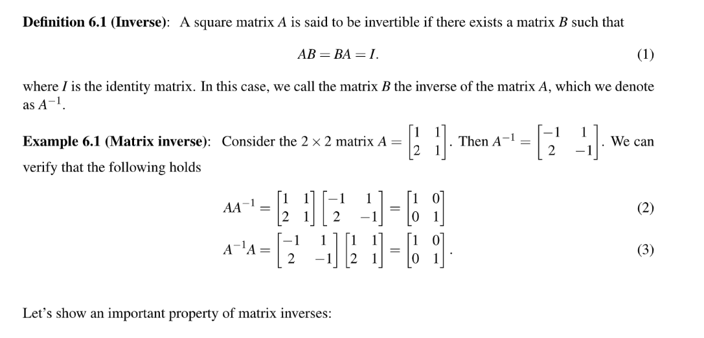

# Uniqueness Theorem⭐⭐⭐

> 

**Proof**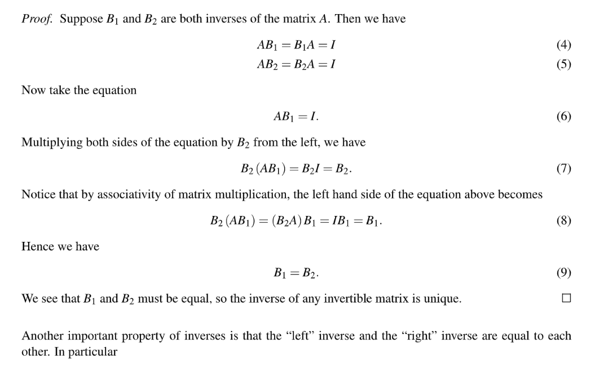

# Right&Left Inverse

> 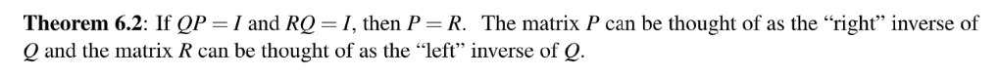

**Proof**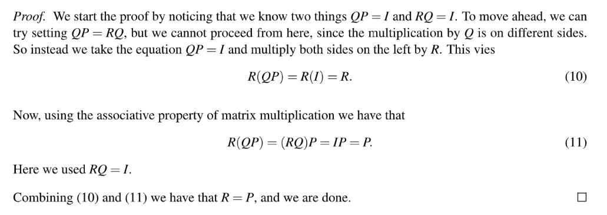

# Finding Inversion By GE

> 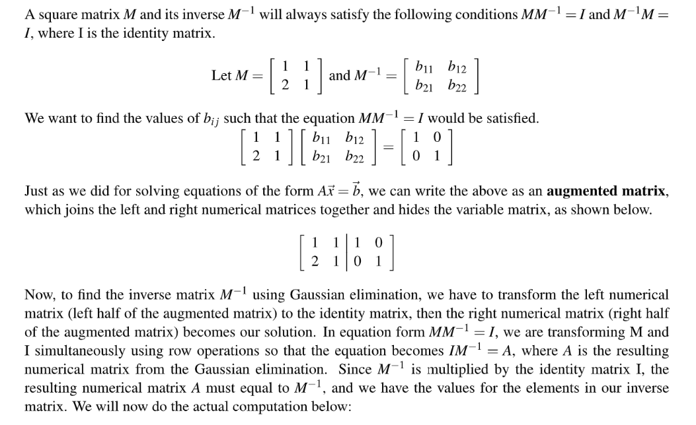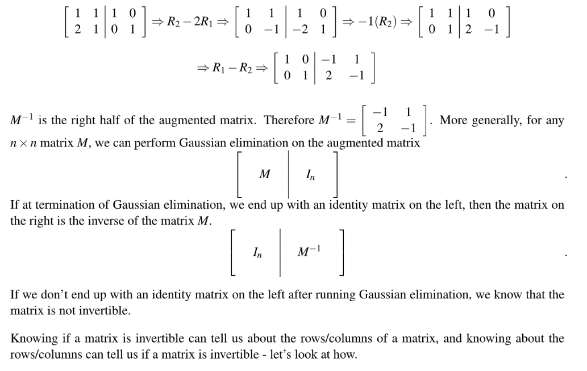

# Invertibility Intuition

## Input Vector Perspective

> 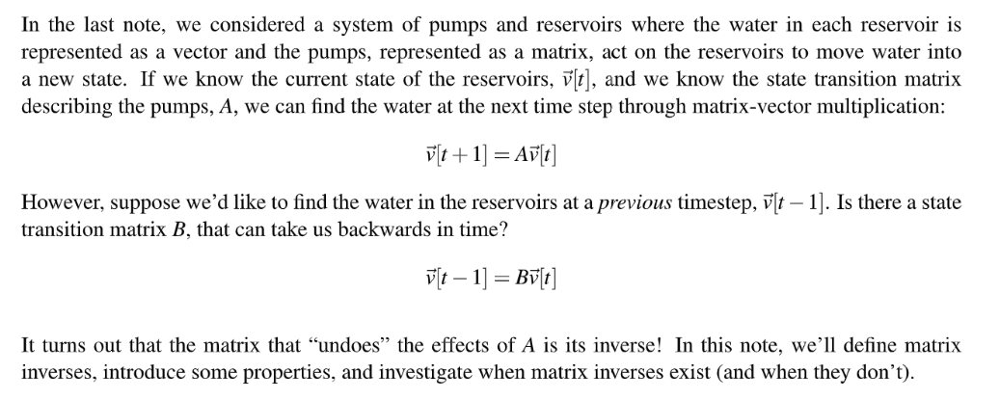

## Row Perspective

> 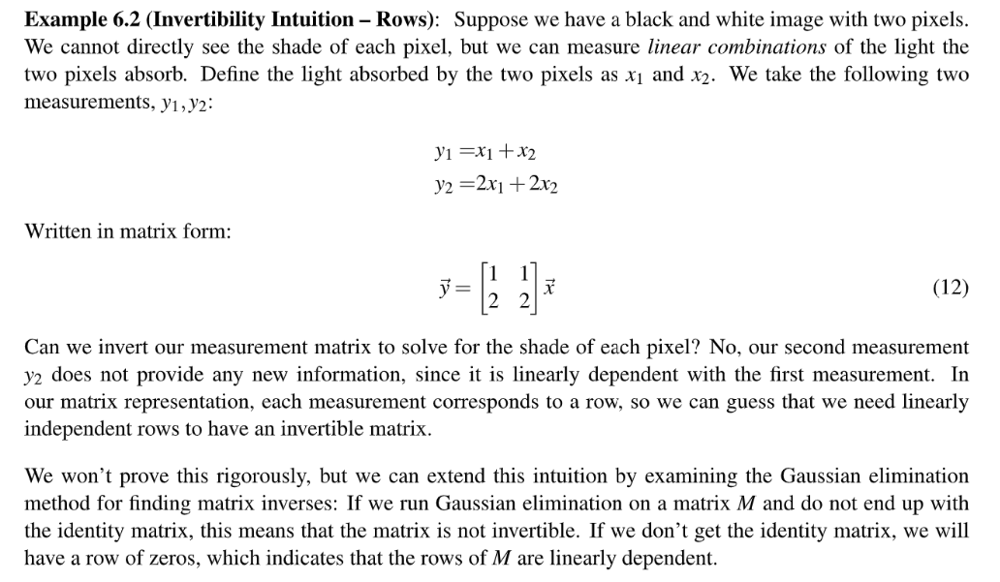

## Column Perspective

> 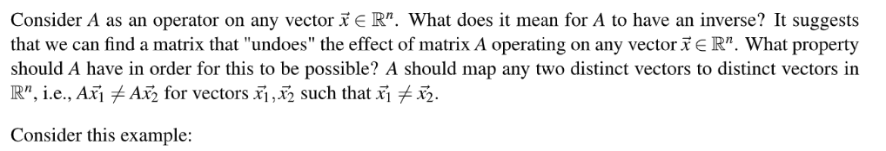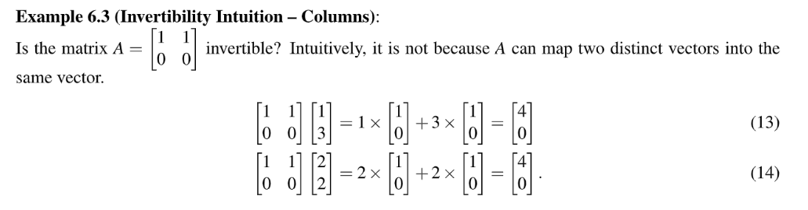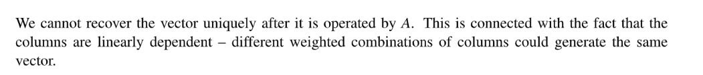

# Unique Solution Theorem

> 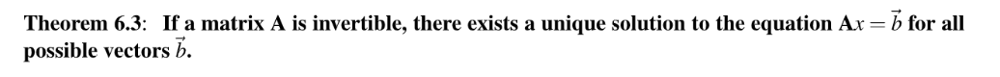

**Proof**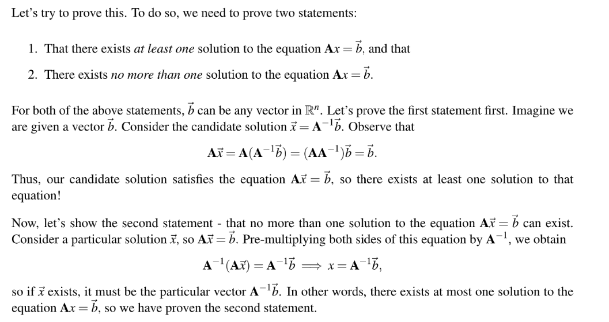

# Column Independence

> 

**Proof**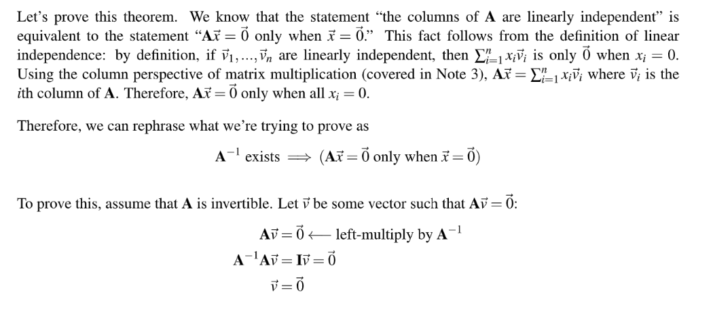

# Summay Theorems

> 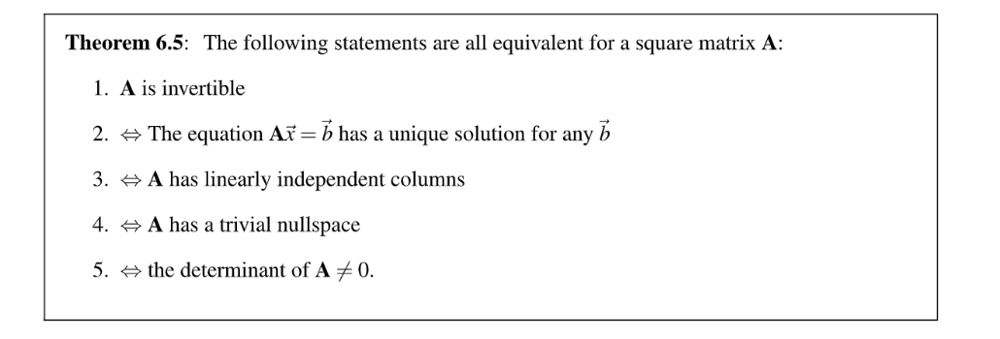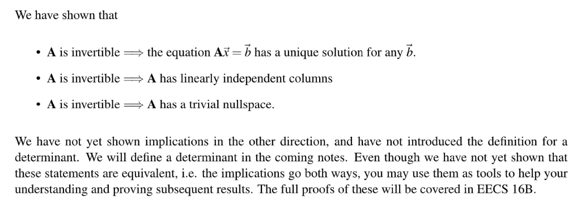
