[Note5.pdf](https://www.yuque.com/attachments/yuque/0/2023/pdf/12393765/1675731734797-93344de4-f124-44d5-963e-b79c0e36236b.pdf)
[Written_Notes5.pdf](https://www.yuque.com/attachments/yuque/0/2023/pdf/12393765/1675731736310-1e603936-da2f-4779-a27e-74f1cab0bc99.pdf)

# Outer Product
> 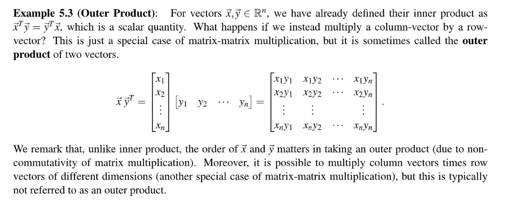
> - Order Matters for outer product.
> - Order doesn't matter for inner product.

# Properties of MM Multiplication
> 1. Associativity: $A(BC)=(AB)C$
> 2. Not communitive: $AB\neq BA$

**Water Reservoir Example - Associativity**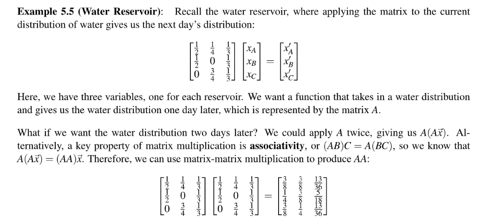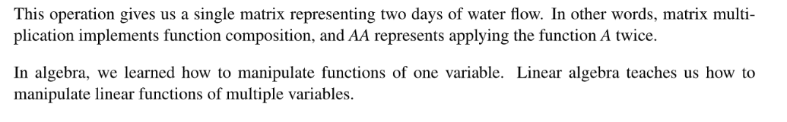

# Matrix Polynomials⭐⭐⭐⭐⭐
> 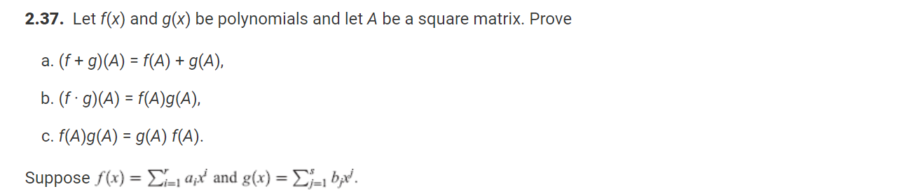

**Solution**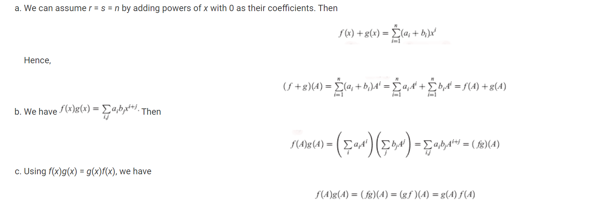

# Linear Transformations
> 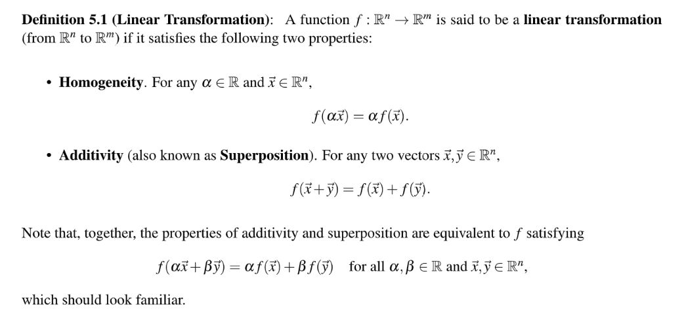
> 就是`Linear Function`在`Vector`上定义的一种表达。
> 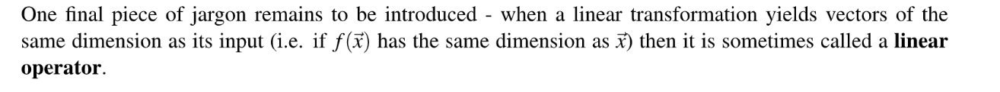

# State Transit Matrix
## Water&Reserviors
> 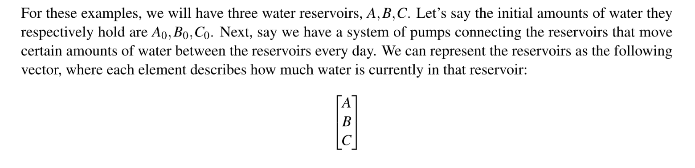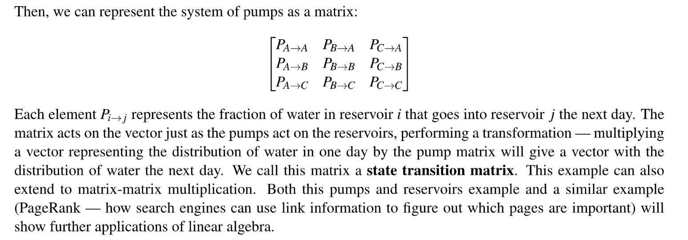

## Basic Pump
> 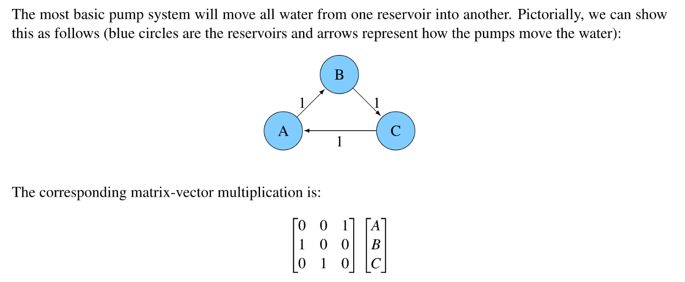
> 可以看见，左侧的这个`Transition Matrix`是一个`Permutation Matrix`，只是将$A,B,C$的位置对调一下。
> 假设在每个`Reservior`中的初始水量是 $A_0,B_0,C_0$. 则我们可以计算在开启水泵之后的重新分配过后的水量$A_1,B_1,C_1$如下:
> 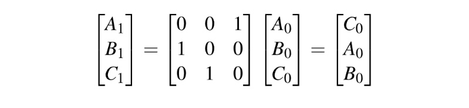

## Identity Matrix Pump
> 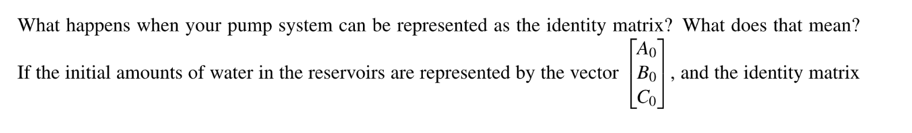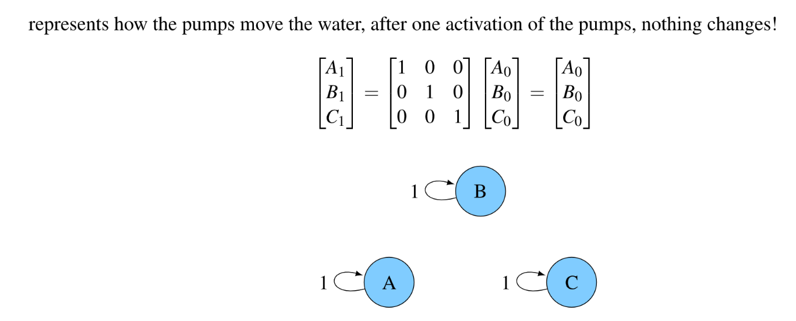

## Drain Matrix
> 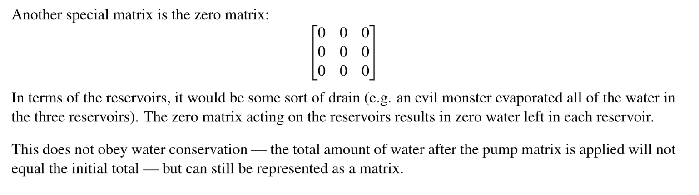

## Conservation of Water
> 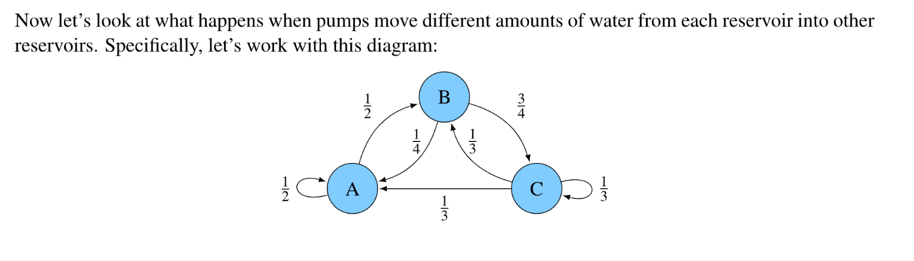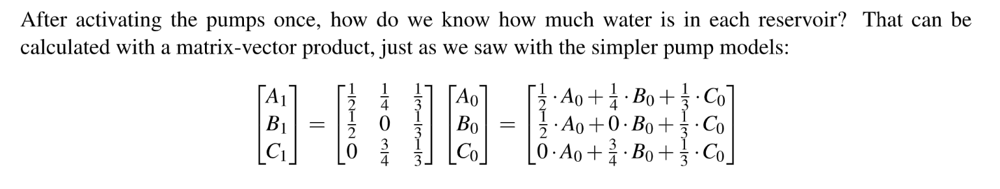

# MM Multiplication 
## Twin Cities
> 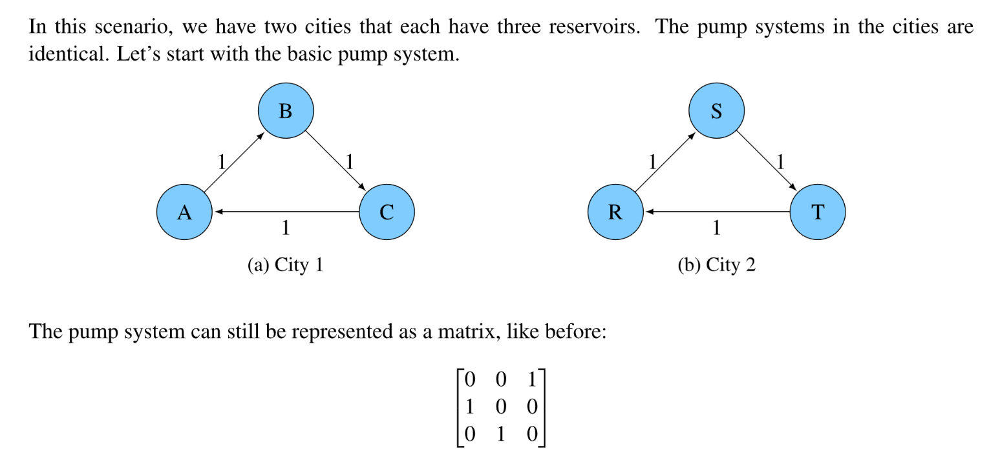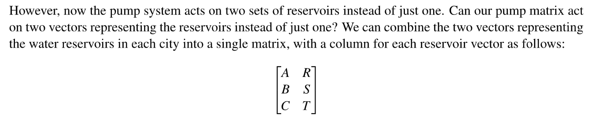

## Generalized Version
> 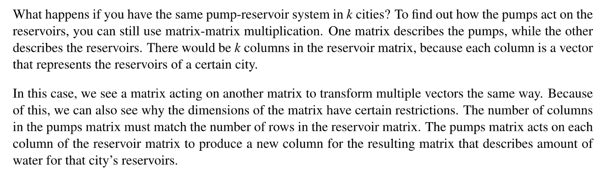

## A Multiple of Pumps
> 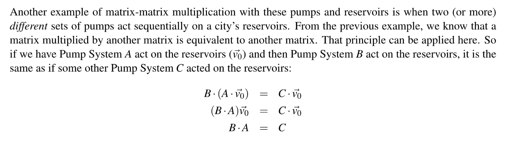

## Continuous&Discrete Pumps
> 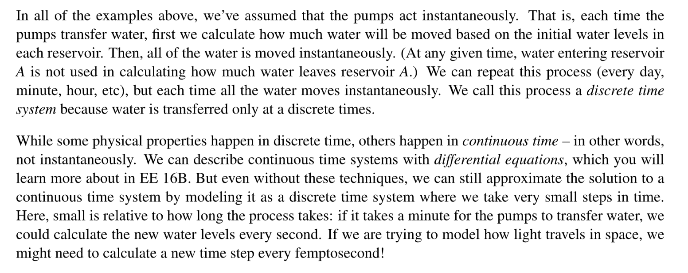

