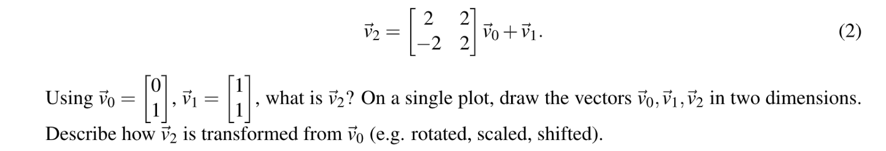
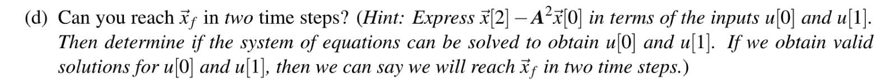

# HWSU201A
[prob1A.pdf](https://www.yuque.com/attachments/yuque/0/2023/pdf/12393765/1677681482778-cf706393-8f70-4d01-93fc-755f032519ca.pdf)
[prob1A.zip](https://www.yuque.com/attachments/yuque/0/2023/zip/12393765/1677681482779-797246b4-7cee-4061-b13d-d6b9ffd69d2a.zip)


## P1 Kinematic Model for a Simple Car
### 建模介绍
> 本题的学习目标是对生活中的一些非线性系统用线性系统来近似地建模。下面我们将探究如何使用向量来对车的运动建模。
> 本质上对于一辆车来说，我们可以将其放在二维坐标系中建模，在$k$时间步，我们选择使用四个随时间变化的状态来完整近似描述一辆车在某一时刻的位置和朝向信息。
> 1. $x[k]$表示$x$轴坐标
> 2. $y[k]$表示$y$轴坐标
> 3. $\theta[k]$表示$k$时间步车头的朝向, 定义为和$x$轴的逆时针的夹角的弧度制。
> 4. $\phi[k]$表示$k$时间步方向盘的朝向，可以和车头的朝向不同。且定义为和车头朝向的逆时针夹角的弧度大小。
> 
使用两个随时间变化的状态来描述汽车在某一时刻的速度和加速度(运动信息):
> 1. $v[k]$表示在$k$时间步汽车的速度大小。
> 2. $a[k]$表示在$k$时间步汽车的加速度大小，定义为和速度朝向一致，否则我们还需要更多变量来描述。
> 
使用一个变量来描述汽车的参数:
> 1. $L$表示车身长度
> 2. $\Delta t$表示在两个相邻的时间步之间经过的时间
> 
总的来说如下图所示:
> 


### Part (a) 近似角度
> 
> 假设:
> 1. 车头朝向的角度$\theta[k]$相对于$x$轴来说很小
> 2. 方向盘相对于车头朝向的偏角$\phi[k]$也很小
> 
此时:
> 1. $sin(\theta[k])\approx 0$
> 2. $cos(\theta[k])\approx 1$
> 3. $tan(\theta[k])\approx 0$
> 
画图部分省略。比较简单。


### Part (b) Transition Matrix
> 本题要求我们写出状态转移矩阵，也就是从$k$时间步到$k+1$时间步的过渡。
> 
> 我们从`建模介绍`中寻找思路:
> 首先我们化简`建模介绍`中的四个方程(利用$\phi[k]$和$\theta[k]$在时间步$k$很小的事实)，可以得到:
> $\begin{align} x[k+1] &= x[k]+v[k]\cdot1\cdot\Delta t\\y[k+1]&=y[k]+v[k]\cdot 0\cdot \Delta t\\\theta[k+1]&=\theta[k]+\frac{v[k]}{L}\cdot 0\cdot \Delta t\\v[k+1]&=v[k]+a[k]\Delta t\end{align}$
> 所以我们可以构造出这样的矩阵来:
> $\begin{bmatrix}x[k+1]\\y[k+1]\\\theta[k+1]\\v[k+1] \end{bmatrix}=\begin{bmatrix} 1&0&0&\Delta t\\0&1&0&0\\0&0&1&0\\0&0&0&1\end{bmatrix}\begin{bmatrix}x[k]\\y[k]\\\theta[k]\\v[k] \end{bmatrix}+\begin{bmatrix} 0&0\\0&0\\0&0\\\Delta t&0\end{bmatrix}\begin{bmatrix}a[k]\\\phi[k]\end{bmatrix}$

```python
# Your code here.
A = np.array([[1, 0, 0, dt], 
              [0, 1, 0, 0], 
              [0, 0, 1, 0], 
              [0, 0, 0, 1]])

B = np.array([[ 0, 0], 
              [ 0, 0], 
              [ 0, 0], 
              [ dt, 0]])
```

### Part (c) Linear Driving
> 
> 
> 我们发现`Linear`和`Non-Linear`的结果很接近，原因是我们的$\theta[k]$ 和$\phi[k]$很小，可以忽略不计，也就是说，车辆几乎就是沿直线行驶，所以我们完全可以使用线性化(使用矩阵乘法)的估计方式，得到的结果和实际情况相差无几。

```python
# Your code here.
x_init  = 5.0
y_init  = 10.0
theta_init = 0.0
v_init     = 2.0
a_input    = 1.0
phi_input  = 0.0001

state_init = [x_init, y_init, theta_init, v_init]
state_predictions_nonlinear = nonlinear_vehicle_model(state_init, [a_input, phi_input], 10)
state_predictions_linear = linear_vehicle_model(A, B, state_init, [a_input, phi_input], 10)

make_model_comparison_plot(state_predictions_nonlinear, state_predictions_linear)

```


### Part (d) Nonlinear Driving
> 
> 
> 我们发现`Linear`和`Non-Linear`的结果不是很接近，原因是我们的$\phi[k]$不能忽略不计，也就是说，车辆不是沿直线行驶，所以使用线性化(使用矩阵乘法)的估计方式得到的结果和实际情况会有所出入。

```python
# Your code here.
x_init  = 5.0
y_init  = 10.0
theta_init = 0.0
v_init     = 2.0
a_input    = 1.0
phi_input  = 0.5

state_init = [x_init, y_init, theta_init, v_init]
state_predictions_nonlinear = nonlinear_vehicle_model(state_init, [a_input, phi_input], 10)
state_predictions_linear = linear_vehicle_model(A, B, state_init, [a_input, phi_input], 10)

make_model_comparison_plot(state_predictions_nonlinear, state_predictions_linear)
print(state_predictions_nonlinear[10])
print(state_predictions_linear[10])
```

## P2 Proof of Linear Dependence⭐⭐⭐⭐⭐
> 
> **(a): **因为高斯消元的本质就是行之间的线性组合，本质就是某一行倍乘之后加到另外一行，如果操作之后某一行变成了全零，就说明这一行可以表示成其他行的线性组合，这就符合线性相关的性质。
> **(b): **因为$A$的列线性相关，所以方程$Ax=\vec{0}$有`Non-trivial Solutions`, 这意味着我们的`Basic Variables`(Pivot Variables) 的数量小于$n$, 因为矩阵是$n\times n$的，所以对于$A^Tx=\vec{0}$来说仍然有`Non-trivial Solutions`，这意味着矩阵$A$的行也是线性相关的。 
> **(c): **$span\{\vec{v_1},\vec{v_2},\cdots, \vec{v_n}\}=\{\sum_{i}a_i\vec{v_i}, a_i\in \mathbb{R}\}$**, **同时$span\{\vec{v_1}+\vec{v_2},\cdots, \vec{v_n}\}=\{\sum_{}a_1(\vec{v_1}+\vec{v_2})+\cdots+a_n\vec{v_n},a_i\in \mathbb{R}\}$
> 我们可以将$\vec{v_2}$前的系数合并，所以本质上两个`span`没有任何区别。


# HWSU201B
[gauss_elim.py](https://www.yuque.com/attachments/yuque/0/2023/py/12393765/1677759167089-994f5ec1-6875-4c9b-88ea-cc07cab0260f.py)
[prob1B.ipynb](https://www.yuque.com/attachments/yuque/0/2023/ipynb/12393765/1677759167146-3ed9431c-9bee-40c2-ad7e-571885cd06fc.ipynb)
[prob1B.pdf](https://www.yuque.com/attachments/yuque/0/2023/pdf/12393765/1677759167357-4d7aa426-4bb9-42c2-aa2e-59d34430a45c.pdf)
[prob1B.zip](https://www.yuque.com/attachments/yuque/0/2023/zip/12393765/1677759167468-572a3665-4953-40b8-b9c9-4d3ca1e8bfce.zip)


## P1 Computing Inverses
> 
> **(a): 矩阵的逆存在, 且矩阵**$A$**为翻转矩阵。**通过公式$\frac{1}{ad-bc}\begin{bmatrix} d&-b\\-c&a\end{bmatrix}$得到$A^{-1}=\begin{bmatrix} 0&1\\1&0\end{bmatrix}$。同时我们发现，这个矩阵是对称矩阵，所以很可能是一个翻转矩阵，因为翻转矩阵的参数化形式是$\begin{bmatrix} cos\theta&sin\theta \\ sin\theta & -cos\theta\end{bmatrix}$, 于是我们令$\theta=\frac{\pi}{2}$, 此时对称轴是$\frac{\pi}{4}$。我们可以验证一下，对于向量$\begin{bmatrix} x\\y\end{bmatrix}$来说，我们有$\begin{bmatrix} 0&1\\1&0\end{bmatrix}\begin{bmatrix} x\\y\end{bmatrix}=\begin{bmatrix}y\\x\end{bmatrix}$, 所以对称轴就是$y=x$。
> **(b): 矩阵的逆存在, 同时矩阵**$A$**为翻转矩阵。**通过公式$\frac{1}{ad-bc}\begin{bmatrix} d&-b\\-c&a\end{bmatrix}$得到$A^{-1}=\begin{bmatrix} -1&0\\0&1\end{bmatrix}$。和(a)问中一样，矩阵$A$也是一个翻转矩阵，参数$\theta = \pi$, 对称轴为$\frac{\pi}{2}$。
> **(c): 矩阵的逆不存在，**因为其行列式的值为$0$。


## P2 Quadcopter Transformations
### Problem Settings
> 本题主要探究线性代数在`Robotics`中的应用，同时我们也会介绍三维空间中的旋转如何使用矩阵表示。
> 
> 从上图中我们知道了三维空间中的旋转矩阵如何表示，其实分析一下就知道这些矩阵结构的由来，首先$R_x(\theta)$就是要绕着$x$轴转动，那么就是要保证$x$坐标不变，所以矩阵的左上角为$1$, 其他的旋转矩阵以此类推。


### (a) Multiple Rotations
> 
> 先绕着$x$轴旋转$30$度，就是左乘一个$\begin{bmatrix} 1&0&0\\0&\frac{\sqrt{3}}{2}&-\frac{1}{2}\\0&\frac{1}{2}&\frac{\sqrt{3}}{2} \end{bmatrix}$矩阵, 然后绕着$z$轴旋转$60$度就是再左乘一个$\begin{bmatrix} \frac{1}{2}&-\frac{\sqrt{3}}{2}&0\\\frac{\sqrt{3}}{2}&\frac{1}{2} &0\\0&0&1\end{bmatrix}$

```python
import numpy as np
import numpy.matlib
#Your code goes here
Rx30 = np.array([[1,0,0],
                 [0,np.cos(np.pi/6), -np.sin(np.pi/6)],
                 [0,np.sin(np.pi/6), np.cos(np.pi/6)]])
Rz60 = np.array([[np.cos(np.pi/3),-np.sin(np.pi/3),0],
                 [np.sin(np.pi/3), np.cos(np.pi/3),0],
                 [0,0,1]])
R = Rz60@Rx30
R
```


### (b) Multiple Rotations
> 
> 只要和`(a)`问中的顺序相反即可.

```python
# P2 (b)
Rx30 = np.array([[1,0,0],
                 [0,np.cos(np.pi/6), -np.sin(np.pi/6)],
                 [0,np.sin(np.pi/6), np.cos(np.pi/6)]])
Rz60 = np.array([[np.cos(np.pi/3),-np.sin(np.pi/3),0],
                 [np.sin(np.pi/3), np.cos(np.pi/3),0],
                 [0,0,1]])
R2 = Rx30@Rz60
```


### (c) 矩阵乘法交换律
> 

```python
initial_state = np.array([1,1,2])
R1@initial_state  # array([0.6160254 , 0.79903811, 2.23205081])
R2@initial_state  # array([-0.3660254 ,  0.1830127 ,  2.41506351])
```
> 代码中调换顺序之后会导致结果不同。
> [https://www.zhihu.com/question/431564456](https://www.zhihu.com/question/431564456)
> 这表明，矩阵乘法不满足交换律。但是二维旋转矩阵满足交换律。这点要注意。


## P3 Pump Systems
### Problem Settings
> 本题继续探讨用矩阵和向量表示线性转换。
> 


### (a) System of Equations
> 
> 本题是典型的`Transition Matrix`在建模中的应用: 我们根据上图中的转换构建下列状态转移方程组: $\begin{cases}x_a[n+1] = x_a[n]+x_b[n]\\x_b[n+1]=0 \end{cases}$


### (b) Transition Matrix
> 
> 本题是典型的`Transition Matrix`在建模中的应用: 我们根据上图中的转换构建下列状态转移矩阵: $\begin{bmatrix} 1& 1\\0&0\end{bmatrix}$。所以我们有$\begin{bmatrix} x_a[n+1]\\x_b[n+1]\end{bmatrix}=\begin{bmatrix} 1& 1\\0&0\end{bmatrix}\begin{bmatrix} x_a[n]\\x_b[n]\end{bmatrix}$。
> 我们可以看出，这个系统是`Conservative`的，因为每一列的和都是$1$。


### (c) Update the time step
> 
> 对于第一种初始状态，我们有$\begin{bmatrix} x_a[1]\\x_b[1]\end{bmatrix}=\begin{bmatrix} 1& 1\\0&0\end{bmatrix}\begin{bmatrix} x_a[0]\\x_b[0]\end{bmatrix}=\begin{bmatrix} 1\\0\end{bmatrix}$。
> 对于第二种初始状态，我们有$\begin{bmatrix} x_a[1]\\x_b[1]\end{bmatrix}=\begin{bmatrix} 1& 1\\0&0\end{bmatrix}\begin{bmatrix} x_a[0]\\x_b[0]\end{bmatrix}=\begin{bmatrix} 1\\0\end{bmatrix}$。


### (d) Reverse the step
> 
> $A=\begin{bmatrix} 1& 1\\0&0\end{bmatrix}$是不可逆的，所以即便我们知道了时间步$1$的状态，我们也不能复原时间步$0$的状态。原因可以从零空间的解来解释。本质上`(d)`问相当于要我们求解$\begin{bmatrix} 1& 1\\0&0\end{bmatrix}\begin{bmatrix} x_a[0]\\x_b[0]\end{bmatrix}=\begin{bmatrix} x_a[1]\\x_b[1]\end{bmatrix}$, 由于$A$有一个`Free Variable`(或者说有一行为全零), 于是我们要么没有解($x_b[1]\neq 0$)，要么有无数解($x_b[1]=0$)，所以我们不能求出时间步$0$的状态。


### (e) Reverse the step-generalized
> 
> 答案很显然不能，此时矩阵$A$不可逆。


### (f) Unconservative System
> 
> $A=\begin{bmatrix}0&0&0\\0.4&0.5&0.6\\0&0.2&0.3 \end{bmatrix}$, 我们发现，矩阵的每一列的和都小于$1$，这表明这个系统不是`Conservative`的，水在不断的流失。整个系统中的水量每个时间步都在减少。


## P4 Image Stitching⭐⭐⭐⭐⭐
### Problem Settings
> 
> 本质上这个算法的步骤就是将上图中的点$p$'s 通过矩阵操作转化到和$q$'s 重合，达到`Image Stitching`的目的。


### (a) Transformation
> 
> $\vec{v_2}=\begin{bmatrix}3\\3 \end{bmatrix}$, 从$\vec{v_2}$到$\vec{v_0}$, 我们先缩小$\frac{1}{3\sqrt{2}}$倍长度，然后逆时针旋转$45$度。


### (b) Linear Equations
> 
> 本题要求我们将矩阵形式乘开，表示成两个方程: 
> $q_x = R_{xx}p_x+R_{xy}p_y+T_x$
> $q_y=R_{yx}p_x+R_{yy}p_y+T_y$
> $q_x, q_y,p_x, p_y$是已知的。$R_{xx}, R_{xy}, R_{yx}, R_{yy}, T_x, T_y$是未知的，所以我们至少需要$6$个方程才能确定其解，否则就会有无数解出现(也就是有`Free Variables`导致解不唯一)。
> 从上面的式子中我们看出，每增加一对点$\vec{p},\vec{q}$, 我们就会多两个方程，所以我们需要三对点($\vec{p_1},\vec{q_1}$), ($\vec{p_2},\vec{q_2}$), ($\vec{p_3},\vec{q_3}$)。


### (c) Solving the Unknowns
> 
> 本质上我们要求解的参数是$R_{xx},R_{xy}, R_{yx}, R_{yy}, T_x, T_y$，所以根据前面的推导我们需要六个方程来求解，由于我们手头能获取的信息只有$(\vec{p_1},\vec{q_1}), (\vec{p_2},\vec{q_2}),(\vec{p_3},\vec{q_3})$三对点，每对点我们可以构造出两个方程，所以我们有:
> $\begin{align} 
q_{1x}&=R_{xx}p_{1x}+R_{xy}p_{1y}+T_x\\
q_{1y}&=R_{yx}p_{1x}+R_{yy}p_{1y}+T_y\\
q_{2x}&=R_{xx}p_{2x}+R_{xy}p_{2y}+T_x\\
q_{2y}&=R_{yx}p_{2x}+R_{yy}p_{2y}+T_y\\
q_{3y}&=R_{xx}p_{3x}+R_{xy}p_{3y}+T_y\\
q_{3y}&=R_{yx}p_{3x}+R_{yy}p_{3y}+T_y\\
\end{align}$
> 这六个方程就可以求解出未知参数。


### (d) Stitching Image⭐⭐⭐⭐⭐
:::info

下面我们想要将上面的六个方程转化成我们熟悉的线性方程组的形式$A\vec{x}=\vec{b}$：本质上就是我们可以把待求解的变量放在向量$\vec{x}$中，写成$\begin{bmatrix}R_{xx}&R_{xy}&R_{yx}&R_{yy}&T_x&T_y \end{bmatrix}^T$, 而此时对应的$A$矩阵就是:
$\begin{bmatrix}p_{1x}&p_{1y}&0&0&1&0 \\ 0&0&p_{1x}&p_{1y}&0&1\\p_{2x}&p_{2y}&0&0&1&0\\0&0&p_{2x}&p_{2y}&0&1\\p_{3x}&p_{3y}&0&0&1&0\\0&0&p_{3x}&p_{3y}&0&1\end{bmatrix}\begin{bmatrix}R_{xx}\\R_{xy}\\R_{yx}\\R_{yy}\\T_x\\T_y\end{bmatrix}=\begin{bmatrix}q_{1x}\\q_{1y}\\q_{2x}\\q_{2y}\\q_{3x}\\q_{3y}\end{bmatrix}$
下面我们可以使用代码验证我们解的情况。假设现在我们有下列数据:

:::
```python
# Note that the following is a general template for solving for 6 unknowns from 6 equations represented as Az = b.
# You do not have to use the following code exactly. 
# All you need to do is to find parameters R_11, R_12, R_21, R_22, T_x, T_y. 
# If you prefer finding them another way it is fine.

# fill in the entries
A = np.array([[200,700,0,0,1,0],
              [0,0,200,700,0,1],
              [310,620,0,0,1,0],
              [0,0,310,620,0,1],
              [390,660,0,0,1,0],
              [0,0,390,660,0,1]])

# fill in the entries
b = np.array([[162.2976],[565.8862],[285.4283],[458.7469],[385.2465],[498.1973]])

A = A.astype(float)
b = b.astype(float)

# solve the linear system for the coefficiens
z = solve(A,b)

#Parameters for our transformation
R_11 = z[0,0]
R_12 = z[1,0]
R_21 = z[2,0]
R_22 = z[3,0]
T_x  = z[4,0]
T_y  = z[5,0]
```
```python
matrix_transform=np.array([[R_11,R_12],[R_21,R_22]])
translation=np.array([T_x,T_y])

#Creating image canvas (the image will be constructed on this)
num_row,num_col,blah=image1.shape
image_rec=1.0*np.ones((int(num_row),int(num_col),3))

#Reconstructing the original image

LL=np.array([[0],[0]]) #lower limit on image domain
UL=np.array([[num_row],[num_col]]) #upper limit on image domain

for row in range(0,int(num_row)):
    for col in range(0,int(num_col)):
        #notice that the position is in terms of x and y, so the c  
        position=np.array([[row],[col]])       
        if image1[row,col,0] > 0.995 and image1[row,col,1] > 0.995 and image1[row,col,2] > 0.995:
            temp = euclidean_transform_2to1(matrix_transform,translation,image2,position,LL,UL)
            image_rec[row,col,:] = temp
        else:
            image_rec[row,col,:] = image1[row,col,:]
        

plt.figure(figsize=(20,20))
plt.imshow(image_rec)
plt.axis('on')
plt.show()
```
**Original Images **
**Stitched Image**
:::info
上面的`Stitched Image`中我们得到了最终的结果。
:::


## P5 Segway Tours - State
### Part 1
> 
> 本质上，我们是想通过在某一个时间步$n$输入的力$F$（用$\vec{b}u[n]$）来改变$n+1$时间步时`Segway`的状态向量$\vec{x}[n+1]=\begin{bmatrix} p\\ \dot{p}\\\theta\\\dot{\theta}\end{bmatrix}$。
> 本题旨在: 通过在每一个时间步施加一个大小为$u[n]$,方向为$\vec{b}$的输入，从而改变一个高维系统（图中的是四维系统）的状态。


### (a) Transition
:::info

$\vec{x}[1]=\mathbf{A}\vec{x}[0]+\vec{b}u[0]$
:::


### (b) Transition
:::info

$\vec{x}[2]=A^2\vec{x}[0]+A\vec{b}u[0]+\vec{b}u[1]$
$\vec{x}[3]=A^3\vec{x}[0]+A^2\vec{b}u[0]+A\vec{b}u[1]+\vec{b}u[2]$
$\vec{x}[4]=A^4\vec{x}[0]+A^3\vec{b}u[0]+A^2\vec{b}u[1]+A\vec{b}u[2]+\vec{b}u[3]$
:::


### (c) Generalization
:::info

$\vec{x}[N]=A^N\vec{x}[0]+\sum_{i=1}^{N}A^{N-i}\vec{b}u[i-1]$
:::


### Part 2
:::info

下面的几题，我们将求出`Control Inputs`($u[0],u[1],\cdots$)使得在$N$时间步的时候达到$\vec{x}_f=\vec{0}$。下面是一些参数配置:

:::
```python
# %load gauss_elim.py
from gauss_elim import gauss_elim
from numpy import zeros, cos, sin, arange, around, hstack
from matplotlib import pyplot as plt
from matplotlib import animation
from matplotlib.patches import Rectangle
import numpy as np
from scipy.interpolate import interp1d
import scipy as sp

# Dynamics: state to state
A = np.array([[1, 0.05, -.01, 0],
              [0, 0.22, -.17, -.01],
              [0, 0.1, 1.14, 0.10],
              [0, 1.66, 2.85, 1.14]]);
# Control to state
b = np.array([.01, .21, -.03, -0.44])
nr_states = b.shape[0]

# Initial state
state0 = np.array([-0.3853493, 6.1032227, 0.8120005, -14])

# Final (terminal state) 这是我们要在两个时间步后达到的状态
stateFinal = np.array([0, 0, 0, 0])
```


### 高斯消元函数
```python
import numpy as np

def row_swap(matrix, row1, row2):
    temp = np.copy(matrix[row1][:])
    matrix[row1][:] = matrix[row2][:]
    matrix[row2][:] = temp
    return matrix

def normalize(matrix, ind):
    matrix[ind[0]][:] = matrix[ind[0]][:] / matrix[ind[0]][ind[1]]
    return matrix

def row_eliminate(matrix, ind):
    numrow, numcol = matrix.shape
    
    for row in range(numrow):
        if row != ind[0]:
            matrix[row][:] -= matrix[ind[0]][:] * matrix[row][ind[1]]
    return matrix

def gauss_elim(matrix):
    current_loc = np.array([1, 1])
    numrow, numcol = matrix.shape
    location_matrix = np.zeros([numrow, numcol]) #matrix of all zeros, and a one at the current location

    while current_loc[0] <= numrow and current_loc[1] <= numcol:
        current_col_bottom = matrix[current_loc[0]-1:,current_loc[1]-1] #current_col_bottom excludes the portion of the current column above current row
        max_col_ind = np.argmax(np.absolute(current_col_bottom))
        matrix = row_swap(matrix, current_loc[0]-1, max_col_ind+current_loc[0]-1)
        current_loc_zero = current_loc - [1,1]  # 0 indexed current location 

        if matrix[current_loc_zero[0]][current_loc_zero[1]] != 0:
            matrix = normalize(matrix,current_loc_zero)
            matrix = row_eliminate(matrix,current_loc_zero)
            current_loc += np.array([1, 1])
        else:
            current_loc[1] += np.array([1])
    return matrix
```


### (d) Solving the Equations
:::info

首先如果$\vec{x}_f$在两个时间步内完成，则我们有$\vec{x}_f=\vec{x}[2]$, 根据前面的通项公式我们有:
$\vec{x}[2]-A^2\vec{x}[0]=A\vec{b}u[0]+\vec{b}u[1]$
然后把它化简成线性方程组的形式:
$\begin{bmatrix}A\vec{b} & \vec{b} \end{bmatrix}\begin{bmatrix} u[0]\\u[1]\end{bmatrix}=\vec{x}[2]-A^2\vec{x}[0]$
然后我们只要把已知的数据全部代入求解$u[0]$和$u[1]$即可。
:::
```python
# Part(d)

Ab_ = A@b.reshape(-1,1)
b_ = b.reshape(-1,1)

b_hat_ = (stateFinal - A@A@state0).reshape(-1,1)
A_hat_ = np.concatenate((Ab_, b_), axis=1)

augmented = np.concatenate((A_hat_, b_hat_), axis=1)
gauss_elim(augmented)

print("Two Steps\n", augmented)
```
:::info

根据`RREF`推断得到，无解。
:::


### (e) Three Steps
:::info

$\vec{x}[3]-A^3\vec{x}[0]=A^2\vec{b}u[0]+A\vec{b}u[1]+\vec{b}u[2]$
$\begin{bmatrix}A^2\vec{b}&A\vec{b} & \vec{b} \end{bmatrix}\begin{bmatrix} u[0]\\u[1]\\u[2]\end{bmatrix}=\vec{x}[3]-A^3\vec{x}[0]$
:::
```python
# Part(e)
A2b_ =  A@A@b.reshape(-1,1)
b_hat_ = (stateFinal - A@A@A@state0).reshape(-1,1)
A_hat_ = np.concatenate((A2b_, Ab_, b_), axis=1)

augmented = np.concatenate((A_hat_, b_hat_), axis=1)
gauss_elim(augmented)

print("Three Steps\n", augmented)
```
:::info

根据`RREF`推断得到，无解。
:::

### (f) Four Steps
:::info

$\vec{x}[4]=A^4\vec{x}[0]+A^3\vec{b}u[0]+A^2\vec{b}u[1]+A\vec{b}u[2]+\vec{b}u[3]$
$\begin{bmatrix}A^3\vec{b}&A^2\vec{b}&A\vec{b} & \vec{b} \end{bmatrix}\begin{bmatrix} u[0]\\u[1]\\u[2]\\u[3]\end{bmatrix}=\vec{x}[4]-A^4\vec{x}[0]$
:::
```python
# Part(f)
A3b_ =  A@A@A@b.reshape(-1,1)
b_hat_ = (stateFinal - A@A@A@A@state0).reshape(-1,1)
A_hat_ = np.concatenate((A3b_, A2b_, Ab_, b_), axis=1)

augmented = np.concatenate((A_hat_, b_hat_), axis=1)
gauss_elim(augmented)

print("Four Steps\n", augmented)
```
:::info

有解，且解为$\begin{cases}u[0]=-13.24875075\\u[1]=23.73325125\\u[2]=-11.57181872\\u[3]=1.46515973\end{cases}$
:::


### (g) System Evolution
:::info


:::


### (h) Span
:::info

从$\vec{x}[0]$起，两个时间步能到达的向量有$\vec{x}[2]=A^2\vec{x}[0]+span\{A\vec{b},\vec{b}\}$
:::


### (i) Generalize previous parts
:::info

从上文中我们知道，对于$\vec{x}[n]$我们有:
$\vec{x}[n]=A^n\vec{x}[0]+\sum_{i=1}^{n}A^{n-i}\vec{b}u[i-1]$
于是写成$span$的形式, 我们有:
$\vec{x}[n]=A^n\vec{x}[0]+span\{A^{n-1}\vec{b},\cdots, A^0\vec{b}\}$
本质上就是用$u[i]$来代替线性组合的系数。
:::


### (j) Optional Problem
:::info

$\vec{x}[4]=A^4\vec{x}[0]+A^3\vec{b}u[0]+A^2\vec{b}u[1]+A\vec{b}u[2]+\vec{b}u[3]$, 我们可以联系`Linear Independence`的概念来解释这道题。根据前文，我们知道：
$\vec{x}[4]=A^4\vec{x}[0]+span\{A^{3}\vec{b},A^2\vec{b},A\vec{b}, \vec{b}\}$
所以我们其实只要使得$A^{3}\vec{b},A^2\vec{b},A\vec{b}, \vec{b}$这几个向量线性无关即可。
:::


# Summary
## 3D Rotation Matrix
> 1. 矩阵一般不具有交换律，详见上面三维旋转矩阵的例子。**特例是二维矩阵，其满足乘法交换律。**
> 2. 三维旋转矩阵的表达式和二维的类似：
> 


## Reverse Transition
:::info
对于一个状态转移矩阵$A$来说，如果其不可逆, 则即使我们知道了$\vec{x}[n+1]$, 也无法通过$A^{-1}$操作复原出$\vec{x}[n]$的状态。因为能够达到$\vec{x}[n+1]$的向量$\vec{x}[n]$不存在或者不唯一(也就是没有唯一解)。
:::


## Image Stitching
:::info
`Image Stitching`的算法通过寻找相似图片中的表示相同位置的点(锚点)，以此为依据进行图片拼贴。使用线性代数对图片的大小方向进行转换(拉伸，旋转，翻转操作)。
:::


## Segway Tours
:::info
本题旨在: 通过在每一个时间步施加一个大小为$u[n]$,方向为$\vec{b}$的**一维输入**，从而改变一个**高维系统**（图中的是四维系统）的状态。
:::
