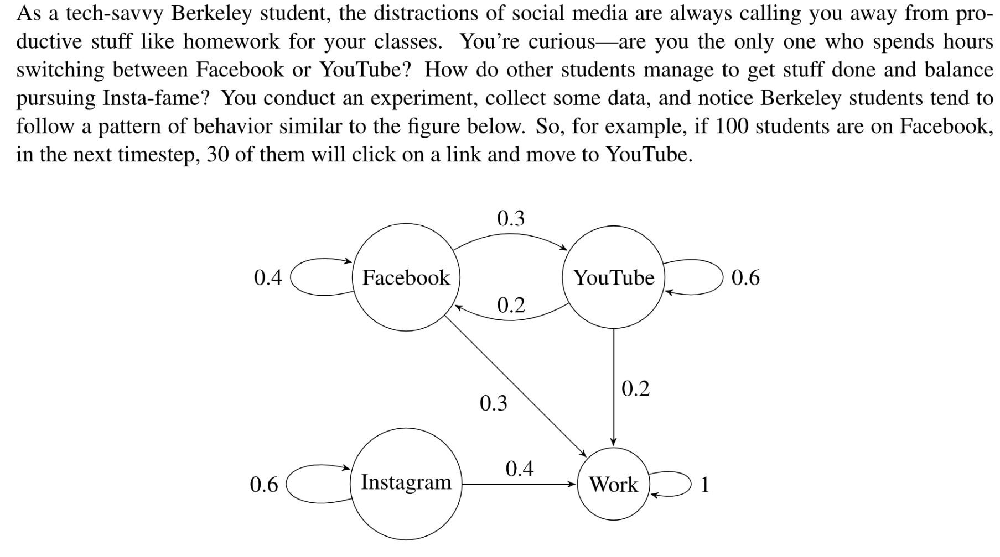
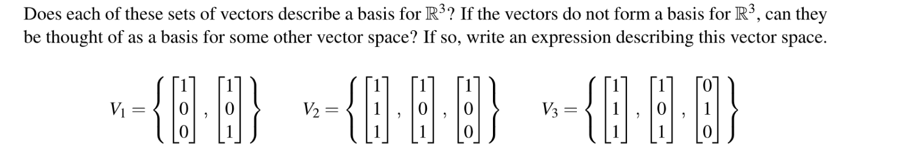
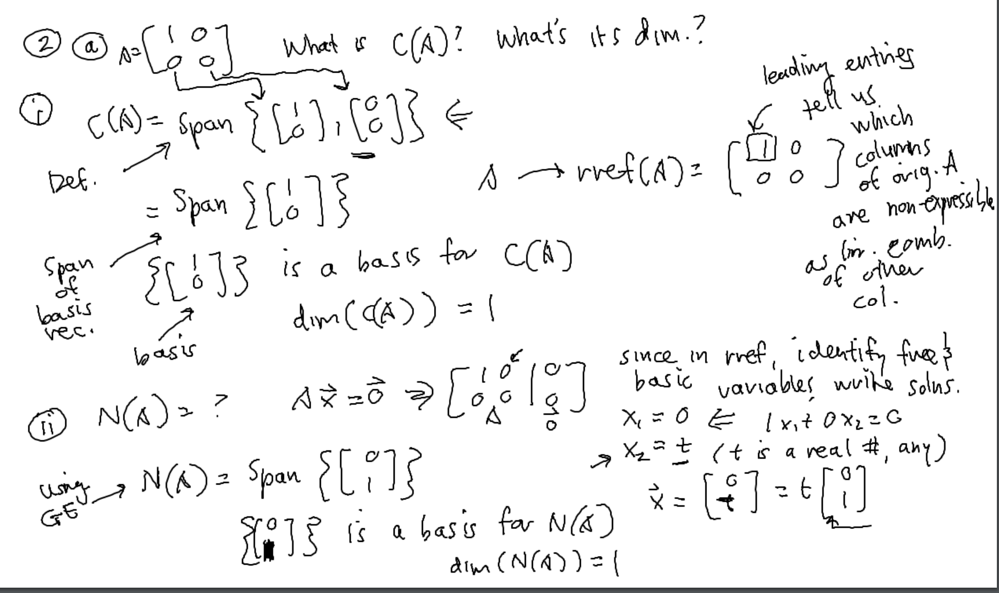
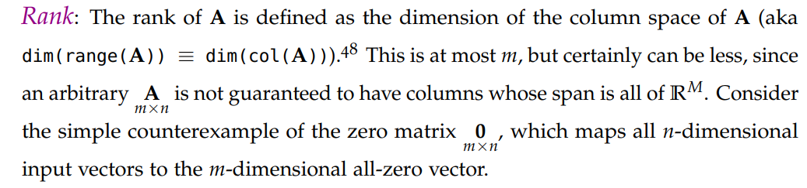

> **All Resources:** disc 1A**, **disc 1B, disc1C, disc1D, disc 2A, PS2&PS3

# Matrix Operations - Visualization
> 

```python
%matplotlib inline
import numpy as np
import matplotlib.pyplot as plt

"""Function that takes the vertices of a polygon and applies a matrix "transformation" to each of them, effectively
"transforming" the polygon."""
def transform_the_polygon(polygon, T):

    transformed_polygon = []
    for point in polygon:
        transformed_point = np.dot(T, point)
        transformed_polygon.append(transformed_point)
    return transformed_polygon

"""Function that plots a polygon in the x-y plane, given its vertices as x-y coordinates. The plot is defined in terms
of line segments connecting all adjacent vertices of the polygon."""
def plot_the_polygon(polygon):
    fig = plt.figure(figsize=(5,5))
    ax = fig.add_subplot(111, xlim = [-4, 4], ylim = [-4, 4])
    for i in range(len(polygon) - 1):
        ax.plot([polygon[i][0], polygon[i+1][0]],
                [polygon[i][1], polygon[i+1][1]], linewidth=4)
    ax.plot([polygon[i+1][0], polygon[0][0]], [polygon[i+1][1], polygon[0][1]], linewidth=4)
    ax.grid(True)
    ax.axhline(y=0, color='k', linestyle = '--', linewidth = 2)
    ax.axvline(x=0, color='k', linestyle = '--', linewidth = 2)
#plt.show()

unit_square = [np.array([0,0]), np.array([1,0]), np.array([1,1]), np.array([0,1])]
plot_the_polygon(unit_square)
plt.show()
```
**Graphic Output**

## Part 1: Rotation&Reflection Matrix
### Problems
> 

**Solution**
> 

**Solution**

> 

**Solution**⭐⭐⭐⭐⭐
> 

**Solution**
> 

**Solution**⭐⭐⭐
> 

**Solution**


### Summary
> 1. `Rotation Matrix`$R_{\theta}$的一般表达式是$\begin{bmatrix} cos(\theta)&-sin(\theta)\\sin(\theta)&cos(\theta)\end{bmatrix}$, 不是对称矩阵，$\theta$表示逆时针旋转的角度(弧度制)
> 2. 二维`Rotation Matrix`的乘法具有`Commutivity`的性质，即$R_{\alpha}R_{\beta} =R_{\beta}R_{\alpha}$。(三维的不具有交换律，后面的作业中会看到)。
> 3. 若要撤销`Rotation`$R_{\theta}$的操作，我们只需要对应的逆矩阵$R_{-\theta}$即可。


## Part 2: Commutivity of Operations
### Problems
> 

```python
# As the name indicates, R_60 rotates the matrix by 60 degrees.
rotation_angle = np.pi/3 # 60 degrees in radians
R_60 = np.array([[np.cos(rotation_angle), -np.sin(rotation_angle)],
                 [np.sin(rotation_angle), np.cos(rotation_angle)]])

reflected_after_rotated_square = transform_the_polygon(unit_square, R_60)
reflected_after_rotated_square = transform_the_polygon(reflected_after_rotated_square, Re_y)
plot_the_polygon(reflected_after_rotated_square)
```
**Solution**
> 

```python
rotated_after_reflected_square = transform_the_polygon(unit_square, Re_y)
rotated_after_reflected_square = transform_the_polygon(rotated_after_reflected_square, R_60)
plot_the_polygon(rotated_after_reflected_square)
```
**Solution**
> 

```python
rotated_after_reflected_square1 = transform_the_polygon(unit_square, np.dot(Re_y,R_60))
rotated_after_reflected_square2 = transform_the_polygon(unit_square, np.dot(R_60, Re_y))
plot_the_polygon(rotated_after_reflected_square1)
plot_the_polygon(rotated_after_reflected_square2)
```
**Solution**
> 

```python
Re_x = np.array([[1, 0], [0,-1]])
Re_y = np.array([[-1, 0], [0,1]])
Re_y_x = np.array([[0, 1], [1,0]])
rotated_after_reflected_square1 = transform_the_polygon(unit_square, np.dot(Re_y,Re_y_x))
rotated_after_reflected_square2 = transform_the_polygon(unit_square, np.dot(Re_y_x, Re_y))
plot_the_polygon(rotated_after_reflected_square1)
plot_the_polygon(rotated_after_reflected_square2)
```
**Solution**

### Summary
> 1. `Reflection Matrix`$Re_{\theta}$的参数化形式是$\begin{bmatrix} cos(\theta)&sin(\theta)\\sin(\theta)&-cos(\theta)\end{bmatrix}$, 是对称矩阵。其中$\theta/2$是转轴和$x$轴所成的夹角。
> 2. `Reflection Matrix`的乘法一般不具有`Commutivity`性质。除非转轴互相垂直。(比如$x$轴和$y$轴)
> 3. 根据第二条性质我们不难发现对于任意`Reflection Matrix`$Re$, $Re^2=I$, 也就是说$R_e$的逆矩阵就是他本身，这也合理，因为对着同一个转轴反转两次，等于没有翻转。


## Part 3: Distributivity of Operations
> 

**Solution**


# Inverses
## Compute Inverses
> 

**Solution**


## Proof Inverses⭐⭐⭐⭐
> 

**Solution (a)**
> 

**Proof by Contrapositive****It is True. **
**我们只要证明: 如果**$A$**是可逆的，那么对于所有的**$n$**, **$A^n\neq 0$**。**
**显然通过行列式的性质可以证明。**
**Proof by Contradiction**⭐⭐⭐⭐⭐


## Identify Inverses
> 

**Solution (b)**
> 

**Solution**


# Transition Matrix
## Conservative Transition
> 

**Solution**
```python
import numpy as np
import matplotlib.pyplot as plt

T = np.array([[0.4, 0.2, 0.0, 0.0],
              [0.3, 0.6, 0.0, 0.0],
              [0.0, 0.0, 0.6, 0.0],
              [0.3, 0.2, 0.4, 1.0]])
```
> 

**Solution**
```python
vi = np.array([700,450,200,150])
vo = np.dot(T,vi)

print(vo)
```
> 

**Solution**
> 

```python
T100 = np.linalg.matrix_power(T,100)

print(T100)

[[6.83599885e-13 8.30745059e-13 0.00000000e+00 0.00000000e+00]
 [1.24611759e-12 1.51434494e-12 0.00000000e+00 0.00000000e+00]
 [0.00000000e+00 0.00000000e+00 6.53318624e-23 0.00000000e+00]
 [1.00000000e+00 1.00000000e+00 1.00000000e+00 1.00000000e+00]]
```
```python
# Compute the state step-by-step

steps = np.arange(0,101,1)
vprogress = np.zeros((len(steps),len(vi)))

for i in range(len(steps)):
    vprogress[i,:] = np.dot(np.linalg.matrix_power(T,i),vi)
    
# Plot the progress

fig = plt.figure(figsize=(10,5))
ax = fig.add_subplot(111, xlim = [steps[0], steps[-1]], ylim = [0, 150])

for i in range(len(vi)):
    ax.plot(steps,vprogress[:,i], linewidth=2)
    
for axis in ['top','bottom','left','right']:
  ax.spines[axis].set_linewidth(2)

ax.set_xlabel('Steps', fontsize=20)
ax.set_ylabel('Number of Students', fontsize=20)    
ax.tick_params(labelsize=20,width=2,direction='in')   
ax.legend(['Facebook','YouTube','Instagram','Work'],frameon=False, fontsize=20)
```
**Graph**

**Solution**
> 

**Solution**
```python
A_leak = np.array([[0.4, 0.2, 0.0],
                  [0.3, 0.6, 0.0],
                  [0.0, 0.0, 0.6]])
vi_leak = np.array([85,45,20])
vprogress_leak = np.zeros((len(steps),len(vi_leak)))

for i in range(len(steps)):
    vprogress_leak[i,:] = np.dot(np.linalg.matrix_power(A_leak,i),vi_leak)
    
# Plot the progress

fig = plt.figure(figsize=(10,5))
ax = fig.add_subplot(111, xlim = [steps[0], steps[-1]], ylim = [0, 100])

for i in range(len(vi_leak)):
    ax.plot(steps,vprogress_leak[:,i], linewidth=2)
    
for axis in ['top','bottom','left','right']:
  ax.spines[axis].set_linewidth(2)

ax.set_xlabel('Steps', fontsize=20)
ax.set_ylabel('Number of Students', fontsize=20)    
ax.tick_params(labelsize=20,width=2,direction='in')   
ax.legend(['Facebook','YouTube','Instagram'],frameon=False, fontsize=20)
```
**Leaking Process Graph**


## Reverse&Transpose Transition
> 

**Solution (a)**
> 

**Solution (b)**
> 

**Solution (c)**
> 

**Solution (d)**

## Transition adding matters⭐⭐⭐
> 

**Explanations**


## Does Reverse Transition exist?
> 

**Solution**

# Span
## Span Basics
> 

**(a)**In the set notation, we have $S=\{\alpha \begin{bmatrix} 1\\2\\0\end{bmatrix} + \beta\begin{bmatrix} 2\\1\\0\end{bmatrix}|\alpha,\beta\in \mathbb{R}\}$。

**(b)**
Graphically, $\begin{bmatrix} 1\\2\\0\end{bmatrix},\begin{bmatrix} 2\\1\\0\end{bmatrix}$are symmetric to $\begin{bmatrix} 5\\5\\0\end{bmatrix}$in 2-d plane projection, so there definitely exist some linear combination that works.
**(c)**
**(d)**


## Visualizing Spans
> 

**(a)**
**(b)**


## Span Proofs
> 

**(a) Set Equivalence**
**(b)**
# 


# Basis&Vector Spaces
## Basis
> 

**Solution**
> 

**Solution**


## Subspace⭐⭐⭐⭐⭐
> 

**Solution(证明三个性质)**


## Column&Null Spaces
> 

**Solution (a)**
**Solution (b)**
**Solution (c)**
**Solution (d)**
**Solution (e) Computing Null Space**⭐⭐⭐⭐⭐


# Determinants
> 

**Solutions**


# Summary⭐⭐⭐⭐
## Special Matrices
### Rotation Matrix
> 1. `Rotation Matrix`$R_{\theta}$的一般表达式是$\begin{bmatrix} cos(\theta)&-sin(\theta)\\sin(\theta)&cos(\theta)\end{bmatrix}$, 不是对称矩阵，$\theta$表示逆时针旋转的角度(弧度制)
> 2. 二维`Rotation Matrix`的乘法具有`Commutivity`的性质，即$R_{\alpha}R_{\beta} =R_{\beta}R_{\alpha}$。(三维/高维的不具有交换律，后面的作业中会看到)。
> 3. 若要撤销`Rotation`$R_{\theta}$的操作，我们只需要对应的逆矩阵$R_{-\theta}$即可。


### Reflection Matrix
> 1. `Reflection Matrix`$Re_{\theta}$的参数化形式是$\begin{bmatrix} cos(\theta)&sin(\theta)\\sin(\theta)&-cos(\theta)\end{bmatrix}$, 是对称矩阵。其中$\theta/2$是转轴和$x$轴所成的夹角。
> 2. `Reflection Matrix`的乘法一般不具有`Commutivity`性质。除非转轴互相垂直。(比如$x$轴和$y$轴)
> 3. 根据第二条性质我们不难发现对于任意`Reflection Matrix`$Re$, $Re^2=I$, 也就是说$R_e$的逆矩阵就是他本身，这也合理，因为对着同一个转轴反转两次，等于没有翻转。


### Transition Matrix
> **关于Transition Matrix:**
> 1. **Conservative Transition: **对于一个`State Transition Matrix`来说，如果其列的和不为$1$，则这个`Transition`不是`Conservative`的，反之，则是的。
> 2. **Transpose Transition: **如果我们将一个`State Transition Matrix`的箭头全部反向，得到的状态转移矩阵是原矩阵的转置，此时这个新的状态转移矩阵一般而言不是`Conservative`的。
> 3. **Inverse Transition: **对一个状态转移矩阵求逆，得到反向状态转移矩阵（一般没有实际的物理意义，因为矩阵中的项可能大于`1`, 但硬要说有那就是`generating process`）。**如果原矩阵具有**`**Conservative**`**性质，则**`**Inverse Transition**`**仍然是**`**Conservative**`**的**，可以想象成状态转移中的能量守恒。
> 4. **Inverse Transition 不总是存在**，如果$A$表示正向的`Transition`，那么反向`Transition`存在与否取决于$A$是否可逆。


## Span
> `Span`从定义出发就是一些向量的线性组合。


## Basis&Subspaces
> 
> **关于**`**Vector Spaces**`**和**`**Basis**`**的问题，我们总结一下常见的套路:**
> 1. **证明子空间:** 证明`Addivity`, `Scalar Multiplicity`和`contains zero`即可，如果这三个性质满足，则这个向量空间满足所有`vector space`的运算规则。
> 2. **求**`**Column Space**`**的**`**Basis**`**: **将矩阵$A$通过高斯消元化简成`RREF`$R$的形式，然后看主元列(含有`Pivot`的列，表示本列代表`Basic Variable`)出现的位置(假设是$1$和$3$列)，则我们只需将对应的$A$的列($A$的第一和第三列)作为`Column Space`的基即可，用`span`表示。
> 3. **求**`**Null Space**`**的**`**Basis**`**: **将矩阵$A$通过高斯消元化简成`RREF`$R$的形式，然后将主元写成自由元（`free variables`）的形式，然后找出`Basis`，用`span`表示。
> 4. `**Col(A)=?Col(RREF(A))**`**: **一般而言原矩阵$A$和其`RREF`的列空间不一致,因为只要原矩阵到`RREF`的过程中发生了行操作，那么列空间就会被改变（The entries in the columns have been changed）.
> 5. **虽然高斯消元会改变列空间，但是其并不会改变列之间的线性组合关系。**因为可以想象我们进行行操作的时候所有列都会被放大相同的倍数。
> 6. **判断一组向量是否可以构成某个**`**subspace**`**的**`**Bases**`**: **只要判断两点，
>    1. 首先是是否能线性组合成子空间。
>    2. 然后看看这些向量是否线性无关。任何一个条件不满足那就不是`basis`。


## Rank Basics
> 
> **对于任意**$A_{m\times n}$**矩阵来说:**
> 1. $Rank(A)=dim(Col(A))=dim(Row(A))=r=min\{m,n\}$
> 2. `Rank-Nullity-Theorem`$dim(Null(A))=n-dim(Col(A))=n-Rank(A)$


## Matrix Inverse
> 
> 如果一个矩阵$A$, $\exists N\in \mathbb{N},~~s.t.~~A^N=0$, 则$A$不可逆，可以使用反证法(假设$A^{-1}$存在)加上数学归纳法证明。
> 因为$A^{N-1}=A^N\cdot A^{-1}=0$， 所以我们证明了$A^N=0\implies A^{N-1}=0$。


## Linear Equations
> 


