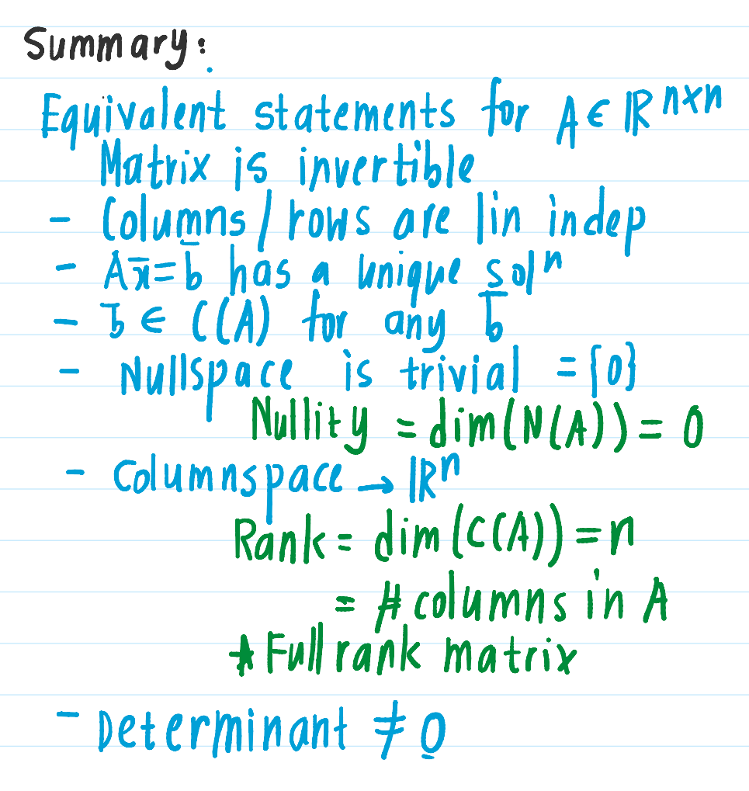
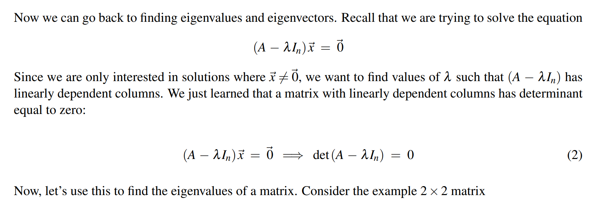

[Note9.pdf](https://www.yuque.com/attachments/yuque/0/2023/pdf/12393765/1676126129359-e5b16ef2-b34f-4e28-9c20-0c2fbc1ae43b.pdf)
[Written_Notes9.pdf](https://www.yuque.com/attachments/yuque/0/2023/pdf/12393765/1676951084099-ef03be64-db50-40e5-b3aa-1fcb60a18b9a.pdf)
# Recap on Vector Spaces
## Col&Null Space
> 

## Free&Basic Variables
> 

## Rank-Nullity Theorem
> 

## Summary
> 

# PageRank Algorithm
## Algorithm
> 

## Iteration till convergence
> 

# Eigenvalues
> 

## Definition
> 

**Solve for eigenvalues**

## Compute with Determinants
> 

**Example**

## More Practice
> 

# Repeated&Complex Eigenvalues
## Repeated Eigenvalues&Eigenspace
> 

## Complex Eigenvalues
> 

# Characteristic Polynomial
> 

## Case1 Distinct Eigenvalues
### Independent eigenvectors
> 

**Proof**

## Case 2: A repeated real eigenvalue
> 

# Steady State⭐⭐⭐
> 

## Starting at eigenvectors
> 

## General Initial States
> 

## Computing Linear Combinations
> 

## Criteria for convergence
> 

# Examples
## Reverse Engineering⭐⭐⭐⭐⭐
> 

**Solution**

## Page Rank
> 

**Solution**

