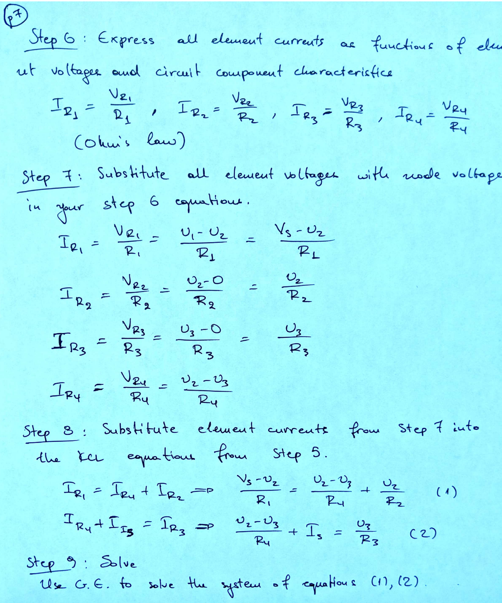

# Electrical Circuit Analysis Introduction
> 

# Basic Circuit Quantities
> **Current** is the flow of charges (e.g. electrons) in the circuit
> **Voltage **is the potential energy (per charge) between two points in the circuit. This potential energy is what causes charge to flow (ie. causes current). 
> **Resistance** is the material's tendency to resist the flow of current.  
> 
> We use these quantities in a Circuit Diagram, a visual representation of how a collection of circuit elements are connected. Each circuit element has some voltage across it and some current through it. 
> Why is voltage “across” a circuit element? 
> Voltage, or electric potential, is only defined relative to another point. A simple analogy is elevation: A mountain’s summit could be 9,000 ft above sea level, but 21,000 ft above the bottom of the ocean. In both cases, the elevation is only meaningful relative to another point. 
> For convenience, we frequently define sea level as a reference point with “0 ft of elevation” – then we can state elevation as a single number which is implicitly referenced to sea level (ex. the mountain is 9,000 ft tall). 
> **Similarly, in circuits, we will frequently define a reference point, called ground, against which other voltages can be measured.  

# Basic Circuit Elements
## Wire
> 

## Resistor
> 

## Open Circuit
> 

## Voltage Source
> 

## Current Source
> 

# Rules for Circuit Analysis
## Kirchhoff's Current Law(KCL)
> 

**Example**
**KCL Within Elements**

## Kirchhoff's Voltage Law(KVL)
> 

**Example**

## Ohm's Law and Resistors
> 

## Voltage Reference - Potentials
> 

# Circuit Analysis Algorithm
## Guide to Finding Nodes
### Algorithm
> 

### Redraw the Circuit
> 

**Original**
**Alternative 1**
**Alternative 2**

## Circuit Diagram
> 
> **Node: **Any point on the circuit where two or more elements intersects.
> **Branch:** Any circuit element apart from wires and open circuits.

## Node Voltage Analysis(NVA) Algorithm
> 

# Resources
[Note11](typed_notes_pdf/Note11.pdf)
[Written_Notes11](typed_notes_pdf/Written_Notes11.pdf)
