# Capacitive Touchscreen
## Physical Structure
> 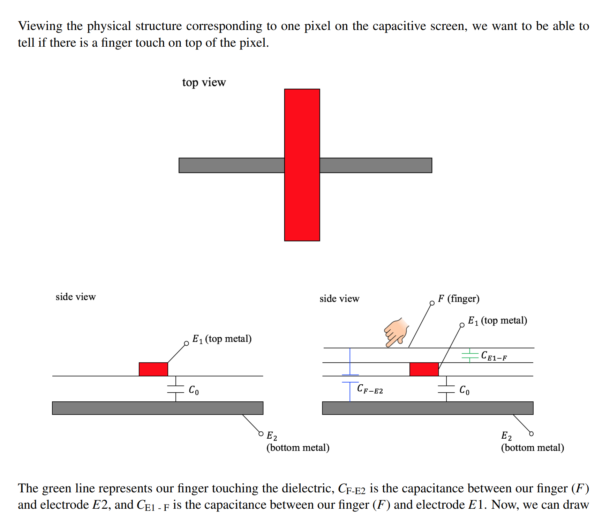
> **从图中我们可以看到:**
> - 电容屏幕是由一个个像素点构成的， 每个像素点都是如图所示的结构，上端是一根垂直放置的电极`E1`，下端是一根水平方向放置的电极`E2`。两个电极均是导电材质`Conductor`，如下图所示。
> 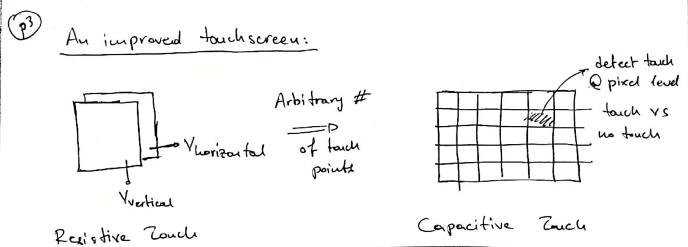
> - 触点与上端电极`E1`之间是绝缘材料，上端电极`E1`与下端电极`E2`之间也是绝缘材料。
> - 屏幕的上端距离`上端电极`仍有距离，在图中用电容$C_{E1-F}$表示。电极与下端之间的电容用$C_0$表示。
> - 触点与下板的非电极区域也是绝缘材料，用$C_{F-E2}$表示。

## How to detect touchpoint
> 本质上对于每一个像素点，我们只需要测量这个像素点是不是触点即可(`0-没有触摸，1-触摸`，是一个`binary`的状态)，也就是判断`E1,E2`两个`Terminals`之间的等效电容是否发生变化了改变。
> - 当我们的手指没有接触屏幕的时候，电路状态如左图，上下电极之间的电容就是$C_0$。当手指触摸到某个像素点的时候，电路状态如右图所示，`E1,E2`之间的等效电阻会发生改变。
> - 下图中我们看到，`E1,E2`间的等效电阻会增大，于是我们可以判断这个像素点被触摸了。
> 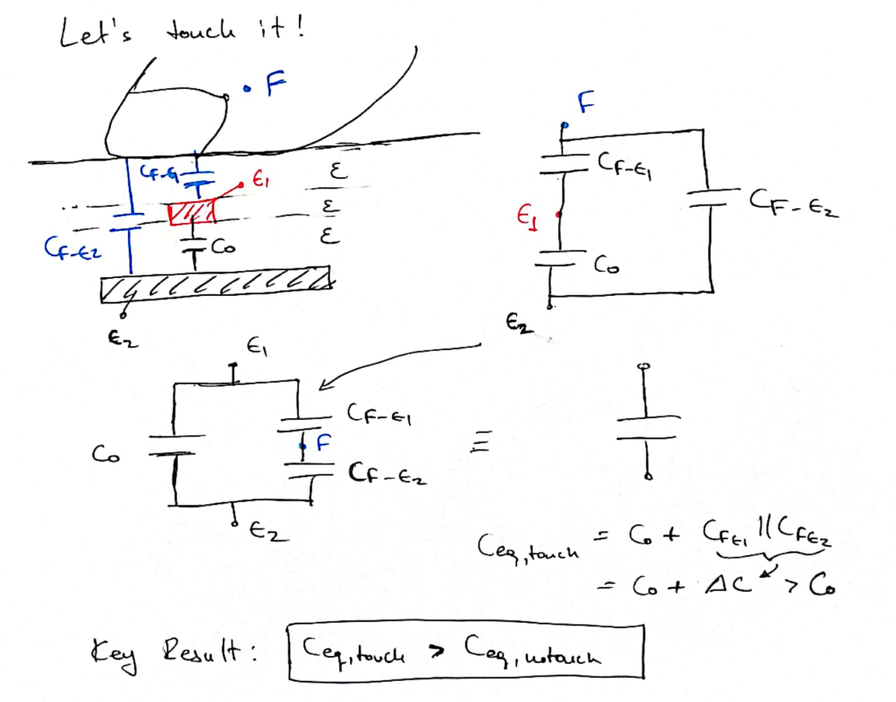

# Measure Capacitor
> 惯例上，我们会选取下面的电路结构来对电容进行测量:
> 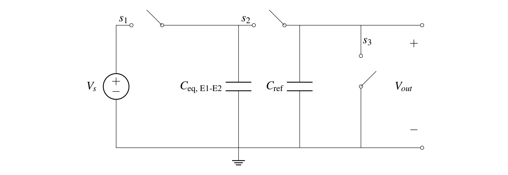
> 🔔: 电路有两种状态：
> 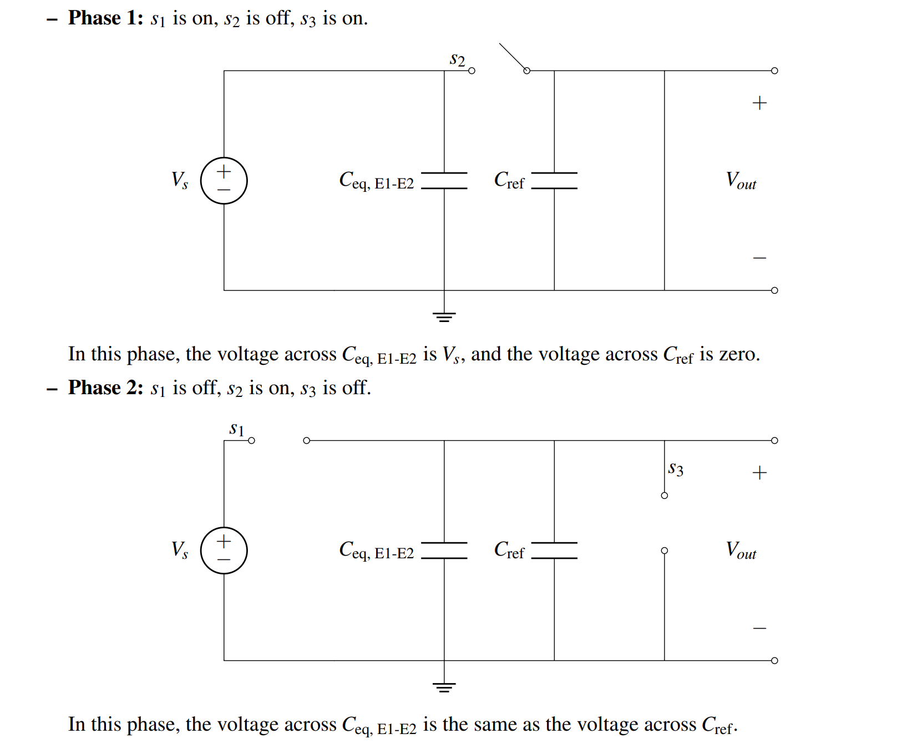
> `Phase 1`的`s3 is on`是为了让电容$C_{ref}$的电荷载量为$0$, 因为电容两端被短路，根据$Q=C\cdot V$, 电压为零, 没有动力将电子从下板运输到上板，所以$V=0$, 且电容为零。`Phase 1`的`s1 is on`是为了让电容$C_{eq,E1-E2}$充上电。
> 本质上，`Phase1`的作用就是让两个电容器都充上固定数量的电荷。因为我们有一个重要的性质，就是在没有外部电压的时候，电容器的电荷量是保持不变的。这样我们就可以利用`Phase 1`和`Phase 2`的总电容量不发生改变，得到下列的关系:
> 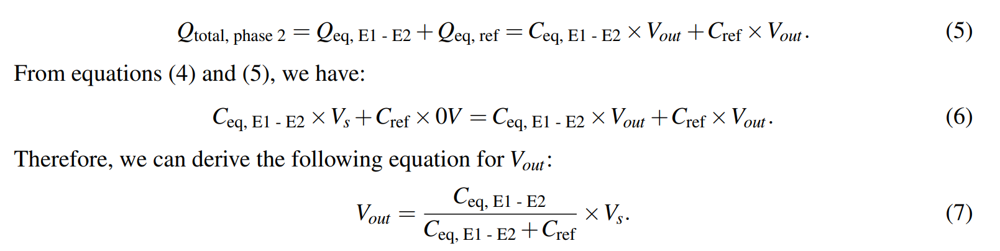

# Charge-Sharing Algorithms
## Basics
> 上图中我们所使用的这种特殊的电路分析方法被称为`Charge Sharing`。
> `Charge Sharing`是指电容器之间的电荷共享。在一个电路的不同稳定阶段之间，有一条重要的基本规则是真实的：所有电容器储存的总电荷必须始终相同。下图中我们可以看到，在`Phase 2`的时候，$C_{eq}$和$C_{ref}$的电荷量平均分配了，都变成了$5C$。
>  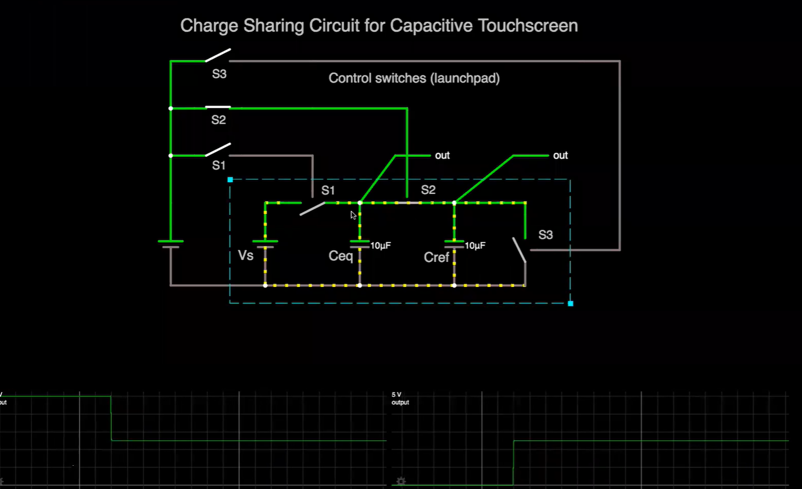

## Algorithm Details
> [Note17B](Typed_Notes/Note17B.pdf)
> [ChargeSharingWalkThroughNotes](Typed_Notes/ChargeSharingWalkThroughNotes.pdf)

# Op-amp Basics
## Structure
> 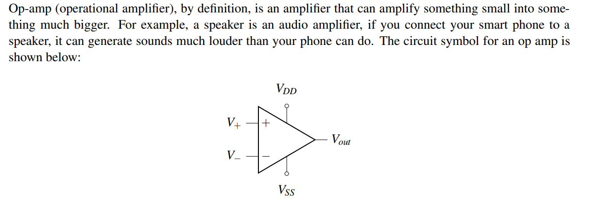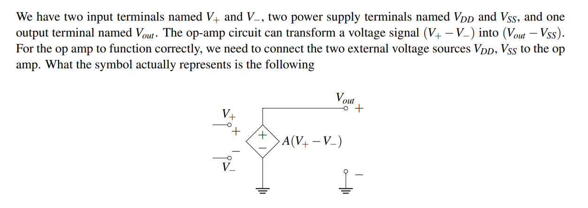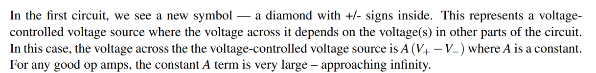

## Output Characteristic
> 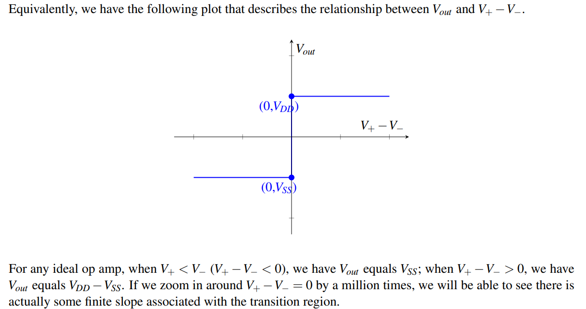

## Measure Touchpoint
> 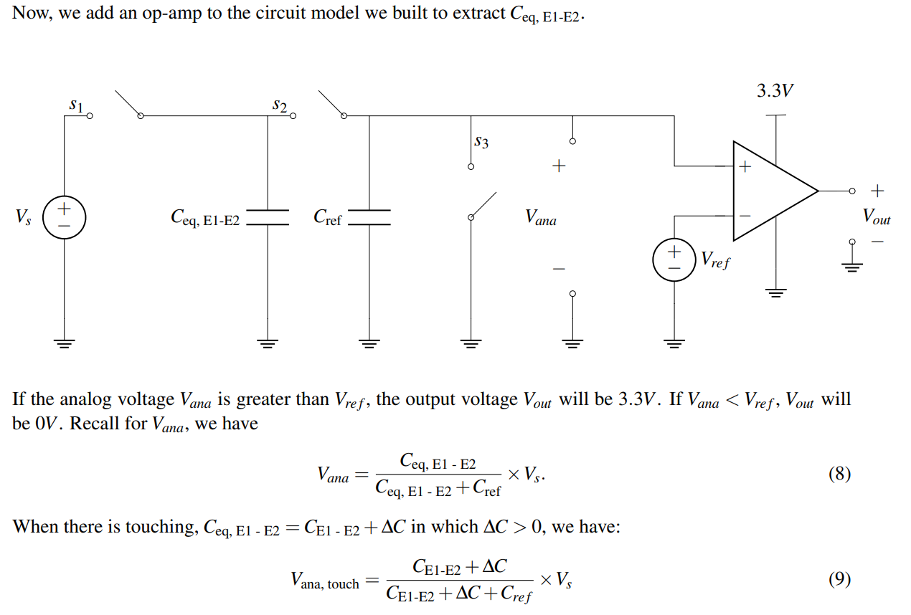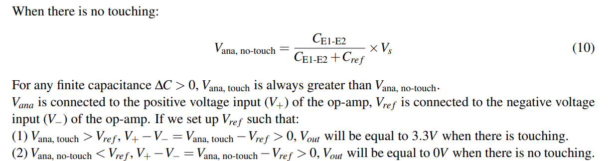
> 🔔：本质上，$V_{ref}$的作用相当于一个`flag`, 或者一个比较的对象，参照点。
> 🔔: 因为$V_{ana,touch}$总是大于$V_{ana,no-touch}$, 所以我们要求当用户触碰到了电容屏的像素时，$V_{ana,touch}>V_{ref}$。反之则$V_{ana,no-touch}<V_{ref}$。所以$V_{ref}$ 的设置就尤其重要。

### How to choose Vref
> 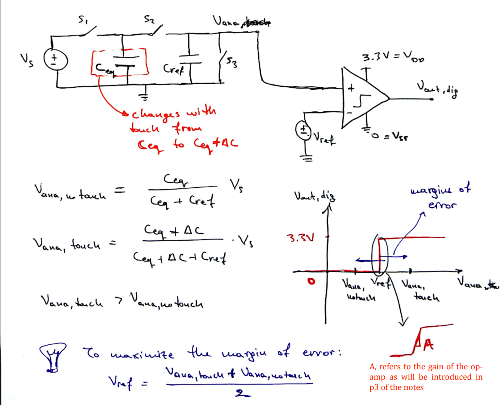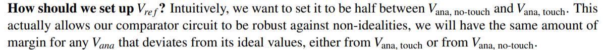
> 🔔: 一般而言，$V_{ana,touch}$和$V_{ana,no~touch}$之间的差值很小，所以我们的$V_{ref}$的取值很有限, 一般会选在$V_{ana,touch}$和$V_{ana,no-touch}$的中点，这样可以最大限度的避免误差的出现。

### How to choose Cref
> 🔔: 有没有办法使得我们的$V_{ref}$取值更加灵活呢? 我们可以通过调整$C_{ref}$的大小来实现。当$C_{ref}$和$C_{eq}$, $\Delta C$的大小相近的时候, $V_{ana, touch}$和$V_{ana,no-touch}$之间的差值就会比较大，这样我们$V_{ref}$调整的余地就会更大一些。
> 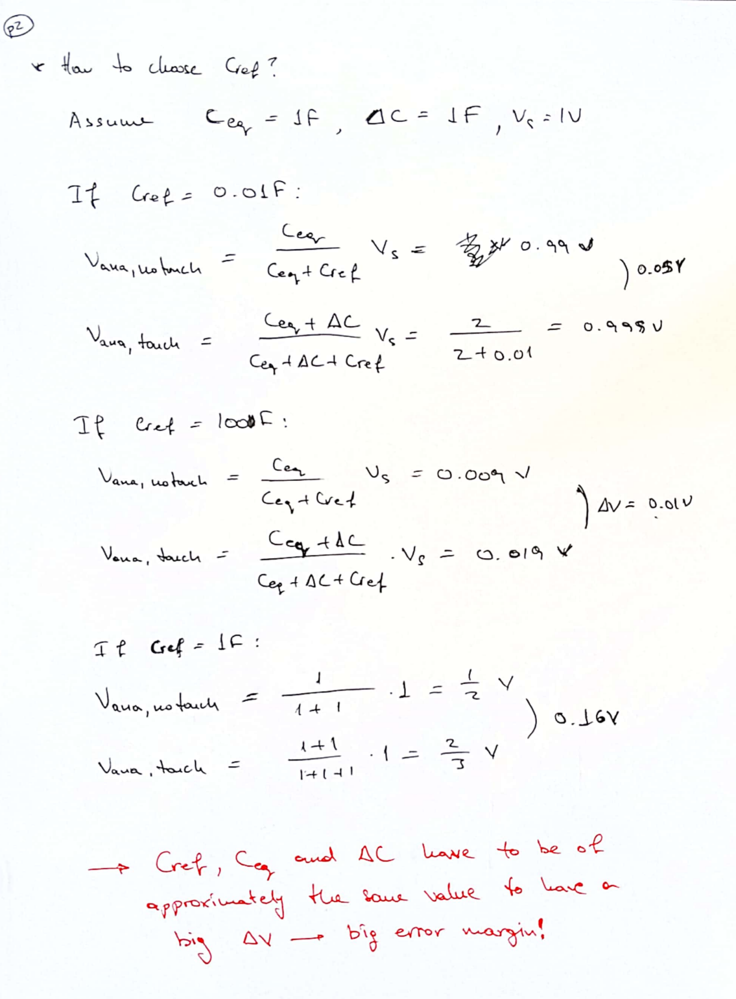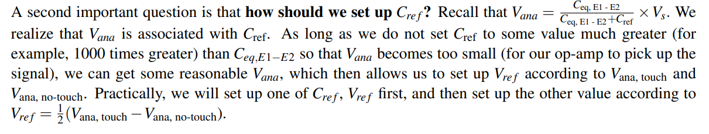

# Resources
> [Note17](Typed_Notes/Note17.pdf)
> [Note17B](Typed_Notes/Note17B.pdf)
> [Written_Notes17](Typed_Notes/Written_Notes17.pdf)
> [ChargeSharingWalkThroughNotes](Typed_Notes/ChargeSharingWalkThroughNotes.pdf)
> https://www.bilibili.com/video/BV1wi4y1u7gx?p=19&vd_source=66aa12d38833505f6c2216f089511404 Lecture 19

