[aps1.pdf](https://www.yuque.com/attachments/yuque/0/2023/pdf/12393765/1686229477117-164a98a4-afb8-4ac4-9afd-ac183cff7dc9.pdf)
[aps2.pdf](https://www.yuque.com/attachments/yuque/0/2023/pdf/12393765/1686229475884-4026de88-5e18-4d6c-a0f6-5d1d333bebd0.pdf)
[eecs16a_aps1.zip](https://www.yuque.com/attachments/yuque/0/2023/zip/12393765/1686229489061-8cd0c213-9792-488f-b664-4e0aa60a683e.zip)
[eecs16a_aps2.zip](https://www.yuque.com/attachments/yuque/0/2023/zip/12393765/1686229489066-8e66eb60-300d-4300-9c8e-234ec93ef25a.zip)

# GPS System Overview
> 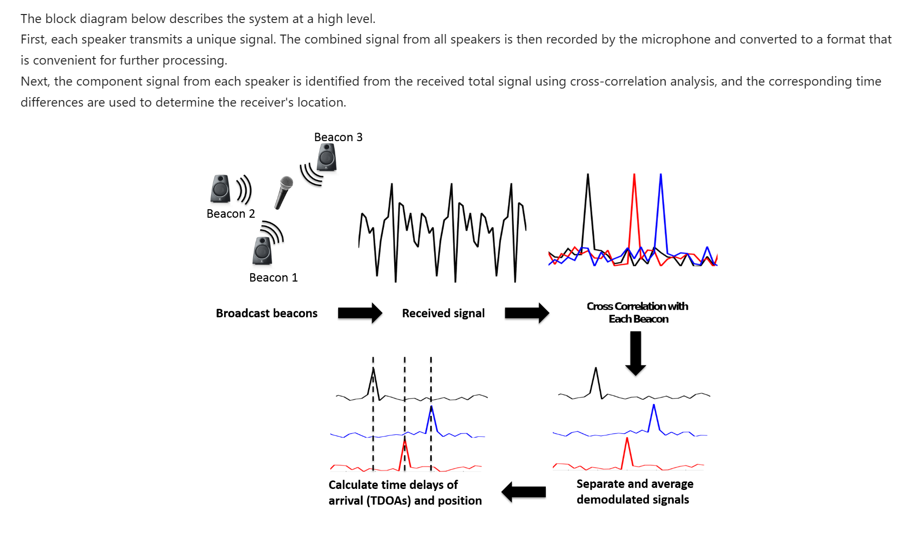


# Basic Concepts
## Signal Similarity
> 计算两个`Signal Vector`的内积即可。
> 假设有两个信号$\vec{s_1}$和$\vec{s_2}$, 则这两个信号之间的`Signal Similarity`是$\sum_{n=-\infty}^{\infty}\vec{s_1}[n]\vec{s_2}[n]$, 如果长度不一致就用零填补。


## Linear Correlation
> 我们可以通过计算两个信号之间的`Linear Correlation`来判断接受端的信号$\vec{r}$中是否含有$\vec{s}$信号，且$\vec{s}$相对于$\vec{r}$延迟了多少时间。(假设接收端和发送端同时开启，但是现实生活中不存在这种情况)。
> $corr_{\vec{r}}(\vec{s})[k]=\sum_{n=-\infty}^{\infty}r[n]s[n-k]$
> 其中，我们要求的就是$\argmax_k corr_{\vec{r}}(\vec{s})[k]$的值，对应的就是`Delayed Number of Samples`。
> `Numpy Command: numpy.correlate(signal1, signal2, "full")`


## Infinitely Periodic Linear Correlation
> 我们假设$\vec{s}$和$\vec{r}$都是周期性的信号，则`Infinitely Periodic Linear Correlation`被定义为在一个周期上的`Linear Correlation`:
> $corr_{\vec{r}}(\vec{s})[k]=\sum_{n=0}^{N-1}r[n]s[n-k]$
> `Numpy Command: numpy.correlate(signal1, numpy.roll(signal2,k))[0] for k in range(len(signal2))`, 这里假设`len(signal1)=len(signal2)`
> 其中`numpy.roll(signal, k)`表示将当前信号`delay k samples`, `numpy.roll([1,2,3], k=1)`结果就是`[3,1,2]`。


# APS Algorithm - Simple 
## Step 1: Extracting Information
> 提取信息本质上是在从接收到的信号$\vec{r}$中提取出发送端的信号$\vec{s_i}$，方法就是计算$\vec{r}$和$\vec{s_i}$的`Infinitely Periodic Linear Correlation`, 然后得到不同发送信号$\vec{s_i}$到达接收端的时间差。
> 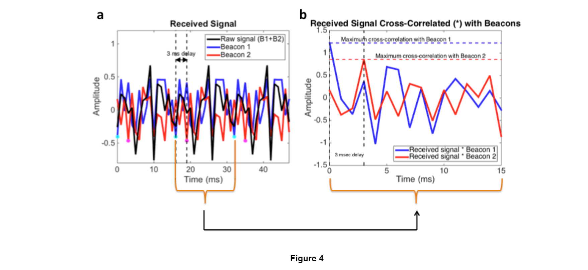

```python
def cross_correlation(stationary_signal, sliding_signal):
    """Compute the cross_correlation of two given signals    
    Args:
    stationary_signal (np.array): input signal 1
    sliding_signal (np.array): input signal 2
    
    Returns:
    cross_correlation (np.array): infinitely periodic cross-correlation of stationary_signal and sliding_signal
    

    >>> cross_correlation([0, 1, 2, 3], [0, 2, 3, 0])
    [8, 13, 6, 3]
    """
    inf_stationary_signal = np.concatenate((stationary_signal ,stationary_signal))
    entire_corr_vec = np.correlate(inf_stationary_signal, sliding_signal, 'full')
    return entire_corr_vec[len(sliding_signal)-1: len(sliding_signal)-1 + len(sliding_signal)]
```

## Step 2: Separating Signals
> 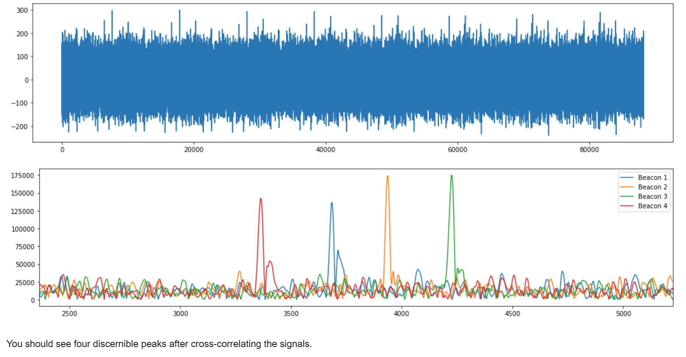

```python
def identify_peak(signal):
    """Returns the index of the peak of the given signal.
    Args:
    signal (np.array): input signal
    
    Returns:
    index (int): index of the peak
    
    >>> identify_peak([1, 2, 5, 7, 12, 4, 1, 0])
    4
    >>> identify_peak([1, 2, 2, 199, 23, 1])
    3
    """
    # YOUR CODE HERE
    return np.argmax(signal)
```
```python
def separate_signal(raw_signal):
    """Separate the beacons by computing the cross correlation of the raw signal 
    with the known beacon signals.

    Args:
    raw_signal (np.array): raw signal from the microphone composed of multiple beacon signals
    
    Returns (list): each entry should be the cross-correlation of the signal with one beacon
    """
    Lperiod = len(beacon[0])
    Ncycle = len(raw_signal) // Lperiod
    for ib, b in enumerate(beacon):
        c = cross_correlation(raw_signal[0:Lperiod],b)
        # Iterate through cycles
        for i in range(1,Ncycle):
            c = np.hstack([c, cross_correlation(raw_signal[i*Lperiod:(i+1)*Lperiod], b)])
        if (ib==0): cs = c
        else:       cs = np.vstack([cs, c])
    return cs
```

## Step 3: Noise Cancellation - Averaging
> 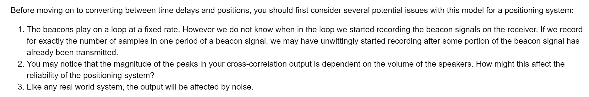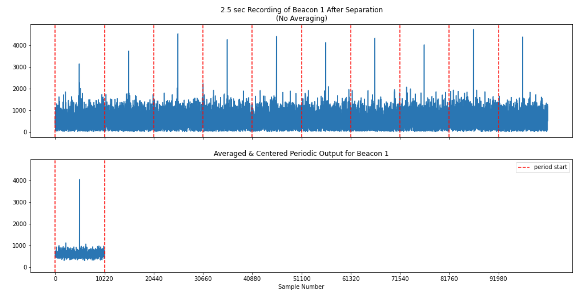

```python
def average_sigs(cross_correlations):
    Lperiod = len(beacon[0])
    Ncycle = len(cross_correlations[0]) // Lperiod
    avg_sigs = []
    for c in cross_correlations:
        reshaped = c.reshape((Ncycle,Lperiod))
        averaged = np.mean(np.abs(reshaped),0)
        avg_sigs.append(averaged)

    return avg_sigs
```


## Step 4: Calculating Offsets
> 计算$Beacon_i$到$Beacon_0$的接受时间差。

```python
def identify_offsets(averaged):
    """ Identify peaks in samples.
    The peaks of the signals are shifted to the center.
    
    Functions to Use: identify_peak
    
    Args:
    averaged (list): the output of the average_sigs() function (a list of single period cross correlated sigs)
    
    Returns (list): a list corresponding to the offset of each signal in the input
    """
    # Reshaping the input so that all of our peaks are centered about the peak of beacon0
    # len(averaged[0] // 2)表示：我们想让beacon0的correlation peak移到中间
    # - identify_peak(averaged[0])表示：因为beacon0的correlation peak在别的位置，所以我们需要移动beacon0
    # 信号让他到中间来。len(averaged[0]) // 2 - identify_peak(averaged[0])表示还差多少samples就能将
    # beacon0的correlationi peak移动到信号长度的中间位置。
    shifted = [np.roll(avg, len(averaged[0]) // 2 - identify_peak(averaged[0])) for avg in averaged]
    beacon0_offset = identify_peak(shifted[0])

    # shifted:
    #     All the signals shifted so beacon 0 is in the middle of the signal
    # beacon0_offset:
    #     The absolute index that beacon 0 starts on
    # YOUR TASK: Return a list that includes the relative indexes of where each beacon starts relative to
    #            when beacon 0 starts. This means that beacon 0's offset should be 0.
    
    # Use `shifted` and `beacon0_offset` to determine the offsets of other beacons
    # YOUR CODE HERE
    return np.array([identify_peak(shifted[i]) for i in range(len(shifted))])  - beacon0_offset
```
**Output**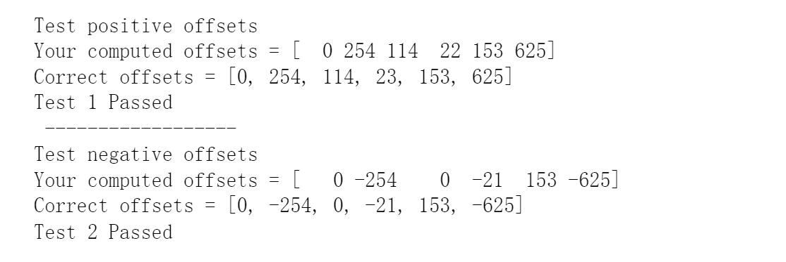
```python
def offsets_to_tdoas(offsets, sampling_freq):
    """ Convert a list of offsets to a list of TDOA's
   
    Args:
    offsets (list): list of offsets in samples
    sampling_freq (int): sampling frequency in Hz
    
    Returns (list): a list of TDOAs corresponding to the input offsets
    """
    # YOUR CODE HERE
    return np.array(offsets) / sampling_freq
```
**Output**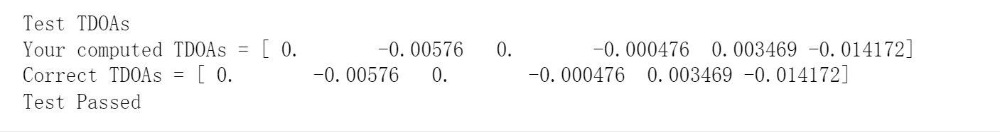

## Step 5: Calculating Distance
> 这里我们假设`Beacon0`到`Receiver`的信号传输时间$t_0$已知，同时根据前$4$步的计算可知，$Beacon_i$到$Beacon_0$的时间差为$\tau_i$, 所以我们可以得到$Beacon_i$到`Receiver`的信号传输时间为$t_0+\tau_i$。
> 知道了传输时间，配合已知的信号传输速度$v_{air}$, 就可以得到$Beacon_i$到`Receiver`的距离$d_i=(t_0+\tau_i)\times v_{air}$
> 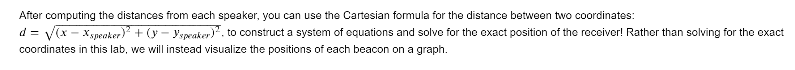

```python
def signal_to_offsets(raw_signal):
    """ Compute a list of offsets from the microphone to each speaker.
    
    Functions to use: separate_signal, average_sigs, identify_offsets
    
    Args:
    raw_signal (np.array): raw received signal from the microphone (e.g. no separation, averaging, etc).
    
    Returns (list): offset for each beacon (beacon0, beacon1, etc). in samples
    """
    # YOUR CODE HERE
    cs = separate_signal(raw_signal)
    avgs = average_sigs(cs)
    return identify_offsets(avgs) 
```
```python
v_air = 340.29
sampling_freq = 44100

def signal_to_distances(raw_signal, t0):
    """ Returns a list of distances from the microphone to each speaker.
    
    Functions to use: offsets_to_tdoas, signal_to_offsets
    
    Args:
    raw_signal (np.array): recorded signal from the microphone
    t0 (float): reference time for beacon0 in seconds
    
    Returns (list): distances to each of the speakers (beacon0, beacon1, etc). in meters
    
    You will have to use v_air and sampling_freq above
    """
    # YOUR CODE HERE
    return (signal_to_offsets(raw_signal) / sampling_freq + t0) * v_air
```

## Summary
> 这个方法的最重要的假设就是我们已知$t_0$, 也就是`Reference Beacon`到`Receiver`的信号传输时间。但是实际生活中这个$t_0$一般不可知，所以我们需要其他的方法。


# APS Procedure - Precise
> 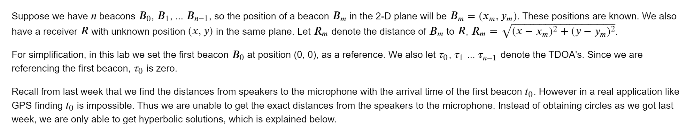


## Method 1: N-1 Hyperbolic Equations
> 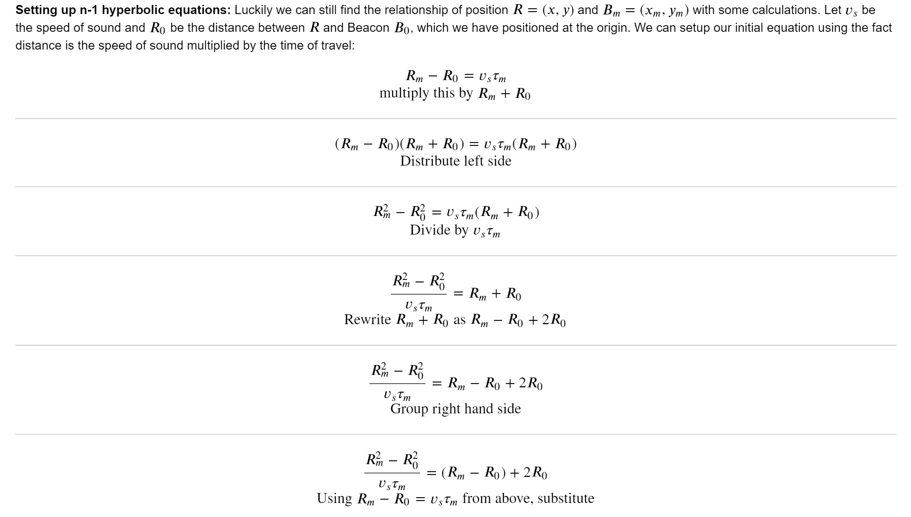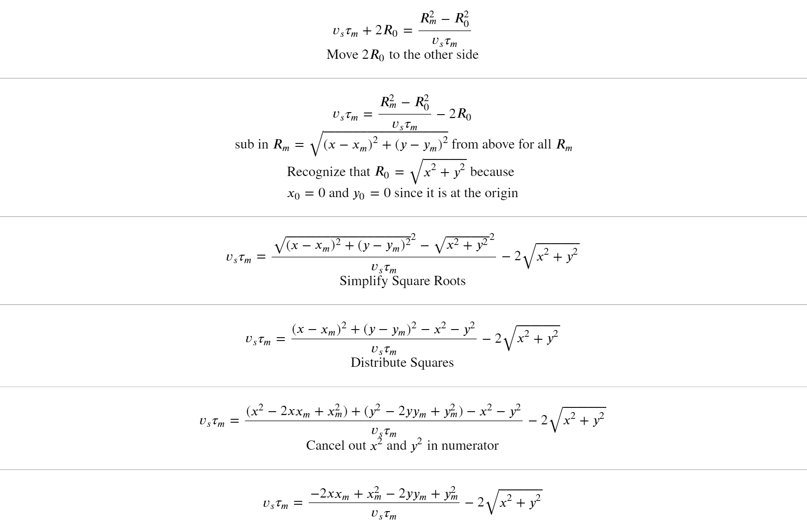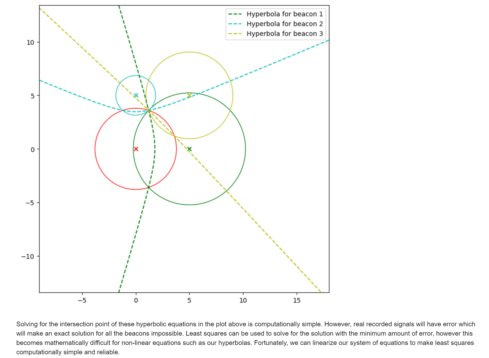


## Method 2: N-2 Linear Equations
> 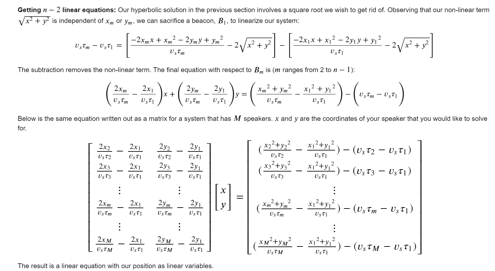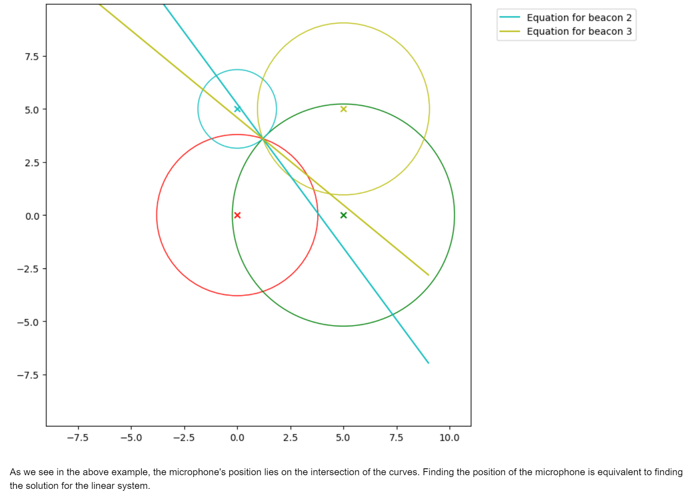

```python
def construct_system(speakers, TDOA, isac=1, plot=0):
    """Construct the components of the system according to a list of TDOA's
    Args:
    TDOA (np.array): an array of TDOA's
    isac : index of speaker to be sacrificed for linearization
    
    Returns:
    A (np.matrix): the matrix corresponding to the least squares system
    b (np.array): the vector corresponding to the least squares system
    
    YOUR TASK:
    1. Read over the doc strings to understand how the helper functions are to be implemented
    2. Using the matrix system above as a reference, complete helpers x, y, and b
    3. Take note of x_sac, y_sac, and t_sac below; think about how they can be used in the helper functions
    4. Using your helper functions, complete "BUILDING THE SYSTEM" to make A and b
    """
    x_sac, y_sac = speakers[isac]
    t_sac = TDOA[isac]
    v_s = 340.29
    
    def helperx(i):
        """Calculates the value for a row in the left column of the A matrix
        Arg:
        i : index of speaker to be used for the calculation
        
        Useful Variables: 
        speakers[i] : returns x_i, y_i (see x_sac and y_sac above for an example)
        TDOA[i] : returns t_i 
        
        Returns:
        A[i, 0]'s calculated out value
        """
        # YOUR CODE HERE
        x_i,_ = speakers[i]
        t_i = TDOA[i]
        
        return 2*x_i/(v_s*t_i) - 2*x_sac/(v_s*t_sac)
        
        
    
    def helpery(i):
        """Calculates the value for a row in the right column of the A matrix
        Arg:
        i : index of speaker to be used for the calculation
        
        Useful Variables: 
        speakers[i] : returns x_i, y_i (see x_sac and y_sac above for an example)
        TDOA[i] : returns t_i 
        
        Returns:
        A[i, 1]'s calculated out value
        """
        # YOUR CODE HERE
        _,y_i = speakers[i]
        t_i = TDOA[i]
        
        return 2*y_i/(v_s*t_i) - 2*y_sac/(v_s*t_sac)
        
        
    def helperb(i):
        """Calculates the ith value of the b vector
        Arg:
        i : index of speaker to be used for calculation
        
        Useful Variables: 
        speakers[i] : returns x_i, y_i (see x_sac and y_sac above for an example)
        TDOA[i] : returns t_i 
        
        Returns:
        b[i]'s calculated out value
        """
        # YOUR CODE HERE
        x_i,y_i = speakers[i]
        t_i = TDOA[i]
        return (x_i**2 + y_i**2)/(v_s*t_i) - (x_sac**2 + y_sac**2)/(v_s*t_sac) - (v_s*t_i - v_s*t_sac)
        
    
    # BUILDING THE SYSTEM
    A, b = [], []
    for i in range(1, len(TDOA)):
        if (i!=isac): #if i is not the index of the beacon to be sacrificed, add elements to A and b
            # YOUR CODE HERE
            A += [[helperx(i),helpery(i)]]
            b += [helperb(i)]
            
            
            
    # PLOTTING
    if plot==1: #plot the linear equations
        x = np.linspace(-9, 9, 1000)
        for i in range(len(b)):
            y = [(b[i] - A[i][0]*xi) / A[i][1] for xi in x]
            plt.plot(x, y, label="Equation" + str(i + 1))   
        plt.xlim(-9, 9)
        plt.ylim(-6, 6)
        plt.legend()
        plt.show()
        
    # NORMALIZATIONS
    AA, bb = [], []
    for i in range(len(A)):
        AA.append([A[i][0]/np.linalg.norm(A[i]), A[i][1]/np.linalg.norm(A[i])])
        bb.append(b[i]/np.linalg.norm(A[i]))  
        
    return np.array(AA), np.array(bb)
```
```python
def least_squares(A, b):
    """Solve the least squares problem
    
    Args:
    A (np.array): the matrix in the least squares problem
    b (np.array): the vector in the least squares problem
    
    Returns:
    pos (np.array): the result of the least squares problem (x)    
    """

    # YOUR CODE HERE
    return np.linalg.inv(A.T@A)@(A.T@b)
    
least_squares_test(least_squares)
```

## Summary
> 假设我们使用的是二位坐标，则至少需要三颗卫星才能定位，但是这样会要求我们使用最小二乘法来求解抛物线方程，为了线性化这些抛物线方程，我们需要至少四颗卫星。
> 如果是三维坐标，则至少需要四颗卫星，如果需要使用线性化，则至少需要五颗卫星。


