[Note23.pdf](https://www.yuque.com/attachments/yuque/0/2023/pdf/12393765/1685198843049-901360ff-0cd6-4192-a1d2-1bc38f1fc400.pdf)
[Written_Notes23.pdf](https://www.yuque.com/attachments/yuque/0/2023/pdf/12393765/1685323488858-e92aed1d-9517-447b-9d06-33d00f10546a.pdf)
[Written_Notes23_2.pdf](https://www.yuque.com/attachments/yuque/0/2023/pdf/12393765/1685323487800-784188a0-b8bc-4f7e-927b-f27fccce40a2.pdf)


# Orthonormal Matrices
> 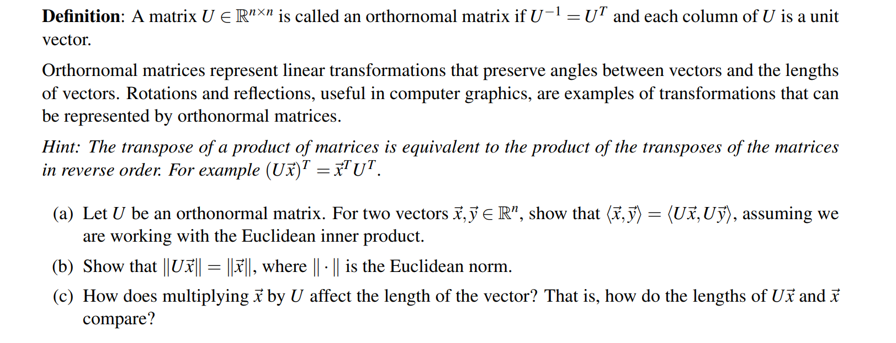

**Problem (a)**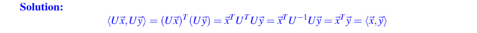
**Problem (b)**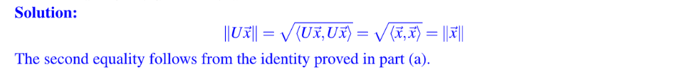
**Problem (c)**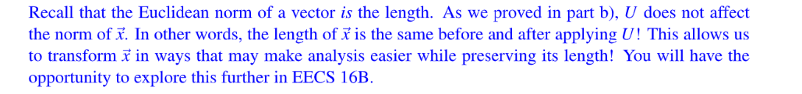

# Least Square
## When to use?
> 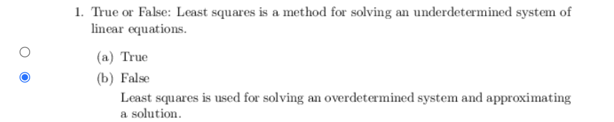


## Uniqueness
> 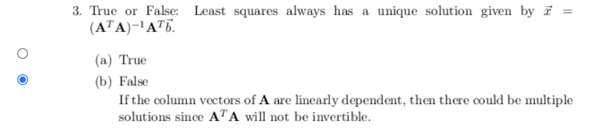
> 此时我们只能通过高斯消元解$A^TA\hat{x}=A^T\vec{b}$。


## Orthogonality
### Finding Coefficients
> 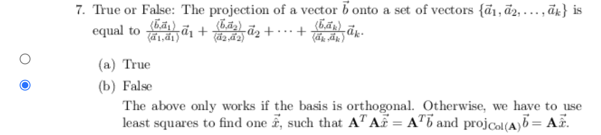


### Error Vector Orthogonality
> 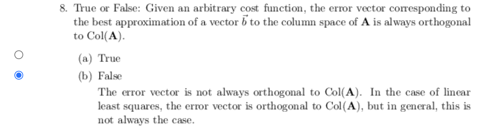


## Cost Function
> 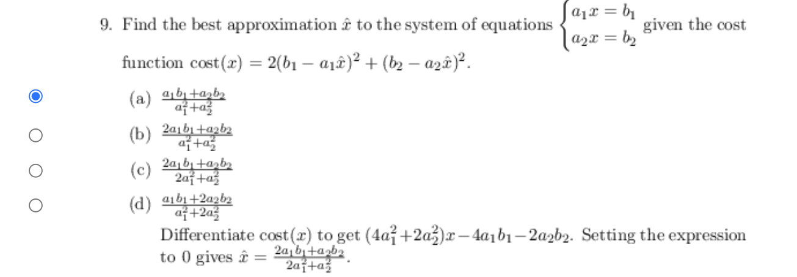
> 正常情况下$\begin{bmatrix} a_1\\a_2\end{bmatrix}x=\begin{bmatrix} b_1\\b_2\end{bmatrix}$的`Cost Function`是$(b_1-a_1x)^2+(b_2-a_2x)^2$, 此时$\hat{x}=\frac{a_1b_1+a_2b_2}{a_1^2+a_2^2}$。


## Linear Regression
> 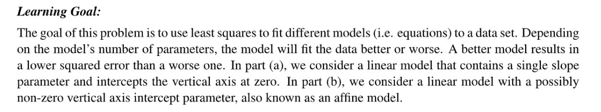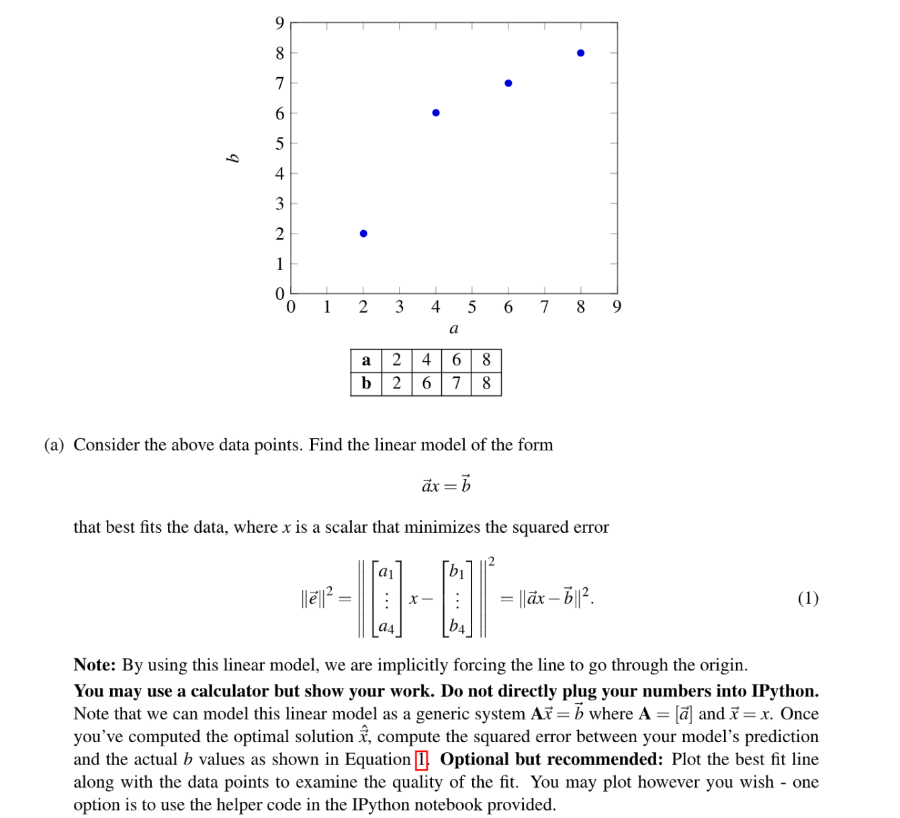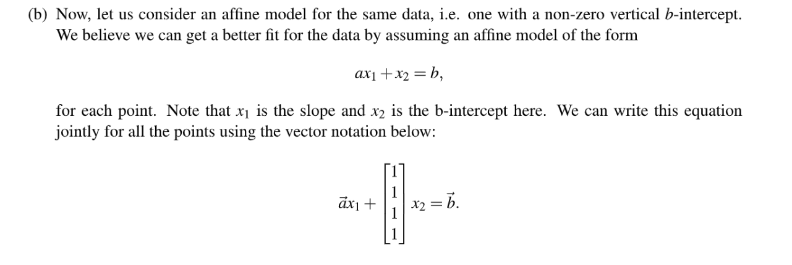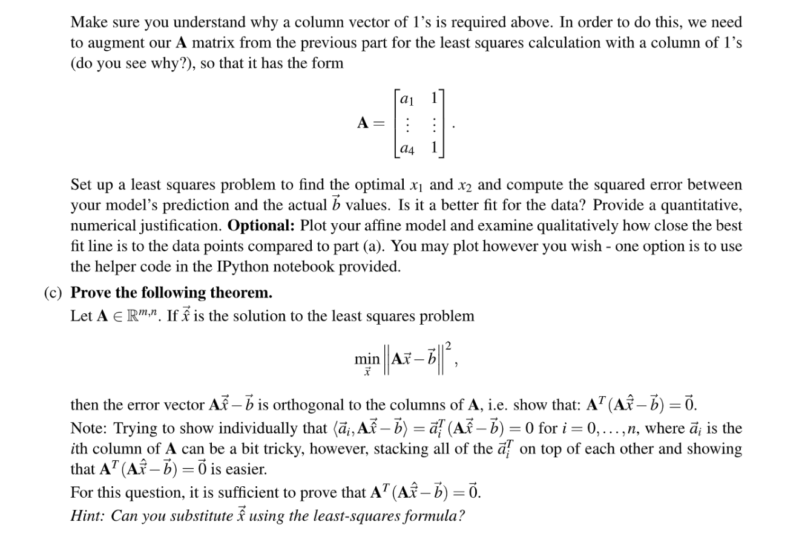

**Problem (a) Linear Model**本质上我们的模型是$y=kx$, 也就是假设`Regression Line`是过原点的。
这里$(x,y)$的点有四个，于是我们可以得到一个$\mathbf{A}\vec{k}=\vec{b}$的方程组，其中$\mathbf{A}=\begin{bmatrix} 2\\4\\6\\8\\\end{bmatrix}$, $\vec{b}=\begin{bmatrix} 2\\6\\7\\8\\\end{bmatrix}$
这里$\mathbf{A}$只有一列，所以可以用$\vec{a}$表示。这里$\vec{k}$也只有一个元素，所以方程组可以变为$\vec{a}k=\vec{b}$。
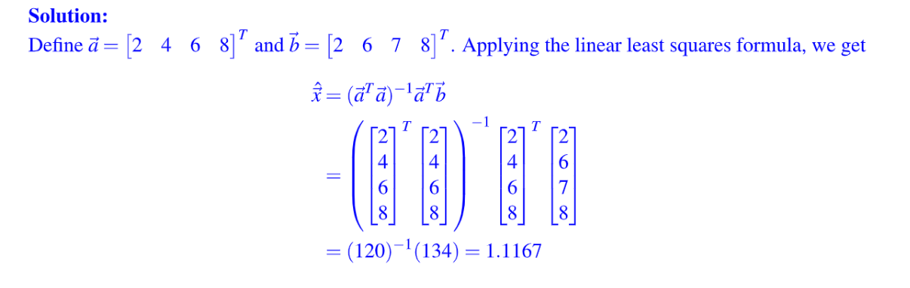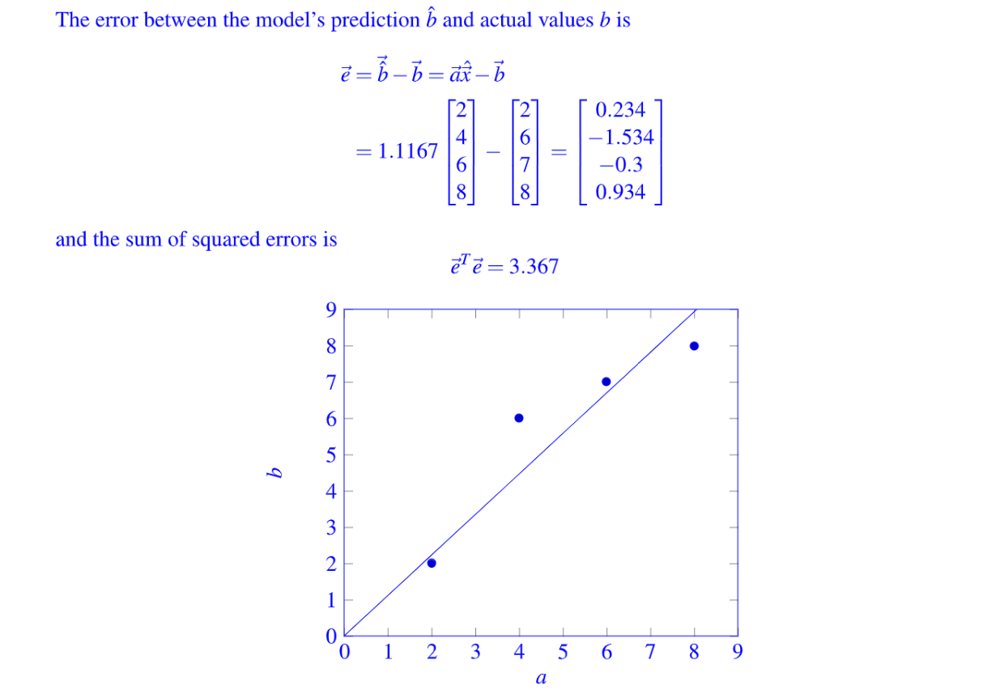
```python
from __future__ import division
%pylab inline
import numpy as np
import matplotlib.pyplot as plt
import scipy.io
import sys

# use for plotting
a = np.array([2,4,6,8])
b = np.array([2,6,7,8])

# find a linear model of the form:   b = xa
# According to the least squares formula, we can calculate x
# xhat =(a.T*a)^(-1)*a.T*b
xhat = (1/np.dot(a,a))*np.dot(a,b)
print('xhat: '+str(xhat))
bhat = xhat*a

# Calculate squared error
se = np.dot(b-bhat,b-bhat)
print('the squared error is '+str(se))


# Example for how to calculate squared error:
#se = np.dot(b-bhat,b-bhat)
#print('the squared error is '+str(se))


#HERE IS HOW TO PLOT POINTS
plt.plot(a,b,'ob') 
#HERE IS HOW TO PLOT A LINE
plt.plot(a,bhat,'-r')
#HERE IS HOW TO CHANGE THE LIMITS OF THE PLOTTING WINDOW
plt.xlim([0,9]); plt.ylim([0,9]);
```
**Problem (b) Affine Model**这个模型没有过原点的假设，形如$y=kx+b$。
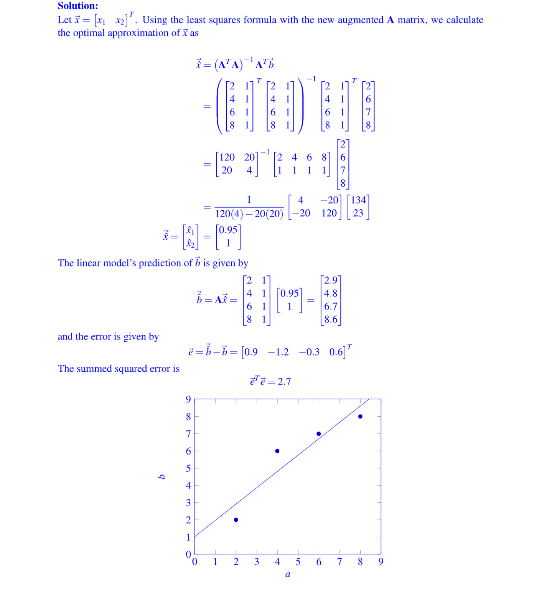
```python
# use for plotting
a = np.array([2,4,6,8])
b = np.array([2,6,7,8])

# The augmented A matrix is given by
a2 = a.copy()
b2 = b.copy()
A2 = np.vstack([a2,np.ones(len(a2))]).T
print('The augmented A matrix is')
print(A2)
# by the least squares formula we can calculate xhat
xhat2 = np.dot(np.linalg.inv(np.dot(A2.T,A2)),np.dot(A2.T,b2))
print('xhat:')
print(xhat2)
# The squared error is given by
bhat2 = np.dot(A2,xhat2)
se2 = np.dot(b2 - bhat2,b2-bhat2)
print('the squared error is '+str(se2))
```
**Problem (c) Theorem Proof**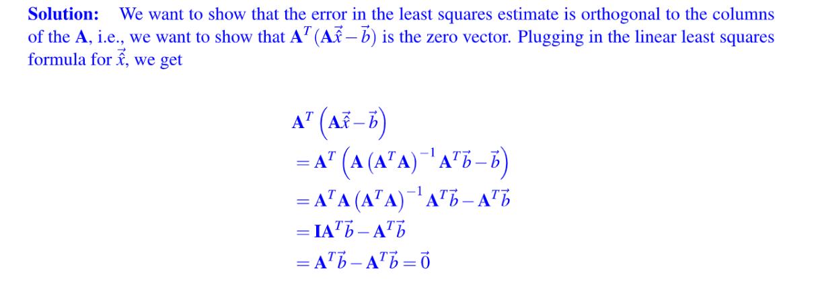


## Polynomial Fitting
> 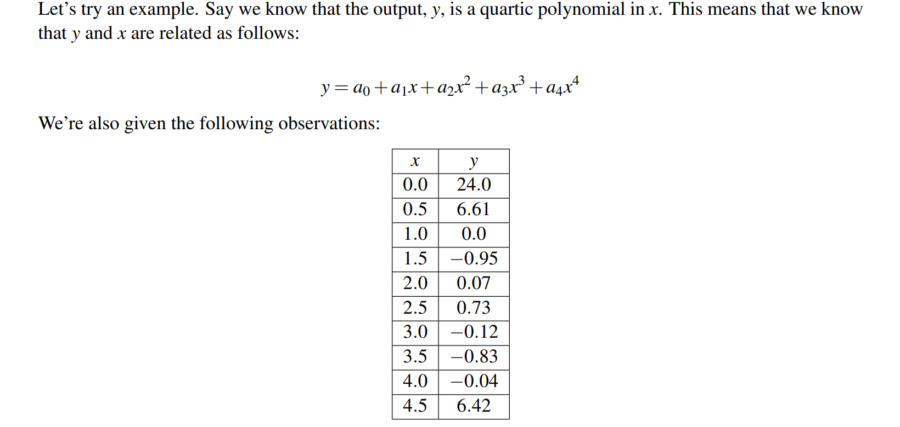

**Problem**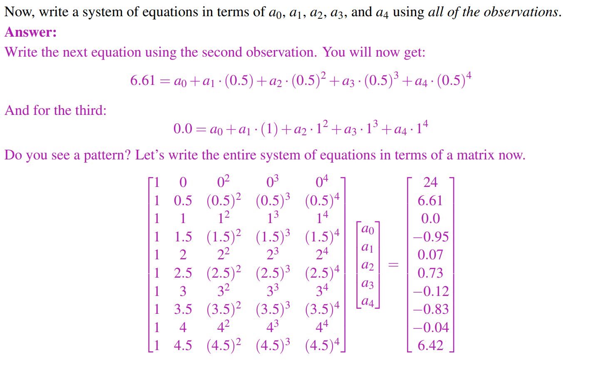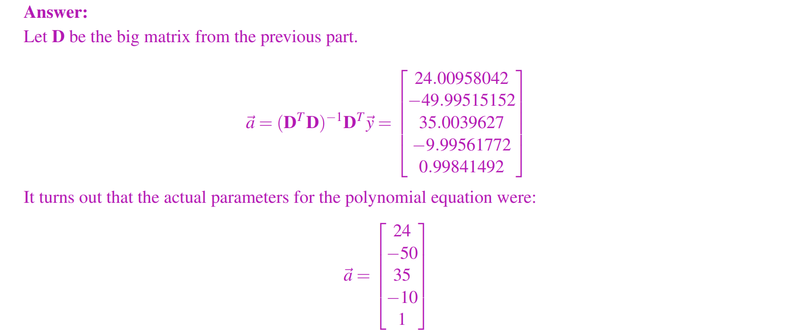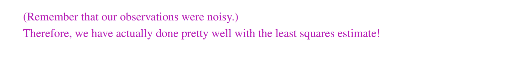


# Can we use Least Square?
## Yes Case
> 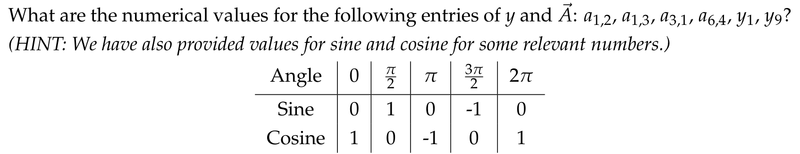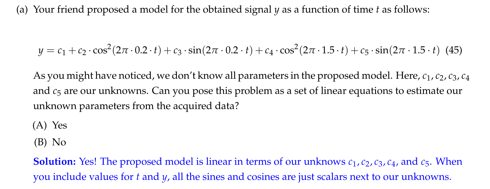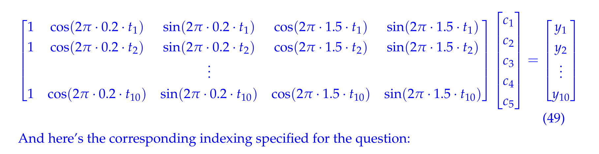


## No Case
> 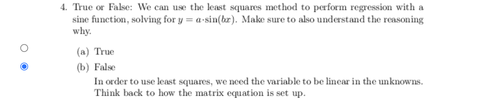


# Resources
## HW13 sp23
[prob13.pdf](https://www.yuque.com/attachments/yuque/0/2023/pdf/12393765/1688444910562-9faaffa7-0711-43f5-b8f8-251573b6968f.pdf)
[sol13.pdf](https://www.yuque.com/attachments/yuque/0/2023/pdf/12393765/1688444910561-0aa957da-2a72-490c-a507-45ec9368b2ec.pdf)

## HW13 fa20
[prob13.pdf](https://www.yuque.com/attachments/yuque/0/2023/pdf/12393765/1688444910563-142a7827-32ec-4ead-8825-f5380b2c9a7f.pdf)
[sol13.pdf.pdf](https://www.yuque.com/attachments/yuque/0/2023/pdf/12393765/1688444910570-a1d7fe3d-43ea-44b8-a786-e56b1d950e13.pdf)

