[Note24.pdf](https://www.yuque.com/attachments/yuque/0/2023/pdf/12393765/1685198871600-ef19f11a-7523-45c8-a65e-7b6718eef2ed.pdf)
[Written_Notes23_2.pdf](https://www.yuque.com/attachments/yuque/0/2023/pdf/12393765/1685362412260-0df3bd80-2b2d-43da-b5ad-0bd2bc044a36.pdf)
[Written_Notes24.pdf](https://www.yuque.com/attachments/yuque/0/2023/pdf/12393765/1685362379776-6b1d94d8-8fbe-46d6-9233-c79fb76a50f2.pdf)
[Written_Notes24_2.pdf](https://www.yuque.com/attachments/yuque/0/2023/pdf/12393765/1685362379840-94dcaa4f-4e48-4d67-9a3d-1222bddb228e.pdf)

# Smart City Example
## Basic Concepts
> 假设有$10000$个信号源, 每个信号源发出的信号为$\vec{s_i}\in \mathbb{R}^{1023}$，我们收到了$\vec{r}=\alpha_1\vec{s_1}+\alpha_2\vec{s_2}+\cdots+\alpha_{1000}\vec{s_{1000}}$，其中$\alpha_i$**可能代表了一些有用的信息**(The senders can each multiply their code by a scalar to **encode additional information**. For example, each beacon could tell the receiver the temperature at its location by **multiplying its code by the temperature(温度信息)**. (This could be helpful in determining which parts of the walls or doors need more insulation).  )
> 所以现在我们需要求出$\alpha_i$(Informative Messages)。
> **方法一: **使用矩阵代数，我们有$\begin{bmatrix} \vec{s_1} & \vec{s_2} &\cdots \vec{s_{10000}}\end{bmatrix}\vec{\alpha}=\vec{r}$, 写成矩阵形式$\mathbf{S}\vec{\alpha}=\vec{r}$, 其中$\mathbf{S}\in \mathbb{R}^{1023\times 10000}$, $\vec{\alpha}\in \mathbb{R}^{10000}$, $\vec{r}\in \mathbb{R}^{1023}$，但是很明显此时$\vec{\alpha}$的解不唯一，所以我们需要更多信息。
> **方法二: **利用一些信号间的特殊关系:
> 1. 假设$\vec{s_i}$是`Glod Codes`, 也就是$\langle \vec{s_i},\vec{s_j}\rangle=\begin{cases}small&i\neq j\\large&i=j \end{cases}$。
> 2. $\alpha_i$大多数时候是零，比如如果$\alpha_i$代表的是`sender`$i$处的风速，则$\alpha_i$大多数时间是零。我们称此时的$\vec{\alpha}$是`Sparse Vector`。($\vec{\alpha}$is k-sparse if there are at most k non-zero elements)。

## Example - Using Inner Product
> 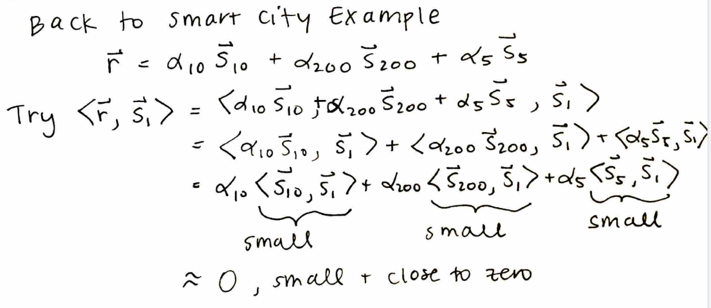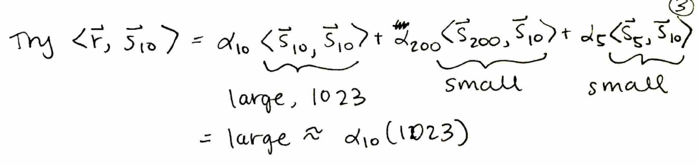

# Orthogonal Matching Pursuit
## Problem Setting
> `OMP`主要帮助我们使用迭代的方法来解决$\mathbf{A}\vec{x}=\vec{b}$$\mathbf{A}=\begin{bmatrix} \vec{a_1}&\vec{a_2}&\cdots &\vec{a_n}\end{bmatrix}\in \mathbb{R}^{m\times n}$, 其中我们假设:
> 1. $m<n$, more columns then rows.
> 2. $\vec{x}$is sparse. (Mostly zero).
> 3. $\langle \vec{a_i},\vec{a_j}\rangle=0$Columns are "nearly" orthongal.
> 4. $\|\vec{a_1}\|=\|\vec{a_2}\|=\cdots=\|\vec{a_n}\|$

## Algorithm
> 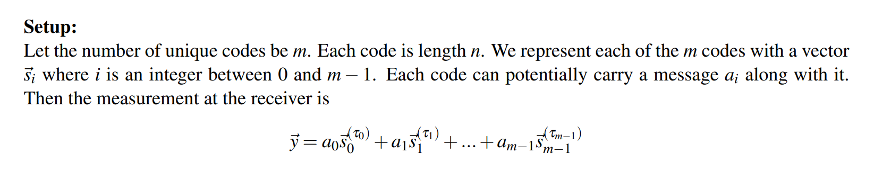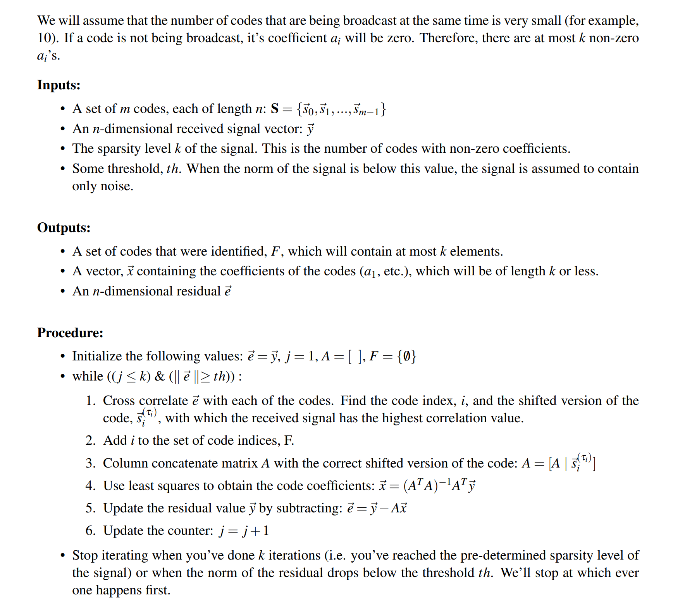

## Geometric Explanations
### Setup
> 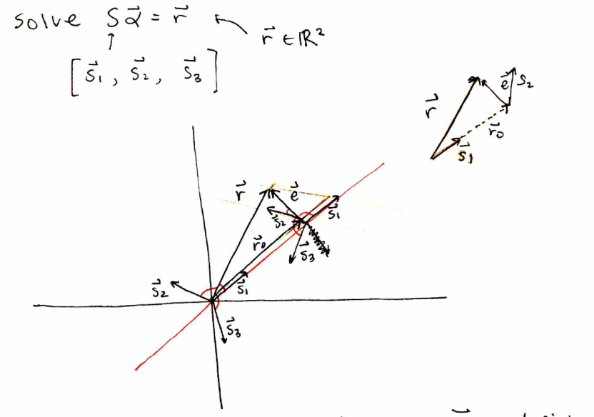

### Iteration 1
> 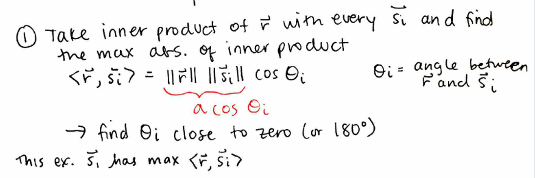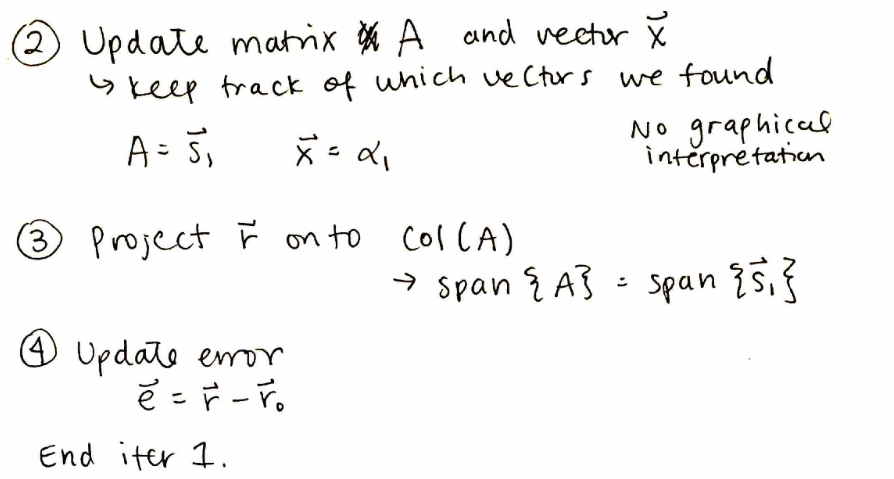

### Iteration 2
> 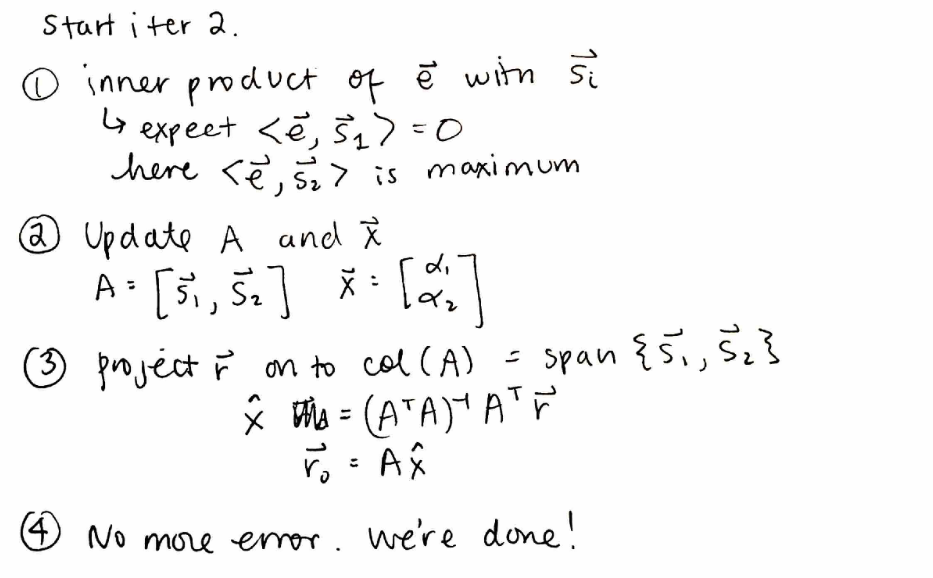

# OMP with Delays
> See Lecture Note 24 for delays that is known.
> See Written Note 24_2 for delays that is unknown.
> 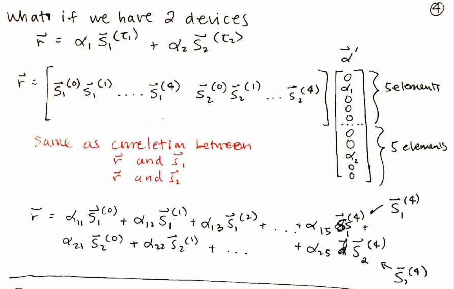

# Sparse Imaging
> 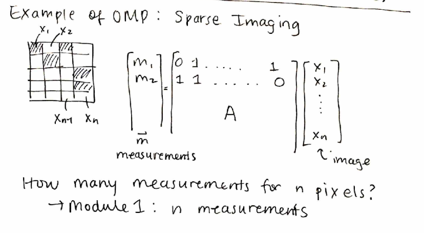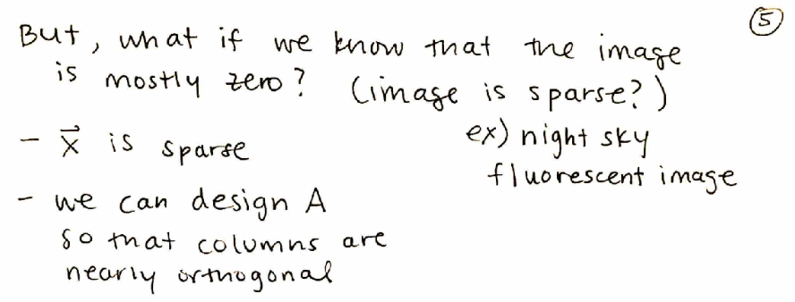

