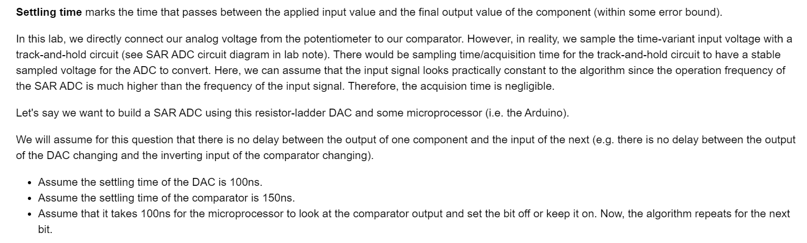

# Concepts
## Digital-Analog Converter(DAC)
> **From EECS16A**
> 本质上说，`DAC`就是将数字转化为电压。
> 

**Solution 1 - Using Circuit Equivalence**
**Solution 2 - Using Circuit Analysis or Superposition**
> 总的来说，使用`Superposition`可以更简单方便地得到$V_{out}$的结果和$V_s$之间的关系。
> 对于一个`DAC Circuit`来说，从左到右是`LSB`到`MSB`，令其为$b_0,b_1,b_2$, 则:
> 1. $b_0,b_1,b_2=0,0,1$时，$V_{out}=\frac{V_s}{2}$。
> 2. $b_0,b_1,b_2=0,1,0$时，$V_{out}=\frac{V_s}{4}$。
> 3. $b_0,b_1,b_2=1,0,0$时，$V_{out}=\frac{V_s}{8}$。
> 
**其余所有的情况，都是上面的线性组合，对应的就是**`**Superposition**`**的原则:**
> 1. 一个`N-bit DAC`的最大输出电压为$\frac{2^N-1}{2^N}V_{ref}$, 其中$V_{ref}$为`DAC`的源电压。
> 2. `DAC`电压的输出精度取决于`Bit`的数量， `Bit`数量越多，电压表示越精确。


## SAR ADC
> **HW02 Fa21 P6**
> `ADC`实际上是`DAC`的一个逆向操作，也就是把电压转化为二进制表示。使用的方法是二分搜索。基本逻辑如下:
> 假设我们有一个输入电压$V_{in}$和一个`3-bit DAC`(源电压为$V_{ref}$), 则我们从`MSB`开始, 设置当前的`bit`为`1`, 利用`DAC`计算$b_0,b_1,b_2=0,0,1$对应的电压$\frac{V_{ref}}{2}$, 如果$\frac{V_{ref}}{2}>V_{in}$, 则表明$b_2$不能是$1$, 于是设置$b_2$为零，否则设置$b_2$为$1$，继续下一个`bit`。
> 本质上是几个连续的二分操作，用于判断当前的`Bit`是否应该被设置成$0$或者$1$。
> 

**(a) Reverse Engineering**
**(b) SAR Output**


## Settling Time
> 


## Precision
> 假设`N-bit DAC`的输入电压$V_{REF}=5V$, 则`DAC`所能达到的最大精度是$\frac{5V}{2^N}$的单位。
> 当$N\in [1,2]$时，最大精度是$\frac{5}{2^2}$的单位，即$V$。
> 当$N\in [3,5]$时，最大精度是$\frac{5}{2^5}$的单位，即$0.1V$。
> 当$N\in [6, 8]$时，最大精度是$\frac{5}{2^8}$的单位，即$0.01V$。
> 当$N\in [9,12]$时，最大精度是$\frac{5}{2^{12}}$的单位, 即$0.001V$, 也就是$mV$。
> 当$N\geq 13$时，最大精度就小于$0.0001V$了。
> 
> 所以上述情形中，我们知道$N$最多不能超过$12$。
> 


## Breadboard Components
> 


# Building DAC
## 3-bit DAC
> 
> 其中，$8$号引脚对应的是`LSB`, $13$号引脚对应的是`MSB`，$12$号引脚对应的是中间位。
> 每个引脚对应的高电压`HIGH`是$5V$, `LOW`是$0V$。
> 在输出的过程中

```cpp
/* Set the serial connection speed */
#define BAUD_RATE       9600

/* Set which bits correspond to which pins */
#define BIT_3          	7
#define BIT_2           8
#define BIT_1           12
#define BIT_0           13
#define READ_PIN        A0

/* Set number of bits */
#define BITS            3

/* Set how long to delay in between digital outputs */
#define DELAY           1000


int val = 0;
int added = 1;
int loop_counter = 0;
int plot_flag = 1;
int steps = 10;
float input_voltage = 5.0;
float max_voltage;
float conversion_factor;

void setup()
{
  // Start a serial connection to send data to the computer
  Serial.begin(BAUD_RATE);

  // Set pins to output mode
  pinMode(BIT_3, OUTPUT);
  pinMode(BIT_2, OUTPUT);
  pinMode(BIT_1, OUTPUT);
  pinMode(BIT_0, OUTPUT);
  pinMode(READ_PIN, INPUT);
  max_voltage = input_voltage*((1<<BITS) - 1)/(1<<BITS);
  conversion_factor = calibrate();

}

void loop()
{
   int max_loops = get_max_loops();

  // Calibrate sensor values to actual voltages

  int start_loop = millis();
  // If LSB is set in val, turn bit0 high
  if (val & 1)
    digitalWrite(BIT_0, HIGH);
  else
    digitalWrite(BIT_0, LOW);

  // If bit 1 is set in val, turn bit1 high
  if (val & 2)
    digitalWrite(BIT_1, HIGH);
  else
    digitalWrite(BIT_1, LOW);

  // If bit 2 is set in val, turn bit2 high
  if (val & 4)
    digitalWrite(BIT_2, HIGH);
  else
    digitalWrite(BIT_2, LOW);


  if (BITS == 4){
    // If bit 3 is set in val, turn bit3 high
    if(val & 8)
    digitalWrite(BIT_3, HIGH);
    else
    digitalWrite(BIT_3, LOW);

    // Range of values is 0 to 15 for 4 bit DAC
    if(val == 15)
    added = -1;
  }


  if (BITS == 3){
    // Range of values is 0 to 7 for 3 bit DAC
    if (val == 7)
      added = -1;
  }


  if (val == 0)
    added = 1;

  val = val + added;


  // Plot results
  if (loop_counter == 0 && plot_flag != 1){
    Serial.println("Values: ");
    Serial.print("[");
  }


  if (loop_counter<max_loops){
    plot();
  }

  loop_counter += 1;

  if (loop_counter == max_loops && plot_flag != 1){
    Serial.println("0.0000000000]");
    loop_counter = 0;
  }

  delay(DELAY);
  //Serial.print("loops: ");
  //Serial.println(loop_counter,DEC);

}


float calibrate() {
  digitalWrite(BIT_0, HIGH);
  digitalWrite(BIT_1, HIGH);
  digitalWrite(BIT_2, HIGH);
  digitalWrite(BIT_3, HIGH);
  delay(100);
  float max_sensor = analogRead(READ_PIN);
  digitalWrite(BIT_0, LOW);
  digitalWrite(BIT_1, LOW);
  digitalWrite(BIT_2, LOW);
  digitalWrite(BIT_3, LOW);
  return max_voltage/max_sensor;
}

void plot() {
  float v_out_int = analogRead(READ_PIN);
  float v_out = v_out_int*conversion_factor;
  if (plot_flag == 1) {
    for (int i = 0; i < steps; i+=1) {
  		Serial.println(v_out,DEC);
  	}
  } else {
  	for (int i = 0; i < steps; i+=1) {
      Serial.print(v_out, DEC);
      Serial.print(", ");
    }
  }
}

int get_max_loops(){
    if (BITS == 3){
      return 15;
    }
    else if (BITS == 4){
      return 31;
    }
}
```
**Output**在串行监视器中我们会得到$8$种电压输出，分别对应了$\frac{0 ,1,2,\cdots,(2^3-1)}{2^3}\cdot 5V$的$8$种结果。


## 4-bit DAC
> 

**Output**在串行监视器中我们会得到$16$种电压输出，分别对应了$\frac{0 ,1,2,\cdots,(2^4-1)}{2^4}\cdot 5V$的$16$种结果。


# Building ADC
## 电位器(Potentiometer)
> 本质上就是一个滑动变阻器，然后利用`Voltage Divider`性质输出一个可变电压。
> 


## 4-bit ADC Design
> 


## Plotting Results
### Oscilloscope Figure
> 


### 1.88V~2V: 0110
> 


### 2.51V~2.69V: 1000
> 


### Explanations
> 可以看到，当`Comparator`是$1$时，当前的`Bit`被设置为$1$, 否则设置为$0$。
> 


# Resources
> HW02/Lab03 Fa21
> Lab Note 2 Su22
> **Starter Circuit: **[https://www.tinkercad.com/things/aQLH6Ie8W9q](https://www.tinkercad.com/things/aQLH6Ie8W9q)
> [https://www.electronics-tutorials.ws/combination/r-2r-dac.html](https://www.electronics-tutorials.ws/combination/r-2r-dac.html)

