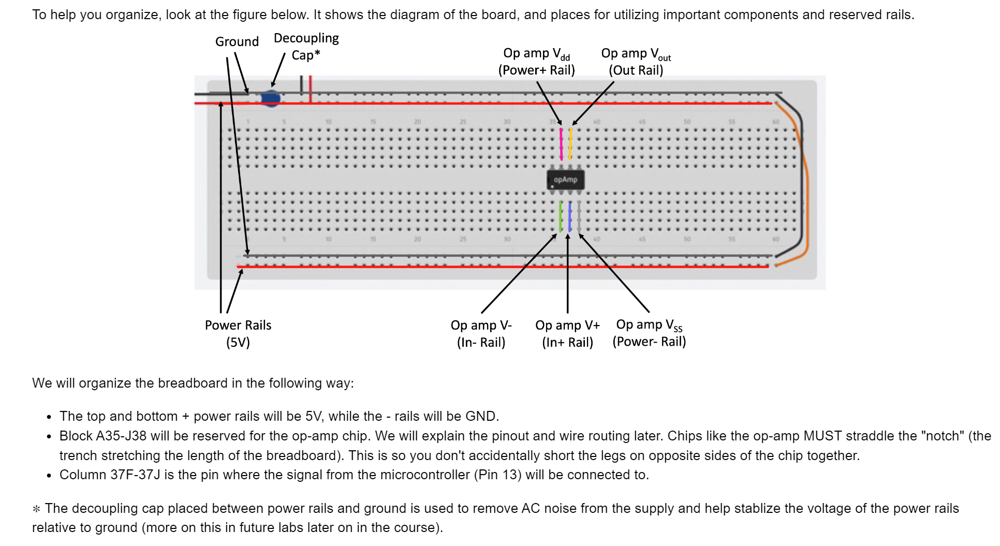
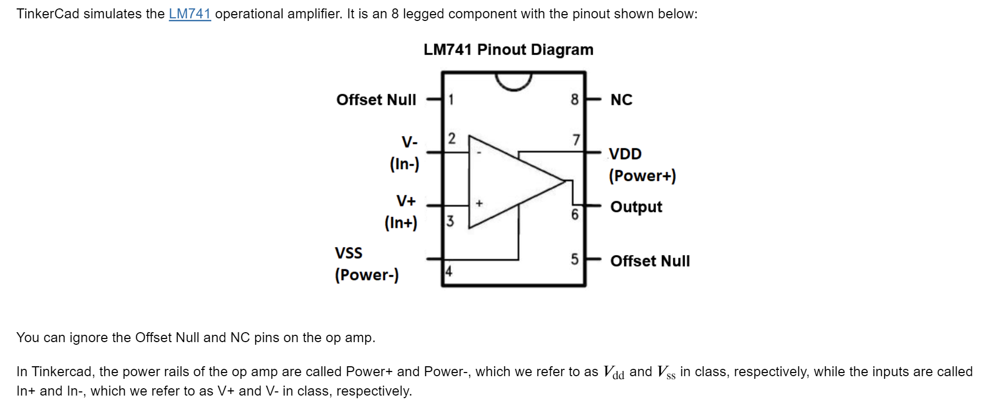
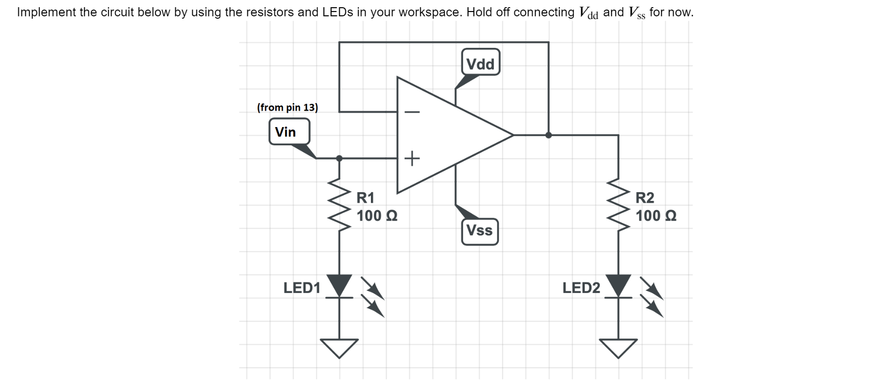
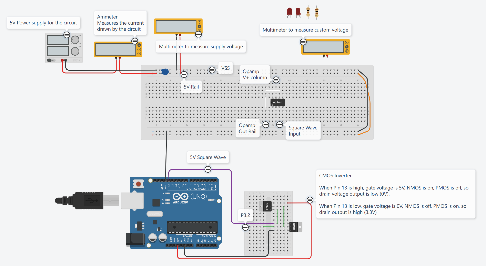
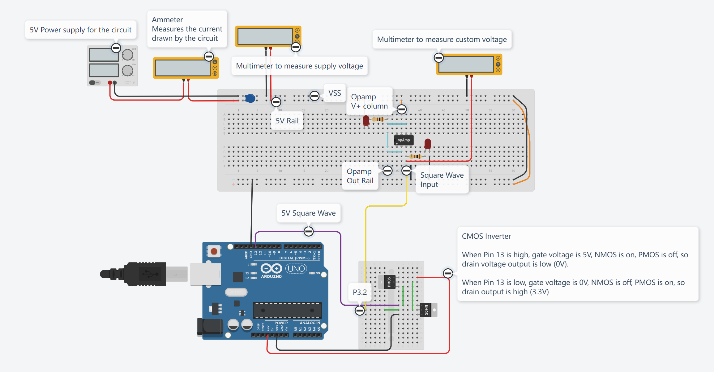
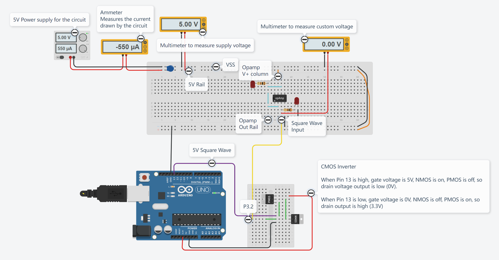
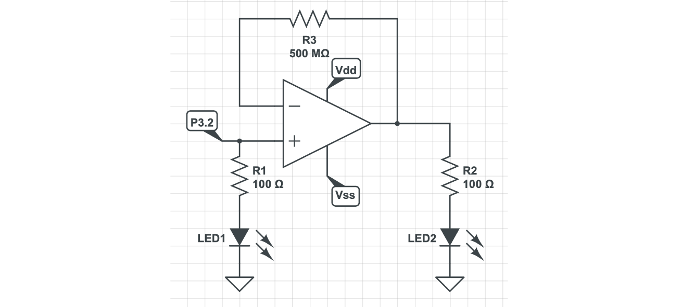
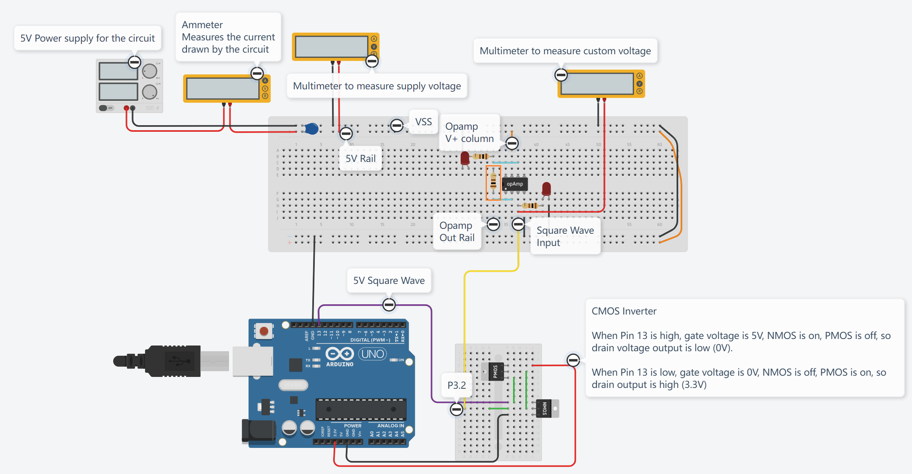

# Guidelines
## Breadboard Input
> 

## Circuit Guidelines
> #### General Circuit Rules
> - Make sure you use consistent colors for ground, power voltages, etc. Black is usually reserved for GND, and red for power.
> - Try not to have any excessively long wires; shorten them so that it's easier to follow and debug later.
> #### Tinkercard Tips
> - Pay attention to how the two supply multimeters are connected, and connect the third unconnected meter appropriately to measure the signal of interest.
> - For easier readability of your layout, when creating wires, it is possible to add bends by "clicking their path". Try to avoid crossing wires as much as you can for better visualization, and use different colors for different signals if possible.
> - _DO NOT connect multiple wires or component legs to the same hole._ Tinkercad lets you do this, but this is physically impossible to do on a real breadboard, so do not do this.
> - Make sure your components like resistors go into holes on the breadboard, and _DO NOT have any legs dangling in empty space._ Tinkercad will let you have floating components, but you can't physically do this with real hardware, so don't do this.
> #### Circuit Power Rails
> - The + and - rails are reserved for power and GND, respectively. Avoid connecting any other signals to those rails.
> - _Make sure all voltage supplies have the same reference voltage. _They should all have their negative terminals connected to the negative power rail (-), which is GND.
> - The + and - long rails on the sides of the breadboards are not connected to their corresponding rail on the other side. Make sure to ALWAYS connect your - rails so that both sides of the breadboard have easy access to GND. Do not connect your + rails unless you want them to carry the same voltage.
> #### LEDs are polarized!
> - Note that LEDs have polarity, meaning the direction you plug it into the circuit matters.
> - The anode (+) is the longer/crooked leg of the LED, while the cathode (-) is the shorter/straight leg of the LED.
> - If you reverse the direction of the LED, the current will not be able to flow and the LED will not light up.
> 

# OpAmp Structure
> 

# Circuit Implementations
> 

**Starter Circuit**
**Implemented**

# Test the Circuit
## Circuit
> 

## Logic High Input
> 

## Logic Low Input
> 

## Summary
> 我们发现，这个`OpAmp with negative Feedback`起到了`Buffer Voltage`的作用，使得两个电灯泡都能达到其额定电压$3.3V$而正常工作，不会互相产生`Loading Effect`导致电压不足的问题。

# Modify the Circuit
> 
> 此时结果不变，因为没有电流流经$R_3$。

# Resources
> **Lab 01 Fa21**
> **Helper Videos: **[https://www.youtube.com/playlist?list=PLhIxXDRJ9_VqxwlybfFHzihu1e3-Ll433](https://www.youtube.com/playlist?list=PLhIxXDRJ9_VqxwlybfFHzihu1e3-Ll433)
> **Starter Circuit:** [https://www.tinkercad.com/things/aPn81WrSueB](https://www.tinkercad.com/things/aPn81WrSueB)

